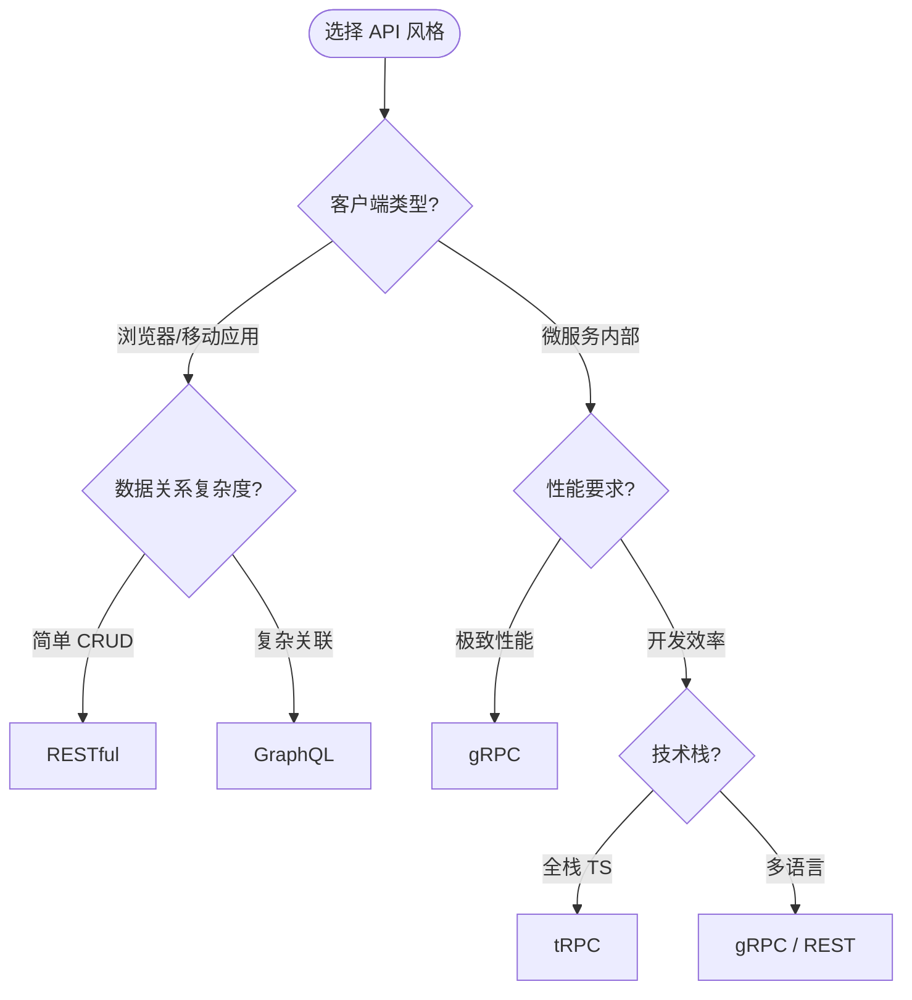
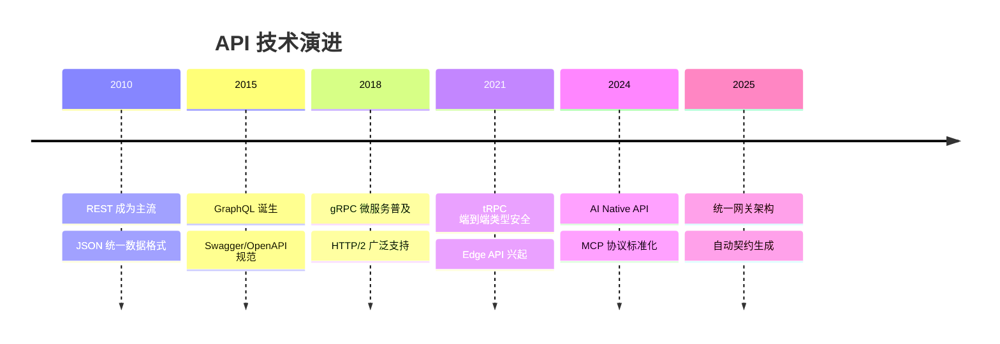

# 🔌 API 设计示例

> 现代 API 设计的完整实战指南，从 RESTful 规范到类型安全的 RPC 方案，覆盖四种主流 API 风格的全面对比。

## 学习路径


## API 风格全景对比

| 维度 | REST | GraphQL | gRPC | tRPC |
|------|------|---------|------|------|
| **传输协议** | HTTP/1.1 | HTTP/1.1 + SSE | HTTP/2 | HTTP/1.1 或 HTTP/2 |
| **数据格式** | JSON | JSON | Protocol Buffers | JSON |
| **类型安全** | 运行时 (OpenAPI) | Schema 定义 | 编译时 (.proto) | 编译时 (TypeScript) |
| **查询灵活性** | 固定端点 | 客户端驱动查询 | 固定 RPC | 固定 RPC |
| **性能** | 中 | 中（N+1 风险） | 高（二进制） | 中 |
| **适用场景** | 通用 Web API | 复杂数据关系 | 微服务内部通信 | 全栈 TypeScript |

## 核心设计原则

### RESTful API

- **资源导向**：URL 表示资源，HTTP 方法表示操作
- **状态无感知**：每个请求包含完整上下文
- **统一接口**：GET / POST / PUT / PATCH / DELETE 语义一致
- **版本化策略**：URL 版本 (`/v1/`) 或 Header 版本

### GraphQL

- **Schema 优先**：强类型契约，自文档化
- **精确查询**：客户端决定返回字段，避免过度获取
- **Resolver 模式**：每个字段独立解析，支持复杂数据组合
- **订阅机制**：实时更新 via WebSocket / SSE

### gRPC

- **Protocol Buffers**：紧凑二进制序列化，跨语言兼容
- **流式通信**：Unary / Client Streaming / Server Streaming / Bidirectional
- **拦截器链**：认证、日志、重试的统一处理
- **服务网格集成**：Istio、Linkerd 原生支持

### tRPC

- **端到端类型安全**：前端调用即获得 TypeScript 类型推断
- **零配置客户端**：无需代码生成，共享 Router 定义
- **订阅支持**：WebSocket 实时通信
- **Next.js 深度集成**：API Routes + App Router 原生支持

## 示例目录

| 主题 | 文件 | 难度 |
|------|------|------|
| REST vs GraphQL vs gRPC vs tRPC 实战对比 | [查看](./rest-graphql-grpc-comparison.md) | 中级 |

## 与理论专题的映射

| 示例 | 理论支撑 |
|------|---------|
| [API 风格对比](./rest-graphql-grpc-comparison.md) | [应用设计理论](/application-design/) — API 设计模式、分层架构 |
| RESTful 规范 | [模块系统](/module-system/) — 接口契约、版本化管理 |
| GraphQL Schema | [TypeScript 类型系统](/typescript-type-system/) — 类型驱动开发 |
| gRPC 流式通信 | [编程范式](/programming-paradigms/) — 并发模型、流处理 |

## 参考资源

- [RESTful API Design Best Practices](https://docs.microsoft.com/en-us/azure/architecture/best-practices/api-design)
- [GraphQL Specification](https://spec.graphql.org/)
- [gRPC Documentation](https://grpc.io/docs/)
- [tRPC Documentation](https://trpc.io/docs)
- [OpenAPI Specification](https://swagger.io/specification/)

---

## RESTful API 设计深度指南

### 资源命名规范

```
GET    /users              # 列表查询
GET    /users/{id}         # 单个查询
POST   /users              # 创建
PUT    /users/{id}         # 全量更新
PATCH  /users/{id}         # 部分更新
DELETE /users/{id}         # 删除
GET    /users/{id}/orders  # 子资源查询
```

### 状态码使用矩阵

| 场景 | 状态码 | 说明 |
|------|--------|------|
| 创建成功 | 201 Created | 返回新资源 Location |
| 删除成功 | 204 No Content | 无返回体 |
| 参数错误 | 400 Bad Request | 详细错误列表 |
| 认证失败 | 401 Unauthorized | 需重新登录 |
| 权限不足 | 403 Forbidden | 无访问权限 |
| 资源不存在 | 404 Not Found | 路径或 ID 错误 |
| 冲突 | 409 Conflict | 资源已存在 |
| 服务端错误 | 500 Internal Error | 记录 Trace ID |

### 分页与过滤

```
GET /users?page=2&limit=20&sort=-createdAt&filter[role]=admin
```

### 版本化策略对比

| 策略 | 示例 | 优点 | 缺点 |
|------|------|------|------|
| URL 路径 | `/v1/users` | 直观、易缓存 | URL 污染 |
| Header | `Accept-Version: v1` | URL 干净 | 不易调试 |
| 内容协商 | `Accept: application/vnd.api.v1+json` | REST 纯正 | 复杂度高 |

---

## GraphQL Schema 设计最佳实践

### 类型系统核心

```graphql
type User {
  id: ID!
  name: String!
  email: String!
  orders: [Order!]!  # 非空列表，元素非空
  createdAt: DateTime!
}

type Query {
  user(id: ID!): User
  users(filter: UserFilter, pagination: PaginationInput): UserConnection!
}

type Mutation {
  createUser(input: CreateUserInput!): CreateUserPayload!
}
```

### N+1 问题与 DataLoader

GraphQL 的 Resolver 独立执行特性容易导致 N+1 查询：

```typescript
// 问题：查询 100 个用户时，会触发 100 次订单查询
const resolvers = {
  User: {
    orders: (user) => db.orders.find({ userId: user.id }) // × N 次
  }
};

// 解决：使用 DataLoader 批量加载
import DataLoader from 'dataloader';

const orderLoader = new DataLoader(async (userIds) => {
  const orders = await db.orders.find({ userId: { $in: userIds } });
  return userIds.map(id => orders.filter(o => o.userId === id));
});

const resolvers = {
  User: {
    orders: (user) => orderLoader.load(user.id) // 1 次批量查询
  }
};
```

### 查询复杂度限制

```graphql
# 使用深度限制和复杂度评分防止恶意查询
type Query @rateLimit(max: 100, window: "1m") {
  user(id: ID!): User @cost(complexity: 1)
  users: [User!]! @cost(complexity: 5)
}
```

---

## gRPC 与 Protocol Buffers

### 服务定义

```protobuf
syntax = "proto3";

service UserService {
  rpc GetUser(GetUserRequest) returns (User);
  rpc ListUsers(ListUsersRequest) returns (ListUsersResponse);
  rpc StreamUsers(StreamUsersRequest) returns (stream User);  // 服务器流
}

message GetUserRequest {
  string id = 1;
}

message User {
  string id = 1;
  string name = 2;
  string email = 3;
}
```

### 四种通信模式

| 模式 | 描述 | 适用场景 |
|------|------|---------|
| **Unary** | 单请求-单响应 | 普通 API 调用 |
| **Client Streaming** | 客户端流式发送 | 文件上传、批量日志 |
| **Server Streaming** | 服务端流式推送 | 实时通知、大数据下载 |
| **Bidirectional** | 双向流 | 聊天、实时协作 |

---

## tRPC 端到端类型安全

### Router 定义

```typescript
import { initTRPC } from '@trpc/server';
import { z } from 'zod';

const t = initTRPC.create();

export const appRouter = t.router({
  user: t.router({
    getById: t.procedure
      .input(z.object({ id: z.string() }))
      .query(({ input }) => {
        return db.user.findById(input.id);
      }),
    create: t.procedure
      .input(z.object({ name: z.string(), email: z.string().email() }))
      .mutation(({ input }) => {
        return db.user.create(input);
      }),
  }),
});

export type AppRouter = typeof appRouter;
```

### 客户端调用

```typescript
import { createTRPCReact } from '@trpc/react-query';
import type { AppRouter } from './server';

const trpc = createTRPCReact<AppRouter>();

// 自动获得类型推断：data 类型为 User | null
const { data } = trpc.user.getById.useQuery({ id: "123" });
```

---

## 选型决策树



---

## 安全规范

| 检查项 | REST | GraphQL | gRPC | tRPC |
|--------|------|---------|------|------|
| **认证** | Bearer Token / Cookie | 同 REST | TLS mTLS | 同 REST |
| **授权** | 中间件 | Resolver 级别 | Interceptor | Middleware |
| **限流** | IP / 用户级别 | 查询复杂度 | 连接级别 | 请求级别 |
| **输入校验** | Joi / Zod | Schema 内置 | Protobuf 类型 | Zod 集成 |
| **CORS** | 需配置 | 需配置 | 不适用（内部） | 需配置 |

---

## 性能基准

| 指标 | REST (JSON) | GraphQL | gRPC | tRPC |
|------|-------------|---------|------|------|
| **序列化大小** | 基准 (100%) | 90-110% | 30-40% | 100% |
| **序列化速度** | 中 | 中 | 极快 | 中 |
| **请求延迟** | 中 | 中（+解析） | 低 | 中 |
| **批量查询** | 多次请求 | 单次请求 | 流式 | 多次请求 |

---

## 参考资源

### 官方规范

- [RESTful API Design Best Practices](https://docs.microsoft.com/en-us/azure/architecture/best-practices/api-design)
- [GraphQL Specification](https://spec.graphql.org/)
- [gRPC Documentation](https://grpc.io/docs/)
- [tRPC Documentation](https://trpc.io/docs)
- [OpenAPI Specification](https://swagger.io/specification/)

### 工具与框架

- [Apollo Server](https://www.apollographql.com/docs/apollo-server/) — GraphQL 服务端
- [Prisma](https://www.prisma.io/) — 类型安全的数据库访问
- [Zod](https://zod.dev/) — TypeScript 模式验证
- [Postman](https://www.postman.com/) — API 测试工具

---

## 生产部署 checklist

### 发布前检查

- [ ] OpenAPI / GraphQL Schema 文档已更新
- [ ] 所有端点包含输入校验（Zod / Joi / Protobuf）
- [ ] 认证中间件覆盖所有受保护路由
- [ ] 速率限制已配置（基于 IP / 用户 / API Key）
- [ ] 错误响应包含 trace ID 便于排查
- [ ] CORS 配置限制为生产域名
- [ ] 敏感接口启用审计日志
- [ ] 性能基准测试通过（P99 < 200ms）

### 监控告警

| 告警类型 | 阈值 | 响应时间 |
|---------|------|---------|
| 错误率突增 | > 1% (5min) | 立即 |
| P99 延迟 | > 500ms | 5 分钟 |
| 流量异常 | 同比 > 300% | 立即 |
| 证书过期 | < 7 天 | 每日检查 |

---

## 技术演进趋势



### AI Native API 设计

大模型时代的新型 API 模式：

- **Function Calling**：LLM 调用外部工具的标准化接口
- **Streaming Response**：SSE / WebSocket 实时返回生成内容
- **多模态输入**：文本 + 图像 + 音频的统一接口
- **Agent 编排**：多 Agent 协作的 API 网关

---

## 贡献指南

本示例遵循以下规范：

1. **Schema 优先**：API 设计从 Schema/契约开始
2. **类型安全**：所有示例使用 TypeScript + Zod
3. **可运行代码**：包含完整可执行的代码片段
4. **测试覆盖**：核心逻辑包含单元测试示例
5. **版本标注**：明确标注支持的框架版本

---

## 参考资源

### 社区与工具

- [Postman API Platform](https://www.postman.com/) — API 设计与测试
- [Insomnia](https://insomnia.rest/) — 开源 API 客户端
- [Hoppscotch](https://hoppscotch.io/) — 轻量级 Web API 客户端
- [Stoplight Studio](https://stoplight.io/studio) — OpenAPI 设计工具
- [GraphQL Playground](https://github.com/graphql/graphql-playground) — 交互式 GraphQL IDE

### 经典著作

- *API Design Patterns* — JJ Geewax
- *The Design of Web APIs* — Arnaud Lauret
- *GraphQL in Action* — Samer Buna
- *gRPC: Up and Running* — Kasun Indrasiri

---

## 实际案例分析

### 案例 1：电商平台的 API 演进

某电商平台从单体 REST API 演化为混合架构：

**阶段 1：纯 REST（2019）**

- 问题：移动端过度获取、多端适配困难
- 解决：引入 BFF（Backend for Frontend）层

**阶段 2：GraphQL 接入（2021）**

- 引入 Apollo Federation 聚合多个微服务
- DataLoader 解决 N+1 查询
- 查询复杂度限制防止资源耗尽

**阶段 3：内部 gRPC（2023）**

- 微服务间通信从 REST 迁移到 gRPC
- 延迟降低 60%，序列化开销减少 70%

**阶段 4：tRPC 全栈（2024）**

- 新内部管理后台采用 Next.js + tRPC
- 零 API 契约维护成本，类型安全端到端

### 案例 2：SaaS 多租户 API 设计

```typescript
// 多租户上下文中间件
interface TenantContext {
  tenantId: string;
  plan: 'free' | 'pro' | 'enterprise';
  rateLimit: number;
}

// 路由前缀包含租户标识
// GET /tenants/{tenantId}/users
// 数据库层自动添加 tenant_id 过滤
```

### 案例 3：AI Native API

```typescript
// OpenAI Function Calling 风格
interface Tool {
  name: string;
  description: string;
  parameters: z.ZodSchema;
}

const tools: Tool[] = [
  {
    name: 'getWeather',
    description: '获取指定城市的天气',
    parameters: z.object({
      city: z.string(),
      date: z.string().optional(),
    }),
  },
];
```

---

## 常见反模式

| 反模式 | 问题 | 解决方案 |
|--------|------|---------|
| **API 爆炸** | 端点数量无节制增长 | GraphQL 聚合或 BFF 层 |
| **版本地狱** | 多版本并行维护成本高昂 | 渐进式弃用 + 兼容性层 |
| **过度嵌套** | 深层资源路径难以维护 | 扁平化设计 + 查询参数 |
| **忽略缓存** | 重复查询拖垮数据库 | HTTP 缓存头 + CDN |
| **无限制查询** | GraphQL 查询导致 DoS | 复杂度限制 + 超时机制 |
| **类型不同步** | 前后端类型定义不一致 | tRPC / Codegen 自动生成 |

---

## 性能优化技巧

### REST 优化

```typescript
// 字段过滤：允许客户端选择返回字段
GET /users/123?fields=id,name,avatar

// 批量请求：一次获取多个资源
GET /users/batch?ids=1,2,3,4,5

// 压缩响应
Accept-Encoding: gzip, br
```

### GraphQL 优化

```graphql
# 使用 Fragment 减少重复
fragment UserFields on User {
  id name email avatar
}

query GetUsers {
  users {
    ...UserFields
    orders { id total }
  }
}
```

### gRPC 优化

```protobuf
// 流式批量处理减少往返
rpc BatchCreateUsers(stream CreateUserRequest)
  returns (stream CreateUserResponse);
```

---

## 测试策略

| 测试类型 | 工具 | 覆盖率目标 |
|---------|------|-----------|
| **契约测试** | Pact、Schemathesis | 100% 端点 |
| **集成测试** | Postman、Hoppscotch | 核心流程 |
| **性能测试** | k6、Artillery | P99 基线 |
| **安全测试** | OWASP ZAP、Burp Suite | 高危漏洞清零 |

---

## 参考资源

### 在线课程

- [API Design Fundamentals](https://frontendmasters.com/courses/api-design/) — Frontend Masters
- [GraphQL Server Development](https://www.pluralsight.com/courses/graphql-server-development) — Pluralsight
- [Building gRPC Services](https://www.coursera.org/learn/grpc-golang) — Coursera

### 开源项目

- [JSON:API](https://jsonapi.org/) — REST API 规范
- [GraphQL Code Generator](https://the-guild.dev/graphql/codegen) — 类型生成
- [Buf](https://buf.build/) — Protobuf 工具链
- [Prisma](https://www.prisma.io/) — ORM + 类型安全

### 标准规范

- [RFC 7231](https://tools.ietf.org/html/rfc7231) — HTTP/1.1 Semantics
- [RFC 7540](https://tools.ietf.org/html/rfc7540) — HTTP/2
- [RFC 9114](https://tools.ietf.org/html/rfc9114) — HTTP/3
- [GraphQL Spec](https://spec.graphql.org/) — GraphQL 规范
- [gRPC Status Codes](https://grpc.github.io/grpc/core/md_doc_statuscodes.html) — gRPC 状态码
