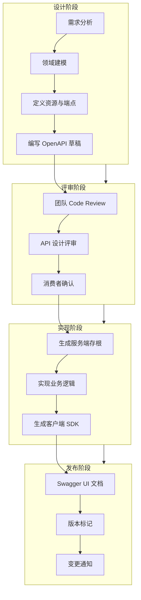
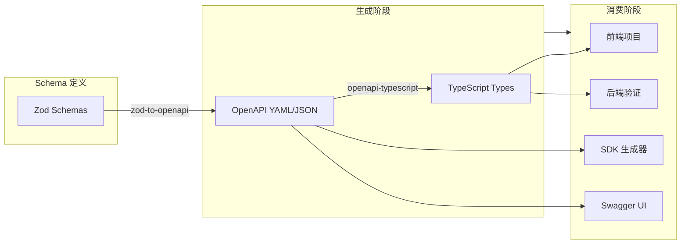
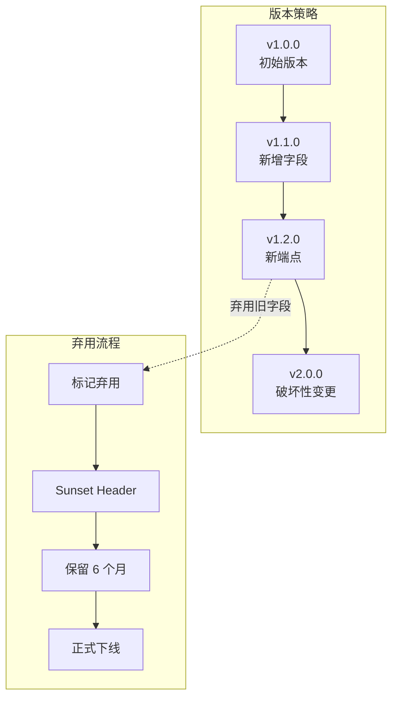
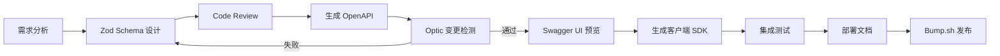

# OpenAPI 3.1 / Swagger 实战：从API设计到自动生成客户端SDK

在现代微服务架构中，API 不仅是系统间通信的桥梁，更是团队协作的契约。OpenAPI 3.1 作为当前最主流的 API 描述规范，结合 Swagger 生态工具链，能够构建从设计、文档、测试到 SDK 生成的完整闭环。本文将深入探讨如何在 TypeScript 技术栈中实践这一工作流。

## 目录

- [OpenAPI 3.1 / Swagger 实战：从API设计到自动生成客户端SDK](#openapi-31--swagger-实战从api设计到自动生成客户端sdk)
  - [目录](#目录)
  - [OpenAPI 3.1 规范结构深度解析](#openapi-31-规范结构深度解析)
    - [文档根结构与 Info 对象](#文档根结构与-info-对象)
    - [Paths 与 Operations](#paths-与-operations)
    - [Components 与可复用结构](#components-与可复用结构)
    - [Security Schemes 与认证设计](#security-schemes-与认证设计)
    - [API 设计工作流](#api-设计工作流)
  - [从 Zod Schema 生成 OpenAPI 文档](#从-zod-schema-生成-openapi-文档)
    - [使用 @asteasolutions/zod-to-openapi](#使用-asteasolutionszod-to-openapi)
    - [注册路由并生成 OpenAPI 文档](#注册路由并生成-openapi-文档)
    - [使用 openapi-typescript 生成类型](#使用-openapi-typescript-生成类型)
    - [Schema 驱动开发工作流](#schema-驱动开发工作流)
  - [Swagger UI 集成与文档托管](#swagger-ui-集成与文档托管)
    - [Express 集成方案](#express-集成方案)
    - [独立文档站点部署](#独立文档站点部署)
    - [文档版本化管理](#文档版本化管理)
  - [自动生成 TypeScript 客户端](#自动生成-typescript-客户端)
    - [使用 openapi-fetch](#使用-openapi-fetch)
    - [使用 Orval 生成完整客户端](#使用-orval-生成完整客户端)
    - [客户端生成对比](#客户端生成对比)
  - [API 版本管理与变更检测](#api-版本管理与变更检测)
    - [使用 Optic 进行变更检测](#使用-optic-进行变更检测)
    - [CI/CD 集成](#cicd-集成)
    - [使用 bump.sh 托管文档](#使用-bumpsh-托管文档)
    - [API 版本策略](#api-版本策略)
  - [总结与最佳实践](#总结与最佳实践)
    - [推荐工作流](#推荐工作流)
  - [参考资源](#参考资源)
  - [交叉引用](#交叉引用)

---

## OpenAPI 3.1 规范结构深度解析

OpenAPI 3.1 是基于 JSON Schema 2020-12 的超集，其核心结构由以下几个顶层字段构成：`openapi`、`info`、`servers`、`paths`、`components`、`security`、`tags`、`externalDocs`。理解这些结构的组织方式，是正确使用 OpenAPI 的基础。

### 文档根结构与 Info 对象

```yaml
openapi: 3.1.0
info:
  title: E-Commerce API
  description: |
    本文档描述了电商平台核心 API 的完整接口规范。
    包括商品管理、订单处理、用户认证等模块。
  version: 1.2.0
  contact:
    name: API Support Team
    email: api-support@example.com
    url: https://example.com/support
  license:
    name: MIT
    identifier: MIT
servers:
  - url: https://api.example.com/v1
    description: Production server
  - url: https://staging-api.example.com/v1
    description: Staging server
```

`info` 对象中的 `version` 字段遵循 SemVer 规范，建议与后端服务的实际版本号保持一致。`servers` 数组支持模板变量，例如 `https://&#123;region&#125;.api.example.com/&#123;version&#125;`，配合 `variables` 定义可极大提升文档的灵活性。

### Paths 与 Operations

`paths` 是 OpenAPI 文档中最重要的部分，它定义了所有可用的端点及其操作。每个路径下可以包含 `get`、`post`、`put`、`patch`、`delete`、`head`、`options`、`trace` 等 HTTP 方法。

```yaml
paths:
  /products:
    get:
      operationId: listProducts
      summary: 获取商品列表
      description: |
        支持分页、筛选和排序的商品列表查询接口。
        默认返回 20 条记录，最大支持 100 条。
      tags: [Products]
      parameters:
        - name: category
          in: query
          schema:
            type: string
          description: 商品分类筛选
        - name: page
          in: query
          schema:
            type: integer
            default: 1
            minimum: 1
        - name: limit
          in: query
          schema:
            type: integer
            default: 20
            maximum: 100
      responses:
        "200":
          description: 成功返回商品列表
          content:
            application/json:
              schema:
                $ref: "#/components/schemas/ProductListResponse"
        "400":
          $ref: "#/components/responses/BadRequest"
        "500":
          $ref: "#/components/responses/InternalError"
    post:
      operationId: createProduct
      summary: 创建新商品
      tags: [Products]
      requestBody:
        required: true
        content:
          application/json:
            schema:
              $ref: "#/components/schemas/CreateProductRequest"
      responses:
        "201":
          description: 商品创建成功
          content:
            application/json:
              schema:
                $ref: "#/components/schemas/Product"
        "422":
          $ref: "#/components/responses/ValidationError"
```

### Components 与可复用结构

`components` 是 OpenAPI 的 DRY（Don't Repeat Yourself）核心。它允许你将 Schema、Parameter、Response、Example、RequestBody、Header、SecurityScheme、Link 和 Callback 定义为可复用组件。

```yaml
components:
  schemas:
    Product:
      type: object
      required: [id, name, price, createdAt]
      properties:
        id:
          type: string
          format: uuid
          readOnly: true
        name:
          type: string
          minLength: 1
          maxLength: 200
        description:
          type: string
          nullable: true
        price:
          type: number
          format: decimal
          minimum: 0
          exclusiveMinimum: true
        category:
          $ref: "#/components/schemas/Category"
        tags:
          type: array
          items:
            type: string
          uniqueItems: true
        metadata:
          type: object
          additionalProperties:
            type: string
        createdAt:
          type: string
          format: date-time
          readOnly: true
        updatedAt:
          type: string
          format: date-time
          readOnly: true

    ProductListResponse:
      type: object
      required: [data, pagination]
      properties:
        data:
          type: array
          items:
            $ref: "#/components/schemas/Product"
        pagination:
          $ref: "#/components/schemas/Pagination"

    Pagination:
      type: object
      required: [page, limit, total, totalPages]
      properties:
        page:
          type: integer
        limit:
          type: integer
        total:
          type: integer
        totalPages:
          type: integer
        hasNext:
          type: boolean
        hasPrev:
          type: boolean

    CreateProductRequest:
      type: object
      required: [name, price, categoryId]
      properties:
        name:
          type: string
          minLength: 1
          maxLength: 200
        description:
          type: string
          nullable: true
        price:
          type: number
          format: decimal
          minimum: 0
        categoryId:
          type: string
          format: uuid
        tags:
          type: array
          items:
            type: string
        metadata:
          type: object
          additionalProperties:
            type: string

    Category:
      type: object
      required: [id, name]
      properties:
        id:
          type: string
          format: uuid
        name:
          type: string
        slug:
          type: string
          pattern: "^[a-z0-9-]+$"
        parentId:
          type: string
          format: uuid
          nullable: true

    Error:
      type: object
      required: [code, message]
      properties:
        code:
          type: string
        message:
          type: string
        details:
          type: array
          items:
            type: object
            properties:
              field:
                type: string
              issue:
                type: string

  responses:
    BadRequest:
      description: 请求参数错误
      content:
        application/json:
          schema:
            $ref: "#/components/schemas/Error"
          example:
            code: BAD_REQUEST
            message: Invalid query parameters

    ValidationError:
      description: 请求体验证失败
      content:
        application/json:
          schema:
            $ref: "#/components/schemas/Error"
          example:
            code: VALIDATION_ERROR
            message: Request body validation failed
            details:
              - field: price
                issue: must be greater than 0

    InternalError:
      description: 服务器内部错误
      content:
        application/json:
          schema:
            $ref: "#/components/schemas/Error"

  securitySchemes:
    bearerAuth:
      type: http
      scheme: bearer
      bearerFormat: JWT
      description: JWT token obtained from /auth/login
    apiKey:
      type: apiKey
      in: header
      name: X-API-Key
```

### Security Schemes 与认证设计

OpenAPI 3.1 支持多种安全方案：`http`（Basic、Bearer）、`apiKey`、`oauth2`、`openIdConnect`。对于现代 Web 应用，Bearer Token（JWT）是最常见的选择。

```yaml
security:
  - bearerAuth: []
paths:
  /auth/login:
    post:
      security: []  # 公开接口，不需要认证
      summary: 用户登录
  /admin/users:
    get:
      security:
        - bearerAuth: []
          apiKey: []  # 需要同时满足两种认证
```

### API 设计工作流



---

## 从 Zod Schema 生成 OpenAPI 文档

手动维护 YAML 文档容易出错且难以与代码同步。`@asteasolutions/zod-to-openapi` 和 `openapi-typescript` 是两个核心工具，前者将 Zod Schema 转换为 OpenAPI 定义，后者则从 OpenAPI 文档生成 TypeScript 类型。

### 使用 @asteasolutions/zod-to-openapi

`zod-to-openapi` 扩展了 Zod，允许你通过 `.openapi()` 方法附加 OpenAPI 元数据。

```typescript
// src/schemas/product.ts
import { z } from "zod";
import { extendZodWithOpenApi } from "@asteasolutions/zod-to-openapi";

extendZodWithOpenApi(z);

export const ProductIdSchema = z
  .string()
  .uuid()
  .openapi({
    description: "商品唯一标识符",
    example: "550e8400-e29b-41d4-a716-446655440000",
  });

export const PriceSchema = z
  .number()
  .positive()
  .multipleOf(0.01)
  .openapi({
    description: "商品价格，精确到分",
    example: 199.99,
  });

export const ProductSchema = z
  .object({
    id: ProductIdSchema,
    name: z
      .string()
      .min(1)
      .max(200)
      .openapi({ description: "商品名称", example: "Wireless Headphones" }),
    description: z
      .string()
      .nullable()
      .openapi({
        description: "商品描述",
        example: "High-quality wireless headphones with noise cancellation",
      }),
    price: PriceSchema,
    category: z.lazy(() => CategorySchema),
    tags: z
      .array(z.string())
      .unique()
      .openapi({ description: "商品标签", example: ["electronics", "audio"] }),
    metadata: z
      .record(z.string())
      .optional()
      .openapi({
        description: "扩展元数据",
        example: &#123; brand: "Sony", color: "black" &#125;,
      }),
    createdAt: z.string().datetime().openapi({ readOnly: true }),
    updatedAt: z.string().datetime().openapi({ readOnly: true }),
  })
  .openapi({
    title: "Product",
    description: "商品实体定义",
  });

export const CategorySchema = z
  .object({
    id: ProductIdSchema,
    name: z.string().min(1).openapi({ example: "Electronics" }),
    slug: z
      .string()
      .regex(/^[a-z0-9-]+$/)
      .openapi({ example: "electronics" }),
    parentId: ProductIdSchema.nullable().openapi({ description: "父分类ID" }),
  })
  .openapi({
    title: "Category",
    description: "商品分类定义",
  });

export const PaginationSchema = z.object({
  page: z.number().int().min(1).default(1),
  limit: z.number().int().min(1).max(100).default(20),
  total: z.number().int().nonnegative(),
  totalPages: z.number().int().nonnegative(),
  hasNext: z.boolean(),
  hasPrev: z.boolean(),
});

export const ProductListResponseSchema = z
  .object({
    data: z.array(ProductSchema),
    pagination: PaginationSchema,
  })
  .openapi({
    title: "ProductListResponse",
    description: "商品列表响应",
  });

export const CreateProductRequestSchema = z
  .object({
    name: z
      .string()
      .min(1)
      .max(200)
      .openapi({ description: "商品名称", example: "New Product" }),
    description: z.string().nullable().optional(),
    price: PriceSchema,
    categoryId: ProductIdSchema.openapi({ description: "分类ID" }),
    tags: z.array(z.string()).unique().optional(),
    metadata: z.record(z.string()).optional(),
  })
  .openapi({
    title: "CreateProductRequest",
    description: "创建商品请求体",
  });

export const ErrorSchema = z
  .object({
    code: z.string().openapi({ example: "VALIDATION_ERROR" }),
    message: z.string().openapi({ example: "Invalid input data" }),
    details: z
      .array(
        z.object({
          field: z.string(),
          issue: z.string(),
        })
      )
      .optional(),
  })
  .openapi({
    title: "Error",
    description: "错误响应结构",
  });
```

### 注册路由并生成 OpenAPI 文档

```typescript
// src/openapi-generator.ts
import {
  OpenApiGeneratorV3,
  OpenAPIRegistry,
} from "@asteasolutions/zod-to-openapi";
import { Express, Request, Response } from "express";
import swaggerUi from "swagger-ui-express";
import {
  ProductListResponseSchema,
  CreateProductRequestSchema,
  ProductSchema,
  ErrorSchema,
} from "./schemas/product";

const registry = new OpenAPIRegistry();

// 注册 Schema
registry.register("Product", ProductSchema);
registry.register("ProductListResponse", ProductListResponseSchema);
registry.register("CreateProductRequest", CreateProductRequestSchema);
registry.register("Error", ErrorSchema);

// 注册路径
registry.registerPath({
  method: "get",
  path: "/products",
  tags: ["Products"],
  description: "获取商品列表，支持分页和筛选",
  request: {
    query: z.object({
      category: z.string().optional().openapi({ description: "分类筛选" }),
      page: z.number().int().min(1).optional().openapi({ default: 1 }),
      limit: z.number().int().min(1).max(100).optional().openapi({ default: 20 }),
    }),
  },
  responses: {
    200: {
      description: "商品列表",
      content: {
        "application/json": {
          schema: ProductListResponseSchema,
        },
      },
    },
    400: {
      description: "参数错误",
      content: {
        "application/json": {
          schema: ErrorSchema,
        },
      },
    },
  },
});

registry.registerPath({
  method: "post",
  path: "/products",
  tags: ["Products"],
  description: "创建新商品",
  request: {
    body: {
      description: "商品信息",
      content: {
        "application/json": {
          schema: CreateProductRequestSchema,
        },
      },
    },
  },
  responses: {
    201: {
      description: "创建成功",
      content: {
        "application/json": {
          schema: ProductSchema,
        },
      },
    },
    422: {
      description: "验证失败",
      content: {
        "application/json": {
          schema: ErrorSchema,
        },
      },
    },
  },
});

// 生成完整文档
const generator = new OpenApiGeneratorV3(registry.definitions);
export const openApiDocument = generator.generateDocument({
  openapi: "3.1.0",
  info: {
    version: "1.2.0",
    title: "E-Commerce API",
    description: "电商平台核心 API 文档，由 Zod Schema 自动生成",
    contact: {
      name: "API Support",
      email: "api@example.com",
    },
  },
  servers: [
    &#123; url: "https://api.example.com/v1", description: "Production" &#125;,
    &#123; url: "http://localhost:3000/v1", description: "Local Development" &#125;,
  ],
});

// Express 集成
export function setupOpenAPI(app: Express) {
  app.use("/api-docs", swaggerUi.serve, swaggerUi.setup(openApiDocument));
  app.get("/openapi.json", (_req: Request, res: Response) => {
    res.setHeader("Content-Type", "application/json");
    res.send(openApiDocument);
  });
}
```

### 使用 openapi-typescript 生成类型

```bash
# 安装依赖
npm install -D openapi-typescript

# 从 OpenAPI 文档生成类型
npx openapi-typescript https://api.example.com/openapi.json -o src/types/api.d.ts

# 或者从本地文件
npx openapi-typescript ./openapi.yaml -o src/types/api.d.ts
```

生成的类型文件可直接用于前端项目：

```typescript
// src/services/productApi.ts
import type { paths, components } from "../types/api";

// 提取路径类型
type ListProductsResponse =
  paths["/products"]["get"]["responses"]["200"]["content"]["application/json"];

type CreateProductBody =
  paths["/products"]["post"]["requestBody"]["content"]["application/json"];

type Product = components["schemas"]["Product"];

export async function listProducts(
  params?: paths["/products"]["get"]["parameters"]["query"]
): Promise<ListProductsResponse> {
  const query = new URLSearchParams();
  if (params?.category) query.set("category", params.category);
  if (params?.page) query.set("page", String(params.page));
  if (params?.limit) query.set("limit", String(params.limit));

  const response = await fetch(`/api/products?${query.toString()}`);
  if (!response.ok) throw new Error("Failed to fetch products");
  return response.json();
}

export async function createProduct(
  body: CreateProductBody
): Promise<Product> {
  const response = await fetch("/api/products", {
    method: "POST",
    headers: { "Content-Type": "application/json" },
    body: JSON.stringify(body),
  });
  if (!response.ok) throw new Error("Failed to create product");
  return response.json();
}
```

### Schema 驱动开发工作流



---

## Swagger UI 集成与文档托管

Swagger UI 是将 OpenAPI 文档渲染为交互式 HTML 页面的标准工具。在 Node.js 生态中，可以通过 `swagger-ui-express` 快速集成。

### Express 集成方案

```typescript
// src/app.ts
import express from "express";
import cors from "cors";
import helmet from "helmet";
import { setupOpenAPI } from "./openapi-generator";
import { productRoutes } from "./routes/products";

const app = express();

app.use(cors());
app.use(helmet());
app.use(express.json());

// 业务路由
app.use("/v1", productRoutes);

// OpenAPI 文档端点
setupOpenAPI(app);

// 自定义 Swagger UI 选项
const swaggerOptions = {
  customCss: ".swagger-ui .topbar { display: none }",
  customSiteTitle: "E-Commerce API Documentation",
  swaggerOptions: {
    persistAuthorization: true,
    displayRequestDuration: true,
    filter: true,
    tryItOutEnabled: true,
  },
};

app.use(
  "/api-docs",
  swaggerUi.serve,
  swaggerUi.setup(openApiDocument, swaggerOptions)
);

// 健康检查
app.get("/health", (_req, res) => {
  res.json(&#123; status: "ok", timestamp: new Date().toISOString() &#125;);
});

const PORT = process.env.PORT || 3000;
app.listen(PORT, () => {
  console.log(`Server running on port ${PORT}`);
  console.log(`API Docs available at http://localhost:${PORT}/api-docs`);
});
```

### 独立文档站点部署

对于需要独立部署文档的场景，可以使用 `swagger-ui-dist` 配合静态站点生成器：

```html
<!-- docs/index.html -->
<!DOCTYPE html>
<html lang="zh-CN">
  <head>
    <meta charset="UTF-8" />
    <title>E-Commerce API Documentation</title>
    <link
      rel="stylesheet"
      href="https://unpkg.com/swagger-ui-dist@5/swagger-ui.css"
    />
    <style>
      html &#123;
        box-sizing: border-box;
        overflow: -moz-scrollbars-vertical;
        overflow-y: scroll;
      &#125;
      *,
      *:before,
      *:after &#123;
        box-sizing: inherit;
      &#125;
      body &#123;
        margin: 0;
        background: #fafafa;
      &#125;
      .topbar &#123;
        display: none;
      &#125;
    </style>
  </head>
  <body>
    <div id="swagger-ui"></div>
    <script src="https://unpkg.com/swagger-ui-dist@5/swagger-ui-bundle.js"></script>
    <script src="https://unpkg.com/swagger-ui-dist@5/swagger-ui-standalone-preset.js"></script>
    <script>
      window.onload = function () &#123;
        window.ui = SwaggerUIBundle(&#123;
          url: "./openapi.json",
          dom_id: "#swagger-ui",
          deepLinking: true,
          presets: [
            SwaggerUIBundle.presets.apis,
            SwaggerUIStandalonePreset,
          ],
          plugins: [SwaggerUIBundle.plugins.DownloadUrl],
          layout: "StandaloneLayout",
          validatorUrl: null,
          persistAuthorization: true,
          tryItOutEnabled: true,
        &#125;);
      &#125;;
    </script>
  </body>
</html>
```

### 文档版本化管理

```typescript
// src/docs/versioning.ts
import &#123; openApiDocument as v1Doc &#125; from "./openapi-v1";
import &#123; openApiDocument as v2Doc &#125; from "./openapi-v2";

const docs = &#123;
  v1: v1Doc,
  v2: v2Doc,
&#125;;

export function getDocument(version: string) &#123;
  const doc = docs[version as keyof typeof docs];
  if (!doc) throw new Error(`API version $&#123;version&#125; not found`);
  return doc;
&#125;

// Express 路由
app.get("/api-docs/:version/openapi.json", (req, res) => &#123;
  const doc = getDocument(req.params.version);
  res.json(doc);
&#125;);

app.get("/api-docs/:version", (req, res) => &#123;
  const version = req.params.version;
  res.send(`
    <!DOCTYPE html>
    <html>
    <head><title>API Docs v$&#123;version&#125;</title></head>
    <body>
      <div id="swagger-ui"></div>
      <script>
        SwaggerUIBundle(&#123;
          url: '/api-docs/$&#123;version&#125;/openapi.json',
          dom_id: '#swagger-ui'
        &#125;);
      </script>
    </body>
    </html>
  `);
&#125;);
```

---

## 自动生成 TypeScript 客户端

手动编写 API 客户端容易与后端脱节。`openapi-fetch` 和 `orval` 是两种主流的生成方案。

### 使用 openapi-fetch

`openapi-fetch` 是 openapi-typescript 的配套运行时库，提供完全类型安全的 fetch 封装。

```bash
npm install openapi-fetch
npm install -D openapi-typescript
```

```typescript
// src/lib/api-client.ts
import createClient from "openapi-fetch";
import type { paths, components } from "../types/api";

const client = createClient<paths>(&#123;
  baseUrl: process.env.API_BASE_URL || "https://api.example.com/v1",
  headers: &#123;
    "Content-Type": "application/json",
  &#125;,
&#125;);

// 请求拦截器：注入 Token
client.use(&#123;
  onRequest(req) &#123;
    const token = localStorage.getItem("accessToken");
    if (token) &#123;
      req.headers.set("Authorization", `Bearer $&#123;token&#125;`);
    &#125;
    return req;
  &#125;,
&#125;);

// 响应拦截器：统一错误处理
client.use(&#123;
  onResponse(res) &#123;
    if (res.status === 401) &#123;
      window.dispatchEvent(new Event("unauthorized"));
    &#125;
    return res;
  &#125;,
&#125;);

export default client;

// src/services/products.ts
import client from "../lib/api-client";

export async function fetchProducts(params?: &#123;
  category?: string;
  page?: number;
  limit?: number;
&#125;) &#123;
  const &#123; data, error &#125; = await client.GET("/products", &#123;
    params: &#123;
      query: params || &#123;&#125;,
    &#125;,
  &#125;);

  if (error) throw new Error(error.message);
  return data;
&#125;

export async function createProduct(
  body: components["schemas"]["CreateProductRequest"]
) &#123;
  const &#123; data, error &#125; = await client.POST("/products", &#123;
    body,
  &#125;);

  if (error) throw new Error(error.message);
  return data;
&#125;

export async function updateProduct(
  id: string,
  body: components["schemas"]["CreateProductRequest"]
) &#123;
  const &#123; data, error &#125; = await client.PUT("/products/&#123;id&#125;", &#123;
    params: &#123; path: &#123; id &#125; &#125;,
    body,
  &#125;);

  if (error) throw new Error(error.message);
  return data;
&#125;

export async function deleteProduct(id: string) &#123;
  const &#123; error &#125; = await client.DELETE("/products/&#123;id&#125;", &#123;
    params: &#123; path: &#123; id &#125; &#125;,
  &#125;);

  if (error) throw new Error(error.message);
&#125;
```

### 使用 Orval 生成完整客户端

`orval` 支持生成 `react-query`、`swr`、`zod` 等多种风格的客户端代码。

```bash
npm install -D orval
```

```typescript
// orval.config.ts
import &#123; defineConfig &#125; from "orval";

export default defineConfig(&#123;
  api: &#123;
    input: &#123;
      target: "./openapi.yaml",
      validation: true,
    &#125;,
    output: &#123;
      target: "./src/generated/api.ts",
      schemas: "./src/generated/models",
      client: "react-query",
      mock: true,
      override: &#123;
        mutator: &#123;
          path: "./src/lib/custom-instance.ts",
          name: "customInstance",
        &#125;,
        query: &#123;
          useQuery: true,
          useInfinite: true,
          options: &#123;
            staleTime: 1000 * 60 * 5, // 5 minutes
          &#125;,
        &#125;,
      &#125;,
    &#125;,
  &#125;,
&#125;);
```

```typescript
// src/lib/custom-instance.ts
import Axios, &#123; AxiosError, AxiosRequestConfig &#125; from "axios";

export const AXIOS_INSTANCE = Axios.create(&#123;
  baseURL: process.env.API_BASE_URL,
  timeout: 30000,
&#125;);

AXIOS_INSTANCE.interceptors.request.use((config) => &#123;
  const token = localStorage.getItem("accessToken");
  if (token && config.headers) &#123;
    config.headers.Authorization = `Bearer $&#123;token&#125;`;
  &#125;
  return config;
&#125;);

AXIOS_INSTANCE.interceptors.response.use(
  (response) => response,
  (error: AxiosError) => &#123;
    if (error.response?.status === 401) &#123;
      window.location.href = "/login";
    &#125;
    return Promise.reject(error);
  &#125;
);

export function customInstance<T>(
  config: AxiosRequestConfig
): Promise<T> &#123;
  return AXIOS_INSTANCE(config).then((res) => res.data);
&#125;
```

Orval 生成的 `react-query` Hook 示例：

```typescript
// 自动生成的代码风格
import &#123; useQuery, useMutation, UseQueryOptions &#125; from "@tanstack/react-query";

export const useListProducts = (
  params?: ListProductsParams,
  options?: UseQueryOptions<ProductListResponse>
) => &#123;
  return useQuery(&#123;
    queryKey: ["/products", params],
    queryFn: () => customInstance(&#123;
      url: "/products",
      method: "GET",
      params,
    &#125;),
    ...options,
  &#125;);
&#125;;

export const useCreateProduct = () => &#123;
  return useMutation(&#123;
    mutationFn: (body: CreateProductRequest) =>
      customInstance(&#123;
        url: "/products",
        method: "POST",
        data: body,
      &#125;),
  &#125;);
&#125;;
```

### 客户端生成对比

| 特性 | openapi-fetch | orval |
|------|---------------|-------|
| 类型安全 | 完整路径级类型 | 完整路径级类型 |
| 运行时大小 | ~1KB | 依赖生成配置 |
| React Query 集成 | 手动封装 | 原生生成 |
| Mock 生成 | 不支持 | 内置支持 |
| Zod 验证 | 需手动集成 | 可选生成 |
| 自定义请求逻辑 | 中间件系统 | mutator 函数 |

---

## API 版本管理与变更检测

API 演化是不可避免的，但破坏性变更会给消费者带来巨大成本。`optic` 和 `bump.sh` 提供了自动化的变更检测和文档版本管理方案。

### 使用 Optic 进行变更检测

Optic 通过对比 OpenAPI 文档的不同版本，自动识别破坏性变更并生成变更日志。

```bash
npm install -D @useoptic/optic
```

```yaml
# optic.yml
ruleset:
  - breaking-changes
  - naming:
      operationId: camelCase
      pathSegment: kebab-case
      schemaProperty: camelCase
  - operation-tags
  - semantic-openapi:
      operations:
        - method: POST
          path: /products
          shouldHaveRequestBody: true
        - method: GET
          path: /products
          shouldHavePagination: true
```

```bash
# 对比当前分支与 main 的 OpenAPI 变更
optic diff openapi.yaml --base main --ruleset optic.yml

# 捕获当前 API 快照
optic capture openapi.yaml --server http://localhost:3000

# 生成变更日志
optic changelog openapi.yaml --base v1.1.0
```

### CI/CD 集成

```yaml
# .github/workflows/api-check.yml
name: API Breaking Change Detection

on:
  pull_request:
    paths:
      - "openapi.yaml"
      - "src/schemas/**"

jobs:
  api-check:
    runs-on: ubuntu-latest
    steps:
      - uses: actions/checkout@v4
        with:
          fetch-depth: 0

      - name: Setup Node.js
        uses: actions/setup-node@v4
        with:
          node-version: "20"

      - name: Install Optic
        run: npm install -g @useoptic/optic

      - name: Generate OpenAPI from Zod
        run: npm run generate:openapi

      - name: Check for breaking changes
        run: optic diff openapi.yaml --base origin/main --ruleset optic.yml

      - name: Upload API snapshot
        if: github.event_name == 'push'
        run: optic capture openapi.yaml --server http://localhost:3000
```

### 使用 bump.sh 托管文档

Bump.sh 是一个专门的 API 文档托管平台，支持自动同步和变更通知。

```bash
npm install -D bump-cli
```

```bash
# 部署文档到 bump.sh
bump deploy openapi.yaml --doc my-api --token $BUMP_TOKEN

# 预览变更
bump preview openapi.yaml

# 对比版本
bump diff openapi.yaml --doc my-api --token $BUMP_TOKEN
```

```yaml
# .github/workflows/docs-deploy.yml
name: Deploy API Documentation

on:
  push:
    branches: [main]
    paths: ["openapi.yaml"]

jobs:
  deploy:
    runs-on: ubuntu-latest
    steps:
      - uses: actions/checkout@v4
      - name: Deploy to Bump.sh
        uses: bump-sh/github-action@v1
        with:
          doc: "e-commerce-api"
          token: $&#123;&#123; secrets.BUMP_TOKEN &#125;&#125;
          file: openapi.yaml
```

### API 版本策略



---

## 总结与最佳实践

通过本文的实战演练，我们构建了一条完整的 API 工程化链路：

1. **Schema 优先**：使用 Zod 定义数据结构，通过 `zod-to-openapi` 自动生成 OpenAPI 规范，确保类型与文档的一致性。

2. **类型安全**：利用 `openapi-typescript` 生成前端类型，`openapi-fetch` 或 `orval` 生成类型安全的客户端代码，消除运行时类型错误。

3. **文档即代码**：将 OpenAPI 文档纳入版本控制，通过 Swagger UI 提供交互式文档体验，并支持多版本并行查看。

4. **变更管控**：集成 Optic 进行自动化变更检测，在 CI 阶段拦截破坏性变更，配合 bump.sh 实现文档的持续部署。

5. **消费者体验**：自动生成 TypeScript SDK 和 React Query Hooks，降低 API 消费者的接入成本。

### 推荐工作流



---

## 参考资源

- [OpenAPI Specification 3.1.0](https://spec.openapis.org/oas/v3.1.0.html) - 官方规范文档
- [Swagger UI 官方文档](https://swagger.io/tools/swagger-ui/) - Swagger UI 配置指南
- [zod-to-openapi GitHub](https://github.com/asteasolutions/zod-to-openapi) - Zod 到 OpenAPI 的转换库
- [openapi-typescript 文档](https://openapi-ts.dev/) - 类型生成与 openapi-fetch 使用
- [Orval 官方文档](https://orval.dev/) - 多风格客户端生成器
- [Optic 文档](https://www.useoptic.com/docs) - API 变更检测工具
- [Bump.sh 文档](https://docs.bump.sh/) - API 文档托管平台
- [API Design Patterns](https://learning.oreilly.com/library/view/api-design-patterns/9781617295850/) - API 设计模式书籍
- [JSON Schema 2020-12](https://json-schema.org/draft/2020-12/json-schema-core) - OpenAPI 3.1 的 Schema 基础

---

## 交叉引用

- 相关专题：API Design Patterns（见 `#` 或 30-knowledge-base 目录下的 API 设计指南）
- 相关专题：TypeScript 高级类型系统（见 `#` 或 10-fundamentals 目录下的类型系统专题）
- 相关专题：GraphQL vs REST 选型指南（见 `#` 或 30-knowledge-base 目录下的对比矩阵）
- 相关专题：Zod 运行时验证深度解析（见 `#` 或 20-code-lab 目录下的验证库专题）
- 相关专题：微服务通信模式（见 `#` 或 30-knowledge-base 目录下的后端架构专题）
