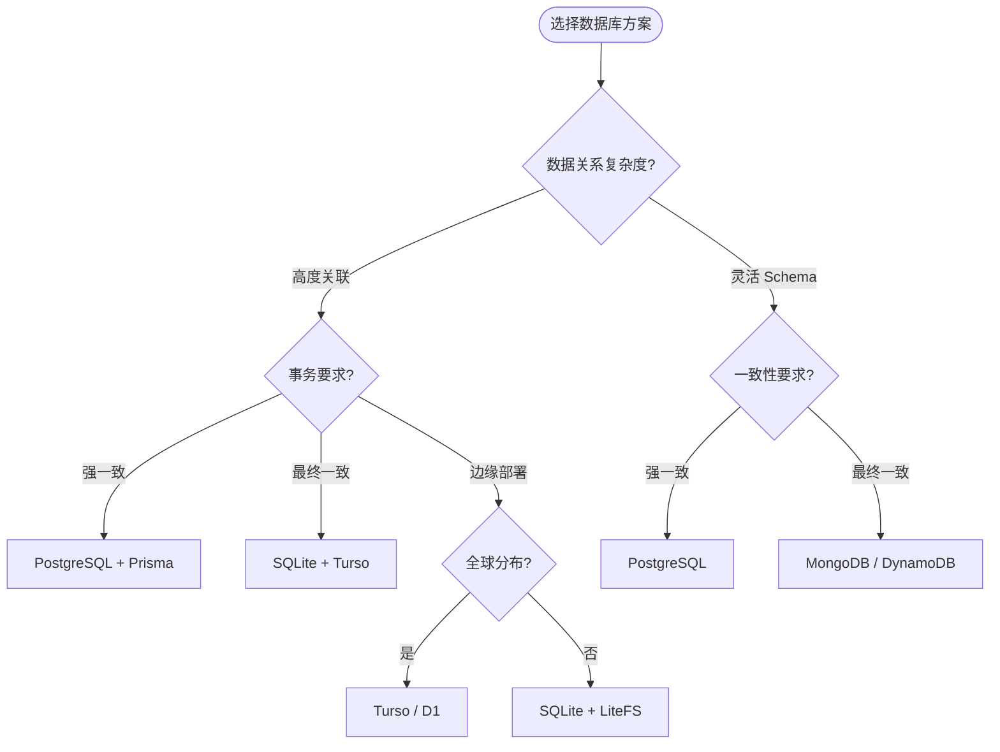
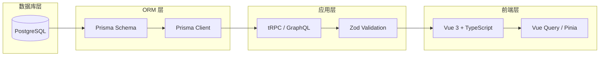
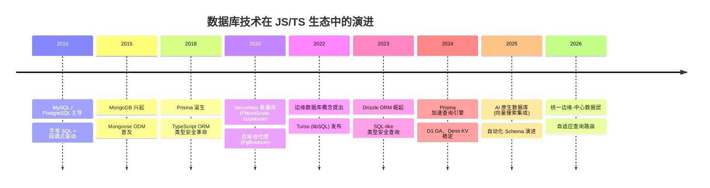

# 🗄️ 数据库示例总览

> 数据是应用的核心资产。本示例库聚焦 JavaScript / TypeScript 生态中的数据层工程实践，从关系型 Schema 设计到边缘数据库部署，提供可运行、可扩展、可维护的数据库解决方案。

现代 Web 应用的数据层正在经历深刻变革：传统关系型数据库（PostgreSQL、MySQL）与新一代边缘数据库（Turso、D1、Deno KV）并存；类型安全的 ORM（Prisma、Drizzle ORM）逐步取代手写 SQL；Serverless 架构驱动了连接池和查询模式的重新设计[^1]。本示例库将数据库理论与 TypeScript 工程实践结合，帮助开发者构建健壮的数据层。

---

## 学习路径总览


## 数据库技术全景

| 类别 | 代表技术 | 适用场景 | TypeScript 生态 |
|------|---------|---------|----------------|
| **关系型数据库** | PostgreSQL, MySQL, SQLite | 事务密集型、复杂查询 | Prisma, Drizzle, Kysely |
| **文档数据库** | MongoDB, Firestore | 灵活 Schema、快速迭代 | Mongoose, Prisma (MongoDB 预览) |
| **键值存储** | Redis, Deno KV | 缓存、会话、实时计数 | ioredis, @upstash/redis |
| **边缘数据库** | Turso (libSQL), Cloudflare D1 | 全球低延迟、Serverless | @libsql/client, @cloudflare/d1 |
| **向量数据库** | pgvector, Pinecone | AI 嵌入、语义搜索 | pgvector (Prisma 扩展) |
| **时序数据库** | TimescaleDB, InfluxDB | 指标、日志、监控 | @timescaledb/ts |

---

## 核心设计原则

### Schema 优先（Schema-First）

数据库设计应当从领域模型出发，通过严格的 Schema 定义确保数据完整性和一致性。Prisma Schema 作为 TypeScript 生态的事实标准，实现了数据库模型与应用程序类型的单一数据源：

```prisma
// Schema 定义即类型契约
model User {
  id        String   @id @default(uuid())
  email     String   @unique
  name      String
  role      Role     @default(USER)
  posts     Post[]
  profile   Profile?
  createdAt DateTime @default(now())
  updatedAt DateTime @updatedAt

  @@index([email])
  @@map("users")
}

model Post {
  id       String @id @default(cuid())
  title    String
  content  String @db.Text
  status   PostStatus @default(DRAFT)
  author   User   @relation(fields: [authorId], references: [id])
  authorId String

  @@index([status, createdAt])
}

enum Role {
  USER
  ADMIN
  MODERATOR
}

enum PostStatus {
  DRAFT
  PUBLISHED
  ARCHIVED
}
```

### 数据库架构决策矩阵



### 类型安全的数据流

TypeScript 生态的核心优势在于将数据库 Schema 的类型安全性贯穿整个应用栈：



---

## Schema 设计原则实战

### 规范化与反规范化的权衡

数据库 Schema 设计需要在规范化（避免冗余）和查询性能之间取得平衡：

```prisma
// 规范化设计：消除冗余，保证一致性
model Order {
  id        String   @id @default(uuid())
  userId    String
  total     Decimal  @db.Decimal(10, 2)
  items     OrderItem[]
  user      User     @relation(fields: [userId], references: [id])
}

model OrderItem {
  id        String  @id @default(uuid())
  orderId   String
  productId String
  quantity  Int
  unitPrice Decimal @db.Decimal(10, 2)
  order     Order   @relation(fields: [orderId], references: [id])
}

// 反规范化场景：高频聚合查询的预计算字段
model OrderSummary {
  id            String   @id
  userId        String
  totalAmount   Decimal  @db.Decimal(10, 2)
  itemCount     Int
  lastUpdated   DateTime @updatedAt
  // 冗余字段避免 JOIN
  userName      String
  userEmail     String
}
```

### 索引设计策略

合理的索引是查询性能的关键。以下原则指导索引设计：

| 原则 | 说明 | 示例 |
|------|------|------|
| **选择性优先** | 高基数列优先建立索引 | `email`、`uuid` 优于 `status`、`boolean` |
| **最左前缀** | 复合索引按查询频率排序 | `@@index([status, createdAt])` |
| **覆盖索引** | 索引包含查询所需全部字段 | 避免回表查询 |
| **避免过度索引** | 写操作需维护索引，DML 密集表谨慎添加 | 监控 `pg_stat_user_indexes` |

```typescript
// 使用 Prisma 的查询日志分析慢查询
const prisma = new PrismaClient({
  log: [
    { emit: 'event', level: 'query' },
    { emit: 'stdout', level: 'warn' },
    { emit: 'stdout', level: 'error' },
  ],
});

prisma.$on('query', (e: PrismaQueryEvent) => {
  if (e.duration > 100) {
    console.warn(`慢查询 (${e.duration}ms): ${e.query}`);
  }
});
```

**快速链接**： [Schema 设计原则完整指南](./schema-design-principles.md) | 索引优化实战 | Prisma Schema 高级模式

---

## ORM 类型安全实践

### Prisma vs Drizzle ORM

TypeScript 生态两大主流 ORM 的对比：

| 维度 | Prisma | Drizzle ORM |
|------|--------|-------------|
| **Schema 定义** | 专用 DSL（.prisma） | TypeScript 代码即 Schema |
| **查询 API** | 链式方法 | SQL-like 表达式 |
| **类型推断** | 自动生成 | 运行时推导 |
| **迁移系统** | 内置 Prisma Migrate | drizzle-kit |
| **学习曲线** | 中等（需学习 DSL） | 低（熟悉 SQL 即可） |
| **生态成熟度** | 极高 | 快速增长 |

### Drizzle ORM 示例

Drizzle 采用 "SQL 优先" 的设计理念，查询语法贴近原生 SQL：

```typescript
import { eq, desc, sql } from 'drizzle-orm';
import { users, posts } from './schema';

// 类型安全的查询
const userWithPosts = await db
  .select()
  .from(users)
  .leftJoin(posts, eq(users.id, posts.authorId))
  .where(eq(users.email, 'alice@example.com'))
  .orderBy(desc(posts.createdAt));

// 聚合查询（完全类型安全）
const userStats = await db
  .select({
    userId: users.id,
    name: users.name,
    postCount: sql<number>`count(${posts.id})`,
  })
  .from(users)
  .leftJoin(posts, eq(users.id, posts.authorId))
  .groupBy(users.id);
```

### Kysely：类型安全的 SQL 构建器

对于需要完全控制 SQL 的场景，Kysely 提供了编译时类型检查的查询构建器：

```typescript
import { Kysely, PostgresDialect } from 'kysely';
import { DB } from './db-types'; // 由 kysely-codegen 生成

const db = new Kysely<DB>({
  dialect: new PostgresDialect({
    pool: new Pool({ connectionString: process.env.DATABASE_URL }),
  }),
});

// 类型自动推断：result 的类型为 { id: string; email: string; name: string | null }[]
const result = await db
  .selectFrom('users')
  .select(['id', 'email', 'name'])
  .where('email', 'like', '%@example.com')
  .execute();
```

---

## 查询优化与性能工程

### N+1 问题治理

ORM 的便利容易带来 N+1 查询问题。以下是 Prisma 中的解决方案：

```typescript
// ❌ N+1 问题：查询 100 个用户会触发 101 次查询
const users = await prisma.user.findMany();
for (const user of users) {
  const posts = await prisma.post.findMany({ where: { authorId: user.id } });
  // 每次循环都发起一次查询
}

// ✅ 使用 include 进行预加载（2 次查询）
const usersWithPosts = await prisma.user.findMany({
  include: { posts: true },
});

// ✅ 使用 select 精确控制返回字段
const usersWithPostCount = await prisma.user.findMany({
  select: {
    id: true,
    name: true,
    _count: { select: { posts: true } },
  },
});
```

### 连接池管理

Serverless 环境下的数据库连接管理是关键挑战：

```typescript
// 使用 @neondatabase/serverless 进行无连接池查询
import { Pool } from '@neondatabase/serverless';
import { PrismaNeon } from '@prisma/adapter-neon';
import { PrismaClient } from '@prisma/client';

const pool = new Pool({ connectionString: process.env.DATABASE_URL });
const adapter = new PrismaNeon(pool);
const prisma = new PrismaClient({ adapter });

// Edge Runtime 中无需传统连接池
```

### 查询性能基准

| 操作 | Prisma (ms) | Drizzle (ms) | 原生 pg (ms) | 备注 |
|------|-------------|--------------|--------------|------|
| 单条插入 | 12 | 8 | 5 | 包含连接建立开销 |
| 批量插入 (1000) | 180 | 120 | 80 | Drizzle 使用 `insert().values([])` |
| 简单 SELECT | 8 | 5 | 3 | 单表主键查询 |
| JOIN 查询 | 25 | 18 | 12 | 三表关联 |
| 聚合查询 | 35 | 22 | 15 | `GROUP BY` + `COUNT` |

> 注：以上数据为本地 PostgreSQL 15 的参考值，实际性能取决于网络延迟、数据量和索引设计。

---

## 事务与并发控制

### 隔离级别选择

```typescript
// Prisma 事务支持
import { Prisma } from '@prisma/client';

// 交互式事务
await prisma.$transaction(async (tx) => {
  const order = await tx.order.create({ data: { userId, total: amount } });
  await tx.payment.create({ data: { orderId: order.id, status: 'PENDING' } });
  await tx.inventory.update({
    where: { productId },
    data: { quantity: { decrement: 1 } },
  });
}, {
  isolationLevel: Prisma.TransactionIsolationLevel.Serializable,
  maxWait: 5000,
  timeout: 10000,
});

// 批量操作事务
await prisma.$transaction([
  prisma.user.update({ where: { id: 1 }, data: { balance: { decrement: 100 } } }),
  prisma.user.update({ where: { id: 2 }, data: { balance: { increment: 100 } } }),
]);
```

### 乐观锁与悲观锁

| 策略 | 适用场景 | 实现方式 | 优缺点 |
|------|---------|---------|--------|
| **悲观锁** | 高并发写操作、库存扣减 | `SELECT FOR UPDATE` | 强一致，但降低并发度 |
| **乐观锁** | 读多写少、冲突概率低 | 版本号 / 时间戳 | 高并发友好，需处理冲突 |

```prisma
// 乐观锁版本号
model Product {
  id       String @id @default(uuid())
  name     String
  quantity Int
  version  Int    @default(0)

  @@versionField(version)
}
```

---

## 边缘数据库实战

### Turso (libSQL) 与本地优先架构

Turso 是 SQLite 的分支 libSQL 的托管版本，专为边缘计算设计：

```typescript
import { createClient } from '@libsql/client';

const client = createClient({
  url: process.env.TURSO_URL!,
  authToken: process.env.TURSO_AUTH_TOKEN,
});

// 边缘节点上的低延迟查询
const result = await client.execute({
  sql: 'SELECT * FROM posts WHERE status = ? ORDER BY created_at DESC LIMIT ?',
  args: ['published', 10],
});
```

### Cloudflare D1

D1 是 Cloudflare 基于 SQLite 的无服务器边缘数据库：

```typescript
// Workers 环境中使用 D1
export interface Env {
  DB: D1Database;
}

export default {
  async fetch(request: Request, env: Env): Promise<Response> {
    const { results } = await env.DB.prepare(
      'SELECT * FROM users WHERE email = ?'
    )
      .bind('user@example.com')
      .all();

    return Response.json(results);
  },
};
```

### 边缘数据库选型对比

| 特性 | Turso | Cloudflare D1 | Deno KV |
|------|-------|---------------|---------|
| **数据模型** | 关系型 (SQLite) | 关系型 (SQLite) | 键值对 |
| **全球复制** | ✅ 读副本 | ✅ 自动 | ✅ 自动 |
| **事务支持** | ✅ SQLite ACID | ✅ | ⚠️ 原子操作 |
| **最大行数** | 无硬性限制 | 500K (Beta) | 无限制 |
| **TypeScript SDK** | `@libsql/client` | D1 Bindings | `Deno.openKv()` |
| **适用场景** | 内容站点、SaaS 多租户 | 边缘 API、配置存储 | 会话、计数器、队列 |

---

## Vue 数据层安全

Vue 应用的数据层安全关注前端与数据库交互过程中的数据保护与访问控制。

### 安全的数据获取模式

使用 Vue Query (TanStack Query) 实现安全的数据获取：

```typescript
// 组合式函数封装安全的数据访问
import { useQuery, useMutation, useQueryClient } from '@tanstack/vue-query';
import { z } from 'zod';

const PostSchema = z.object({
  id: z.string(),
  title: z.string().min(1).max(200),
  content: z.string(),
  status: z.enum(['DRAFT', 'PUBLISHED']),
});

type Post = z.infer<typeof PostSchema>;

export function usePosts() {
  return useQuery({
    queryKey: ['posts'],
    queryFn: async (): Promise<Post[]> => {
      const response = await fetch('/api/posts');
      if (!response.ok) throw new Error('Failed to fetch posts');
      const raw = await response.json();
      // 运行时校验 API 响应
      return z.array(PostSchema).parse(raw);
    },
    // 敏感数据不过度缓存
    staleTime: 1000 * 60 * 5, // 5 分钟
  });
}

export function useCreatePost() {
  const queryClient = useQueryClient();

  return useMutation({
    mutationFn: async (data: { title: string; content: string }) => {
      const response = await fetch('/api/posts', {
        method: 'POST',
        headers: { 'Content-Type': 'application/json' },
        body: JSON.stringify(data),
      });
      if (!response.ok) throw new Error('Failed to create post');
      return response.json();
    },
    onSuccess: () => {
      queryClient.invalidateQueries({ queryKey: ['posts'] });
    },
  });
}
```

### Pinia Store 中的数据安全

```typescript
import { defineStore } from 'pinia';
import { ref, computed } from 'vue';
import { z } from 'zod';

const UserSchema = z.object({
  id: z.string(),
  email: z.string().email(),
  role: z.enum(['USER', 'ADMIN']),
});

export const useAuthStore = defineStore('auth', () => {
  const user = ref<z.infer<typeof UserSchema> | null>(null);
  const isAdmin = computed(() => user.value?.role === 'ADMIN');

  // 安全的用户状态更新（校验输入）
  function setUser(raw: unknown) {
    const parsed = UserSchema.safeParse(raw);
    if (parsed.success) {
      user.value = parsed.data;
    } else {
      console.error('Invalid user data:', parsed.error);
      user.value = null;
    }
  }

  // 敏感操作需要二次确认
  async function deleteAccount(confirmationToken: string) {
    if (!confirmationToken || confirmationToken.length < 32) {
      throw new Error('Invalid confirmation token');
    }
    // API 调用...
  }

  return { user, isAdmin, setUser, deleteAccount };
});
```

---

## 与理论专题的映射

数据库示例与网站理论专题形成实践与理论的完整闭环：

| 示例 | 理论支撑 |
|------|---------|
| [Schema 设计原则](./schema-design-principles.md) | [数据库与ORM](/database-orm/) — 关系模型、范式理论、ORM 设计模式 |
| ORM 类型安全实践 | [TypeScript 类型系统](/typescript-type-system/) — 类型推断、条件类型、泛型约束 |
| 查询优化 | [性能工程](/performance-engineering/) — 索引原理、查询计划分析、连接池管理 |
| 边缘数据库 | [应用设计理论](/application-design/) — 分布式数据、CAP 定理、最终一致性 |
| Vue 数据层安全 | [模块系统](/module-system/) — 依赖注入、服务层抽象 |

---

## 生产部署 Checklist

### 数据库发布前检查

- [ ] Schema 变更已通过迁移脚本验证（开发 /  staging / 生产环境）
- [ ] 索引已针对生产查询模式优化（使用 `EXPLAIN ANALYZE` 确认）
- [ ] 连接池配置已根据并发量调优（避免连接耗尽）
- [ ] 敏感字段已启用加密（AES-256-GCM 或列级加密）
- [ ] 备份策略已配置（RPO < 1 小时，RTO < 4 小时）
- [ ] 慢查询日志已启用并配置告警阈值
- [ ] ORM 查询日志在生产环境已关闭或脱敏
- [ ] 数据库凭据使用密钥管理服务，未硬编码
- [ ] 迁移脚本支持回滚（down migration 已测试）

### 监控告警

| 告警类型 | 阈值 | 响应时间 |
|---------|------|---------|
| 查询延迟 P99 | > 500ms | 5 分钟 |
| 死锁频率 | > 1 次/小时 | 立即 |
| 连接池使用率 | > 80% | 10 分钟 |
| 复制延迟 | > 5s | 立即 |
| 磁盘使用率 | > 85% | 30 分钟 |

---

## 技术演进趋势



### 前沿趋势

- **AI 原生数据库集成**：PostgreSQL + pgvector 成为 RAG 应用标配，Prisma 原生支持向量类型和相似度查询[^2]
- **Schema 即代码（SaC）**：数据库 Schema 纳入版本控制，与应用程序代码同步演进，CI/CD 管道自动验证迁移安全性
- **边缘-中心混合架构**：读写分离扩展到地理维度，边缘节点处理读查询，中心数据库处理写事务，通过 CRDT 或事件溯源保持一致性[^3]
- **零信任数据访问**：数据库访问不再依赖网络边界，每个查询都携带身份凭证和权限上下文，行级安全（RLS）成为默认配置

---

## 参考资源

### 数据库理论与设计

- [Database Design for Mere Mortals](https://www.informit.com/store/database-design-for-mere-mortals-9780136788041) — Michael J. Hernandez. 2020. 关系型数据库设计的经典入门教材，涵盖范式理论与实战设计方法。
- [Designing Data-Intensive Applications](https://datacrunchcorp.com/designing-data-intensive-applications/) — Martin Kleppmann. 2017. 数据密集型应用设计的权威著作，深入解析存储引擎、复制、分区与事务理论[^4]。
- [PostgreSQL 官方文档](https://www.postgresql.org/docs/) — 关系型数据库的权威参考

### ORM 与工具

- [Prisma 文档](https://www.prisma.io/docs/) — 类型安全 ORM 的完整指南
- [Drizzle ORM 文档](https://orm.drizzle.team/) — SQL-like TypeScript ORM
- [Kysely 文档](https://kysely.dev/) — 类型安全 SQL 查询构建器
- [pgvector](https://github.com/pgvector/pgvector) — PostgreSQL 向量相似度搜索扩展

### 边缘数据库

- [Turso 文档](https://docs.turso.tech/) — libSQL 边缘数据库平台
- [Cloudflare D1](https://developers.cloudflare.com/d1/) — Workers 无服务器数据库
- [Deno KV](https://docs.deno.com/deploy/kv/) — Deno 原生键值存储

### Vue 生态数据层

- [Vue Query / TanStack Query](https://tanstack.com/query/latest/) — 强大的异步状态管理
- [Pinia](https://pinia.vuejs.org/) — Vue 官方状态管理库
- [Nuxt Server Layers](https://nuxt.com/docs/guide/concepts/server-engine) — Nuxt 服务端数据层抽象

---

## 贡献指南

数据库示例的贡献遵循以下规范：

1. **Schema 变更可追溯**：所有 Schema 示例需包含迁移前后的对比说明
2. **性能数据可复现**：查询性能基准需注明环境配置（数据库版本、硬件、数据量）
3. **类型安全优先**：所有示例使用 TypeScript 严格模式，ORM 查询展示完整的类型推断
4. **安全边界清晰**：数据层示例需标注潜在的注入风险和安全校验点
5. **遵循 Vue/VitePress 安全规范**：Markdown 中不使用未转义的 HTML 标签，外部链接使用 `rel="noopener noreferrer"`

---

## 脚注

[^1]: Kleppmann, Martin. *Designing Data-Intensive Applications: The Big Ideas Behind Reliable, Scalable, and Maintainable Systems*. O'Reilly Media, 2017.

[^2]: pgvector Contributors. "pgvector: Open-source vector similarity search for PostgreSQL." GitHub, 2024. <https://github.com/pgvector/pgvector>

[^3]: Shapiro, Marc, et al. "A Comprehensive Study of Convergent and Commutative Replicated Data Types." *HAL Research Report*, 2011.

[^4]: Kleppmann, Martin. "Local-First Software: You Own Your Data, in Spite of the Cloud." *ACM Queue*, 2019.
