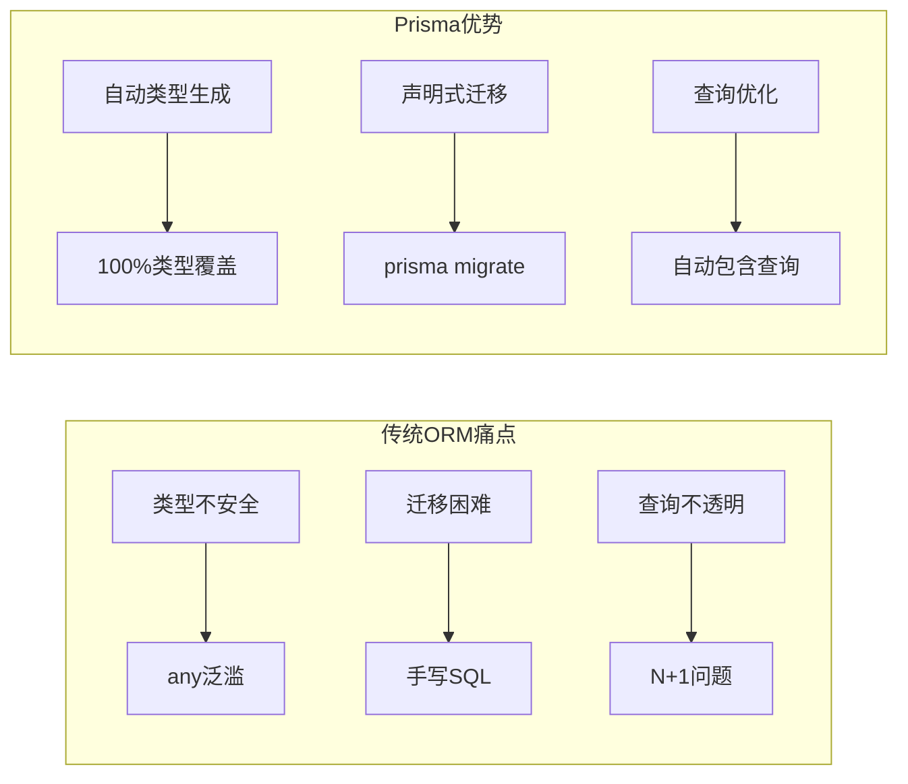

# Prisma + PostgreSQL 实战

> Prisma 是 2024-2026 年最流行的 TypeScript ORM，以类型安全、自动迁移和卓越的开发体验著称。本文档将带你构建完整的 Prisma + PostgreSQL 工作流。

## 为什么选择 Prisma？



## 环境准备

```bash
# 安装依赖
npm install prisma @prisma/client
npm install -D prisma

# 初始化
npx prisma init

# 安装数据库驱动（PostgreSQL）
npm install pg
```

## Schema 设计

```prisma
// prisma/schema.prisma

generator client &#123;
  provider = "prisma-client-js"
&#125;

datasource db &#123;
  provider = "postgresql"
  url      = env("DATABASE_URL")
&#125;

// 用户模型
model User &#123;
  id        String   @id @default(uuid())
  email     String   @unique
  name      String?
  createdAt DateTime @default(now())
  updatedAt DateTime @updatedAt

  // 关系
  posts     Post[]
  profile   Profile?
&#125;

// 文章模型
model Post &#123;
  id        String   @id @default(uuid())
  title     String
  content   String?
  published Boolean  @default(false)
  createdAt DateTime @default(now())

  // 外键
  authorId  String
  author    User     @relation(fields: [authorId], references: [id])

  // 分类（多对多）
  categories Category[]
&#125;

// 用户资料（一对一）
model Profile &#123;
  id     String @id @default(uuid())
  bio    String?
  avatar String?

  userId String @unique
  user   User   @relation(fields: [userId], references: [id])
&#125;

// 分类模型
model Category &#123;
  id    String @id @default(uuid())
  name  String @unique
  posts Post[]
&#125;
```

### 关系类型速查

| 关系 | Prisma 语法 | 数据库表现 |
|------|------------|-----------|
| 一对一 | `@relation` + `@unique` | 外键 + UNIQUE |
| 一对多 | `@relation` | 外键 |
| 多对多 | 隐式/显式连接表 | 中间表 |

## 迁移管理

```bash
# 生成迁移文件
npx prisma migrate dev --name init

# 应用到生产
npx prisma migrate deploy

# 生成新的迁移
npx prisma migrate dev --name add_user_roles

# 重置数据库（开发环境）
npx prisma migrate reset
```

```typescript
// 程序化迁移检查
import &#123; PrismaClient &#125; from '@prisma/client';

const prisma = new PrismaClient();

async function checkMigrationStatus() &#123;
  const result = await prisma.$queryRaw`
    SELECT * FROM \_prisma_migrations ORDER BY finished_at DESC LIMIT 5
  `;
  console.log('Recent migrations:', result);
&#125;
```

## 查询优化

### 基础 CRUD

```typescript
// 创建
const user = await prisma.user.create(&#123;
  data: &#123;
    email: 'alice@example.com',
    name: 'Alice',
    posts: &#123;
      create: [&#123; title: 'Hello World' &#125;],
    &#125;,
  &#125;,
&#125;);

// 读取（包含关系）
const userWithPosts = await prisma.user.findUnique(&#123;
  where: &#123; id: 'xxx' &#125;,
  include: &#123;
    posts: &#123;
      where: &#123; published: true &#125;,
      orderBy: &#123; createdAt: 'desc' &#125;,
      take: 5,
    &#125;,
    profile: true,
  &#125;,
&#125;);

// 更新
await prisma.user.update(&#123;
  where: &#123; id: 'xxx' &#125;,
  data: &#123; name: 'Alice Updated' &#125;,
&#125;);

// 删除
await prisma.user.delete(&#123; where: &#123; id: 'xxx' &#125; &#125;);
```

### 解决 N+1 问题

```typescript
// N+1 问题示例（避免！）
const users = await prisma.user.findMany();
for (const user of users) &#123;
  // 每个用户都触发一次查询
  const posts = await prisma.post.findMany(&#123; where: &#123; authorId: user.id &#125; &#125;);
&#125;
// 1 + N 次查询 ❌

// 正确做法：使用 include
const usersWithPosts = await prisma.user.findMany(&#123;
  include: &#123; posts: true &#125;,
&#125;);
// 1 次查询 ✅

// 或使用 select 精确控制字段
const users = await prisma.user.findMany(&#123;
  select: &#123;
    id: true,
    name: true,
    _count: &#123;
      select: &#123; posts: true &#125;,
    &#125;,
  &#125;,
&#125;);
```

### 全文搜索

```prisma
// Schema 中定义索引
model Post &#123;
  id      String @id @default(uuid())
  title   String
  content String?

  @@index([title, content], name: "post_search_idx")
&#125;
```

```typescript
// 使用 PostgreSQL 全文搜索
const posts = await prisma.$queryRaw`
  SELECT * FROM "Post"
  WHERE to_tsvector('chinese', title || ' ' || COALESCE(content, ''))
    @@ plainto_tsquery('chinese', $&#123;searchTerm&#125;)
  ORDER BY ts_rank(
    to_tsvector('chinese', title || ' ' || COALESCE(content, '')),
    plainto_tsquery('chinese', $&#123;searchTerm&#125;)
  ) DESC
`;
```

## 事务处理

```typescript
// 嵌套写事务
await prisma.$transaction(async (tx) => &#123;
  const user = await tx.user.create(&#123;
    data: &#123; email: 'new@example.com' &#125;,
  &#125;);

  await tx.post.create(&#123;
    data: &#123;
      title: 'Welcome Post',
      authorId: user.id,
    &#125;,
  &#125;);

  // 如果任何步骤失败，整个事务回滚
&#125;);

// 乐观锁（使用版本号）
await prisma.post.update(&#123;
  where: &#123; id: 'xxx', version: currentVersion &#125;,
  data: &#123;
    title: 'Updated',
    version: &#123; increment: 1 &#125;,
  &#125;,
&#125;);
```

## 与 API 层集成

### tRPC + Prisma

```typescript
// router.ts
import &#123; initTRPC &#125; from '@trpc/server';
import &#123; PrismaClient &#125; from '@prisma/client';

const t = initTRPC.create();
const prisma = new PrismaClient();

export const appRouter = t.router(&#123;
  user: t.router(&#123;
    list: t.procedure.query(() => prisma.user.findMany()),

    byId: t.procedure
      .input(z.string())
      .query((&#123; input &#125;) =>
        prisma.user.findUnique(&#123; where: &#123; id: input &#125; &#125;)
      ),

    create: t.procedure
      .input(z.object(&#123; email: z.string().email(), name: z.string() &#125;))
      .mutation((&#123; input &#125;) =>
        prisma.user.create(&#123; data: input &#125;)
      ),
  &#125;),
&#125;);
```

## 参考资源

| 资源 | 链接 |
|------|------|
| Prisma 文档 | <https://www.prisma.io/docs> |
| Prisma 示例 | <https://github.com/prisma/prisma-examples> |
| PostgreSQL 文档 | <https://www.postgresql.org/docs/> |

---

 [← 返回数据库示例首页](./)
