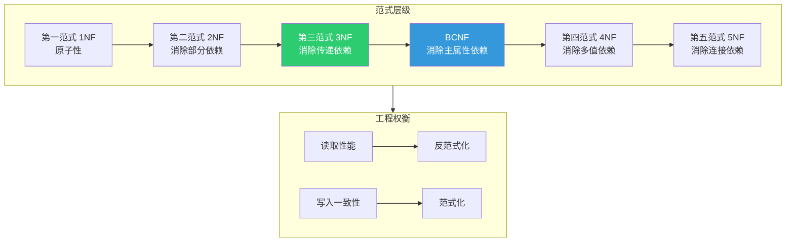
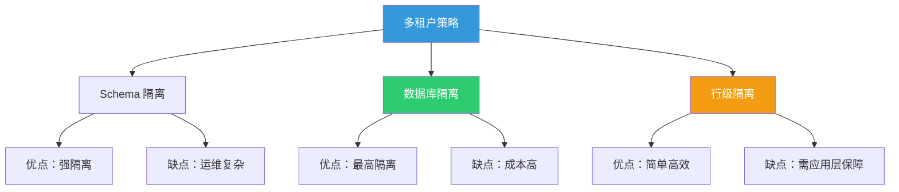
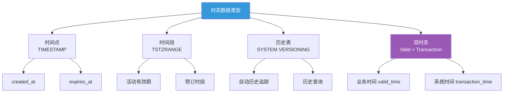

# 数据库 Schema 设计原则

> 本示例与 [数据库与ORM](/database-orm/) 专题形成映射关系，涵盖从理论范式到工程实践的数据库设计完整方法论。

良好的数据库 Schema 设计是应用可维护性、性能与数据一致性的基石。本文档系统梳理关系型数据库设计的核心原则，结合现代 TypeScript ORM（Prisma、Drizzle）的最佳实践，提供可直接落地的 Schema 设计参考。

## 目录

- [数据库 Schema 设计原则](#数据库-schema-设计原则)
  - [目录](#目录)
  - [范式化与反范式化](#范式化与反范式化)
    - [范式层级总览](#范式层级总览)
    - [第一范式（1NF）：原子性](#第一范式1nf原子性)
    - [第二范式（2NF）：消除部分依赖](#第二范式2nf消除部分依赖)
    - [第三范式（3NF）：消除传递依赖](#第三范式3nf消除传递依赖)
    - [BCNF 与更高范式](#bcnf-与更高范式)
    - [反范式化的工程实践](#反范式化的工程实践)
  - [索引设计策略](#索引设计策略)
    - [索引类型选择](#索引类型选择)
    - [B-Tree 索引最佳实践](#b-tree-索引最佳实践)
    - [索引设计决策矩阵](#索引设计决策矩阵)
    - [Prisma 中的索引声明](#prisma-中的索引声明)
    - [索引维护与监控](#索引维护与监控)
  - [外键与级联操作](#外键与级联操作)
    - [外键设计原则](#外键设计原则)
    - [级联操作风险矩阵](#级联操作风险矩阵)
    - [Prisma 中的关系与级联](#prisma-中的关系与级联)
  - [数据库迁移策略](#数据库迁移策略)
    - [迁移工作流](#迁移工作流)
    - [Prisma Migrate 实践](#prisma-migrate-实践)
    - [零停机迁移模式](#零停机迁移模式)
    - [Drizzle ORM 迁移](#drizzle-orm-迁移)
    - [迁移版本控制策略](#迁移版本控制策略)
  - [多租户数据隔离](#多租户数据隔离)
    - [隔离策略对比](#隔离策略对比)
    - [行级隔离（Shared Database, Shared Schema）](#行级隔离shared-database-shared-schema)
    - [Prisma 中的多租户实现](#prisma-中的多租户实现)
    - [数据库隔离（Database per Tenant）](#数据库隔离database-per-tenant)
  - [软删除与审计日志](#软删除与审计日志)
    - [软删除 Schema 设计](#软删除-schema-设计)
    - [Prisma 软删除实现](#prisma-软删除实现)
    - [审计日志表设计](#审计日志表设计)
    - [Drizzle 审计触发器](#drizzle-审计触发器)
  - [时态数据建模](#时态数据建模)
    - [时态数据类型](#时态数据类型)
    - [有效时间建模（Valid Time）](#有效时间建模valid-time)
    - [PostgreSQL 系统版本表](#postgresql-系统版本表)
    - [Prisma 时态数据扩展](#prisma-时态数据扩展)
    - [时间点查询封装](#时间点查询封装)
  - [设计模式速查表](#设计模式速查表)
  - [参考与延伸阅读](#参考与延伸阅读)

---

## 范式化与反范式化

关系数据库理论以范式（Normal Form）为核心，指导我们如何组织数据以最小化冗余和异常。然而，在实际工程中，适当的反范式化往往是性能优化的必要手段。

### 范式层级总览



### 第一范式（1NF）：原子性

所有字段值必须是不可再分的原子值。

```sql
-- 违反 1NF：tags 以逗号分隔存储
CREATE TABLE articles_bad (
    id SERIAL PRIMARY KEY,
    title VARCHAR(255) NOT NULL,
    tags VARCHAR(500)  -- "typescript,nodejs,database"
);

-- 符合 1NF：拆分为关联表
CREATE TABLE articles (
    id SERIAL PRIMARY KEY,
    title VARCHAR(255) NOT NULL,
    created_at TIMESTAMPTZ DEFAULT NOW()
);

CREATE TABLE tags (
    id SERIAL PRIMARY KEY,
    name VARCHAR(50) NOT NULL UNIQUE
);

CREATE TABLE article_tags (
    article_id INTEGER REFERENCES articles(id) ON DELETE CASCADE,
    tag_id INTEGER REFERENCES tags(id) ON DELETE CASCADE,
    PRIMARY KEY (article_id, tag_id)
);
```

### 第二范式（2NF）：消除部分依赖

在满足 1NF 的基础上，非主属性必须完全依赖于整个主键（针对复合主键）。

```sql
-- 违反 2NF：category_name 只依赖于 category_id，而非整个 (id, category_id)
CREATE TABLE products_bad (
    id INTEGER,
    category_id INTEGER,
    product_name VARCHAR(255),
    category_name VARCHAR(255),  -- 部分依赖
    PRIMARY KEY (id, category_id)
);

-- 符合 2NF
CREATE TABLE categories (
    id SERIAL PRIMARY KEY,
    name VARCHAR(255) NOT NULL
);

CREATE TABLE products (
    id SERIAL PRIMARY KEY,
    category_id INTEGER REFERENCES categories(id),
    name VARCHAR(255) NOT NULL
);
```

### 第三范式（3NF）：消除传递依赖

在满足 2NF 的基础上，消除非主属性对主键的传递依赖。

```sql
-- 违反 3NF：city_population 传递依赖于 user_id -> city_id -> city_population
CREATE TABLE users_bad (
    id SERIAL PRIMARY KEY,
    name VARCHAR(255),
    city_id INTEGER,
    city_name VARCHAR(255),
    city_population INTEGER  -- 传递依赖
);

-- 符合 3NF
CREATE TABLE cities (
    id SERIAL PRIMARY KEY,
    name VARCHAR(255) NOT NULL,
    population INTEGER
);

CREATE TABLE users (
    id SERIAL PRIMARY KEY,
    name VARCHAR(255) NOT NULL,
    city_id INTEGER REFERENCES cities(id)
);
```

### BCNF 与更高范式

BCNF（Boyce-Codd Normal Form）是 3NF 的强化版本，要求每一个决定因素都是候选键。

```sql
-- 违反 BCNF：professor -> department，但 professor 不是候选键
CREATE TABLE course_assignments_bad (
    student_id INTEGER,
    course_id INTEGER,
    professor VARCHAR(255),
    department VARCHAR(255),
    PRIMARY KEY (student_id, course_id)
);

-- BCNF 分解
CREATE TABLE professors (
    id SERIAL PRIMARY KEY,
    name VARCHAR(255) NOT NULL,
    department_id INTEGER REFERENCES departments(id)
);

CREATE TABLE course_assignments (
    student_id INTEGER REFERENCES students(id),
    course_id INTEGER REFERENCES courses(id),
    professor_id INTEGER REFERENCES professors(id),
    PRIMARY KEY (student_id, course_id)
);
```

### 反范式化的工程实践

在读取密集型的场景中，适度的反范式化可以显著减少 JOIN 操作，提升查询性能。

```sql
-- 反范式化：在订单表中冗余存储用户名称，避免 JOIN
CREATE TABLE orders (
    id SERIAL PRIMARY KEY,
    user_id INTEGER REFERENCES users(id),
    user_name VARCHAR(255) NOT NULL,  -- 冗余字段
    total_amount DECIMAL(12, 2) NOT NULL,
    status VARCHAR(50) NOT NULL,
    created_at TIMESTAMPTZ DEFAULT NOW(),
    updated_at TIMESTAMPTZ DEFAULT NOW()
);

-- 维护冗余字段的触发器
CREATE OR REPLACE FUNCTION update_order_user_name()
RETURNS TRIGGER AS $$
BEGIN
    NEW.user_name = (SELECT name FROM users WHERE id = NEW.user_id);
    RETURN NEW;
END;
$$ LANGUAGE plpgsql;

CREATE TRIGGER trg_update_order_user_name
    BEFORE INSERT OR UPDATE OF user_id ON orders
    FOR EACH ROW
    EXECUTE FUNCTION update_order_user_name();
```

| 策略 | 适用场景 | 风险 |
|------|----------|------|
| 完全范式化 | 写入密集型、强一致性要求 | 查询性能差、JOIN 复杂 |
| 适度反范式化 | 读取密集型、报表系统 | 数据冗余、更新异常 |
| 物化视图 | 复杂聚合查询 | 需要刷新机制 |
| 缓存层 | 高频热点数据 | 最终一致性 |

---

## 索引设计策略

索引是数据库性能优化的核心工具，但不合理的索引设计反而会降低写入性能并增加存储开销。

### 索引类型选择

```mermaid
flowchart TD
    Q[查询需求分析] --> T&#123;查询类型?}
    T -->|等值查询| E[B-Tree 索引]
    T -->|范围查询| R[B-Tree 索引]
    T -->|全文搜索| F[GIN / GIST 索引]
    T -->|数组/JSON| J[GIN 索引]
    T -->|地理位置| G[GIST / SP-GIST]
    T -->|唯一性约束| U[唯一索引]
    T -->|多列查询| C[复合索引]
    E --> O[排序优化]
    R --> O
    style Q fill:#3498db,color:#fff
    style E fill:#2ecc71,color:#fff
    style C fill:#2ecc71,color:#fff
    style F fill:#f39c12,color:#fff
```

### B-Tree 索引最佳实践

```sql
-- 单列索引：适用于高选择性的列
CREATE INDEX idx_users_email ON users(email);

-- 复合索引：列顺序至关重要（最左前缀原则）
-- 支持 (status, created_at) 和 (status) 的查询
-- 不支持单独的 (created_at) 查询
CREATE INDEX idx_orders_status_created
    ON orders(status, created_at DESC);

-- 部分索引：仅索引满足条件的子集，减小索引体积
CREATE INDEX idx_orders_pending_created
    ON orders(created_at)
    WHERE status = 'pending';

-- 函数索引：支持大小写不敏感的搜索
CREATE INDEX idx_users_email_lower
    ON users(LOWER(email));

-- 覆盖索引：包含查询所需的所有列，避免回表
CREATE INDEX idx_orders_user_status_amount
    ON orders(user_id, status, total_amount)
    INCLUDE (created_at, updated_at);
```

### 索引设计决策矩阵

```typescript
// 基于查询模式的索引设计分析
interface QueryPattern &#123;
  table: string;
  filters: Array&lt;&#123; column: string; operator: '=' | '>' | '<' | 'LIKE' }>;
  sortBy?: string;
  sortOrder?: 'ASC' | 'DESC';
  selectColumns: string[];
}

// 示例查询模式分析
const userQueries: QueryPattern[] = [
  &#123;
    table: 'users',
    filters: [&#123; column: 'email', operator: '=' }],
    selectColumns: ['id', 'name', 'email', 'created_at'],
    // 推荐：CREATE UNIQUE INDEX idx_users_email ON users(email);
  },
  &#123;
    table: 'users',
    filters: [
      &#123; column: 'status', operator: '=' },
      &#123; column: 'created_at', operator: '>' },
    ],
    sortBy: 'created_at',
    sortOrder: 'DESC',
    selectColumns: ['id', 'name', 'email'],
    // 推荐：CREATE INDEX idx_users_status_created ON users(status, created_at DESC);
  },
  &#123;
    table: 'articles',
    filters: [&#123; column: 'title', operator: 'LIKE' }],
    selectColumns: ['id', 'title', 'content'],
    // 推荐：使用全文搜索索引或 pg_trgm
  },
];
```

### Prisma 中的索引声明

```prisma
// schema.prisma
model User &#123;
  id        Int      @id @default(autoincrement())
  email     String   @unique
  name      String?
  status    UserStatus @default(ACTIVE)
  createdAt DateTime @default(now()) @map("created_at")
  updatedAt DateTime @updatedAt @map("updated_at")

  // 复合索引
  @@index([status, createdAt])

  // 唯一索引（复合）
  @@unique([email, status])

  // 映射到表名
  @@map("users")
}

model Article &#123;
  id          Int      @id @default(autoincrement())
  title       String
  content     String   @db.Text
  published   Boolean  @default(false)
  authorId    Int      @map("author_id")
  publishedAt DateTime? @map("published_at")

  author      User     @relation(fields: [authorId], references: [id])

  // 全文搜索索引（PostgreSQL）
  @@index([title], name: "idx_articles_title", type: Gin)

  @@map("articles")
}

enum UserStatus &#123;
  ACTIVE
  INACTIVE
  SUSPENDED
}
```

### 索引维护与监控

```sql
-- 查看索引使用统计
SELECT
    schemaname,
    tablename,
    indexname,
    idx_scan,           -- 索引扫描次数
    idx_tup_read,       -- 通过索引读取的元组数
    idx_tup_fetch,      -- 通过索引获取的活元组数
    pg_size_pretty(pg_relation_size(indexrelid)) AS index_size
FROM pg_stat_user_indexes
WHERE schemaname = 'public'
ORDER BY idx_scan DESC;

-- 查找未使用的索引（谨慎删除）
SELECT
    indexrelname AS index_name,
    relname AS table_name,
    idx_scan,
    idx_tup_read,
    idx_tup_fetch
FROM pg_stat_user_indexes
WHERE idx_scan = 0
  AND indexrelname NOT LIKE 'pg_toast%'
  AND indexrelname NOT LIKE '%_pkey'
ORDER BY pg_relation_size(indexrelid) DESC;

-- 重新分析表以更新统计信息
ANALYZE users;
ANALYZE orders;
```

---

## 外键与级联操作

外键是维护数据参照完整性的核心机制。正确配置级联操作可以简化数据维护，但不当使用可能导致意外的大规模数据删除。

### 外键设计原则

```sql
-- 基础外键：RESTRICT（默认，禁止删除被引用的父记录）
CREATE TABLE comments (
    id SERIAL PRIMARY KEY,
    article_id INTEGER NOT NULL REFERENCES articles(id),
    user_id INTEGER NOT NULL REFERENCES users(id),
    content TEXT NOT NULL,
    created_at TIMESTAMPTZ DEFAULT NOW()
);

-- CASCADE：删除父记录时自动删除子记录
CREATE TABLE order_items (
    id SERIAL PRIMARY KEY,
    order_id INTEGER NOT NULL REFERENCES orders(id) ON DELETE CASCADE,
    product_id INTEGER NOT NULL REFERENCES products(id) ON DELETE RESTRICT,
    quantity INTEGER NOT NULL CHECK (quantity > 0),
    unit_price DECIMAL(10, 2) NOT NULL
);

-- SET NULL：删除父记录时将外键设为 NULL
CREATE TABLE departments (
    id SERIAL PRIMARY KEY,
    name VARCHAR(255) NOT NULL
);

CREATE TABLE employees (
    id SERIAL PRIMARY KEY,
    name VARCHAR(255) NOT NULL,
    department_id INTEGER REFERENCES departments(id) ON DELETE SET NULL
);

-- 级联更新：当父表主键变更时同步更新子表
CREATE TABLE product_categories (
    id SERIAL PRIMARY KEY,
    code VARCHAR(50) UNIQUE NOT NULL,
    name VARCHAR(255) NOT NULL
);

CREATE TABLE products (
    id SERIAL PRIMARY KEY,
    category_code VARCHAR(50) REFERENCES product_categories(code)
        ON UPDATE CASCADE  -- 分类代码变更时自动更新
        ON DELETE RESTRICT
);
```

### 级联操作风险矩阵

| 级联类型 | 行为 | 适用场景 | 风险等级 |
|----------|------|----------|----------|
| `NO ACTION` | 检查约束，延迟到事务结束 | 复杂业务逻辑 | 低 |
| `RESTRICT` | 立即拒绝删除 | 核心关联数据 | 低 |
| `CASCADE` | 自动级联删除/更新 | 强生命周期绑定（订单-订单项） | 中 |
| `SET NULL` | 设为 NULL | 可选关联 | 低 |
| `SET DEFAULT` | 设为默认值 | 有默认分类的场景 | 低 |

### Prisma 中的关系与级联

```prisma
model Order &#123;
  id         Int         @id @default(autoincrement())
  userId     Int         @map("user_id")
  total      Decimal     @db.Decimal(12, 2)
  status     OrderStatus @default(PENDING)
  createdAt  DateTime    @default(now()) @map("created_at")

  user       User        @relation(fields: [userId], references: [id])
  items      OrderItem[]

  @@map("orders")
}

model OrderItem &#123;
  id        Int     @id @default(autoincrement())
  orderId   Int     @map("order_id")
  productId Int     @map("product_id")
  quantity  Int
  unitPrice Decimal @map("unit_price") @db.Decimal(10, 2)

  order     Order   @relation(fields: [orderId], references: [id], onDelete: Cascade)
  product   Product @relation(fields: [productId], references: [id], onDelete: Restrict)

  @@map("order_items")
}

model Product &#123;
  id          Int         @id @default(autoincrement())
  name        String
  sku         String      @unique
  price       Decimal     @db.Decimal(10, 2)
  isActive    Boolean     @default(true) @map("is_active")

  orderItems  OrderItem[]

  @@map("products")
}
```

---

## 数据库迁移策略

迁移是 Schema 演化的核心机制。良好的迁移策略确保开发、测试和生产环境的一致性，同时支持零停机部署。

### 迁移工作流


### Prisma Migrate 实践

```bash
# 开发阶段：根据 Schema 变更生成迁移
npx prisma migrate dev --name add_user_profile

# 生成迁移但不应用（CI/CD 场景）
npx prisma migrate deploy

# 查看迁移状态
npx prisma migrate status

# 解决迁移冲突
npx prisma migrate resolve --applied 20240501120000_init
```

### 零停机迁移模式

```sql
-- 模式 1：添加新列（可空，带默认值）
-- 步骤 1：添加可空列（不锁定表）
ALTER TABLE users ADD COLUMN display_name VARCHAR(255);

-- 步骤 2：后台填充数据（分批更新）
UPDATE users
SET display_name = name
WHERE id BETWEEN 1 AND 1000;
-- ... 分批执行

-- 步骤 3：添加非空约束（此时所有行已有值）
ALTER TABLE users ALTER COLUMN display_name SET NOT NULL;

-- 模式 2：重命名列（避免直接 RENAME）
-- 步骤 1：添加新列
ALTER TABLE products ADD COLUMN unit_price DECIMAL(10, 2);

-- 步骤 2：同步写入新旧两列（应用层双写）
-- 步骤 3：后台迁移历史数据
UPDATE products SET unit_price = price WHERE unit_price IS NULL;

-- 步骤 4：添加约束，切换读操作到新列
ALTER TABLE products ALTER COLUMN unit_price SET NOT NULL;

-- 步骤 5：移除旧列（后续版本）
-- ALTER TABLE products DROP COLUMN price;

-- 模式 3：添加索引（CONCURRENTLY 避免锁表）
CREATE INDEX CONCURRENTLY idx_users_created_at ON users(created_at);
```

### Drizzle ORM 迁移

```typescript
// drizzle.config.ts
import &#123; defineConfig } from 'drizzle-kit';

export default defineConfig(&#123;
  schema: './src/db/schema.ts',
  out: './drizzle',
  dialect: 'postgresql',
  dbCredentials: &#123;
    url: process.env.DATABASE_URL!,
  },
  verbose: true,
  strict: true,
});
```

```bash
# 生成迁移文件
npx drizzle-kit generate

# 应用迁移
npx drizzle-kit migrate

# 推送 Schema 到数据库（开发环境快速迭代）
npx drizzle-kit push
```

### 迁移版本控制策略

```typescript
// migration-meta.ts
interface MigrationRecord &#123;
  id: string;           // 时间戳前缀，如 "20240501120000"
  name: string;         // 描述性名称
  appliedAt: Date;      // 应用时间
  checksum: string;     // 文件内容哈希（防篡改）
  duration: number;     // 执行耗时（毫秒）
  rolledBack: boolean;  // 是否已回滚
}

// 迁移执行器
class MigrationRunner &#123;
  async applyPending(): Promise&lt;MigrationResult> &#123;
    const pending = await this.getPendingMigrations();

    for (const migration of pending) &#123;
      const startTime = Date.now();

      try &#123;
        await this.db.transaction(async (tx) => &#123;
          await tx.execute(migration.sql);
          await tx.insert(migrationHistory).values(&#123;
            id: migration.id,
            name: migration.name,
            checksum: migration.checksum,
            appliedAt: new Date(),
            duration: Date.now() - startTime,
          });
        });
      } catch (error) &#123;
        // 自动回滚事务
        throw new MigrationError(
          `Migration $&#123;migration.id} failed: $&#123;error.message}`,
          migration.id
        );
      }
    }

    return &#123; applied: pending.length };
  }
}
```

---

## 多租户数据隔离

多租户架构需要在资源共享与数据隔离之间取得平衡。常见的隔离策略各有优劣，适用于不同的业务场景。

### 隔离策略对比



### 行级隔离（Shared Database, Shared Schema）

这是最具成本效益的方案，通过在每张表中添加 `tenant_id` 列实现数据隔离。

```sql
-- 核心表设计
CREATE TABLE tenants (
    id SERIAL PRIMARY KEY,
    name VARCHAR(255) NOT NULL,
    subdomain VARCHAR(100) UNIQUE NOT NULL,
    plan VARCHAR(50) NOT NULL DEFAULT 'free',
    created_at TIMESTAMPTZ DEFAULT NOW(),
    settings JSONB DEFAULT '&#123;}'
);

CREATE TABLE projects (
    id SERIAL PRIMARY KEY,
    tenant_id INTEGER NOT NULL REFERENCES tenants(id) ON DELETE CASCADE,
    name VARCHAR(255) NOT NULL,
    description TEXT,
    created_at TIMESTAMPTZ DEFAULT NOW(),

    -- 租户内唯一约束
    CONSTRAINT uq_project_name_per_tenant UNIQUE (tenant_id, name)
);

-- Row Level Security（PostgreSQL）
ALTER TABLE projects ENABLE ROW LEVEL SECURITY;

CREATE POLICY tenant_isolation_policy ON projects
    FOR ALL
    USING (tenant_id = current_setting('app.current_tenant_id')::INTEGER)
    WITH CHECK (tenant_id = current_setting('app.current_tenant_id')::INTEGER);

-- 设置当前租户上下文
SET app.current_tenant_id = '42';
```

### Prisma 中的多租户实现

```prisma
// schema.prisma
model Tenant &#123;
  id        Int       @id @default(autoincrement())
  name      String
  subdomain String    @unique
  plan      String    @default("free")
  createdAt DateTime  @default(now()) @map("created_at")
  settings  Json?     @default("&#123;}")

  projects  Project[]
  users     TenantUser[]

  @@map("tenants")
}

model Project &#123;
  id          Int      @id @default(autoincrement())
  tenantId    Int      @map("tenant_id")
  name        String
  description String?
  createdAt   DateTime @default(now()) @map("created_at")

  tenant      Tenant   @relation(fields: [tenantId], references: [id], onDelete: Cascade)
  tasks       Task[]

  @@unique([tenantId, name])
  @@map("projects")
}

model Task &#123;
  id          Int      @id @default(autoincrement())
  projectId   Int      @map("project_id")
  tenantId    Int      @map("tenant_id")
  title       String
  status      String   @default("todo")
  priority    Int      @default(0)
  dueDate     DateTime? @map("due_date")
  createdAt   DateTime @default(now()) @map("created_at")

  project     Project  @relation(fields: [projectId], references: [id], onDelete: Cascade)

  @@index([tenantId, status])
  @@index([tenantId, dueDate])
  @@map("tasks")
}
```

```typescript
// 中间件：自动注入租户过滤
import &#123; PrismaClient } from '@prisma/client';

const prisma = new PrismaClient();

prisma.$use(async (params, next) => &#123;
  const tenantId = getCurrentTenantId(); // 从请求上下文获取

  // 为所有查询自动添加 tenantId 过滤
  if (params.model && ['Project', 'Task'].includes(params.model)) &#123;
    if (params.action === 'findUnique' || params.action === 'findFirst') &#123;
      params.args.where = &#123; ...params.args.where, tenantId };
    } else if (params.action === 'findMany') &#123;
      params.args.where = &#123; ...params.args.where, tenantId };
    } else if (params.action === 'create' || params.action === 'createMany') &#123;
      params.args.data = Array.isArray(params.args.data)
        ? params.args.data.map(d => (&#123; ...d, tenantId }))
        : &#123; ...params.args.data, tenantId };
    }
  }

  return next(params);
});
```

### 数据库隔离（Database per Tenant）

```typescript
// 动态数据库连接管理
import &#123; PrismaClient } from '@prisma/client';

class TenantConnectionManager &#123;
  private connections = new Map&lt;string, PrismaClient>();

  getClient(tenantId: string): PrismaClient &#123;
    if (!this.connections.has(tenantId)) &#123;
      const databaseUrl = this.buildDatabaseUrl(tenantId);
      const client = new PrismaClient(&#123;
        datasources: &#123;
          db: &#123; url: databaseUrl },
        },
      });
      this.connections.set(tenantId, client);
    }
    return this.connections.get(tenantId)!;
  }

  private buildDatabaseUrl(tenantId: string): string &#123;
    const baseUrl = process.env.DATABASE_URL!;
    const url = new URL(baseUrl);
    url.pathname = `/tenant_$&#123;tenantId}`;
    return url.toString();
  }

  async disconnectAll(): Promise&lt;void> &#123;
    await Promise.all(
      Array.from(this.connections.values()).map(c => c.$disconnect())
    );
    this.connections.clear();
  }
}
```

---

## 软删除与审计日志

物理删除数据往往会导致不可恢复的数据丢失和业务问题。软删除配合审计日志是现代应用的标准实践。

### 软删除 Schema 设计

```sql
-- 基础软删除表结构
CREATE TABLE documents (
    id SERIAL PRIMARY KEY,
    tenant_id INTEGER NOT NULL,
    title VARCHAR(500) NOT NULL,
    content TEXT,

    -- 软删除字段
    deleted_at TIMESTAMPTZ,
    deleted_by INTEGER REFERENCES users(id),

    -- 审计字段
    created_at TIMESTAMPTZ DEFAULT NOW(),
    created_by INTEGER REFERENCES users(id),
    updated_at TIMESTAMPTZ DEFAULT NOW(),
    updated_by INTEGER REFERENCES users(id),

    -- 版本控制
    version INTEGER DEFAULT 1
);

-- 视图：仅查询未删除记录
CREATE VIEW active_documents AS
SELECT * FROM documents WHERE deleted_at IS NULL;

-- 部分索引：加速活跃记录查询
CREATE INDEX idx_documents_active ON documents(tenant_id, created_at)
    WHERE deleted_at IS NULL;
```

### Prisma 软删除实现

```prisma
model Document &#123;
  id          Int       @id @default(autoincrement())
  tenantId    Int       @map("tenant_id")
  title       String
  content     String?

  deletedAt   DateTime? @map("deleted_at")
  deletedBy   Int?      @map("deleted_by")

  createdAt   DateTime  @default(now()) @map("created_at")
  createdBy   Int?      @map("created_by")
  updatedAt   DateTime  @updatedAt @map("updated_at")
  updatedBy   Int?      @map("updated_by")

  version     Int       @default(1)

  // 关系
  creator     User?     @relation("DocumentCreator", fields: [createdBy], references: [id])
  updater     User?     @relation("DocumentUpdater", fields: [updatedBy], references: [id])
  deleter     User?     @relation("DocumentDeleter", fields: [deletedBy], references: [id])

  @@index([tenantId])
  @@index([deletedAt])
  @@index([tenantId, createdAt])
  @@map("documents")
}
```

```typescript
// 软删除中间件
prisma.$use(async (params, next) => &#123;
  // 自动过滤已删除记录
  if (['findUnique', 'findFirst', 'findMany', 'count'].includes(params.action)) &#123;
    const model = params.model;
    if (model && hasSoftDelete(model)) &#123;
      params.args.where = &#123; ...params.args.where, deletedAt: null };
    }
  }

  // 拦截 delete，转为软删除
  if (params.action === 'delete' || params.action === 'deleteMany') &#123;
    const model = params.model;
    if (model && hasSoftDelete(model)) &#123;
      params.action = params.action === 'delete' ? 'update' : 'updateMany';
      params.args.data = &#123;
        deletedAt: new Date(),
        deletedBy: getCurrentUserId(),
      };
    }
  }

  return next(params);
});

// 强制物理删除的方法（谨慎使用）
async function hardDeleteDocument(id: number): Promise&lt;void> &#123;
  await prisma.$executeRaw`DELETE FROM documents WHERE id = $&#123;id}`;
}
```

### 审计日志表设计

```sql
-- 通用审计日志表
CREATE TABLE audit_logs (
    id BIGSERIAL PRIMARY KEY,
    table_name VARCHAR(100) NOT NULL,
    record_id INTEGER NOT NULL,
    action VARCHAR(20) NOT NULL CHECK (action IN ('INSERT', 'UPDATE', 'DELETE')),

    old_values JSONB,
    new_values JSONB,
    changed_fields VARCHAR(100)[],

    performed_by INTEGER,
    performed_at TIMESTAMPTZ DEFAULT NOW(),

    session_id VARCHAR(255),
    ip_address INET,
    user_agent TEXT,

    -- 分区键
    created_at TIMESTAMPTZ DEFAULT NOW()
) PARTITION BY RANGE (created_at);

-- 按月分区（示例：2024年5月）
CREATE TABLE audit_logs_2024_05
    PARTITION OF audit_logs
    FOR VALUES FROM ('2024-05-01') TO ('2024-06-01');

-- 索引
CREATE INDEX idx_audit_table_record ON audit_logs(table_name, record_id);
CREATE INDEX idx_audit_performed_at ON audit_logs(performed_at DESC);
CREATE INDEX idx_audit_user ON audit_logs(performed_by, performed_at DESC);
```

### Drizzle 审计触发器

```typescript
// 审计触发器配置
import &#123; sql } from 'drizzle-orm';

export async function setupAuditTriggers(db: DbClient) &#123;
  await db.execute(sql`
    CREATE OR REPLACE FUNCTION audit_trigger()
    RETURNS TRIGGER AS $$
    DECLARE
        old_data JSONB;
        new_data JSONB;
        changed_fields VARCHAR(100)[];
    BEGIN
        IF TG_OP = 'DELETE' THEN
            old_data := to_jsonb(OLD);
            new_data := null;
            changed_fields := ARRAY(SELECT jsonb_object_keys(old_data));
        ELSIF TG_OP = 'INSERT' THEN
            old_data := null;
            new_data := to_jsonb(NEW);
            changed_fields := ARRAY(SELECT jsonb_object_keys(new_data));
        ELSIF TG_OP = 'UPDATE' THEN
            old_data := to_jsonb(OLD);
            new_data := to_jsonb(NEW);
            changed_fields := ARRAY(
                SELECT key
                FROM jsonb_each(old_data) old
                FULL OUTER JOIN jsonb_each(new_data) new USING (key)
                WHERE old.value IS DISTINCT FROM new.value
            );
        END IF;

        INSERT INTO audit_logs (
            table_name, record_id, action,
            old_values, new_values, changed_fields,
            performed_by, performed_at
        ) VALUES (
            TG_TABLE_NAME,
            COALESCE(NEW.id, OLD.id),
            TG_OP,
            old_data, new_data, changed_fields,
            current_setting('app.current_user_id', true)::INTEGER,
            NOW()
        );

        RETURN COALESCE(NEW, OLD);
    END;
    $$ LANGUAGE plpgsql;
  `);

  // 为关键表附加触发器
  const auditedTables = ['users', 'orders', 'products', 'projects'];
  for (const table of auditedTables) &#123;
    await db.execute(sql`
      DROP TRIGGER IF EXISTS ${sql.identifier(`${table}_audit`)} ON ${sql.identifier(table)};
      CREATE TRIGGER ${sql.identifier(`${table}_audit`)}
      AFTER INSERT OR UPDATE OR DELETE ON ${sql.identifier(table)}
      FOR EACH ROW EXECUTE FUNCTION audit_trigger();
    `);
  }
}
```

---

## 时态数据建模

时态数据（Temporal Data）指需要追踪历史变化的数据。有效的时态建模支持时间点查询、历史追溯和数据恢复。

### 时态数据类型



### 有效时间建模（Valid Time）

有效时间表示数据在现实世界中的真实有效期。

```sql
-- 产品价格随时间变化
CREATE TABLE product_prices (
    id SERIAL PRIMARY KEY,
    product_id INTEGER NOT NULL REFERENCES products(id),
    price DECIMAL(10, 2) NOT NULL,
    currency VARCHAR(3) DEFAULT 'USD',

    -- 有效时间段
    valid_from TIMESTAMPTZ NOT NULL,
    valid_until TIMESTAMPTZ,

    -- 确保时间范围有效
    CONSTRAINT valid_time_range CHECK (valid_until IS NULL OR valid_from < valid_until),

    -- 同一产品同一时间只能有一个价格
    CONSTRAINT uq_product_price_period EXCLUDE USING gist (
        product_id WITH =,
        tstzrange(valid_from, COALESCE(valid_until, 'infinity')) WITH &&
    )
);

-- 查询某时间点的有效价格
SELECT * FROM product_prices
WHERE product_id = 42
  AND valid_from <= '2024-06-01'::timestamptz
  AND (valid_until IS NULL OR valid_until > '2024-06-01'::timestamptz);
```

### PostgreSQL 系统版本表

PostgreSQL 不原生支持 SQL:2011 的系统版本表，但可以通过触发器模拟。

```sql
-- 历史表结构
CREATE TABLE employees (
    id SERIAL PRIMARY KEY,
    name VARCHAR(255) NOT NULL,
    department_id INTEGER REFERENCES departments(id),
    salary DECIMAL(10, 2),

    -- 系统版本字段
    sys_period TSTZRANGE NOT NULL DEFAULT tstzrange(current_timestamp, null)
);

CREATE TABLE employees_history (
    LIKE employees INCLUDING ALL,
    -- 历史记录不需要主键约束
    CONSTRAINT no_overlapping_period EXCLUDE USING gist (
        id WITH =,
        sys_period WITH &&
    )
);

-- 历史记录触发器
CREATE OR REPLACE FUNCTION employees_versioning()
RETURNS TRIGGER AS $$
BEGIN
    -- 将旧版本移入历史表
    IF TG_OP = 'UPDATE' OR TG_OP = 'DELETE' THEN
        INSERT INTO employees_history (
            id, name, department_id, salary, sys_period
        ) VALUES (
            OLD.id, OLD.name, OLD.department_id, OLD.salary,
            tstzrange(lower(OLD.sys_period), current_timestamp)
        );
    END IF;

    IF TG_OP = 'DELETE' THEN
        RETURN OLD;
    END IF;

    -- 更新新版本的时间戳
    NEW.sys_period = tstzrange(current_timestamp, null);
    RETURN NEW;
END;
$$ LANGUAGE plpgsql;

CREATE TRIGGER trg_employees_versioning
    BEFORE UPDATE OR DELETE ON employees
    FOR EACH ROW EXECUTE FUNCTION employees_versioning();
```

### Prisma 时态数据扩展

```prisma
model ProductPrice &#123;
  id          Int      @id @default(autoincrement())
  productId   Int      @map("product_id")
  price       Decimal  @db.Decimal(10, 2)
  currency    String   @default("USD")
  validFrom   DateTime @map("valid_from")
  validUntil  DateTime? @map("valid_until")

  product     Product  @relation(fields: [productId], references: [id])

  @@index([productId, validFrom])
  @@map("product_prices")
}

model Employee &#123;
  id            Int       @id @default(autoincrement())
  name          String
  departmentId  Int?      @map("department_id")
  salary        Decimal?  @db.Decimal(10, 2)

  // 系统版本字段（由触发器维护）
  sysPeriod     Unsupported("tstzrange")? @map("sys_period")

  department    Department? @relation(fields: [departmentId], references: [id])

  @@map("employees")
}
```

### 时间点查询封装

```typescript
// 时态查询服务
class TemporalQueryService &#123;
  constructor(private db: DbClient) &#123;}

  /**
   * 查询指定时间点的有效记录
   */
  async getProductPriceAtPoint(
    productId: number,
    pointInTime: Date
  ): Promise&lt;ProductPrice | null> &#123;
    return this.db.query.productPrices.findFirst(&#123;
      where: and(
        eq(productPrices.productId, productId),
        lte(productPrices.validFrom, pointInTime),
        or(
          isNull(productPrices.validUntil),
          gt(productPrices.validUntil, pointInTime)
        )
      ),
      orderBy: desc(productPrices.validFrom),
    });
  }

  /**
   * 查询记录的历史版本
   */
  async getEmployeeHistory(employeeId: number): Promise&lt;EmployeeHistory[]> &#123;
    const current = await this.db.query.employees.findFirst(&#123;
      where: eq(employees.id, employeeId),
    });

    const history = await this.db.execute(sql`
      SELECT * FROM employees_history
      WHERE id = $&#123;employeeId}
      ORDER BY lower(sys_period) DESC
    `);

    return [current, ...history.rows].filter(Boolean);
  }

  /**
   * 计算两个时间点之间的变化差异
   */
  async getChangesBetween(
    tableName: string,
    recordId: number,
    startTime: Date,
    endTime: Date
  ): Promise&lt;AuditLog[]> &#123;
    return this.db.query.auditLogs.findMany(&#123;
      where: and(
        eq(auditLogs.tableName, tableName),
        eq(auditLogs.recordId, recordId),
        gte(auditLogs.performedAt, startTime),
        lte(auditLogs.performedAt, endTime)
      ),
      orderBy: asc(auditLogs.performedAt),
    });
  }
}
```

---

## 设计模式速查表

| 场景 | 推荐模式 | 关键考量 |
|------|----------|----------|
| 用户资料扩展 | JSONB 半结构化字段 | 灵活性 vs 查询性能 |
| 树形结构 | 闭包表 / LTREE | 层级深度、频繁查询 |
| 标签系统 | 多对多关联表 | 标签数量、查询模式 |
| 文件元数据 | 专用表 + 外部存储 | 大文件分离存储 |
| 配置数据 | Key-Value 表 | 类型安全、版本控制 |
| 事件溯源 | 事件表 + 物化视图 | 最终一致性 |
| 全文搜索 | 专用搜索索引 | 同步策略 |

---

## 参考与延伸阅读


---

> **关联阅读**: 本文档的设计原则与 [数据库与ORM](/database-orm/) 专题的 ORM 使用指南相互补充，建议结合阅读以建立从 Schema 设计到应用层实现的完整知识体系。
