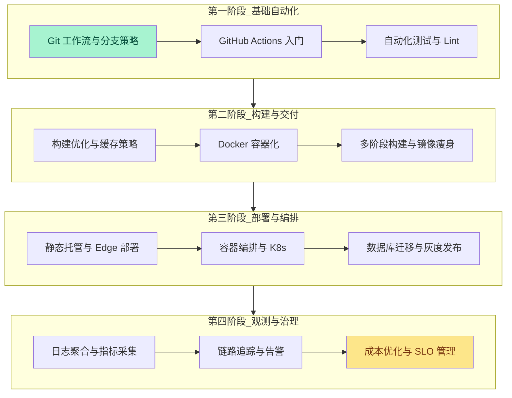
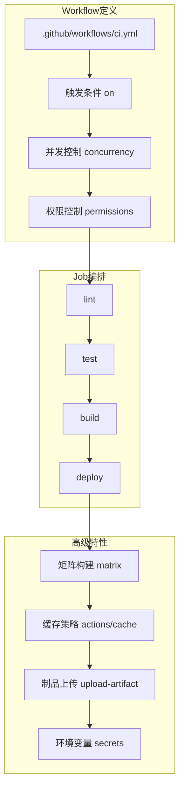
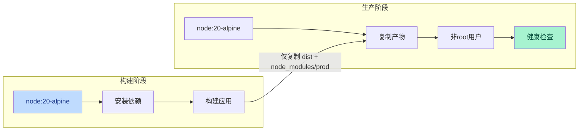
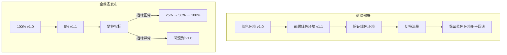

# 🚀 DevOps 示例

> DevOps 不是工具链的堆砌，而是开发与运维之间持续反馈的文化与工程实践。本示例库聚焦 JavaScript / TypeScript 生态中的 DevOps 工程实践，从代码提交到生产部署，提供可运行、可观测、可回滚的自动化方案。

现代前端与全栈应用的交付节奏已从“周级发布”演进为“日级甚至小时级发布”。持续集成（CI）确保每次代码变更都经过自动化验证，持续交付（CD）确保验证通过的代码可随时部署到生产环境。本目录提供的示例遵循以下设计原则：

- **Pipeline as Code**：所有流水线配置使用 YAML 或 TypeScript 声明式定义，版本控制与代码同库管理
- **环境一致性**：通过容器化与基础设施即代码（IaC）消除"在我机器上能跑"的不可复现问题
- **安全左移**：在 CI 阶段集成依赖扫描、秘密检测、代码质量门禁，将安全问题拦截在合并之前
- **可观测性内置**：每个部署示例均包含日志聚合、指标采集、链路追踪与告警策略

---

## 学习路径

以下流程图展示了从基础自动化到生产级 DevOps 平台的推荐学习顺序。建议按照阶段递进，每个阶段均包含工具选型、配置实现与运维复盘三个环节。

### 各阶段关键产出

| 阶段 | 核心技能 | 预期产出 | 验证标准 |
|------|---------|---------|---------|
| **第一阶段** | 掌握 Git Flow / Trunk Based 开发，配置基础 CI | 每次 PR 自动运行测试与 Lint | 合并前必须通过所有检查 |
| **第二阶段** | 构建产物优化，Docker 多阶段构建 | 镜像体积 < 100MB，构建时间 < 2min | 缓存命中率 > 80% |
| **第三阶段** | 基础设施即代码，健康检查，蓝绿部署 | 零停机部署，回滚时间 < 5min | 部署成功率 > 99% |
| **第四阶段** | 可观测性体系，SLO 定义，成本归因 | 完整的监控大盘与告警规则 | MTTR < 30min |

---

## DevOps 领域全景

### CI/CD 流水线架构

一条生产级的 CI/CD 流水线通常包含以下阶段：

```mermaid
flowchart LR
    subgraph 代码阶段
        A1[Code Push] --> A2[Lint & Format]
        A2 --> A3[Unit Test]
        A3 --> A4[Type Check]
    end
    subgraph 构建阶段
        B1[Build] --> B2[Bundle Analysis]
        B2 --> B3[Security Scan]
        B3 --> B4[Docker Build]
    end
    subgraph 部署阶段
        C1[Staging Deploy] --> C2[E2E Test]
        C2 --> C3[Prod Deploy]
        C3 --> C4[Smoke Test]
    end
    A4 --> B1
    B4 --> C1
    C4 --> D1[Notify & Monitor]
    style A1 fill:#a7f3d0,color:#064e3b
    style D1 fill:#fde68a,color:#78350f
```

### 核心领域速查表

| 领域 | 核心工具 | 关键实践 | 度量指标 |
|------|---------|---------|---------|
| **持续集成** | GitHub Actions, GitLab CI, CircleCI | Pipeline as Code, 并行作业, 缓存优化 | 构建时间, 失败率, 恢复时间 |
| **容器化** | Docker, BuildKit, distroless | 多阶段构建, 非 root 用户, 镜像扫描 | 镜像体积, CVE 数量, 启动时间 |
| **编排与部署** | Kubernetes, Docker Compose, Helm | 健康检查, HPA, 滚动更新 | 可用性, 扩缩容延迟, 资源利用率 |
| **基础设施** | Terraform, Pulumi, AWS CDK | 状态管理, 模块化, 漂移检测 | 部署一致性, 计划变更数 |
| **可观测性** | Prometheus, Grafana, Loki, Jaeger | RED 指标, 结构化日志, 分布式追踪 | 覆盖率, 告警准确率, MTTR |
| **安全治理** | Snyk, Trivy, OWASP ZAP, Semgrep | SCA, SAST, DAST, 秘密扫描 | 漏洞修复周期, 误报率 |

---

## 示例目录

| 序号 | 主题 | 文件 | 难度 | 预计时长 |
|------|------|------|------|---------|
| 01 | GitHub Actions 前端流水线设计 | 查看 | 初级 | 45 min |
| 02 | Docker 多阶段构建与优化 | 查看 | 中级 | 60 min |
| 03 | Kubernetes 前端服务部署 | 查看 | 高级 | 90 min |
| 04 | Terraform 云基础设施即代码 | 查看 | 高级 | 90 min |
| 05 | 可观测性体系搭建 | 查看 | 中级 | 75 min |
| 06 | 安全扫描与合规流水线 | 查看 | 中级 | 60 min |
| 07 | 蓝绿部署与金丝雀发布 | 查看 | 专家 | 120 min |
| 08 | Monorepo CI 缓存策略 | 查看 | 中级 | 50 min |

> **注意**：部分示例文件正在编写中。当前目录已建立索引框架，示例内容将逐步补充完善。欢迎参考 [CI/CD 工具对比](/comparison-matrices/ci-cd-tools-compare.html) 与 [部署平台对比](/comparison-matrices/deployment-platforms-compare.html) 获取工具选型参考。

---

## 技术栈与工具链

本目录示例涉及的完整 DevOps 技术栈：

| 层级 | 技术选型 | 版本要求 | 用途 |
|------|---------|---------|------|
| **CI 平台** | GitHub Actions | — | 代码提交触发自动化流水线 |
| **容器引擎** | Docker + BuildKit | ≥ 24.0 | 构建、运行、分发容器镜像 |
| **编排平台** | Kubernetes | ≥ 1.28 | 容器编排、服务发现、自动扩缩容 |
| **包管理** | Helm | ≥ 3.13 | K8s 应用包管理 |
| **IaC** | Terraform / Pulumi | ≥ 1.6 | 声明式云基础设施管理 |
| **监控** | Prometheus + Grafana | — | 指标采集与可视化大盘 |
| **日志** | Loki / Vector | — | 日志聚合与查询 |
| **追踪** | Jaeger / Tempo | — | 分布式链路追踪 |
| **安全** | Trivy, Snyk, Semgrep | — | 镜像扫描、依赖审计、静态分析 |
| **通知** | Slack / PagerDuty / Discord | — | 告警通知与值班响应 |

---

## 核心实践详解

### 流水线即代码（Pipeline as Code）

将 CI/CD 配置与业务代码存放于同一仓库，是实现 GitOps 的基础实践。以下是一个生产级 GitHub Actions 工作流的结构：

**关键设计原则**：

1. **最小权限原则**：为工作流分配精确的 `permissions`，避免使用宽泛的 `write-all`。
2. **并发控制**：使用 `concurrency` 防止同一分支的多个流水线同时运行，避免资源冲突与状态污染。
3. **缓存分层**：将 `node_modules`、构建缓存、Docker 层缓存分离管理，最大化缓存命中率。
4. **制品管理**：将构建产物作为 artifact 上传，供下游 job 下载，避免重复构建。

### 容器化最佳实践

**Dockerfile 优化检查清单**：

| 检查项 | 优化前 | 优化后 | 收益 |
|--------|--------|--------|------|
| 基础镜像 | `node:20` (~1GB) | `node:20-alpine` (~180MB) | 体积减少 ~80% |
| 构建阶段 | 单阶段构建 | 多阶段构建 | 生产镜像不含 devDependencies |
| 依赖安装 | `npm install` | `npm ci --only=production` | 可复现、更小的 node_modules |
| 层缓存 | 频繁变更的指令在前 | 频繁变更的指令在后 | 缓存命中率提升 |
| 安全运行 | `USER root` | `USER node` | 降低容器逃逸风险 |
| 健康检查 | 无 | `HEALTHCHECK --interval=30s` | K8s 可自动重启故障容器 |

### 部署策略对比

| 策略 | 描述 | 零停机 | 资源需求 | 回滚速度 | 风险 |
|------|------|--------|---------|---------|------|
| **滚动更新** | 逐步替换旧实例 | ✅ | 低 | 慢 | 中 |
| **蓝绿部署** | 同时维护两套环境，一键切换 | ✅ | 高（2x） | 极快 | 低 |
| **金丝雀发布** | 逐步将流量切到新版本 | ✅ | 中 | 快 | 低 |
| **A/B 测试** | 按用户维度分流 | ✅ | 中 | 快 | 低 |
| **特性开关** | 代码全量部署，功能渐进开启 | ✅ | 低 | 极快 | 低 |

---

## 专题映射

### 与 [CI/CD 工具对比](/comparison-matrices/ci-cd-tools-compare.html) 的映射

本目录的流水线示例可直接对应该对比矩阵中的工具选型结论：

| 本专题示例 | CI/CD 对比矩阵 | 关联点 |
|-----------|--------------|--------|
| GitHub Actions 流水线 | GitHub Actions vs GitLab CI vs CircleCI | 触发机制、Runner 管理、社区生态 |
| Monorepo CI 缓存 | Turborepo / Nx / Lerna 集成 | 任务图、远程缓存、变更检测 |
| 安全扫描流水线 | SAST/SCA/DAST 工具矩阵 | 扫描深度、误报率、集成成本 |

### 与 [部署平台对比](/comparison-matrices/deployment-platforms-compare.html) 的映射

| 本专题示例 | 部署平台对比 | 关联点 |
|-----------|------------|--------|
| 静态托管部署 | Vercel vs Netlify vs Cloudflare Pages | Edge 节点、构建缓存、回滚策略 |
| K8s 部署 | AWS EKS vs GKE vs Azure AKS | 托管成本、控制平面可用性 |
| 容器注册表 | Docker Hub vs GHCR vs ECR | 拉取限速、漏洞扫描、Geo 复制 |

### 与 [应用设计](/application-design/) 的映射

| 本专题示例 | 应用设计专题 | 关联点 |
|-----------|------------|--------|
| 微服务部署 | [微服务设计](/application-design/05-microservices-design.html) | 服务边界、通信模式、数据一致性 |
| 可观测性体系 | [可观测性设计](/application-design/10-observability-design.html) | 三大支柱、SLI/SLO/SLA、告警 fatigue |
| 安全流水线 | [安全设计](/application-design/09-security-by-design.html) | 纵深防御、零信任、供应链安全 |
| 事件驱动架构 | [事件驱动架构](/application-design/06-event-driven-architecture.html) | 消息队列、事件溯源、CQRS |

### 与 [架构图](/diagrams/) 的映射

| 本专题示例 | 架构图专题 | 关联点 |
|-----------|----------|--------|
| CI/CD 流水线设计 | [CI/CD 流水线图](/diagrams/ci-cd-pipeline.html) | 阶段划分、依赖关系、并行策略 |
| 微服务部署模式 | [微服务架构模式](/diagrams/microservices-patterns.html) | 服务网格、网关模式、断路器 |

---

## 常见问题速查

### Q1: GitHub Actions 的 Runner 选型和成本如何权衡？

- **GitHub 托管 Runner**：适合中小团队，零运维成本，但构建时间受限于共享资源。
- **自托管 Runner**：适合大型团队或特定硬件需求（如 GPU、ARM 架构），需要自行维护基础设施。
- **大型 Runner**：GitHub 提供的付费高性能 Runner，适合需要快速构建的 Monorepo 项目。

### Q2: Docker 镜像体积优化的极限在哪里？

对于 Node.js 前端应用，极限优化路径为：

1. 使用 `node:20-alpine` 或 `node:20-slim` 作为基础镜像
2. 多阶段构建，仅复制 `dist/` 目录与生产依赖
3. 使用 `npm ci --only=production` 安装依赖
4. 启用 Docker BuildKit 的 `--mount=type=cache` 进行层缓存
5. 若使用 Next.js / Nuxt，可进一步采用 standalone 输出模式，仅保留 `.next/standalone` 与 `.next/static`

### Q3: Kubernetes 前端部署是否需要 SSR 特殊处理？

是的。纯静态前端（SPA）可直接使用 Nginx / Caddy 容器托管；而 SSR 应用（Next.js、Nuxt、SvelteKit）需要：

1. 容器内运行 Node.js 服务进程
2. 配置 `readinessProbe` 与 `livenessProbe`
3. 设置合理的 `resources.requests` 与 `resources.limits`
4. 使用 HPA（Horizontal Pod Autoscaler）根据 CPU / 内存 / 自定义指标自动扩缩容

### Q4: 如何构建可观测性体系？

遵循 **三大支柱** 原则：

1. **指标（Metrics）**：使用 Prometheus 采集 RED 指标（Rate, Errors, Duration），在 Grafana 建立大盘。
2. **日志（Logs）**：使用结构化日志（JSON 格式），通过 Loki 或 Vector 聚合，支持标签过滤。
3. **追踪（Traces）**：使用 OpenTelemetry 自动埋点，通过 Jaeger 或 Tempo 查看分布式调用链。

进阶实践：将三者关联（Metrics → Logs → Traces），实现从告警到根因的分钟级定位。

---

## 参考资源

### 官方文档

- [GitHub Actions 官方文档](https://docs.github.com/en/actions)
- [Docker 官方文档](https://docs.docker.com/)
- [Kubernetes 官方文档](https://kubernetes.io/docs/)
- [Terraform 官方文档](https://developer.hashicorp.com/terraform/docs)
- [Prometheus 官方文档](https://prometheus.io/docs/)
- [OpenTelemetry 官方文档](https://opentelemetry.io/docs/)

### 经典书籍

- *The DevOps Handbook* — Gene Kim, Jez Humble, Patrick Debois
- *Continuous Delivery* — Jez Humble, David Farley
- *Kubernetes in Action* — Marko Lukša
- *Terraform: Up & Running* — Yevgeniy Brikman

### 社区与工具

- [awesome-ciandcd](https://github.com/ciandcd/awesome-ciandcd) — CI/CD 资源精选
- [CNCF Landscape](https://landscape.cncf.io/) — 云原生技术全景图
- [GitHub Actions 市场](https://github.com/marketplace?type=actions) — 官方 Actions 插件库
- [Artifact Hub](https://artifacthub.io/) — Helm Charts 与 K8s 插件市场

---

> 💡 **贡献提示**：如果你希望补充新的 DevOps 示例（如 ArgoCD GitOps 实践、AWS CDK 基础设施定义、Chaos Engineering 故障注入等），请参考 CONTRIBUTING.md 提交 PR。每个新增示例应包含完整的配置文件、部署命令与验证步骤。
