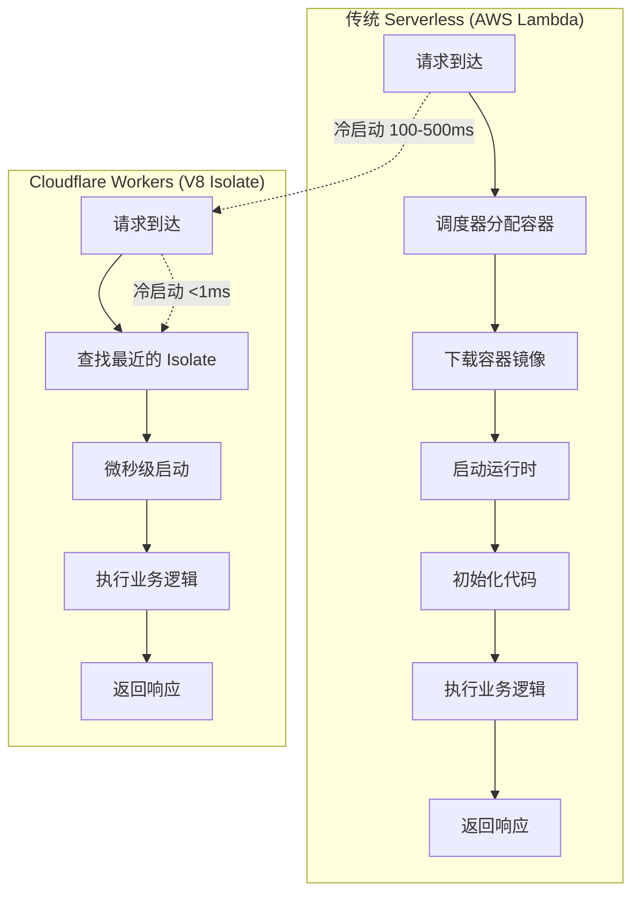
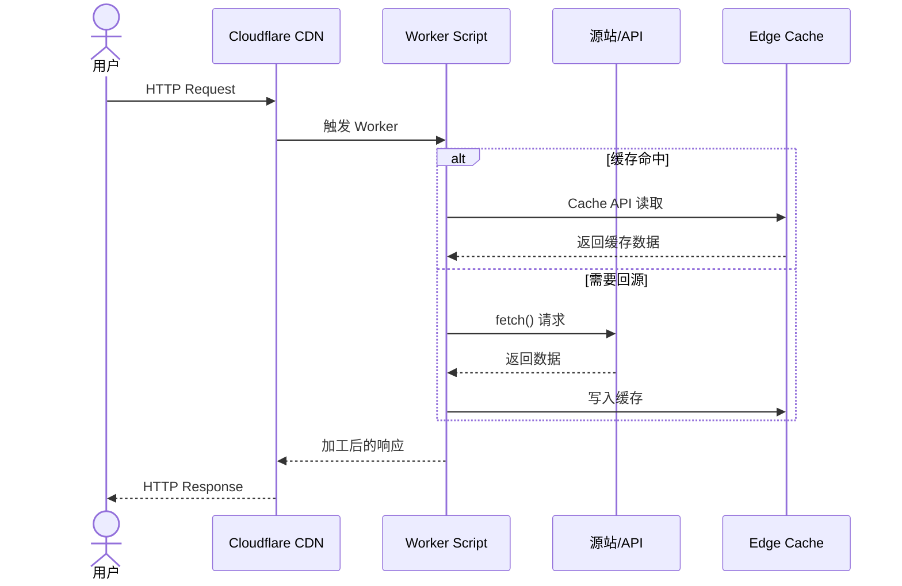
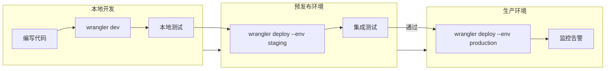
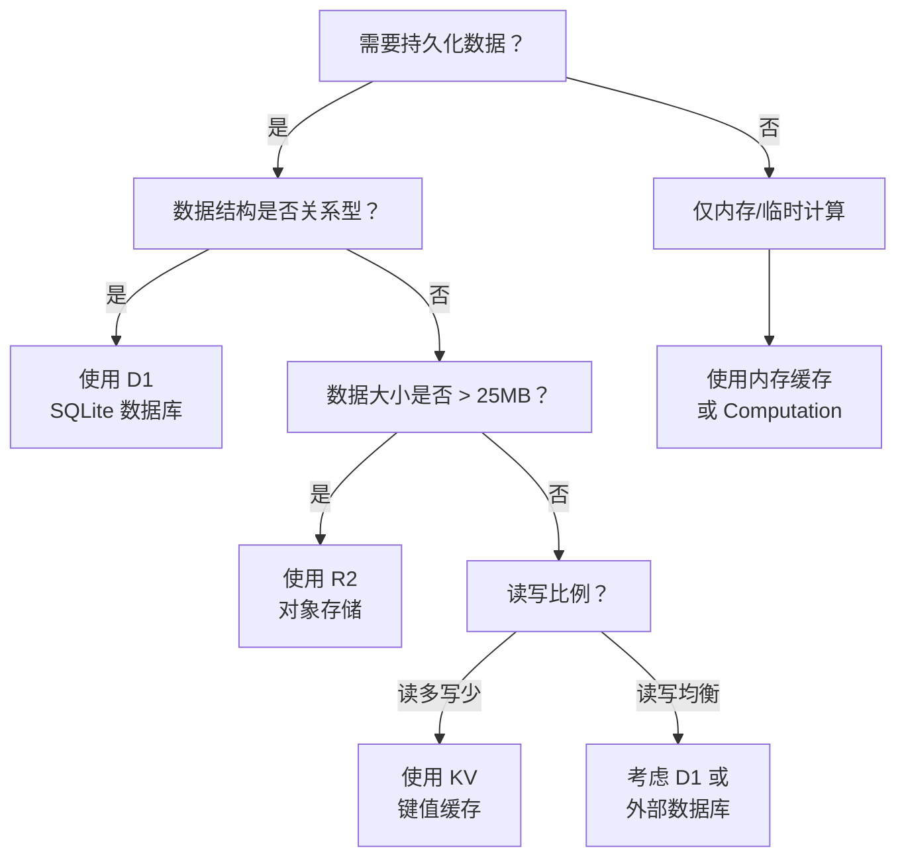

# Cloudflare Workers 边缘部署实战

Cloudflare Workers 是当前边缘计算领域最成熟的 Serverless 平台之一。它基于 V8 Isolates 技术，在全球 300+ 城市的数据中心运行 JavaScript/WASM 代码，将请求响应延迟控制在毫秒级别。本文将深入 Workers 架构原理，并通过实战案例展示完整的边缘应用开发与部署流程。

## 目录

- [Workers 架构与 V8 Isolate 模型](#workers-架构与-v8-isolate-模型)
- [Wrangler CLI 配置与部署](#wrangler-cli-配置与部署)
- [KV / D1 / R2 存储绑定](#kv--d1--r2-存储绑定)
- [边缘缓存策略与 Cache API](#边缘缓存策略与-cache-api)
- [与 Next.js / Nuxt 的集成](#与-nextjs--nuxt-的集成)
- [总结与最佳实践](#总结与最佳实践)
- [参考资源](#参考资源)

---

## Workers 架构与 V8 Isolate 模型

### 传统 Serverless vs Workers

传统的 Serverless 平台（如 AWS Lambda）基于容器或微虚拟机（microVM）模型。每次函数调用都需要经历冷启动过程：分配计算资源、加载运行时、初始化执行环境。尽管厂商通过各种优化手段将冷启动时间缩短到数百毫秒，但在全球分布式场景下，这种延迟仍然不可忽视。

Cloudflare Workers 采用了截然不同的架构。它直接在 V8 JavaScript 引擎中运行代码，利用 V8 Isolates 作为轻量级沙箱。每个 Isolate 的启动时间以微秒计，内存占用以 KB 计，这使得 Workers 能够在接收到请求的瞬间就开始执行代码。



### V8 Isolate 技术原理

V8 Isolates 是 Chrome V8 引擎提供的一种轻量级执行上下文。与进程或线程不同，Isolate 共享同一个 V8 堆，但通过严格的内存隔离保证安全性。关键特性包括：

- **内存隔离**：每个 Isolate 拥有独立的堆内存空间，防止跨租户数据泄露
- **零冷启动**：Isolate 可以预先初始化并处于休眠状态，请求到达时立即唤醒
- **资源受限**：单个请求有 50ms CPU 时间限制（免费版）或 30s  Wall Clock 时间（付费版）
- **无 Node.js API**：Workers 运行环境不是 Node.js，需要适配或使用 polyfill

```javascript
// Workers 运行时不支持 Node.js 核心模块
// 错误示例
const fs = require("fs"); // ❌ 不可用
const http = require("http"); // ❌ 不可用

// 正确示例：使用 Web 标准 API
const response = await fetch("https://api.example.com/data");
const text = await response.text();
```

### Workers 请求生命周期



### Workers 运行环境限制

| 资源 | 免费版 | 付费版 (Bundled) | 付费版 (Unbound) |
|------|--------|------------------|------------------|
| 请求数 | 100,000/天 | 无限制 | 无限制 |
| CPU 时间 | 10ms/请求 | 50ms/请求 | 30s Wall Clock |
| 内存 | 128MB | 128MB | 128MB |
| 子请求 | 50/请求 | 50/请求 | 1000/请求 |
| 脚本大小 | 1MB | 1MB | 1MB |
| KV 读取 | 100,000/天 | 无限制 | 无限制 |

---

## Wrangler CLI 配置与部署

Wrangler 是 Cloudflare 官方提供的 CLI 工具，用于开发、测试和部署 Workers 应用。

### 初始化项目

```bash
# 安装 Wrangler
npm install -g wrangler

# 登录 Cloudflare 账号
wrangler login

# 创建新 Workers 项目
npm create cloudflare@latest my-worker
# 选择："Hello World" Worker / TypeScript

# 进入项目
cd my-worker
```

### 项目结构与核心文件

```
my-worker/
├── src/
│   └── index.ts          # Worker 入口文件
├── wrangler.jsonc        # 配置文件 (v3 推荐格式)
├── package.json
├── tsconfig.json
└── .dev.vars             # 本地开发环境变量
```

### wrangler.jsonc 配置详解

```json
// wrangler.jsonc
&#123;
  "$schema": "node_modules/wrangler/config-schema.json",
  "name": "my-worker",
  "main": "src/index.ts",
  "compatibility_date": "2026-04-01",
  "compatibility_flags": ["nodejs_compat"],
  "workers_dev": true,
  "routes": [
    &#123;
      "pattern": "api.example.com/*",
      "custom_domain": true
    &#125;
  ],
  "vars": &#123;
    "ENVIRONMENT": "production",
    "API_VERSION": "v1"
  &#125;,
  "kv_namespaces": [
    &#123;
      "binding": "CACHE",
      "id": "your-kv-namespace-id",
      "preview_id": "your-preview-kv-id"
    &#125;
  ],
  "d1_databases": [
    &#123;
      "binding": "DB",
      "database_name": "production-db",
      "database_id": "your-d1-database-id"
    &#125;
  ],
  "r2_buckets": [
    &#123;
      "binding": "STORAGE",
      "bucket_name": "my-bucket"
    &#125;
  ],
  "analytics_engine_datasets": [
    &#123;
      "binding": "ANALYTICS",
      "dataset": "page_views"
    &#125;
  ],
  "observability": &#123;
    "enabled": true,
    "head_sampling_rate": 1
  &#125;,
  "limits": &#123;
    "cpu_ms": 30000
  &#125;
&#125;
```

### Worker 入口文件开发

```typescript
// src/index.ts
import &#123; Hono &#125; from "hono";
import &#123; cors &#125; from "hono/cors";
import &#123; logger &#125; from "hono/logger";
import &#123; prettyJSON &#125; from "hono/pretty-json";

// 定义环境变量类型
export interface Env &#123;
  CACHE: KVNamespace;
  DB: D1Database;
  STORAGE: R2Bucket;
  ANALYTICS: AnalyticsEngineDataset;
  ENVIRONMENT: string;
  API_VERSION: string;
  SECRET_KEY: string;
&#125;

// 创建 Hono 应用实例
const app = new Hono&lt;&#123; Bindings: Env &#125;&gt;();

// 全局中间件
app.use("*", logger());
app.use("*", cors(&#123;
  origin: ["https://example.com", "https://app.example.com"],
  allowMethods: ["GET", "POST", "PUT", "DELETE", "OPTIONS"],
  allowHeaders: ["Content-Type", "Authorization"],
  credentials: true,
&#125;));
app.use("*", prettyJSON());

// 健康检查
app.get("/health", (c) => &#123;
  return c.json(&#123;
    status: "ok",
    version: c.env.API_VERSION,
    environment: c.env.ENVIRONMENT,
    timestamp: new Date().toISOString(),
  &#125;);
&#125;);

// API 路由组
app.route("/api/v1/products", productsRouter);
app.route("/api/v1/users", usersRouter);
app.route("/api/v1/orders", ordersRouter);

// 全局错误处理
app.onError((err, c) => &#123;
  console.error(`Error: $&#123;err.message&#125;`);
  return c.json(&#123;
    success: false,
    error: &#123;
      message: c.env.ENVIRONMENT === "production"
        ? "Internal Server Error"
        : err.message,
      code: "INTERNAL_ERROR",
    &#125;,
  &#125;, 500);
&#125;);

// 404 处理
app.notFound((c) => &#123;
  return c.json(&#123;
    success: false,
    error: &#123;
      message: "Not Found",
      code: "NOT_FOUND",
      path: c.req.path,
    &#125;,
  &#125;, 404);
&#125;);

// Workers 入口点
export default app;
```

### 本地开发与调试

```bash
# 启动本地开发服务器
wrangler dev

# 指定端口和 IP
wrangler dev --port 8787 --ip 0.0.0.0

# 使用远程资源进行开发（连接真实 KV/D1）
wrangler dev --remote

# 带环境变量的本地开发
wrangler dev --var ENVIRONMENT:development
```

### 部署流程

```bash
# 部署到 Workers 平台
wrangler deploy

# 部署到特定环境
wrangler deploy --env staging

# 查看部署日志
wrangler tail

# 查看特定环境日志
wrangler tail --env production
```



---

## KV / D1 / R2 存储绑定

Cloudflare 提供了三种核心存储服务，分别适用于不同的数据持久化场景。

### KV (Key-Value Store)

KV 是最终一致性的全球分布式键值存储，适合读取频繁、写入较少的场景，如配置数据、会话缓存、A/B 测试标记等。

```typescript
// src/services/cache.ts
import type &#123; Context &#125; from "hono";
import type &#123; Env &#125; from "../index";

const CACHE_TTL = 86400; // 24 hours

export async function getCached&lt;T&gt;(
  c: Context&lt;&#123; Bindings: Env &#125;&gt;,
  key: string
): Promise&lt;T | null&gt; &#123;
  const cached = await c.env.CACHE.get(key);
  if (!cached) return null;
  return JSON.parse(cached) as T;
&#125;

export async function setCached&lt;T&gt;(
  c: Context&lt;&#123; Bindings: Env &#125;&gt;,
  key: string,
  value: T,
  ttl: number = CACHE_TTL
): Promise&lt;void&gt; &#123;
  await c.env.CACHE.put(key, JSON.stringify(value), &#123;
    expirationTtl: ttl,
  &#125;);
&#125;

export async function deleteCached(
  c: Context&lt;&#123; Bindings: Env &#125;&gt;,
  key: string
): Promise&lt;void&gt; &#123;
  await c.env.CACHE.delete(key);
&#125;

// 使用示例
app.get("/api/v1/products/:id", async (c) => &#123;
  const productId = c.req.param("id");
  const cacheKey = `product:$&#123;productId&#125;`;

  // 尝试读取缓存
  const cached = await getCached(c, cacheKey);
  if (cached) &#123;
    return c.json(&#123; success: true, data: cached, source: "cache" &#125;);
  &#125;

  // 回源查询
  const product = await c.env.DB
    .prepare("SELECT * FROM products WHERE id = ?")
    .bind(productId)
    .first();

  if (!product) &#123;
    return c.json(&#123; success: false, error: "Product not found" &#125;, 404);
  &#125;

  // 写入缓存
  await setCached(c, cacheKey, product, 3600);

  return c.json(&#123; success: true, data: product, source: "database" &#125;);
&#125;);
```

### D1 (SQLite Database)

D1 是基于 SQLite 的边缘关系型数据库，支持 SQL 查询和事务。它适合结构化数据存储，如用户资料、订单记录等。

```typescript
// src/services/database.ts
import type &#123; D1Database &#125; from "@cloudflare/workers-types";

export interface Product &#123;
  id: string;
  name: string;
  description: string | null;
  price: number;
  category_id: string;
  created_at: string;
  updated_at: string;
&#125;

export class ProductRepository &#123;
  constructor(private db: D1Database) &#123;&#125;

  async findById(id: string): Promise&lt;Product | null&gt; &#123;
    return this.db
      .prepare(`
        SELECT p.*, c.name as category_name
        FROM products p
        LEFT JOIN categories c ON p.category_id = c.id
        WHERE p.id = ?
      `)
      .bind(id)
      .first&lt;Product&gt;();
  &#125;

  async findAll(options: &#123;
    category?: string;
    page?: number;
    limit?: number;
    sortBy?: string;
    sortOrder?: "asc" | "desc";
  &#125; = &#123;&#125;): Promise&lt;&#123; data: Product[]; total: number &#125;&gt; &#123;
    const &#123;
      category,
      page = 1,
      limit = 20,
      sortBy = "created_at",
      sortOrder = "desc",
    &#125; = options;

    const offset = (page - 1) * limit;
    const conditions: string[] = [];
    const params: (string | number)[] = [];

    if (category) &#123;
      conditions.push("p.category_id = ?");
      params.push(category);
    &#125;

    const whereClause = conditions.length
      ? `WHERE $&#123;conditions.join(" AND ")&#125;`
      : "";

    const countQuery = `
      SELECT COUNT(*) as total
      FROM products p
      $&#123;whereClause&#125;
    `;

    const dataQuery = `
      SELECT p.*, c.name as category_name
      FROM products p
      LEFT JOIN categories c ON p.category_id = c.id
      $&#123;whereClause&#125;
      ORDER BY p.$&#123;sortBy&#125; $&#123;sortOrder&#125;
      LIMIT ? OFFSET ?
    `;

    const [countResult, dataResult] = await Promise.all([
      this.db.prepare(countQuery).bind(...params).first&lt;&#123; total: number &#125;&gt;(),
      this.db
        .prepare(dataQuery)
        .bind(...params, limit, offset)
        .all&lt;Product&gt;(),
    ]);

    return &#123;
      data: dataResult.results ?? [],
      total: countResult?.total ?? 0,
    &#125;;
  &#125;

  async create(data: Omit&lt;Product, "id" | "created_at" | "updated_at"&gt;): Promise&lt;Product&gt; &#123;
    const id = crypto.randomUUID();
    const now = new Date().toISOString();

    await this.db
      .prepare(`
        INSERT INTO products (id, name, description, price, category_id, created_at, updated_at)
        VALUES (?, ?, ?, ?, ?, ?, ?)
      `)
      .bind(id, data.name, data.description, data.price, data.category_id, now, now)
      .run();

    const product = await this.findById(id);
    if (!product) throw new Error("Failed to create product");
    return product;
  &#125;

  async update(
    id: string,
    data: Partial&lt;Omit&lt;Product, "id" | "created_at"&gt;&gt;
  ): Promise&lt;Product&gt; &#123;
    const sets: string[] = [];
    const params: (string | number | null)[] = [];

    for (const [key, value] of Object.entries(data)) &#123;
      if (value !== undefined) &#123;
        sets.push(`$&#123;key&#125; = ?`);
        params.push(value);
      &#125;
    &#125;

    params.push(new Date().toISOString());
    params.push(id);

    await this.db
      .prepare(`
        UPDATE products
        SET $&#123;sets.join(", ")&#125;, updated_at = ?
        WHERE id = ?
      `)
      .bind(...params)
      .run();

    const product = await this.findById(id);
    if (!product) throw new Error("Product not found");
    return product;
  &#125;

  async delete(id: string): Promise&lt;void&gt; &#123;
    await this.db
      .prepare("DELETE FROM products WHERE id = ?")
      .bind(id)
      .run();
  &#125;

  // 事务示例
  async batchUpdate(updates: Array&lt;&#123; id: string; price: number &#125;&gt;): Promise&lt;void&gt; &#123;
    const statements = updates.map((update) =>
      this.db
        .prepare("UPDATE products SET price = ?, updated_at = ? WHERE id = ?")
        .bind(update.price, new Date().toISOString(), update.id)
    );

    await this.db.batch(statements);
  &#125;
&#125;
```

### D1 迁移管理

```bash
# 创建迁移文件
wrangler d1 migrations create production-db init_schema

# 应用迁移
wrangler d1 migrations apply production-db --local
wrangler d1 migrations apply production-db --remote

# 执行 SQL
wrangler d1 execute production-db --command "SELECT * FROM products LIMIT 5"
```

```sql
-- migrations/0001_init_schema.sql
CREATE TABLE IF NOT EXISTS categories (
  id TEXT PRIMARY KEY,
  name TEXT NOT NULL,
  slug TEXT UNIQUE NOT NULL,
  description TEXT,
  created_at DATETIME DEFAULT CURRENT_TIMESTAMP
);

CREATE TABLE IF NOT EXISTS products (
  id TEXT PRIMARY KEY,
  name TEXT NOT NULL,
  description TEXT,
  price REAL NOT NULL CHECK (price >= 0),
  category_id TEXT NOT NULL,
  created_at DATETIME DEFAULT CURRENT_TIMESTAMP,
  updated_at DATETIME DEFAULT CURRENT_TIMESTAMP,
  FOREIGN KEY (category_id) REFERENCES categories(id)
);

CREATE INDEX idx_products_category ON products(category_id);
CREATE INDEX idx_products_created ON products(created_at);

CREATE TRIGGER update_products_timestamp
AFTER UPDATE ON products
BEGIN
  UPDATE products SET updated_at = CURRENT_TIMESTAMP WHERE id = NEW.id;
END;
```

### R2 (Object Storage)

R2 是兼容 S3 API 的对象存储服务，适合存储图片、视频、文档等静态资源。

```typescript
// src/services/storage.ts
import type &#123; R2Bucket, R2Object, R2MultipartUpload &#125; from "@cloudflare/workers-types";

export class StorageService &#123;
  constructor(private bucket: R2Bucket) &#123;&#125;

  async uploadFile(
    key: string,
    data: ReadableStream | ArrayBuffer | string,
    metadata?: Record&lt;string, string&gt;
  ): Promise&lt;R2Object&gt; &#123;
    const result = await this.bucket.put(key, data, &#123;
      customMetadata: metadata,
      httpMetadata: &#123;
        contentType: this.inferContentType(key),
      &#125;,
    &#125;);
    return result;
  &#125;

  async getFile(key: string): Promise&lt;
    &#123; data: ReadableStream; metadata: R2Object &#125; | null
  &gt; &#123;
    const object = await this.bucket.get(key);
    if (!object) return null;
    return &#123; data: object.body, metadata: object &#125;;
  &#125;

  async deleteFile(key: string): Promise&lt;void&gt; &#123;
    await this.bucket.delete(key);
  &#125;

  async listFiles(
    prefix?: string,
    limit: number = 100
  ): Promise&lt;R2Object[]&gt; &#123;
    const listed = await this.bucket.list(&#123;
      prefix,
      limit,
    &#125;);
    return listed.objects;
  &#125;

  async generatePresignedUrl(key: string, expiresIn: number = 3600): Promise&lt;string&gt; &#123;
    // Workers 环境中可以使用 @aws-sdk/s3-request-presigner
    // 或直接使用 R2 的公开访问策略
    const signedUrl = await this.bucket.createSignedUrl(key, &#123;
      expiresIn,
    &#125;);
    return signedUrl;
  &#125;

  private inferContentType(filename: string): string &#123;
    const ext = filename.split(".").pop()?.toLowerCase();
    const types: Record&lt;string, string&gt; = &#123;
      jpg: "image/jpeg",
      jpeg: "image/jpeg",
      png: "image/png",
      gif: "image/gif",
      webp: "image/webp",
      svg: "image/svg+xml",
      pdf: "application/pdf",
      json: "application/json",
      txt: "text/plain",
    &#125;;
    return types[ext ?? ""] || "application/octet-stream";
  &#125;
&#125;

// 图片上传路由
app.post("/api/v1/upload", async (c) => &#123;
  const formData = await c.req.formData();
  const file = formData.get("file") as File;

  if (!file) &#123;
    return c.json(&#123; success: false, error: "No file provided" &#125;, 400);
  &#125;

  // 文件大小检查 (最大 10MB)
  const MAX_SIZE = 10 * 1024 * 1024;
  if (file.size > MAX_SIZE) &#123;
    return c.json(&#123; success: false, error: "File too large (max 10MB)" &#125;, 400);
  &#125;

  // 生成唯一文件名
  const ext = file.name.split(".").pop();
  const key = `uploads/$&#123;crypto.randomUUID()&#125;.$&#123;ext&#125;`;

  const storage = new StorageService(c.env.STORAGE);
  const result = await storage.uploadFile(key, await file.arrayBuffer(), &#123;
    originalName: file.name,
    uploadedBy: "anonymous",
    contentType: file.type,
  &#125;);

  return c.json(&#123;
    success: true,
    data: &#123;
      key: result.key,
      size: result.size,
      etag: result.httpEtag,
    &#125;,
  &#125;);
&#125;);
```

### 存储服务选型决策树



---

## 边缘缓存策略与 Cache API

Workers 提供了原生的 Cache API，允许在边缘节点缓存响应，显著降低回源延迟。

### Cache API 基础用法

```typescript
// src/middleware/cache.ts
import type &#123; Context, Next &#125; from "hono";
import type &#123; Env &#125; from "../index";

interface CacheConfig &#123;
  maxAge: number;        // 缓存时间（秒）
  staleWhileRevalidate?: number;
  vary?: string[];       // Vary 头字段
  tags?: string[];       // 缓存标签（用于批量清除）
&#125;

export function edgeCache(config: CacheConfig) &#123;
  return async (c: Context&lt;&#123; Bindings: Env &#125;&gt;, next: Next) => &#123;
    const cacheKey = new Request(c.req.url, &#123;
      method: c.req.method,
      headers: &#123;
        "Accept": c.req.header("Accept") ?? "",
        "Accept-Language": c.req.header("Accept-Language") ?? "",
      &#125;,
    &#125;);

    const cache = caches.default;

    // 仅缓存 GET 请求
    if (c.req.method !== "GET") &#123;
      return next();
    &#125;

    // 尝试读取缓存
    const cached = await cache.match(cacheKey);
    if (cached) &#123;
      const cachedAge = Date.now() - new Date(cached.headers.get("date") || 0).getTime();
      const maxAgeMs = config.maxAge * 1000;

      if (cachedAge < maxAgeMs) &#123;
        // 缓存有效，直接返回
        return new Response(cached.body, &#123;
          status: cached.status,
          statusText: cached.statusText,
          headers: &#123;
            ...Object.fromEntries(cached.headers),
            "X-Cache": "HIT",
            "X-Cache-Age": String(Math.floor(cachedAge / 1000)),
          &#125;,
        &#125;);
      &#125;
    &#125;

    // 未命中缓存，执行请求
    await next();

    // 缓存响应
    if (c.res.status === 200) &#123;
      const responseToCache = c.res.clone();
      const headers = new Headers(responseToCache.headers);
      headers.set("Cache-Control", `max-age=$&#123;config.maxAge&#125;$&#123;
        config.staleWhileRevalidate
          ? `, stale-while-revalidate=$&#123;config.staleWhileRevalidate&#125;`
          : ""
      &#125;`);
      headers.set("X-Cache", "MISS");

      const cacheResponse = new Response(responseToCache.body, &#123;
        status: responseToCache.status,
        statusText: responseToCache.statusText,
        headers,
      &#125;);

      await cache.put(cacheKey, cacheResponse);
    &#125;

    return c.res;
  &#125;;
&#125;

// 使用缓存中间件
app.get("/api/v1/products", edgeCache(&#123; maxAge: 300, staleWhileRevalidate: 86400 &#125;), async (c) => &#123;
  const repo = new ProductRepository(c.env.DB);
  const &#123; data, total &#125; = await repo.findAll(c.req.query());
  return c.json(&#123; success: true, data, meta: &#123; total &#125; &#125;);
&#125;);
```

### 分层缓存架构

```typescript
// src/services/multi-tier-cache.ts
export class MultiTierCache&lt;T&gt; &#123;
  constructor(
    private kv: KVNamespace,
    private cacheApi: CacheStorage,
    private options: &#123;
      kvTtl: number;
      edgeTtl: number;
    &#125;
  ) &#123;&#125;

  async get(key: string): Promise&lt;T | null&gt; &#123;
    const cache = this.cacheApi.default;
    const request = new Request(`https://cache.internal/$&#123;key&#125;`);

    // L1: Edge Cache
    const edgeCached = await cache.match(request);
    if (edgeCached) &#123;
      return edgeCached.json() as Promise&lt;T&gt;;
    &#125;

    // L2: KV Store
    const kvCached = await this.kv.get(key);
    if (kvCached) &#123;
      const data = JSON.parse(kvCached) as T;
      // 回填 Edge Cache
      await cache.put(
        request,
        new Response(JSON.stringify(data), &#123;
          headers: &#123;
            "Content-Type": "application/json",
            "Cache-Control": `max-age=$&#123;this.options.edgeTtl&#125;`,
          &#125;,
        &#125;)
      );
      return data;
    &#125;

    return null;
  &#125;

  async set(key: string, value: T): Promise&lt;void&gt; &#123;
    // 写入 KV
    await this.kv.put(key, JSON.stringify(value), &#123;
      expirationTtl: this.options.kvTtl,
    &#125;);

    // 写入 Edge Cache
    const cache = this.cacheApi.default;
    await cache.put(
      new Request(`https://cache.internal/$&#123;key&#125;`),
      new Response(JSON.stringify(value), &#123;
        headers: &#123;
          "Content-Type": "application/json",
          "Cache-Control": `max-age=$&#123;this.options.edgeTtl&#125;`,
        &#125;,
      &#125;)
    );
  &#125;

  async invalidate(key: string): Promise&lt;void&gt; &#123;
    await this.kv.delete(key);
    const cache = this.cacheApi.default;
    await cache.delete(new Request(`https://cache.internal/$&#123;key&#125;`));
  &#125;
&#125;
```

### 缓存清除策略

```typescript
// src/routes/cache.ts
app.post("/api/v1/admin/cache/purge", async (c) => &#123;
  const &#123; tags, prefix, exact &#125; = await c.req.json&lt;&#123;
    tags?: string[];
    prefix?: string;
    exact?: string[];
  &#125;&gt;();

  const results = &#123; deleted: 0, keys: [] as string[] &#125;;

  // 按标签清除（需要在缓存时存储标签映射）
  if (tags && tags.length > 0) &#123;
    for (const tag of tags) &#123;
      const tagKey = `__tag:$&#123;tag&#125;`;
      const keysJson = await c.env.CACHE.get(tagKey);
      if (keysJson) &#123;
        const keys = JSON.parse(keysJson) as string[];
        for (const key of keys) &#123;
          await c.env.CACHE.delete(key);
          results.deleted++;
          results.keys.push(key);
        &#125;
        await c.env.CACHE.delete(tagKey);
      &#125;
    &#125;
  &#125;

  // 按前缀清除
  if (prefix) &#123;
    const listed = await c.env.CACHE.list(&#123; prefix &#125;);
    for (const key of listed.keys) &#123;
      await c.env.CACHE.delete(key.name);
      results.deleted++;
      results.keys.push(key.name);
    &#125;
  &#125;

  // 精确清除
  if (exact) &#123;
    for (const key of exact) &#123;
      await c.env.CACHE.delete(key);
      results.deleted++;
      results.keys.push(key);
    &#125;
  &#125;

  return c.json(&#123;
    success: true,
    data: results,
  &#125;);
&#125;);
```

---

## 与 Next.js / Nuxt 的集成

Cloudflare Workers 不仅可以直接运行原生 Worker 脚本，还可以通过适配器运行完整的 Next.js 和 Nuxt 应用。

### Next.js + @cloudflare/next-on-pages

`@cloudflare/next-on-pages` 是 Cloudflare 官方提供的 Next.js 适配器，支持 App Router 和 Pages Router。

```bash
# 创建 Next.js 项目
npx create-next-app@latest my-next-app --typescript --tailwind --app

# 安装适配器
cd my-next-app
npm install -D @cloudflare/next-on-pages
```

```json
// package.json
&#123;
  "scripts": &#123;
    "dev": "next dev",
    "build": "next build",
    "pages:build": "npx @cloudflare/next-on-pages",
    "preview": "npm run pages:build && wrangler pages dev",
    "deploy": "npm run pages:build && wrangler pages deploy"
  &#125;
&#125;
```

```typescript
// app/api/products/route.ts
import &#123; getRequestContext &#125; from "@cloudflare/next-on-pages";

export const runtime = "edge";

export async function GET(request: Request) &#123;
  const &#123; env &#125; = getRequestContext();
  const &#123; searchParams &#125; = new URL(request.url);

  const page = parseInt(searchParams.get("page") || "1");
  const limit = parseInt(searchParams.get("limit") || "20");
  const category = searchParams.get("category");

  // 使用 D1 数据库
  const db = env.DB;

  let query = "SELECT * FROM products WHERE 1=1";
  const params: (string | number)[] = [];

  if (category) &#123;
    query += " AND category_id = ?";
    params.push(category);
  &#125;

  query += " LIMIT ? OFFSET ?";
  params.push(limit, (page - 1) * limit);

  const &#123; results &#125; = await db.prepare(query).bind(...params).all();

  return Response.json(&#123;
    success: true,
    data: results,
    meta: &#123; page, limit &#125;,
  &#125;);
&#125;

export async function POST(request: Request) &#123;
  const &#123; env &#125; = getRequestContext();
  const body = await request.json();

  const id = crypto.randomUUID();
  const now = new Date().toISOString();

  await env.DB
    .prepare(`
      INSERT INTO products (id, name, description, price, category_id, created_at, updated_at)
      VALUES (?, ?, ?, ?, ?, ?, ?)
    `)
    .bind(id, body.name, body.description ?? null, body.price, body.category_id, now, now)
    .run();

  return Response.json(
    &#123; success: true, data: &#123; id &#125; &#125;,
    &#123; status: 201 &#125;
  );
&#125;
```

```typescript
// app/page.tsx
import &#123; ProductCard &#125; from "@/components/ProductCard";

export const runtime = "edge";

async function getProducts() &#123;
  const res = await fetch(`${process.env.NEXT_PUBLIC_API_URL}/api/products`, &#123;
    next: &#123; revalidate: 60 &#125;,
  &#125;);
  return res.json();
&#125;

export default async function HomePage() &#123;
  const &#123; data: products &#125; = await getProducts();

  return (
    &lt;main className="container mx-auto px-4 py-8"&gt;
      &lt;h1 className="text-3xl font-bold mb-6"&gt;Products&lt;/h1&gt;
      &lt;div className="grid grid-cols-1 md:grid-cols-3 gap-6"&gt;
        &#123;products.map((product: any) => (
          &lt;ProductCard key=&#123;product.id&#125; product=&#123;product&#125; /&gt;
        ))&#125;
      &lt;/div&gt;
    &lt;/main&gt;
  );
&#125;
```

```yaml
# wrangler.toml (Pages 项目)
name = "my-next-app"
compatibility_date = "2026-04-01"
compatibility_flags = ["nodejs_compat"]

[[d1_databases]]
binding = "DB"
database_name = "next-app-db"
database_id = "your-database-id"

[[kv_namespaces]]
binding = "CACHE"
id = "your-kv-namespace-id"
```

### Nuxt + Nitro Cloudflare Preset

Nuxt 3 通过 Nitro 引擎内置了对 Cloudflare Workers 的支持。

```bash
# 创建 Nuxt 项目
npx nuxi@latest init my-nuxt-app
cd my-nuxt-app

# Nitro 已内置 Cloudflare 预设，无需额外安装
```

```typescript
// nuxt.config.ts
export default defineNuxtConfig(&#123;
  nitro: &#123;
    preset: "cloudflare-pages",
    experimental: &#123;
      wasm: true,
    &#125;,
  &#125;,
  runtimeConfig: &#123;
    apiSecret: process.env.API_SECRET,
    public: &#123;
      apiBase: process.env.NUXT_PUBLIC_API_BASE || "/api",
    &#125;,
  &#125;,
&#125;);
```

```typescript
// server/api/products.get.ts
export default defineEventHandler(async (event) =&gt; &#123;
  const query = getQuery(event);
  const &#123; page = 1, limit = 20, category &#125; = query;

  const db = hubDatabase();

  let sql = "SELECT * FROM products WHERE 1=1";
  const params: (string | number)[] = [];

  if (category) &#123;
    sql += " AND category_id = ?";
    params.push(category as string);
  &#125;

  sql += " LIMIT ? OFFSET ?";
  params.push(Number(limit), (Number(page) - 1) * Number(limit));

  const &#123; results &#125; = await db.prepare(sql).bind(...params).all();

  return &#123; success: true, data: results, meta: &#123; page, limit &#125; &#125;;
&#125;);
```

```vue
&lt;!-- pages/index.vue --&gt;
&lt;template&gt;
  &lt;div class="container mx-auto px-4 py-8"&gt;
    &lt;h1 class="text-3xl font-bold mb-6"&gt;Products&lt;/h1&gt;
    &lt;div class="grid grid-cols-1 md:grid-cols-3 gap-6"&gt;
      &lt;ProductCard
        v-for="product in products"
        :key="product.id"
        :product="product"
      /&gt;
    &lt;/div&gt;
  &lt;/div&gt;
&lt;/template&gt;

&lt;script setup&gt;
const &#123; data &#125; = await useFetch("/api/products", &#123;
  key: "products-list",
  server: true,
  default: () => (&#123; data: [] &#125;),
&#125;);

const products = computed(() => data.value?.data ?? []);
&lt;/script&gt;
```

```bash
# 构建并预览
npx nuxt build
npx wrangler pages dev dist/

# 部署
npx wrangler pages deploy dist/
```

### 框架集成对比

| 特性 | Next.js (next-on-pages) | Nuxt (nitro preset) |
|------|-------------------------|---------------------|
| 渲染模式 | SSR / SSG / ISR / Edge | SSR / SSG / Edge |
| API 路由 | App Router / Pages Router | server/api 目录 |
| 数据库访问 | `getRequestContext()` | `hubDatabase()` |
| 中间件 | Edge Middleware | server/middleware |
| 构建输出 | .vercel/output | .output |
| 部署命令 | `wrangler pages deploy` | `wrangler pages deploy` |

---

## 总结与最佳实践

通过本文的实战，我们构建了一个完整的边缘应用，涵盖以下核心能力：

1. **架构理解**：V8 Isolates 提供了微秒级冷启动和全球分布式执行能力，这是 Workers 性能优势的根本来源。

2. **开发效率**：Wrangler CLI 提供了从本地开发到生产部署的完整工具链，`wrangler dev` 的本地模拟环境与生产环境高度一致。

3. **数据持久化**：KV 适合高频读取的缓存场景，D1 适合结构化关系数据，R2 适合大文件对象存储。合理组合三者可以构建高性能的边缘数据层。

4. **缓存优化**：利用 Cache API 实现边缘缓存，配合分层缓存策略（Edge Cache + KV），可将响应延迟降低一个数量级。

5. **框架集成**：通过 `@cloudflare/next-on-pages` 和 Nitro Cloudflare Preset，可以将现有的 Next.js/Nuxt 应用无缝迁移到边缘平台。

### 性能优化检查清单

- [ ] 使用 `wrangler dev --remote` 测试真实网络延迟
- [ ] 为静态资源启用 R2 + 自定义域 + 缓存头
- [ ] 数据库查询使用索引并限制返回字段
- [ ] 实现分层缓存：Edge Cache → KV → D1
- [ ] 监控 CPU 时间消耗，避免超过限制
- [ ] 使用 `AnalyticsEngineDataset` 记录业务指标

---

## 参考资源

- [Cloudflare Workers 官方文档](https://developers.cloudflare.com/workers/) - Workers 平台完整参考
- [Wrangler CLI 文档](https://developers.cloudflare.com/workers/wrangler/) - CLI 工具使用指南
- [Hono 框架文档](https://hono.dev/) - 边缘优先的 Web 框架
- [D1 数据库文档](https://developers.cloudflare.com/d1/) - SQLite 边缘数据库
- [R2 对象存储文档](https://developers.cloudflare.com/r2/) - S3 兼容存储
- [KV 文档](https://developers.cloudflare.com/kv/) - 键值存储服务
- [next-on-pages 文档](https://developers.cloudflare.com/pages/framework-guides/nextjs/) - Next.js 适配器
- [Nuxt Nitro Presets](https://nitro.unjs.io/deploy/providers/cloudflare) - Nuxt 部署预设
- [Cloudflare Workers Examples](https://developers.cloudflare.com/workers/examples/) - 官方示例库
- [V8 Isolates 技术博客](https://blog.cloudflare.com/cloud-computing-without-containers/) - 架构深度解析

---

## 交叉引用

- 相关专题：Serverless 架构模式（见 `#` 或 30-knowledge-base 目录下的云计算专题）
- 相关专题：Edge Database 选型指南（见 `#` 或 30-knowledge-base 目录下的数据库对比矩阵）
- 相关专题：Next.js App Router 深度解析（见 `#` 或 20-code-lab 目录下的前端框架专题）
- 相关专题：Web 缓存策略（见 `#` 或 30-knowledge-base 目录下的性能优化专题）
- 相关专题：TypeScript 在 Serverless 中的实践（见 `#` 或 20-code-lab 目录下的类型系统专题）
