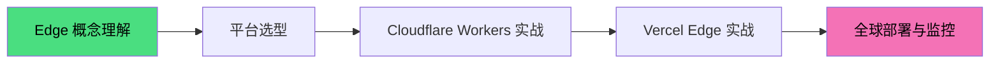
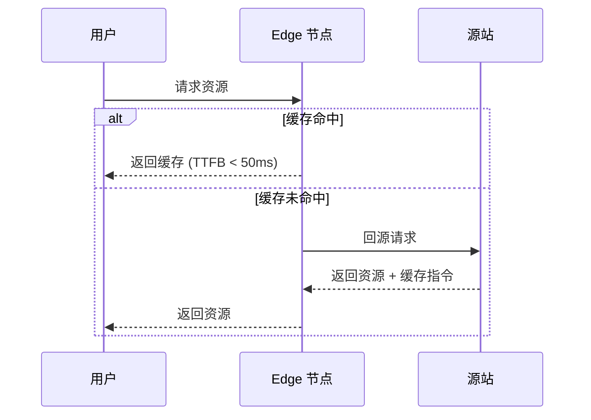
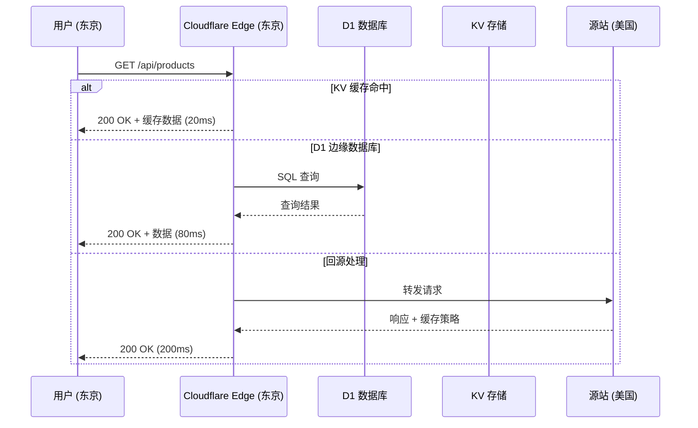
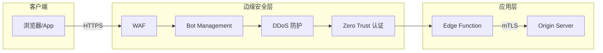
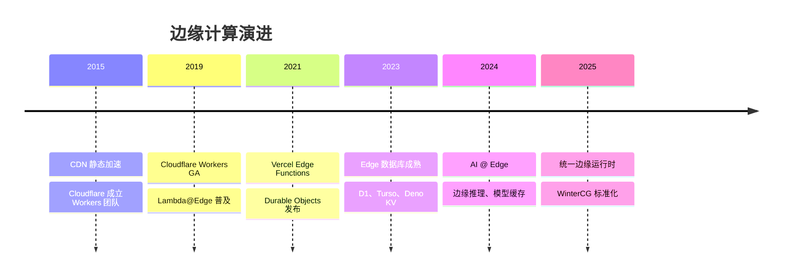

# 🌍 Edge 架构示例

> 从传统中心化到 Edge-First 的架构演进实战，覆盖全球部署、低延迟边缘计算与现代无服务器平台。

## 学习路径



## Edge-First 架构核心概念

### 什么是 Edge Computing

边缘计算将计算能力从中心化数据中心推向网络边缘（CDN 节点、运营商网关、用户设备附近），实现：

- **超低延迟**：请求在距离用户最近的节点处理
- **全球一致**：数据同步到全球边缘节点
- **弹性扩展**：按需分配计算资源，无需预配服务器
- **成本优化**：按请求计费，无空闲资源浪费

### V8 Isolate vs 传统容器

| 特性 | V8 Isolate | Docker 容器 | VM |
|------|-----------|-------------|-----|
| **启动时间** | < 1ms | 秒级 | 分钟级 |
| **内存占用** | ~5MB | ~100MB | ~GB 级 |
| **隔离级别** | 进程内隔离 | OS 级隔离 | 硬件级隔离 |
| **冷启动** | 几乎为零 | 明显延迟 | 明显延迟 |
| **代表平台** | Cloudflare Workers | AWS Fargate | AWS EC2 |

## 主流平台对比

| 平台 | 运行时 | 冷启动 | 全球节点 | 状态存储 | 最佳场景 |
|------|--------|--------|---------|---------|---------|
| **Cloudflare Workers** | V8 Isolate | ~0ms | 300+ | KV / D1 / Durable Objects | 全局 API、边缘渲染 |
| **Vercel Edge** | V8 Isolate | ~0ms | 100+ | Edge Config / Redis | Next.js 应用、中间件 |
| **Deno Deploy** | Deno | ~0ms | 35+ | Deno KV | 现代 Web 服务、实时通信 |
| **AWS Lambda@Edge** | Node.js | ~50ms | 400+ | CloudFront 缓存 | AWS 生态集成 |

## 架构模式

### 边缘缓存策略



### 全球状态同步

- **最终一致性**：KV 存储的跨区域复制
- **强一致性**：Durable Objects 的单点协调
- **会话亲和性**：基于地理位置的路由决策

## 示例目录

| 主题 | 文件 | 难度 |
|------|------|------|
| Edge-First 部署实战 | [查看](./edge-first-deployment.md) | 中级 |

## 与理论专题的映射

| 示例 | 理论支撑 |
|------|---------|
| [Edge 部署实战](./edge-first-deployment.md) | [应用设计理论](/application-design/) — 微服务设计、事件驱动架构 |
| 边缘缓存策略 | [性能工程](/performance-engineering/) — 缓存策略、网络优化 |
| 全球状态同步 | [状态管理](/state-management/) — 分布式状态、一致性模型 |

## 参考资源

- [Cloudflare Workers Documentation](https://developers.cloudflare.com/workers/)
- [Vercel Edge Functions](https://vercel.com/docs/functions/edge-functions)
- [Deno Deploy Documentation](https://docs.deno.com/deploy/)
- [AWS Lambda@Edge](https://docs.aws.amazon.com/lambda/latest/dg/lambda-edge.html)
- [High Performance Browser Networking](https://hpbn.co/)

---

## 边缘计算核心模式

### 请求处理流水线



### 边缘渲染架构

边缘渲染（Edge Side Rendering, ESR）将传统 SSR 的计算从源站服务器推向边缘节点：

| 架构 | 渲染位置 | TTFB | 适用场景 |
|------|---------|------|---------|
| **CSR** | 浏览器 | 快 | 高度交互应用 |
| **SSR** | 源站服务器 | 中 | SEO 敏感内容 |
| **ESR** | 边缘节点 | 极快 | 全球内容分发 |
| **ISR** | 边缘缓存 + 源站 | 快 | 频繁更新内容 |

---

## Cloudflare Workers 深度实践

### 项目结构

```
edge-api/
├── src/
│   ├── index.ts          # Worker 入口
│   ├── routes/
│   │   ├── users.ts      # 用户路由
│   │   └── products.ts   # 商品路由
│   ├── middleware/
│   │   ├── auth.ts       # 认证中间件
│   │   └── rateLimit.ts  # 限流中间件
│   └── db/
│       └── schema.ts     # D1 数据库 Schema
├── wrangler.toml         # Cloudflare 配置
└── package.json
```

### wrangler.toml 配置

```toml
name = "edge-api"
main = "src/index.ts"
compatibility_date = "2024-01-01"

[[d1_databases]]
binding = "DB"
database_name = "production-db"
database_id = "xxxxx"

[[kv_namespaces]]
binding = "CACHE"
id = "xxxxx"
```

### Hono 框架路由

```typescript
import { Hono } from 'hono';
import { logger } from 'hono/logger';
import { cors } from 'hono/cors';

const app = new Hono<{ Bindings: { DB: D1Database; CACHE: KVNamespace } }>();

app.use('*', logger(), cors());

// D1 数据库查询
app.get('/api/users/:id', async (c) => {
  const { id } = c.req.param();
  const user = await c.env.DB.prepare('SELECT * FROM users WHERE id = ?')
    .bind(id)
    .first();
  return user ? c.json(user) : c.notFound();
});

// KV 缓存写入
app.get('/api/products', async (c) => {
  const cacheKey = 'products:all';
  const cached = await c.env.CACHE.get(cacheKey);
  if (cached) return c.json(JSON.parse(cached));

  const products = await c.env.DB.prepare('SELECT * FROM products').all();
  await c.env.CACHE.put(cacheKey, JSON.stringify(products), { expirationTtl: 300 });
  return c.json(products);
});

export default app;
```

---

## Vercel Edge + Next.js

### Edge API Route

```typescript
// app/api/edge/route.ts
export const runtime = 'edge';

export async function GET(request: Request) {
  const { searchParams } = new URL(request.url);
  const city = request.geo?.city || 'Unknown';

  return Response.json({
    message: `Hello from ${city}!`,
    timestamp: Date.now(),
  });
}
```

### Edge Middleware

```typescript
// middleware.ts
import { NextResponse } from 'next/server';
import type { NextRequest } from 'next/server';

export function middleware(request: NextRequest) {
  // 基于地理位置的重定向
  const country = request.geo?.country || 'US';

  if (country === 'CN' && request.nextUrl.pathname === '/api/sensitive') {
    return NextResponse.json({ error: 'Not available' }, { status: 403 });
  }

  // 添加安全响应头
  const response = NextResponse.next();
  response.headers.set('X-Edge-Region', process.env.VERCEL_REGION || 'unknown');
  return response;
}

export const config = {
  matcher: '/api/:path*',
};
```

---

## 部署策略矩阵

| 场景 | 推荐平台 | 关键配置 |
|------|---------|---------|
| **全球 API** | Cloudflare Workers | D1 + KV + Durable Objects |
| **Next.js 全栈** | Vercel Edge | Edge Runtime + ISR |
| **实时通信** | Deno Deploy | WebSocket + Deno KV |
| **AWS 生态** | Lambda@Edge | CloudFront + DynamoDB Global |
| **混合架构** | Cloudflare + Vercel | API 网关 + 前端渲染 |

---

## 监控与调试

### 关键指标

| 指标 | 目标值 | 工具 |
|------|--------|------|
| **Edge Cache Hit Rate** | > 95% | Cloudflare Analytics |
| **P99 延迟** | < 100ms | Vercel Speed Insights |
| **错误率** | < 0.1% | Sentry |
| **冷启动频率** | 接近 0 | 平台原生指标 |

### 调试技巧

```bash
# Cloudflare Workers 本地调试
npx wrangler dev --local

# Vercel Edge 本地测试
vercel dev

# 查看 Edge 日志
npx wrangler tail
```

---

## 成本优化

| 平台 | 免费额度 | 付费模式 | 优化策略 |
|------|---------|---------|---------|
| **Cloudflare Workers** | 100k 请求/天 | $0.50/百万请求 | 缓存最大化、D1 查询优化 |
| **Vercel Edge** | 1M 函数调用 | $0.40/百万调用 | ISR 缓存、Edge Config |
| **Deno Deploy** | 无明确限制 | 按资源使用 | KV 批量操作、流式响应 |
| **Lambda@Edge** | 无免费层 | $0.60/百万请求 | 减少回源、CloudFront 缓存 |

---

## 安全最佳实践

| 层面 | 措施 | 实现方式 |
|------|------|---------|
| **传输安全** | TLS 1.3 强制 | 平台默认开启 |
| **请求验证** | HMAC 签名 | Worker 中间件 |
| **速率限制** | 令牌桶算法 | Cloudflare Rate Limiting |
| **CORS 策略** | 白名单域名 | Response 头配置 |
| **敏感数据** | 边缘加密 | AES-256-GCM |

---

## 与理论专题的映射

| 示例 | 理论支撑 |
|------|---------|
| [Edge 部署实战](./edge-first-deployment.md) | [应用设计理论](/application-design/) — 微服务设计、事件驱动架构 |
| 边缘缓存策略 | [性能工程](/performance-engineering/) — 缓存策略、网络优化 |
| 全球状态同步 | [状态管理](/state-management/) — 分布式状态、一致性模型 |
| Serverless 函数 | [编程范式](/programming-paradigms/) — 函数式编程、事件驱动 |

---

## 参考资源

### 官方文档

- [Cloudflare Workers Documentation](https://developers.cloudflare.com/workers/)
- [Vercel Edge Functions](https://vercel.com/docs/functions/edge-functions)
- [Deno Deploy Documentation](https://docs.deno.com/deploy/)
- [AWS Lambda@Edge](https://docs.aws.amazon.com/lambda/latest/dg/lambda-edge.html)

### 工具与框架

- [Hono](https://hono.dev/) — 轻量级 Edge 框架
- [Wrangler](https://developers.cloudflare.com/workers/wrangler/) — Cloudflare CLI
- [Next.js Edge Runtime](https://nextjs.org/docs/app/building-your-application/rendering/edge-and-nodejs-runtimes)
- [Deno KV](https://docs.deno.com/deploy/kv/)

### 经典著作

- [High Performance Browser Networking](https://hpbn.co/) — Ilya Grigorik
- [Designing Data-Intensive Applications](https://dataintensive.net/) — Martin Kleppmann

---

## 边缘数据库与存储

### 全球数据一致性模型

边缘计算的存储选择直接影响应用架构：

| 存储类型 | 一致性 | 延迟 | 代表产品 | 适用场景 |
|---------|--------|------|---------|---------|
| **KV 缓存** | 最终一致 | < 10ms | Cloudflare KV | 会话、配置、热点数据 |
| **SQL 边缘** | 强一致 | < 50ms | D1、Turso | 用户数据、事务处理 |
| **对象存储** | 最终一致 | < 100ms | R2、S3 | 文件、图片、视频 |
| **Durable Objects** | 强一致 | < 50ms | Cloudflare DO | 状态ful服务、协作编辑 |
| **全局 KV** | 最终一致 | < 20ms | Deno KV | 配置、计数器、速率限制 |

### D1 边缘 SQL 实践

```sql
-- 创建表并启用 WAL 模式（写优化）
CREATE TABLE users (
  id INTEGER PRIMARY KEY AUTOINCREMENT,
  email TEXT UNIQUE NOT NULL,
  name TEXT NOT NULL,
  created_at DATETIME DEFAULT CURRENT_TIMESTAMP
);

-- 边缘查询优化：使用覆盖索引
CREATE INDEX idx_users_email ON users(email);

-- 批量插入（减少往返）
INSERT INTO users (email, name) VALUES
  ('alice@example.com', 'Alice'),
  ('bob@example.com', 'Bob'),
  ('charlie@example.com', 'Charlie');
```

---

## 边缘安全架构

### Zero Trust 边缘网关



### 边缘认证模式

| 模式 | 实现 | 优缺点 |
|------|------|--------|
| **JWT 验证** | Worker 中验证签名 | 无状态、快速；Token 过大时影响性能 |
| **Session KV** | 会话 ID 存储在 KV | 可撤销、细粒度控制；需额外查询 |
| **OAuth 代理** | Worker 作为 OAuth 代理 | 安全、标准化；增加延迟 |
| **mTLS** | 客户端证书认证 | 最高安全性；证书管理复杂 |

---

## 生产部署 checklist

### 发布前检查

- [ ] 边缘函数在所有目标区域测试通过
- [ ] 缓存策略配置正确（TTL、Cache Key）
- [ ] 回源超时和重试策略已设置
- [ ] 数据库连接池和查询优化完成
- [ ] 日志收集和告警规则配置完毕
- [ ] 成本预算和用量告警已设置
- [ ] 灾难恢复流程文档化

### 关键告警

| 告警类型 | 阈值 | 响应 |
|---------|------|------|
| 边缘错误率 | > 0.5% (5min) | 立即回滚 |
| 源站故障 | 连续 3 次超时 | 启用降级模式 |
| 缓存命中率 | < 90% | 优化缓存策略 |
| 成本突增 | 日同比 > 200% | 检查异常流量 |

---

## 技术演进趋势



### 未来方向

- **AI 边缘推理**：小型 LLM 直接在边缘节点运行
- **WebAssembly 组件**：标准化 WASM 组件在边缘的互操作
- **边缘协作**：CRDT 驱动的多人实时协作
- **隐私计算**：边缘端数据脱敏与联邦学习

---

## 贡献指南

本示例遵循以下规范：

1. **可运行代码**：所有示例提供完整可执行的代码
2. **平台标注**：明确标注 Cloudflare / Vercel / Deno 差异
3. **成本意识**：标注每个方案的免费额度和预估成本
4. **性能数据**：包含真实的延迟和吞吐量基准
5. **安全优先**：所有示例遵循安全最佳实践

---

## 参考资源

### 社区与工具

- [Cloudflare Workers Playground](https://workers.cloudflare.com/playground) — 在线 Workers 编辑器
- [Vercel Speed Insights](https://vercel.com/docs/concepts/speed-insights) — 性能分析
- [Deno Deploy Dashboard](https://dash.deno.com/) — Deno 部署控制台
- [Hono Framework](https://hono.dev/) — 边缘优先 Web 框架
- [WinterCG](https://wintercg.org/) — Web 标准运行时协作组

### 经典著作

- *High Performance Browser Networking* — Ilya Grigorik
- *Designing Data-Intensive Applications* — Martin Kleppmann
- *Cloud Native Patterns* — Cornelia Davis
- *Building Microservices* — Sam Newman


---

## 与理论专题的深层映射

Edge 架构不仅是部署策略的选择，更是计算范式向网络边缘迁移的系统性变革。从理论视角审视：

### 分布式系统理论

边缘计算本质上是**CAP 定理**在地理维度上的重新诠释。传统数据中心架构优先保证 Consistency 和 Partition Tolerance，而 Edge-First 架构在全局层面接受最终一致性，在局部节点保证强一致性：

| 维度 | 中心化架构 | Edge-First 架构 |
|------|-----------|----------------|
| **一致性模型** | 全局强一致 | 局部强一致 + 全局最终一致 |
| **延迟假设** | 同机房 < 1ms | 边缘节点 < 50ms |
| **故障域** | 单数据中心 | 多边缘节点独立故障 |
| **状态管理** | 集中式数据库 | 边缘缓存 + 异步同步 |

### 计算理论视角

V8 Isolate 的轻量级隔离机制可以形式化为**有限状态自动机**的实例化：每个 Isolate 是一个独立的计算状态机，通过消息传递（postMessage）进行状态转换，而非共享内存。这种模型与 Actor 模型同构，天然避免了数据竞争和死锁。

```
Isolate A: 状态 S_A --[消息 M]--> 状态 S_A'
Isolate B: 状态 S_B --[消息 M]--> 状态 S_B'

共享内存模型: S = S_A ∪ S_B （需要锁同步）
消息传递模型: S_A ∩ S_B = ∅ （无共享，无需锁）
```

---

## 参考资源补充

### 学术论文

- *"The Akamai Network: A Platform for High-Performance Internet Applications"* — Akamai 边缘网络架构的原始论文
- *"Cloudflare Workers: Edge Computing with Isolates"* — Cloudflare 关于 V8 Isolate 的技术白皮书
- *"Serverless Computing: One Step Forward, Two Steps Back"* — UC Berkeley 对 Serverless 范式的批判性分析

### 在线工具

- [Cloudflare Workers Playground](https://workers.cloudflare.com/playground)
- [Vercel Edge Runtime Docs](https://edge-runtime.vercel.app/)
- [Deno Deploy Status](https://status.deno.com/)
- [HTTP Archive](https://httparchive.org/) — Web 性能趋势数据

---

*维护者: JSTS技术社区 | 协议: CC BY-SA 4.0 | 最后更新: 2026-05-01*
