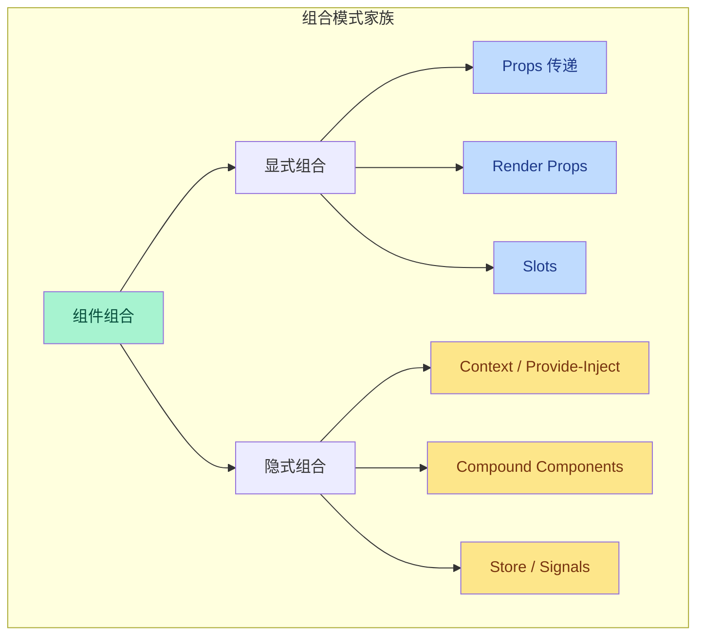
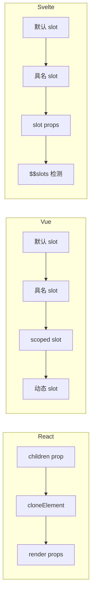
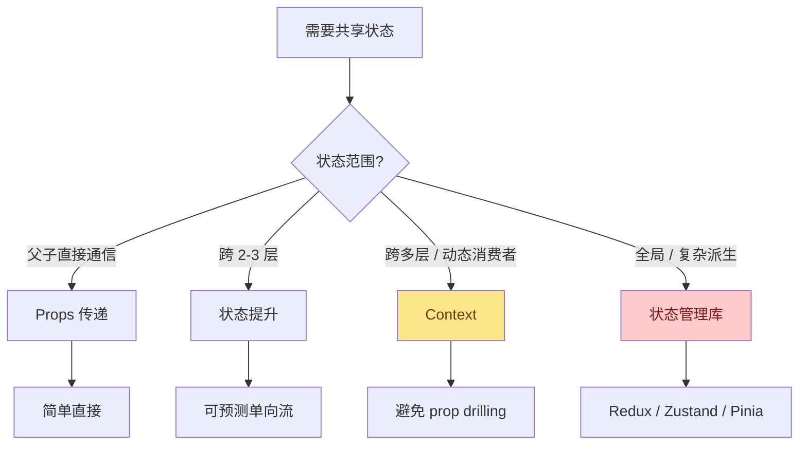
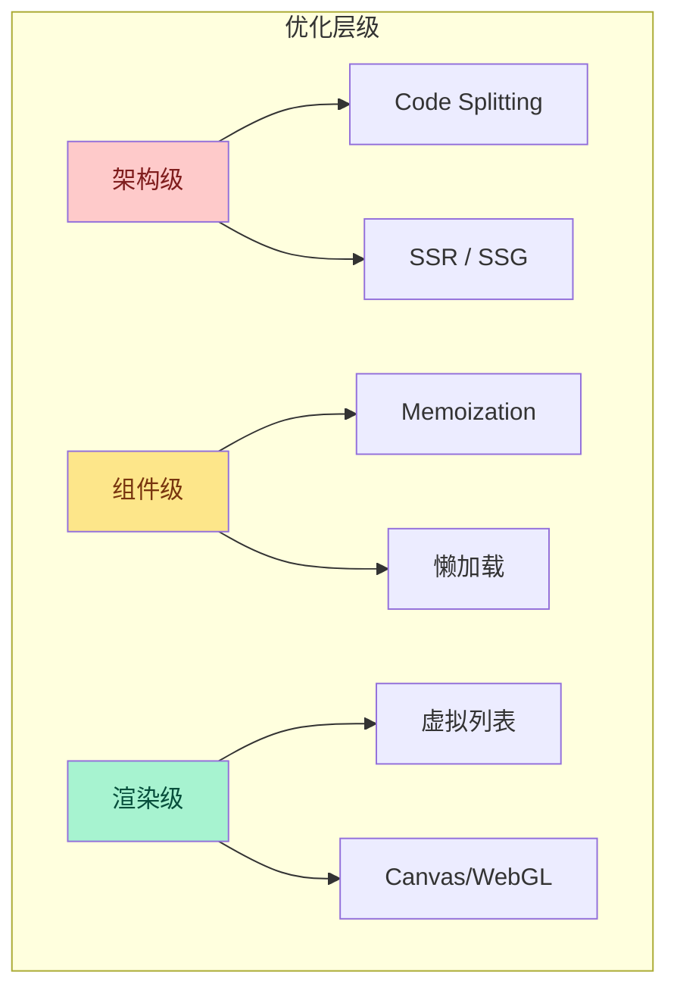
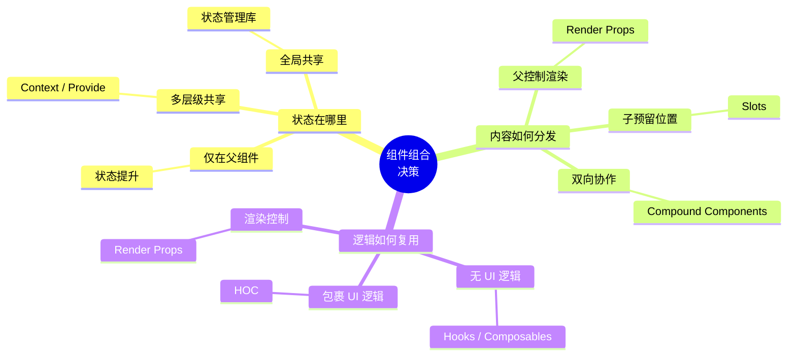

# 组件组合模式实战

> 组件组合是现代前端架构的基石。无论是 React 的 JSX、Vue 的模板系统，还是 Svelte 的编译时优化，其核心都在于回答一个问题：**如何将独立的 UI 单元组合成可维护、可扩展、可复用的系统？**

本实战文档聚焦三大主流框架的组件组合策略，从基础模式到高级抽象，从性能优化到设计模式落地，提供可直接应用于生产环境的代码模板与决策框架。所有示例均遵循 TypeScript 严格模式，并内置可访问性（a11y）与安全性考量。

---

## 目录

- [组件组合模式实战](#组件组合模式实战)
  - [目录](#目录)
  - [核心组合模式对比](#核心组合模式对比)
  - [Compound Components（复合组件）](#compound-components复合组件)
    - [React 实现：Tabs 组件](#react-实现tabs-组件)
    - [Vue 3 实现：Accordion 组件](#vue-3-实现accordion-组件)
    - [Svelte 5 实现：Select 组件](#svelte-5-实现select-组件)
  - [Render Props 模式](#render-props-模式)
    - [React：MouseTracker 与动态渲染](#reactmousetracker-与动态渲染)
    - [Vue：Scoped Slot 作为 Render Props 的语义等价物](#vuescoped-slot-作为-render-props-的语义等价物)
  - [Slots 与 Scoped Slots](#slots-与-scoped-slots)
    - [三大框架 Slot 机制对比](#三大框架-slot-机制对比)
    - [React：children 作为 Slot](#reactchildren-作为-slot)
    - [Vue：完整的 Slot 系统](#vue完整的-slot-系统)
    - [Svelte：Slot 与 Slot Props](#svelteslot-与-slot-props)
  - [Higher-Order Components（高阶组件）](#higher-order-components高阶组件)
    - [类型安全的 HOC 工厂](#类型安全的-hoc-工厂)
    - [Vue：函数式组件实现 HOC 等价物](#vue函数式组件实现-hoc-等价物)
  - [状态提升 vs Context](#状态提升-vs-context)
    - [决策流程](#决策流程)
    - [React：状态提升实战](#react状态提升实战)
    - [React Context：主题与国际化](#react-context主题与国际化)
    - [Vue：Provide / Inject 与状态提升](#vueprovide--inject-与状态提升)
  - [性能优化实战](#性能优化实战)
    - [React：React.memo、useMemo、useCallback](#reactreactmemousememousecallback)
    - [Vue：`v-once`、`v-memo`、计算属性缓存](#vuev-oncev-memo计算属性缓存)
    - [Svelte 5：Runes 与 `$derived` 优化](#svelte-5runes-与-derived-优化)
    - [性能优化策略总结](#性能优化策略总结)
  - [前端设计模式实现](#前端设计模式实现)
    - [观察者模式（Observer Pattern）](#观察者模式observer-pattern)
    - [命令模式（Command Pattern）](#命令模式command-pattern)
    - [策略模式（Strategy Pattern）](#策略模式strategy-pattern)
    - [策略模式与组件组合的结合](#策略模式与组件组合的结合)
  - [跨框架决策矩阵](#跨框架决策矩阵)
  - [专题映射与延伸阅读](#专题映射与延伸阅读)
    - [与 框架模型 的映射](#与-框架模型-的映射)
    - [与 编程范式 的映射](#与-编程范式-的映射)
    - [参考资源](#参考资源)

---

## 核心组合模式对比

在深入各模式之前，先建立统一的认知框架。以下表格对比了四种主要组合策略在三大框架中的支持情况、适用场景与心智负担：

| 组合模式 | React | Vue | Svelte | 心智负担 | 最佳场景 |
|---------|-------|-----|--------|---------|---------|
| **Compound Components** | ✅ 原生支持 | ⚠️ 需组合式 API | ⚠️ 需上下文 store | 中 | 表单控件、Tabs、Accordion |
| **Render Props** | ✅ 原生支持 | ⚠️ 可用 scoped slot 替代 | ❌ 不适用 | 高 | 跨组件逻辑复用、条件渲染 |
| **Slots** | ⚠️ children + cloneElement | ✅ 原生支持 | ✅ 原生 `<slot>` | 低 | 布局组件、内容分发 |
| **HOC** | ✅ 原生支持 | ✅ 可用函数式组件 | ⚠️ 不推荐 | 高 | 权限控制、数据注入、埋点 |



---

## Compound Components（复合组件）

Compound Components 是一种通过隐式状态共享将相关子组件绑定在一起的模式。父组件作为状态容器，子组件通过 Context 或内部机制访问共享状态，从而实现高度内聚的 API。

### React 实现：Tabs 组件

```tsx
import React, { createContext, useContext, useState, ReactNode } from 'react';

// ==================== 类型定义 ====================
interface TabsContextValue {
  activeIndex: number;
  setActiveIndex: (index: number) => void;
}

interface TabsProps {
  children: ReactNode;
  defaultIndex?: number;
  onChange?: (index: number) => void;
}

interface TabListProps {
  children: ReactNode;
}

interface TabProps {
  children: ReactNode;
  index?: number;
  disabled?: boolean;
}

interface TabPanelProps {
  children: ReactNode;
  index?: number;
}

// ==================== Context ====================
const TabsContext = createContext<TabsContextValue | null>(null);

function useTabsContext() {
  const ctx = useContext(TabsContext);
  if (!ctx) throw new Error('Tabs subcomponents must be used within <Tabs>');
  return ctx;
}

// ==================== 组件实现 ====================
function Tabs({ children, defaultIndex = 0, onChange }: TabsProps) {
  const [activeIndex, setActiveIndex] = useState(defaultIndex);

  const handleChange = (index: number) => {
    setActiveIndex(index);
    onChange?.(index);
  };

  return (
    <TabsContext.Provider value={{ activeIndex, setActiveIndex: handleChange }}>
      <div role="tablist" className="tabs">{children}</div>
    </TabsContext.Provider>
  );
}

function TabList({ children }: TabListProps) {
  // 通过 React.Children.map 注入 index
  const { activeIndex } = useTabsContext();
  return (
    <div className="tab-list" role="presentation">
      {React.Children.map(children, (child, index) => {
        if (!React.isValidElement(child)) return child;
        return React.cloneElement(child as React.ReactElement<TabProps>, { index });
      })}
    </div>
  );
}

function Tab({ children, index = 0, disabled = false }: TabProps) {
  const { activeIndex, setActiveIndex } = useTabsContext();
  const isActive = activeIndex === index;

  return (
    <button
      role="tab"
      aria-selected={isActive}
      aria-disabled={disabled}
      tabIndex={isActive ? 0 : -1}
      className={`tab ${isActive ? 'active' : ''} ${disabled ? 'disabled' : ''}`}
      onClick={() => !disabled && setActiveIndex(index)}
    >
      {children}
    </button>
  );
}

function TabPanel({ children, index = 0 }: TabPanelProps) {
  const { activeIndex } = useTabsContext();
  const isActive = activeIndex === index;

  if (!isActive) return null;

  return (
    <div role="tabpanel" className="tab-panel" hidden={!isActive}>
      {children}
    </div>
  );
}

// ==================== 命名空间绑定 ====================
export const CompoundTabs = Object.assign(Tabs, {
  List: TabList,
  Tab,
  Panel: TabPanel,
});

// ==================== 使用示例 ====================
/*
<CompoundTabs defaultIndex={0} onChange={(i) => console.log(i)}>
  <CompoundTabs.List>
    <CompoundTabs.Tab>账户</CompoundTabs.Tab>
    <CompoundTabs.Tab>安全</CompoundTabs.Tab>
    <CompoundTabs.Tab disabled>高级</CompoundTabs.Tab>
  </CompoundTabs.List>
  <CompoundTabs.Panel>账户设置内容</CompoundTabs.Panel>
  <CompoundTabs.Panel>安全设置内容</CompoundTabs.Panel>
  <CompoundTabs.Panel>高级设置内容</CompoundTabs.Panel>
</CompoundTabs>
*/
```

### Vue 3 实现：Accordion 组件

Vue 3 的 `provide` / `inject` 机制天然适合实现 Compound Components。以下是一个支持手风琴模式的折叠面板：

```vue
<!-- Accordion.vue -->
<script setup lang="ts">
import { provide, ref, readonly, type InjectionKey, type Ref } from 'vue';

export interface AccordionContext {
  activeItems: Readonly<Ref<Set<string>>>;
  toggleItem: (id: string) => void;
  allowMultiple: boolean;
}

export const AccordionKey: InjectionKey<AccordionContext> = Symbol('Accordion');

interface Props {
  allowMultiple?: boolean;
  defaultOpen?: string[];
}

const props = withDefaults(defineProps<Props>(), {
  allowMultiple: false,
  defaultOpen: () => [],
});

const activeItems = ref<Set<string>>(new Set(props.defaultOpen));

const toggleItem = (id: string) => {
  const next = new Set(activeItems.value);
  if (next.has(id)) {
    next.delete(id);
  } else {
    if (!props.allowMultiple) next.clear();
    next.add(id);
  }
  activeItems.value = next;
};

provide(AccordionKey, {
  activeItems: readonly(activeItems),
  toggleItem,
  allowMultiple: props.allowMultiple,
});
</script>

<template>
  <div class="accordion" role="region" aria-label="手风琴面板">
    <slot />
  </div>
</template>
```

```vue
<!-- AccordionItem.vue -->
<script setup lang="ts">
import { inject, computed } from 'vue';
import { AccordionKey } from './Accordion.vue';

interface Props {
  id: string;
  title: string;
}

const props = defineProps<Props>();
const ctx = inject(AccordionKey);

if (!ctx) throw new Error('AccordionItem must be used inside Accordion');

const isOpen = computed(() => ctx.activeItems.value.has(props.id));

const handleToggle = () => ctx.toggleItem(props.id);
</script>

<template>
  <div class="accordion-item">
    <h3>
      <button
        :id="`accordion-header-${id}`"
        :aria-expanded="isOpen"
        :aria-controls="`accordion-panel-${id}`"
        class="accordion-trigger"
        @click="handleToggle"
      >
        {{ title }}
        <span class="icon" :class="{ 'icon--rotated': isOpen }">▼</span>
      </button>
    </h3>
    <div
      :id="`accordion-panel-${id}`"
      :aria-labelledby="`accordion-header-${id}`"
      role="region"
      class="accordion-panel"
      :hidden="!isOpen"
    >
      <!-- Vue 安全：默认插槽内容不会自动转义，但 v-html 需要白名单过滤 -->
      <slot />
    </div>
  </div>
</template>
```

> **Vue 安全提示**：上述组件使用默认插槽 `<slot />` 分发内容时，Vue 会自动对插槽内容进行 HTML 实体转义，防止 XSS 攻击。如果业务场景需要使用 `v-html` 渲染富文本，务必通过 DOMPurify 或自定义白名单对输入进行净化，绝不可直接渲染用户提供的原始 HTML。

### Svelte 5 实现：Select 组件

Svelte 5 引入了 Runes 系统，结合 Context API 可以实现类型安全的 Compound Components：

```svelte
<!-- Select.svelte -->
<script lang="ts" module>
  import { getContext, setContext } from 'svelte';
  import type { Writable } from 'svelte/store';

  export interface SelectContext {
    value: Writable<string | null>;
    open: Writable<boolean>;
    labelId: string;
    listboxId: string;
  }

  const SELECT_KEY = Symbol('Select');

  export function getSelectContext(): SelectContext {
    return getContext(SELECT_KEY) as SelectContext;
  }
</script>

<script lang="ts">
  import { writable } from 'svelte/store';

  interface Props {
    children: import('svelte').Snippet;
    defaultValue?: string;
    onChange?: (value: string) => void;
  }

  let { children, defaultValue = null, onChange }: Props = $props();

  const value = writable(defaultValue);
  const open = writable(false);

  $effect(() => {
    const unsub = value.subscribe((v) => {
      if (v !== null) onChange?.(v);
    });
    return unsub;
  });

  const labelId = $id('select-label');
  const listboxId = $id('select-listbox');

  setContext(SELECT_KEY, { value, open, labelId, listboxId });
</script>

<div class="select-root">
  {@render children()}
</div>
```

```svelte
<!-- SelectTrigger.svelte -->
<script lang="ts">
  import { getSelectContext } from './Select.svelte';

  let ctx = getSelectContext();

  function handleClick() {
    ctx.open.update((v) => !v);
  }
</script>

<button
  type="button"
  id={ctx.labelId}
  aria-haspopup="listbox"
  aria-expanded={$ctx.open}
  aria-controls={ctx.listboxId}
  class="select-trigger"
  onclick={handleClick}
>
  <slot />
</button>
```

---

## Render Props 模式

Render Props（渲染属性）是一种通过函数 prop 将渲染控制权交给父组件的模式。尽管在 React Hooks 时代其使用频率有所下降，但在需要**精确控制子组件渲染**且**避免 Hooks 规则限制**的场景下，它依然不可替代。

### React：MouseTracker 与动态渲染

```tsx
import React, { useState, useEffect, ReactNode } from 'react';

interface MousePosition {
  x: number;
  y: number;
}

interface MouseTrackerProps {
  render: (position: MousePosition) => ReactNode;
}

function MouseTracker({ render }: MouseTrackerProps) {
  const [position, setPosition] = useState<MousePosition>({ x: 0, y: 0 });

  useEffect(() => {
    const handler = (e: MouseEvent) => setPosition({ x: e.clientX, y: e.clientY });
    window.addEventListener('mousemove', handler);
    return () => window.removeEventListener('mousemove', handler);
  }, []);

  return <div className="mouse-tracker">{render(position)}</div>;
}

// ==================== 使用示例 ====================
function App() {
  return (
    <MouseTracker
      render={({ x, y }) => (
        <p>
          鼠标位置: ({x}, {y})
        </p>
      )}
    />
  );
}

// ==================== 与 HOC 的对比：Render Props 更灵活 ====================
function withMouse<T extends object>(
  WrappedComponent: React.ComponentType<T & MousePosition>
) {
  return function WithMouseWrapper(props: T) {
    const [position, setPosition] = useState<MousePosition>({ x: 0, y: 0 });
    // ... 同样的逻辑
    return <WrappedComponent {...props} {...position} />;
  };
}
```

### Vue：Scoped Slot 作为 Render Props 的语义等价物

Vue 的 Scoped Slot 在概念上与 React 的 Render Props 完全等价，但语法更自然：

```vue
<!-- DataProvider.vue -->
<script setup lang="ts" generic="T">
import { ref, onMounted } from 'vue';

interface Props {
  fetcher: () => Promise<T>;
}

const props = defineProps<Props>();

const data = ref<T | null>(null);
const loading = ref(false);
const error = ref<Error | null>(null);

onMounted(async () => {
  loading.value = true;
  try {
    data.value = await props.fetcher();
  } catch (e) {
    error.value = e as Error;
  } finally {
    loading.value = false;
  }
});
</script>

<template>
  <!-- 将状态通过 scoped slot 暴露给父组件 -->
  <slot :data="data" :loading="loading" :error="error" :refresh="() => $emit('refresh')" />
</template>
```

```vue
<!-- Parent.vue -->
<template>
  <DataProvider :fetcher="fetchUser" v-slot="{ data, loading, error }">
    <div v-if="loading">加载中...</div>
    <div v-else-if="error" class="error">{{ error.message }}</div>
    <UserCard v-else :user="data" />
  </DataProvider>
</template>
```

---

## Slots 与 Scoped Slots

Slot 机制解决了**内容分发（Content Distribution）**问题，让父组件能够向子组件的指定位置注入内容。Scoped Slot 则在此基础上增加了**数据回传**能力。

### 三大框架 Slot 机制对比



### React：children 作为 Slot

React 没有原生的 "Slot" 概念，但 `children` prop 配合 `cloneElement` 可以实现完全等价的功能：

```tsx
import React, { Children, cloneElement, isValidElement, ReactNode } from 'react';

interface LayoutProps {
  header?: ReactNode;
  sidebar?: ReactNode;
  children: ReactNode;
  footer?: ReactNode;
}

function DashboardLayout({ header, sidebar, children, footer }: LayoutProps) {
  return (
    <div className="layout">
      <header className="layout-header">{header ?? <DefaultHeader />}</header>
      <aside className="layout-sidebar">{sidebar}</aside>
      <main className="layout-main">{children}</main>
      <footer className="layout-footer">{footer ?? <DefaultFooter />}</footer>
    </div>
  );
}

// ==================== 高级：条件性增强子元素 ====================
interface ListProps<T> {
  items: T[];
  children: (item: T, index: number) => ReactNode;
  emptyState?: ReactNode;
}

function List<T>({ items, children, emptyState }: ListProps<T>) {
  if (items.length === 0) {
    return <>{emptyState ?? <p>暂无数据</p>}</>;
  }

  return (
    <ul className="list">
      {items.map((item, index) => (
        <li key={index} className="list-item">
          {children(item, index)}
        </li>
      ))}
    </ul>
  );
}

// 使用
<List items={users}>
  {(user) => <UserAvatar name={user.name} avatar={user.avatar} />}
</List>
```

### Vue：完整的 Slot 系统

```vue
<!-- PageLayout.vue -->
<template>
  <div class="page-layout">
    <header class="page-header">
      <slot name="header" :title="pageTitle" :back="goBack">
        <h1>{{ pageTitle }}</h1>
      </slot>
    </header>

    <nav class="page-nav">
      <slot name="nav" :links="navLinks" />
    </nav>

    <main class="page-main">
      <!-- 默认插槽：支持解构 scoped slot props -->
      <slot :content="mainContent" :meta="pageMeta" />
    </main>

    <footer class="page-footer">
      <slot name="footer" :copyright="copyrightInfo">
        <p>© {{ currentYear }} All rights reserved.</p>
      </slot>
    </footer>
  </div>
</template>

<script setup lang="ts">
import { computed } from 'vue';

interface NavLink {
  label: string;
  path: string;
  icon?: string;
}

interface PageMeta {
  author: string;
  tags: string[];
}

const pageTitle = '默认标题';
const navLinks: NavLink[] = [
  { label: '首页', path: '/' },
  { label: '文档', path: '/docs' },
];
const mainContent = { body: '...', toc: [] };
const pageMeta: PageMeta = { author: 'Team', tags: ['vue', 'frontend'] };
const copyrightInfo = 'Awesome JSTS Team';

const currentYear = computed(() => new Date().getFullYear());

const goBack = () => window.history.back();
</script>
```

```vue
<!-- 使用 PageLayout 的父组件 -->
<template>
  <PageLayout>
    <template #header="{ title, back }">
      <button @click="back">←</button>
      <h1 class="custom-title">{{ title }}</h1>
    </template>

    <template #nav="{ links }">
      <ul>
        <li v-for="link in links" :key="link.path">
          <RouterLink :to="link.path">{{ link.label }}</RouterLink>
        </li>
      </ul>
    </template>

    <!-- 默认插槽接收 scoped props -->
    <template #default="{ content, meta }">
      <article>
        <div v-html="sanitizedBody(content.body)" />
        <Tags :tags="meta.tags" />
      </article>
    </template>
  </PageLayout>
</template>

<script setup lang="ts">
import DOMPurify from 'dompurify';

// Vue 安全：任何 v-html 输入都必须经过净化
const sanitizedBody = (html: string) => DOMPurify.sanitize(html, {
  ALLOWED_TAGS: ['p', 'br', 'strong', 'em', 'h2', 'h3', 'ul', 'ol', 'li', 'a'],
  ALLOWED_ATTR: ['href'],
});
</script>
```

### Svelte：Slot 与 Slot Props

```svelte
<!-- Card.svelte -->
<script lang="ts">
  interface Props {
    title: string;
    children?: import('svelte').Snippet<[slotProps: { focused: boolean }]>;
    actions?: import('svelte').Snippet;
  }

  let { title, children, actions }: Props = $props();
  let focused = $state(false);
</script>

<div
  class="card"
  role="article"
  tabindex="0"
  onfocus={() => (focused = true)}
  onblur={() => (focused = false)}
>
  <h2 class="card-title">{title}</h2>
  <div class="card-body">
    <!-- Svelte 5: Snippet 作为 modern slot 机制 -->
    {@render children?.({ focused })}
  </div>
  {#if actions}
    <div class="card-actions">
      {@render actions()}
    </div>
  {/if}
</div>
```

```svelte
<!-- App.svelte -->
<script lang="ts">
  import Card from './Card.svelte';
</script>

<Card title="用户信息">
  {#snippet children({ focused })}
    <p class:focus>鼠标悬停或聚焦时高亮</p>
    <form>
      <input type="text" placeholder="用户名" />
    </form>
  {/snippet}

  {#snippet actions()}
    <button type="button">保存</button>
    <button type="button">取消</button>
  {/snippet}
</Card>
```

---

## Higher-Order Components（高阶组件）

HOC 是接收组件作为参数并返回新组件的函数。随着 Hooks 的普及，HOC 的使用场景有所收窄，但在**跨切面关注点（Cross-cutting Concerns）**如权限控制、日志埋点、数据注入等场景下，HOC 依然提供了一种声明式的抽象方式。

### 类型安全的 HOC 工厂

```tsx
import React, { ComponentType, useEffect, useState } from 'react';

// ==================== 权限控制 HOC ====================
interface WithPermissionProps {
  requiredRoles: string[];
}

function withPermission<P extends object>(
  WrappedComponent: ComponentType<P>,
  options: WithPermissionProps
) {
  return function PermissionWrapper(props: P) {
    const [hasPermission, setHasPermission] = useState<boolean | null>(null);

    useEffect(() => {
      const userRoles = getCurrentUserRoles(); // 假设的权限获取
      const allowed = options.requiredRoles.some((r) => userRoles.includes(r));
      setHasPermission(allowed);
    }, []);

    if (hasPermission === null) return <div>校验权限中...</div>;
    if (!hasPermission) return <div>无权访问该资源</div>;

    return <WrappedComponent {...props} />;
  };
}

// ==================== 埋点 HOC ====================
interface TrackingOptions {
  eventName: string;
  trackMount?: boolean;
  trackUnmount?: boolean;
}

function withTracking<P extends object>(
  WrappedComponent: ComponentType<P>,
  options: TrackingOptions
) {
  return function TrackingWrapper(props: P) {
    useEffect(() => {
      if (options.trackMount) {
        analytics.track(options.eventName, { phase: 'mount', ...props });
      }
      return () => {
        if (options.trackUnmount) {
          analytics.track(options.eventName, { phase: 'unmount' });
        }
      };
    }, []);

    return <WrappedComponent {...props} />;
  };
}

// ==================== 组合使用 ====================
interface UserProfileProps {
  userId: string;
}

function UserProfile({ userId }: UserProfileProps) {
  return <div>用户资料: {userId}</div>;
}

const ProtectedUserProfile = withPermission(
  withTracking(UserProfile, { eventName: 'view_profile', trackMount: true }),
  { requiredRoles: ['admin', 'user_manager'] }
);
```

### Vue：函数式组件实现 HOC 等价物

Vue 3 推荐使用组合式函数（Composables）替代 HOC，但在某些需要**组件包装**的场景，函数式组件仍可实现类似效果：

```vue
<!-- withAsyncData.vue -->
<script setup lang="ts" generic="T extends Record<string, any>">
import { h, ref, onMounted, defineComponent } from 'vue';

interface Props {
  fetcher: () => Promise<T>;
  component: ReturnType<typeof defineComponent>;
}

const props = defineProps<Props>();
const data = ref<T | null>(null);
const loading = ref(true);
const error = ref<Error | null>(null);

onMounted(async () => {
  try {
    data.value = await props.fetcher();
  } catch (e) {
    error.value = e as Error;
  } finally {
    loading.value = false;
  }
});

// 使用 render 函数将数据注入到目标组件
const render = () => {
  if (loading.value) return h('div', { class: 'loading' }, '加载中...');
  if (error.value) return h('div', { class: 'error' }, error.value.message);
  return h(props.component, { ...data.value });
};
</script>

<template>
  <render />
</template>
```

> **现代建议**：Vue 生态中，优先使用 Composables（`useAsyncData`、`usePermission` 等）而非 HOC。Composables 在类型推断、Tree Shaking 和测试性方面均优于 HOC。

---

## 状态提升 vs Context

状态提升（Lifting State Up）和 Context 是 React 中管理跨层级状态的两种核心策略。理解它们的适用边界，是避免过度工程化的关键。

### 决策流程



### React：状态提升实战

```tsx
import React, { useState, useCallback } from 'react';

// ==================== 状态提升：受控组件集合 ====================
interface FormState {
  username: string;
  email: string;
  age: number;
}

function ControlledForm() {
  const [values, setValues] = useState<FormState>({
    username: '',
    email: '',
    age: 18,
  });
  const [errors, setErrors] = useState<Partial<Record<keyof FormState, string>>>({});

  const handleChange = useCallback(<K extends keyof FormState>(field: K, value: FormState[K]) => {
    setValues((prev) => ({ ...prev, [field]: value }));
    // 实时校验
    const error = validateField(field, value);
    setErrors((prev) => ({ ...prev, [field]: error }));
  }, []);

  const handleSubmit = (e: React.FormEvent) => {
    e.preventDefault();
    const formErrors = validateForm(values);
    if (Object.keys(formErrors).length === 0) {
      api.submit(values);
    } else {
      setErrors(formErrors);
    }
  };

  return (
    <form onSubmit={handleSubmit} noValidate>
      <TextField
        label="用户名"
        value={values.username}
        error={errors.username}
        onChange={(v) => handleChange('username', v)}
      />
      <TextField
        label="邮箱"
        value={values.email}
        error={errors.email}
        onChange={(v) => handleChange('email', v)}
      />
      <NumberField
        label="年龄"
        value={values.age}
        error={errors.age}
        onChange={(v) => handleChange('age', v)}
      />
      <button type="submit">提交</button>
    </form>
  );
}

// ==================== 子组件：纯展示，无状态 ====================
interface TextFieldProps {
  label: string;
  value: string;
  error?: string;
  onChange: (value: string) => void;
}

function TextField({ label, value, error, onChange }: TextFieldProps) {
  return (
    <div className="field">
      <label>{label}</label>
      <input
        type="text"
        value={value}
        onChange={(e) => onChange(e.target.value)}
        aria-invalid={!!error}
        aria-describedby={error ? `${label}-error` : undefined}
      />
      {error && <span id={`${label}-error`} className="error-text" role="alert">{error}</span>}
    </div>
  );
}
```

### React Context：主题与国际化

```tsx
import React, { createContext, useContext, useState, useMemo, ReactNode } from 'react';

// ==================== 主题 Context ====================
interface Theme {
  mode: 'light' | 'dark';
  colors: {
    primary: string;
    background: string;
    text: string;
  };
}

interface ThemeContextValue {
  theme: Theme;
  toggleTheme: () => void;
}

const ThemeContext = createContext<ThemeContextValue | null>(null);

const themes: Record<string, Theme> = {
  light: {
    mode: 'light',
    colors: { primary: '#3b82f6', background: '#ffffff', text: '#1f2937' },
  },
  dark: {
    mode: 'dark',
    colors: { primary: '#60a5fa', background: '#111827', text: '#f3f4f6' },
  },
};

export function ThemeProvider({ children }: { children: ReactNode }) {
  const [mode, setMode] = useState<'light' | 'dark'>('light');

  const value = useMemo(
    () => ({
      theme: themes[mode],
      toggleTheme: () => setMode((m) => (m === 'light' ? 'dark' : 'light')),
    }),
    [mode]
  );

  return <ThemeContext.Provider value={value}>{children}</ThemeContext.Provider>;
}

export function useTheme() {
  const ctx = useContext(ThemeContext);
  if (!ctx) throw new Error('useTheme must be used within ThemeProvider');
  return ctx;
}

// ==================== 消费组件 ====================
function ThemedButton({ children }: { children: ReactNode }) {
  const { theme, toggleTheme } = useTheme();

  return (
    <button
      style={{
        backgroundColor: theme.colors.primary,
        color: theme.mode === 'dark' ? '#000' : '#fff',
      }}
      onClick={toggleTheme}
    >
      {children}
    </button>
  );
}
```

### Vue：Provide / Inject 与状态提升

Vue 的 `provide` / `inject` 与 React Context 语义等价，但默认不是响应式的，需要配合 `ref` / `reactive` 使用：

```vue
<!-- AppProvider.vue -->
<script setup lang="ts">
import { provide, readonly, ref } from 'vue';
import type { InjectionKey, Ref } from 'vue';

export interface AppState {
  locale: Ref<string>;
  theme: Ref<'light' | 'dark'>;
  setLocale: (l: string) => void;
  toggleTheme: () => void;
}

export const AppStateKey: InjectionKey<AppState> = Symbol('AppState');

const locale = ref('zh-CN');
const theme = ref<'light' | 'dark'>('light');

provide(AppStateKey, {
  locale: readonly(locale),
  theme: readonly(theme),
  setLocale: (l: string) => { locale.value = l; },
  toggleTheme: () => { theme.value = theme.value === 'light' ? 'dark' : 'light'; },
});
</script>

<template>
  <div :data-theme="theme">
    <slot />
  </div>
</template>
```

---

## 性能优化实战

组件组合模式的选择直接影响渲染性能。以下从 Memoization、虚拟化、静态提升三个维度，提供三大框架的优化方案。

### React：React.memo、useMemo、useCallback

```tsx
import React, { memo, useMemo, useCallback, useRef, useEffect, useState } from 'react';

// ==================== React.memo：浅比较优化 ====================
interface ExpensiveListProps {
  items: Array<{ id: string; name: string; score: number }>;
  onItemClick: (id: string) => void;
  filterText: string;
}

const ExpensiveListItem = memo(function ListItem({
  name,
  score,
  onClick,
}: {
  name: string;
  score: number;
  onClick: () => void;
}) {
  // 模拟高开销渲染
  const renderedAt = performance.now();

  return (
    <li className="list-item" onClick={onClick}>
      <span>{name}</span>
      <span className="score">{score.toFixed(2)}</span>
      <span className="debug">rendered: {renderedAt.toFixed(1)}</span>
    </li>
  );
});

function ExpensiveList({ items, onItemClick, filterText }: ExpensiveListProps) {
  // useMemo：避免每次渲染重新过滤
  const filteredItems = useMemo(() => {
    if (!filterText) return items;
    return items.filter((item) =>
      item.name.toLowerCase().includes(filterText.toLowerCase())
    );
  }, [items, filterText]);

  // useCallback：保持引用稳定，使子组件 memo 生效
  const handleItemClick = useCallback(
    (id: string) => {
      onItemClick(id);
    },
    [onItemClick]
  );

  return (
    <ul className="expensive-list">
      {filteredItems.map((item) => (
        <ExpensiveListItem
          key={item.id}
          name={item.name}
          score={item.score}
          onClick={() => handleItemClick(item.id)}
        />
      ))}
    </ul>
  );
}

// ==================== 自定义比较函数 ====================
interface ChartProps {
  data: number[];
  config: { color: string; height: number };
}

const Chart = memo(
  function Chart({ data, config }: ChartProps) {
    return <canvas ref={/* 绘图逻辑 */} />;
  },
  (prevProps, nextProps) => {
    // 深度比较 data 数组内容
    if (prevProps.data.length !== nextProps.data.length) return false;
    return prevProps.data.every((val, idx) => val === nextProps.data[idx]);
  }
);
```

### Vue：`v-once`、`v-memo`、计算属性缓存

```vue
<!-- OptimizedDashboard.vue -->
<script setup lang="ts">
import { computed, ref, shallowRef } from 'vue';

interface Metric {
  id: string;
  label: string;
  value: number;
  trend: number;
}

const rawMetrics = ref<Metric[]>([
  { id: '1', label: 'DAU', value: 125000, trend: 0.12 },
  { id: '2', label: 'MAU', value: 890000, trend: -0.03 },
]);

// 计算属性自动缓存
const sortedMetrics = computed(() => {
  return [...rawMetrics.value].sort((a, b) => b.value - a.value);
});

const totalValue = computed(() => rawMetrics.value.reduce((sum, m) => sum + m.value, 0));

// 对于大型静态列表，使用 shallowRef 避免深层响应式开销
const staticMenuItems = shallowRef([
  { path: '/', label: '首页' },
  { path: '/analytics', label: '分析' },
  { path: '/settings', label: '设置' },
]);
</script>

<template>
  <div class="dashboard">
    <!-- v-once：静态头部只渲染一次 -->
    <header v-once class="dashboard-header">
      <h1>数据仪表盘</h1>
      <p>实时监控核心指标</p>
    </header>

    <!-- v-memo：仅当依赖变化时重新渲染 -->
    <div v-memo="[totalValue]" class="summary-card">
      <span class="summary-label">总数值</span>
      <span class="summary-value">{{ totalValue.toLocaleString() }}</span>
    </div>

    <ul class="metrics-list">
      <li
        v-for="metric in sortedMetrics"
        :key="metric.id"
        class="metric-item"
      >
        <span class="metric-label">{{ metric.label }}</span>
        <span class="metric-value">{{ metric.value.toLocaleString() }}</span>
        <span :class="['metric-trend', metric.trend > 0 ? 'up' : 'down']">
          {{ metric.trend > 0 ? '↑' : '↓' }} {{ Math.abs(metric.trend * 100).toFixed(1) }}%
        </span>
      </li>
    </ul>

    <!-- 静态菜单：v-once 避免不必要的响应式追踪 -->
    <nav v-once>
      <RouterLink
        v-for="item in staticMenuItems"
        :key="item.path"
        :to="item.path"
      >
        {{ item.label }}
      </RouterLink>
    </nav>
  </div>
</template>
```

### Svelte 5：Runes 与 `$derived` 优化

```svelte
<!-- PerformancePanel.svelte -->
<script lang="ts">
  interface Item {
    id: string;
    name: string;
    category: string;
    price: number;
  }

  let { items }: { items: Item[] } = $props();
  let filterCategory = $state('all');
  let sortBy = $state<'price' | 'name'>('price');

  // $derived 自动进行细粒度依赖追踪与缓存
  let filteredAndSorted = $derived(
    items
      .filter((item) => filterCategory === 'all' || item.category === filterCategory)
      .sort((a, b) => {
        if (sortBy === 'price') return a.price - b.price;
        return a.name.localeCompare(b.name);
      })
  );

  // 仅在 price 变化时重新计算，与 name/category 无关
  let totalPrice = $derived(items.reduce((sum, item) => sum + item.price, 0));
</script>

<div class="panel">
  <div class="stats">
    <span>总价格: {totalPrice}</span>
    <span>显示数量: {filteredAndSorted.length}</span>
  </div>

  <ul>
    {#each filteredAndSorted as item (item.id)}
      <li>{item.name} — ¥{item.price}</li>
    {/each}
  </ul>
</div>
```

### 性能优化策略总结

| 技术 | React | Vue | Svelte | 适用场景 |
|------|-------|-----|--------|---------|
| **浅比较 Memo** | `React.memo` | `v-memo` | 编译时自动 | 纯展示列表项 |
| **一次性渲染** | 状态隔离 | `v-once` | 编译时优化 | 静态头部、法律声明 |
| **派生缓存** | `useMemo` | `computed` | `$derived` | 过滤、排序、聚合 |
| **引用稳定** | `useCallback` | 方法直接绑定 | 编译时优化 | 事件处理器传递 |
| **深层跳过** | 结构共享 / Immer | `shallowRef` | `$state.raw` | 大型静态数据结构 |



---

## 前端设计模式实现

经典设计模式在前端框架中有其独特的表达形式。以下展示观察者、命令、策略三种模式在 TypeScript 中的类型安全实现。

### 观察者模式（Observer Pattern）

观察者模式在前端中无处不在：DOM 事件、EventEmitter、RxJS、乃至框架本身的响应式系统都是其变体。

```typescript
// ==================== 类型安全的事件总线 ====================
type EventMap = {
  'user:login': { userId: string; timestamp: number };
  'user:logout': { userId: string };
  'cart:updated': { items: string[]; total: number };
};

type EventName = keyof EventMap;
type Handler<T extends EventName> = (payload: EventMap[T]) => void;

class TypedEventBus {
  private listeners = new Map<EventName, Set<Handler<any>>>();

  on<T extends EventName>(event: T, handler: Handler<T>): () => void {
    if (!this.listeners.has(event)) {
      this.listeners.set(event, new Set());
    }
    this.listeners.get(event)!.add(handler);

    return () => this.off(event, handler);
  }

  off<T extends EventName>(event: T, handler: Handler<T>): void {
    this.listeners.get(event)?.delete(handler);
  }

  emit<T extends EventName>(event: T, payload: EventMap[T]): void {
    this.listeners.get(event)?.forEach((handler) => handler(payload));
  }

  once<T extends EventName>(event: T, handler: Handler<T>): void {
    const wrapped: Handler<T> = (payload) => {
      this.off(event, wrapped);
      handler(payload);
    };
    this.on(event, wrapped);
  }
}

// ==================== React Hook 封装 ====================
import { useEffect, useRef } from 'react';

const globalBus = new TypedEventBus();

export function useEventBus<T extends EventName>(
  event: T,
  handler: Handler<T>
) {
  const handlerRef = useRef(handler);
  handlerRef.current = handler;

  useEffect(() => {
    return globalBus.on(event, (payload) => handlerRef.current(payload));
  }, [event]);
}

// 使用
useEventBus('user:login', ({ userId }) => {
  console.log(`用户 ${userId} 已登录`);
});
```

### 命令模式（Command Pattern）

命令模式将请求封装为对象，从而支持撤销、重做、队列化与日志记录。在富文本编辑器、绘图工具等场景中尤为重要。

```typescript
// ==================== 命令接口 ====================
interface Command {
  readonly name: string;
  execute(): void;
  undo(): void;
}

// ==================== 接收者 ====================
class TextEditor {
  private content = '';
  private selectionStart = 0;
  private selectionEnd = 0;

  insert(text: string, at: number): void {
    this.content = this.content.slice(0, at) + text + this.content.slice(at);
    this.selectionStart = this.selectionEnd = at + text.length;
  }

  delete(start: number, end: number): string {
    const removed = this.content.slice(start, end);
    this.content = this.content.slice(0, start) + this.content.slice(end);
    this.selectionStart = this.selectionEnd = start;
    return removed;
  }

  getContent(): string {
    return this.content;
  }

  getSelection(): [number, number] {
    return [this.selectionStart, this.selectionEnd];
  }

  setSelection(start: number, end: number): void {
    this.selectionStart = start;
    this.selectionEnd = end;
  }
}

// ==================== 具体命令 ====================
class InsertCommand implements Command {
  readonly name = 'insert';
  private previousSelection: [number, number] = [0, 0];

  constructor(
    private receiver: TextEditor,
    private text: string,
    private position: number
  ) {}

  execute(): void {
    this.previousSelection = this.receiver.getSelection();
    this.receiver.insert(this.text, this.position);
  }

  undo(): void {
    const len = this.text.length;
    this.receiver.delete(this.position, this.position + len);
    this.receiver.setSelection(...this.previousSelection);
  }
}

class DeleteCommand implements Command {
  readonly name = 'delete';
  private removedText = '';
  private previousSelection: [number, number] = [0, 0];

  constructor(
    private receiver: TextEditor,
    private start: number,
    private end: number
  ) {}

  execute(): void {
    this.previousSelection = this.receiver.getSelection();
    this.removedText = this.receiver.delete(this.start, this.end);
  }

  undo(): void {
    this.receiver.insert(this.removedText, this.start);
    this.receiver.setSelection(...this.previousSelection);
  }
}

// ==================== 调用者：命令历史管理 ====================
class CommandHistory {
  private history: Command[] = [];
  private index = -1;
  private maxSize = 100;

  execute(command: Command): void {
    command.execute();

    // 如果在历史中间执行新命令，截断后续
    if (this.index < this.history.length - 1) {
      this.history = this.history.slice(0, this.index + 1);
    }

    this.history.push(command);
    if (this.history.length > this.maxSize) {
      this.history.shift();
    } else {
      this.index++;
    }
  }

  undo(): void {
    if (this.index < 0) return;
    this.history[this.index].undo();
    this.index--;
  }

  redo(): void {
    if (this.index >= this.history.length - 1) return;
    this.index++;
    this.history[this.index].execute();
  }

  canUndo(): boolean {
    return this.index >= 0;
  }

  canRedo(): boolean {
    return this.index < this.history.length - 1;
  }
}

// ==================== 使用示例 ====================
const editor = new TextEditor();
const history = new CommandHistory();

history.execute(new InsertCommand(editor, 'Hello', 0));
history.execute(new InsertCommand(editor, ' World', 5));
console.log(editor.getContent()); // "Hello World"

history.undo();
console.log(editor.getContent()); // "Hello"

history.redo();
console.log(editor.getContent()); // "Hello World"
```

### 策略模式（Strategy Pattern）

策略模式定义一系列算法，将它们封装起来，并且使它们可以互相替换。在前端中常用于表单校验、排序规则、图表渲染策略等场景。

```typescript
// ==================== 策略接口 ====================
interface ValidationStrategy<T> {
  validate(value: T): { valid: boolean; message?: string };
}

// ==================== 具体策略 ====================
class RequiredStrategy implements ValidationStrategy<string> {
  validate(value: string) {
    return {
      valid: value.trim().length > 0,
      message: value.trim().length > 0 ? undefined : '该字段为必填项',
    };
  }
}

class MinLengthStrategy implements ValidationStrategy<string> {
  constructor(private min: number) {}
  validate(value: string) {
    return {
      valid: value.length >= this.min,
      message: value.length >= this.min ? undefined : `至少需要 ${this.min} 个字符`,
    };
  }
}

class EmailStrategy implements ValidationStrategy<string> {
  private emailRegex = /^[^\s@]+@[^\s@]+\.[^\s@]+$/;
  validate(value: string) {
    return {
      valid: this.emailRegex.test(value),
      message: this.emailRegex.test(value) ? undefined : '邮箱格式不正确',
    };
  }
}

class RangeStrategy implements ValidationStrategy<number> {
  constructor(private min: number, private max: number) {}
  validate(value: number) {
    return {
      valid: value >= this.min && value <= this.max,
      message:
        value >= this.min && value <= this.max
          ? undefined
          : `数值必须在 ${this.min} 到 ${this.max} 之间`,
    };
  }
}

// ==================== 上下文：校验器组合 ====================
class Validator<T> {
  private strategies: Array<{ field: string; strategy: ValidationStrategy<any> }> = [];
  private errors = new Map<string, string>();

  addRule(field: string, strategy: ValidationStrategy<any>): this {
    this.strategies.push({ field, strategy });
    return this;
  }

  validate(data: Record<string, any>): boolean {
    this.errors.clear();

    for (const { field, strategy } of this.strategies) {
      const result = strategy.validate(data[field]);
      if (!result.valid) {
        this.errors.set(field, result.message ?? '校验失败');
      }
    }

    return this.errors.size === 0;
  }

  getErrors(): Record<string, string> {
    return Object.fromEntries(this.errors);
  }
}

// ==================== 使用示例 ====================
const signupValidator = new Validator()
  .addRule('username', new RequiredStrategy())
  .addRule('username', new MinLengthStrategy(3))
  .addRule('email', new RequiredStrategy())
  .addRule('email', new EmailStrategy())
  .addRule('age', new RangeStrategy(18, 120));

const isValid = signupValidator.validate({
  username: 'john',
  email: 'john@example.com',
  age: 25,
});

console.log(isValid); // true
console.log(signupValidator.getErrors()); // {}
```

### 策略模式与组件组合的结合

```tsx
import React, { ComponentType } from 'react';

// 图表渲染策略
interface ChartRendererProps {
  data: Array<{ x: number; y: number }>;
  width: number;
  height: number;
}

type ChartStrategy = ComponentType<ChartRendererProps>;

const LineChart: ChartStrategy = ({ data, width, height }) => {
  // SVG 折线图实现
  return <svg viewBox={`0 0 ${width} ${height}`}>{/* ... */}</svg>;
};

const BarChart: ChartStrategy = ({ data, width, height }) => {
  // SVG 柱状图实现
  return <svg viewBox={`0 0 ${width} ${height}`}>{/* ... */}</svg>;
};

const ScatterPlot: ChartStrategy = ({ data, width, height }) => {
  // SVG 散点图实现
  return <svg viewBox={`0 0 ${width} ${height}`}>{/* ... */}</svg>;
};

const strategies: Record<string, ChartStrategy> = {
  line: LineChart,
  bar: BarChart,
  scatter: ScatterPlot,
};

function AdaptiveChart({
  type,
  ...props
}: { type: keyof typeof strategies } & ChartRendererProps) {
  const Strategy = strategies[type] ?? LineChart;
  return <Strategy {...props} />;
}
```

---

## 跨框架决策矩阵

面对具体业务场景，如何快速选择最合适的组合模式？

| 业务场景 | 推荐模式 | React 实现 | Vue 实现 | Svelte 实现 |
|---------|---------|-----------|---------|------------|
| **表单控件集合** | Compound Components | Context + cloneElement | provide/inject + slot | Context API + slot |
| **列表 + 动态渲染** | Render Props / Scoped Slot | children render fn | scoped slot | Snippet props |
| **布局模板** | Slots | children + 具名 prop | `<slot name="x">` | `<slot>` |
| **权限 / 埋点** | HOC / Composables | HOC + Hooks | Composable | 无（编译时处理） |
| **深层主题配置** | Context / Provide | React Context | provide/inject | setContext |
| **父子状态同步** | Lifting State Up | useState + callback | emit / v-model | bindable props |
| **大型列表渲染** | 虚拟列表 + Memo | react-window + memo | vue-virtual-scroller | svelte-virtual-list |



---

## 专题映射与延伸阅读

本文档中的模式与概念可与以下专题深度交叉：

### 与 [框架模型](/framework-models/) 的映射

| 本文模式 | 框架模型专题 | 关联点 |
|---------|------------|--------|
| Compound Components | [组件模型理论](/framework-models/01-component-model-theory.html) | 组件边界、封装级别、接口契约 |
| Context / Provide-Inject | [状态管理理论](/framework-models/04-state-management-theory.html) | 跨层级状态传播、依赖注入 |
| React.memo / v-once | [框架性能模型](/framework-models/12-framework-performance-models.html) | 渲染跳过策略、变更检测机制 |
| Slots / children | [模板系统理论](/framework-models/07-templating-theory.html) | 内容分发、插槽编译策略 |
| HOC / Composables | [控制反转理论](/framework-models/06-control-inversion-theory.html) | 切面编程、依赖注入容器 |

### 与 [编程范式](/programming-paradigms/) 的映射

| 本文模式 | 编程范式专题 | 关联点 |
|---------|------------|--------|
| 观察者模式 | [响应式范式](/programming-paradigms/07-reactive-paradigm.html) | 信号、细粒度响应、依赖追踪 |
| 命令模式 | [指令式范式](/programming-paradigms/02-imperative-paradigm.html) | 状态变更序列化、副作用管理 |
| 策略模式 | [函数式范式](/programming-paradigms/04-functional-paradigm.html) | 一等函数、策略替换、不可变性 |
| Compound Components | [面向对象范式](/programming-paradigms/05-oop-paradigm.html) | 对象组合优于继承、封装边界 |
| Render Props | [元编程范式](/programming-paradigms/10-metaprogramming-paradigm.html) | 代码即数据、渲染控制反转 |

### 参考资源

- [React 官方文档：Thinking in React](https://react.dev/learn/thinking-in-react)
- [Vue 官方文档：组件基础](https://vuejs.org/guide/essentials/component-basics.html)
- [Svelte 官方文档：Snippets](https://svelte.dev/docs/svelte/snippet)
- Kent C. Dodds. "Advanced React Patterns". Epic React.
- Michael Chan. "React Component Patterns".
- Refactoring Guru. [Design Patterns](https://refactoring.guru/design-patterns)
- Google Web Dev. [Optimize React Rendering](https://web.dev/optimize-react-rerenders)
