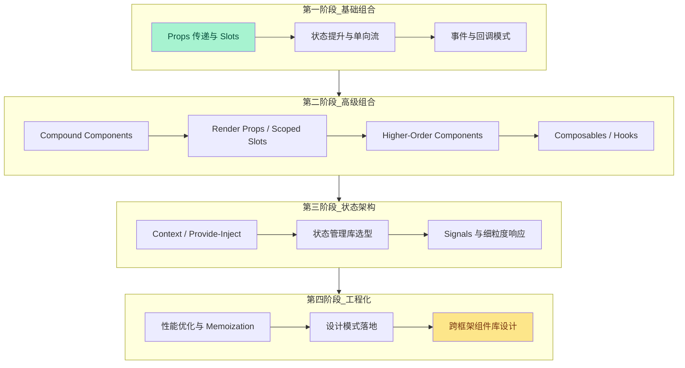
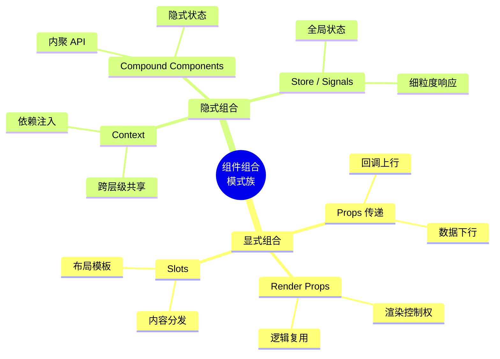
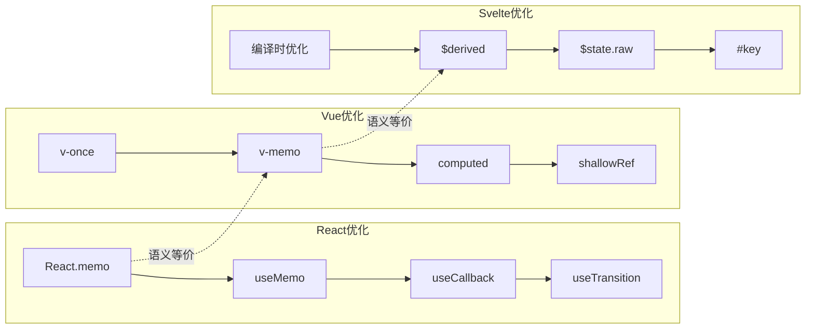
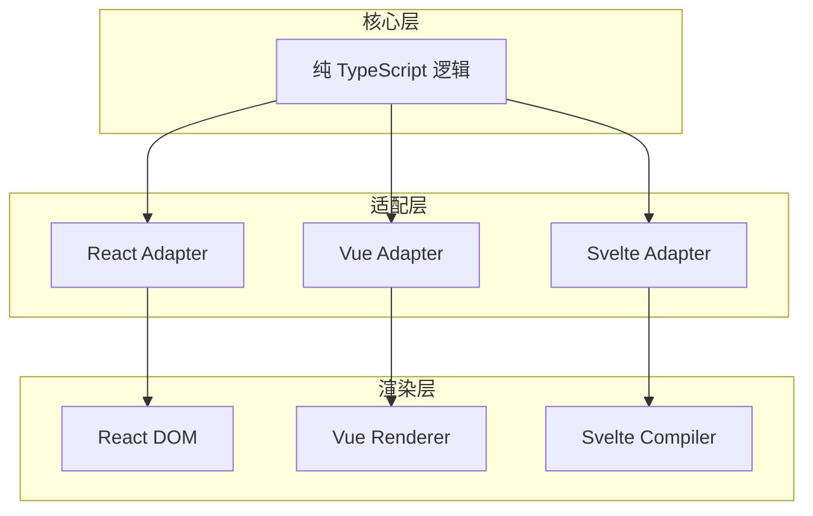

# 🧩 前端模式示例

> 组件组合是现代前端架构的核心语言。本示例库深入剖析 React、Vue、Svelte 三大框架的组件组合策略，从基础模式到高级抽象，从性能优化到设计模式落地，帮助开发者建立系统性的前端架构思维。

前端开发已从“页面堆砌”演进为“组件系统工程”。如何设计可复用、可维护、可扩展的组件接口？如何在跨层级状态共享与组件解耦之间取得平衡？如何将经典设计模式转化为符合框架语义的具体实现？本目录提供的示例遵循以下设计原则：

- **框架语义优先**：每种模式均给出 React、Vue、Svelte 三种实现，强调各框架的惯用法（idiomatic approach）
- **类型安全贯穿**：所有示例使用 TypeScript 严格模式，充分利用泛型、条件类型与映射类型提升 API 的表达能力
- **可访问性内置**：每个组件示例均包含 ARIA 属性、键盘导航与焦点管理
- **安全防线前置**：Vue 示例中对 `v-html` 等危险 API 提供净化策略，防范 XSS 攻击

---

## 学习路径

以下流程图展示了从基础组合到高级架构的推荐学习顺序。建议按照阶段递进，每个阶段均包含理论映射、代码实现与性能审计三个环节。

### 各阶段关键产出

| 阶段 | 核心技能 | 预期产出 | 验证标准 |
|------|---------|---------|---------|
| **第一阶段** | 掌握组件间通信的基础机制 | 可运行的表单组件集 | Props 类型完备、事件流向清晰 |
| **第二阶段** | 理解隐式状态共享与渲染控制 | Tabs、Accordion、Select 复合组件 | 通过 axe-core 可访问性检测 |
| **第三阶段** | 掌握跨层级状态管理与响应式原理 | 主题系统、多语言框架 | 状态变更可追溯、无冗余渲染 |
| **第四阶段** | 将经典设计模式转化为前端实现 | 命令式编辑器、策略式校验器 | 单元测试覆盖率 > 80% |

---

## 前端模式全景

### 组件组合模式族

现代 UI 框架提供了多种组件组合手段，从显式的 Props 传递到隐式的 Context 共享，每种手段都有其最佳适用域：

### 核心模式速查表

| 模式 | 核心思想 | 框架支持 | 心智负担 | 典型场景 |
|------|---------|---------|---------|---------|
| **Compound Components** | 父组件托管状态，子组件隐式消费 | React/Vue/Svelte | 中 | Tabs、Accordion、Select |
| **Render Props** | 通过函数 prop 移交渲染控制权 | React（Vue 用 Scoped Slot） | 高 | 跨组件逻辑复用、MouseTracker |
| **Slots** | 在子组件预留内容插入点 | Vue/Svelte（React 用 children） | 低 | PageLayout、Card |
| **HOC** | 函数接收组件返回增强组件 | React/Vue（不推荐） | 高 | 权限控制、埋点 |
| **Hooks / Composables** | 将状态逻辑提取为可复用函数 | React/Vue/Svelte 5 | 中 | 数据获取、表单处理 |
| **状态提升** | 将共享状态上移至最近公共父节点 | 通用 | 低 | 表单控件联动 |
| **Context / Provide** | 声明式依赖注入，绕过 prop drilling | React/Vue/Svelte | 中 | 主题、国际化、用户认证 |

---

## 示例目录

| 序号 | 主题 | 文件 | 难度 | 预计时长 | 覆盖框架 |
|------|------|------|------|---------|---------|
| 01 | 组件组合模式实战 | [查看](./component-composition-patterns.md) | 高级 | 90 min | React / Vue / Svelte |
| 02 | 状态管理策略对比（即将推出） | — | 中级 | 60 min | React / Vue / Svelte |
| 03 | 渲染性能优化实战（即将推出） | — | 高级 | 75 min | React / Vue / Svelte |
| 04 | 可访问组件设计指南（即将推出） | — | 中级 | 50 min | React / Vue / Svelte |
| 05 | 跨框架组件库设计（即将推出） | — | 专家 | 120 min | React / Vue / Svelte |

---

## 性能优化策略索引

性能优化是前端模式不可分割的一部分。以下索引汇总了三大框架的核心优化技术及其适用条件：

| 技术 | React | Vue | Svelte | 核心作用 |
|------|-------|-----|--------|---------|
| **浅比较跳过** | `React.memo` | `v-memo` | 编译时自动 | 避免纯展示组件重复渲染 |
| **一次性渲染** | 状态隔离 / 常量提取 | `v-once` | 编译时优化 | 静态内容跳过响应式追踪 |
| **派生缓存** | `useMemo` | `computed` | `$derived` | 昂贵计算结果缓存 |
| **引用稳定** | `useCallback` | 方法直接绑定 | 编译时优化 | 子组件 memo 生效的前提 |
| **并发渲染** | `useTransition` | — | — | 非紧急更新可中断 |
| **原始状态** | `useRef` / Immer | `shallowRef` | `$state.raw` | 跳过深层响应式代理 |

---

## 设计模式在前端的映射

经典设计模式并非后端专属。以下表格展示了观察者、命令、策略三种模式在前端生态中的具体形态：

| 设计模式 | 前端形态 | 代表库 / API | 关键概念 |
|---------|---------|------------|---------|
| **观察者模式** | 事件系统、响应式数据 | `EventEmitter`、`addEventListener`、`watch`、`$effect` | 订阅-发布、依赖收集 |
| **命令模式** | 撤销/重做、操作队列 | 富文本编辑器、Redux DevTools | 封装请求、历史栈管理 |
| **策略模式** | 校验规则、图表渲染、排序 | VeeValidate、D3.js | 算法封装、运行时替换 |
| **装饰器模式** | HOC、指令、过渡动画 | `withRouter`、`v-directive` | 职责增强、透明包装 |
| **工厂模式** | 组件动态创建、模态框管理 | `createPortal`、`defineAsyncComponent` | 延迟实例化、抽象创建逻辑 |

---

## 专题映射

### 与 [框架模型](/framework-models/) 的映射

前端模式的实现深度依赖于框架底层机制。以下映射帮助读者从模式实践回溯到理论根基：

| 本专题内容 | 框架模型专题 | 关联深度 |
|-----------|------------|---------|
| Compound Components 状态共享 | [组件模型理论](/framework-models/01-component-model-theory.html) | 组件封装级别、接口契约设计 |
| Context / Provide-Inject | [状态管理理论](/framework-models/04-state-management-theory.html) | 跨层级状态传播、依赖注入语义 |
| React.memo / v-once / $derived | [框架性能模型](/framework-models/12-framework-performance-models.html) | 渲染跳过策略、变更检测算法 |
| Slots / children / Snippets | [模板系统理论](/framework-models/07-templating-theory.html) | 内容分发的编译时与运行时策略 |
| HOC / Composables / Hooks | [控制反转理论](/framework-models/06-control-inversion-theory.html) | 切面关注点、依赖注入容器 |
| 响应式系统与 Signals | [响应式信号理论](/framework-models/03-reactivity-signals-theory.html) | 细粒度更新、依赖图构建 |
| 服务端与客户端边界 | [服务端客户端边界](/framework-models/10-server-client-boundary.html) | 组件水合、交互时机 |

### 与 [编程范式](/programming-paradigms/) 的映射

前端模式是编程范式在具体框架中的投影：

| 本专题内容 | 编程范式专题 | 关联深度 |
|-----------|------------|---------|
| 观察者模式与 Event Bus | [响应式范式](/programming-paradigms/07-reactive-paradigm.html) | 信号传播、依赖追踪、自动调度 |
| 命令模式与 Redux | [指令式范式](/programming-paradigms/02-imperative-paradigm.html) | 状态变更序列化、副作用隔离 |
| 策略模式与高阶函数 | [函数式范式](/programming-paradigms/04-functional-paradigm.html) | 一等函数、纯函数、不可变性 |
| Compound Components | [面向对象范式](/programming-paradigms/05-oop-paradigm.html) | 组合优于继承、封装与多态 |
| Render Props / 模板注入 | [元编程范式](/programming-paradigms/10-metaprogramming-paradigm.html) | 代码即数据、渲染控制反转 |
| 并发渲染与调度 | [并发范式](/programming-paradigms/08-concurrent-paradigm.html) | 任务调度、可中断计算、时间切片 |
| 多范式框架设计 | [多范式设计](/programming-paradigms/11-multi-paradigm-design.html) | 范式融合、语义一致性与性能权衡 |

---

## 技术栈与工具链

本目录示例涉及的完整技术栈：

| 层级 | 技术选型 | 版本要求 | 用途 |
|------|---------|---------|------|
| **语言** | TypeScript | ≥ 5.0 | 类型安全、泛型推导 |
| **React** | React + React DOM | ≥ 18.0 | Hooks、Concurrent Features、Context |
| **Vue** | Vue | ≥ 3.4 | 组合式 API、泛型组件、Provide/Inject |
| **Svelte** | Svelte | ≥ 5.0 | Runes、Snippets、细粒度响应式 |
| **构建** | Vite | ≥ 5.0 | 快速 HMR、Tree Shaking |
| **测试** | Vitest + Testing Library | ≥ 1.0 | 组件单元测试、可访问性查询 |
| **安全** | DOMPurify | ≥ 3.0 | HTML 净化、XSS 防御 |
| **Lint** | ESLint + typescript-eslint | ≥ 7.0 | 类型感知代码检查 |

---

## 常见问题速查

### Q1: 何时使用 Compound Components，何时使用 Render Props？

- **Compound Components**：当一组子组件天然属于同一语义单元（如 Tabs、Accordion、Select），且需要共享隐式状态时选用。其优势在于 API 内聚，使用方无需手动传递状态。
- **Render Props**：当需要让父组件精确控制某个子组件的渲染逻辑，或需要在渲染时注入动态数据时选用。其优势在于灵活性高，但会增加嵌套层级（回调地狱）。

### Q2: Vue 中是否还需要 HOC？

Vue 3 的组合式 API（Composables）在绝大多数场景下优于 HOC。HOC 在 Vue 中会导致类型推断困难、props 透射繁琐、IDE 支持不佳。仅当需要**动态组件包装**且无法通过 slot 实现时，才考虑使用函数式组件模拟 HOC。

### Q3: Svelte 5 的 Snippets 是否替代了 Slots？

Svelte 5 的 Snippets 是 Slots 的类型安全超集。Snippets 支持参数传递（等效于 Scoped Slots），并在编译时进行更激进的优化。新项目推荐直接使用 Snippets，旧项目可渐进迁移。

### Q4: 如何评估组件是否需要 memoization？

遵循以下检查清单：

1. 组件是否接收大型对象或数组 prop？
2. 组件的渲染开销是否显著高于一次浅比较？
3. 父组件是否频繁渲染但 prop 很少变化？
4. 子组件树是否足够深，使得不必要的渲染影响范围广？

若以上任一条件为真，则考虑使用 `React.memo`、`v-memo` 或 Svelte 的编译时优化。

### Q5: 跨框架组件库的设计原则是什么？

当团队需要维护同时支持 React、Vue、Svelte 的组件库时，建议采用以下架构：

1. **核心逻辑层**：使用纯 TypeScript 编写框架无关的业务逻辑（状态机、校验规则、事件总线）。
2. **适配层**：为每个框架编写轻量级的适配组件，负责将核心逻辑绑定到框架的响应式系统与渲染机制。
3. **样式层**：使用 CSS 变量或原子化 CSS（如 Tailwind）实现样式共享，避免框架特定的 CSS-in-JS 方案。
4. **测试层**：核心逻辑使用 Vitest 进行单元测试，适配层组件使用对应框架的 Testing Library 进行集成测试。

### Q6: 前端设计模式与框架idioms的关系？

设计模式是跨语言的抽象解决方案，而框架 idioms 是模式在特定技术栈中的地道表达。例如：

- **策略模式**在 Vanilla JS 中可通过对象映射表实现；在 React 中可通过 props 传递组件实现；在 Vue 中可通过动态组件 `<component :is="strategy" />` 实现。
- **观察者模式**在 React 中表现为 `useEffect` 的依赖追踪；在 Vue 中表现为 `watch` 和 `watchEffect`；在 Svelte 中表现为 `$effect` 的自动依赖收集。

理解这种映射关系，有助于在不同框架间迁移时保持架构一致性。

---

## 参考资源

### 官方文档

- [React 官方文档 — Thinking in React](https://react.dev/learn/thinking-in-react)
- [Vue 官方文档 — 组件基础](https://vuejs.org/guide/essentials/component-basics.html)
- [Vue 官方文档 — 组合式函数](https://vuejs.org/guide/reusability/composables.html)
- [Svelte 官方文档 — Snippets](https://svelte.dev/docs/svelte/snippet)
- [Svelte 官方文档 — Runes](https://svelte.dev/docs/svelte/what-are-runes)

### 经典书籍与课程

- Kent C. Dodds. *Epic React*. Advanced React Patterns 模块.
- Michael Chan. *React Component Patterns*.
- Alexey Okhrimenko. *Vue.js Design Patterns*.
- Refactoring Guru. [Design Patterns](https://refactoring.guru/design-patterns).

### 社区与工具

- [React Aria](https://react-spectrum.adobe.com/react-aria/) — Adobe 的可访问组件库，Compound Components 的典范实现
- [Headless UI](https://headlessui.com/) — Tailwind 团队的无头组件库
- [Radix UI](https://www.radix-ui.com/) — 现代 React 组件原语
- [VueUse](https://vueuse.org/) — Vue 组合式工具集
- [Melt UI](https://melt-ui.com/) — Svelte 无头组件库

---

> 💡 **贡献提示**：如果你希望补充新的前端模式示例（如 Container-Presentation、Proxy Pattern 实现、Virtual List 组件设计等），请参考 CONTRIBUTING.md 提交 PR。每个新增示例应包含 React、Vue、Svelte 三种实现，并附带 TypeScript 类型定义与单元测试。
