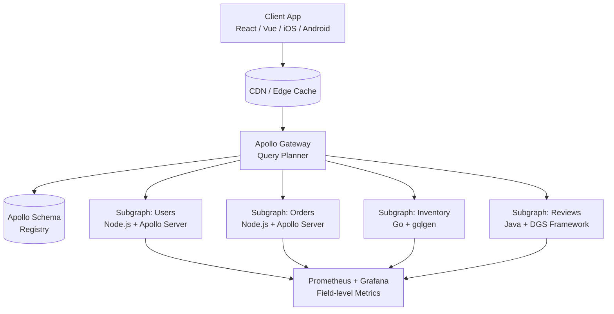
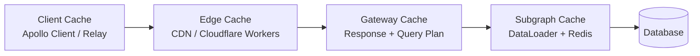
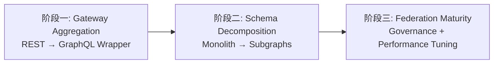

# 生产级 GraphQL 联邦网关实战

在现代微服务架构中，数据往往分散在数十甚至上百个服务之中。传统的单体 GraphQL Schema 在规模扩大后会面临维护困难、发布耦合、团队协作受阻等挑战。Apollo Federation 提供了一种声明式的 Schema 组合方案，使得各服务团队可以独立维护自己的子图（Subgraph），而网关（Gateway）则负责在运行时将这些子图整合为统一的联邦数据图（Federated Data Graph）。本文将基于大型分布式系统的真实落地经验，系统阐述从架构设计到生产运维的完整实践路径。

## 1. 联邦架构的核心价值与演进背景

GraphQL 最初由 Facebook 于 2012 年内部开发，2015 年开源，旨在解决 RESTful API 中过度获取（Over-fetching）和获取不足（Under-fetching）的问题。随着微服务架构的普及，单一 GraphQL 服务器逐渐演变为网关聚合层。然而，早期的 Schema Stitching 方案需要手动处理类型冲突、跨服务引用和解析逻辑，难以在大型组织中规模化推广。

Apollo Federation 在 2019 年推出，其核心创新在于引入了**实体（Entity）**与**@key 指令**，使得子图可以声明自己拥有的类型及其主键，同时允许其他子图通过 `@extends` 机制扩展这些类型。这种基于元数据的组合方式，将 Schema 的物理拆分与逻辑统一解耦，为持续集成和独立部署奠定了基础。

联邦架构的三大核心价值体现在：

- **团队自治**：每个领域团队拥有独立的代码仓库、CI/CD 流水线和服务实例，只需遵循统一的实体契约即可接入联邦图。
- **类型安全**：通过 Apollo Rover CLI 和 Schema Registry 的校验机制，在部署前即可发现跨子图的类型冲突和破坏性变更。
- **查询优化**：网关的查询计划器（Query Planner）能够将客户端的单一 GraphQL 查询分解为针对各子图的并行子查询，并在必要时进行批处理与去重。

```typescript
// subgraph-users/src/schema.ts
import &#123; gql } from 'apollo-server';

export const typeDefs = gql`
  type User @key(fields: "id") &#123;
    id: ID!
    email: String!
    profile: UserProfile
  }

  extend type Query &#123;
    user(id: ID!): User
    me: User
  }
`;
```

```typescript
// subgraph-orders/src/schema.ts
import &#123; gql } from 'apollo-server';

export const typeDefs = gql`
  type Order &#123;
    id: ID!
    buyer: User! @provides(fields: "id")
    total: Float!
  }

  extend type User @key(fields: "id") &#123;
    id: ID! @external
    orders: [Order!]!
  }
`;
```

上述代码展示了两个子图如何协同工作：`subgraph-users` 定义了 `User` 实体及其主键 `id`；`subgraph-orders` 通过 `@key` 引用该实体，并在其上扩展 `orders` 字段。网关会在运行时自动解析跨服务的实体引用，无需手动编写聚合逻辑。

## 2. Apollo Federation 架构全景

一个典型的联邦 GraphQL 生产环境由以下组件构成：客户端层、网关层、子图服务层、Schema 注册中心、可观测性平台以及安全边界。各组件之间的交互关系如下所示：



客户端通过 HTTP/2 或 HTTP/3 将 GraphQL 查询发送至网关。网关首先从 Schema Registry 获取最新的组合 Schema（Supergraph），然后由查询计划器将客户端查询拆分为针对各子图的子查询。对于需要跨服务解析的实体引用，网关会按照依赖拓扑排序，优先获取主键数据，再并行发起扩展字段的查询。

值得注意的是，Apollo Federation 2 引入了**Supergraph Schema** 的概念，它是一种单一的、可静态分析的 Schema 表示，完整描述了所有子图的类型、指令和实体关系。Rover CLI 可以通过 `rover supergraph compose` 命令将多个子图 SDL 文件组合为 Supergraph，供网关离线加载或在线订阅更新。

```yaml
# supergraph-config.yaml
federation_version: =2.7.0
subgraphs:
  users:
    routing_url: http://users-service:4001
    schema:
      file: ./subgraphs/users.graphql
  orders:
    routing_url: http://orders-service:4002
    schema:
      file: ./subgraphs/orders.graphql
  inventory:
    routing_url: http://inventory-service:4003
    schema:
      file: ./subgraphs/inventory.graphql
```

在生产环境中，建议将 Supergraph 的构建步骤纳入 CI/CD 流水线，并结合 Schema Check 进行兼容性验证。任何破坏现有客户端查询的变更（如删除字段、修改参数类型）都会在合并请求阶段被拦截，从而避免生产事故。

## 3. Schema 拆分与组合策略

Schema 的拆分粒度直接影响团队的开发效率和系统的运行时性能。过于粗粒度的子图会导致回归单体的问题；过于细粒度则会增加跨服务调用的网络开销和查询计划的复杂度。实践中，建议遵循**领域驱动设计（DDD）**中的限界上下文（Bounded Context）原则来划分子图边界。

### 3.1 实体与值对象的分野

在联邦 Schema 中，只有被标记为 `@key` 的类型才能成为实体，允许其他子图扩展。值对象（Value Object）则应在定义它的子图内部完成解析，不对外暴露可扩展性。例如，`Money` 类型通常作为值对象处理：

```graphql
# subgraph-payments/schema.graphql
type Money &#123;
  amount: Float!
  currency: Currency!
}

enum Currency &#123;
  CNY
  USD
  EUR
}
```

如果错误地将 `Money` 标记为实体，会导致大量不必要的跨服务引用开销，因为网关需要为每个 `Money` 实例发起一次实体解析请求。

### 3.2 跨上下文引用的模式

当两个限界上下文之间存在天然关联时，应通过 `@key` + `@external` 的组合实现弱耦合引用。常见模式包括：

- **Lookup 模式**：目标子图暴露按主键查询的入口（如 `user(id: ID!)`），源子图在解析字段时调用该入口。
- **Enumeration 模式**：当需要批量获取实体时，利用 `@provides` 预取关键字段，减少后续实体解析的往返次数。
- **Compound Key 模式**：对于联合主键场景，使用 `@key(fields: "orgId userId")` 声明复合键，并在引用方完整提供所有键字段。

```graphql
# subgraph-analytics/schema.graphql
type UserActivitySummary @key(fields: "orgId userId") &#123;
  orgId: ID! @external
  userId: ID! @external
  totalLogins: Int!
  lastActiveAt: String
}

extend type User @key(fields: "id") &#123;
  id: ID! @external
  orgId: ID! @external
  activitySummary: UserActivitySummary
    @requires(fields: "id orgId")
}
```

在此示例中，`UserActivitySummary` 使用复合主键 `orgId` 和 `userId`。网关在执行查询计划时，会确保在调用 `analytics` 子图之前，已经从 `users` 子图获取了这两个字段的值。

### 3.3 Schema 组合中的冲突消解

联邦组合器（Federation Compositor）在合并子图时会执行严格的类型一致性检查。常见的冲突类型包括：

| 冲突类型 | 示例 | 解决方案 |
|---------|------|---------|
| 字段类型不一致 | `User.age` 在子图 A 为 `Int`，在子图 B 为 `String` | 统一类型或重命名字段 |
| 指令参数冲突 | `@key(fields: "id")` 与 `@key(fields: "email")` 共存 | 确保同一类型的所有 `@key` 在语义上等价 |
| 枚举值缺失 | 子图 A 的 `Status` 含 `PENDING`，子图 B 不含 | 联邦 2 允许部分枚举，需显式配置 `@inaccessible` |

Apollo Federation 2 引入了 `@shareable` 指令，用于显式声明某个字段可以在多个子图中定义。这解决了 Federation 1 中因意外重复定义字段而导致的组合失败问题。

```graphql
# subgraph-a/schema.graphql
type Query &#123;
  hello: String! @shareable
}

# subgraph-b/schema.graphql
type Query &#123;
  hello: String! @shareable
}
```

## 4. Gateway 路由与查询计划机制

网关是联邦架构的大脑，其性能直接决定了整个数据图的响应延迟。Apollo Gateway 的查询执行流程可分为四个阶段：解析（Parse）、验证（Validate）、计划（Plan）和执行（Execute）。

### 4.1 查询计划的数据结构

查询计划器将客户端的 GraphQL AST 转换为一颗由 `FetchNode`、`FlattenNode`、`ParallelNode` 和 `SequenceNode` 组成的执行树。每个 `FetchNode` 代表一次对子图的 GraphQL 请求，包含目标服务的 URL、请求体和变量映射。

```typescript
interface FetchNode &#123;
  kind: 'Fetch';
  serviceName: string;
  selectionSet: string;
  variableUsages: string[];
  requires?: string;
}

interface ParallelNode &#123;
  kind: 'Parallel';
  nodes: PlanNode[];
}

interface SequenceNode &#123;
  kind: 'Sequence';
  nodes: PlanNode[];
}
```

考虑如下客户端查询：

```graphql
query GetUserWithOrders &#123;
  me &#123;
    id
    email
    orders &#123;
      id
      total
      buyer &#123;
        id
        email
      }
    }
  }
}
```

网关生成的查询计划逻辑如下：

1. **并行阶段**：向 `users` 子图发送 `me &#123; id email }`；同时，由于 `orders` 是 `User` 的扩展字段，网关需要先获取 `id`。
2. **序列阶段**：在拿到 `me.id` 后，向 `orders` 子图发送 `userOrders(userId: $id) &#123; id total }`。
3. **批处理优化**：如果 `orders` 返回多个订单，且每个订单的 `buyer` 字段需要回查 `users` 子图，网关会自动将多个 `id` 聚合为一次批量查询（DataLoader 模式）。

### 4.2 查询计划的缓存策略

查询计划器的计算成本较高，特别是对于深度嵌套或包含大量片段（Fragment）的查询。生产环境中应启用**查询计划缓存**，以操作名称和变量结构为键，缓存编译后的计划对象。

```typescript
import &#123; ApolloGateway } from '@apollo/gateway';
import &#123; InMemoryLRUCache } from '@apollo/utils.keyvaluecache';

const gateway = new ApolloGateway(&#123;
  supergraphSdl: readFileSync('./supergraph.graphql', 'utf-8'),
  queryPlannerConfig: &#123;
    cache: new InMemoryLRUCache(&#123;
      maxSize: Math.pow(2, 20) * 30, // 30 MB
      ttl: 300, // 5 minutes
    }),
  },
});
```

此外，对于高频且结构稳定的查询（如移动端首页加载），可以在网关前方部署 CDN 边缘缓存。通过配置 `Cache-Control` 响应头和 `GET` 请求白名单，可将部分查询的响应延迟降低至毫秒级。

### 4.3 路由插件与自定义逻辑

Apollo Gateway 支持通过插件机制插入自定义路由逻辑。常见的扩展点包括：

- **willSendRequest**：在转发请求至子图前修改 HTTP 头（如注入鉴权令牌、传递追踪 ID）。
- **didReceiveResponse**：在收到子图响应后执行日志记录、指标采集或敏感数据脱敏。
- **didEncounterError**：统一处理子图超时、网络中断或 GraphQL 错误，实现熔断与降级。

```typescript
const LoggingPlugin: ApolloServerPlugin = &#123;
  async requestDidStart() &#123;
    return &#123;
      async willSendRequest(requestContext) &#123;
        requestContext.request.http?.headers.set(
          'x-request-id',
          randomUUID()
        );
      },
      async didEncounterError(requestContext) &#123;
        metricsClient.increment('gateway.subgraph.error', &#123;
          service: requestContext.serviceName,
          errorCode: requestContext.error.code,
        });
      },
    };
  },
};
```

## 5. 分布式数据图治理

联邦 GraphQL 的本质是分布式系统，因此必须建立完善的治理体系，确保 Schema 质量、服务健康度和团队协作效率。

### 5.1 Schema Registry 与变更管理

Apollo Studio（现 GraphOS）提供了 Schema Registry 功能，支持版本控制、变更追踪和客户端感知分析。在引入破坏性变更前，可以通过 `rover graph check` 命令检查哪些客户端查询会受到影响。

```bash
rover subgraph check my-graph@production \
  --schema ./subgraphs/users.graphql \
  --name users
```

输出示例：

```
Checked the proposed subgraph against my-graph@production
┌─────────┬─────────────────────┬────────────────────────────────────────┐
│ Change  │         Code        │              Description               │
├─────────┼─────────────────────┼────────────────────────────────────────┤
│ FAILURE │ FIELD_REMOVED       │ Field "legacyId" was removed from      │
│         │                     │ type "User" (used by 3 operations)     │
├─────────┼─────────────────────┼────────────────────────────────────────┤
│ PASS    │ FIELD_ADDED         │ Field "preferredName" added to type    │
│         │                     │ "User"                                 │
└─────────┴─────────────────────┴────────────────────────────────────────┘
```

对于已识别的破坏性变更，应遵循**双层兼容策略**：先在新版本中添加替代字段并标记旧字段为 `@deprecated`，待所有客户端迁移完成后，再在下一个主版本中移除旧字段。

### 5.2 子图健康度评分

建议为每个子图建立健康度评分模型，维度包括：

- **可用性（Availability）**：过去 30 天的服务可用率，目标 ≥ 99.99%。
- **延迟（Latency）**：P99 响应时间，目标 ≤ 200ms（内部服务间调用）。
- **错误率（Error Rate）**：非业务异常的比例，目标 ≤ 0.1%。
- **Schema 合规性**：是否遵循命名规范、是否包含完整的 `Query` 和 `Mutation` 文档、实体是否正确定义 `@key`。

通过定期生成健康度报告，可以识别出需要优先投入技术债治理的子图。

### 5.3 文档与契约测试

联邦架构的成功高度依赖清晰的接口契约。每个子图应自动生成 Schema 文档，并在 CI 中运行契约测试。推荐的工具链包括：

- **GraphQL Inspector**：Diff 两个 Schema 版本，检测破坏性变更。
- **Pact**：通过消费者驱动的契约测试（CDC），确保子图的实现与消费者的期望一致。
- **Spectral**：基于自定义规则集进行 Schema Lint，强制要求字段描述、参数校验和权限指令的规范性。

```yaml
# .spectral.yaml
extends: ["spectral:graphql"]
rules:
  typedef-description:
    description: All types must have a description.
    given: "*.definitions[*]"
    then:
      function: truthy
      field: description
```

## 6. 性能优化：查询计划、缓存与批处理

联邦 GraphQL 的性能优化是一个系统工程，涉及网关层、子图层和网络传输层。

### 6.1 查询计划优化

查询计划器的目标是最小化对子图的请求次数和数据传输量。开发者可以通过以下方式辅助计划器生成更优的执行树：

- **使用 `@provides` 预取字段**：当子图 A 在返回实体时已经拥有某些字段的值，使用 `@provides` 可以避免网关再次查询子图 B。
- **避免循环依赖**：子图之间不应存在环形实体引用，否则查询计划器会陷入深度递归，生成低效的序列化执行计划。
- **合理设计 `@requires`**：`@requires` 会强制网关先获取依赖字段，再发起目标查询。如果依赖字段本身需要多次跨服务调用，会显著增加查询延迟。

```graphql
# subgraph-shipping/schema.graphql
extend type Order @key(fields: "id") &#123;
  id: ID! @external
  destinationZip: String! @external
  estimatedDelivery: String
    @requires(fields: "destinationZip")
}
```

在此例中，`shipping` 子图需要 `orders` 子图先提供 `destinationZip`，才能计算 `estimatedDelivery`。网关会保证执行顺序，但这也意味着两个子图的调用无法并行化。

### 6.2 多级缓存体系

联邦 GraphQL 的缓存可分为四个层级：



- **客户端缓存**：Apollo Client 的 `InMemoryCache` 通过 `__typename + id` 进行实体规范化缓存，避免重复请求相同对象。
- **边缘缓存**：对于公共数据（如商品目录、文章列表），可在 CDN 缓存 GraphQL 响应。需要使用 `GET` 请求并将查询哈希作为 URL 参数，以便 CDN 进行缓存键匹配。
- **网关响应缓存**：Apollo Server 提供了 `responseCachePlugin`，支持基于 `@cacheControl` 指令的 TTL 控制。
- **子图数据缓存**：在子图内部使用 Redis 缓存数据库查询结果，DataLoader 缓存同一请求内的重复键查询。

```typescript
import responseCachePlugin from 'apollo-server-plugin-response-cache';

const server = new ApolloServer(&#123;
  gateway,
  plugins: [responseCachePlugin()],
  cache: new RedisCache(&#123;
    host: 'redis-cluster.internal',
  }),
});
```

### 6.3 DataLoader 与批处理

DataLoader 是解决 N+1 查询问题的标准方案。在联邦子图中，每个实体解析器都应使用 DataLoader 实例，将同一事件循环内的多次单体查询合并为一次批量查询。

```typescript
// subgraph-users/src/resolvers.ts
import DataLoader from 'dataloader';
import &#123; UserAPI } from './datasources';

export const createUserLoader = (api: UserAPI) =>
  new DataLoader<string, User>(async (ids) => &#123;
    const users = await api.getUsersByIds(ids);
    return ids.map((id) => users.find((u) => u.id === id));
  });

export const resolvers = &#123;
  Query: &#123;
    user: (_: unknown, &#123; id }: &#123; id: string }, context) =>
      context.userLoader.load(id),
  },
  Order: &#123;
    buyer: (order, _args, context) =>
      context.userLoader.load(order.buyerId),
  },
};
```

在联邦网关层面，当多个子图请求需要解析同一批实体时，Apollo Gateway 会自动进行跨请求的批处理优化（Request Batching）。此外，还可以启用 HTTP/2 的多路复用，减少 TCP 连接建立的开销。

### 6.4 查询成本分析与限流

为了防止恶意或错误的查询耗尽系统资源，应在网关层实施查询成本分析（Query Cost Analysis）。基本原理是为每个字段分配权重，在查询解析阶段计算总成本，超过阈值的查询将被拒绝。

```typescript
import &#123; createComplexityLimitRule } from 'graphql-validation-complexity';

const complexityRule = createComplexityLimitRule(1000, &#123;
  onComplete: (complexity: number) => &#123;
    console.log(`Query complexity: $&#123;complexity}`);
  },
  createError: (max: number, actual: number) =>
    new GraphQLError(
      `Query too complex: $&#123;actual}. Maximum allowed complexity: $&#123;max}.`
    ),
});

const server = new ApolloServer(&#123;
  gateway,
  validationRules: [complexityRule],
});
```

权重分配策略应结合业务场景动态调整。例如，列表字段的权重应与其 `first` / `last` 参数成正比，深层嵌套查询的权重应随深度指数增长。

## 7. 安全体系：深度限制、复杂度分析与持久化查询

GraphQL 的灵活性也带来了安全风险。与 REST 不同，GraphQL 允许客户端自由构造查询形状，这使得传统的基于 URL 的 WAF 规则难以生效。联邦网关需要构建纵深防御体系。

### 7.1 深度限制与数量限制

查询深度限制（Query Depth Limiting）可防止递归嵌套攻击（如 `user &#123; friends &#123; friends &#123; friends ... } }`）。推荐将最大深度限制在 10-15 层。

```typescript
import depthLimit from 'graphql-depth-limit';

const server = new ApolloServer(&#123;
  gateway,
  validationRules: [depthLimit(15)],
});
```

数量限制则针对列表字段，防止客户端请求过大的数据集。可以在 Schema 层面强制要求分页参数：

```graphql
type Query &#123;
  users(
    first: Int! @constraint(min: 1, max: 100)
    after: String
  ): UserConnection!
}
```

### 7.2 持久化查询（Persisted Queries）

持久化查询是生产环境中最有效的 GraphQL 安全加固手段。其工作原理是：客户端不再发送完整的查询字符串，而是发送查询的 SHA-256 哈希值（通常称为 `sha256Hash`）。网关通过哈希值从注册表或本地缓存中查找对应的查询文本。

这种方式带来了多重收益：

- **拒绝未知查询**：攻击者无法构造任意的复杂查询，因为未注册的查询哈希会被直接拒绝。
- **减小请求体积**：移动端网络环境下，哈希值（32 字节）远小于完整的 GraphQL 查询文本（数 KB）。
- **提升缓存命中率**：CDN 可以基于哈希值进行精确缓存，不受查询文本格式化差异的影响。

Apollo Client 与 Apollo Server 的集成方式如下：

```typescript
// 客户端配置
import &#123; createPersistedQueryLink } from '@apollo/client/link/persisted-queries';
import &#123; sha256 } from 'crypto-hash';

const link = createPersistedQueryLink(&#123; sha256 }).concat(httpLink);
```

```typescript
// 网关配置
import &#123; ApolloServerPluginLandingPageDisabled } from '@apollo/server/plugin/disabled';

const server = new ApolloServer(&#123;
  gateway,
  plugins: [
    ApolloServerPluginLandingPageDisabled(), // 生产环境关闭 Playground
    persistedQueriesPlugin(&#123;
      cache: new RedisCache(&#123; host: 'redis.internal' }),
      ttl: 86400 * 30, // 30 days
    }),
  ],
});
```

### 7.3 认证与授权

联邦架构中的认证（Authentication）通常在网关层统一处理，而授权（Authorization）则需要在网关和子图两层协同实现。

- **网关层认证**：通过验证 JWT 或 Session Cookie，将解析后的用户身份（如 `userId`、`roles`）注入到 GraphQL 上下文中，并随子图请求传递。
- **子图层授权**：利用 `@auth` 或 `@requiresScopes` 等自定义指令，在字段级别声明访问控制策略。Apollo Federation 2.7 引入了 `@policy` 指令，支持基于 Open Policy Agent（OPA）的外部策略引擎集成。

```graphql
directive @auth(requires: Role = ADMIN) on FIELD_DEFINITION

enum Role &#123;
  ADMIN
  USER
  GUEST
}

type User @key(fields: "id") &#123;
  id: ID!
  email: String! @auth(requires: USER)
  taxId: String! @auth(requires: ADMIN)
}
```

对于敏感字段的访问，建议采用**字段级审计日志**，记录谁在什么时间访问了什么数据，以满足 GDPR、CCPA 等合规要求。

## 8. 监控与可观测性：Field-level Metrics

联邦 GraphQL 的可观测性需要覆盖从客户端到数据库的全链路。相比于 REST API，GraphQL 的独特挑战在于：单个端点承载了多种操作，传统的基于 URL 的指标维度无法区分不同的查询类型。

### 8.1 操作级指标

应以 GraphQL 操作名（Operation Name）作为主要维度，采集以下指标：

- `graphql.operations.count`：操作总次数，按 `operationName`、`status`（success / error）分组。
- `graphql.operations.duration`：操作执行耗时（P50 / P95 / P99）。
- `graphql.operations.complexity`：查询复杂度分布，用于识别潜在的性能退化。

### 8.2 字段级指标

字段级指标（Field-level Metrics）是诊断联邦查询性能瓶颈的关键。Apollo Server 的内置插件 `usageReportingPlugin` 会自动向 Apollo Studio 上报每个字段的解析耗时、错误率和返回类型分布。

对于自建的监控系统，可以通过 `willResolveField` 钩子手动实现：

```typescript
const FieldMetricsPlugin: ApolloServerPlugin = &#123;
  async requestDidStart() &#123;
    const startTimes = new Map<string, number>();

    return &#123;
      async executionDidStart() &#123;
        return &#123;
          async willResolveField(&#123; source, args, contextValue, info }) &#123;
            const path = info.path.key;
            startTimes.set(path, performance.now());

            return async () => &#123;
              const duration = performance.now() - startTimes.get(path)!;
              histogram.observe(&#123;
                field: `$&#123;info.parentType.name}.$&#123;info.fieldName}`,
                subgraph: contextValue.subgraphName,
                duration,
              });
            };
          },
        };
      },
    };
  },
};
```

通过字段级指标，可以清晰识别出哪些子图、哪些类型的哪些字段是延迟热点。例如，如果发现 `User.orders` 的 P99 延迟持续高于 500ms，就应优先优化 `orders` 子图的数据库索引或引入缓存。

### 8.3 分布式追踪

在联邦架构中，单次客户端查询可能涉及 3-5 个子图调用，因此必须使用分布式追踪来关联全链路日志。推荐使用 OpenTelemetry 自动注入追踪上下文：

```typescript
import &#123; NodeSDK } from '@opentelemetry/sdk-node';
import &#123; OTLPTraceExporter } from '@opentelemetry/exporter-trace-otlp-http';

const sdk = new NodeSDK(&#123;
  traceExporter: new OTLPTraceExporter(&#123;
    url: 'http://jaeger-collector:4318/v1/traces',
  }),
  instrumentations: [
    new HttpInstrumentation(),
    new GraphQLInstrumentation(),
  ],
});

sdk.start();
```

在 Jaeger 或 Grafana Tempo 中，可以查看完整的查询执行瀑布图，精确到每个子图的请求耗时和网络传输时间。

## 9. 迁移策略：从 REST 到 GraphQL 联邦

将现有的 REST 微服务迁移至联邦 GraphQL 是一个渐进式过程，不应追求一步到位。推荐的迁移路线图如下：

### 9.1 阶段一：网关聚合层（Strangler Fig 模式）

在不修改现有 REST 服务的前提下，新建一个 GraphQL 网关层，使用 RESTDataSource 或 HTTPDataSource 将 REST 端点包装为 GraphQL Schema。此阶段的目标是为前端提供统一的 GraphQL 入口，同时验证团队的技术能力和协作模式。

```typescript
import &#123; RESTDataSource } from '@apollo/datasource-rest';

class UsersAPI extends RESTDataSource &#123;
  override baseURL = 'https://api.internal/users/';

  async getUser(id: string): Promise<User> &#123;
    return this.get(`$&#123;id}`);
  }
}

const resolvers = &#123;
  Query: &#123;
    user: async (_: unknown, &#123; id }: &#123; id: string }, &#123; dataSources }) =>
      dataSources.usersAPI.getUser(id),
  },
};
```

### 9.2 阶段二：单体 Schema 拆分

当单体 GraphQL 服务器的 Schema 变得臃肿时，开始按领域上下文拆分子图。优先拆分变更频率最高、团队边界最清晰的领域。每个子图最初可以是 REST 服务的薄包装，逐步将内部实现替换为直连数据库或内部 gRPC 服务。

### 9.3 阶段三：联邦化与治理体系建设

引入 Apollo Federation 和 Schema Registry，建立 Schema Check、契约测试和健康度评分的自动化流程。同时，在前端团队推广持久化查询和强类型代码生成（如 GraphQL Code Generator），提升全栈开发效率。



### 9.4 兼容性保障

在迁移过程中，必须保证现有 REST 客户端的兼容性，直至所有消费者完成迁移。可以通过以下策略实现平滑过渡：

- **双写模式**：在数据库变更时，同时维护 REST 和 GraphQL 两种接口的数据一致性。
- **流量镜像**：将生产流量的一部分镜像到新的 GraphQL 服务，进行影子验证（Shadow Testing）。
- **API 版本协商**：在网关层支持基于 Header 的版本协商，允许客户端按需选择 REST 或 GraphQL。

## 10. 与现有专题的映射

本文的内容与 Awesome JavaScript/TypeScript Ecosystem 文档站点中的多个专题存在紧密关联：

- **[应用设计](/application-design/)**：联邦 Schema 的拆分策略直接对应微服务架构中的领域驱动设计（DDD）和限界上下文划分。子图之间的依赖管理、接口契约定义和版本控制，均属于应用架构设计的核心议题。
- **[数据库与 ORM](/database-orm/)**：子图内部的 DataLoader 优化、数据库连接池管理、N+1 查询消除以及缓存策略，与 ORM 层（如 Prisma、TypeORM）的性能调优密切相关。联邦网关的查询计划本质上是对底层数据访问模式的高层编排。

## 11. 总结与权威参考

生产级 GraphQL 联邦网关的构建是一项涵盖架构设计、Schema 治理、性能优化、安全加固和可观测性建设的系统工程。Apollo Federation 通过实体引用和声明式组合，为大规模微服务组织提供了可持续演进的 GraphQL 方案。然而，联邦架构并非银弹——它引入了查询计划的运行时开销、跨服务调试的复杂性以及 Schema 治理的组织成本。团队应在充分评估自身规模和技术成熟度后，采用渐进式迁移策略，并建立完善的自动化测试与监控体系。

### 权威参考

1. **Apollo GraphQL 官方文档** — *Apollo Federation 2*：<https://www.apollographql.com/docs/federation/>
   - 联邦架构的权威规范，涵盖 Supergraph 组合、@key / @shareable / @provides 指令的完整语义，以及 Rover CLI 和 GraphOS 平台的使用指南。

2. **Lee Byron 等人 — GraphQL 规范** — *GraphQL Specification (October 2021 Edition)*：<https://spec.graphql.org/October2021/>
   - GraphQL 查询语言、类型系统和执行语义的标准化定义，是理解查询解析、验证和执行机制的基础。

3. **Marc-André Giroux — *Production Ready GraphQL*** (2020) — <https://book.productionreadygraphql.com/>
   - 业界公认的 GraphQL 生产实践指南，详细讨论了 Schema 设计、性能优化、安全防控和团队治理等主题，对联邦架构的落地具有重要参考价值。

4. **Netflix Technology Blog** — *How Netflix Scales Its API with GraphQL Federation* (2020)：<https://netflixtechblog.com/>
   - Netflix 分享了其从单体 GraphQL 迁移至联邦架构的完整历程，包括 Schema 拆分经验、查询计划优化和百万级 QPS 下的缓存策略。

5. **IETF RFC 9110** — *HTTP Semantics* (2022)：<https://www.rfc-editor.org/rfc/rfc9110.html>
   - 联邦网关与子图之间的通信基于 HTTP/1.1 或 HTTP/2，本规范为理解缓存语义（Cache-Control）、条件请求和幂等性提供了协议层基础。

---

> **延伸阅读**：若希望深入了解联邦网关的底层实现细节，可查阅 `@apollo/query-planner` 和 `@apollo/gateway` 的开源代码仓库。对于正在评估是否引入联邦架构的团队，建议先以单个非核心领域作为试点，验证 Schema 组合、CI/CD 集成和监控告警的完备性后，再逐步扩展至核心业务域。
