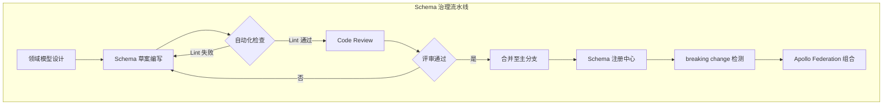

# GraphQL 生产级示例总览

GraphQL 自 Facebook 于 2015 年开源以来，已经从一项实验性的数据查询语言演变为现代 API 设计的事实标准之一。与 REST 相比，GraphQL 的强类型 schema、精确的数据获取能力和内省的 API 文档特性，使其在复杂的前后端协作场景中展现出显著优势。然而，将 GraphQL 从原型验证推进到生产环境，需要面对的挑战远不止语法学习——schema 治理、性能优化、联邦架构、缓存策略、安全加固和可观测性构成了生产级 GraphQL 系统的完整工程图景。

本文档立足于 JavaScript/TypeScript 生态系统，全面剖析 GraphQL 在生产环境中的应用架构，重点关注服务端实现、网关层设计、客户端集成以及与应用设计方法论的结合，为构建高可用、可扩展的 GraphQL 系统提供系统化的指导。

## 目录

- [GraphQL 生产级示例总览](#graphql-生产级示例总览)
  - [目录](#目录)
  - [GraphQL 生产化核心挑战](#graphql-生产化核心挑战)
    - [N+1 查询问题](#n1-查询问题)
    - [查询复杂度控制](#查询复杂度控制)
    - [Schema 演进与兼容性](#schema-演进与兼容性)
  - [Schema 设计与治理策略](#schema-设计与治理策略)
    - [设计原则与反模式](#设计原则与反模式)
    - [代码优先 vs Schema 优先](#代码优先-vs-schema-优先)
  - [联邦架构与网关模式](#联邦架构与网关模式)
    - [Federation 架构核心概念](#federation-架构核心概念)
    - [网关演进：从 Apollo Gateway 到 Router](#网关演进从-apollo-gateway-到-router)
  - [性能优化与缓存体系](#性能优化与缓存体系)
    - [客户端缓存](#客户端缓存)
    - [服务端响应缓存](#服务端响应缓存)
    - [DataLoader 与数据库查询缓存](#dataloader-与数据库查询缓存)
  - [安全模型与防护机制](#安全模型与防护机制)
    - [查询深度与复杂度限制](#查询深度与复杂度限制)
    - [认证与授权](#认证与授权)
    - [错误信息泄漏防护](#错误信息泄漏防护)
  - [可观测性与调试体系](#可观测性与调试体系)
    - [分布式追踪](#分布式追踪)
    - [性能指标采集](#性能指标采集)
    - [Schema 使用分析](#schema-使用分析)
  - [客户端集成与状态管理](#客户端集成与状态管理)
    - [现代 GraphQL 客户端选型](#现代-graphql-客户端选型)
    - [与 UI 框架的集成](#与-ui-框架的集成)
  - [应用设计专题映射](#应用设计专题映射)
  - [相关示例与延伸阅读](#相关示例与延伸阅读)
    - [本目录示例](#本目录示例)
    - [跨专题关联](#跨专题关联)
  - [参考与引用](#参考与引用)

---

## GraphQL 生产化核心挑战

GraphQL 的灵活性是一把双刃剑。在小型项目中，开发者可以自由地定义 schema 和 resolver，快速迭代业务逻辑；但在大型组织和复杂系统中，这种灵活性如果没有适当的约束和治理机制，将迅速演变为技术债务的温床。

### N+1 查询问题

GraphQL 的嵌套查询特性天然容易触发 N+1 查询问题。当一个查询请求获取一组对象及其关联对象时（如"获取所有作者及其最新文章"），如果 resolver 实现未经过优化，服务端可能会先执行一次查询获取作者列表，再对每位作者分别执行一次查询获取其文章，导致数据库查询次数与作者数量成正比增长。

解决 N+1 问题的标准方案是 DataLoader 模式。DataLoader 通过批处理（batching）和去重（deduplication）机制，将同一请求周期内的多个独立数据加载调用合并为单次批量查询。在 JavaScript/TypeScript 生态中，`dataloader` npm 包是实现这一模式的事实标准，它与 `graphql-js`、`Apollo Server`、`TypeGraphQL` 等主流框架均有良好的集成。

### 查询复杂度控制

GraphQL 允许客户端自由构造查询，这意味着恶意或错误的查询可能对服务端造成灾难性影响。一个深度嵌套、涉及大量关联查询的请求可能触发数以万计的数据库查询，耗尽连接池或导致服务宕机。

生产环境中必须实施查询复杂度分析（Query Cost Analysis）。通过为 schema 中的每个字段分配复杂度权重，并在查询执行前计算总复杂度，服务端可以拒绝执行超过阈值的查询。`graphql-query-complexity` 和 Apollo 的 `maxDepth` / `maxComplexity` 插件提供了开箱即用的实现。

### Schema 演进与兼容性

与 REST API 可以通过版本号（v1, v2）进行破坏性变更不同，GraphQL 官方推荐通过持续演进（continuous evolution）而非版本控制来管理 schema 变更。字段的删除需要经过废弃（deprecation）周期，类型变更需要确保向后兼容。在微服务架构中，多个团队同时维护子 schema 并将其组合为统一视图，对 schema 治理提出了极高要求。

## Schema 设计与治理策略

Schema 是 GraphQL API 的契约，也是前后端协作的基石。一个设计良好的 schema 应当具备自描述性、稳定性和可扩展性，能够随着业务需求的增长而平滑演进。

### 设计原则与反模式

**面向领域建模**。GraphQL schema 应当反映业务领域的概念模型，而非底层数据库的表结构。将数据库的关联表直接映射为 GraphQL 类型往往导致 schema 泄露实现细节，增加后续重构的难度。

**标准化分页**。对于返回列表的字段，统一使用基于游标的连接分页（Cursor-based Connection Pagination）模式，而非简单的偏移量分页。Relay 规范定义的标准连接类型（`PageInfo`、`Edge`、`Connection`）提供了稳定、高效的分页语义，且在数据插入和删除时不会出现偏移量漂移问题。

**空值语义明确**。利用 GraphQL 的类型系统明确表达字段的可空性。对于业务逻辑上必然存在的字段，使用非空类型（`!`）；对于可能缺失的字段，使用可空类型并提供默认值。这有助于客户端生成更精确的类型定义，减少运行时空值检查。



上图展示了一个成熟的 schema 治理流水线。从领域模型设计到 schema 注册，每个环节都有自动化的质量门禁。Schema 注册中心（如 Apollo Studio、GraphQL Hive）不仅存储 schema 的历史版本，还能检测提案变更是否引入破坏性修改，并在 CI 流程中阻止不兼容的变更合并。

### 代码优先 vs Schema 优先

在 JavaScript/TypeScript 生态中，GraphQL schema 的定义有两种主流范式：

**Schema 优先（Schema-first）**。开发者先手写 GraphQL SDL（Schema Definition Language）文件定义类型和查询，再通过工具（如 `graphql-codegen`）生成对应的 TypeScript 类型和 resolver 签名。这种方式的优势在于 schema 作为单一真相源，前后端可以基于同一份 SDL 协作；劣势在于需要维护 SDL 与实现代码的同步。

**代码优先（Code-first）**。开发者使用 TypeScript 装饰器或构建器 API（如 TypeGraphQL、Nexus、Pothos）直接编写类型和 resolver，框架在运行时或构建时自动生成 GraphQL schema。这种方式将 schema 定义与实现代码融为一体，利用 TypeScript 的类型检查确保一致性，但生成的 schema 可读性可能不如手写的 SDL。

两种范式各有拥趸，选型应基于团队偏好和现有技术栈。对于已有大量 REST API 需要迁移的团队，代码优先范式通常能降低迁移成本；对于强调前后端契约协作的团队，schema 优先范式配合 `graphql-codegen` 可以提供更强的类型安全保障。

## 联邦架构与网关模式

随着微服务架构的普及，将单一庞大的 GraphQL schema 拆分为多个领域服务各自维护的子 schema，再通过网关层组合为统一的查询入口，已成为大型组织的标准实践。Apollo Federation 是目前该领域最成熟的解决方案。

### Federation 架构核心概念

Apollo Federation 引入了三个关键概念来支持 schema 的组合：

**Entity（实体）**。实体是在多个子 schema 中共享的核心业务对象，通过 `@key` 指令标记其唯一标识字段。例如，`User` 类型可能在用户服务中定义基本属性，在订单服务中扩展出订单历史字段，两者通过用户 ID 关联。

**@key 指令**。定义实体的主键，联邦网关通过该主键在不同服务间解析和传递实体引用。支持复合主键和多个备选主键，为复杂的领域模型提供灵活的关联机制。

**@extends 与 @external**。允许一个服务在本地扩展其他服务定义的实体类型，将外部类型标记为 `@external` 以声明该字段由其他服务提供，当前服务仅在其基础上添加衍生字段。

```mermaid
graph TB
    subgraph Gateway[联邦网关层]
        AG[Apollo Gateway / Router]
        QP[查询计划器]
    end
    subgraph Services[领域服务层]
        US[用户服务<br/>@key(fields: "id")]
        OS[订单服务<br/>extend type User @key(fields: "id")]
        PS[商品服务<br/>@key(fields: "sku")]
        RS[评论服务<br/>extend type Product @key(fields: "sku")]
    end
    subgraph DataSources[数据源层]
        UDB[(用户数据库)]
        ODB[(订单数据库)]
        PDB[(商品数据库)]
        RDB[(评论数据库)]
    end
    Client --> AG
    AG --> QP
    QP --> US
    QP --> OS
    QP --> PS
    QP --> RS
    US --> UDB
    OS --> ODB
    PS --> PDB
    RS --> RDB
```

此架构图展示了一个典型的联邦 GraphQL 系统。客户端向联邦网关发送查询请求，网关的查询计划器（Query Planner）根据 schema 元数据将查询拆分为针对各个子服务的子查询，并行或串行执行后将结果组装为统一的响应。每个领域服务拥有独立的数据存储和部署生命周期，通过联邦协议实现跨服务的类型扩展和关联解析。

### 网关演进：从 Apollo Gateway 到 Router

Apollo 的联邦网关经历了从基于 Node.js 的 Apollo Gateway 到基于 Rust 的 Apollo Router 的演进。Apollo Router 使用 Rust 编写，相比其 Node.js 前身，在吞吐量、延迟和资源占用方面均有数量级的提升。它支持通过 Rhai 脚本或 WebAssembly 插件进行自定义扩展，在保持高性能的同时提供了足够的灵活性。

对于 JavaScript/TypeScript 生态的开发者，这意味着联邦网关层不再是性能瓶颈，可以将更多的逻辑下沉到网关层处理（如认证鉴权、请求校验、速率限制、缓存控制），减轻下游服务的负担。

## 性能优化与缓存体系

GraphQL 的灵活性给缓存策略带来了独特的挑战。由于每个查询都可能不同，传统的基于 URL 的 HTTP 缓存无法直接应用。生产级 GraphQL 系统需要建立多层缓存体系，从客户端到网关再到数据源，逐级降低重复计算和数据获取的成本。

### 客户端缓存

Apollo Client 和 Urql 等 GraphQL 客户端内置了标准化的缓存机制。Apollo Client 的 `InMemoryCache` 采用扁平化的规范化存储（normalized cache），将查询结果中的每个对象按照其类型和 ID 存储为独立的记录，自动合并来自不同查询的同一对象数据，并处理对象间的引用关系。

客户端缓存的配置需要仔细权衡内存占用与命中率的平衡。对于频繁变更的列表数据，可以配置 `fetchPolicy` 为 `cache-and-network` 以在展示缓存数据的同时发起后台刷新；对于极少变更的配置数据，可以使用 `cache-only` 策略避免不必要的网络请求。

### 服务端响应缓存

在服务端，可以对完整的查询响应进行缓存。Apollo Server 提供了 `responseCachePlugin`，通过与 Redis 等外部存储集成，将特定查询的完整响应缓存起来。通过 `@cacheControl` 指令，schema 设计者可以为不同类型和字段指定最大缓存时长（max-age），实现细粒度的缓存策略。

然而，完整的响应缓存只适用于查询参数和上下文完全相同的请求。对于参数变化频繁的场景，需要依赖更低层次的缓存。

### DataLoader 与数据库查询缓存

DataLoader 的 Memoization 机制为单次请求提供了请求级缓存：在同一 GraphQL 请求的处理过程中，对同一数据加载函数的重复调用会被缓存，避免对数据库的重复查询。这一层缓存虽然生命周期短暂（仅限于单个请求），但对于解决 N+1 问题和处理 resolver 树中的重复数据获取至关重要。

在 DataLoader 之下，数据库连接池和 ORM 的查询缓存（如 Prisma 的查询引擎缓存、TypeORM 的二级缓存）可以进一步减少数据库层面的重复工作。

## 安全模型与防护机制

GraphQL 的开放查询能力使其成为潜在的安全攻击面。生产环境中必须实施纵深防御策略，从网络层到应用层构建多层防护。

### 查询深度与复杂度限制

如前文所述，限制查询的最大深度和复杂度是防止资源耗尽攻击的基础措施。建议将最大深度限制在 10-15 层，复杂度阈值根据实际业务场景和压测结果动态调整。对于公开 API，可以考虑实施持久化查询（Persisted Queries），只允许执行预先注册的白名单查询，彻底杜绝任意查询构造的风险。

### 认证与授权

GraphQL 层通常不直接处理认证，而是依赖上游网关或中间件将认证信息（如 JWT Token、OAuth2 Access Token）解析为用户上下文，注入到 resolver 的 `context` 参数中。授权逻辑则在 resolver 或字段级别实施，通过自定义指令（如 `@auth(requires: ADMIN)`）或中间件模式控制字段的可见性和可访问性。

### 错误信息泄漏防护

GraphQL 规范要求服务端在查询执行失败时返回详细的错误信息，包括错误路径和位置。这在开发环境中极为有用，但在生产环境中可能泄露内部实现细节（如数据库表名、内部 API 端点）。生产环境的 GraphQL 服务器应配置错误过滤机制，只向客户端暴露安全的错误消息，将详细堆栈和内部信息记录到服务端日志系统。

## 可观测性与调试体系

可观测性是生产系统的生命线。GraphQL 系统的可观测性需要覆盖查询性能、resolver 执行 trace、schema 使用模式和错误率等多个维度。

### 分布式追踪

由于联邦查询涉及多个下游服务的协作，单次 GraphQL 请求可能在网关和多个子服务之间产生数十次内部调用。通过 OpenTelemetry 或 Apollo Studio 的分布式追踪功能，可以可视化完整的查询执行链路，识别性能瓶颈所在的 resolver 或服务节点。

### 性能指标采集

关键性能指标包括：查询解析时间、验证时间、执行时间、各 resolver 的执行耗时、DataLoader 批处理命中率、缓存命中率、错误率及错误分类。这些指标应通过 Prometheus、Datadog 或云厂商的监控服务进行采集和告警。

### Schema 使用分析

了解客户端实际使用了哪些字段和类型，对于指导 schema 演进和识别僵尸代码至关重要。Apollo Studio 等工具提供了字段级别的使用统计，帮助维护者安全地废弃和删除不再使用的字段。

## 客户端集成与状态管理

在 JavaScript/TypeScript 前端应用中集成 GraphQL 客户端不仅是网络请求层面的决策，更直接影响应用的状态管理架构和组件设计模式。

### 现代 GraphQL 客户端选型

**Apollo Client**。功能最全面的 GraphQL 客户端，提供规范化缓存、乐观更新、离线支持、分页抽象和开发工具集成。适用于中大型应用，但包体积相对较大。

**Urql**。轻量级的替代方案，采用可插拔的交换层（Exchange）架构，允许开发者按需组合缓存、重试、去重、订阅等功能。适合对包体积敏感且不需要 Apollo 全套功能的场景。

**Relay**。Facebook 官方推出的客户端，专为大规模应用设计，强调编译期优化和严格的组件-数据共置模式（co-location）。学习曲线较陡，但在超大型项目中能提供卓越的性能和可维护性。

### 与 UI 框架的集成

React 生态中，`@apollo/client` 提供的 `useQuery`、`useMutation`、`useSubscription` Hooks 是标准的集成方式。Vue 生态中，`@vue/apollo-composable` 提供了对应的组合式 API。对于 Svelte，`svelte-apollo` 将 Apollo Client 封装为符合 Svelte 习惯的 Store 接口。

TypeScript 类型安全是客户端集成的关键考量。`graphql-codegen` 可以根据 schema 和查询文档自动生成 TypeScript 类型、React/Vue Hooks 和客户端 SDK，确保从服务端到客户端的类型一致性。

## 应用设计专题映射

GraphQL 的生产级应用与本站点的 [应用设计专题](/application-design/) 存在深度的方法论交集。应用设计专题关注软件系统的宏观架构模式、模块边界划分、接口契约设计和演进策略——这些正是 GraphQL schema 治理和联邦架构的理论基础。

在应用设计的语境下，GraphQL 不仅是一种 API 技术，更是一种领域驱动设计（DDD）的实践载体。schema 的类型系统天然对应领域模型中的聚合根、实体和值对象；resolver 的层级结构映射了应用服务的职责划分；联邦网关的组合模式则体现了限界上下文（Bounded Context）之间的协作关系。

应用设计专题中探讨的六边形架构、清洁架构和垂直切片架构，都可以与 GraphQL 的服务端实现相结合。通过将 resolver 与业务逻辑解耦，将数据访问抽象为端口（port），开发者可以构建出易于测试、易于演进的 GraphQL 服务核心。对于计划将 GraphQL 作为系统核心 API 层的团队，强烈建议结合应用设计专题进行系统性的架构规划。

## 相关示例与延伸阅读

### 本目录示例

- **[联邦 GraphQL 网关示例](./federated-graphql-gateway.md)** — 展示基于 Apollo Federation 的多服务架构实践，包含子服务定义、实体关联、网关配置及查询计划分析。

### 跨专题关联

- **[应用设计专题](/application-design/)** — 深入探讨领域驱动设计、架构模式与接口契约设计，为 GraphQL schema 的长期演进提供理论基础。
- **后端 API 专题** — 涵盖 REST、GraphQL、gRPC 等多种 API 风格的对比选型及服务端实现最佳实践。
- **[性能工程专题](/performance-engineering/)** — 讲解 API 层缓存策略、数据库查询优化及分布式系统的性能调优方法论。

## 参考与引用

[1] Facebook, Inc. "GraphQL Specification." <https://spec.graphql.org/> — GraphQL 官方语言规范，定义了类型系统、查询语法、执行语义和验证规则。

[2] Apollo GraphQL. "Apollo Federation Specification." <https://www.apollographql.com/docs/federation/> — Apollo 联邦架构的官方文档，详细说明了实体定义、Schema 组合和查询计划机制。

[3] Hart, B., et al. "Principled GraphQL." Apollo GraphQL, 2018. <https://principledgraphql.com/> — 提出了 GraphQL 生产化的十大原则，涵盖完整性、敏捷性、运营和安全维度。

[4] Wroczynski, M. "DataLoader: Consolidated Access to Your Backing Data." Facebook Engineering, 2016. <https://github.com/graphql/dataloader> — DataLoader 官方仓库及文档，阐述了批处理和去重机制的实现原理。

[5] Apollo GraphQL. "Apollo Router Documentation." <https://www.apollographql.com/docs/router/> — Apollo Router（基于 Rust 的高性能联邦网关）官方文档，涵盖配置、扩展插件和迁移指南。
