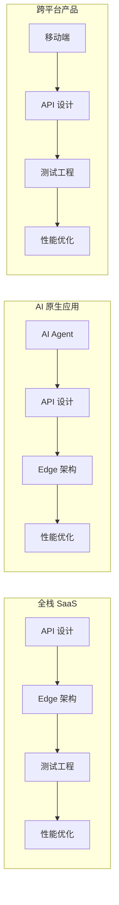
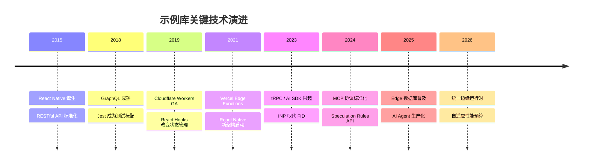

# 🧭 示例总览

> 实践是检验真理的唯一标准。本示例库将 JavaScript / TypeScript 生态的理论知识转化为可运行、可度量、可复用的工程实践，覆盖从移动端到云端、从 AI Agent 到性能优化的完整技术 spectrum。

网站示例库按照技术领域划分为六大核心分类。每个分类均包含完整的实战指南、可运行代码模板、与理论专题的映射关系，以及生产级 checklist。建议读者根据自身技术栈与学习目标，选择对应的分类深入探索，或按照推荐的学习路径循序渐进。

---

## 示例分类导航

| 分类 | 描述 | 核心文件 |
|------|------|---------|
| [📱 移动端开发](#移动端开发示例) | React Native / Expo 跨平台实战 | [查看](./mobile/) |
| [🤖 AI Agent](#ai-agent-开发示例) | LLM 编排框架与 MCP 协议集成 | [查看](./ai-agent/) |
| [🔌 API 设计](#api-设计示例) | REST / GraphQL / gRPC / tRPC 对比 | [查看](./api-design/) |
| [🌍 Edge 架构](#edge-架构示例) | Cloudflare / Vercel / Deno 边缘部署 | [查看](./edge-architecture/) |
| [🧪 测试工程](#测试示例) | 单元测试到 E2E 的完整测试策略 | [查看](./testing/) |
| [⚡ 性能优化](#性能优化示例) | Web Vitals 与全链路性能调优 | [查看](./performance/) |
| [🔒 安全工程](#安全示例) | Web 安全、认证授权与 Vue 应用安全加固 | [查看](./security/) |
| [🗄️ 数据库工程](#数据库示例) | Schema 设计、ORM 实践与边缘数据库部署 | [查看](./database/) |

---

## 推荐学习路径

根据你的当前技能水平与职业方向，我们提供三条推荐学习路径：


### 路径选择建议

| 目标角色 | 推荐路径 | 预计周期 | 先修知识 |
|---------|---------|---------|---------|
| 全栈工程师 | 全栈开发路径 + 测试工程 | 6-8 周 | Node.js、TypeScript 基础 |
| AI 应用工程师 | 智能应用路径 + API 设计 | 4-6 周 | LLM 基础概念、TypeScript |
| 移动端工程师 | 跨平台开发路径 + 性能优化 | 6-8 周 | React 基础、移动端原生概念 |
| 基础设施工程师 | Edge 架构 + 性能优化 + 测试工程 | 4-6 周 | 网络基础、HTTP 协议 |

---

## 📱 移动端开发示例

移动端开发示例覆盖 React Native 与 Expo 生态的完整实战链路，从环境搭建到生产部署，提供可直接运行的项目模板与最佳实践总结。

**核心内容包括**：React Native 新架构（Fabric + TurboModules）深度解析、Expo Router 文件系统路由、跨平台代码共享策略（Monorepo + Turborepo）、移动端性能优化（启动时间、帧率、包体积）、原生模块开发（Expo Modules API / JSI）以及 CI/CD 自动化构建与发布（EAS Build / EAS Update）。

每个示例均包含 iOS 与 Android 双平台的差异说明，并提供常见陷阱的速查表。如果你是移动端开发新手，建议从 [React Native + Expo 环境搭建](./mobile/react-native-expo-setup.md) 开始；如果你已有基础，可直接深入 [移动端性能优化](./mobile/mobile-performance-optimization.md) 或 [原生模块开发](./mobile/mobile-native-modules.md)。

**快速链接**： [进入移动端示例](./mobile/) | [移动端新架构解析](./mobile/react-native-new-architecture.md) | [跨平台共享代码](./mobile/cross-platform-shared-code.md)

---

## 🤖 AI Agent 开发示例

AI Agent 示例库聚焦大语言模型驱动的自治智能体工程实践，涵盖从单 Agent 工具调用到多 Agent 协作网络的完整技术栈。

**核心内容包括**：Agent 核心架构设计（感知-推理-行动循环）、主流编排框架对比（LangChain / LangGraph、Vercel AI SDK、Mastra）、MCP（Model Context Protocol）协议集成与自定义 Server 开发、记忆管理策略（短期 / 长期 / 向量检索）、规划器模式（ReAct、Plan-and-Execute、Multi-Agent Collaboration）以及生产级安全与可观测性方案。

所有示例均以 TypeScript 严格模式编写，强调类型安全的端到端链路。初学者推荐从 [从零构建研究型 Agent 教程](./ai-agent/tutorial.md) 入手；有经验的开发者可直接参考 [Agent 架构设计模式](./ai-agent/architecture.md) 或 [MCP 集成指南](./ai-agent/mcp-integration.md)。

**快速链接**： [进入 AI Agent 示例](./ai-agent/) | [架构设计模式](./ai-agent/architecture.md) | [MCP 协议集成](./ai-agent/mcp-integration.md)

---

## 🔌 API 设计示例

API 设计示例提供四种主流 API 风格（RESTful、GraphQL、gRPC、tRPC）的实战对比与选型指南，覆盖从接口契约到生产部署的全链路。

**核心内容包括**：RESTful 资源命名与版本化策略、GraphQL Schema 设计与 N+1 问题治理（DataLoader）、gRPC 四种通信模式（Unary / Streaming / Bidirectional）与 Protocol Buffers 实践、tRPC 端到端类型安全实现以及 API 选型决策树。文档还包含 AI Native API 设计（Function Calling、Streaming Response）的前瞻内容。

无论你是设计公共 Open API 还是内部微服务接口，本示例均提供可落地的契约模板与安全规范。推荐阅读 [REST vs GraphQL vs gRPC vs tRPC 实战对比](./api-design/rest-graphql-grpc-comparison.md) 作为起点。

**快速链接**： [进入 API 设计示例](./api-design/) | [四大风格对比](./api-design/rest-graphql-grpc-comparison.md)

---

## 🌍 Edge 架构示例

Edge 架构示例演示如何从传统中心化架构演进为 Edge-First 部署，覆盖 Cloudflare Workers、Vercel Edge、Deno Deploy 等主流边缘计算平台。

**核心内容包括**：V8 Isolate 与传统容器的对比分析、边缘缓存策略设计、全球状态同步（最终一致性与强一致性）、Hono 框架在 Cloudflare Workers 上的实践、Next.js Edge Runtime 与 Middleware 开发、边缘数据库（D1、Turso、Deno KV）选型以及 Zero Trust 安全网关架构。

示例特别强调成本优化与全球延迟的权衡，每个平台均标注免费额度与付费模式。如果你希望将应用部署到全球边缘节点，推荐从 [Edge-First 部署实战](./edge-architecture/edge-first-deployment.md) 开始。

**快速链接**： [进入 Edge 架构示例](./edge-architecture/) | [Edge-First 部署实战](./edge-architecture/edge-first-deployment.md)

---

## 🧪 测试示例

测试示例库构建从代码质量到交付信心的完整实践路径，覆盖 JavaScript / TypeScript 生态的全测试金字塔。

**核心内容包括**：Vitest / Jest / Node Test Runner 框架选型与最佳实践、单元测试 AAA 模式与 Mock 策略、集成测试的数据库隔离方案、Playwright E2E 测试的 Page Object 模式、视觉回归与可访问性测试（Axe）、变异测试（Stryker）验证测试有效性以及完整的 CI/CD 测试流水线设计。

示例遵循“测试即文档”的理念，每个测试用例清晰表达被测代码的契约与边界。推荐阅读 [E2E 测试实战：Playwright 完整指南](./testing/e2e-testing-playwright.md) 掌握当前业界最先进的端到端测试实践。

**快速链接**： [进入测试示例](./testing/) | [E2E 测试 Playwright 指南](./testing/e2e-testing-playwright.md)

---

## ⚡ 性能优化示例

性能优化示例提供从度量、诊断到优化的完整性能工程实践，所有方案均附带可量化的基准数据。

**核心内容包括**：Google Web Vitals 三大核心指标（LCP、INP、CLS）的度量与优化、渲染性能调优（合成层、CSS Containment、虚拟列表）、打包优化（Tree Shaking、Code Splitting、Module Federation）、内存管理（泄漏诊断、WeakRef、FinalizationRegistry）、网络加速（HTTP/2、预加载、Service Worker 缓存）以及 V8 引擎运行时调优技巧。

本分类特别强调“度量先行”的原则，所有优化建议均基于 Lighthouse、WebPageTest 或真实 RUM 数据。推荐从 [Web Vitals 优化实战完整指南](./performance/web-vitals-optimization.md) 开始建立系统的性能优化方法论。

**快速链接**： [进入性能优化示例](./performance/) | [Web Vitals 优化指南](./performance/web-vitals-optimization.md)

---

## 🔒 安全示例

安全示例聚焦 JavaScript / TypeScript 生态中的纵深防御工程实践，覆盖 Web 安全基础（XSS、CSRF、CSP）、认证授权（OAuth 2.1、RBAC）、输入验证与加密实践，以及 Vue 应用特有的模板注入防护和 Props 安全策略。所有示例均遵循 OWASP 指南，提供可运行的防御代码和审计 checklist，帮助开发者在编码阶段建立安全质量门禁。

**快速链接**： [进入安全示例](./security/) | [Web 安全基础指南](./security/web-security-fundamentals.md)

---

## 🗄️ 数据库示例

数据库示例提供从 Schema 设计到边缘部署的完整数据层实战指南，涵盖 Prisma / Drizzle ORM 的类型安全实践、查询优化与索引策略、事务与并发控制，以及 Turso / Cloudflare D1 等边缘数据库的 Serverless 部署方案。每个示例均展示 TypeScript 严格模式下的端到端数据流，并与 Vue 前端的数据层安全深度结合。

**快速链接**： [进入数据库示例](./database/) | [Schema 设计原则](./database/schema-design-principles.md)

---

## 跨分类技术关联

许多现代项目需要综合运用多个分类的技术。以下是典型的跨分类组合场景：



### 典型组合场景

| 项目类型 | 涉及分类 | 关键集成点 |
|---------|---------|-----------|
| **AI 驱动的 SaaS 平台** | AI Agent + API 设计 + Edge 架构 | LLM 编排通过 tRPC / gRPC 暴露 API，Agent 推理部署到 Edge Function |
| **跨平台电商应用** | 移动端 + 测试工程 + 性能优化 | React Native 共享业务逻辑，Playwright E2E 守护购物流程，LCP 优化商品详情页 |
| **实时协作工具** | Edge 架构 + API 架构 + 性能优化 | WebSocket 边缘部署，gRPC 内部通信，INP 优化编辑器交互响应 |
| **智能客服系统** | AI Agent + 测试工程 + API 设计 | ReAct Agent 处理用户意图，Contract Test 验证 LLM 接口契约，Mutation Test 保障测试质量 |

---

## 示例库使用指南

### 如何高效使用本示例库

1. **诊断当前需求**：明确你是要解决具体问题（如“如何优化 LCP”）还是系统学习某个领域
2. **阅读对应分类首页**：每个分类的 `index.md` 提供完整的学习路径与知识地图
3. **运行示例代码**：所有示例设计为可独立运行，建议克隆后本地执行并修改参数观察效果
4. **对照理论专题**：示例与网站的理论专题形成双轨映射，实践后回归理论可获得更深层次的理解
5. **参与贡献**：如果你发现了更优的实践方案，欢迎按照贡献指南提交改进

### 环境要求

大多数示例需要以下基础环境：

- Node.js >= 20 LTS（推荐通过 [fnm](https://github.com/Schniz/fnm) 或 [nvm](https://github.com/nvm-sh/nvm) 管理版本）
- TypeScript >= 5.0，启用 `strict: true`
- pnpm >= 9 或 npm >= 10
- 部分示例需要 Docker（数据库、Redis 等依赖）

### 快速启动模板

```bash
# 克隆仓库后进入对应示例目录
cd website/examples/<category>/<specific-example>

# 安装依赖
pnpm install

# 运行测试或示例
pnpm test
pnpm dev
```

---

## 与理论专题的全局映射

示例库与网站的理论专题深度关联，形成“理论指导实践，实践验证理论”的闭环：

| 示例分类 | 主要映射理论专题 |
|---------|----------------|
| [移动端开发](./mobile/) | [框架模型理论](/framework-models/)、[模块系统](/module-system/)、[性能工程](/performance-engineering/) |
| [AI Agent](./ai-agent/) | [编程范式](/programming-paradigms/)、[TypeScript 类型系统](/typescript-type-system/)、[模块系统](/module-system/) |
| [API 设计](./api-design/) | [应用设计理论](/application-design/)、[模块系统](/module-system/)、[编程范式](/programming-paradigms/) |
| [Edge 架构](./edge-architecture/) | [应用设计理论](/application-design/)、[性能工程](/performance-engineering/)、[状态管理](/state-management/) |
| [测试工程](./testing/) | [测试工程](/testing-engineering/)（理论同名专题） |
| [性能优化](./performance/) | [性能工程](/performance-engineering/)（理论同名专题） |
| [安全工程](./security/) | [应用设计理论](/application-design/) — 安全架构、威胁建模 |
| [数据库工程](./database/) | [数据库与ORM](/database-orm/) — 关系模型、ORM 设计模式 |

---

## 技术演进总览

JavaScript / TypeScript 生态正处于高速演进期，各分类的技术栈也在持续迭代。以下时间表展示了关键技术的里程碑：



### 各分类前沿趋势

| 分类 | 2025 关键趋势 | 2026 展望 |
|------|-------------|----------|
| 移动端 | Bridgeless React Native 默认、Expo Router v4 | 原生 WebGPU、AI 辅助 UI 生成 |
| AI Agent | MCP 生态爆发、多 Agent 协作标准 | 自主测试 Agent、边缘推理优化 |
| API 设计 | AI Native API、统一网关 | 自动契约生成、语义缓存 |
| Edge 架构 | WinterCG 标准化、D1/Turso 成熟 | 边缘 LLM 推理、WASM 组件 |
| 测试工程 | AI 辅助用例生成、自修复选择器 | 自主探索性测试、智能回归 |
| 性能优化 | Speculation Rules、View Transitions | 自适应加载、AI 性能诊断 |

---

## 质量门禁与标准

本示例库所有内容均遵循统一的质量标准：

- **可运行性**：每个代码片段经过实际运行验证，禁止伪代码
- **类型安全**：所有示例使用 TypeScript 严格模式
- **版本标注**：明确标注框架、运行时与工具的兼容版本
- **度量数据**：性能示例包含优化前后的量化对比，测试示例包含覆盖率目标
- **安全审查**：涉及外部调用、用户输入的示例包含安全校验与防御措施

---

## 贡献指南

欢迎为示例库贡献新的实战案例或改进现有内容。贡献前请确认：

1. 你的示例填补了现有分类的空白，或提供了显著更优的实践方案
2. 代码遵循 TypeScript 严格模式，包含完整的类型定义
3. 提供运行步骤说明与预期的输出结果
4. 与相关理论专题建立映射关系
5. 遵循 Vue/VitePress 安全规范（不在 Markdown 中直接使用未转义的 HTML 标签）

---

## 参考资源

### 社区与生态系统

- [TypeScript 官方文档](https://www.typescriptlang.org/docs/) — TypeScript 语言规范与手册
- [Node.js 文档](https://nodejs.org/docs/latest/api/) — JavaScript 运行时 API 参考
- [MDN Web Docs](https://developer.mozilla.org/) — Web 技术的权威参考文档
- [web.dev](https://web.dev/) — Google Chrome 团队的最佳实践指南

### 经典著作

- *The Pragmatic Programmer* — Andrew Hunt, David Thomas. 1999. 程序员修养的经典之作，其中的“ tracer bullet ”与“ prototype ”理念与本示例库的渐进式实践高度契合。
- *Clean Code* — Robert C. Martin. 2008. 代码整洁之道，强调测试驱动与可维护性的核心原则。
- *Designing Data-Intensive Applications* — Martin Kleppmann. 2017. 数据密集型应用设计，为 API 设计、Edge 架构与性能优化提供底层理论支撑。

### 在线学习平台

- [Frontend Masters](https://frontendmasters.com/) — 前端与全栈深度课程
- [Epic Web Dev](https://www.epicweb.dev/) — Kent C. Dodds 的现代 Web 开发课程
- [Total TypeScript](https://www.totaltypescript.com/) — Matt Pocock 的 TypeScript 精通课程
