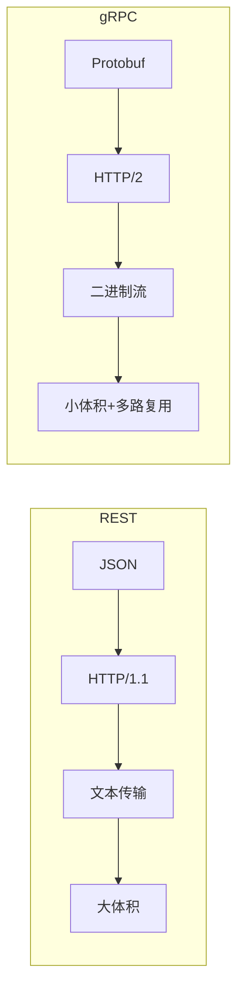
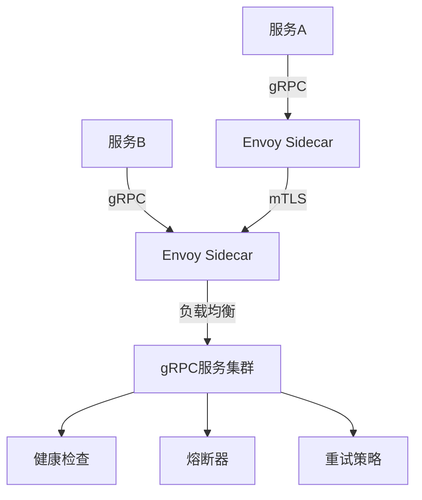

# gRPC 服务通信实战

> gRPC 是 Google 开源的高性能 RPC 框架，基于 HTTP/2 和 Protocol Buffers，在微服务架构中提供比 REST 更高效、更类型安全的通信方案。

## gRPC vs REST 对比



| 特性 | REST | gRPC |
|------|------|------|
| 协议 | HTTP/1.1 | HTTP/2 |
| 格式 | JSON | Protobuf（二进制） |
| 性能 | 中等 | 高（5-10x） |
| 类型安全 | 无 | 强类型 |
| 流支持 | 有限（SSE） | 原生双向流 |
| 浏览器 | 原生支持 | 需 gRPC-Web |
| 调试 | 容易 | 需工具 |

## Protocol Buffers 定义

```protobuf
// proto/ecommerce.proto
syntax = "proto3";

package ecommerce;

// 商品服务
service ProductService &#123;
  // Unary：获取单个商品
  rpc GetProduct(GetProductRequest) returns (Product);

  // Server Streaming：获取商品列表（流式返回）
  rpc ListProducts(ListProductsRequest) returns (stream Product);

  // Client Streaming：批量上传商品
  rpc BatchCreateProducts(stream CreateProductRequest) returns (BatchResult);

  // Bidirectional Streaming：实时价格更新
  rpc SubscribePriceUpdates(stream PriceSubscription) returns (stream PriceUpdate);
&#125;

message Product &#123;
  string id = 1;
  string name = 2;
  string description = 3;
  double price = 4;
  int32 stock = 5;
  repeated string tags = 6;
&#125;

message GetProductRequest &#123;
  string id = 1;
&#125;

message ListProductsRequest &#123;
  string category = 1;
  int32 page_size = 2;
  string page_token = 3;
&#125;

message CreateProductRequest &#123;
  string name = 1;
  double price = 2;
  int32 stock = 3;
&#125;

message BatchResult &#123;
  int32 created_count = 1;
  repeated string errors = 2;
&#125;

message PriceSubscription &#123;
  repeated string product_ids = 1;
&#125;

message PriceUpdate &#123;
  string product_id = 1;
  double new_price = 2;
  int64 timestamp = 3;
&#125;
```

## TypeScript gRPC 服务端

```typescript
// server.ts
import * as grpc from '@grpc/grpc-js';
import * as protoLoader from '@grpc/proto-loader';
import path from 'path';

const PROTO_PATH = path.join(__dirname, '../proto/ecommerce.proto');

const packageDefinition = protoLoader.loadSync(PROTO_PATH, &#123;
  keepCase: true,
  longs: String,
  enums: String,
  defaults: true,
  oneofs: true,
&#125;);

const proto = grpc.loadPackageDefinition(packageDefinition).ecommerce as any;

// 商品数据存储
const products = new Map&lt;string, any&gt;();

const productService = &#123;
  // Unary
  getProduct: (call: grpc.ServerUnaryCall&lt;any, any&gt;, callback: grpc.sendUnaryData&lt;any&gt;) => &#123;
    const product = products.get(call.request.id);
    if (product) &#123;
      callback(null, product);
    &#125; else &#123;
      callback(&#123; code: grpc.status.NOT_FOUND, message: 'Product not found' &#125; as grpc.ServiceError, null);
    &#125;
  &#125;,

  // Server Streaming
  listProducts: (call: grpc.ServerWritableStream&lt;any, any&gt;) => &#123;
    const category = call.request.category;
    for (const [, product] of products) &#123;
      if (product.category === category) &#123;
        call.write(product);
      &#125;
    &#125;
    call.end();
  &#125;,

  // Client Streaming
  batchCreateProducts: (call: grpc.ServerReadableStream&lt;any, any&gt;, callback: grpc.sendUnaryData&lt;any&gt;) => &#123;
    const errors: string[] = [];
    let count = 0;

    call.on('data', (request: any) => &#123;
      try &#123;
        const id = `prod_$&#123;Date.now()&#125;_&#123;count&#125;`;
        products.set(id, &#123; id, ...request &#125;);
        count++;
      &#125; catch (e) &#123;
        errors.push(e.message);
      &#125;
    &#125;);

    call.on('end', () => &#123;
      callback(null, &#123; created_count: count, errors &#125;);
    &#125;);
  &#125;,

  // Bidirectional Streaming
  subscribePriceUpdates: (call: grpc.ServerDuplexStream&lt;any, any&gt;) => &#123;
    const subscribedIds = new Set&lt;string&gt;();

    call.on('data', (subscription: any) => &#123;
      subscription.product_ids.forEach((id: string) => subscribedIds.add(id));
      call.write(&#123;
        product_id: id,
        new_price: products.get(id)?.price ?? 0,
        timestamp: Date.now(),
      &#125;);
    &#125;);

    // 模拟价格更新推送
    const interval = setInterval(() => &#123;
      for (const id of subscribedIds) &#123;
        const product = products.get(id);
        if (product) &#123;
          call.write(&#123;
            product_id: id,
            new_price: product.price * (0.9 + Math.random() * 0.2),
            timestamp: Date.now(),
          &#125;);
        &#125;
      &#125;
    &#125;, 5000);

    call.on('end', () => &#123;
      clearInterval(interval);
    &#125;);
  &#125;,
&#125;;

// 启动服务器
const server = new grpc.Server();
server.addService(proto.ProductService.service, productService);
server.bindAsync('0.0.0.0:50051', grpc.ServerCredentials.createInsecure(), () => &#123;
  console.log('gRPC server running on port 50051');
  server.start();
&#125;);
```

## TypeScript gRPC 客户端

```typescript
// client.ts
import * as grpc from '@grpc/grpc-js';
import * as protoLoader from '@grpc/proto-loader';
import path from 'path';

const PROTO_PATH = path.join(__dirname, '../proto/ecommerce.proto');
const packageDefinition = protoLoader.loadSync(PROTO_PATH);
const proto = grpc.loadPackageDefinition(packageDefinition).ecommerce as any;

const client = new proto.ProductService(
  'localhost:50051',
  grpc.credentials.createInsecure()
);

// Unary 调用
async function getProduct(id: string) &#123;
  return new Promise((resolve, reject) => &#123;
    client.getProduct(&#123; id &#125;, (err: any, response: any) => &#123;
      if (err) reject(err);
      else resolve(response);
    &#125;);
  &#125;);
&#125;

// Server Streaming
function listProducts(category: string) &#123;
  const stream = client.listProducts(&#123; category &#125;);
  stream.on('data', (product: any) => &#123;
    console.log('Received:', product.name);
  &#125;);
  stream.on('end', () => &#123;
    console.log('Stream ended');
  &#125;);
&#125;

// Client Streaming
async function batchCreateProducts(products: any[]) &#123;
  const stream = client.batchCreateProducts((err: any, result: any) => &#123;
    if (err) console.error(err);
    else console.log('Created:', result.created_count);
  &#125;);

  for (const product of products) &#123;
    stream.write(product);
  &#125;
  stream.end();
&#125;
```

## 拦截器与元数据

```typescript
// 认证拦截器
const authInterceptor = (options: any, nextCall: any) => &#123;
  return new grpc.InterceptingCall(nextCall(options), &#123;
    start: (metadata, listener, next) => &#123;
      metadata.set('authorization', `Bearer $&#123;getToken()&#125;`);
      next(metadata, listener);
    &#125;,
  &#125;);
&#125;;

const client = new proto.ProductService('localhost:50051', grpc.credentials.createInsecure(), &#123;
  interceptors: [authInterceptor],
&#125;);

// 服务端拦截器
server.addService(proto.ProductService.service, productService, &#123;
  interceptors: [loggingInterceptor, authInterceptor],
&#125;);
```

## 错误处理

| gRPC 状态码 | HTTP 对应 | 使用场景 |
|------------|----------|---------|
| OK (0) | 200 | 成功 |
| CANCELLED (1) | 499 | 客户端取消 |
| INVALID_ARGUMENT (3) | 400 | 参数错误 |
| NOT_FOUND (5) | 404 | 资源不存在 |
| ALREADY_EXISTS (6) | 409 | 资源已存在 |
| PERMISSION_DENIED (7) | 403 | 权限不足 |
| UNAUTHENTICATED (16) | 401 | 未认证 |
| UNAVAILABLE (14) | 503 | 服务不可用 |
| DEADLINE_EXCEEDED (4) | 504 | 超时 |

## 服务网格集成



## 参考资源

| 资源 | 链接 |
|------|------|
| gRPC 官方文档 | <https://grpc.io/docs/> |
| Protocol Buffers | <https://protobuf.dev/> |
| gRPC-Web | <https://github.com/grpc/grpc-web> |
| Envoy Proxy | <https://www.envoyproxy.io/> |

---

 [← 返回微服务示例首页](./)
