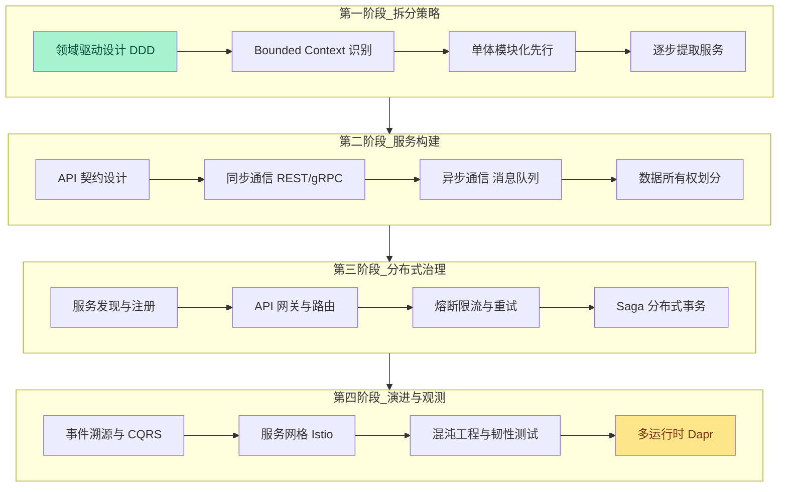
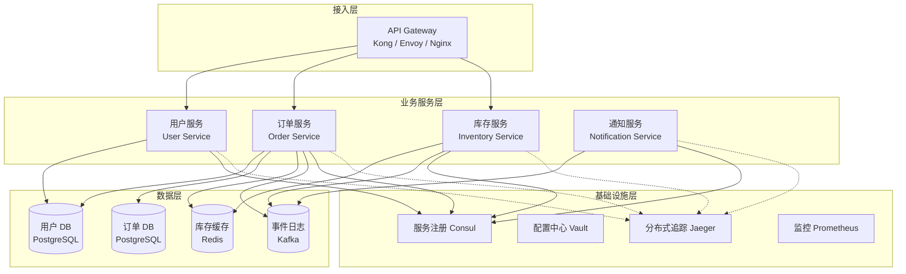
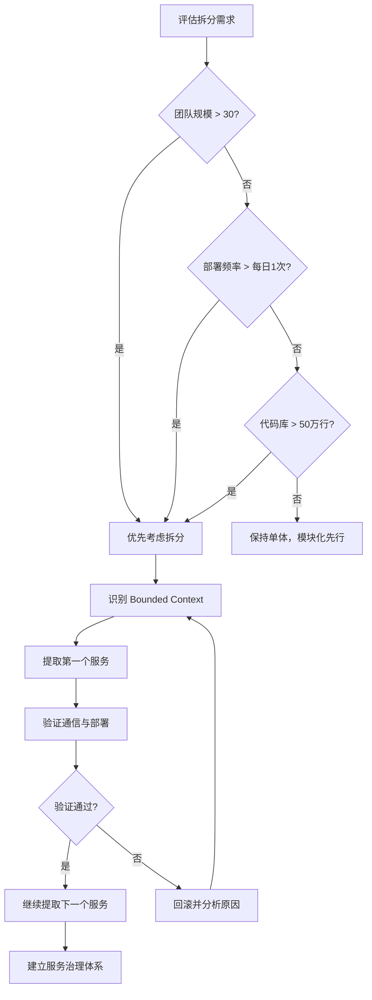
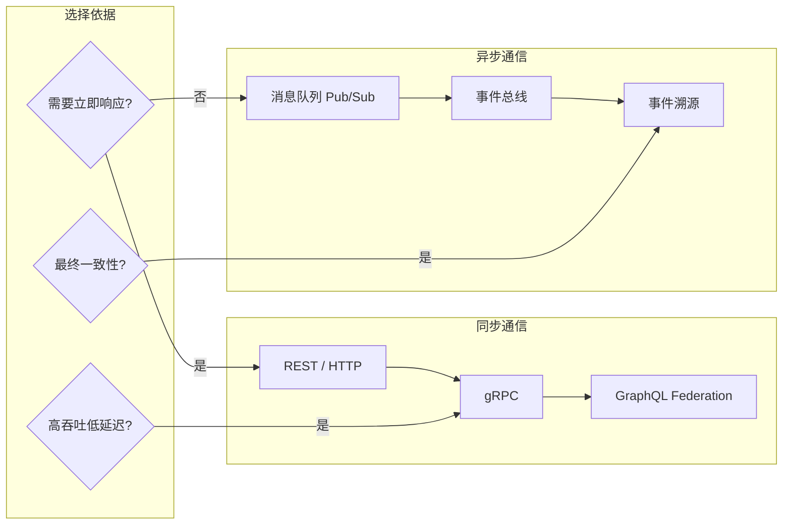
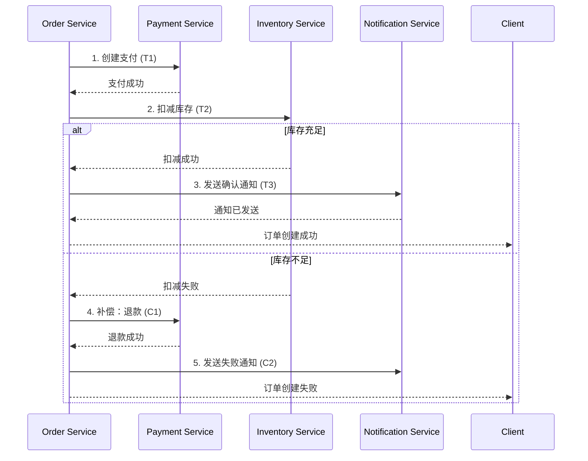
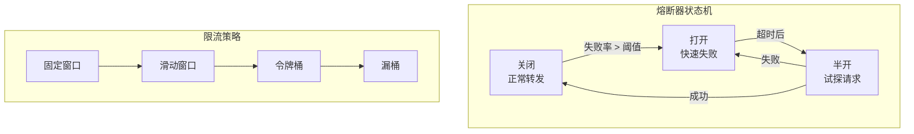

# 🏗️ 微服务示例

> 微服务不是银弹，而是一种在组织规模与技术复杂度之间进行权衡的架构风格。本示例库聚焦 JavaScript / TypeScript 生态中的微服务工程实践，从单体拆分策略到分布式系统治理，提供可运行、可观测、可演进的服务架构方案。

随着业务规模的扩展，单体应用不可避免地面临部署耦合、技术栈锁定、团队协作摩擦等问题。微服务架构通过将系统拆分为围绕业务能力组织的小型服务，实现了独立部署、独立扩展与独立技术栈选型。然而，分布式系统也带来了网络延迟、数据一致性、故障传播等新的挑战。本目录提供的示例遵循以下设计原则：

- **业务能力驱动拆分**：服务边界围绕业务领域（DDD Bounded Context）而非技术层（Controller/Service/DAO）划分
- **API 优先契约**：服务间通过 OpenAPI / gRPC / AsyncAPI 显式定义契约，使用 Schema 校验保障兼容性
- **容错设计内置**：每个服务均实现熔断、限流、重试与降级策略，防止故障级联传播
- **可观测性全覆盖**：分布式追踪、结构化日志与业务指标贯穿每个服务调用链路

---

## 学习路径

以下流程图展示了从单体架构到微服务治理的推荐学习顺序。建议按照阶段递进，每个阶段均包含理论映射、服务实现与集成验证三个环节。



### 各阶段关键产出

| 阶段 | 核心技能 | 预期产出 | 验证标准 |
|------|---------|---------|---------|
| **第一阶段** | 掌握 DDD 战略设计，识别限界上下文 | 单体模块化重构方案 | 模块间无循环依赖，编译隔离 |
| **第二阶段** | 设计 REST/gRPC/消息契约，实现服务通信 | 至少 3 个独立服务 | 契约测试通过，Postman / ghz 压测达标 |
| **第三阶段** | 配置服务发现、网关、熔断与 Saga | 完整的本地 K8s 部署 | 单点故障不影响整体可用性 |
| **第四阶段** | 构建事件溯源系统，实施混沌工程 | 可回滚的 Event Store | 故障注入后系统自动恢复 |

---

## 微服务架构全景

### 核心架构模式



### 核心领域速查表

| 领域 | 核心挑战 | 解决方案 | 代表工具 |
|------|---------|---------|---------|
| **服务拆分** | 边界模糊、过度拆分、数据耦合 | DDD Bounded Context、领域事件、绞杀者模式 | EventStorming, Context Mapper |
| **同步通信** | 网络延迟、序列化开销、版本兼容 | REST/OpenAPI, gRPC, GraphQL Federation | Fastify, tRPC, NestJS |
| **异步通信** | 消息丢失、顺序保证、重复消费 | 至少一次投递 + 幂等设计、死信队列 | Kafka, RabbitMQ, NATS |
| **数据一致性** | 分布式事务、最终一致性、 Saga | Saga 编排/编排、事件溯源、CQRS | Temporal, Camunda, Axon |
| **服务治理** | 服务发现、负载均衡、流量控制 | Consul, Envoy, Istio, Linkerd | Istio, Consul Connect |
| **容错设计** | 级联故障、雪崩效应、超时风暴 | 熔断、限流、舱壁隔离、重退避 | opossum, resilience4js, Envoy |
| **可观测性** | 分布式追踪、日志关联、指标聚合 | OpenTelemetry, Jaeger, Prometheus | OTel, Jaeger, Grafana |

---

## 示例目录

| 序号 | 主题 | 文件 | 难度 | 预计时长 |
|------|------|------|------|---------|
| 01 | 领域驱动设计与限界上下文识别 | 查看 | 高级 | 90 min |
| 02 | REST API 契约设计与版本管理 | 查看 | 中级 | 60 min |
| 03 | gRPC 服务间通信实战 | 查看 | 高级 | 75 min |
| 04 | 事件驱动架构与 Kafka 集成 | 查看 | 高级 | 90 min |
| 05 | Saga 分布式事务模式 | 查看 | 专家 | 120 min |
| 06 | API 网关与认证授权 | 查看 | 中级 | 60 min |
| 07 | 服务发现与健康检查 | 查看 | 中级 | 50 min |
| 08 | 熔断限流与重退避策略 | 查看 | 中级 | 60 min |
| 09 | 事件溯源与 CQRS 实现 | 查看 | 专家 | 120 min |
| 10 | 使用 Dapr 构建多运行时微服务 | 查看 | 高级 | 90 min |

> **注意**：部分示例文件正在编写中。当前目录已建立索引框架，示例内容将逐步补充完善。欢迎参考 [微服务架构模式图](/diagrams/microservices-patterns.html) 与 [微服务设计理论](/application-design/05-microservices-design.html) 获取架构设计参考。

---

## 技术栈与工具链

本目录示例涉及的完整微服务技术栈：

| 层级 | 技术选型 | 版本要求 | 用途 |
|------|---------|---------|------|
| **运行时** | Node.js | ≥ 20 LTS | 服务运行时环境 |
| **语言** | TypeScript | ≥ 5.0 | 类型安全的服务开发 |
| **框架** | NestJS / Fastify / Express | ≥ 10 / 4 / 4 | HTTP 服务框架 |
| **RPC** | gRPC + protobuf-ts | ≥ 1.9 | 高性能服务间通信 |
| **消息队列** | Apache Kafka / NATS / RabbitMQ | — | 异步事件传递 |
| **数据库** | PostgreSQL / MongoDB | ≥ 15 / ≥ 6 | 服务私有数据存储 |
| **缓存** | Redis | ≥ 7.0 | 分布式缓存与会话 |
| **网关** | Kong / Envoy / Nginx | — | 流量入口、路由、认证 |
| **服务网格** | Istio / Linkerd | ≥ 1.19 | 流量治理、安全、mTLS |
| **注册中心** | Consul / etcd | — | 服务发现与健康检查 |
| **容器** | Docker + Kubernetes | ≥ 24 / ≥ 1.28 | 容器化与编排 |
| **可观测性** | OpenTelemetry + Jaeger + Prometheus | — | 追踪、日志、指标 |
| **多运行时** | Dapr | ≥ 1.12 | 抽象基础设施关注点 |

---

## 核心实践详解

### 服务拆分决策矩阵

并非所有系统都适合微服务。以下矩阵帮助评估拆分时机：

| 维度 | 保持单体 | 考虑拆分 | 强烈建议拆分 |
|------|---------|---------|------------|
| **团队规模** | < 10 人 | 10-30 人 | > 30 人 |
| **部署频率** | 每周 1 次 | 每周 2-3 次 | 每日多次 |
| **代码库规模** | < 10 万行 | 10-50 万行 | > 50 万行 |
| **业务领域** | 单一领域 | 2-3 个领域 | 多个独立业务线 |
| **技术栈需求** | 统一技术栈 | 部分服务需要特殊运行时 | 多语言、多运行时并存 |
| **运维能力** | 无专职运维 | 小运维团队 | 完善的 SRE 体系 |



### 通信模式选择

微服务间的通信模式主要分为同步与异步两类，各有其适用场景：



| 维度 | REST / HTTP | gRPC | 消息队列 | 事件总线 |
|------|------------|------|---------|---------|
| **协议** | HTTP/1.1, HTTP/2 | HTTP/2 | TCP / 专有协议 | 基于消息队列 |
| **序列化** | JSON | Protobuf | 二进制 / JSON / Avro | 事件信封 |
| **性能** | 中 | 高 | 高（吞吐） | 高（吞吐） |
| **实时性** | 同步 | 同步 | 异步 | 异步 |
| **流式支持** | SSE, WebSocket | 双向流 | 消费者组 | 事件回放 |
| **调试难度** | 低（人类可读） | 中（需解码） | 中 | 高 |
| **最佳场景** | 外部 API, BFF | 服务间高频调用 | 任务队列, 通知 | 领域事件传播 |

### 分布式事务：Saga 模式

在微服务架构中，跨越多个服务的业务操作需要 Saga 模式来保障最终一致性。



**编排式 Saga（Choreography）vs 编排式 Saga（Orchestration）**：

| 特性 | Choreography | Orchestration |
|------|-------------|---------------|
| **协调者** | 无中央协调者，服务通过事件自发响应 | 中央 Saga 协调器编排流程 |
| **耦合度** | 低（仅依赖事件契约） | 中（协调器需了解所有服务） |
| **可观测性** | 较难（事件链分散） | 较高（协调器集中追踪） |
| **复杂度** | 适合简单流程（< 5 步） | 适合复杂流程（≥ 5 步） |
| **回滚逻辑** | 每个服务自行实现补偿 | 协调器统一触发补偿 |
| **代表实现** | Kafka + 消费者组 | Temporal, Camunda, NestJS Saga |

### 容错设计：熔断、限流与舱壁



**Node.js 熔断器实现（opossum）**：

```typescript
import CircuitBreaker from 'opossum';

const options = {
  timeout: 3000,        // 3 秒超时
  errorThresholdPercentage: 50,  // 失败率 > 50% 时熔断
  resetTimeout: 30000,  // 30 秒后尝试半开
  volumeThreshold: 10,  // 至少 10 次请求才开始统计
};

const breaker = new CircuitBreaker(asyncCallToExternalService, options);

breaker.on('open', () => console.warn('熔断器打开'));
breaker.on('halfOpen', () => console.info('熔断器半开，试探中'));
breaker.on('close', () => console.info('熔断器关闭，恢复正常'));

// 使用
const result = await breaker.fire(requestParams);
```

---

## 专题映射

### 与 [应用设计](/application-design/) 的映射

| 本专题示例 | 应用设计专题 | 关联深度 |
|-----------|------------|---------|
| 领域驱动设计与限界上下文 | [微服务设计](/application-design/05-microservices-design.html) | 服务边界划分、聚合根设计、领域事件 |
| 事件驱动架构 | [事件驱动架构](/application-design/06-event-driven-architecture.html) | 事件风暴、事件溯源、CQRS |
| 数据管理策略 | [数据管理模式](/application-design/08-data-management-patterns.html) | 数据库 per Service、Saga、API 组合 |
| 安全设计 | [安全设计](/application-design/09-security-by-design.html) | 零信任网络、mTLS、服务间认证 |
| 可观测性体系 | [可观测性设计](/application-design/10-observability-design.html) | 分布式追踪、SLI/SLO、告警策略 |
| API 设计 | [API 设计模式](/application-design/07-api-design-patterns.html) | BFF、API 网关、版本管理 |
| 分层架构 | [分层架构](/application-design/02-layered-architecture.html) | 六边形架构、洋葱架构、清晰架构 |
| 演进式架构 | [演进式架构](/application-design/12-evolutionary-architecture.html) | 绞杀者模式、分支 by 抽象、特性开关 |

### 与 [架构图](/diagrams/) 的映射

| 本专题示例 | 架构图专题 | 关联深度 |
|-----------|----------|---------|
| 微服务通信模式 | [微服务架构模式](/diagrams/microservices-patterns.html) | 网关模式、聚合器、代理模式 |
| 事件驱动流程 | [事件驱动架构图](/diagrams/) | 事件流、Saga 流程、CQRS 数据流 |
| 部署拓扑 | [CI/CD 流水线图](/diagrams/ci-cd-pipeline.html) | 多服务部署、蓝绿发布、金丝雀 |

### 与 [分类目录](/categories/) 的映射

| 本专题示例 | 分类目录 | 关联深度 |
|-----------|---------|---------|
| 后端框架选型 | [后端框架](/categories/backend-frameworks.html) | NestJS, Fastify, Express, tRPC |
| 实时通信 | [实时通信](/categories/real-time-communication.html) | WebSocket, SSE, gRPC 双向流 |
| 数据库与 ORM | [数据库 ORM](/categories/orm-database.html) | Prisma, TypeORM, MikroORM |
| 部署托管 | [部署托管](/categories/deployment-hosting.html) | K8s, Docker, Serverless |

---

## 常见问题速查

### Q1: 微服务拆分过细会带来哪些问题？

过度拆分（Nano-services）会导致：

1. **运维复杂度爆炸**：服务数量从 10 个增长到 100 个，监控、日志、配置管理成本呈指数上升。
2. **分布式事务频繁**：原本一次本地事务可完成的操作，现在需要跨多个服务的 Saga。
3. **网络延迟累积**：一次前端请求可能触发 10+ 次服务间调用，总延迟不可接受。
4. **团队协作摩擦**：服务边界过细导致每个团队负责过多服务，上下文切换成本高。

**建议**：服务数量与团队数量保持大致 1:1 到 1:2 的比例，单个服务代码量控制在 1-5 万行。

### Q2: 如何选择同步通信与异步通信？

- **同步通信（REST/gRPC）**：适用于需要立即获得结果、调用链路短（≤ 3 跳）、一致性要求高的场景。缺点是调用方与被调用方强耦合，被调用方故障会直接影响调用方。
- **异步通信（消息队列）**：适用于可接受最终一致性、调用链路长、需要削峰填谷的场景。缺点是系统复杂度增加，需要处理消息丢失、重复消费、顺序保证等问题。

**混合策略**：对外 API 使用 REST（人类友好），服务间高频调用使用 gRPC（高性能），领域事件传播使用消息队列（解耦）。

### Q3: Node.js 微服务如何处理 CPU 密集型任务？

Node.js 的单线程事件循环不适合 CPU 密集型操作（如复杂计算、图像处理、PDF 生成）。解决方案：

1. **Worker Threads**：将 CPU 密集型任务 offload 到 Worker Thread，避免阻塞主线程的事件循环。
2. **独立服务**：将 CPU 密集型任务拆分为独立的微服务，使用 Rust / Go 等更适合计算的语言实现。
3. **消息队列**：前端服务将任务投递到队列，由专门的 Worker 服务异步处理。

### Q4: 微服务的数据库应该如何设计？

遵循 **Database per Service** 原则：

1. **数据私有性**：每个服务拥有独立的数据库，其他服务只能通过 API 访问数据，禁止直接访问数据库。
2. **技术异构性**：不同服务可根据需求选择最适合的数据库类型（关系型、文档型、图数据库、时序数据库）。
3. **数据同步**：跨服务的数据查询通过 API 组合（API Composition）或事件驱动的物化视图（CQRS）实现。
4. **避免共享数据库**：共享数据库是微服务反模式，会导致服务间隐式耦合、 schema 变更冲突。

---

## 参考资源

### 官方文档

- [NestJS 官方文档](https://docs.nestjs.com/) — Node.js 微服务框架
- [Fastify 官方文档](https://fastify.dev/) — 高性能 HTTP 框架
- [gRPC 官方文档](https://grpc.io/docs/) — 高性能 RPC 框架
- [Apache Kafka 官方文档](https://kafka.apache.org/documentation/) — 分布式流平台
- [Dapr 官方文档](https://docs.dapr.io/) — 分布式应用运行时
- [Istio 官方文档](https://istio.io/latest/docs/) — 服务网格
- [Temporal 官方文档](https://docs.temporal.io/) — 工作流编排平台

### 经典书籍

- *Building Microservices* — Sam Newman（微服务架构圣经）
- *Microservices Patterns* — Chris Richardson（Saga、CQRS、API Gateway 模式详解）
- *Domain-Driven Design* — Eric Evans（DDD 战略与战术设计）
- *Implementing Domain-Driven Design* — Vaughn Vernon
- *Release It!* — Michael T. Nygard（容错设计与生产稳定性）

### 社区与工具

- [microservices.io](https://microservices.io/) — Chris Richardson 的微服务模式库
- [Dapr Samples](https://github.com/dapr/samples) — Dapr 官方示例集合
- [Temporal TypeScript SDK](https://github.com/temporalio/sdk-typescript) — TypeScript 工作流 SDK
- [opossum](https://github.com/nodeshift/opossum) — Node.js 熔断器库
- [Pact](https://pact.io/) — 消费者驱动的契约测试框架

---

> 💡 **贡献提示**：如果你希望补充新的微服务示例（如 GraphQL Federation 网关实现、WebAssembly 微服务、Serverless 函数编排等），请参考 CONTRIBUTING.md 提交 PR。每个新增示例应包含完整的架构图、服务代码、部署清单与集成测试。
