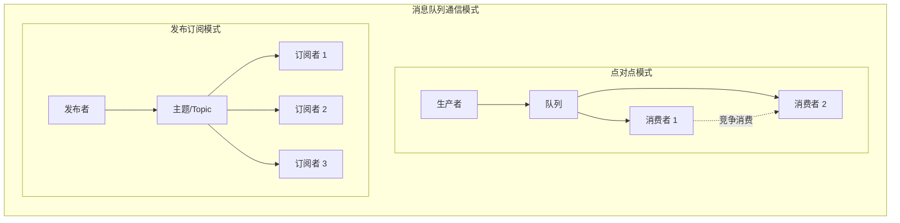
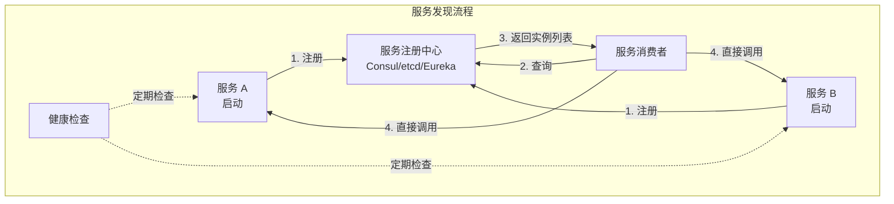
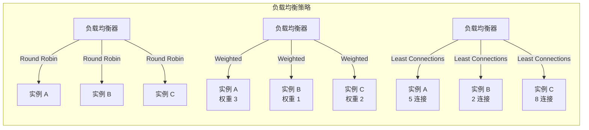
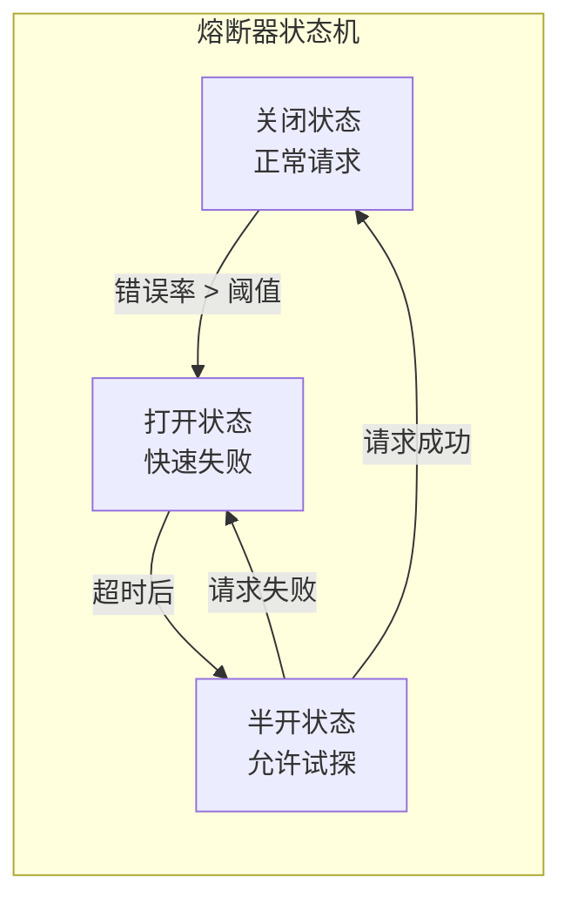
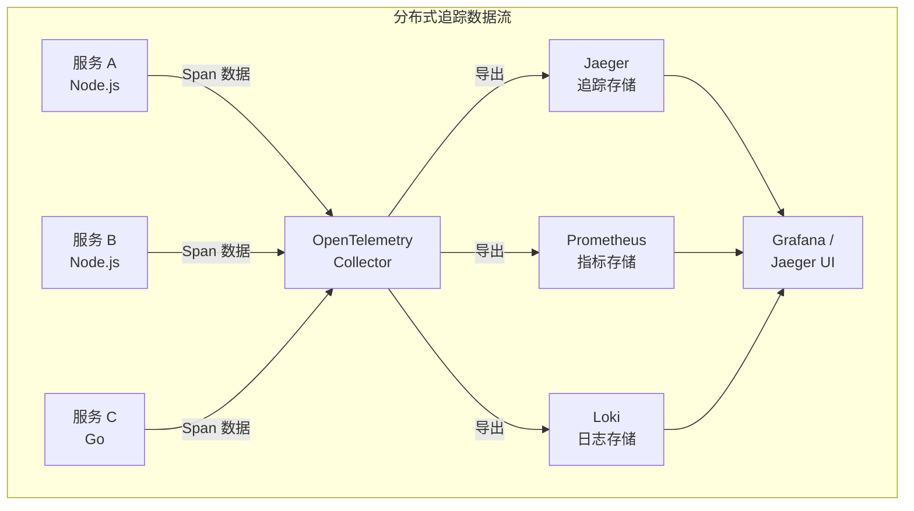
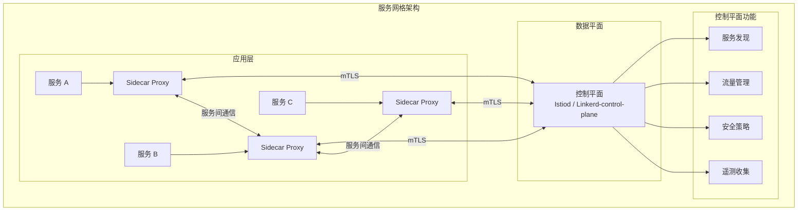
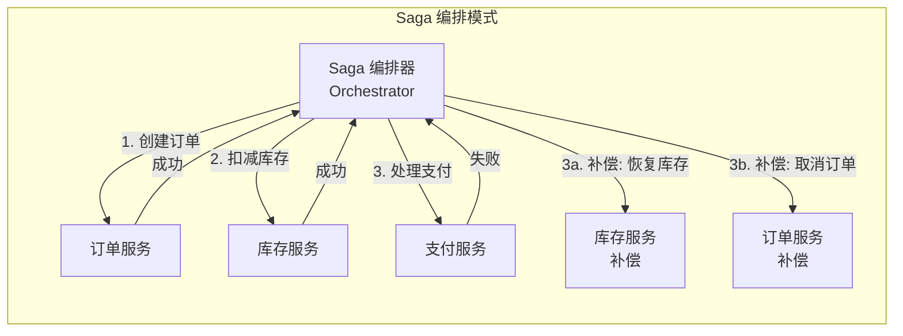
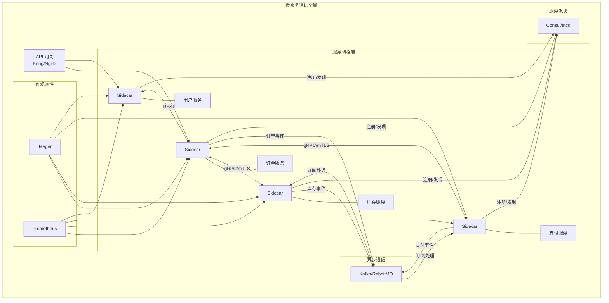

# 微服务通信与服务网格

在现代化的云原生架构中，微服务已成为构建可扩展、可维护系统的首选模式。JavaScript/TypeScript 生态凭借其丰富的运行时（Node.js、Deno、Bun）和框架生态（NestJS、Fastify、Express），在微服务领域占据重要地位。然而，微服务架构的核心挑战不在于服务的拆分，而在于服务间高效、可靠、可观测的通信。本章将深入探讨微服务通信的完整技术栈，从基础的同步通信协议到高级的服务网格与分布式事务模式。

## 概述与架构背景

微服务架构将单体应用拆分为一组小型、自治的服务，每个服务围绕特定的业务能力构建。这种拆分带来了独立部署、技术异构和团队自治的优势，但同时也引入了分布式系统的固有复杂性：网络延迟、部分故障、数据一致性、服务发现与负载均衡等[^1]。

本章将系统性地探讨以下主题：

- **通信协议对比**：REST、GraphQL、gRPC 与消息队列的适用场景
- **服务发现**：Consul、etcd 与 Kubernetes DNS 的实现机制
- **流量管理**：负载均衡算法与流量分配策略
- **韧性模式**：熔断、重试、超时与舱壁隔离
- **可观测性**：OpenTelemetry 与 Jaeger 在分布式追踪中的应用
- **服务网格**：Istio 与 Linkerd 的架构设计与落地实践
- **分布式事务**：Saga 模式的实现策略

> **专题映射**：本示例与 [应用设计](/application-design/) 专题紧密关联，特别是其中关于分布式系统架构、通信拓扑设计及容错机制的讨论。

## 通信协议深度对比

### REST API 设计

REST（Representational State Transfer）是微服务间通信最广泛采用的架构风格。其基于 HTTP 协议，利用标准的 HTTP 方法（GET、POST、PUT、DELETE）操作资源。

**REST 设计原则**：

```typescript
// interfaces/user-api.ts
interface User &#123;
  id: string;
  email: string;
  name: string;
  createdAt: Date;
&#125;

// 资源路径设计遵循 RESTful 规范
interface UserAPI &#123;
  // GET /users?page=1&limit=20
  listUsers(params: PaginationParams): Promise<PaginatedResponse<User>>;

  // GET /users/:id
  getUser(id: string): Promise<User>;

  // POST /users
  createUser(data: CreateUserDTO): Promise<User>;

  // PUT /users/:id
  updateUser(id: string, data: UpdateUserDTO): Promise<User>;

  // DELETE /users/:id
  deleteUser(id: string): Promise<void>;
&#125;
```

**REST 的优势与局限**：

| 维度 | 优势 | 局限 |
|------|------|------|
| 可调试性 | HTTP 工具（curl、Postman）直接可用 | 频繁的网络往返导致延迟累积 |
| 缓存 | 利用 HTTP 缓存头实现 | 过度获取（Over-fetching）与获取不足（Under-fetching） |
| 生态 | 成熟的中间件、负载均衡、防火墙支持 | 版本管理复杂（URL/Header/Content-Type） |
|  human-readable | JSON 格式易于阅读 | 序列化开销较大 |

### gRPC 高性能通信

gRPC 是由 Google 开源的高性能 RPC 框架，基于 HTTP/2 和 Protocol Buffers。对于内部服务间的高频通信，gRPC 提供了显著的性能优势[^2]。

**Protocol Buffers 定义**：

```protobuf
// proto/user.proto
syntax = "proto3";
package userservice;

service UserService &#123;
  rpc GetUser(GetUserRequest) returns (User);
  rpc ListUsers(ListUsersRequest) returns (stream User);
  rpc CreateUser(CreateUserRequest) returns (User);
  rpc UpdateUser(UpdateUserRequest) returns (User);
  rpc DeleteUser(DeleteUserRequest) returns (DeleteUserResponse);
&#125;

message User &#123;
  string id = 1;
  string email = 2;
  string name = 3;
  string created_at = 4;
&#125;

message GetUserRequest &#123;
  string id = 1;
&#125;

message ListUsersRequest &#123;
  int32 page = 1;
  int32 limit = 2;
&#125;

message CreateUserRequest &#123;
  string email = 1;
  string name = 2;
&#125;
```

**Node.js gRPC 服务端实现**：

```typescript
// server.ts
import * as grpc from '@grpc/grpc-js';
import * as protoLoader from '@grpc/proto-loader';

const packageDefinition = protoLoader.loadSync('./proto/user.proto', &#123;
  keepCase: true,
  longs: String,
  enums: String,
  defaults: true,
  oneofs: true,
&#125;);

const proto = grpc.loadPackageDefinition(packageDefinition) as any;

const users = new Map<string, any>();

const userService = &#123;
  getUser: (call: grpc.ServerUnaryCall<any, any>, callback: grpc.sendUnaryData<any>) => &#123;
    const user = users.get(call.request.id);
    if (user) &#123;
      callback(null, user);
    &#125; else &#123;
      callback(&#123; code: grpc.status.NOT_FOUND, message: 'User not found' &#125; as grpc.ServiceError, null);
    &#125;
  &#125;,

  createUser: (call: grpc.ServerUnaryCall<any, any>, callback: grpc.sendUnaryData<any>) => &#123;
    const user = &#123;
      id: crypto.randomUUID(),
      email: call.request.email,
      name: call.request.name,
      created_at: new Date().toISOString(),
    &#125;;
    users.set(user.id, user);
    callback(null, user);
  &#125;,
&#125;;

const server = new grpc.Server();
server.addService(proto.userservice.UserService.service, userService);
server.bindAsync('0.0.0.0:50051', grpc.ServerCredentials.createInsecure(), () => &#123;
  server.start();
  console.log('gRPC server running on port 50051');
&#125;);
```

**gRPC vs REST 性能对比**：

| 指标 | REST (JSON) | gRPC (Protobuf) | 差异 |
|------|-------------|-----------------|------|
| 消息大小 | 1.0x (基准) | ~0.3x | 减少 70% |
| 序列化速度 | 1.0x (基准) | ~3-5x | 提升 3-5 倍 |
| 连接开销 | 每请求新建连接 | HTTP/2 多路复用 | 显著降低 |
| 延迟 (RTT) | N 次往返 | 1 次往返 | 大幅减少 |
| 流式支持 | SSE/WebSocket | 原生支持 | 设计层面支持 |
| 浏览器兼容 | 原生支持 | 需 gRPC-Web | 额外适配层 |

### 消息队列异步通信

对于不需要即时响应的场景，消息队列提供了松耦合、高可靠的异步通信机制。JavaScript/TypeScript 生态中常用的消息队列包括 RabbitMQ、Apache Kafka 和 Redis Streams[^3]。

**消息队列架构模式**：



**使用 BullMQ（Redis 队列）实现任务队列**：

```typescript
// queues/email.queue.ts
import &#123; Queue, Worker, Job &#125; from 'bullmq';
import &#123; Redis &#125; from 'ioredis';

const redis = new Redis(&#123; host: 'localhost', port: 6379, maxRetriesPerRequest: null &#125;);

// 定义队列
export const emailQueue = new Queue('email', &#123; connection: redis &#125;);

// 生产者：添加任务
export async function sendEmail(data: &#123;
  to: string; subject: string; body: string &#125;) &#123;
  await emailQueue.add('send-email', data, &#123;
    attempts: 3,
    backoff: &#123;
      type: 'exponential',
      delay: 1000,
    &#125;,
    removeOnComplete: 100,
    removeOnFail: 50,
  &#125;);
&#125;

// 消费者：处理任务
const emailWorker = new Worker('email', async (job: Job) => &#123;
  const &#123; to, subject, body &#125; = job.data;

  console.log(`Processing email job ${job.id} to ${to}`);

  // 模拟发送邮件
  await sendEmailViaSMTP(to, subject, body);

  return &#123; sent: true, timestamp: new Date().toISOString() &#125;;
&#125;, &#123;
  connection: redis,
  concurrency: 5,
&#125;);

emailWorker.on('completed', (job) => &#123;
  console.log(`Email job ${job.id} completed`);
&#125;);

emailWorker.on('failed', (job, err) => &#123;
  console.error(`Email job ${job?.id} failed:`, err);
&#125;);
```

### 协议选型决策树

```mermaid
graph TD
    Request["需要服务间通信?"] --> Sync&#123;"需要即时响应?"&#125;
    Sync -->|"是"| Browser&#123;"面向浏览器?"&#125;
    Browser -->|"是"| REST["REST API<br/>+ GraphQL"]
    Browser -->|"否"| Perf&#123;"高频/高性能?"&#125;
    Perf -->|"是"| GRPC["gRPC"]
    Perf -->|"否"| REST2["REST API"]
    Sync -->|"否"| Rel&#123;"需要可靠投递?"&#125;
    Rel -->|"是"| MQ["消息队列<br/>RabbitMQ/Kafka"]
    Rel -->|"否"| Event["事件流<br/>Redis/Socket"]
```

注意：上述 Mermaid 图中，决策节点内的花括号已替换为 `&#123;` 和 `&#125;`。

## 服务发现机制

### 服务发现架构

在动态的微服务环境中，服务实例的 IP 地址和端口不断变化，服务发现机制提供了服务注册与查询的基础设施[^4]。



### Consul 服务发现实现

Consul 是 HashiCorp 开源的服务发现与服务网格解决方案，提供了服务注册、健康检查、键值存储等核心功能。

**服务注册**：

```typescript
// consul/client.ts
import Consul from 'consul';

const consul = new Consul(&#123; host: 'localhost', port: 8500 &#125;);

// 注册服务
export async function registerService(service: &#123;
  name: string;
  id: string;
  port: number;
  tags: string[];
&#125;) &#123;
  await consul.agent.service.register(&#123;
    name: service.name,
    id: service.id,
    port: service.port,
    tags: service.tags,
    check: &#123;
      http: `http://localhost:${service.port}/health`,
      interval: '10s',
      timeout: '5s',
      deregistercriticalserviceafter: '30s',
    &#125;,
  &#125;);

  console.log(`Service ${service.name} registered with ID ${service.id}`);
&#125;

// 发现服务
export async function discoverService(serviceName: string): Promise<string | null> &#123;
  const services = await consul.health.service(serviceName);

  if (services.length === 0) &#123;
    return null;
  &#125;

  // 选择健康的实例（可结合负载均衡策略）
  const healthyInstances = services.filter(
    (s) => s.Checks.every((c) => c.Status === 'passing')
  );

  if (healthyInstances.length === 0) &#123;
    throw new Error(`No healthy instances found for ${serviceName}`);
  &#125;

  // 简单轮询选择
  const instance = healthyInstances[Math.floor(Math.random() * healthyInstances.length)];
  const address = instance.Service.Address || instance.Node.Address;
  const port = instance.Service.Port;

  return `http://${address}:${port}`;
&#125;

// 服务注销
export async function deregisterService(serviceId: string) &#123;
  await consul.agent.service.deregister(serviceId);
  console.log(`Service ${serviceId} deregistered`);
&#125;
```

**Express 应用集成服务注册**：

```typescript
// app.ts
import express from 'express';
import &#123; registerService, deregisterService &#125; from './consul/client';

const app = express();
const PORT = process.env.PORT ? parseInt(process.env.PORT) : 3000;
const SERVICE_NAME = 'user-service';
const SERVICE_ID = `${SERVICE_NAME}-${process.env.HOSTNAME || Date.now()}`;

app.get('/health', (req, res) => &#123;
  res.status(200).json(&#123; status: 'healthy', service: SERVICE_NAME, id: SERVICE_ID &#125;);
&#125;);

// 启动时注册服务
app.listen(PORT, async () => &#123;
  await registerService(&#123;
    name: SERVICE_NAME,
    id: SERVICE_ID,
    port: PORT,
    tags: ['nodejs', 'v1', 'api'],
  &#125;);
  console.log(`User service running on port ${PORT}`);
&#125;);

// 优雅关闭时注销服务
process.on('SIGTERM', async () => &#123;
  await deregisterService(SERVICE_ID);
  process.exit(0);
&#125;);
```

### etcd 作为配置与服务发现后端

etcd 是由 CoreOS 开发的分布式键值存储，被 Kubernetes 用作核心数据存储。其强一致性保证使其成为服务发现的可靠选择。

```typescript
// etcd/client.ts
import &#123; Etcd3 &#125; from 'etcd3';

const etcd = new Etcd3(&#123; endpoints: ['localhost:2379'] &#125;);

// 注册服务实例
export async function registerService(
  serviceName: string,
  instanceId: string,
  endpoint: string,
  ttl: number = 30
) &#123;
  const key = `/services/${serviceName}/${instanceId}`;
  const lease = etcd.lease(ttl);

  await lease.put(key).value(JSON.stringify(&#123;
    endpoint,
    registeredAt: new Date().toISOString(),
  &#125;));

  // 自动续约
  lease.on('lost', () => &#123;
    console.warn(`Lease lost for ${instanceId}, re-registering...`);
    registerService(serviceName, instanceId, endpoint, ttl);
  &#125;);

  return lease;
&#125;

// 发现服务实例
export async function discoverServices(serviceName: string): Promise<string[]> &#123;
  const instances = await etcd
    .getAll()
    .prefix(`/services/${serviceName}/`)
    .strings();

  return Object.values(instances).map((v) => &#123;
    const data = JSON.parse(v);
    return data.endpoint;
  &#125;);
&#125;
```

## 负载均衡策略

### 负载均衡算法

负载均衡是微服务架构中分发流量的核心机制。不同的算法适用于不同的场景[^5]：



| 算法 | 描述 | 适用场景 |
|------|------|----------|
| 轮询（Round Robin） | 依次将请求分配给每个实例 | 实例性能相近 |
| 加权轮询（Weighted Round Robin） | 根据权重分配请求 | 实例性能差异明显 |
| 最少连接（Least Connections） | 选择当前连接数最少的实例 | 长连接场景（WebSocket） |
| IP 哈希（IP Hash） | 根据客户端 IP 计算哈希值 | 需要会话保持 |
| 一致性哈希（Consistent Hashing） | 最小化节点变更时的重分配 | 缓存服务 |

### 客户端负载均衡实现

```typescript
// load-balancer/round-robin.ts
interface ServiceInstance &#123;
  id: string;
  endpoint: string;
  weight: number;
  healthy: boolean;
&#125;

class RoundRobinBalancer &#123;
  private instances: ServiceInstance[] = [];
  private currentIndex = 0;

  setInstances(instances: ServiceInstance[]) &#123;
    this.instances = instances.filter((i) => i.healthy);
    this.currentIndex = 0;
  &#125;

  getNext(): ServiceInstance | null &#123;
    const healthy = this.instances.filter((i) => i.healthy);
    if (healthy.length === 0) return null;

    const instance = healthy[this.currentIndex % healthy.length];
    this.currentIndex = (this.currentIndex + 1) % healthy.length;
    return instance;
  &#125;
&#125;

class WeightedRoundRobinBalancer &#123;
  private instances: ServiceInstance[] = [];
  private currentWeights: Map<string, number> = new Map();

  setInstances(instances: ServiceInstance[]) &#123;
    this.instances = instances.filter((i) => i.healthy);
    this.currentWeights.clear();
  &#125;

  getNext(): ServiceInstance | null &#123;
    const healthy = this.instances.filter((i) => i.healthy);
    if (healthy.length === 0) return null;

    let maxWeight = -1;
    let selected: ServiceInstance | null = null;
    const totalWeight = healthy.reduce((sum, i) => sum + i.weight, 0);

    for (const instance of healthy) &#123;
      const current = (this.currentWeights.get(instance.id) || 0) + instance.weight;
      this.currentWeights.set(instance.id, current);

      if (current > maxWeight) &#123;
        maxWeight = current;
        selected = instance;
      &#125;
    &#125;

    if (selected) &#123;
      const current = this.currentWeights.get(selected.id)!;
      this.currentWeights.set(selected.id, current - totalWeight);
    &#125;

    return selected;
  &#125;
&#125;
```

## 熔断与重试：韧性模式

### 熔断器模式

熔断器（Circuit Breaker）模式防止故障级联，保护系统免受下游服务故障的影响。当错误率超过阈值时，熔断器打开，后续请求快速失败；经过一段时间后进入半开状态，允许少量请求试探[^1]。



**使用 opossum 实现熔断器**：

```typescript
// circuit-breaker/user-service.ts
import CircuitBreaker from 'opossum';

async function fetchUserData(userId: string) &#123;
  const response = await fetch(`http://user-service/users/${userId}`);
  if (!response.ok) &#123;
    throw new Error(`HTTP ${response.status}`);
  &#125;
  return response.json();
&#125;

const breaker = new CircuitBreaker(fetchUserData, &#123;
  timeout: 3000,           // 3 秒超时
  errorThresholdPercentage: 50,  // 50% 错误率触发熔断
  resetTimeout: 30000,     // 30 秒后进入半开状态
  rollingCountTimeout: 10000,   // 10 秒统计窗口
  rollingCountBuckets: 10,      // 10 个桶
  volumeThreshold: 10,      // 最少 10 个请求才计算错误率
&#125;);

// 熔断器事件监听
breaker.on('open', () => &#123;
  console.warn('Circuit breaker OPENED for user-service');
&#125;);

breaker.on('halfOpen', () => &#123;
  console.info('Circuit breaker HALF-OPEN for user-service');
&#125;);

breaker.on('close', () => &#123;
  console.info('Circuit breaker CLOSED for user-service');
&#125;);

breaker.on('fallback', (result) => &#123;
  console.log('Fallback executed:', result);
&#125;);

// 配置降级逻辑
breaker.fallback(() => &#123;
  return &#123;
    id: 'unknown',
    name: 'Anonymous User',
    cached: true,
  &#125;;
&#125;);

export async function getUser(userId: string) &#123;
  return breaker.fire(userId);
&#125;
```

### 重试策略

重试机制配合指数退避（Exponential Backoff）可以有效处理瞬时故障：

```typescript
// retry/retry-policy.ts
interface RetryOptions &#123;
  maxAttempts: number;
  baseDelay: number;
  maxDelay: number;
  backoffMultiplier: number;
  retryableErrors: (error: Error) => boolean;
&#125;

const defaultOptions: RetryOptions = &#123;
  maxAttempts: 3,
  baseDelay: 100,
  maxDelay: 10000,
  backoffMultiplier: 2,
  retryableErrors: (error) => &#123;
    // 网络错误、超时、5xx 错误可重试
    return error.message.includes('ECONNRESET') ||
           error.message.includes('ETIMEDOUT') ||
           error.message.includes('HTTP 5');
  &#125;,
&#125;;

export async function withRetry<T>(
  fn: () => Promise<T>,
  options: Partial<RetryOptions> = &#123;&#125;
): Promise<T> &#123;
  const opts = &#123; ...defaultOptions, ...options &#125;;
  let lastError: Error;

  for (let attempt = 1; attempt <= opts.maxAttempts; attempt++) &#123;
    try &#123;
      return await fn();
    &#125; catch (error) &#123;
      lastError = error as Error;

      if (attempt === opts.maxAttempts || !opts.retryableErrors(lastError)) &#123;
        throw lastError;
      &#125;

      const delay = Math.min(
        opts.baseDelay * Math.pow(opts.backoffMultiplier, attempt - 1),
        opts.maxDelay
      );

      console.log(`Attempt ${attempt} failed, retrying in ${delay}ms...`);
      await sleep(delay + Math.random() * 100); // 添加抖动
    &#125;
  &#125;

  throw lastError!;
&#125;

function sleep(ms: number): Promise<void> &#123;
  return new Promise((resolve) => setTimeout(resolve, ms));
&#125;

// 使用示例
export async function callPaymentService(orderId: string) &#123;
  return withRetry(
    () => fetch(`http://payment-service/orders/${orderId}/pay`, &#123; method: 'POST' &#125;),
    &#123;
      maxAttempts: 5,
      baseDelay: 200,
      maxDelay: 5000,
    &#125;
  );
&#125;
```

## 分布式追踪

### OpenTelemetry 架构

OpenTelemetry 是 CNCF 孵化的可观测性框架，提供了统一的 API、SDK 和工具链，用于收集分布式追踪、指标和日志[^4]。



**Node.js OpenTelemetry 自动埋点**：

```typescript
// telemetry/tracing.ts
import &#123; NodeSDK &#125; from '@opentelemetry/sdk-node';
import &#123; OTLPTraceExporter &#125; from '@opentelemetry/exporter-trace-otlp-grpc';
import &#123; getNodeAutoInstrumentations &#125; from '@opentelemetry/auto-instrumentations-node';
import &#123; Resource &#125; from '@opentelemetry/resources';
import &#123; SemanticResourceAttributes &#125; from '@opentelemetry/semantic-conventions';

const sdk = new NodeSDK(&#123;
  resource: new Resource(&#123;
    [SemanticResourceAttributes.SERVICE_NAME]: 'user-service',
    [SemanticResourceAttributes.SERVICE_VERSION]: '1.0.0',
    [SemanticResourceAttributes.DEPLOYMENT_ENVIRONMENT]: process.env.NODE_ENV || 'development',
  &#125;),
  traceExporter: new OTLPTraceExporter(&#123;
    url: process.env.OTEL_EXPORTER_OTLP_ENDPOINT || 'http://localhost:4317',
  &#125;),
  instrumentations: [
    getNodeAutoInstrumentations(&#123;
      '@opentelemetry/instrumentation-http': &#123;
        enabled: true,
      &#125;,
      '@opentelemetry/instrumentation-express': &#123;
        enabled: true,
      &#125;,
      '@opentelemetry/instrumentation-mongodb': &#123;
        enabled: true,
      &#125;,
    &#125;),
  ],
&#125;);

sdk.start();

// 优雅关闭
process.on('SIGTERM', () => &#123;
  sdk.shutdown().then(() => &#123;
    console.log('OpenTelemetry SDK shut down');
    process.exit(0);
  &#125;);
&#125;);

export default sdk;
```

**手动创建 Span**：

```typescript
// telemetry/custom-spans.ts
import &#123; trace, SpanStatusCode &#125; from '@opentelemetry/api';

const tracer = trace.getTracer('user-service', '1.0.0');

export async function processUserRegistration(userData: UserRegistrationDTO) &#123;
  return tracer.startActiveSpan('processUserRegistration', async (span) => &#123;
    try &#123;
      span.setAttribute('user.email', userData.email);
      span.setAttribute('user.plan', userData.plan);

      // 验证邮箱
      await tracer.startActiveSpan('validateEmail', async (childSpan) => &#123;
        try &#123;
          const isValid = await validateEmailFormat(userData.email);
          childSpan.setAttribute('validation.valid', isValid);
          if (!isValid) &#123;
            throw new Error('Invalid email format');
          &#125;
        &#125; finally &#123;
          childSpan.end();
        &#125;
      &#125;);

      // 检查重复
      await tracer.startActiveSpan('checkDuplicate', async (childSpan) => &#123;
        try &#123;
          const exists = await userRepository.exists(userData.email);
          childSpan.setAttribute('user.exists', exists);
          if (exists) &#123;
            throw new Error('User already exists');
          &#125;
        &#125; finally &#123;
          childSpan.end();
        &#125;
      &#125;);

      // 创建用户
      const user = await tracer.startActiveSpan('createUser', async (childSpan) => &#123;
        try &#123;
          const result = await userRepository.create(userData);
          childSpan.setAttribute('user.id', result.id);
          return result;
        &#125; finally &#123;
          childSpan.end();
        &#125;
      &#125;);

      span.setStatus(&#123; code: SpanStatusCode.OK &#125;);
      return user;
    &#125; catch (error) &#123;
      span.recordException(error as Error);
      span.setStatus(&#123;
        code: SpanStatusCode.ERROR,
        message: (error as Error).message,
      &#125;);
      throw error;
    &#125; finally &#123;
      span.end();
    &#125;
  &#125;);
&#125;
```

## 服务网格：Istio 与 Linkerd

### 服务网格架构

服务网格（Service Mesh）通过在服务间引入代理层（Sidecar），将服务发现、负载均衡、安全通信、可观测性等横切关注点从应用代码中剥离[^2]。



### Istio 核心配置

**流量管理**：

```yaml
# istio/virtual-service.yaml
apiVersion: networking.istio.io/v1beta1
kind: VirtualService
metadata:
  name: user-service
spec:
  hosts:
    - user-service
  http:
    - match:
        - headers:
            x-canary:
              exact: "true"
      route:
        - destination:
            host: user-service
            subset: canary
          weight: 100
    - route:
        - destination:
            host: user-service
            subset: stable
          weight: 90
        - destination:
            host: user-service
            subset: canary
          weight: 10
      timeout: 5s
      retries:
        attempts: 3
        perTryTimeout: 2s
        retryOn: gateway-error,connect-failure,refused-stream
---
apiVersion: networking.istio.io/v1beta1
kind: DestinationRule
metadata:
  name: user-service
spec:
  host: user-service
  trafficPolicy:
    connectionPool:
      tcp:
        maxConnections: 100
      http:
        http1MaxPendingRequests: 50
        maxRequestsPerConnection: 10
    outlierDetection:
      consecutiveErrors: 5
      interval: 30s
      baseEjectionTime: 30s
      maxEjectionPercent: 50
  subsets:
    - name: stable
      labels:
        version: stable
    - name: canary
      labels:
        version: canary
```

**安全策略（mTLS）**：

```yaml
# istio/peer-authentication.yaml
apiVersion: security.istio.io/v1beta1
kind: PeerAuthentication
metadata:
  name: default
  namespace: production
spec:
  mtls:
    mode: STRICT
---
apiVersion: security.istio.io/v1beta1
kind: AuthorizationPolicy
metadata:
  name: user-service-policy
  namespace: production
spec:
  selector:
    matchLabels:
      app: user-service
  action: ALLOW
  rules:
    - from:
        - source:
            principals: ["cluster.local/ns/production/sa/api-gateway"]
      to:
        - operation:
            methods: ["GET", "POST"]
            paths: ["/users/*"]
```

### Linkerd 轻量级方案

Linkerd 作为 CNCF 毕业项目，以其极简的设计和低资源占用著称。对于资源受限或追求简洁的团队，Linkerd 是 Istio 的有力替代。

```bash
# 安装 Linkerd CLI
linkerd install --crds | kubectl apply -f -
linkerd install | kubectl apply -f -

# 注入 Sidecar
kubectl get deploy -o yaml | linkerd inject - | kubectl apply -f -

# 查看实时流量指标
linkerd stat deployments
linkerd top deployments
```

## Saga 分布式事务模式

### Saga 架构模式

Saga 模式通过将分布式事务拆分为一系列本地事务，并定义每个本地事务的补偿操作，来解决微服务架构中的数据一致性问题[^3]。



### Saga 编排实现

```typescript
// saga/order-saga.ts
import &#123; EventEmitter &#125; from 'events';

interface SagaStep &#123;
  name: string;
  execute: () => Promise<void>;
  compensate: () => Promise<void>;
&#125;

interface SagaContext &#123;
  orderId?: string;
  inventoryReserved?: boolean;
  paymentProcessed?: boolean;
  [key: string]: any;
&#125;

class SagaOrchestrator extends EventEmitter &#123;
  private steps: SagaStep[] = [];
  private context: SagaContext = &#123;&#125;;
  private executedSteps: SagaStep[] = [];

  addStep(step: SagaStep) &#123;
    this.steps.push(step);
    return this;
  &#125;

  async execute(initialContext: SagaContext): Promise<void> &#123;
    this.context = &#123; ...initialContext &#125;;
    this.executedSteps = [];

    for (const step of this.steps) &#123;
      try &#123;
        this.emit('step:started', step.name, this.context);
        await step.execute();
        this.executedSteps.push(step);
        this.emit('step:completed', step.name, this.context);
      &#125; catch (error) &#123;
        this.emit('step:failed', step.name, error, this.context);
        await this.compensate();
        throw new SagaExecutionError(`Saga failed at step: ${step.name}`, error as Error);
      &#125;
    &#125;

    this.emit('saga:completed', this.context);
  &#125;

  private async compensate() &#123;
    this.emit('compensation:started', this.context);

    // 反向执行补偿操作
    for (let i = this.executedSteps.length - 1; i >= 0; i--) &#123;
      const step = this.executedSteps[i];
      try &#123;
        this.emit('compensation:step', step.name, this.context);
        await step.compensate();
      &#125; catch (error) &#123;
        this.emit('compensation:failed', step.name, error, this.context);
        // 补偿失败需要人工介入或重试队列
        throw new CompensationError(`Compensation failed for step: ${step.name}`, error as Error);
      &#125;
    &#125;

    this.emit('compensation:completed', this.context);
  &#125;
&#125;

class SagaExecutionError extends Error &#123;
  constructor(message: string, public readonly cause: Error) &#123;
    super(message);
  &#125;
&#125;

class CompensationError extends Error &#123;
  constructor(message: string, public readonly cause: Error) &#123;
    super(message);
  &#125;
&#125;

// 订单 Saga 定义
export async function createOrderSaga(orderData: OrderData) &#123;
  const saga = new SagaOrchestrator();

  saga
    .addStep(&#123;
      name: 'createOrder',
      execute: async () => &#123;
        const order = await orderService.create(orderData);
        saga.context.orderId = order.id;
      &#125;,
      compensate: async () => &#123;
        if (saga.context.orderId) &#123;
          await orderService.cancel(saga.context.orderId);
        &#125;
      &#125;,
    &#125;)
    .addStep(&#123;
      name: 'reserveInventory',
      execute: async () => &#123;
        await inventoryService.reserve(saga.context.orderId, orderData.items);
        saga.context.inventoryReserved = true;
      &#125;,
      compensate: async () => &#123;
        if (saga.context.inventoryReserved) &#123;
          await inventoryService.release(saga.context.orderId);
        &#125;
      &#125;,
    &#125;)
    .addStep(&#123;
      name: 'processPayment',
      execute: async () => &#123;
        await paymentService.charge(saga.context.orderId, orderData.total);
        saga.context.paymentProcessed = true;
      &#125;,
      compensate: async () => &#123;
        if (saga.context.paymentProcessed) &#123;
          await paymentService.refund(saga.context.orderId);
        &#125;
      &#125;,
    &#125;)
    .addStep(&#123;
      name: 'confirmOrder',
      execute: async () => &#123;
        await orderService.confirm(saga.context.orderId);
      &#125;,
      compensate: async () => &#123;
        // 确认操作无需补偿
      &#125;,
    &#125;);

  saga.on('step:started', (name) => console.log(`Starting step: ${name}`));
  saga.on('step:completed', (name) => console.log(`Completed step: ${name}`));
  saga.on('step:failed', (name, error) => console.error(`Failed step: ${name}`, error));
  saga.on('compensation:started', () => console.log('Starting compensation'));
  saga.on('compensation:completed', () => console.log('Compensation completed'));

  await saga.execute(&#123;&#125;);
  return saga.context.orderId;
&#125;
```

### Saga 协调模式对比

| 模式 | 优点 | 缺点 | 适用场景 |
|------|------|------|----------|
| 编排（Orchestration） | 集中控制，流程清晰可见 | 编排器成为单点 | 复杂业务流程 |
| 协同（Choreography） | 松耦合，无单点 | 流程分散，难以追踪 | 简单事件驱动 |

## 完整微服务通信架构



## 总结与最佳实践

设计微服务通信架构需要综合考虑性能、可靠性、可观测性与运维复杂度。以下是本章的核心建议：

1. **协议选型**：对外暴露 REST/GraphQL，内部高频通信使用 gRPC，异步解耦使用消息队列
2. **服务发现**：小规模使用 DNS 或 Consul，大规模 Kubernetes 集群优先使用 CoreDNS + Headless Service
3. **负载均衡**：服务端负载均衡使用 Nginx/Envoy，客户端负载均衡结合服务发现实现更细粒度控制
4. **韧性设计**：每个外部调用都应配置熔断、重试与超时，使用 opossum 等成熟库快速实现
5. **可观测性**：全面采用 OpenTelemetry 标准，实现追踪、指标、日志的统一收集
6. **服务网格**：对于 10+ 服务的集群，考虑引入 Istio 或 Linkerd 统一治理流量；小规模团队可先用框架内建功能
7. **分布式事务**：优先通过业务设计避免分布式事务；必须使用时可采用 Saga 编排模式，配合补偿机制确保最终一致性

通过遵循这些原则，JavaScript/TypeScript 微服务系统可以实现高效、可靠的内部通信，为业务的快速扩展提供坚实的技术基础。

---

## 参考引用

[^1]: Newman, S. (2021). *Building Microservices* (2nd ed.). O'Reilly Media. ISBN: 978-1492034025

[^2]: Google Cloud. (2024). *gRPC Documentation*. <https://grpc.io/docs/>

[^3]: Richardson, C. (2018). *Microservices Patterns: With examples in Java*. Manning Publications. ISBN: 978-1617294549

[^4]: CNCF. (2024). *OpenTelemetry Documentation*. <https://opentelemetry.io/docs/>

[^5]: Nginx. (2024). *Load Balancing Methods*. <https://docs.nginx.com/nginx/admin-guide/load-balancer/>
