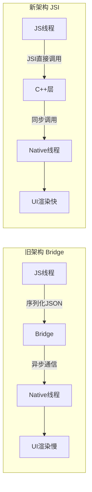
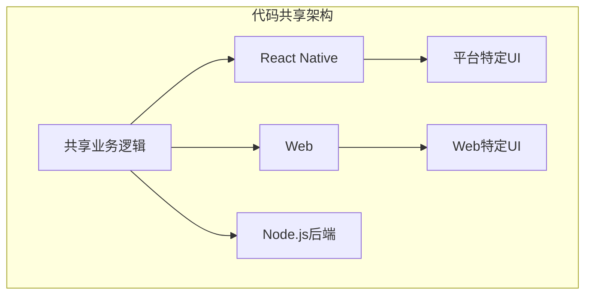
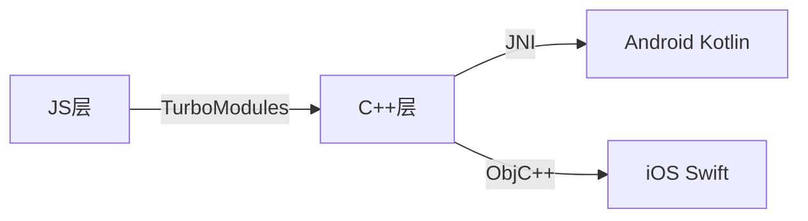

# 📱 移动端开发实战 (50.4)

> 移动端开发是 JavaScript/TypeScript 生态中增长最快的领域之一。React Native、Ionic、Capacitor 和新兴的跨平台方案为开发者提供了用 Web 技术构建原生应用的能力。

## 技术选型决策树

```mermaid
flowchart TD
    A[移动端技术选型] --> B&#123;需要原生性能?&#125;
    B -->|是| C&#123;团队熟悉React?&#125;
    C -->|是| D[React Native]
    C -->|否| E[Flutter/Dart]
    B -->|否| F&#123;需要Web代码复用?&#125;
    F -->|是| G[Capacitor/Ionic]
    F -->|否| H[PWA]
    D --> I[新架构 Fabric]
    D --> J[TurboModules]
    D --> K[Expo生态]
```

## React Native 新架构 (Fabric + TurboModules)

React Native 在 2022-2024 年完成了架构重写，新架构解决了旧架构（Bridge）的性能瓶颈：



| 特性 | 旧架构 (Bridge) | 新架构 (JSI) |
|------|----------------|-------------|
| 通信方式 | 异步 JSON 序列化 | 直接内存共享 |
| 启动速度 | 慢 | 快 2-3x |
| 内存占用 | 高 | 低 30% |
| TypeScript | 类型不全 | 完整类型 |
|  Fabric  |  Yoga 布局 |  跨平台统一布局  |

### 启用新架构

```json
// android/gradle.properties
newArchEnabled=true

// ios/Podfile
ENV['RCT_NEW_ARCH_ENABLED'] = '1'
```

## Expo 生态系统

Expo 是 React Native 最流行的开发平台，提供了托管工作流、EAS 构建服务和丰富的原生模块库：


### Expo Router 文件系统路由

```typescript
// app/index.tsx — 首页
export default function Home() &#123;
  return &lt;View&gt;&lt;Text&gt;Home&lt;/Text&gt;&lt;/View&gt;;
&#125;

// app/(tabs)/explore.tsx — Tab 路由
export default function Explore() &#123;
  return &lt;View&gt;&lt;Text&gt;Explore&lt;/Text&gt;&lt;/View&gt;;
&#125;

// app/[id].tsx — 动态路由
import &#123; useLocalSearchParams &#125; from 'expo-router';
export default function Detail() &#123;
  const &#123; id &#125; = useLocalSearchParams();
  return &lt;View&gt;&lt;Text&gt;Detail: &#123;id&#125;&lt;/Text&gt;&lt;/View&gt;;
&#125;
```

## 跨平台共享代码策略



```typescript
// 共享层：packages/core/src/api.ts
export async function fetchUser(id: string): Promise&lt;User&gt; &#123;
  const response = await fetch(`/api/users/$&#123;id&#125;`);
  return response.json();
&#125;

// 平台抽象层：packages/core/src/storage.ts
export interface Storage &#123;
  get(key: string): Promise&lt;string | null&gt;;
  set(key: string, value: string): Promise&lt;void&gt;;
&#125;

// React Native 实现
import AsyncStorage from '@react-native-async-storage/async-storage';
export const storage: Storage = AsyncStorage;

// Web 实现
export const storage: Storage = localStorage;
```

## 移动端性能优化

| 优化项 | 问题 | 方案 | 效果 |
|--------|------|------|------|
| 启动时间 | JS Bundle 过大 | Hermes 引擎 + 代码分割 | -50% |
| 列表滚动 | 长列表卡顿 | FlashList / RecyclerListView | 60fps |
| 内存泄漏 | 事件未移除 | useEffect cleanup | 稳定 |
| 图片加载 | 大图 OOM | react-native-fast-image | 流畅 |
| 动画 | JS 线程阻塞 | react-native-reanimated | 60fps |

### FlashList 长列表优化

```tsx
import &#123; FlashList &#125; from '@shopify/flash-list';

function ProductList(&#123; products &#125;) &#123;
  return (
    &lt;FlashList
      data=&#123;products&#125;
      renderItem=&#123;(&#123; item &#125;) => &lt;ProductCard product=&#123;item&#125; /&gt;&#125;
      estimatedItemSize=&#123;200&#125;
      keyExtractor=&#123;(item) => item.id&#125;
    /&gt;
  );
&#125;
```

## 原生模块开发

当 Expo/RN 的内置模块无法满足需求时，可以开发原生模块：



### TurboModule 示例

```typescript
// specs/NativeCalculator.ts
import type &#123; TurboModule &#125; from 'react-native/Libraries/TurboModule/RCTExport';
import &#123; TurboModuleRegistry &#125; from 'react-native';

export interface Spec extends TurboModule &#123;
  add(a: number, b: number): Promise&lt;number&gt;;
&#125;

export default TurboModuleRegistry.get&lt;Spec&gt;('NativeCalculator');
```

## 文档目录

| 编号 | 主题 | 文件 |
|------|------|------|
| 01 | React Native + Expo 环境搭建 | [查看](../../50-examples/50.4-mobile/01-react-native-expo-setup.md) |
| 02 | React Native 新架构 (Fabric/TurboModules) | [查看](../../50-examples/50.4-mobile/02-react-native-new-architecture.md) |
| 03 | 跨平台共享代码策略 | [查看](../../50-examples/50.4-mobile/03-cross-platform-shared-code.md) |
| 04 | 移动端性能优化 | [查看](../../50-examples/50.4-mobile/04-mobile-performance-optimization.md) |
| 05 | 原生模块开发 | [查看](../../50-examples/50.4-mobile/05-mobile-native-modules.md) |
| 06 | Expo Router 深度解析 | [查看](../../50-examples/50.4-mobile/06-expo-router-deep-dive.md) |
| README | 移动端开发总览 | [查看](../../50-examples/50.4-mobile/README.md) |

## 参考资源

| 资源 | 链接 | 说明 |
|------|------|------|
| React Native 文档 | <https://reactnative.dev> | 官方文档 |
| Expo 文档 | <https://docs.expo.dev> | Expo 完整指南 |
| React Native Directory | <https://reactnative.directory> | 社区模块目录 |

---

 [← 返回示例首页](../)
