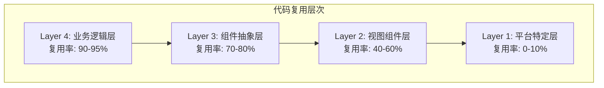

# 跨平台代码共享与 Monorepo 实践

> **版本信息**: pnpm workspaces | Turborepo 2.x | Expo SDK 52 | React Native 0.76 | TypeScript 5.6 (Project References)
> **目标读者**: 需要同时维护 Web 和移动端应用的团队，希望最大化代码复用率

---

## 概述

在同时维护 Web 和移动端应用时，代码可按复用层次分为四层：**业务逻辑层**（复用率 90-95%）、**组件抽象层**（复用率 70-80%）、**视图组件层**（复用率 40-60%）、**平台特定层**（复用率 0-10%）。对于 React Native + Web 场景，采用 **Monorepo + Turborepo + 共享包** 配合 **Tamagui 或 NativeWind** 实现跨平台 UI，可获得最佳的代码复用率和性能平衡。

### 技术方案对比

| 方案 | 代表工具 | 复用率 | 学习成本 | 性能 | 适用场景 |
|-----|---------|--------|---------|------|---------|
| **Monorepo + 共享包** | pnpm + Turborepo | 80%+ | 中 | 最优 | 中大型团队 |
| **跨平台组件库** | Tamagui, NativeWind | 60% | 中 | 良好 | 设计系统优先 |
| **Expo Web** | expo-router | 70% | 低 | 良好 | Expo 生态项目 |
| **React Native Web** | react-native-web | 50% | 低 | 一般 | 简单页面 |

---

## 核心内容

### 1. Monorepo 架构选型

| 特性 | pnpm Workspaces | Nx | Turborepo | Rush | Lerna |
|-----|----------------|-----|----------|------|-------|
| **包管理** | pnpm (原生) | npm/yarn/pnpm | 任意 | 任意 | npm/yarn |
| **任务编排** | 基础 | ⭐⭐⭐⭐⭐ | ⭐⭐⭐⭐⭐ | ⭐⭐⭐⭐ | ⭐⭐⭐ |
| **远程缓存** | ❌ | ✅ | ✅ | ✅ | ❌ |
| **配置复杂度** | 低 | 高 | 中 | 高 | 中 |
| **2026 推荐度** | ⭐⭐⭐⭐ | ⭐⭐⭐⭐ | ⭐⭐⭐⭐⭐ | ⭐⭐⭐ | ⭐ |

**架构决策矩阵**:

```
团队规模 < 10 人?
    ├── 是 → 使用 pnpm workspaces 即可
    └── 否 → 需要 CI/CD 优化?
              ├── 是 → 使用 Turborepo + Remote Cache
              └── 否 → 使用 Nx 或 Turborepo
```

### 2. Turborepo + pnpm Workspace 配置

**目录结构**:

```
my-monorepo/
├── pnpm-workspace.yaml      # pnpm 工作区配置
├── turbo.json               # Turborepo 管道配置
├── package.json             # 根包配置
├── tsconfig.json            # 根 TypeScript 配置
├── apps/
│   ├── mobile/              # Expo 移动端应用
│   └── web/                 # Next.js Web 应用
├── packages/
│   ├── ui/                  # 跨平台 UI 组件库
│   ├── shared/              # 共享业务逻辑
│   ├── config/              # 共享配置
│   └── types/               # 全局类型定义
└── tooling/                 # 构建脚本和工具
```

**pnpm-workspace.yaml**:

```yaml
packages:
  - "apps/*"
  - "packages/*"
  - "tooling/*"

shared-workspace-lockfile: true
strict-peer-dependencies: false
```

**根 package.json**:

```json
&#123;
  "name": "my-monorepo",
  "private": true,
  "packageManager": "pnpm@9.0.0",
  "scripts": &#123;
    "build": "turbo run build",
    "dev": "turbo run dev --parallel",
    "lint": "turbo run lint",
    "typecheck": "turbo run typecheck",
    "test": "turbo run test",
    "clean": "turbo run clean && rm -rf node_modules"
  &#125;,
  "devDependencies": &#123;
    "turbo": "^2.0.0",
    "typescript": "^5.6.0",
    "prettier": "^3.3.0"
  &#125;
&#125;
```

**turbo.json**:

```json
&#123;
  "$schema": "https://turbo.build/schema.json",
  "globalDependencies": ["**/.env.*local"],
  "pipeline": &#123;
    "build": &#123;
      "dependsOn": ["^build"],
      "outputs": [".next/**", "dist/**", "expo-router/**"]
    &#125;,
    "dev": &#123; "cache": false, "persistent": true &#125;,
    "lint": &#123; "dependsOn": ["^build"] &#125;,
    "typecheck": &#123; "dependsOn": ["^build"] &#125;,
    "test": &#123; "dependsOn": ["^build"] &#125;
  &#125;
&#125;
```

### 3. TypeScript Project References

```json
// tsconfig.json (根配置)
&#123;
  "compilerOptions": &#123;
    "composite": true,
    "declaration": true,
    "declarationMap": true,
    "sourceMap": true,
    "strict": true,
    "esModuleInterop": true,
    "skipLibCheck": true,
    "moduleResolution": "bundler"
  &#125;,
  "references": [
    &#123; "path": "./packages/types" &#125;,
    &#123; "path": "./packages/config" &#125;,
    &#123; "path": "./packages/shared" &#125;,
    &#123; "path": "./packages/ui" &#125;,
    &#123; "path": "./apps/mobile" &#125;,
    &#123; "path": "./apps/web" &#125;
  ]
&#125;
```

### 4. 共享包设计原则

**包依赖关系**:

```
                    ┌──────────┐
                    │ @myrepo  │
                    │ /config  │
                    └────┬─────┘
                    ┌────┴─────┐
                    │ @myrepo  │
                    │ /types   │
                    └────┬─────┘
        ┌────────────────┼────────────────┐
   ┌────┴─────┐    ┌────┴─────┐    ┌────┴─────┐
   │ @myrepo  │    │ @myrepo  │    │ @myrepo  │
   │ /shared  │    │  /ui     │    │ /utils   │
   └────┬─────┘    └────┬─────┘    └──────────┘
        └───────┬───────┘
           ┌────┴─────┐
           │  apps    │
           │(mobile  │
           │  + web)  │
           └──────────┘
```

**共享 API 客户端包**:

```typescript
// packages/shared/src/api/client.ts
import axios, &#123; AxiosInstance, AxiosError, InternalAxiosRequestConfig &#125; from 'axios';

const API_BASE_URL = process.env.EXPO_PUBLIC_API_URL
  || process.env.NEXT_PUBLIC_API_URL
  || 'https://api.example.com/v1';

export interface ApiConfig &#123;
  baseURL?: string;
  timeout?: number;
  getToken?: () => Promise<string | null>;
  onAuthError?: () => void;
&#125;

export function createApiClient(config: ApiConfig = &#123;&#125;): AxiosInstance &#123;
  const client = axios.create(&#123;
    baseURL: config.baseURL || API_BASE_URL,
    timeout: config.timeout || 15000,
    headers: &#123;
      'Content-Type': 'application/json',
      Accept: 'application/json',
    &#125;,
  &#125;);

  client.interceptors.request.use(
    async (reqConfig: InternalAxiosRequestConfig) => &#123;
      if (config.getToken) &#123;
        const token = await config.getToken();
        if (token && reqConfig.headers) &#123;
          reqConfig.headers.Authorization = `Bearer $&#123;token&#125;`;
        &#125;
      &#125;
      return reqConfig;
    &#125;,
    (error) => Promise.reject(error)
  );

  client.interceptors.response.use(
    (response) => response,
    async (error: AxiosError) => &#123;
      if (error.response?.status === 401 && config.onAuthError) &#123;
        config.onAuthError();
      &#125;
      return Promise.reject(error);
    &#125;
  );

  return client;
&#125;
```

**共享 Zustand Store**:

```typescript
// packages/shared/src/stores/authStore.ts
import &#123; create, StoreApi &#125; from 'zustand';
import &#123; User, AuthStatus &#125; from '@myrepo/types';

interface AuthState &#123;
  user: User | null;
  token: string | null;
  status: AuthStatus;
  isAuthenticated: boolean;
  setToken: (token: string | null) => void;
  logout: () => void;
&#125;

export type AuthStore = StoreApi<AuthState>;

export function createAuthStore(
  getToken: () => string | null,
  setTokenStorage: (token: string | null) => Promise<void>
): AuthStore &#123;
  return create<AuthState>((set, get) => (&#123;
    user: null,
    token: getToken(),
    status: 'idle',
    isAuthenticated: false,
    setToken: (token) => &#123;
      set(&#123; token, isAuthenticated: !!token &#125;);
      setTokenStorage(token);
    &#125;,
    logout: async () => &#123;
      await setTokenStorage(null);
      set(&#123; user: null, token: null, status: 'unauthenticated', isAuthenticated: false &#125;);
    &#125;,
  &#125;));
&#125;
```

### 5. 平台差异化处理

```typescript
// packages/shared/src/utils/platform.ts
import &#123; Platform &#125; from 'react-native';

export const isWeb = Platform.OS === 'web';
export const isIOS = Platform.OS === 'ios';
export const isAndroid = Platform.OS === 'android';
export const isMobile = isIOS || isAndroid;

export const platformSelect = <T>(spec: &#123; native?: T; web?: T; ios?: T; android?: T; default: T &#125;): T => &#123;
  if (isIOS && spec.ios !== undefined) return spec.ios;
  if (isAndroid && spec.android !== undefined) return spec.android;
  if (isMobile && spec.native !== undefined) return spec.native;
  if (isWeb && spec.web !== undefined) return spec.web;
  return spec.default;
&#125;;
```

**存储抽象层**:

```typescript
// packages/shared/src/utils/storage.ts
import AsyncStorage from '@react-native-async-storage/async-storage';

export interface StorageAdapter &#123;
  getItem: (key: string) => Promise<string | null>;
  setItem: (key: string, value: string) => Promise<void>;
  removeItem: (key: string) => Promise<void>;
&#125;

export const rnStorage: StorageAdapter = &#123;
  getItem: AsyncStorage.getItem,
  setItem: AsyncStorage.setItem,
  removeItem: AsyncStorage.removeItem,
&#125;;

export const webStorage: StorageAdapter = &#123;
  getItem: async (key: string) => localStorage.getItem(key),
  setItem: async (key: string, value: string) => &#123; localStorage.setItem(key, value); &#125;,
  removeItem: async (key: string) => &#123; localStorage.removeItem(key); &#125;,
&#125;;

export function createStorage(platform: 'web' | 'native'): StorageAdapter &#123;
  return platform === 'web' ? webStorage : rnStorage;
&#125;
```

### 6. React Native Web 统一构建

**Next.js Web 配置**:

```javascript
// apps/web/next.config.js
const &#123; withExpo &#125; = require('@expo/next-adapter');

/** @type &#123;import('next').NextConfig&#125; */
const nextConfig = &#123;
  reactStrictMode: true,
  transpilePackages: [
    'react-native',
    'react-native-web',
    '@expo/vector-icons',
    '@myrepo/ui',
    '@myrepo/shared',
  ],
  experimental: &#123;
    turbo: &#123;
      resolveAlias: &#123;
        'react-native$': 'react-native-web',
      &#125;,
    &#125;,
  &#125;,
  webpack: (config) => &#123;
    config.resolve.alias = &#123;
      ...config.resolve.alias,
      'react-native$': 'react-native-web',
    &#125;;
    config.resolve.extensions = [
      '.web.js', '.web.jsx', '.web.ts', '.web.tsx',
      ...config.resolve.extensions,
    ];
    return config;
  &#125;,
&#125;;

module.exports = withExpo(nextConfig);
```

### 7. Expo Router Web 适配

Expo Router v3 支持通过 `app/` 目录的文件系统自动生成路由，且可同时用于 Native 和 Web：

```
apps/mobile/app/
├── _layout.tsx           # 根布局 (共享导航结构)
├── index.tsx             # 首页
├── explore/
│   └── index.tsx         # /explore
├── post/
│   └── [id].tsx          # /post/:id
├── profile/
│   └── [userId].tsx      # /profile/:userId
└── settings.tsx          # /settings
```

```typescript
// apps/mobile/app/_layout.tsx
import { Stack } from 'expo-router';
import { QueryClient, QueryClientProvider } from '@tanstack/react-query';
import { SafeAreaProvider } from 'react-native-safe-area-context';

const queryClient = new QueryClient();

export default function RootLayout() {
  return (
    <SafeAreaProvider>
      <QueryClientProvider client={queryClient}>
        <Stack>
          <Stack.Screen name="index" options={{ title: '首页' }} />
          <Stack.Screen name="explore" options={{ title: '探索' }} />
          <Stack.Screen name="post/[id]" options={{ title: '帖子详情' }} />
        </Stack>
      </QueryClientProvider>
    </SafeAreaProvider>
  );
}
```

**深度链接统一配置**:

```typescript
// apps/mobile/app/linking.ts
import * as Linking from 'expo-linking';

export const linking = {
  prefixes: [
    Linking.createURL('/'),
    'https://myapp.com',
    'myapp://',
  ],
};
```

### 8. 跨平台表单 Hook

```typescript
// packages/shared/src/hooks/useForm.ts
import { useState, useCallback } from 'react';
import { ZodSchema, ZodError } from 'zod';

interface UseFormOptions<T> {
  initialValues: T;
  schema: ZodSchema<T>;
  onSubmit: (values: T) => Promise<void>;
}

interface UseFormReturn<T> {
  values: T;
  errors: Partial<Record<keyof T, string>>;
  isSubmitting: boolean;
  handleChange: <K extends keyof T>(field: K, value: T[K]) => void;
  handleSubmit: () => Promise<void>;
  reset: () => void;
}

export function useForm<T extends Record<string, unknown>>(
  options: UseFormOptions<T>
): UseFormReturn<T> {
  const [values, setValues] = useState<T>(options.initialValues);
  const [errors, setErrors] = useState<Partial<Record<keyof T, string>>>({});
  const [isSubmitting, setIsSubmitting] = useState(false);

  const validate = useCallback((fieldValues: T): boolean => {
    try {
      options.schema.parse(fieldValues);
      setErrors({});
      return true;
    } catch (error) {
      if (error instanceof ZodError) {
        const newErrors: Partial<Record<keyof T, string>> = {};
        error.errors.forEach((err) => {
          const field = err.path[0] as keyof T;
          newErrors[field] = err.message;
        });
        setErrors(newErrors);
      }
      return false;
    }
  }, [options.schema]);

  const handleChange = useCallback(<K extends keyof T>(field: K, value: T[K]) => {
    setValues((prev) => ({ ...prev, [field]: value }));
  }, []);

  const handleSubmit = useCallback(async () => {
    if (!validate(values)) return;
    setIsSubmitting(true);
    try {
      await options.onSubmit(values);
    } finally {
      setIsSubmitting(false);
    }
  }, [values, validate, options]);

  const reset = useCallback(() => {
    setValues(options.initialValues);
    setErrors({});
    setIsSubmitting(false);
  }, [options.initialValues]);

  return { values, errors, isSubmitting, handleChange, handleSubmit, reset };
}
```

### 9. 跨平台组件示例

```typescript
// packages/ui/src/components/Button.tsx
import React from 'react';
import &#123;
  TouchableOpacity,
  Text,
  StyleSheet,
  ActivityIndicator,
  ViewStyle,
  TextStyle,
  Platform,
&#125; from 'react-native';

export interface ButtonProps &#123;
  title: string;
  onPress: () => void;
  variant?: 'primary' | 'secondary' | 'outline' | 'ghost';
  size?: 'sm' | 'md' | 'lg';
  disabled?: boolean;
  loading?: boolean;
  style?: ViewStyle;
  textStyle?: TextStyle;
&#125;

export function Button(&#123;
  title,
  onPress,
  variant = 'primary',
  size = 'md',
  disabled = false,
  loading = false,
  style,
  textStyle,
&#125;: ButtonProps): JSX.Element &#123;
  const colors = &#123;
    primary: '#007AFF',
    secondary: '#5856D6',
    text: '#000000',
    textSecondary: '#666666',
    background: '#FFFFFF',
    border: '#E5E5EA',
    error: '#FF3B30',
  &#125;;

  const getBackgroundColor = () => &#123;
    if (disabled) return colors.textSecondary;
    switch (variant) &#123;
      case 'primary': return colors.primary;
      case 'secondary': return colors.secondary;
      case 'outline':
      case 'ghost': return 'transparent';
      default: return colors.primary;
    &#125;
  &#125;;

  const getTextColor = () => &#123;
    if (disabled) return colors.background;
    switch (variant) &#123;
      case 'primary':
      case 'secondary': return '#FFFFFF';
      case 'outline':
      case 'ghost': return colors.primary;
      default: return '#FFFFFF';
    &#125;
  &#125;;

  const getPadding = () => &#123;
    switch (size) &#123;
      case 'sm': return &#123; paddingVertical: 8, paddingHorizontal: 12 &#125;;
      case 'md': return &#123; paddingVertical: 12, paddingHorizontal: 16 &#125;;
      case 'lg': return &#123; paddingVertical: 16, paddingHorizontal: 24 &#125;;
    &#125;
  &#125;;

  return (
    <TouchableOpacity
      onPress=&#123;onPress&#125;
      disabled=&#123;disabled || loading&#125;
      activeOpacity=&#123;0.8&#125;
      style=&#123;[
        styles.button,
        &#123;
          backgroundColor: getBackgroundColor(),
          borderWidth: variant === 'outline' ? 1.5 : 0,
          borderColor: colors.primary,
          ...getPadding(),
        &#125;,
        Platform.select(&#123;
          web: &#123; cursor: disabled ? 'not-allowed' : 'pointer' &#125;,
          default: &#123;&#125;,
        &#125;),
        style,
      ]&#125;
    >
      &#123;loading ? (
        <ActivityIndicator color=&#123;getTextColor()&#125; />
      ) : (
        <Text style=&#123;[styles.text, &#123; color: getTextColor() &#125;, textStyle]&#125;>
          &#123;title&#125;
        </Text>
      )&#125;
    </TouchableOpacity>
  );
&#125;

const styles = StyleSheet.create(&#123;
  button: &#123;
    borderRadius: 12,
    alignItems: 'center',
    justifyContent: 'center',
    flexDirection: 'row',
  &#125;,
  text: &#123;
    fontSize: 16,
    fontWeight: '600',
  &#125;,
&#125;);
```

### 8. 构建与发布流程

**EAS Build 集成**:

```json
// apps/mobile/eas.json
&#123;
  "cli": &#123;
    "version": ">= 12.0.0"
  &#125;,
  "build": &#123;
    "development": &#123;
      "developmentClient": true,
      "distribution": "internal"
    &#125;,
    "preview": &#123;
      "distribution": "internal",
      "android": &#123; "buildType": "apk" &#125;
    &#125;,
    "production": &#123;&#125;
  &#125;
&#125;
```

```bash
# 构建时先构建共享包
pnpm --filter @myrepo/shared build
pnpm --filter @myrepo/ui build

# 然后构建移动端
cd apps/mobile
eas build --platform ios
```

---

## Mermaid 图表

### Monorepo 依赖关系图

```mermaid
graph TD
    subgraph "Monorepo 架构"
        ROOT[根目录]
        ROOT --> APPS[apps/]
        ROOT --> PKGS[packages/]

        APPS --> MOBILE[mobile<br/>Expo App]
        APPS --> WEB[web<br/>Next.js App]

        PKGS --> UI[@myrepo/ui]
        PKGS --> SHARED[@myrepo/shared]
        PKGS --> TYPES[@myrepo/types]
        PKGS --> CONFIG[@myrepo/config]

        UI --> TYPES
        UI --> CONFIG
        SHARED --> TYPES
        SHARED --> CONFIG

        MOBILE --> UI
        MOBILE --> SHARED
        WEB --> UI
        WEB --> SHARED
    end
```

### 跨平台代码共享层次



---

## 最佳实践总结

1. **包分层设计**: 业务逻辑层复用率最高 (90%+)，平台特定层保持最小化
2. **TypeScript Project References**: 确保跨包类型安全和增量编译
3. **Turborepo 管道**: 通过依赖图分析实现最优的构建和测试编排
4. **存储和网络抽象**: 通过接口隔离平台差异，不要在共享包中直接访问 `process.env`
5. **Expo Router Web**: 一套路由代码同时服务 Native 和 Web
6. **Metro Monorepo 配置**: 必须配置 `extraNodeModules` 和 `watchFolders`

### 常见陷阱与解决方案

| 陷阱 | 现象 | 解决方案 |
|-----|------|---------|
| pnpm Workspace 依赖解析失败 | `Cannot find module '@myrepo/shared'` | 确保在根目录执行 `pnpm install`，并使用 `workspace:*` 协议 |
| Metro 无法解析 Workspace 包 | Metro bundler 报错 | 配置 `metro.config.js` 的 `extraNodeModules` 和 `watchFolders` |
| TypeScript Project References 编译失败 | `tsc` 报错找不到类型定义 | 确保每个包都有正确的 `references` 链和 `composite: true` |
| react-native-web 样式不一致 | 相同组件在 Native 和 Web 上表现不同 | 使用 `Platform.select` 或统一的设计系统 Tokens |
| EAS Build 找不到 Workspace 依赖 | 云端构建时 Workspace 包未打包 | 配置 `eas-build-pre-install` 脚本 |
| 循环依赖导致构建失败 | `turbo run build` 报错 | 确保依赖方向单向: types → config → shared → ui → apps |

---

## 参考资源

1. [Turborepo 官方文档](https://turbo.build/repo/docs) — Vercel 官方维护的 Monorepo 任务编排工具文档，包含远程缓存和管道配置
2. [pnpm Workspaces 指南](https://pnpm.io/workspaces) — pnpm 官方工作区文档，讲解 workspace 协议和依赖提升策略
3. [Expo Monorepo 支持](https://docs.expo.dev/guides/monorepos/) — Expo 官方 Monorepo 配置指南，包含 Metro 配置和 EAS Build 集成
4. [TypeScript Project References](https://www.typescriptlang.org/docs/handbook/project-references.html) — TypeScript 官方文档，详解跨项目引用和增量编译
5. [React Native Web 文档](https://necolas.github.io/react-native-web/) — Nicolas Gallagher 维护的 react-native-web 官方文档

---

> 跨平台代码共享是现代前端工程化的核心能力之一。通过 Turborepo + pnpm Workspace 构建 Monorepo，配合清晰的包分层架构，可以实现 80% 以上的业务逻辑代码在 Web 和移动端共享。
