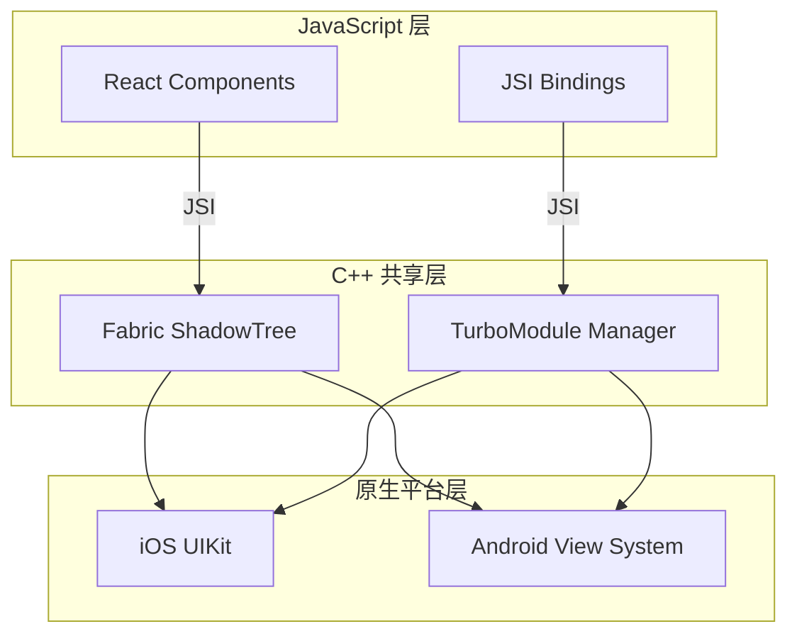
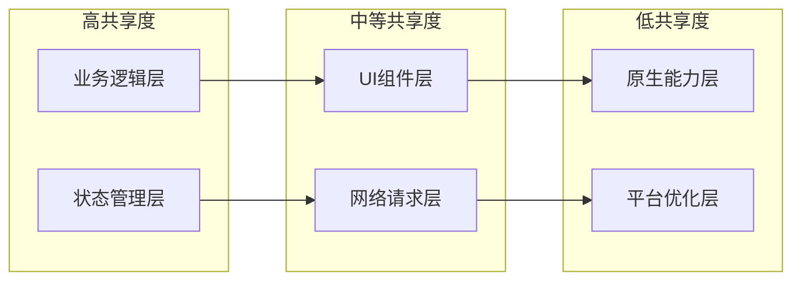
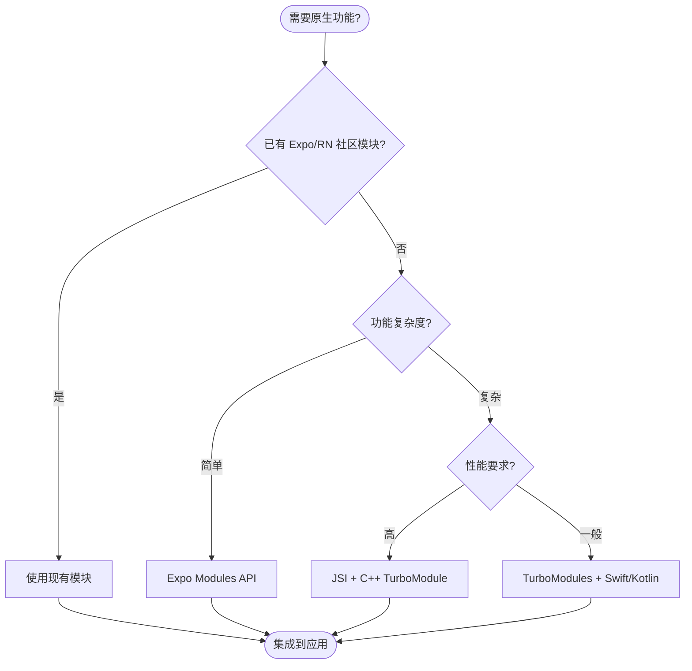
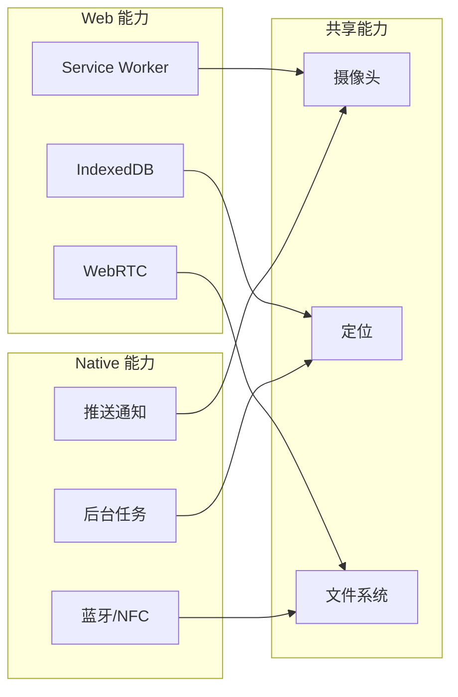
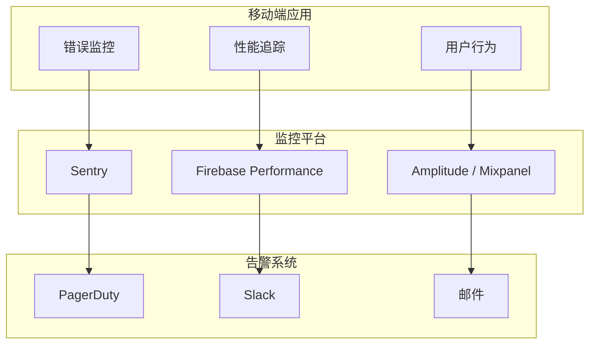
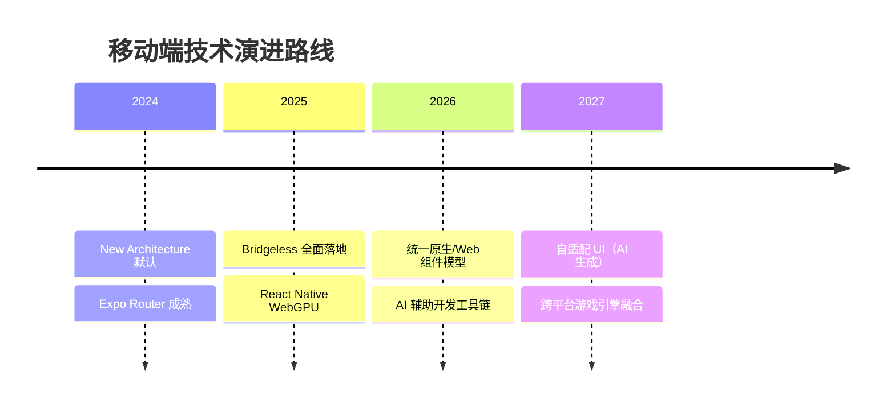

# 📱 移动端开发示例

> 从环境搭建到生产部署，覆盖 React Native / Expo 生态的完整实战示例库。每个示例均包含可运行的代码、最佳实践总结和常见陷阱速查。

## 学习路径总览


## 示例目录

| 序号 | 主题 | 文件 | 难度 | 预计时长 |
|------|------|------|------|---------|
| 01 | React Native + Expo 环境搭建 | [查看](./react-native-expo-setup.md) | 初级 | 30 min |
| 02 | React Native 新架构深度解析 | [查看](./react-native-new-architecture.md) | 中级 | 45 min |
| 03 | 跨平台共享代码策略 | [查看](./cross-platform-shared-code.md) | 中级 | 40 min |
| 04 | 移动端性能优化 | [查看](./mobile-performance-optimization.md) | 高级 | 60 min |
| 05 | 原生模块开发 | [查看](./mobile-native-modules.md) | 高级 | 90 min |
| 06 | Expo Router 深度解析 | [查看](./expo-router-deep-dive.md) | 中级 | 50 min |

---

## 技术栈全景

### React Native 新架构（0.74+）

React Native 新架构（New Architecture）引入了三大核心变革：

- **Fabric 渲染器**：取代旧的 Yoga/ShadowTree 渲染管线，采用 C++ 共享层实现跨平台一致性
- **TurboModules**：原生模块的懒加载与强类型绑定，通过 JSI（JavaScript Interface）直接通信
- **Codegen**：编译时生成原生代码的桥梁，消除运行时反射开销



### Expo 生态系统

Expo 提供了一整套工具链加速移动开发：

| 工具 | 用途 | 替代方案 |
|------|------|---------|
| Expo SDK | 统一原生 API 封装 | React Native Community 模块 |
| Expo Router | 基于文件系统的路由 | React Navigation |
| EAS Build | 云端构建服务 | 本地 Xcode/Android Studio |
| EAS Update | OTA 热更新 | CodePush |
| Expo Modules API | 原生模块开发 | TurboModules + Swift/Kotlin |

---

## 跨平台策略矩阵

移动开发的核心挑战在于**代码共享**与**平台特定优化**的平衡：



### 共享层级决策框架

| 层级 | 共享内容 | 技术方案 | 注意事项 |
|------|---------|---------|---------|
| **业务逻辑** | API 调用、状态管理、数据转换 | 纯 TypeScript 包 | 避免平台特定 API |
| **UI 组件** | 设计系统、通用布局 | React Native 组件 | 关注可访问性差异 |
| **原生能力** | 摄像头、定位、推送 | Expo Modules / TurboModules | 权限模型差异 |
| **平台优化** | 启动时间、内存管理 | 平台特定代码 | 使用 `#ifdef` 模式 |

---

## 性能优化关键指标

移动端的性能优化需要关注以下核心指标：

| 指标 | 目标值 | 测量工具 | 优化方向 |
|------|--------|---------|---------|
| **TTI** (Time to Interactive) | &lt; 3s | Flipper / Xcode Instruments | 代码分割、懒加载 |
| **FPS** | 60fps (UI) / 120fps (动画) | React DevTools Profiler | 减少重渲染、使用 Memo |
| **APK/IPA 大小** | &lt; 50MB (基础包) | Android App Bundle / Xcode | Hermes、资源优化 |
| **内存占用** | &lt; 200MB (峰值) | Android Profiler / Xcode | 图片缓存、泄漏检测 |
| **启动崩溃率** | &lt; 0.1% | Firebase Crashlytics | 初始化顺序、异常处理 |

---

## 原生模块开发决策树



---

## 常见陷阱速查

### 环境搭建阶段

| 陷阱 | 症状 | 解决方案 |
|------|------|---------|
| Node 版本不兼容 | `error: incompatible node version` | 使用 `.nvmrc` 锁定 LTS 版本 |
| CocoaPods 依赖冲突 | `pod install` 失败 | 运行 `pod deintegrate && pod install` |
| Android SDK 路径错误 | Gradle sync 失败 | 检查 `ANDROID_HOME` 环境变量 |
| Metro 缓存污染 | 热更新不生效 | `npx react-native start --reset-cache` |

### 开发阶段

| 陷阱 | 症状 | 解决方案 |
|------|------|---------|
| 内存泄漏 | 应用越来越卡 | 使用 `react-native-performance` 检测 |
| 桥接瓶颈 | UI 线程卡顿 | 迁移到 JSI/TurboModules |
| 类型安全缺失 | 运行时崩溃 | 启用 TypeScript 严格模式 |
| 第三方库版本冲突 | 构建失败 | 使用 `resolutions` / `overrides` 锁定版本 |

### 生产阶段

| 陷阱 | 症状 | 解决方案 |
|------|------|---------|
| OTA 更新签名失败 | EAS Update 无法应用 | 检查 `updates` 配置和签名密钥 |
| 应用商店审核被拒 | 隐私政策、权限说明 | 准备完整的隐私政策和权限说明 |
| 启动崩溃率上升 | 新用户流失 | 灰度发布、A/B 测试 |
| 能耗过高 | 用户差评 / 卸载 | 定位服务后台策略优化 |

---

## 与专题理论的映射

这些示例与网站理论专题形成**实践-理论双轨**：

| 示例 | 理论支撑 |
|------|---------|
| [React Native 新架构](./react-native-new-architecture.md) | [框架模型理论](/framework-models/) — 组件模型、渲染管线、虚拟DOM演进 |
| [跨平台共享代码](./cross-platform-shared-code.md) | [模块系统](/module-system/) — ESM/CJS、Tree Shaking、Monorepo |
| [性能优化](./mobile-performance-optimization.md) | [性能工程](/performance-engineering/) — 渲染性能、内存管理、打包优化 |
| [原生模块](./mobile-native-modules.md) | [对象模型](/object-model/) — FFI、内存布局、类型桥接 |
| [Expo Router](./expo-router-deep-dive.md) | [框架模型理论](/framework-models/) — 路由与导航理论 |

---

## 平台差异速查

### iOS vs Android 关键差异

| 维度 | iOS | Android | 应对策略 |
|------|-----|---------|---------|
| **导航手势** | 右滑返回 | 系统返回键 | 统一使用 React Navigation |
| **状态栏** | 安全区域顶部 | 状态栏覆盖 | `SafeAreaView` + `react-native-safe-area-context` |
| **字体渲染** | San Francisco | Roboto | 使用 `expo-font` 统一加载 |
| **权限模型** | 运行时一次请求 | 多次细粒度请求 | `expo-permissions` / `react-native-permissions` |
| **后台限制** | 严格（iOS 13+） | 相对宽松 | 使用 `expo-background-fetch` |
| **推送通知** | APNs | FCM | `expo-notifications` 统一封装 |

### Web vs Native 能力对比



---

## 参考资源

### 官方文档

- [React Native 官方文档](https://reactnative.dev/)
- [Expo 文档](https://docs.expo.dev/)
- [React Native Performance](https://reactnative.dev/docs/performance)
- [JSI & TurboModules RFC](https://github.com/react-native-community/discussions-and-proposals)
- [EAS 文档](https://docs.expo.dev/build/introduction/)

### 社区与工具

- [React Native Directory](https://reactnative.directory/) — 社区模块搜索
- [Expo Snack](https://snack.expo.dev/) — 在线运行环境
- [Flipper](https://fbflipper.com/) — 调试工具
- [Sentry React Native](https://docs.sentry.io/platforms/react-native/) — 错误监控

### 经典著作

- *Learning React Native* — Bonnie Eisenman
- *React Native in Action* — Nader Dabit
- *Fullstack React Native* — Devin Abbott

---

## 项目结构最佳实践

一个生产级的 React Native / Expo 项目应采用分层架构：

```
my-mobile-app/
├── apps/
│   ├── mobile/                 # React Native 应用入口
│   └── web/                    # 共享的 Web 端（如有）
├── packages/
│   ├── ui/                     # 共享 UI 组件库
│   ├── config/                 # 共享配置（ESLint、TS、Tailwind）
│   └── utils/                  # 工具函数
├── src/
│   ├── api/                    # API 客户端和类型定义
│   ├── components/             # 业务组件
│   ├── screens/                # 页面级组件
│   ├── navigation/             # 路由配置
│   ├── hooks/                  # 自定义 Hooks
│   ├── stores/                 # 状态管理
│   ├── services/               # 原生服务封装
│   └── types/                  # 全局类型定义
├── ios/                        # iOS 原生项目
├── android/                    # Android 原生项目
├── app.json                    # Expo 配置
├── eas.json                    # EAS 构建配置
└── metro.config.js             # Metro 打包配置
```

### Monorepo 工具链选择

| 工具 | 适用场景 | 优缺点 |
|------|---------|--------|
| **Turborepo** | 中大型团队 | 缓存强大、Vercel 生态、学习曲线平缓 |
| **Nx** | 企业级项目 | 完整工具链、生成器丰富、配置较重 |
| **pnpm workspaces** | 小型项目 | 简单直接、无额外抽象、需自行配置管道 |

---

## CI/CD 流水线设计


### 关键流水线阶段

**阶段 1：代码质量门禁**

- ESLint + Prettier 格式化检查
- TypeScript 严格模式编译
- 单元测试覆盖率 &gt; 80%

**阶段 2：预览构建**

- EAS Update 发布到内部测试通道
- 自动化 UI 测试（Maestro / Detox）
- 性能基准对比（防止回归）

**阶段 3：生产构建**

- 签名证书验证
- 资源完整性检查
- 应用商店元数据校验

---

## 测试策略金字塔

移动端测试应遵循分层策略：

| 层级 | 比例 | 工具 | 目标 |
|------|------|------|------|
| **单元测试** | 70% | Jest + React Native Testing Library | 业务逻辑、工具函数 |
| **集成测试** | 20% | Jest + MSW | API 集成、状态流 |
| **E2E 测试** | 10% | Maestro / Detox | 核心用户流程 |

### 测试环境隔离

```typescript
// 使用 MSW 模拟 API 响应
import { setupServer } from 'msw/native';
import { handlers } from './mocks/handlers';

const server = setupServer(...handlers);

beforeAll(() => server.listen());
afterEach(() => server.resetHandlers());
afterAll(() => server.close());
```

---

## 安全合规清单

| 检查项 | 要求 | 验证方式 |
|--------|------|---------|
| **数据加密** | 敏感数据 AES-256 加密 | 静态分析 + 渗透测试 |
| **证书固定** | 防止中间人攻击 | SSL Pinning 配置 |
| **根检测** | 拒绝越狱/Root 设备 | `react-native-device-info` |
| **代码混淆** | 发布包 ProGuard/R8 | 反编译验证 |
| **隐私合规** | GDPR / CCPA / 个人信息保护法 | 隐私政策 + 数据清单 |
| **密钥管理** | 不在代码中硬编码密钥 | `.env` + 密钥管理服务 |

---

## 版本管理与发布节奏

### Semantic Versioning for Mobile

移动端语义化版本有特殊考量：

| 版本变化 | 含义 | 商店审核 |
|---------|------|---------|
| **Major** (x.0.0) | 破坏性变更、原生依赖升级 | 需重新审核 |
| **Minor** (x.y.0) | 新功能、API 扩展 | OTA 可更新 |
| **Patch** (x.y.z) | Bug 修复、性能优化 | OTA 可更新 |

### 发布节奏建议

- **Patch 版本**：按需发布，修复线上问题
- **Minor 版本**：双周迭代，功能交付
- **Major 版本**：季度规划，架构升级

---

## 监控与可观测性



### 关键监控指标

| 指标类型 | 具体指标 | 告警阈值 |
|---------|---------|---------|
| **稳定性** | 崩溃率、ANR 率 | &gt; 0.1% 立即告警 |
| **性能** | 启动时间、帧率 | TTI &gt; 3s 告警 |
| **业务** | 转化率、留存率 | 周环比下降 &gt; 5% 告警 |
| **体验** | App Store 评分、差评关键词 | 评分 &lt; 4.0 告警 |

---

## 技术演进路线

### 2024-2025 趋势

- **Bridgeless React Native**: 彻底移除旧桥接，全面 JSI
- **Expo Router v3**: 文件系统路由成为标配
- **React Native Skia**: 高性能 2D 渲染
- **New Architecture 默认开启**: 无需手动配置

### 长期演进方向



---

## 贡献指南

这些示例遵循以下贡献规范：

1. **代码可运行**：每个示例必须包含完整可运行的代码
2. **TypeScript 优先**：所有示例使用 TypeScript，启用严格模式
3. **测试覆盖**：核心逻辑包含单元测试示例
4. **平台标注**：明确标注 iOS/Android 差异
5. **版本锁定**：指定 React Native / Expo 的兼容版本

---

## 参考资源

### 官方文档

- [React Native 官方文档](https://reactnative.dev/)
- [Expo 文档](https://docs.expo.dev/)
- [React Native Performance](https://reactnative.dev/docs/performance)
- [JSI & TurboModules RFC](https://github.com/react-native-community/discussions-and-proposals)
- [EAS 文档](https://docs.expo.dev/build/introduction/)

### 社区与工具

- [React Native Directory](https://reactnative.directory/) — 社区模块搜索
- [Expo Snack](https://snack.expo.dev/) — 在线运行环境
- [Flipper](https://fbflipper.com/) — 调试工具
- [Sentry React Native](https://docs.sentry.io/platforms/react-native/) — 错误监控
- [Maestro](https://maestro.mobile.dev/) — E2E 测试框架

### 经典著作

- *Learning React Native* — Bonnie Eisenman
- *React Native in Action* — Nader Dabit
- *Fullstack React Native* — Devin Abbott
- *The React Native Architecture* — 官方新架构文档
