# 移动端性能优化完全手册

> **版本信息**: Hermes Engine | Expo SDK 52 | React Native 0.76 | FlashList | Reanimated 3
> **目标读者**: 需要构建高性能、低内存占用移动应用的开发者和架构师

---

## 概述

移动端性能优化是一个系统工程，需要从引擎、Bundle、网络、渲染、内存等多个维度综合考量。Hermes 引擎、FlashList、Expo Image 和 Reanimated 3 构成了 2026 年 React Native 性能优化的核心技术栈。本文档系统性地介绍各项指标目标、诊断方法和优化策略。

### 核心性能指标 (KPIs)

| 指标名称 | 目标值 (iOS) | 目标值 (Android) | 测量工具 | 业务影响 |
|---------|------------|----------------|---------|---------|
| **TTI (Time to Interactive)** | < 2.5s | < 3.5s | Flashlight | 用户留存率 |
| **FCP (First Contentful Paint)** | < 1.5s | < 2.0s | Performance API | 首印象 |
| **滚动 FPS** | ≥ 55 | ≥ 50 | Systrace, Flashlight | 交互体验 |
| **交互响应延迟** | < 100ms | < 150ms | RN Perf Monitor | 操作流畅度 |
| **内存峰值** | < 250MB | < 300MB | Xcode Instruments | 崩溃率 |
| **Bundle 大小** | < 5MB | < 5MB | Source map analysis | 下载转化率 |

---

## 核心内容

### 1. Hermes 引擎深度优化

Hermes 是 Meta 专为 React Native 设计的 JavaScript 引擎，核心特性：

| 特性 | Hermes | JSC | V8 |
|-----|--------|-----|----|
| **启动速度** | ⭐⭐⭐⭐⭐ (Bytecode 预编译) | ⭐⭐⭐ (需解析) | ⭐⭐⭐⭐ |
| **内存占用** | ⭐⭐⭐⭐⭐ (Generational GC) | ⭐⭐⭐ | ⭐⭐ |
| **包体积** | ⭐⭐⭐⭐⭐ (so 文件 ~2MB) | ⭐⭐⭐ (内置) | ⭐⭐ (~8MB) |
| **2026 状态** | React Native 默认 | 遗留支持 | 实验性 |

**Hermes Bytecode 预编译**:

```bash
# 验证 Hermes 是否启用
npx react-native info | grep Hermes

# 查看 Bundle 构成
npx react-native-bundle-visualizer

# 生成 Hermes Profile (iOS)
xcrun simctl spawn booted profilehermes \
  --sample-interval 100 \
  --allocations \
  /path/to/bundle.hbc
```

**Hermes 内存调优**:

```javascript
// metro.config.js
const &#123; getDefaultConfig &#125; = require('expo/metro-config');

const config = getDefaultConfig(__dirname);

config.transformer.minifierConfig = &#123;
  compress: &#123;
    drop_console: true,
    drop_debugger: true,
    global_defs: &#123; __DEV__: false &#125;,
  &#125;,
  mangle: &#123;
    toplevel: true,
  &#125;,
&#125;;

module.exports = config;
```

### 2. Bundle 拆分与按需加载

**路由级代码分割**:

```typescript
// src/navigation/RootNavigator.tsx
import React, &#123; lazy, Suspense &#125; from 'react';
import &#123; createNativeStackNavigator &#125; from '@react-navigation/native-stack';
import &#123; View, ActivityIndicator &#125; from 'react-native';

const Stack = createNativeStackNavigator();

// 懒加载非首屏页面
const ProfileScreen = lazy(() => import('@screens/ProfileScreen'));
const SettingsScreen = lazy(() => import('@screens/SettingsScreen'));

function LazyFallback() &#123;
  return (
    <View style=&#123;&#123; flex: 1, justifyContent: 'center', alignItems: 'center' &#125;&#125;>
      <ActivityIndicator size="large" />
    </View>
  );
&#125;

export function RootNavigator() &#123;
  return (
    <Stack.Navigator>
      <Stack.Screen name="Home" component=&#123;HomeScreen&#125; />
      <Stack.Screen name="Explore" component=&#123;ExploreScreen&#125; />
      
      &#123;/* 懒加载页面 */&#125;
      <Stack.Screen name="Profile">
        &#123;(props) => (
          <Suspense fallback=&#123;<LazyFallback />&#125;>
            <ProfileScreen &#123;...props&#125; />
          </Suspense>
        )&#125;
      </Stack.Screen>
    </Stack.Navigator>
  );
&#125;
```

**依赖体积优化**:

```bash
# 分析 Bundle 体积
npx react-native-bundle-visualizer --expo

# 常见优化策略:
# 1. 替换重型库
#    moment (290KB) → date-fns (20KB)
#    lodash (70KB) → lodash-es + tree-shaking
#    uuid (40KB) → expo-crypto (内置)
```

### 3. 图片加载与缓存策略

| 方案 | 缓存策略 | 格式支持 | WebP | 渐进加载 | 内存管理 | 推荐指数 |
|-----|---------|---------|------|---------|---------|---------|
| Image (RN 内置) | 无 | JPG/PNG | ❌ | ❌ | 差 | ⭐ |
| react-native-fast-image | 磁盘+内存 | JPG/PNG/GIF/WebP | ✅ | ✅ | 中 | ⭐⭐⭐ |
| Expo Image | 磁盘+内存 | 全格式+SVG | ✅ | ✅ | 优 | ⭐⭐⭐⭐⭐ |
| Skia Image | GPU 纹理 | 全格式 | ✅ | ❌ | 极优 | ⭐⭐⭐⭐ |

**Expo Image 最佳实践**:

```typescript
// src/components/OptimizedImage.tsx
import React from 'react';
import &#123; Image, ImageContentFit, ImageSource &#125; from 'expo-image';
import &#123; ViewStyle &#125; from 'react-native';

interface OptimizedImageProps &#123;
  source: string | ImageSource;
  style?: ViewStyle;
  contentFit?: ImageContentFit;
  placeholder?: string;
  transition?: number;
  cachePolicy?: 'memory-disk' | 'memory' | 'disk' | 'none';
  priority?: 'low' | 'normal' | 'high';
&#125;

export function OptimizedImage(&#123;
  source,
  style,
  contentFit = 'cover',
  placeholder,
  transition = 200,
  cachePolicy = 'memory-disk',
  priority = 'normal',
&#125;: OptimizedImageProps): JSX.Element &#123;
  return (
    <Image
      source=&#123;typeof source === 'string' ? &#123; uri: source &#125; : source&#125;
      style=&#123;[&#123; backgroundColor: '#f0f0f0' &#125;, style]&#125;
      contentFit=&#123;contentFit&#125;
      placeholder=&#123;placeholder ? &#123; blurhash: placeholder &#125; : undefined&#125;
      transition=&#123;transition&#125;
      cachePolicy=&#123;cachePolicy&#125;
      priority=&#123;priority&#125;
      contentPosition="center"
    />
  );
&#125;
```

**图片预加载策略**:

```typescript
// src/utils/imagePreloader.ts
import &#123; Image as ExpoImage &#125; from 'expo-image';

class ImagePreloader &#123;
  private preloadQueue: string[] = [];
  private maxConcurrent = 3;
  private activeLoads = 0;

  queue(urls: string[]) &#123;
    this.preloadQueue.push(...urls);
    this.processQueue();
  &#125;

  private async processQueue() &#123;
    while (this.activeLoads < this.maxConcurrent && this.preloadQueue.length > 0) &#123;
      const url = this.preloadQueue.shift()!;
      this.activeLoads++;
      try &#123;
        await ExpoImage.prefetch(url, 'memory-disk');
      &#125; catch (error) &#123;
        console.warn('Failed to preload image:', url);
      &#125; finally &#123;
        this.activeLoads--;
        this.processQueue();
      &#125;
    &#125;
  &#125;

  clearQueue() &#123;
    this.preloadQueue = [];
  &#125;
&#125;

export const imagePreloader = new ImagePreloader();
```

### 4. 列表虚拟化与内存管理

| 组件 | 虚拟化 | 回收机制 | 预估高度 | 适用场景 | 内存效率 |
|-----|--------|---------|---------|---------|---------|
| ScrollView | ❌ | ❌ | N/A | 少量固定内容 | 差 |
| FlatList | ✅ | ✅ | 需准确 | 通用列表 | 中 |
| FlashList | ✅ | ✅✅ | 自动 | 长列表/复杂项 | 优 |
| RecyclerListView | ✅ | ✅✅ | 需准确 | 瀑布流/网格 | 优 |

**FlashList 深度使用**:

```typescript
// src/screens/FeedScreen.tsx
import React, &#123; useCallback &#125; from 'react';
import &#123; View, Text, StyleSheet, RefreshControl &#125; from 'react-native';
import &#123; FlashList, ListRenderItem &#125; from '@shopify/flash-list';
import &#123; usePosts &#125; from '@hooks/usePosts';
import &#123; PostCard &#125; from '@components/PostCard';
import &#123; Post &#125; from '@types';

const ESTIMATED_ITEM_HEIGHT = 280;

export function FeedScreen(): JSX.Element &#123;
  const &#123; data, fetchNextPage, hasNextPage, isFetchingNextPage, isLoading, refetch, isRefetching &#125; = usePosts();
  const posts = data?.pages.flatMap((page) => page.data) ?? [];

  const renderItem: ListRenderItem<Post> = useCallback(
    (&#123; item &#125;) => <PostCard post=&#123;item&#125; onPress=&#123;() => navigateToPost(item.id)&#125; />,
    []
  );

  const keyExtractor = useCallback((item: Post) => item.id, []);

  const onEndReached = useCallback(() => &#123;
    if (hasNextPage && !isFetchingNextPage) &#123;
      fetchNextPage();
    &#125;
  &#125;, [hasNextPage, isFetchingNextPage, fetchNextPage]);

  return (
    <FlashList
      data=&#123;posts&#125;
      renderItem=&#123;renderItem&#125;
      keyExtractor=&#123;keyExtractor&#125;
      estimatedItemSize=&#123;ESTIMATED_ITEM_HEIGHT&#125;
      onEndReached=&#123;onEndReached&#125;
      onEndReachedThreshold=&#123;0.5&#125;
      refreshControl=&#123;
        <RefreshControl refreshing=&#123;isRefetching&#125; onRefresh=&#123;refetch&#125; />
      &#125;
      removeClippedSubviews=&#123;true&#125;
      disableAutoLayout=&#123;false&#125;
      contentContainerStyle=&#123;&#123; paddingBottom: 20 &#125;&#125;
    />
  );
&#125;
```

**列表项组件优化**:

```typescript
// src/components/PostCard.tsx
import React from 'react';
import &#123; View, Text, StyleSheet, TouchableOpacity &#125; from 'react-native';
import &#123; Image &#125; from 'expo-image';
import &#123; Post &#125; from '@types';

interface PostCardProps &#123;
  post: Post;
  onPress: (post: Post) => void;
&#125;

// ✅ 使用 React.memo 避免不必要的重渲染
export const PostCard = React.memo(function PostCard(&#123;
  post,
  onPress,
&#125;: PostCardProps): JSX.Element &#123;
  return (
    <TouchableOpacity
      style=&#123;styles.container&#125;
      onPress=&#123;() => onPress(post)&#125;
      activeOpacity=&#123;0.9&#125;
    >
      <Image
        source=&#123;&#123; uri: post.imageUrl &#125;&#125;
        style=&#123;styles.image&#125;
        contentFit="cover"
        cachePolicy="memory-disk"
      />
      <View style=&#123;styles.content&#125;>
        <Text style=&#123;styles.title&#125; numberOfLines=&#123;2&#125;>
          &#123;post.title&#125;
        </Text>
        <Text style=&#123;styles.excerpt&#125; numberOfLines=&#123;3&#125;>
          &#123;post.excerpt&#125;
        </Text>
      </View>
    </TouchableOpacity>
  );
&#125;, 
(prevProps, nextProps) => &#123;
  return prevProps.post.id === nextProps.post.id &&
         prevProps.post.updatedAt === nextProps.post.updatedAt;
&#125;);
```

### 5. 渲染优化与避免重绘

```typescript
// ✅ 优化前: 每次父组件渲染都创建新函数
function Parent() &#123;
  const [count, setCount] = useState(0);
  const handleClick = () => &#123; console.log('clicked'); &#125;; // ❌ 每次渲染新函数
  return <Child onClick=&#123;handleClick&#125; />;
&#125;

// ✅ 优化后: 使用 useCallback
function Parent() &#123;
  const [count, setCount] = useState(0);
  const handleClick = useCallback(() => &#123;
    console.log('clicked');
  &#125;, []);
  return <Child onClick=&#123;handleClick&#125; />;
&#125;
```

**Context 拆分优化**:

```typescript
// ✅ 按域拆分 Context 避免不必要更新
const AuthStateContext = createContext<AuthState | null>(null);
const AuthActionsContext = createContext<AuthActions | null>(null);

export function AuthProvider(&#123; children &#125;: &#123; children: React.ReactNode &#125;) &#123;
  const [state, dispatch] = useReducer(authReducer, initialState);
  
  const actions = useMemo(() => (&#123;
    login: (credentials: LoginCredentials) => &#123;
      dispatch(&#123; type: 'LOGIN_START' &#125;);
    &#125;,
    logout: () => dispatch(&#123; type: 'LOGOUT' &#125;),
  &#125;), []);
  
  return (
    <AuthStateContext.Provider value=&#123;state&#125;>
      <AuthActionsContext.Provider value=&#123;actions&#125;>
        &#123;children&#125;
      </AuthActionsContext.Provider>
    </AuthStateContext.Provider>
  );
&#125;
```

### 6. 启动时间优化

```typescript
// App.tsx - 延迟加载非关键模块
import React, &#123; Suspense, lazy &#125; from 'react';
import &#123; View, ActivityIndicator &#125; from 'react-native';

// 立即加载: 首屏必需
import &#123; RootNavigator &#125; from './navigation/RootNavigator';

// 延迟加载: 非首屏
const AnalyticsProvider = lazy(() => import('./providers/AnalyticsProvider'));
const PushNotificationProvider = lazy(() => import('./providers/PushNotificationProvider'));

function LazyLoadProvider(&#123; children, provider: Provider &#125;) &#123;
  return (
    <Suspense fallback=&#123;children&#125;>
      <Provider>&#123;children&#125;</Provider>
    </Suspense>
  );
&#125;

export default function App() &#123;
  return (
    <LazyLoadProvider provider=&#123;AnalyticsProvider&#125;>
      <LazyLoadProvider provider=&#123;PushNotificationProvider&#125;>
        <RootNavigator />
      </LazyLoadProvider>
    </LazyLoadProvider>
  );
&#125;
```

### 7. 动画性能优化

| 方案 | 执行线程 | 手势支持 | 性能 | 学习曲线 | 适用场景 |
|-----|---------|---------|------|---------|---------|
| Animated API | JS / Native Driver | 有限 | 中 | 低 | 简单动画 |
| Reanimated 2/3 | UI Thread | 完整 | 极优 | 中 | 复杂交互 |
| Lottie | Native | 无 | 良好 | 低 | 复杂矢量动画 |
| Skia (Shopify) | GPU | 完整 | 极优 | 高 | 自定义绘制 |

**Reanimated 3 工作流动画**:

```typescript
// src/components/SwipeableCard.tsx
import React from 'react';
import &#123; View, StyleSheet, Dimensions &#125; from 'react-native';
import Animated, &#123;
  useSharedValue,
  useAnimatedStyle,
  withSpring,
  runOnJS,
  interpolate,
  Extrapolation,
&#125; from 'react-native-reanimated';
import &#123;
  Gesture,
  GestureDetector,
  GestureHandlerRootView,
&#125; from 'react-native-gesture-handler';

const &#123; width: SCREEN_WIDTH &#125; = Dimensions.get('window');
const SWIPE_THRESHOLD = SCREEN_WIDTH * 0.25;

export function SwipeableCard(&#123; children, onSwipeLeft, onSwipeRight &#125;) &#123;
  const translateX = useSharedValue(0);
  const rotateZ = useSharedValue(0);

  const gesture = Gesture.Pan()
    .onUpdate((event) => &#123;
      translateX.value = event.translationX;
      rotateZ.value = interpolate(
        event.translationX,
        [-SCREEN_WIDTH, 0, SCREEN_WIDTH],
        [-15, 0, 15],
        Extrapolation.CLAMP
      );
    &#125;)
    .onEnd((event) => &#123;
      if (Math.abs(event.translationX) > SWIPE_THRESHOLD) &#123;
        const direction = event.translationX > 0 ? 1 : -1;
        translateX.value = withSpring(direction * SCREEN_WIDTH * 1.5, &#123;&#125;, () => &#123;
          if (direction > 0 && onSwipeRight) runOnJS(onSwipeRight)();
          else if (direction < 0 && onSwipeLeft) runOnJS(onSwipeLeft)();
        &#125;);
      &#125; else &#123;
        translateX.value = withSpring(0);
        rotateZ.value = withSpring(0);
      &#125;
    &#125;);

  const animatedStyle = useAnimatedStyle(() => (&#123;
    transform: [
      &#123; translateX: translateX.value &#125;,
      &#123; rotateZ: `$&#123;rotateZ.value&#125;deg` &#125;,
    ],
  &#125;));

  return (
    <GestureHandlerRootView style=&#123;styles.container&#125;>
      <GestureDetector gesture=&#123;gesture&#125;>
        <Animated.View style=&#123;[styles.card, animatedStyle]&#125;>
          &#123;children&#125;
        </Animated.View>
      </GestureDetector>
    </GestureHandlerRootView>
  );
&#125;
```

### 8. 内存泄漏检测与修复

| 场景 | 原因 | 检测方法 | 修复方案 |
|-----|------|---------|---------|
| 事件监听未移除 | addEventListener 无对应 remove | Flipper Memory | useEventListener Hook |
| 定时器未清理 | setInterval 未 clear | Performance Monitor | useEffect cleanup |
| 闭包引用组件 | 回调捕获已卸载组件状态 | ESLint exhaustive-deps | useRef + isMounted |
| 图片缓存膨胀 | 大图加载未限制 | Xcode Instruments | 限制缓存大小 |
| 导航栈累积 | 未正确返回或重置 | Navigation state 检查 | navigation.reset |

**安全的事件监听 Hook**:

```typescript
// src/hooks/useEventListener.ts
import &#123; useEffect, useRef &#125; from 'react';

export function useEventListener(
  eventName: string,
  handler: (event: any) => void,
  eventEmitter: &#123; addListener: (name: string, handler: (event: any) => void) => any &#125;
) &#123;
  const savedHandler = useRef(handler);

  useEffect(() => &#123;
    savedHandler.current = handler;
  &#125;, [handler]);

  useEffect(() => &#123;
    const subscription = eventEmitter.addListener(eventName, (event) => &#123;
      savedHandler.current(event);
    &#125;);
    return () => &#123;
      subscription.remove();
    &#125;;
  &#125;, [eventName, eventEmitter]);
&#125;
```

---

## Mermaid 图表

### 性能瓶颈诊断决策树

```mermaid
flowchart TD
    A[应用卡顿?] --> B&#123;JS Thread 忙碌?&#125;
    B -->|是| C&#123;大量 setState?&#125;
    C -->|是| D[使用 React.memo<br/>useMemo, useCallback]
    C -->|否| E[复杂计算?]
    E -->|是| F[移至 Worker/<br/>Native Module]
    E -->|否| G[检查 Bundle 解析时间<br/>使用 Hermes Bytecode]
    B -->|否| H&#123;Native Thread 忙碌?&#125;
    H -->|是| I[原生模块阻塞主线程?<br/>使用 TurboModules 异步调用]
    H -->|否| J[检查 Shadow Tree 层级<br/>使用 FlashList 替代 FlatList]
    A --> K&#123;内存增长?&#125;
    K -->|是| L&#123;图片未释放?&#125;
    L -->|是| M[使用 Expo Image<br/>+ 尺寸限制]
    L -->|否| N[检查 useEffect 清理函数]
```

### 启动优化时间线

```mermaid
gantt
    title App 启动时间线
    dateFormat X
    axisFormat %ss
    section 启动阶段
    系统加载二进制           :0, 50
    链接原生库              :50, 100
    初始化 JSI Runtime     :100, 200
    加载 JS Bundle(Hermes) :200, 400
    执行 JS Bundle         :400, 600
    首屏 React 渲染         :600, 800
    首屏 Native 布局        :800, 1000
    首屏图片加载            :1000, 1200
```



---

## 最佳实践总结

1. **Hermes Bytecode**: 预编译将启动时间减少 50%
2. **FlashList**: 虚拟化使长列表内存占用降低 25%，FPS 提升 11%
3. **Expo Image**: 智能缓存策略减少 60% 图片相关内存问题
4. **Reanimated 3**: UI 线程动画实现真正的 60 FPS
5. **Bundle 拆分**: 路由级懒加载减少首屏加载 40%
6. **持续监控**: Flashlight + CI 集成防止性能回归
7. **Context 拆分**: 将状态与操作分离，避免不必要的重渲染
8. **懒加载 Providers**: 非关键 SDK 延迟初始化，降低 TTI

### 性能优化决策速查表

| 症状 | 诊断工具 | 根本原因 | 解决方案 | 预期收益 |
|-----|---------|---------|---------|---------|
| 启动慢 (>3s) | Flashlight | Bundle 大 / 初始化多 | Hermes + 任务分级 | -30%~50% TTI |
| 滚动卡顿 | Systrace | JS Thread 忙碌 | FlashList + memo | +10~15 FPS |
| 图片加载慢 | Network | 无缓存 / 大尺寸 | Expo Image + 预加载 | -80% 加载时间 |
| 内存告警 | Xcode/Android Profiler | 图片缓存膨胀 / 泄漏 | 限制缓存 + 清理 | -25% 内存 |
| 交互延迟 | Perf Monitor | 主线程阻塞 | 异步操作 + 手势优化 | -60ms 延迟 |
| Bundle 过大 | Bundle Analyzer | 冗余依赖 | Tree shaking + 拆分 | -40% 体积 |
| 动画掉帧 | Reanimated Profiler | JS 线程动画 | Reanimated 3 + UI 线程 | 稳定 60 FPS |

---

## 参考资源

1. [Hermes 官方文档](https://hermesengine.dev/) — Meta 官方维护的 JavaScript 引擎文档，包含字节码编译和内存调优指南
2. [FlashList 官方文档](https://shopify.github.io/flash-list/) — Shopify 开源的高性能列表组件文档，包含与 FlatList 的对比数据
3. [Reanimated 3 文档](https://docs.swmansion.com/react-native-reanimated/) — Software Mansion 维护的 UI 线程动画库文档
4. [Flashlight 性能测试](https://docs.flashlight.dev/) — 移动端性能测试工具，支持启动时间和滚动 FPS 测量
5. [Expo Image 文档](https://docs.expo.dev/versions/latest/sdk/image/) — Expo 官方图片组件文档，包含缓存策略和格式转换说明

---

> 移动端性能优化是一个系统工程，需要从引擎、Bundle、网络、渲染、内存等多个维度综合考量。Hermes 引擎、FlashList、Expo Image 和 Reanimated 3 构成了 2026 年 React Native 性能优化的核心技术栈。
