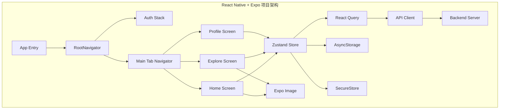
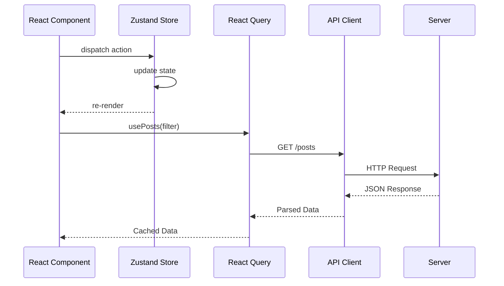

# React Native + Expo 完整项目搭建指南

> **版本信息**: Expo SDK 52.x | React Native 0.76.x | TypeScript 5.6 | React Navigation 7.x
> **目标读者**: 具备 React 基础，希望系统性掌握现代 React Native 工程化实践的开发者

---

## 概述

在 2025-2026 年的移动端开发领域，React Native 生态系统已经高度成熟。Expo 作为官方推荐的开发框架，提供了从开发到发布的完整工具链。Expo SDK 52+ 默认启用 New Architecture（Fabric + TurboModules），带来显著性能提升。对于以 TypeScript/JavaScript 为核心技术栈的团队，**Expo SDK 52+ 是 2026 年的最优解**。

### 跨平台框架对比

| 维度 | Expo + React Native | 裸 React Native | Flutter | Ionic/Capacitor |
|-----|-------------------|---------------|---------|----------------|
| **开发效率** | ⭐⭐⭐⭐⭐ 开箱即用 | ⭐⭐⭐ 需大量原生配置 | ⭐⭐⭐⭐ 热重载优秀 | ⭐⭐⭐⭐ Web 技术栈 |
| **性能表现** | ⭐⭐⭐⭐ 接近原生 | ⭐⭐⭐⭐ 接近原生 | ⭐⭐⭐⭐⭐ 自绘引擎 | ⭐⭐⭐ WebView 渲染 |
| **生态成熟度** | ⭐⭐⭐⭐⭐ npm 生态 | ⭐⭐⭐⭐⭐ npm 生态 | ⭐⭐⭐⭐ 快速增长 | ⭐⭐⭐⭐⭐ Web 生态 |
| **原生能力访问** | ⭐⭐⭐⭐ Expo Modules | ⭐⭐⭐⭐⭐ 无限制 | ⭐⭐⭐⭐ Platform Channels | ⭐⭐⭐ 插件受限 |
| **发布流程** | ⭐⭐⭐⭐⭐ EAS 自动化 | ⭐⭐⭐ 手动配置 | ⭐⭐⭐⭐ Codemagic | ⭐⭐⭐⭐ Capacitor |
| **OTA 更新** | ⭐⭐⭐⭐⭐ EAS Update | ⭐⭐ CodePush(弃用) | ⭐⭐ Shorebird | ⭐⭐ CodePush |

### Expo 工作流对比

| 特性 | Expo Go | Development Build | EAS Build |
|-----|---------|------------------|-----------|
| 启动速度 | ⚡ 极快 | 🚀 快 | 🐢 需等待云端构建 |
| 原生模块支持 | ❌ 仅限 SDK 内置 | ✅ 任意原生模块 | ✅ 任意原生模块 |
| 调试体验 | ⭐⭐⭐⭐⭐ 扫码即用 | ⭐⭐⭐⭐ 需安装 | ⭐⭐⭐ 生产环境 |
| 适用阶段 | 快速原型验证 | 日常开发 | 测试/生产发布 |

**推荐工作流**: 开发阶段使用 `Development Build`，配合 `expo-dev-client` 实现类似 Expo Go 的调试体验，同时支持任意原生模块。

---

## 核心内容

### 1. 环境准备与工具链

```bash
# Node.js 20.x LTS (推荐使用 nvm 或 fnm 管理)
nvm install 20
nvm use 20

# 包管理器选择 (pnpm 为 2026 年推荐)
npm install -g pnpm

# Expo CLI 工具
npm install -g expo-cli@latest

# EAS CLI (构建与发布)
npm install -g eas-cli@latest

# 验证安装
expo --version    # >= 12.0.0
eas --version     # >= 12.0.0
node --version    # >= 20.0.0
```

**iOS (仅限 macOS)**:

```bash
# 安装 Xcode 16+ (通过 Mac App Store)
# 安装 Xcode Command Line Tools
xcode-select --install

# 安装 CocoaPods
sudo gem install cocoapods

# 配置 iOS 模拟器
xcrun simctl list devices
```

**Android**:

```bash
# 安装 Android Studio Iguana+
# 配置 ANDROID_HOME 环境变量
export ANDROID_HOME=$HOME/Library/Android/sdk
export PATH=$PATH:$ANDROID_HOME/emulator:$ANDROID_HOME/platform-tools

# 创建模拟器 (Pixel 8 API 35)
avdmanager create avd -n Pixel8 -k "system-images;android-35;google_apis;x86_64"
```

### 2. 项目初始化与目录结构

```bash
# 使用 create-expo-app 初始化 (推荐 --template blank-typescript)
npx create-expo-app jsts-mobile-example --template blank-typescript

# 或者使用 pnpm
cd jsts-mobile-example
pnpm install
```

对于中大型项目，采用**功能优先 (Feature-First)** 的目录结构：

```
src/
├── components/           # 全局共享 UI 组件
│   ├── ui/              # 原子组件 (Button, Input, Card)
│   ├── forms/           # 表单专用组件
│   └── feedback/        # 反馈组件 (Toast, Modal, Skeleton)
├── screens/             # 页面级组件
│   ├── auth/            # 认证相关页面
│   ├── home/            # 首页模块
│   └── profile/         # 个人资料模块
├── navigation/          # 导航配置
│   ├── types.ts         # 导航类型定义
│   ├── linking.ts       # 深度链接配置
│   └── stacks/          # 各导航栈定义
├── hooks/               # 全局自定义 Hooks
├── stores/              # Zustand 状态存储
├── services/            # API 服务层
├── utils/               # 工具函数
├── types/               # 全局 TypeScript 类型
├── constants/           # 常量定义
└── i18n/                # 国际化
```

### 3. TypeScript 严格模式配置

**tsconfig.json**:

```json
{
  "extends": "expo/tsconfig.base",
  "compilerOptions": {
    "strict": true,
    "baseUrl": ".",
    "paths": {
      "@/*": ["src/*"]
    },
    "jsx": "react-jsx",
    "allowJs": true,
    "esModuleInterop": true,
    "skipLibCheck": true,
    "forceConsistentCasingInFileNames": true,
    "resolveJsonModule": true,
    "noUnusedLocals": true,
    "noUnusedParameters": true,
    "noImplicitReturns": true,
    "noFallthroughCasesInSwitch": true,
    "isolatedModules": true,
    "moduleResolution": "bundler",
    "allowImportingTsExtensions": false,
    "types": ["jest", "@testing-library/jest-native"]
  },
  "include": ["**/*.ts", "**/*.tsx", ".expo/types/**/*.ts", "expo-env.d.ts"],
  "exclude": ["node_modules", "babel.config.js", "metro.config.js"]
}
```

**路径别名配置 babel.config.js**:

```javascript
module.exports = function(api) {
  api.cache(true);
  return {
    presets: ['babel-preset-expo'],
    plugins: [
      [
        'module-resolver',
        {
          root: ['./src'],
          alias: {
            '@': './src',
            '@components': './src/components',
            '@screens': './src/screens',
            '@hooks': './src/hooks',
            '@utils': './src/utils',
            '@types': './src/types',
            '@stores': './src/stores',
            '@services': './src/services',
            '@constants': './src/constants',
          },
          extensions: ['.ts', '.tsx', '.js', '.jsx', '.json'],
        },
      ],
    ],
  };
};
```

### 4. 导航系统集成

安装依赖：

```bash
# 核心导航库
pnpm add @react-navigation/native
pnpm add @react-navigation/native-stack
pnpm add @react-navigation/bottom-tabs

# 必需依赖
pnpm add react-native-screens react-native-safe-area-context

# 手势处理 (用于 Modal 和抽屉导航)
pnpm add react-native-gesture-handler

# 动画库 (用于共享元素过渡)
pnpm add react-native-reanimated
```

**根导航器实现**:

```typescript
// src/navigation/RootNavigator.tsx
import React from 'react';
import { createNativeStackNavigator } from '@react-navigation/native-stack';
import { NavigationContainer } from '@react-navigation/native';
import { RootStackParamList } from '@types/navigation';
import { useAuthStore } from '@stores/authStore';
import { MainTabNavigator } from './MainTabNavigator';
import { AuthNavigator } from './AuthNavigator';
import { PostDetailScreen } from '@screens/PostDetailScreen';
import { linking } from './linking';

const Stack = createNativeStackNavigator<RootStackParamList>();

export function RootNavigator(): JSX.Element {
  const isAuthenticated = useAuthStore((state) => state.isAuthenticated);

  return (
    <NavigationContainer linking={linking}>
      <Stack.Navigator screenOptions={&#123; headerShown: false &#125;}>
        &#123;isAuthenticated ? (
          <>
            <Stack.Screen name="Main" component=&#123;MainTabNavigator&#125; />
            <Stack.Screen
              name="PostDetail"
              component=&#123;PostDetailScreen&#125;
              options=&#123;&#123;
                headerShown: true,
                title: '帖子详情',
                animation: 'slide_from_right',
              &#125;&#125;
            />
          </>
        ) : (
          <Stack.Screen
            name="Auth"
            component=&#123;AuthNavigator&#125;
            options=&#123;&#123; animation: 'none' &#125;&#125;
          />
        )&#125;
      </Stack.Navigator>
    </NavigationContainer>
  );
}
```

**导航类型安全**:

```typescript
// src/types/navigation.ts
import { NavigatorScreenParams } from '@react-navigation/native';
import { NativeStackScreenProps } from '@react-navigation/native-stack';
import { BottomTabScreenProps } from '@react-navigation/bottom-tabs';

export type RootStackParamList = {
  Main: NavigatorScreenParams<MainTabParamList>;
  Auth: NavigatorScreenParams<AuthStackParamList>;
  PostDetail: &#123; postId: string &#125;;
  Profile: &#123; userId?: string &#125;;
  Settings: undefined;
};

export type MainTabParamList = {
  Home: undefined;
  Explore: undefined;
  Create: undefined;
  Notifications: undefined;
  MyProfile: undefined;
};

export type AuthStackParamList = {
  Login: undefined;
  Register: undefined;
  ForgotPassword: &#123; email?: string &#125;;
};

// 全局声明增强
declare global {
  namespace ReactNavigation {
    interface RootParamList extends RootStackParamList &#123;&#125;
  }
}
```

### 5. 状态管理架构设计

现代 React Native 应用的状态应分为三类：

| 状态类型 | 管理工具 | 示例 | 持久化 |
|---------|---------|------|--------|
| **服务端状态** | React Query / SWR | 帖子列表、用户信息 | HTTP 缓存 |
| **全局客户端状态** | Zustand / Jotai | 认证状态、主题设置 | AsyncStorage |
| **局部 UI 状态** | useState / useReducer | 表单输入、Modal 显隐 | 否 |

**Zustand 认证状态管理**:

```typescript
// src/stores/authStore.ts
import { create } from 'zustand';
import { persist, createJSONStorage } from 'zustand/middleware';
import AsyncStorage from '@react-native-async-storage/async-storage';
import * as SecureStore from 'expo-secure-store';
import { User, AuthStatus } from '@types/models';
import { authService } from '@services/authService';

interface AuthState {
  user: User | null;
  token: string | null;
  status: AuthStatus;
  isAuthenticated: boolean;
  login: (email: string, password: string) => Promise<void>;
  logout: () => Promise<void>;
}

export const useAuthStore = create<AuthState>()(
  persist(
    (set, get) => (&#123;
      user: null,
      token: null,
      status: 'idle',
      isAuthenticated: false,

      login: async (email, password) => &#123;
        set(&#123; status: 'loading' &#125;);
        try &#123;
          const response = await authService.login(&#123; email, password &#125;);
          await SecureStore.setItemAsync('auth_token', response.token);
          set(&#123;
            user: response.user,
            token: response.token,
            status: 'authenticated',
            isAuthenticated: true,
          &#125;);
        &#125; catch (error) &#123;
          set(&#123; status: 'unauthenticated' &#125;);
          throw error;
        &#125;
      &#125;,

      logout: async () => &#123;
        await SecureStore.deleteItemAsync('auth_token');
        set(&#123;
          user: null,
          token: null,
          status: 'unauthenticated',
          isAuthenticated: false,
        &#125;);
      &#125;,
    &#125;),
    &#123;
      name: 'auth-store',
      storage: createJSONStorage(() => AsyncStorage),
      partialize: (state) => (&#123;
        user: state.user,
        status: state.status,
        isAuthenticated: state.isAuthenticated,
      &#125;),
    &#125;
  )
);
```

### 6. 网络层封装

```typescript
// src/services/api.ts
import axios, { AxiosInstance, AxiosError, InternalAxiosRequestConfig } from 'axios';
import { Platform } from 'react-native';
import * as SecureStore from 'expo-secure-store';

const API_BASE_URL = process.env.EXPO_PUBLIC_API_URL || 'https://api.example.com/v1';

class ApiClient &#123;
  private client: AxiosInstance;

  constructor() &#123;
    this.client = axios.create(&#123;
      baseURL: API_BASE_URL,
      timeout: 15000,
      headers: &#123;
        'Content-Type': 'application/json',
        Accept: 'application/json',
        'X-Platform': Platform.OS,
      &#125;,
    &#125;);

    this.setupInterceptors();
  &#125;

  private setupInterceptors() &#123;
    this.client.interceptors.request.use(
      async (config: InternalAxiosRequestConfig) => &#123;
        const token = await SecureStore.getItemAsync('auth_token');
        if (token && config.headers) &#123;
          config.headers.Authorization = `Bearer $&#123;token&#125;`;
        &#125;
        return config;
      &#125;,
      (error) => Promise.reject(error)
    );

    this.client.interceptors.response.use(
      (response) => response,
      async (error: AxiosError) => &#123;
        if (error.response?.status === 401) &#123;
          // 处理 Token 刷新或登出
        &#125;
        return Promise.reject(error);
      &#125;
    );
  &#125;

  get instance() &#123;
    return this.client;
  &#125;
&#125;

export const apiClient = new ApiClient().instance;
```

### 7. 表单处理与验证

```typescript
// src/utils/validation.ts
import { z } from 'zod';

export const loginSchema = z.object(&#123;
  email: z.string().min(1, '邮箱不能为空').email('请输入有效的邮箱地址'),
  password: z
    .string()
    .min(8, '密码至少需要8个字符')
    .regex(/[A-Z]/, '密码必须包含至少一个大写字母')
    .regex(/[a-z]/, '密码必须包含至少一个小写字母')
    .regex(/[0-9]/, '密码必须包含至少一个数字'),
&#125;);

export type LoginFormData = z.infer<typeof loginSchema>;
```

### 8. 网络层封装

```typescript
// src/services/api.ts
import axios, { AxiosInstance, AxiosError, InternalAxiosRequestConfig } from 'axios';
import { Platform } from 'react-native';
import * as SecureStore from 'expo-secure-store';

const API_BASE_URL = process.env.EXPO_PUBLIC_API_URL || 'https://api.example.com/v1';

class ApiClient {
  private client: AxiosInstance;
  private isRefreshing = false;
  private refreshSubscribers: Array<(token: string) => void> = [];

  constructor() {
    this.client = axios.create({
      baseURL: API_BASE_URL,
      timeout: 15000,
      headers: {
        'Content-Type': 'application/json',
        Accept: 'application/json',
        'X-Platform': Platform.OS,
        'X-App-Version': process.env.EXPO_PUBLIC_APP_VERSION || '1.0.0',
      },
    });
    this.setupInterceptors();
  }

  private setupInterceptors() {
    this.client.interceptors.request.use(
      async (config: InternalAxiosRequestConfig) => {
        const token = await SecureStore.getItemAsync('auth_token');
        if (token && config.headers) {
          config.headers.Authorization = `Bearer ${token}`;
        }
        return config;
      },
      (error) => Promise.reject(error)
    );

    this.client.interceptors.response.use(
      (response) => response,
      async (error: AxiosError) => {
        const originalRequest = config as InternalAxiosRequestConfig & { _retry?: boolean };
        if (error.response?.status === 401 && !originalRequest._retry) {
          if (this.isRefreshing) {
            return new Promise((resolve) => {
              this.refreshSubscribers.push((token: string) => {
                originalRequest.headers!.Authorization = `Bearer ${token}`;
                resolve(this.client(originalRequest));
              });
            });
          }
          originalRequest._retry = true;
          this.isRefreshing = true;
          try {
            const refreshToken = await SecureStore.getItemAsync('refresh_token');
            const response = await axios.post(`${API_BASE_URL}/auth/refresh`, { refreshToken });
            const { token } = response.data;
            await SecureStore.setItemAsync('auth_token', token);
            this.refreshSubscribers.forEach((callback) => callback(token));
            this.refreshSubscribers = [];
            originalRequest.headers!.Authorization = `Bearer ${token}`;
            return this.client(originalRequest);
          } catch (refreshError) {
            useAuthStore.getState().logout();
            return Promise.reject(refreshError);
          } finally {
            this.isRefreshing = false;
          }
        }
        return Promise.reject(error);
      }
    );
  }

  get instance() {
    return this.client;
  }
}

export const apiClient = new ApiClient().instance;
```

### 9. 主题与国际化

```typescript
// src/hooks/useTheme.ts
import { useColorScheme } from 'react-native';
import { create } from 'zustand';
import { persist, createJSONStorage } from 'zustand/middleware';
import AsyncStorage from '@react-native-async-storage/async-storage';

export type ThemeMode = 'light' | 'dark' | 'system';

interface ThemeStore &#123;
  mode: ThemeMode;
  setMode: (mode: ThemeMode) => void;
&#125;

export const useThemeStore = create<ThemeStore>()(
  persist(
    (set) => (&#123;
      mode: 'system',
      setMode: (mode: ThemeMode) => set(&#123; mode &#125;),
    &#125;),
    &#123;
      name: 'theme-storage',
      storage: createJSONStorage(() => AsyncStorage),
    &#125;
  )
);

export interface ThemeColors &#123;
  background: string;
  surface: string;
  primary: string;
  text: string;
  textSecondary: string;
  border: string;
  error: string;
  success: string;
&#125;

const lightColors: ThemeColors = &#123;
  background: '#FFFFFF',
  surface: '#F2F2F7',
  primary: '#007AFF',
  text: '#000000',
  textSecondary: '#666666',
  border: '#E5E5EA',
  error: '#FF3B30',
  success: '#34C759',
&#125;;

const darkColors: ThemeColors = &#123;
  background: '#0A0A0A',
  surface: '#1C1C1E',
  primary: '#0A84FF',
  text: '#FFFFFF',
  textSecondary: '#8E8E93',
  border: '#38383A',
  error: '#FF453A',
  success: '#30D158',
&#125;;

export function useTheme() &#123;
  const systemColorScheme = useColorScheme();
  const &#123; mode &#125; = useThemeStore();
  const isDark = mode === 'dark' || (mode === 'system' && systemColorScheme === 'dark');
  return &#123; isDark, colors: isDark ? darkColors : lightColors &#125;;
&#125;
```

---

## Mermaid 图表

### 项目架构图



### 状态管理数据流



---

## 最佳实践总结

1. **Expo SDK 52** 默认启用 New Architecture，带来显著性能提升
2. **Zustand + React Query** 的组合是状态管理的黄金标准，服务端状态与客户端状态分离
3. **FlashList** 替代 FlatList 可大幅提升长列表性能
4. **Expo Image** 统一了跨平台的图片加载体验，支持智能缓存和格式转换
5. **EAS Build/Update** 提供了企业级的 CI/CD 和 OTA 能力
6. **TypeScript 严格模式** 和路径别名是大型项目的必备基础设施
7. **SecureStore** 用于存储敏感信息（Token），`AsyncStorage` 用于普通数据
8. **Development Build** 是日常开发的最佳工作流，平衡了调试体验和原生模块支持

### 常见陷阱与解决方案

| 陷阱 | 现象 | 解决方案 |
|-----|------|---------|
| Metro 缓存导致依赖更新不生效 | `Module not found` | `npx expo start --clear` |
| iOS Pod 安装失败 | `pod install` 报错 | `pod deintegrate && pod install --repo-update` |
| Android 构建内存不足 | `:app:mergeDexRelease` OOM | `org.gradle.jvmargs=-Xmx4096m` |
| TypeScript 路径别名运行时失效 | Metro 打包报错 | 确保 `babel-plugin-module-resolver` 已安装并正确配置 |
| Expo SDK 升级后原生构建失败 | iOS/Android 构建报错 | `rm -rf node_modules && npx expo prebuild --clean` |

---

## 参考资源

1. [Expo 官方文档](https://docs.expo.dev/) — Expo 官方维护的最权威文档，包含 SDK 52 完整 API 参考和 New Architecture 迁移指南
2. [React Native 官方文档 - New Architecture](https://reactnative.dev/docs/new-architecture-intro) — Meta 官方对新架构（Fabric + TurboModules + JSI）的深入介绍
3. [React Navigation 文档](https://reactnavigation.org/) — React Native 导航的事实标准，v7 版本深度集成新架构
4. [Zustand 文档](https://docs.pmnd.rs/zustand) — 轻量级状态管理库，支持 TypeScript 和中间件生态
5. [React Query 文档](https://tanstack.com/query/latest) — TanStack Query 官方文档，服务端状态管理的最佳实践

---

> 本文档基于 Expo SDK 52 和 React Native 0.76 编写，建议配合官方文档进行实践。下一步建议阅读 [React Native 新架构深度解析](./react-native-new-architecture.md)，深入了解 Fabric 渲染器和 TurboModules 的工作原理。
