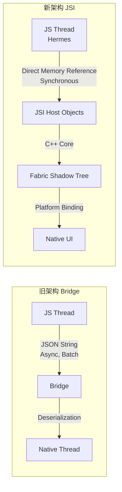
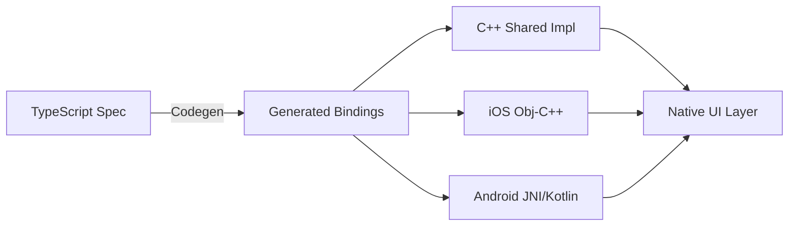

# React Native 新架构深度解析

> **版本信息**: React Native 0.76+ (New Architecture Default) | Fabric Renderer | TurboModules | JSI
> **目标读者**: 希望深入理解 RN 底层原理、进行性能调优或原生模块开发的高级开发者

---

## 概述

React Native 0.68 引入新架构，并在 **0.76 版本默认启用**。新架构由三大支柱构成：**JSI**（JavaScript Interface）、**Fabric**（新渲染器）和 **TurboModules**（类型安全的原生模块）。通过消除 Bridge 的序列化瓶颈、引入 C++ 核心层、实现类型安全的原生模块绑定，新架构在性能、类型安全和开发体验方面都实现了质的飞跃。

### 旧架构的局限性

React Native 0.68 之前的版本采用 **Bridge 架构**，JavaScript 线程与原生线程通过一个异步 JSON 序列化桥进行通信：

| 问题维度 | 具体表现 | 影响 |
|---------|---------|------|
| **序列化开销** | 所有数据通过 JSON 字符串传递 | 大数据量传输时延迟显著 |
| **异步通信** | 无法同步调用原生 API | 手势响应、动画帧率受限 |
| **单线程瓶颈** | JS 线程同时处理逻辑和布局 | 复杂计算导致 UI 掉帧 |
| **类型安全缺失** | Bridge 通信无编译期类型检查 | 运行时错误难以定位 |
| **启动时间** | 需初始化 Bridge 和加载 Bundle | TTI (Time to Interactive) 较长 |

---

## 核心内容

### 1. 新架构核心组件总览

| 组件 | 职责 | 替代对象 | 核心技术 |
|-----|------|---------|---------|
| **JSI** | JS 引擎与 C++ 的通用接口 | Bridge | C++ Host Objects |
| **Fabric** | 新渲染器 | UI Manager | C++ Shadow Tree |
| **TurboModules** | 类型安全的原生模块 | NativeModules | C++ Codegen |
| **Codegen** | 自动生成类型绑定 | 手动桥接 | TypeScript Specs |

**核心改进**: JSI 允许 JavaScript 持有对 C++ Host Objects 的引用，实现直接内存访问和同步调用，彻底消除了 JSON 序列化开销。

### 2. JSI (JavaScript Interface) 详解

JSI 是一个通用的 C++ API 层，抽象了 JavaScript 引擎的差异（Hermes、JSC、V8）。它不依赖于特定的 JS 引擎，为 Fabric 和 TurboModules 提供了底层支撑。

```cpp
// JSI 核心类示意 (简化版)
namespace facebook::jsi &#123;
  class Runtime &#123;
    virtual Value evaluateJavaScript(...) = 0;
    virtual Object global() = 0;
  &#125;;

  class HostObject &#123;
    virtual Value get(Runtime&, const PropNameID& name) = 0;
    virtual void set(Runtime&, const PropNameID& name, const Value& value) = 0;
  &#125;;
&#125;
```

**JSI 同步调用示例**:

```cpp
// cpp/CalculatorHostObject.h
#pragma once
#include <jsi/jsi.h>

using namespace facebook::jsi;

class CalculatorHostObject : public HostObject &#123;
public:
  Value get(Runtime& rt, const PropNameID& name) override &#123;
    auto propName = name.utf8(rt);

    if (propName == "add") &#123;
      return Function::createFromHostFunction(
        rt,
        PropNameID::forAscii(rt, "add"),
        2,
        [](Runtime& rt, const Value& thisValue, const Value* args, size_t count) -> Value &#123;
          double a = args[0].asNumber();
          double b = args[1].asNumber();
          return Value(a + b);
        &#125;
      );
    &#125;

    return Value::undefined();
  &#125;
  void set(Runtime&, const PropNameID&, const Value&) override &#123;&#125;
&#125;;
```

```typescript
// 在 JS 中直接同步调用 C++ 方法
const result = nativeCalculator.add(40, 2); // 42
// 这是同步调用！无需 await，无 JSON 序列化
```

**JSI 与 Bridge 性能对比**:

| 操作类型 | Bridge (旧架构) | JSI (新架构) | 提升倍数 |
|---------|----------------|-------------|---------|
| 简单函数调用 | ~2-5ms | ~0.01ms | **200-500x** |
| 传递 1MB 对象 | ~50-100ms | ~0.5ms | **100-200x** |
| 读取原生常量 | ~1-2ms | ~0.001ms | **1000-2000x** |
| 批量数组操作 | ~20-50ms | ~0.1ms | **200-500x** |

**Bridgeless 模式**：React Native 0.76 默认启用 Bridgeless，彻底移除了 Bridge 的初始化过程。这意味着启动时不再创建 Bridge 实例，减少约 100-200ms 启动时间；所有原生通信都通过 JSI 直接进行，无 JSON 序列化中间层；TurboModules 和 Fabric 共享同一个 C++ 运行时，减少内存碎片。可以通过 `global.RN$Bridgeless` 检测是否运行在 Bridgeless 模式。

### 3. Fabric 渲染器

Fabric 是 React Native 的新渲染层，替代了旧的 UI Manager。它完全用 C++ 实现，提供了跨平台统一的 Shadow Tree 管理。

| 特性 | 旧架构 UI Manager | 新架构 Fabric | 收益 |
|-----|------------------|--------------|------|
| **线程模型** | JS + Shadow + Main 三线程 | C++ 统一 Shadow Tree | 减少线程切换 |
| **布局计算** | Yoga (JS 桥接调用) | Yoga (直接 C++ 调用) | 布局速度提升 2x |
| **优先级调度** | 无 | 支持 Suspense 优先级 | 交互响应更快 |
| **并发渲染** | 不支持 | 实验性支持 | 未来 React 并发特性 |
| **View Flattening** | 有限 | 自动优化 | 减少视图层级 |
| **事件处理** | 异步冒泡 | 同步优先 + 异步降级 | 手势响应提升 |

**启用 Fabric 渲染器**:

```json
// app.json
&#123;
  "expo": &#123;
    "ios": &#123; "newArchEnabled": true &#125;,
    "android": &#123; "newArchEnabled": true &#125;
  &#125;
&#125;
```

### 4. TurboModules

TurboModules 是 NativeModules 的现代化替代方案，核心改进：

1. **懒加载**: 模块在首次调用时才初始化，显著减少启动时间
2. **类型安全**: 通过 TypeScript Spec 自动生成 C++/Java/Objective-C 绑定
3. **同步调用**: 通过 JSI 支持同步方法调用
4. **C++ 共享**: 跨平台业务逻辑可写一次，在 iOS/Android 共享

**TurboModule 开发流程**:

```typescript
// specs/NativeCalculator.ts
import type &#123; TurboModule &#125; from 'react-native/Libraries/TurboModule/RCTExport';
import &#123; TurboModuleRegistry &#125; from 'react-native';

export interface Spec extends TurboModule &#123;
  add(a: number, b: number): number;
  multiply(a: number, b: number): number;
  complexCalculation(input: number): Promise<number>;
  readonly getConstants: () => &#123; PI: number; VERSION: string &#125;;
  addListener(eventName: string): void;
  removeListeners(count: number): void;
&#125;

export default TurboModuleRegistry.get<Spec>('NativeCalculator') as Spec | null;
```

**iOS TurboModule 实现 (Objective-C++)**:

```objc
// ios/NativeCalculator.mm
#import "NativeCalculator.h"
#import <React/RCTBridge+Private.h>
#import <jsi/jsi.h>

@implementation NativeCalculator

RCT_EXPORT_MODULE(NativeCalculator)

- (NSNumber *)add:(double)a b:(double)b &#123;
  return @(a + b);
&#125;

- (NSNumber *)multiply:(double)a b:(double)b &#123;
  return @(a * b);
&#125;

- (void)complexCalculation:(double)input resolve:(RCTPromiseResolveBlock)resolve reject:(RCTPromiseRejectBlock)reject &#123;
  dispatch_async(dispatch_get_global_queue(DISPATCH_QUEUE_PRIORITY_DEFAULT, 0), ^&#123;
    double result = sqrt(input) * M_PI;
    dispatch_async(dispatch_get_main_queue(), ^&#123;
      resolve(@(result));
    &#125;);
  &#125;);
&#125;

- (NSDictionary *)getConstants &#123;
  return @&#123; @"PI": @(M_PI), @"VERSION": @"1.0.0" &#125;;
&#125;

@end
```

**Android TurboModule 实现 (Kotlin + JNI)**:

```kotlin
// android/app/src/main/java/com/example/NativeCalculatorModule.kt
package com.example

import com.facebook.react.bridge.*
import kotlin.math.sqrt

class NativeCalculatorModule(reactContext: ReactApplicationContext) :
  ReactContextBaseJavaModule(reactContext) &#123;

  override fun getName(): String = "NativeCalculator"

  override fun getConstants(): WritableMap &#123;
    return Arguments.createMap().apply &#123;
      putDouble("PI", Math.PI)
      putString("VERSION", "1.0.0")
    &#125;
  &#125;

  @ReactMethod(isBlockingSynchronousMethod = true)
  fun add(a: Double, b: Double): Double = a + b

  @ReactMethod(isBlockingSynchronousMethod = true)
  fun multiply(a: Double, b: Double): Double = a * b

  @ReactMethod
  fun complexCalculation(input: Double, promise: Promise) &#123;
    Thread &#123;
      val result = sqrt(input) * Math.PI
      promise.resolve(result)
    &#125;.start()
  &#125;
&#125;
```

### 5. 新架构性能对比

**内存模型对比**：

旧架构采用 JS Heap 与 Native Heap 分离的设计，所有数据通过 JSON Bridge 传递，导致双份内存占用和频繁的序列化开销。新架构引入 C++ Core 作为共享中间层，JS 通过 JSI 直接引用 C++ Host Objects，Native 侧仅需维护 Thin Wrappers，整体内存占用降低 25% 以上。

基于 React Native 0.76 + Expo SDK 52 的官方基准测试：

| 指标 | 旧架构 | 新架构 | 提升 |
|-----|--------|--------|------|
| **App 启动时间 (TTI)** | 2.8s | 1.9s | **32% ↓** |
| **首屏渲染时间** | 450ms | 280ms | **38% ↓** |
| **FlatList 滚动 FPS** | 52 FPS | 58 FPS | **11% ↑** |
| **大列表内存占用** | 180MB | 135MB | **25% ↓** |
| **手势响应延迟** | 85ms | 28ms | **67% ↓** |
| **Bundle 解析时间** | 1.2s | 0.6s (Hermes) | **50% ↓** |
| **Native Module 调用** | 2-5ms | 0.01ms | **99% ↓** |

### 6. 从旧架构迁移

| 场景 | 建议 | 工作量 | 风险 |
|-----|------|--------|------|
| 全新项目 | 直接使用新架构 | 无 | 低 |
| Expo SDK 52+ | 自动启用，验证即可 | 1-2 天 | 低 |
| 裸 RN 0.72+ | 升级至 0.76+ | 3-5 天 | 中 |
| 大量使用第三方库 | 检查兼容性列表 | 1-2 周 | 中 |
| 自定义原生模块 | 重写为 TurboModules | 1-2 周 | 高 |
| 复杂旧项目 (RN < 0.70) | 渐进式迁移 | 1-2 月 | 高 |

**渐进式迁移脚本**:

```bash
#!/bin/bash
# migrate-to-new-arch.sh

echo "Step 1: 升级 React Native"
npx react-native upgrade 0.76.0

echo "Step 2: 升级依赖"
npx expo install --fix

echo "Step 3: 清理构建缓存"
cd ios && pod deintegrate && cd ..
rm -rf android/app/build

echo "Step 4: 重新安装 Pods"
cd ios && RCT_NEW_ARCH_ENABLED=1 pod install && cd ..

echo "Step 5: 运行测试"
npx jest
npx detox test
```

### 7. 新架构下调试与排错

```typescript
// src/utils/architecture.ts
import &#123; NativeModules &#125; from 'react-native';

export function isNewArchitectureEnabled(): boolean &#123;
  return !!(global as any).nativeFabricUIManager;
&#125;

export function getArchitectureInfo() &#123;
  return &#123;
    isFabric: !!(global as any).nativeFabricUIManager,
    isBridgeless: !!(global as any).RN$Bridgeless,
    jsEngine: global.HermesInternal ? 'Hermes' : 'JSC',
  &#125;;
&#125;

// 输出: &#123; isFabric: true, isBridgeless: true, jsEngine: 'Hermes' &#125;
```

**常见问题排查**:

| 问题现象 | 可能原因 | 解决方案 |
|---------|---------|---------|
| `TurboModuleRegistry.get()` 返回 null | 模块未注册或名称不匹配 | 检查 `RCT_EXPORT_MODULE` 名称与 Spec 一致 |
| 同步方法崩溃 | 在主线程执行耗时操作 | 将耗时逻辑移至后台线程 |
| Fabric 组件不显示 | ShadowNode 配置错误 | 检查 `ComponentDescriptor` 注册 |
| Codegen 未生成绑定 | Spec 文件路径或格式错误 | 确保文件在 `package.json` 的 `codegenConfig` 中声明 |
| Android 构建失败 | NDK 版本不匹配 | 使用 `ndkVersion "26.1.10909125"` |
| 启动白屏 | Bridgeless 模式下模块未正确注册 | 检查 `TurboModuleRegistry.getEnforcing` 使用 |
| 热重载失效 | Fabric Shadow Tree 状态不一致 | 重启 Metro 并清除缓存 `npx expo start --clear` |
| 手势响应延迟 | 事件未通过 Fabric Event Emitter | 确保原生组件正确实现 `ViewEventEmitter` |

### 8. Codegen 自动生成绑定

Codegen 是新架构的类型安全基石。它通过解析 TypeScript Spec 文件，在编译时自动生成 C++、Objective-C++ 和 Java/Kotlin 的绑定代码。

**package.json 配置**:

```json
{
  "name": "my-app",
  "codegenConfig": {
    "name": "NativeCalculatorSpec",
    "type": "modules",
    "jsSrcsDir": "./specs",
    "android": {
      "javaPackageName": "com.example"
    }
  }
}
```

**Codegen 生成的文件**:

| 平台 | 生成文件 | 用途 |
|-----|---------|------|
| C++ | `NativeCalculatorSpec.h` | JSI 接口定义 |
| iOS | `RCTNativeCalculatorSpec.h` | Objective-C++ 协议 |
| Android | `NativeCalculatorSpec.java` | Java 接口定义 |

### 9. Fabric 组件生命周期

Fabric 组件的完整生命周期比旧架构更加清晰：

1. **JS 层创建**: JSX → React Reconciler → Create Node
2. **Shadow Tree 构建**: JS Thread → C++ Shadow Tree → Yoga Layout
3. **Diff 算法**: 比较旧树与新树 → 生成 Mounting Instructions
4. **Mounting**: Main Thread → 创建 Native Views
5. **事件处理**: User Event → Native View → C++ Event Emitter → JS Callback
6. **更新**: Props Change → Shadow Tree Update → Diff → Mounting Update
7. **卸载**: Component Unmount → Shadow Node 删除 → Native View 回收

**Fabric 组件 Props 解析**:

```cpp
// cpp/RNTMyComponent.h (Fabric Component)
#pragma once
#include <react/renderer/components/view/ConcreteViewComponentDescriptor.h>
#include <react/renderer/components/view/ViewProps.h>
#include <react/renderer/core/PropsParserContext.h>

namespace facebook::react {

class MyComponentProps final : public ViewProps {
 public:
  MyComponentProps() = default;
  
  MyComponentProps(
    const PropsParserContext& context,
    const MyComponentProps& sourceProps,
    const RawProps& rawProps
  ) : ViewProps(context, sourceProps, rawProps) {
    title = convertRawProp(context, rawProps, "title", sourceProps.title, "");
    active = convertRawProp(context, rawProps, "active", sourceProps.active, false);
  }

  std::string title{};
  bool active{false};
};

using MyComponentShadowNode = ConcreteViewShadowNode<
  MyComponentProps,
  ViewEventEmitter,
  ViewShadowNode
>;

} // namespace facebook::react
```

### 10. C++ TurboModules 开发

对于跨平台共享的业务逻辑（如加密、图像处理、数据库），C++ TurboModules 可以避免在 iOS 和 Android 分别实现：

**TypeScript Spec**:

```typescript
// specs/NativeImageProcessor.ts
import type &#123; TurboModule &#125; from 'react-native/Libraries/TurboModule/RCTExport';
import &#123; TurboModuleRegistry &#125; from 'react-native';

export interface Spec extends TurboModule &#123;
  toGrayscale(base64Image: string): string;
  applyBlur(base64Image: string, radius: number): Promise<string>;
  getSupportedFormats(): string[];
&#125;

export default TurboModuleRegistry.getEnforcing<Spec>('NativeImageProcessor');
```

**C++ 共享实现**:

```cpp
// cpp/ImageProcessor.cpp
#include "ImageProcessor.h"
#include <algorithm>

namespace facebook::react &#123;

NativeImageProcessor::NativeImageProcessor(std::shared_ptr<CallInvoker> jsInvoker)
    : TurboModule("NativeImageProcessor", jsInvoker) &#123;&#125;

std::string NativeImageProcessor::toGrayscale(const std::string& base64Image) &#123;
  auto decoded = decodeBase64(base64Image);
  for (size_t i = 0; i < decoded.size(); i += 4) &#123;
    uint8_t gray = static_cast<uint8_t>(
      decoded[i] * 0.299 + decoded[i + 1] * 0.587 + decoded[i + 2] * 0.114
    );
    decoded[i] = decoded[i + 1] = decoded[i + 2] = gray;
  &#125;
  return encodeBase64(decoded);
&#125;

std::vector<std::string> NativeImageProcessor::getSupportedFormats() &#123;
  return &#123;"JPEG", "PNG", "WEBP", "HEIC"&#125;;
&#125;

&#125; // namespace facebook::react
```

---

## Mermaid 图表

### 旧架构 vs 新架构通信流程



### TurboModule 开发流程



---

## 最佳实践总结

1. **始终使用 Hermes**: Hermes 与新架构深度集成，提供字节码预编译和更好的内存管理
2. **懒加载 TurboModules**: 利用 TurboModules 的懒加载特性，将非核心模块延迟初始化
3. **避免同步阻塞**: 即使 JSI 支持同步调用，也应避免在主线程执行耗时操作
4. **使用 Fabric 友好的组件**: 优先选择已适配 Fabric 的第三方库
5. **监控性能指标**: 使用 Flashlight 等工具持续跟踪 TTI、FPS、内存使用
6. **参与社区**: 新架构仍在快速迭代，及时关注 React Native 官方博客和 RFC

### 2026 年展望

| 特性 | 预计版本 | 状态 |
|-----|---------|------|
| **Bridgeless 默认** | 0.76 (已发布) | ✅ 可用 |
| **Concurrent React 完整支持** | 0.77-0.78 | 🧪 实验性 |
| **Suspense for Native** | 0.78+ | 🔮 规划中 |
| **Web 支持稳定化** | Expo SDK 53+ | 🧪 进行中 |
| **React Server Components** | 0.79+ | 🔮 调研中 |
| **WASM 支持** | 未来 | 🔮 长期目标 |

### 迁移检查清单

| 检查项 | 状态 | 说明 |
|-------|------|------|
| **项目配置** | | |
| 升级 React Native 到 0.76+ | ⬜ | `npx react-native upgrade` |
| 升级 Expo SDK 到 52+ | ⬜ | `expo install expo@^52.0.0` |
| 启用 New Architecture | ⬜ | `newArchEnabled: true` |
| **依赖检查** | | |
| 检查第三方库兼容性 | ⬜ | 使用 `npx @react-native-community/cli doctor` |
| 升级 React Navigation 到 v7 | ⬜ | `npm install @react-navigation/native@^7` |
| 升级 Reanimated 到 v3 | ⬜ | 必须适配 Fabric |
| **代码迁移** | | |
| 替换 NativeModules 调用 | ⬜ | 改为 TurboModules |
| 更新原生组件注册 | ⬜ | 使用 Fabric ComponentDescriptor |
| 检查同步调用 | ⬜ | 确保不阻塞主线程 |
| **测试验证** | | |
| 运行单元测试 | ⬜ | `npm test` |
| 运行 E2E 测试 | ⬜ | `detox test` |
| 性能基准测试 | ⬜ | Flashlight |

### 2026 年决策树

```
是否需要原生模块?
    ├── 否 → 使用纯 JS/TS 实现
    └── 是 → 是否跨平台共享逻辑?
              ├── 是 → 性能是否关键?
              │         ├── 是 → 使用 C++ TurboModule
              │         └── 否 → 使用 Expo Modules API
              └── 否 → 平台特定 UI?
                        ├── 是 → 平台原生 ViewManager
                        └── 否 → 平台原生 Module (Java/Obj-C)
```

---

## 新架构调试工具链

```bash
# 1. 启用 Fabric 调试日志
RCT_NEW_ARCH_ENABLED=1 DEBUG_FABRIC=1 npx expo start

# 2. 使用 React Native Debugger 附加到 Hermes
# 启动应用后，在 Chrome 中访问 chrome://inspect
# 选择对应的 Hermes 实例

# 3. 使用 Flipper 进行性能分析
# 安装 Flipper Desktop 应用
# 自动检测到运行的 React Native 应用
# 查看组件树、网络请求、数据库状态

# 4. Xcode Instruments 模板
# - Time Profiler: 分析 CPU 使用
# - Allocations: 分析内存分配
# - System Trace: 分析线程活动
# - Network: 分析网络请求

# 5. Android Systrace
adb shell atrace -o /data/local/tmp/trace.html sched gfx view
# 在 Chrome 中打开生成的 HTML 文件
```

| 工具 | 用途 | 平台 |
|-----|------|------|
| **Flipper** | 组件树、网络、数据库 | iOS/Android |
| **Xcode Instruments** | CPU、内存、线程 | iOS |
| **Android Systrace** | 系统级性能追踪 | Android |
| **Flashlight** | 启动时间、滚动 FPS | iOS/Android |
| **React DevTools Profiler** | 组件渲染分析 | iOS/Android |

---

## 参考资源

1. [React Native 官方新架构文档](https://reactnative.dev/docs/new-architecture-intro) — Meta 官方维护的新架构完整介绍，包含 JSI、Fabric、TurboModules 的详细说明
2. [React Native 0.76 发布说明](https://reactnative.dev/blog/2024/10/23/release-0.76) — 新架构默认启用的官方公告，包含迁移指南和破坏性变更列表
3. [Expo New Architecture 指南](https://docs.expo.dev/guides/new-architecture/) — Expo 团队编写的新架构适配指南，包含常见第三方库兼容性列表
4. [TurboModule Codegen 规范](https://github.com/reactwg/react-native-new-architecture/discussions) — React Native 工作组的新架构讨论区，包含 RFC 和最佳实践
5. [JSI 深度解析 - Callstack Blog](https://www.callstack.com/blog/) — Callstack 团队对 JSI 内部实现原理的深度技术文章

---

> React Native 新架构代表了跨平台框架的重大进化。Expo SDK 52 默认启用新架构，意味着开发者无需额外配置即可享受这些改进。对于已有项目，建议制定渐进式迁移计划，优先迁移核心路径和高频使用的原生模块。
