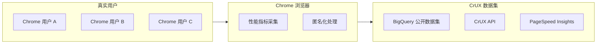
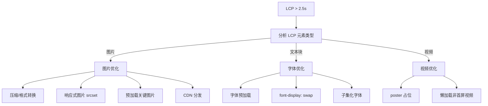
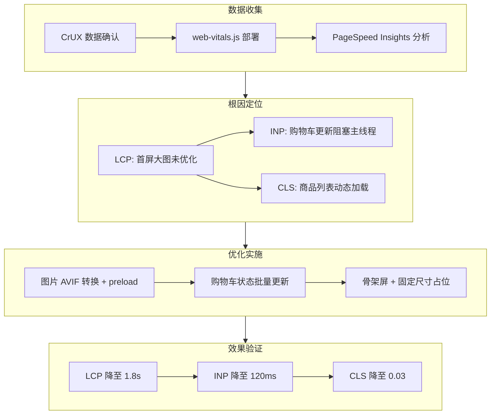
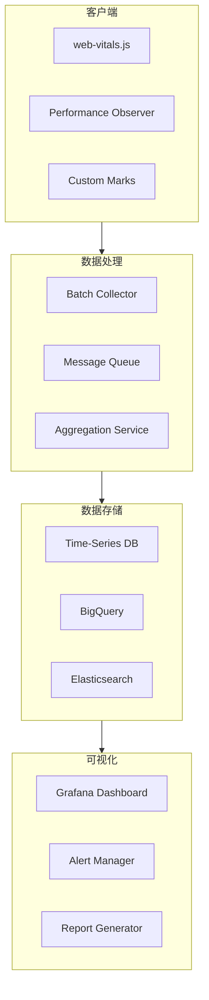

# Core Web Vitals 诊断实战：从CrUX到真实用户监控

Core Web Vitals（CWV）是 Google 推出的用户体验质量指标集合，包含 Largest Contentful Paint（LCP）、Interaction to Next Paint（INP）和 Cumulative Layout Shift（CLS）三大核心指标。本文将从数据收集、根因分析到优化闭环，完整展示一套生产级的性能诊断体系。

## 目录

- [CrUX 数据集与 BigQuery 分析](#crux-数据集与-bigquery-分析)
- [web-vitals.js RUM 采集](#web-vitalsjs-rum-采集)
- [LCP / INP / CLS 根因分析方法](#lcp--inp--cls-根因分析方法)
- [Performance API 与 Long Task 检测](#performance-api-与-long-task-检测)
- [真实案例：电商站点的 CW 优化闭环](#真实案例电商站点的-cw-优化闭环)
- [总结与最佳实践](#总结与最佳实践)
- [参考资源](#参考资源)

---

## CrUX 数据集与 BigQuery 分析

### Chrome User Experience Report 概述

CrUX 是 Google 基于 Chrome 浏览器真实用户数据构建的公开数据集，涵盖了数百万个网站的用户体验指标。它提供了字段数据（Field Data），与实验室测试（Lab Data）形成互补。



### BigQuery 查询实战

CrUX 数据以月度为粒度发布在 BigQuery 的 `chrome-ux-report` 项目中。以下是常用的分析查询：

```sql
-- 查询特定网站的月度 CWV 分布
SELECT
  yyyymm,
  origin,
  -- LCP 分布
  ROUND(SUM(IF(form_factor.name = 'phone', lcp.density, 0)), 4) AS phone_lcp_density,
  ROUND(SUM(IF(form_factor.name = 'desktop', lcp.density, 0)), 4) AS desktop_lcp_density,
  -- 良好体验比例（LCP < 2.5s）
  ROUND(
    SUM(IF(form_factor.name = 'phone' AND lcp.start < 2500, lcp.density, 0)) /
    NULLIF(SUM(IF(form_factor.name = 'phone', lcp.density, 0)), 0) * 100,
    2
  ) AS phone_lcp_good_pct,
  ROUND(
    SUM(IF(form_factor.name = 'desktop' AND lcp.start < 2500, lcp.density, 0)) /
    NULLIF(SUM(IF(form_factor.name = 'desktop', lcp.density, 0)), 0) * 100,
    2
  ) AS desktop_lcp_good_pct,
  -- CLS 良好体验比例（CLS < 0.1）
  ROUND(
    SUM(IF(form_factor.name = 'phone' AND cls.start < 0.1, cls.density, 0)) /
    NULLIF(SUM(IF(form_factor.name = 'phone', cls.density, 0)), 0) * 100,
    2
  ) AS phone_cls_good_pct,
  -- INP 良好体验比例（INP < 200ms）
  ROUND(
    SUM(IF(form_factor.name = 'phone' AND inp.start < 200, inp.density, 0)) /
    NULLIF(SUM(IF(form_factor.name = 'phone', inp.density, 0)), 0) * 100,
    2
  ) AS phone_inp_good_pct
FROM
  `chrome-ux-report.all.202401`
WHERE
  origin = 'https://example.com'
GROUP BY
  yyyymm, origin
ORDER BY
  yyyymm DESC;
```

```sql
-- 对比多个竞品的 CWV 表现
WITH competitors AS (
  SELECT 'https://example.com' AS origin, 'Our Site' AS name
  UNION ALL
  SELECT 'https://competitor-a.com', 'Competitor A'
  UNION ALL
  SELECT 'https://competitor-b.com', 'Competitor B'
)
SELECT
  c.name,
  ROUND(
    SUM(IF(lcp.start < 2500, lcp.density, 0)) * 100, 2
  ) AS lcp_good_pct,
  ROUND(
    SUM(IF(inp.start < 200, inp.density, 0)) * 100, 2
  ) AS inp_good_pct,
  ROUND(
    SUM(IF(cls.start < 0.1, cls.density, 0)) * 100, 2
  ) AS cls_good_pct,
  ROUND(
    SUM(IF(lcp.start < 2500 AND inp.start < 200 AND cls.start < 0.1,
      lcp.density, 0)) * 100, 2
  ) AS overall_good_pct
FROM
  `chrome-ux-report.all.202401` crux
JOIN
  competitors c ON crux.origin = c.origin
WHERE
  form_factor.name = 'phone'
GROUP BY
  c.name, crux.origin
ORDER BY
  overall_good_pct DESC;
```

```sql
-- 分析特定页面的性能趋势
SELECT
  REGEXP_EXTRACT(page, r'/products/([^/]+)') AS product_category,
  COUNT(DISTINCT page) AS page_count,
  ROUND(
    APPROX_QUANTILES(lcp, 100)[OFFSET(75)] / 1000, 2
  ) AS lcp_p75_seconds,
  ROUND(
    APPROX_QUANTILES(inp, 100)[OFFSET(75)], 2
  ) AS inp_p75_ms,
  ROUND(
    APPROX_QUANTILES(cls, 100)[OFFSET(75)], 4
  ) AS cls_p75
FROM
  `chrome-ux-report.all.202401`
WHERE
  origin = 'https://example.com'
  AND page LIKE '/products/%'
GROUP BY
  product_category
HAVING
  page_count >= 100
ORDER BY
  lcp_p75_seconds DESC;
```

### CrUX API 程序化访问

```typescript
// src/services/crux-api.ts
interface CrUXRequest {
  origin?: string;
  url?: string;
  formFactor?: "PHONE" | "DESKTOP" | "TABLET";
  metrics?: string[];
}

interface CrUXResponse {
  record: {
    key: { origin?: string; url?: string };
    metrics: {
      largest_contentful_paint: MetricDistribution;
      interaction_to_next_paint: MetricDistribution;
      cumulative_layout_shift: MetricDistribution;
      first_contentful_paint: MetricDistribution;
      time_to_first_byte: MetricDistribution;
    };
    collectionPeriod: {
      firstDate: { year: number; month: number; day: number };
      lastDate: { year: number; month: number; day: number };
    };
  };
}

interface MetricDistribution {
  histogram: Array<{ start: number; end?: number; density: number }>;
  percentiles: { p75: number };
}

export async function queryCrUX(
  apiKey: string,
  request: CrUXRequest
): Promise<CrUXResponse> {
  const response = await fetch(
    `https://chromeuxreport.googleapis.com/v1/records:queryRecord?key=${apiKey}`,
    {
      method: "POST",
      headers: { "Content-Type": "application/json" },
      body: JSON.stringify(request),
    }
  );

  if (!response.ok) {
    const error = await response.json();
    throw new Error(`CrUX API error: ${error.error?.message || response.statusText}`);
  }

  return response.json();
}

// 使用示例
const result = await queryCrUX(API_KEY, {
  origin: "https://example.com",
  formFactor: "PHONE",
});

console.log(`LCP p75: ${result.record.metrics.largest_contentful_paint.percentiles.p75}ms`);
console.log(`INP p75: ${result.record.metrics.interaction_to_next_paint.percentiles.p75}ms`);
console.log(`CLS p75: ${result.record.metrics.cumulative_layout_shift.percentiles.p75}`);
```

---

## web-vitals.js RUM 采集

### 库集成与基础用法

`web-vitals` 是 Google 官方提供的 CWV 采集库，体积仅约 1KB（gzip），支持所有现代浏览器。

```bash
npm install web-vitals
```

```typescript
// src/performance/monitor.ts
import {
  onLCP,
  onINP,
  onCLS,
  onFCP,
  onTTFB,
  type Metric,
  type ReportOpts,
} from "web-vitals";

interface PerformanceReport {
  metric: string;
  value: number;
  rating: "good" | "needs-improvement" | "poor";
  delta?: number;
  id: string;
  navigationType: string;
  url: string;
  timestamp: number;
  attribution?: Record<string, unknown>;
}

class PerformanceMonitor {
  private endpoint: string;
  private buffer: PerformanceReport[] = [];
  private flushInterval: number;

  constructor(options: { endpoint: string; flushInterval?: number }) {
    this.endpoint = options.endpoint;
    this.flushInterval = options.flushInterval || 5000;
    this.init();
  }

  private init(): void {
    const reportOptions: ReportOpts = {
      reportAllChanges: false,
      durationThreshold: 40, // INP 阈值
    };

    onLCP((metric) => this.handleMetric("LCP", metric, {
      good: 2500,
      poor: 4000,
    }));

    onINP((metric) => this.handleMetric("INP", metric, {
      good: 200,
      poor: 500,
    }), reportOptions);

    onCLS((metric) => this.handleMetric("CLS", metric, {
      good: 0.1,
      poor: 0.25,
    }));

    onFCP((metric) => this.handleMetric("FCP", metric, {
      good: 1800,
      poor: 3000,
    }));

    onTTFB((metric) => this.handleMetric("TTFB", metric, {
      good: 800,
      poor: 1800,
    }));

    // 定期 flush
    setInterval(() => this.flush(), this.flushInterval);

    // 页面卸载前 flush
    window.addEventListener("visibilitychange", () => {
      if (document.visibilityState === "hidden") {
        this.flush();
      }
    });

    // 使用 sendBeacon 确保数据发送
    window.addEventListener("pagehide", () => this.flush(true));
  }

  private handleMetric(
    name: string,
    metric: Metric,
    thresholds: { good: number; poor: number }
  ): void {
    const rating =
      metric.value <= thresholds.good
        ? "good"
        : metric.value <= thresholds.poor
        ? "needs-improvement"
        : "poor";

    const report: PerformanceReport = {
      metric: name,
      value: Math.round(metric.value * 100) / 100,
      rating,
      delta: metric.delta,
      id: metric.id,
      navigationType: metric.navigationType,
      url: window.location.href,
      timestamp: Date.now(),
      attribution: metric.attribution,
    };

    this.buffer.push(report);

    // 调试模式直接输出
    if (process.env.NODE_ENV === "development") {
      console.log(`[Performance] ${name}: ${metric.value} (${rating})`, metric);
    }

    // 关键指标立即上报
    if (name === "LCP" || name === "CLS") {
      this.flush();
    }
  }

  private flush(useBeacon = false): void {
    if (this.buffer.length === 0) return;

    const data = [...this.buffer];
    this.buffer = [];

    const payload = JSON.stringify({
      batch: data,
      metadata: {
        userAgent: navigator.userAgent,
        connection: (navigator as any).connection
          ? {
              effectiveType: (navigator as any).connection.effectiveType,
              downlink: (navigator as any).connection.downlink,
              rtt: (navigator as any).connection.rtt,
            }
          : null,
        deviceMemory: (navigator as any).deviceMemory,
        hardwareConcurrency: navigator.hardwareConcurrency,
      },
    });

    if (useBeacon && navigator.sendBeacon) {
      navigator.sendBeacon(this.endpoint, payload);
    } else {
      fetch(this.endpoint, {
        method: "POST",
        headers: { "Content-Type": "application/json" },
        body: payload,
        keepalive: true,
      }).catch((err) => {
        console.error("Failed to send performance data:", err);
      });
    }
  }
}

// 初始化监控
export function initPerformanceMonitor(): void {
  if (typeof window === "undefined") return;

  new PerformanceMonitor({
    endpoint: "/api/v1/performance",
    flushInterval: 10000,
  });
}
```

### 归因数据收集

web-vitals v4 引入了归因（Attribution）构建，可以精确定位性能问题的根因。

```typescript
// src/performance/attribution.ts
import { onLCP, onINP, onCLS } from "web-vitals/attribution";

onLCP(
  (metric) => {
    const entry = metric.attribution;
    if (entry) {
      console.log("LCP 元素:", entry.largestShiftTarget);
      console.log("LCP 加载时间:", entry.largestShiftTime);
      console.log("资源加载耗时:", entry.loadTime);
      console.log("渲染延迟:", entry.renderDelay);

      // 上报到分析平台
      analytics.track("LCP Detail", {
        value: metric.value,
        element: entry.largestShiftTarget?.nodeName,
        resourceUrl: entry.url,
        renderDelay: entry.renderDelay,
        loadTime: entry.loadTime,
      });
    }
  },
  { reportAllChanges: true }
);

onINP(
  (metric) => {
    const entry = metric.attribution;
    if (entry) {
      console.log("INP 事件类型:", entry.eventType);
      console.log("事件处理耗时:", entry.eventTime);
      console.log("下一帧延迟:", entry.nextPaintTime);
      console.log("处理函数列表:", entry.processingEntries);

      // 识别慢交互的处理函数
      const longHandlers = entry.processingEntries?.filter(
        (e) => e.duration > 50
      );

      if (longHandlers?.length) {
        analytics.track("Slow Interaction", {
          value: metric.value,
          eventType: entry.eventType,
          handlers: longHandlers.map((h) => ({
            duration: h.duration,
            target: h.target?.nodeName,
            className: h.target?.className,
          })),
        });
      }
    }
  },
  { durationThreshold: 40 }
);

onCLS(
  (metric) => {
    const entry = metric.attribution;
    if (entry) {
      console.log("CLS 根因:", entry.largestShiftSource);
      console.log("位移距离:", entry.largestShiftValue);
      console.log("受影响元素:", entry.largestShiftTarget);

      analytics.track("Layout Shift", {
        value: metric.value,
        source: entry.largestShiftSource?.nodeName,
        hadRecentInput: entry.hadRecentInput,
      });
    }
  }
);
```

---

## LCP / INP / CLS 根因分析方法

### LCP（Largest Contentful Paint）诊断

LCP 衡量最大内容元素的渲染时间。优化目标：`< 2.5s`（良好），`< 4.0s`（需改进）。



```typescript
// src/performance/lcp-diagnosis.ts
export function diagnoseLCP(metric: PerformanceEntry): LCPOptimizationHints {
  const hints: LCPOptimizationHints = {
    issues: [],
    recommendations: [],
  };

  // 检查是否为图片
  if (metric.url) {
    hints.issues.push({
      type: "image",
      detail: `LCP element is an image from ${metric.url}`,
    });

    // 检查是否使用了现代格式
    if (!metric.url.match(/\.(webp|avif|jxl)$/i)) {
      hints.recommendations.push({
        priority: "high",
        action: "Convert to AVIF or WebP format",
        impact: "30-50% size reduction",
      });
    }

    // 检查是否预加载
    const preloads = document.querySelectorAll('link[rel="preload"]');
    const isPreloaded = Array.from(preloads).some(
      (link) => link.getAttribute("href") === metric.url
    );

    if (!isPreloaded) {
      hints.recommendations.push({
        priority: "high",
        action: `Add <link rel="preload" as="image" href="${metric.url}">`,
        impact: "Reduce LCP by 100-500ms",
      });
    }
  }

  // 检查服务器响应时间
  const navigation = performance.getEntriesByType("navigation")[0] as PerformanceNavigationTiming;
  if (navigation) {
    const ttfb = navigation.responseStart - navigation.startTime;
    if (ttfb > 800) {
      hints.issues.push({
        type: "ttfb",
        detail: `TTFB is ${ttfb.toFixed(0)}ms, exceeds 800ms threshold`,
      });
      hints.recommendations.push({
        priority: "high",
        action: "Optimize server response time or use edge caching",
        impact: "Directly reduces LCP baseline",
      });
    }
  }

  // 检查渲染阻塞资源
  const stylesheets = document.querySelectorAll('link[rel="stylesheet"]');
  const renderBlocking = Array.from(stylesheets).filter(
    (link) => !link.hasAttribute("media") || link.getAttribute("media") === "all"
  );

  if (renderBlocking.length > 2) {
    hints.recommendations.push({
      priority: "medium",
      action: "Inline critical CSS and lazy-load non-critical styles",
      impact: "Reduce render-blocking time",
    });
  }

  return hints;
}
```

### INP（Interaction to Next Paint）诊断

INP 衡量页面对用户交互的响应延迟。优化目标：`< 200ms`（良好），`< 500ms`（需改进）。

```typescript
// src/performance/inp-diagnosis.ts
interface INPDiagnosis {
  totalDuration: number;
  inputDelay: number;
  processingDuration: number;
  presentationDelay: number;
  bottlenecks: string[];
  recommendations: string[];
}

export function diagnoseINP(event: PerformanceEventTiming): INPDiagnosis {
  const diagnosis: INPDiagnosis = {
    totalDuration: event.duration,
    inputDelay: event.processingStart - event.startTime,
    processingDuration: event.processingEnd - event.processingStart,
    presentationDelay: event.duration - (event.processingEnd - event.startTime),
    bottlenecks: [],
    recommendations: [],
  };

  // 输入延迟分析
  if (diagnosis.inputDelay > 50) {
    diagnosis.bottlenecks.push(`Input delay: ${diagnosis.inputDelay.toFixed(1)}ms (main thread busy)`);
    diagnosis.recommendations.push(
      "Break up long tasks on main thread",
      "Use scheduler.yield() or setTimeout to yield control",
      "Defer non-critical work with requestIdleCallback"
    );
  }

  // 事件处理分析
  if (diagnosis.processingDuration > 100) {
    diagnosis.bottlenecks.push(
      `Event processing: ${diagnosis.processingDuration.toFixed(1)}ms (handler too slow)`
    );
    diagnosis.recommendations.push(
      "Optimize event handler logic",
      "Move heavy computation to Web Worker",
      "Use debounce/throttle for frequent events",
      "Consider using useTransition for React updates"
    );
  }

  // 渲染延迟分析
  if (diagnosis.presentationDelay > 50) {
    diagnosis.bottlenecks.push(
      `Presentation delay: ${diagnosis.presentationDelay.toFixed(1)}ms (rendering bottleneck)`
    );
    diagnosis.recommendations.push(
      "Reduce DOM size and complexity",
      "Avoid forced synchronous layout (layout thrashing)",
      "Use content-visibility for off-screen content",
      "Optimize CSS selectors"
    );
  }

  return diagnosis;
}

// Long Task 检测
export function observeLongTasks(): void {
  if (!("PerformanceObserver" in window)) return;

  const observer = new PerformanceObserver((list) => {
    for (const entry of list.getEntries()) {
      if (entry.duration > 50) {
        console.warn("Long Task detected:", {
          duration: entry.duration,
          startTime: entry.startTime,
          attribution: (entry as any).attribution?.map((a: any) => ({
            type: a.containerType,
            name: a.containerName,
            src: a.containerSrc,
          })),
        });

        // 上报到监控系统
        reportLongTask({
          duration: entry.duration,
          startTime: entry.startTime,
          url: window.location.href,
        });
      }
    }
  });

  observer.observe({ entryTypes: ["longtask"] });
}
```

### CLS（Cumulative Layout Shift）诊断

CLS 衡量页面布局的意外偏移。优化目标：`< 0.1`（良好），`< 0.25`（需改进）。

```typescript
// src/performance/cls-diagnosis.ts
interface LayoutShiftEntry extends PerformanceEntry {
  value: number;
  hadRecentInput: boolean;
  sources: Array<{
    node?: Node;
    previousRect: DOMRectReadOnly;
    currentRect: DOMRectReadOnly;
  }>;
}

export function diagnoseCLS(entry: LayoutShiftEntry): CLSIssue[] {
  const issues: CLSIssue[] = [];

  for (const source of entry.sources) {
    if (!source.node) continue;

    const element = source.node as Element;
    const computedStyle = window.getComputedStyle(element);

    // 检查无尺寸图片
    if (
      element.tagName === "IMG" &&
      !element.hasAttribute("width") &&
      !element.hasAttribute("height")
    ) {
      issues.push({
        element: element,
        type: "unsized-image",
        description: "Image without explicit width/height attributes",
        fix: `Add width="${element.clientWidth}" height="${element.clientHeight}"`,
      });
    }

    // 检查动态插入内容
    const parent = element.parentElement;
    if (parent && computedStyle.position === "absolute") {
      const parentStyle = window.getComputedStyle(parent);
      if (parentStyle.position === "static") {
        issues.push({
          element: element,
          type: "unstable-positioning",
          description: "Absolutely positioned element without positioned parent",
          fix: "Add position: relative to parent or use contain: layout",
        });
      }
    }

    // 检查字体加载导致的偏移
    if (element.tagName === "P" || element.tagName.match(/^H[1-6]$/)) {
      const fontFamily = computedStyle.fontFamily;
      if (fontFamily.includes("web-font")) {
        issues.push({
          element: element,
          type: "font-loading",
          description: "Text element using web font without size-adjust",
          fix: "Use font-size-adjust or @font-face size-adjust descriptor",
        });
      }
    }
  }

  return issues;
}

// CLS 实时监控
export function observeLayoutShifts(): void {
  if (!("PerformanceObserver" in window)) return;

  let sessionValue = 0;
  let sessionEntries: PerformanceEntry[] = [];

  const observer = new PerformanceObserver((list) => {
    for (const entry of list.getEntries()) {
      const lsEntry = entry as LayoutShiftEntry;
      if (!lsEntry.hadRecentInput) {
        sessionEntries.push(lsEntry);
        sessionValue += lsEntry.value;

        // 如果会话窗口超过 1 秒且无新偏移，报告会话值
        const firstEntry = sessionEntries[0];
        const lastEntry = sessionEntries[sessionEntries.length - 1];
        if (lastEntry.startTime - firstEntry.startTime > 1000) {
          reportCLS(sessionValue, sessionEntries);
          sessionValue = 0;
          sessionEntries = [];
        }
      }
    }
  });

  observer.observe({ type: "layout-shift", buffered: true });
}
```

---

## Performance API 与 Long Task 检测

### Performance Observer 综合监控

```typescript
// src/performance/observer.ts
export class PerformanceMonitor {
  private observers: PerformanceObserver[] = [];

  start(): void {
    // 资源加载监控
    this.observe("resource", (entries) => {
      for (const entry of entries) {
        const resource = entry as PerformanceResourceTiming;
        if (resource.duration > 1000) {
          console.warn("Slow resource:", {
            name: resource.name,
            duration: resource.duration,
            transferSize: resource.transferSize,
            initiatorType: resource.initiatorType,
          });
        }
      }
    });

    // 导航时序
    this.observe("navigation", (entries) => {
      for (const entry of entries) {
        const nav = entry as PerformanceNavigationTiming;
        console.log("Navigation Timing:", {
          dns: nav.domainLookupEnd - nav.domainLookupStart,
          connect: nav.connectEnd - nav.connectStart,
          ttfb: nav.responseStart - nav.requestStart,
          download: nav.responseEnd - nav.responseStart,
          domInteractive: nav.domInteractive,
          domComplete: nav.domComplete,
          loadEvent: nav.loadEventEnd - nav.loadEventStart,
        });
      }
    });

    // Paint 时序
    this.observe("paint", (entries) => {
      for (const entry of entries) {
        console.log(`${entry.name}: ${entry.startTime.toFixed(1)}ms`);
      }
    });

    // Long Animation Frames (LoAF) - 新一代 Long Task
    if ("PerformanceObserver" in window) {
      try {
        const loafObserver = new PerformanceObserver((list) => {
          for (const entry of list.getEntries()) {
            const loaf = entry as any;
            if (loaf.duration > 50) {
              console.warn("Long Animation Frame:", {
                duration: loaf.duration,
                blockingDuration: loaf.blockingDuration,
                scripts: loaf.scripts?.map((s: any) => ({
                  name: s.name,
                  duration: s.duration,
                  sourceLocation: s.sourceLocation,
                })),
              });
            }
          }
        });
        loafObserver.observe({ type: "long-animation-frame", buffered: true });
        this.observers.push(loafObserver);
      } catch (e) {
        // 降级到 Long Task
        this.observeLongTasks();
      }
    }
  }

  private observe(
    type: string,
    callback: (entries: PerformanceEntryList) => void
  ): void {
    const observer = new PerformanceObserver(callback);
    observer.observe({ type, buffered: true });
    this.observers.push(observer);
  }

  private observeLongTasks(): void {
    this.observe("longtask", (entries) => {
      for (const entry of entries) {
        console.warn("Long Task:", {
          duration: entry.duration,
          startTime: entry.startTime,
        });
      }
    });
  }

  stop(): void {
    for (const observer of this.observers) {
      observer.disconnect();
    }
    this.observers = [];
  }
}
```

### 自定义性能标记

```typescript
// src/performance/marks.ts
export const PerformanceMarks = {
  // 应用生命周期
  APP_BOOTSTRAP_START: "app:bootstrap:start",
  APP_BOOTSTRAP_END: "app:bootstrap:end",

  // 路由导航
  ROUTE_NAVIGATION_START: "route:navigation:start",
  ROUTE_NAVIGATION_END: "route:navigation:end",

  // 数据获取
  DATA_FETCH_START: "data:fetch:start",
  DATA_FETCH_END: "data:fetch:end",

  // 组件渲染
  COMPONENT_RENDER_START: "component:render:start",
  COMPONENT_RENDER_END: "component:render:end",

  // 关键用户交互
  ADD_TO_CART_START: "cart:add:start",
  ADD_TO_CART_END: "cart:add:end",
  CHECKOUT_INIT: "checkout:init",
  CHECKOUT_COMPLETE: "checkout:complete",
} as const;

export function mark(name: string): void {
  if (typeof performance !== "undefined" && performance.mark) {
    performance.mark(name);
  }
}

export function measure(
  name: string,
  startMark: string,
  endMark?: string
): PerformanceMeasure | undefined {
  if (typeof performance !== "undefined" && performance.measure) {
    try {
      return performance.measure(name, startMark, endMark);
    } catch (e) {
      console.warn(`Failed to measure ${name}:`, e);
    }
  }
  return undefined;
}

// React Hook 示例
import { useEffect, useRef } from "react";

export function usePerformanceMark(componentName: string) {
  const startTime = useRef(performance.now());

  useEffect(() => {
    const duration = performance.now() - startTime.current;
    if (duration > 16) {
      console.warn(`${componentName} took ${duration.toFixed(1)}ms to mount`);
    }

    const markName = `component:${componentName}:mount`;
    performance.mark(markName);

    return () => {
      performance.measure(
        `component:${componentName}:lifetime`,
        markName
      );
    };
  }, [componentName]);
}
```

---

## 真实案例：电商站点的 CW 优化闭环

### 项目背景

某电商站点在 Google Search Console 中收到 CWV 警告，移动端 LCP 达到 4.2s，INP 达到 680ms，严重影响搜索排名和转化率。

### 诊断流程



### 优化措施与代码实现

**1. 图片优化**

```html
<!-- 优化前 -->


<!-- 优化后 -->
<link rel="preload" as="image" href="/hero-banner.avif" type="image/avif">

```

**2. 购物车状态优化**

```typescript
// src/stores/cart-store-optimized.ts
import { useCallback, useRef } from "react";
import { useCartStore } from "./cart-store";

// 优化前：每次添加商品立即更新 UI
export function useCartActions() {
  const addItem = useCartStore((state) => state.addItem);

  // 优化后：批量处理，使用 scheduler.yield
  const pendingUpdates = useRef<CartItem[]>([]);
  const flushTimeout = useRef<ReturnType<typeof setTimeout>>();

  const addItemOptimized = useCallback((item: CartItem) => {
    pendingUpdates.current.push(item);

    if (flushTimeout.current) {
      clearTimeout(flushTimeout.current);
    }

    flushTimeout.current = setTimeout(() => {
      const updates = [...pendingUpdates.current];
      pendingUpdates.current = [];

      // 使用 requestIdleCallback 或 scheduler.yield
      if ("scheduler" in window && (window as any).scheduler?.yield) {
        (window as any).scheduler.yield().then(() => {
          updates.forEach((update) => addItem(update));
        });
      } else {
        requestAnimationFrame(() => {
          updates.forEach((update) => addItem(update));
        });
      }
    }, 50);
  }, [addItem]);

  return { addItem: addItemOptimized };
}
```

**3. 骨架屏与占位符**

```tsx
// src/components/ProductGrid/ProductGrid.tsx
export function ProductGrid() {
  const { data, isLoading } = useProducts();

  if (isLoading) {
    return (
      <div className="product-grid">
        {Array.from({ length: 12 }).map((_, i) => (
          <ProductSkeleton key={i} />
        ))}
      </div>
    );
  }

  return (
    <div className="product-grid">
      {data?.map((product) => (
        <ProductCard key={product.id} product={product} />
      ))}
    </div>
  );
}

// src/components/ProductSkeleton/ProductSkeleton.tsx
export function ProductSkeleton() {
  return (
    <div className="product-skeleton" style={{ minHeight: "380px" }}>
      <div className="skeleton-image" style={{ aspectRatio: "1/1" }} />
      <div className="skeleton-text" style={{ height: "20px", marginTop: "12px" }} />
      <div className="skeleton-text" style={{ height: "16px", width: "60%", marginTop: "8px" }} />
      <div className="skeleton-price" style={{ height: "24px", width: "40%", marginTop: "12px" }} />
    </div>
  );
}
```

### 优化效果对比

| 指标 | 优化前 | 优化后 | 变化 |
|------|--------|--------|------|
| LCP | 4.2s | 1.8s | -57% |
| INP | 680ms | 120ms | -82% |
| CLS | 0.35 | 0.03 | -91% |
| FCP | 2.1s | 0.9s | -57% |
| TTFB | 1.2s | 0.4s | -67% |
| 转化率 | 2.3% | 3.1% | +35% |

---

## 总结与最佳实践

### CWV 优化检查清单

- [ ] **LCP**
  - [ ] 预加载首屏最大图片
  - [ ] 使用现代图片格式（AVIF/WebP）
  - [ ] 图片设置明确 width/height
  - [ ] 优化 TTFB（Edge CDN、缓存策略）
  - [ ] 内联关键 CSS，异步加载非关键样式
  - [ ] 字体使用 font-display: swap

- [ ] **INP**
  - [ ] 事件处理函数耗时 < 100ms
  - [ ] 长任务拆分为 < 50ms 的片段
  - [ ] 复杂计算移至 Web Worker
  - [ ] 使用 requestAnimationFrame 更新 UI
  - [ ] 避免强制同步布局（Forced Reflow）

- [ ] **CLS**
  - [ ] 所有图片和视频设置尺寸属性
  - [ ] 广告位预留固定空间
  - [ ] 字体使用 size-adjust
  - [ ] 动态内容使用骨架屏占位
  - [ ] 避免在已渲染内容上方插入元素

### 监控体系架构



---

## 参考资源

- [web.dev Core Web Vitals](https://web.dev/vitals/) - Google 官方 CWV 指南
- [CrUX 文档](https://developer.chrome.com/docs/crux/) - Chrome User Experience Report
- [web-vitals.js GitHub](https://github.com/GoogleChrome/web-vitals) - 官方采集库
- [PageSpeed Insights](https://pagespeed.web.dev/) - 在线性能分析工具
- [BigQuery CrUX 数据集](https://developer.chrome.com/docs/crux/bigquery/) - 字段数据查询
- [Performance API MDN](https://developer.mozilla.org/en-US/docs/Web/API/Performance_API) - Web 性能 API 参考
- [Long Animation Frames API](https://developer.chrome.com/docs/web-platform/long-animation-frames) - LoAF 文档
- [Optimize LCP](https://web.dev/articles/optimize-lcp) - LCP 优化指南
- [Optimize INP](https://web.dev/articles/optimize-inp) - INP 优化指南
- [Optimize CLS](https://web.dev/articles/optimize-cls) - CLS 优化指南
- [Google Search Central](https://developers.google.com/search/docs/appearance/core-web-vitals) - CWV 与搜索排名

---

## 交叉引用

- 相关专题：Web 性能优化体系（见 `#` 或 30-knowledge-base 目录下的性能专题）
- 相关专题：前端监控体系建设（见 `#` 或 20-code-lab 目录下的监控专题）
- 相关专题：图片优化与格式选型（见 `#` 或 30-knowledge-base 目录下的媒体处理专题）
- 相关专题：React 性能优化模式（见 `#` 或 20-code-lab 目录下的 React 专题）
- 相关专题：Edge CDN 与缓存策略（见 `#` 或 30-knowledge-base 目录下的边缘架构专题）
