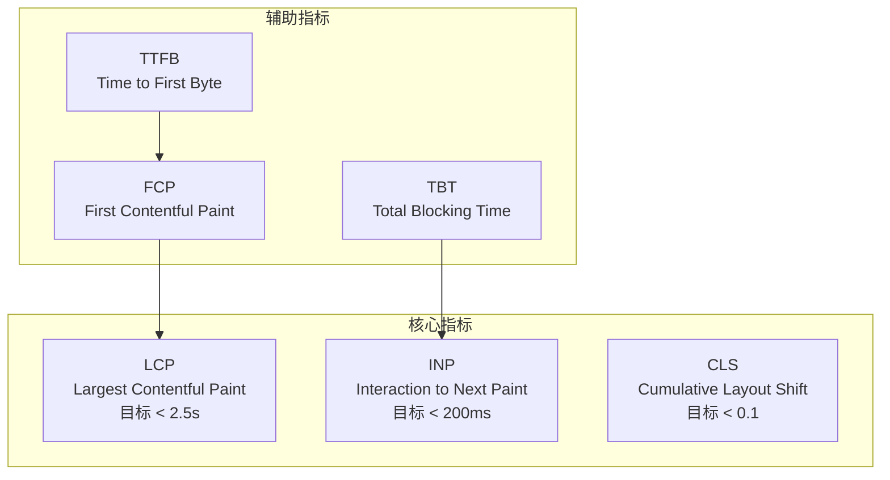
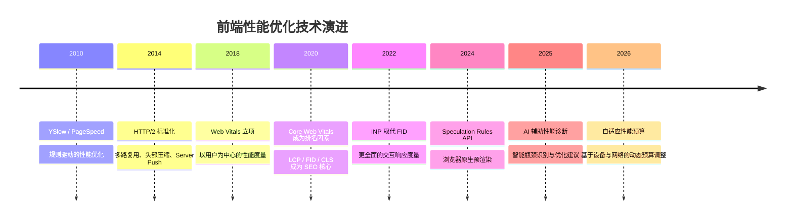

# ⚡ 性能优化示例

> 性能是用户体验的隐形基石。研究表明，当页面加载时间从 1 秒增加到 3 秒时，跳出率上升 32%；当达到 5 秒时，近 90% 的用户会选择离开。本示例库提供从度量、诊断到优化的完整性能工程实践，所有示例均附带可量化的基准数据与 TypeScript 类型安全保证。

现代 Web 应用的性能优化已从“经验驱动”进化为“数据驱动”。Google Web Vitals 提供了标准化的用户体验度量体系，Chrome DevTools 与 Lighthouse 赋予开发者诊断瓶颈的显微镜，而构建工具链的持续演进（Vite、Turbopack、SWC）则为性能优化提供了工程化手段。本目录的示例遵循以下设计原则：

- **度量先行**：每个优化方案均明确标注优化前后的量化指标对比
- **渐进增强**：从低成本的配置优化到高成本的架构重构，提供分级策略
- **框架无关**：核心原理适用于 React、Vue、Svelte 及 Vanilla JS 项目
- **生产验证**：所有优化策略均经过真实生产环境或高仿真基准测试验证

---

## 学习路径


### 各阶段关键产出

| 阶段 | 核心技能 | 预期产出 | 验证标准 |
|------|---------|---------|---------|
| **度量诊断** | 掌握 Lighthouse、DevTools Performance、Web Vitals 库 | 建立性能基线报告 | LCP / INP / CLS 可量化 |
| **Web Vitals** | 理解三大核心指标的影响因素与优化手段 | 所有指标达到 "Good" 等级 | Lighthouse 评分 > 90 |
| **渲染优化** | 识别并消除布局抖动、强制同步布局、长任务 | 主线程长任务 < 50ms | INP < 200ms |
| **打包优化** | Tree Shaking、Code Splitting、预加载策略 | 首包体积减少 > 30% | FCP < 1.8s |
| **内存优化** | 诊断内存泄漏、优化数据结构、减少 GC 压力 | 内存占用稳定无增长 | 无 Detached DOM Tree |
| **网络加速** | 资源优先级、HTTP/2 推送替代、Edge Caching | TTFB < 600ms | LCP < 2.5s |

---

## 性能度量体系

性能优化的第一步是建立可靠的度量体系。Google Web Vitals 是当前业界最广泛采用的用户体验度量标准：



### 核心指标详解

| 指标 | 定义 | 目标值 | 测量工具 | 主要影响因素 |
|------|------|--------|---------|------------|
| **LCP** | 最大内容元素渲染时间 | < 2.5s | Lighthouse, RUM | 服务器响应、资源加载、渲染阻塞 |
| **INP** | 交互到下一帧绘制延迟 | < 200ms | Chrome 108+, RUM | JavaScript 执行、主线程阻塞 |
| **CLS** | 累积布局偏移 | < 0.1 | Lighthouse, RUM | 图片/字体尺寸缺失、动态插入内容 |
| **TTFB** | 首字节时间 | < 600ms | WebPageTest, RUM | 服务器处理、CDN、网络延迟 |
| **FCP** | 首次内容绘制 | < 1.8s | Lighthouse | 渲染阻塞资源、字体加载 |
| **TBT** | 总阻塞时间 | < 200ms | Lighthouse | 长 JavaScript 任务 |

---

## Web Vitals 深度优化

Web Vitals 优化是前端性能工程的核心战场。本示例库提供完整的 Web Vitals 优化实战指南。

### 示例文档

| 主题 | 文件 | 难度 | 预计时长 |
|------|------|------|---------|
| Web Vitals 优化实战完整指南 | [查看](./web-vitals-optimization.md) | 中级 | 60 min |

### LCP 优化策略矩阵

LCP 元素通常是首屏最大的图片、视频或文本块。优化 LCP 需要系统性地减少从请求到渲染的每个环节耗时：

| 优化方向 | 具体措施 | 预期收益 | 实施成本 |
|---------|---------|---------|---------|
| **服务器响应** | 启用 Edge SSR、优化数据库查询、连接池 | -200~500ms | 中 |
| **资源预加载** | `<link rel="preload">` 关键图片 / 字体 | -100~300ms | 低 |
| **图片优化** | WebP/AVIF、响应式图片、懒加载非首屏 | -200~800ms | 低 |
| **渲染阻塞** | 内联关键 CSS、异步加载非关键 JS | -100~400ms | 中 |
| **CDN 加速** | 静态资源全球分发、缓存策略优化 | -50~300ms | 低 |

```html
<!-- LCP 图片预加载示例 -->
<link rel="preload" as="image" href="/hero.webp" type="image/webp" fetchpriority="high">

<!-- 响应式图片 -->
<picture>
  <source srcset="/hero.avif" type="image/avif">
  <source srcset="/hero.webp" type="image/webp">
  
</picture>
```

### INP 优化：消除长任务

INP（Interaction to Next Paint）衡量用户交互的响应延迟。主线程上的长 JavaScript 任务是 INP 劣化的首要原因。

```typescript
// ❌ 阻塞主线程的长任务
function processLargeDataset(data: Item[]): Result[] {
  return data
    .filter(filterFn)
    .map(transformFn)
    .sort(compareFn);
}

// ✅ 使用 Scheduler + yield 切片执行
async function processLargeDatasetYielding(
  data: Item[],
  chunkSize: number = 100
): Promise<Result[]> {
  const results: Result[] = [];
  for (let i = 0; i < data.length; i += chunkSize) {
    const chunk = data.slice(i, i + chunkSize);
    results.push(...chunk.filter(filterFn).map(transformFn));
    // 让出主线程
    if (i + chunkSize < data.length) {
      await new Promise((resolve) => setTimeout(resolve, 0));
    }
  }
  return results.sort(compareFn);
}
```

### CLS 优化：防止布局偏移

布局偏移通常由未指定尺寸的图片、延迟加载的字体或动态插入的内容引起。

```css
/* 为图片预留空间，避免加载后布局偏移 */
img, video {
  aspect-ratio: attr(width) / attr(height);
  max-width: 100%;
  height: auto;
}

/* 字体显示策略：避免 FOIT / FOUT */
@font-face {
  font-family: 'CustomFont';
  src: url('/fonts/custom.woff2') format('woff2');
  font-display: swap; /* 或 optional */
}

/* 为动态内容预留最小高度 */
.ad-container {
  min-height: 250px;
  background: #f0f0f0;
}
```

---

## 渲染性能调优

浏览器渲染流水线包含 JavaScript → Style → Layout → Paint → Composite 五个阶段。理解各阶段的触发条件是优化渲染性能的基础。

### 渲染流水线优化矩阵

| 优化目标 | 避免的操作 | 推荐替代方案 | 影响的阶段 |
|---------|-----------|------------|-----------|
| 消除强制同步布局 | 在读取 offsetHeight 后立即修改样式 | 批量读写分离（FastDOM） | Layout |
| 减少重绘面积 | 大面积元素的颜色/背景变化 | 使用 transform 替代位置变化 | Paint |
| 提升合成层 | 动画元素未提升为独立层 | `transform: translateZ(0)` 或 `will-change` | Composite |
| 限制样式计算 | 深层嵌套选择器、全局选择器 | BEM、CSS Modules、Scoped CSS | Style |

### 使用 CSS Containment 隔离渲染

```css
/* 隔离卡片组件的渲染范围 */
.card {
  contain: layout style paint;
}

/* 对长列表项使用 content-visibility */
.feed-item {
  content-visibility: auto;
  contain-intrinsic-size: 0 200px;
}
```

### 虚拟列表实现

长列表是前端最常见的性能瓶颈之一。虚拟列表（Virtual Scrolling）只渲染可视区域内的元素：

```typescript
interface VirtualListConfig {
  itemHeight: number;
  containerHeight: number;
  totalItems: number;
  overscan?: number;
}

function useVirtualList(config: VirtualListConfig) {
  const { itemHeight, containerHeight, totalItems, overscan = 5 } = config;
  const [scrollTop, setScrollTop] = useState(0);

  const visibleCount = Math.ceil(containerHeight / itemHeight);
  const startIndex = Math.max(0, Math.floor(scrollTop / itemHeight) - overscan);
  const endIndex = Math.min(totalItems, startIndex + visibleCount + overscan * 2);

  const virtualItems = useMemo(() => {
    return Array.from({ length: endIndex - startIndex }, (_, i) => ({
      index: startIndex + i,
      style: {
        position: 'absolute' as const,
        top: (startIndex + i) * itemHeight,
        height: itemHeight,
      },
    }));
  }, [startIndex, endIndex, itemHeight]);

  const totalHeight = totalItems * itemHeight;

  return { virtualItems, totalHeight, setScrollTop };
}
```

---

## 打包与加载优化

现代构建工具提供了丰富的优化手段，从 Tree Shaking 到 Module Federation，开发者需要根据项目规模与架构选择合适的策略。

### 构建工具对比

| 工具 | 编译速度 | Tree Shaking | Code Splitting | HMR | 推荐场景 |
|------|---------|-------------|---------------|-----|---------|
| **Vite** | 极快 | 优秀（Rollup） | 内置 | 极快 | 现代项目、库开发 |
| **Webpack** | 中等 | 优秀 | 内置 | 中等 | 企业级复杂配置 |
| **Turbopack** | 快 | 良好 | 内置 | 快 | Next.js 项目 |
| **esbuild** | 极快 | 良好 | 需插件 | 无 | 工具链、脚本 |
| **SWC** | 极快 | 不适用（仅转译） | 不适用 | 快 | 大型代码库转译 |

### Tree Shaking 最佳实践

```typescript
// ✅ 使用具名导出，便于 Tree Shaking
export { formatDate, parseDate } from './date-utils';

// ❌ 避免统一的命名空间导出
export * as utils from './utils'; // 可能导致全量打包

// package.json 中明确标记 sideEffects
{
  "sideEffects": [
    "*.css",
    "*.global.ts"
  ]
}
```

### 路由级 Code Splitting

```typescript
import { lazy, Suspense } from 'react';

// 路由级懒加载
const Dashboard = lazy(() => import('./pages/Dashboard'));
const Settings = lazy(() => import('./pages/Settings'));

function App() {
  return (
    <Suspense fallback={<PageSkeleton />}>
      <Routes>
        <Route path="/dashboard" element={<Dashboard />} />
        <Route path="/settings" element={<Settings />} />
      </Routes>
    </Suspense>
  );
}
```

### 预加载与预获取策略

```typescript
// 基于用户行为的智能预加载
function usePrefetchOnHover(href: string) {
  const prefetch = () => {
    const link = document.createElement('link');
    link.rel = 'prefetch';
    link.href = href;
    document.head.appendChild(link);
  };

  return { onMouseEnter: prefetch };
}

// 关键资源预加载
<link rel="preload" href="/critical.css" as="style">
<link rel="preload" href="/font.woff2" as="font" type="font/woff2" crossorigin>
<link rel="modulepreload" href="/entry.js">
```

---

## 内存管理优化

JavaScript 的自动垃圾回收并不意味着开发者可以忽视内存问题。单页应用（SPA）的长期运行特性使内存泄漏成为常见问题。

### 常见内存泄漏模式

| 模式 | 原因 | 检测方法 | 解决方案 |
|------|------|---------|---------|
| **闭包陷阱** | 事件回调持有大对象引用 | Heap Snapshot 对比 | 使用 WeakMap / WeakRef |
| **被遗忘的定时器** | setInterval 未清理 | Performance Monitor | 组件卸载时清理 |
| **DOM 引用游离** | 移除 DOM 但 JS 仍引用 | Detached DOM Tree | 移除时同步清理引用 |
| **全局变量污染** | 意外挂载到 window | 静态分析 ESLint | 严格模式 + IIFE |
| **订阅未取消** | RxJS / EventEmitter | Memory Timeline | 使用 takeUntil / AbortController |

### WeakRef 与 FinalizationRegistry

```typescript
class ImageCache {
  private cache = new Map<string, WeakRef<HTMLImageElement>>();
  private cleanup = new FinalizationRegistry<string>((key) => {
    this.cache.delete(key);
    console.log(`Cleaned up cache entry: ${key}`);
  });

  set(key: string, image: HTMLImageElement) {
    const ref = new WeakRef(image);
    this.cache.set(key, ref);
    this.cleanup.register(image, key);
  }

  get(key: string): HTMLImageElement | undefined {
    const ref = this.cache.get(key);
    return ref?.deref();
  }
}
```

### 大数据集处理优化

```typescript
// ❌ 直接处理大数组导致长任务与 GC 压力
function processAllItems(items: LargeItem[]) {
  return items.map(heavyTransform).filter(isValid);
}

// ✅ 使用 TypedArray 与分块处理
function processItemsEfficiently(
  items: LargeItem[],
  onProgress?: (percent: number) => void
): ValidItem[] {
  const results: ValidItem[] = [];
  const total = items.length;

  for (let i = 0; i < total; i++) {
    const transformed = heavyTransform(items[i]);
    if (isValid(transformed)) {
      results.push(transformed);
    }

    // 每处理 1000 项报告进度，让出主线程
    if (i % 1000 === 0) {
      onProgress?.(Math.round((i / total) * 100));
    }
  }

  return results;
}
```

---

## 网络与缓存优化

网络是前端性能的根本瓶颈之一。优化策略涵盖资源优先级、传输协议、压缩与多级缓存。

### 资源优先级管理

```html
<!-- 最高优先级：LCP 图片 -->


<!-- 低优先级：首屏不可见图片 -->


<!-- 预连接到关键域名 -->
<link rel="preconnect" href="https://api.example.com">
<link rel="dns-prefetch" href="https://cdn.example.com">
```

### Service Worker 缓存策略

```typescript
// sw.ts - Workbox 缓存策略配置
import { precacheAndRoute } from 'workbox-precaching';
import { registerRoute } from 'workbox-routing';
import { StaleWhileRevalidate, CacheFirst } from 'workbox-strategies';

// 预缓存构建产物
precacheAndRoute(self.__WB_MANIFEST);

// API 数据：Stale While Revalidate
registerRoute(
  ({ url }) => url.pathname.startsWith('/api/'),
  new StaleWhileRevalidate({
    cacheName: 'api-cache',
    plugins: [
      {
        cacheWillUpdate: async ({ response }) => {
          if (response && response.status === 200) {
            return response;
          }
          return null;
        },
      },
    ],
  })
);

// 静态资源：Cache First
registerRoute(
  ({ request }) => request.destination === 'image',
  new CacheFirst({
    cacheName: 'image-cache',
    plugins: [],
  })
);
```

### 压缩与编码

| 算法 | 适用资源 | 压缩率 | 兼容性 |
|------|---------|--------|--------|
| **Gzip** | 通用 | ~70% | 全浏览器 |
| **Brotli** | 通用 | ~80% | 现代浏览器 |
| **AVIF** | 图片 | ~50% vs WebP | 现代浏览器 |
| **WebP** | 图片 | ~30% vs JPEG | 现代浏览器 |

---

## 运行时与引擎优化

### V8 优化技巧

V8 引擎的 Hidden Class 与 Inline Cache 机制对代码性能有显著影响：

```typescript
// ✅ 保持对象形状一致（Monomorphic）
interface Point { x: number; y: number; }

function distance(p: Point): number {
  return Math.sqrt(p.x * p.x + p.y * p.y);
}

// ❌ 避免动态添加属性（导致字典模式）
const obj: any = { x: 1 };
obj.y = 2; // V8 退化为慢速字典模式

// ✅ 使用 Map 处理动态键
const map = new Map<string, number>();
map.set('x', 1);
map.set('y', 2);
```

### Web Worker 并行计算

```typescript
// worker.ts
self.onmessage = (event: MessageEvent<number[]>) => {
  const data = event.data;
  const result = heavyComputation(data);
  self.postMessage(result);
};

function heavyComputation(data: number[]): number[] {
  return data.map((n) => expensiveMath(n));
}

// main.ts
const worker = new Worker(new URL('./worker.ts', import.meta.url));

function processInWorker(data: number[]): Promise<number[]> {
  return new Promise((resolve) => {
    worker.postMessage(data);
    worker.onmessage = (e) => resolve(e.data);
  });
}
```

---

## 与性能工程专题的映射

本示例库与网站的 [性能工程](/performance-engineering/) 理论专题形成**实践-理论双轨**映射关系。建议结合阅读以获得系统性理解。

| 示例主题 | 理论支撑 | 关键概念 |
|---------|---------|---------|
| [Web Vitals 优化](./web-vitals-optimization.md) | [性能工程](/performance-engineering/) — 性能基础理论、渲染性能、网络优化 | 关键渲染路径、RAIL 模型、性能预算 |
| 渲染性能调优 | [性能工程](/performance-engineering/) — 渲染性能深度解析 | 合成层、CSS Containment、虚拟列表 |
| 打包与加载优化 | [性能工程](/performance-engineering/) — 打包优化 | Tree Shaking、Code Splitting、Module Federation |
| 内存管理优化 | [性能工程](/performance-engineering/) — 内存管理 | V8 堆结构、GC 算法、WeakRef |
| 网络与缓存加速 | [性能工程](/performance-engineering/) — 网络优化、缓存策略 | HTTP/2、QUIC、Service Worker、CDN |
| 运行时调优 | [性能工程](/performance-engineering/) — JS 引擎优化 | Hidden Class、Inline Cache、TurboFan |

### 深入阅读建议

- **性能工程专题**：[性能工程](/performance-engineering/) — 网站理论专题，覆盖性能基础、渲染、打包、内存、网络、缓存、Web Workers、监控等 12 篇核心文章
- **Web Vitals 官方文档**：<https://web.dev/vitals/> — Google 官方 Web Vitals 指南
- **Lighthouse 评分标准**：<https://developer.chrome.com/docs/lighthouse/performance/performance-scoring/> — Lighthouse 性能评分算法详解
- **V8 博客**：<https://v8.dev/blog> — V8 引擎团队的深度技术文章

---

## 性能预算与监控

### 性能预算制定

性能预算（Performance Budget）是团队达成共识的量化约束：

| 资源类型 | 预算上限 | 测量方式 |
|---------|---------|---------|
| 首包 JavaScript | < 200 KB (gzip) | Lighthouse |
| 首包 CSS | < 50 KB (gzip) | Lighthouse |
| 首屏图片 | < 500 KB (WebP) | Lighthouse |
| 总资源数 | < 50 个 | WebPageTest |
| 第三方脚本 | < 100 KB | Lighthouse |

### RUM 监控接入

```typescript
// web-vitals 库实时上报
import { onLCP, onINP, onCLS, onTTFB, onFCP } from 'web-vitals';
import { sendToAnalytics } from './analytics';

onLCP(sendToAnalytics);
onINP(sendToAnalytics);
onCLS(sendToAnalytics);
onTTFB(sendToAnalytics);
onFCP(sendToAnalytics);

function sendToAnalytics(metric: Metric) {
  const body = JSON.stringify({
    name: metric.name,
    value: metric.value,
    rating: metric.rating, // 'good' | 'needs-improvement' | 'poor'
    navigationType: metric.navigationType,
  });

  // 使用 sendBeacon 确保数据可靠上报
  if (navigator.sendBeacon) {
    navigator.sendBeacon('/analytics/performance', body);
  } else {
    fetch('/analytics/performance', { body, method: 'POST', keepalive: true });
  }
}
```

---

## 常见陷阱速查

| 陷阱 | 症状 | 解决方案 |
|------|------|---------|
| 过早优化 | 在未经度量的代码上投入大量优化 | 始终先建立基线，再针对瓶颈优化 |
| 忽视移动端 | 桌面端流畅，移动端卡顿 | 在 4x CPU 降速与 3G 网络下测试 |
| 第三方脚本失控 | 加载大量追踪脚本拖垮性能 | 延迟加载、子资源完整性、沙箱 iframe |
| 图片未优化 | 图片占传输体积 60% 以上 | 强制 WebP/AVIF、响应式尺寸、懒加载 |
| 缓存策略缺失 | 重复下载相同资源 | Service Worker + 长期缓存头 + 文件名哈希 |
| 主线程阻塞 | INP 差、交互卡顿 | 长任务切片、Web Worker、Scheduler |

---

## 技术演进趋势



### 未来方向

- **自适应加载**：根据设备性能与网络状况动态调整资源质量
- **推测性预渲染**：利用 Speculation Rules API 提前渲染下一页
- **边缘计算渲染**：将 SSR / ISR 推向 CDN 边缘，降低 TTFB
- **AI 辅助诊断**：基于 Lighthouse 数据与 RUM 日志训练性能优化模型

---

## 生产部署 checklist

### 发布前性能检查

- [ ] Lighthouse 性能评分 > 90
- [ ] LCP < 2.5s，INP < 200ms，CLS < 0.1
- [ ] 首包 JavaScript < 200 KB (gzip)
- [ ] 所有图片已转换为 WebP/AVIF
- [ ] 关键资源已配置 `preload`
- [ ] Service Worker 缓存策略已验证
- [ ] 第三方脚本已延迟加载或异步加载
- [ ] 内存泄漏检测通过（Heap Snapshot 对比）

### 关键告警

| 告警类型 | 阈值 | 响应 |
|---------|------|------|
| LCP 劣化 | > 2.5s (P75) | 立即排查 |
| INP 劣化 | > 200ms (P75) | 长任务治理 |
| CLS 劣化 | > 0.1 (P75) | 布局稳定性修复 |
| JS 错误率 | > 1% | 回滚或热修复 |
| 资源体积突增 | > 20% | 构建产物审查 |

---

## 贡献指南

本示例遵循以下规范：

1. **度量先行**：每个优化方案包含优化前后的量化对比
2. **TypeScript 严格模式**：所有示例代码启用 `strict: true`
3. **可运行验证**：代码片段经过实际运行验证
4. **渐进策略**：提供从低成本到高成本的优化分级
5. **浏览器兼容**：标注所需浏览器版本与 polyfill 方案

---

## 参考资源

### 官方文档与规范

- [Web Vitals](https://web.dev/vitals/) — Google 官方 Web Vitals 文档，定义 LCP、INP、CLS 等核心指标
- [Lighthouse Scoring Guide](https://developer.chrome.com/docs/lighthouse/performance/performance-scoring/) — Lighthouse 性能评分算法详解
- [MDN Performance API](https://developer.mozilla.org/en-US/docs/Web/API/Performance_API) — 浏览器 Performance API 完整参考
- [V8 Blog](https://v8.dev/blog) — V8 引擎团队的深度技术文章与优化建议
- [Chrome DevTools Performance](https://developer.chrome.com/docs/devtools/performance/) — Chrome DevTools 性能面板使用指南

### 学术论文与权威文献

- Grigorik, I. (2013). *High Performance Browser Networking*. O'Reilly Media. —— 浏览器网络栈的权威参考，深入讲解 HTTP/2、TLS、WebSocket、WebRTC 等协议的底层机制与性能影响。
- W3C. (2023). *Core Web Vitals*. <https://www.w3.org/webperf/> —— W3C Web 性能工作组的技术报告，定义了以用户为中心的性能度量标准与测量方法。
- Google Chrome Labs. (2024). *Speculation Rules API*. <https://developer.chrome.com/docs/web-platform/prerender-pages> —— Chrome 原生预渲染 API 的规范文档，代表了下一代页面导航优化方向。

### 社区与工具

- [WebPageTest](https://www.webpagetest.org/) — 多地点、多设备的性能测试平台
- [SpeedCurve](https://www.speedcurve.com/) — RUM 与合成监控的综合性能平台
- [Bundlephobia](https://bundlephobia.com/) — npm 包体积分析与替代方案推荐
- [PerfTrack](https://perftrack.web.app/) — 真实世界网站性能数据追踪
- [Lighthouse CI](https://github.com/GoogleChrome/lighthouse-ci) — 持续集成中的性能回归防护

### 经典著作

- *High Performance JavaScript* — Nicholas C. Zakas, 2010
- *Even Faster Web Sites* — Steve Souders, 2009
- *Designing for Performance* — Lara Callender Hogan, 2014
- *Web Performance in Action* — Jeremy L. Wagner, 2017
