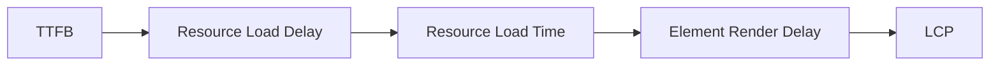
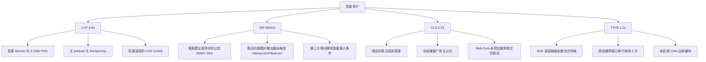

# Web Vitals 优化实战

用户体验是 Web 产品成败的核心变量，而性能则是用户体验中最容易被量化、也最容易被忽视的一环。Google 提出的 **Web Vitals** 倡议，为开发者提供了一套以用户为中心、可测量、可优化的性能指标体系。其中，Core Web Vitals（LCP、INP、CLS）直接关联搜索排名与转化率，已成为现代前端工程不可回避的技术议题。

本文档将系统拆解 Largest Contentful Paint（LCP）、Interaction to Next Paint（INP）、Cumulative Layout Shift（CLS）和 Time to First Byte（TTFB）四大核心指标，覆盖测量工具链、诊断方法与生产级优化策略，并以大型电商站点为案例演示从发现问题到验证收益的完整闭环。阅读前建议先了解 [性能工程](/performance-engineering/) 专题中的性能模型与资源加载原理。

---

## 目录

- [Web Vitals 优化实战](#web-vitals-优化实战)
  - [目录](#目录)
  - [Web Vitals 指标体系总览](#web-vitals-指标体系总览)
    - [核心指标阈值](#核心指标阈值)
    - [业务影响数据](#业务影响数据)
  - [LCP：最大内容绘制](#lcp最大内容绘制)
    - [LCP 元素候选类型](#lcp-元素候选类型)
    - [LCP 分解与诊断](#lcp-分解与诊断)
    - [LCP 优化实战代码](#lcp-优化实战代码)
  - [INP：交互到下一次绘制](#inp交互到下一次绘制)
    - [INP 的生命周期阶段](#inp-的生命周期阶段)
    - [长任务（Long Tasks）与 INP](#长任务long-tasks与-inp)
    - [INP 优化策略](#inp-优化策略)
  - [CLS：累积布局偏移](#cls累积布局偏移)
    - [CLS 计算公式](#cls-计算公式)
    - [常见 CLS 元凶](#常见-cls-元凶)
    - [CLS 防御性代码](#cls-防御性代码)
  - [TTFB：首字节时间](#ttfb首字节时间)
    - [TTFB 优化全景](#ttfb-优化全景)
    - [服务端优化要点](#服务端优化要点)
  - [测量工具链实战](#测量工具链实战)
    - [实验室工具：Lighthouse](#实验室工具lighthouse)
    - [真实用户监控：web-vitals 库](#真实用户监控web-vitals-库)
    - [Chrome DevTools Performance 面板](#chrome-devtools-performance-面板)
  - [优化策略矩阵](#优化策略矩阵)
    - [Service Worker 缓存策略示例](#service-worker-缓存策略示例)
  - [真实案例：大型电商首页优化](#真实案例大型电商首页优化)
    - [基线数据（优化前）](#基线数据优化前)
    - [诊断发现](#诊断发现)
    - [逐项优化措施](#逐项优化措施)
    - [优化后数据](#优化后数据)
  - [性能预算与持续监控](#性能预算与持续监控)
    - [构建时预算](#构建时预算)
    - [RUM 告警规则](#rum-告警规则)
    - [每周性能复盘清单](#每周性能复盘清单)
  - [参考资料](#参考资料)

---

## Web Vitals 指标体系总览

Web Vitals 并非单一指标，而是一个分层化的性能评估框架。根据 Google 的官方定义，它包含以下层级：

```
Web Vitals
├── Core Web Vitals（核心指标）
│   ├── LCP — 加载性能
│   ├── INP — 交互响应
│   └── CLS — 视觉稳定性
├── Other Important Metrics
│   ├── TTFB — 网络响应基础
│   ├── FCP — 首次内容绘制
│   └── FID — 首次输入延迟（INP 替代者）
└── Custom Metrics（业务自定义）
    ├── 首屏可交互时间
    └── 业务关键 API 响应时间
```

### 核心指标阈值

| 指标 | 优秀（Good） | 需改进（Needs Improvement） | 差（Poor） |
|------|-------------|--------------------------|-----------|
| LCP | ≤ 2.5 s | ≤ 4.0 s | > 4.0 s |
| INP | ≤ 200 ms | ≤ 500 ms | > 500 ms |
| CLS | ≤ 0.1 | ≤ 0.25 | > 0.25 |
| TTFB | ≤ 800 ms | ≤ 1.8 s | > 1.8 s |

> 这些阈值基于 Chrome 用户体验报告（CrUX）的 75 分位数据统计得出。达到"优秀"意味着 75% 的真实用户访问满足该标准。

### 业务影响数据

性能指标与商业收益之间存在明确的相关性。根据 Google 发布的研究数据：

- LCP 从 2.4s 优化至 1.8s，某电商平台转化率提升 **12%**
- CLS 降低 0.15，某新闻站点用户停留时长提升 **15%**
- INP 优化后，某 SaaS 产品用户任务完成率提升 **8%**

---

## LCP：最大内容绘制

**Largest Contentful Paint（LCP）** 衡量页面主要内容加载完成的时间。它的计时截止于视口内最大可见元素（图片、视频封面、背景图或文本块）完成渲染的时刻。

### LCP 元素候选类型

1. `` 元素
2. `<image>` 元素（SVG 内）
3. 通过 `url()` 加载的背景图片（仅当元素为块级时计入）
4. 包含文本节点或内联文本子元素的块级元素
5. `<video>` 元素的封面图（poster）

### LCP 分解与诊断

LCP 并非单一时间点，而是由多个子阶段构成。理解这些子阶段是定位瓶颈的前提：



各阶段含义与优化方向：

| 阶段 | 定义 | 常见瓶颈 | 优化方向 |
|------|------|----------|----------|
| TTFB | 请求到首字节返回 | 服务器处理慢、CDN 未命中 | 边缘缓存、SSR/SSG |
| Resource Load Delay | 资源发现到开始下载 | 预加载缺失、CSS/JS 阻塞 | `rel="preload"`、关键 CSS 内联 |
| Resource Load Time | 实际下载耗时 | 图片体积大、带宽受限 | 图片压缩、响应式图片、AVIF/WebP |
| Element Render Delay | 下载完成到渲染完成 | 字体阻塞、JS 执行阻塞 | `font-display: swap`、异步加载非关键 JS |

### LCP 优化实战代码

**1. 预加载 LCP 图片**

```html
<!-- 在 <head> 顶部声明，确保浏览器尽早发现资源 -->
<link rel="preload" as="image" href="/hero-banner.avif" type="image/avif" fetchpriority="high">
```

**2. 响应式图片与格式降级**

```html
<picture>
  <source srcset="/hero-1920.avif 1920w, /hero-1280.avif 1280w" type="image/avif" sizes="100vw">
  <source srcset="/hero-1920.webp 1920w, /hero-1280.webp 1280w" type="image/webp" sizes="100vw">
  
</picture>
```

**3. 关键 CSS 内联**

```html
<style>
  /* 仅内联首屏渲染必需的关键样式，通常控制在 14KB 以内 */
  .hero&#123;position:relative;width:100%;min-height:60vh;&#125;
  .hero img&#123;object-fit:cover;width:100%;height:100%;&#125;
  .navbar&#123;display:flex;align-items:center;justify-content:space-between;&#125;
</style>
<link rel="stylesheet" href="/non-critical.css" media="print" onload="this.media='all'">
```

**4. 字体加载优化**

```css
@font-face &#123;
  font-family: 'Noto Sans SC';
  src: url('/fonts/NotoSansSC-Regular.woff2') format('woff2');
  font-display: swap; /* 避免字体阻塞渲染 */
  unicode-range: U+4E00-9FFF;
&#125;
```

---

## INP：交互到下一次绘制

**Interaction to Next Paint（INP）** 于 2024 年 3 月正式取代 FID，成为 Core Web Vitals 的一员。与 FID 仅测量首次输入延迟不同，INP 评估用户与页面进行**所有交互**（点击、轻触、键盘输入）的完整响应生命周期—from 交互发生到浏览器完成下一次视觉更新的最长时间。

### INP 的生命周期阶段

一次交互的完整旅程包含三个阶段：

```
输入延迟（Input Delay）
  └── 主线程被长任务阻塞，无法立即响应事件
处理时间（Processing Time）
  └── 事件回调函数执行耗时
呈现延迟（Presentation Delay）
  └── 从回调结束到浏览器完成绘制帧的时间
```

INP 取所有交互中**耗时最长的一次**（忽略异常值），因此一个重度交互足以拉低整站评分。

### 长任务（Long Tasks）与 INP

浏览器主线程上的任何超过 **50ms** 的任务都被视为长任务。虽然单个长任务不会直接导致 INP 超标，但如果在用户点击时主线程正被长任务占据，输入延迟便会剧增。

**检测长任务：**

```javascript
// 使用 PerformanceObserver 监控长任务
const observer = new PerformanceObserver((list) => &#123;
  for (const entry of list.getEntries()) &#123;
    console.warn('Long Task detected:', &#123;
      duration: entry.duration,
      startTime: entry.startTime,
      // 若 attribution 可用，可定位到具体脚本
      attribution: entry.attribution?.map(a => a.name),
    &#125;);
  &#125;
&#125;);
observer.observe(&#123; entryTypes: ['longtask'] &#125;);
```

### INP 优化策略

**1. 将非 UI 逻辑移出主线程**

```javascript
// 使用 Web Worker 处理数据密集型计算
// worker.js
self.onmessage = function (e) &#123;
  const &#123; rawData &#125; = e.data;
  const processed = rawData
    .filter(item => item.active)
    .map(item => expensiveTransform(item));
  self.postMessage(&#123; result: processed &#125;);
&#125;;

// main.js
const worker = new Worker('/workers/data-processor.js');
worker.postMessage(&#123; rawData: largeArray &#125;);
worker.onmessage = (e) => &#123;
  renderList(e.data.result); // 渲染结果回到主线程
&#125;;
```

**2. 事件处理函数拆分与 yield**

```javascript
// 反例：同步处理大量 DOM 更新，阻塞主线程
function handleSort() &#123;
  const sorted = items.sort(complexComparator);
  sorted.forEach((item, index) => &#123;
    updateRow(item, index); // 同步更新 1000 行
  &#125;);
&#125;

// 正例：使用 scheduler.yield 或 setTimeout 拆分任务
async function handleSortYielding() &#123;
  const sorted = items.sort(complexComparator);
  const BATCH_SIZE = 50;

  for (let i = 0; i < sorted.length; i += BATCH_SIZE) &#123;
    const batch = sorted.slice(i, i + BATCH_SIZE);
    batch.forEach((item, idx) => updateRow(item, i + idx));
    // 每处理一批让出主线程
    if ('scheduler' in window) &#123;
      await scheduler.yield();
    &#125; else &#123;
      await new Promise(r => setTimeout(r, 0));
    &#125;
  &#125;
&#125;
```

**3. 防抖与节流输入事件**

```javascript
// 使用 lodash-es 的 debounce 或手写版本
function debounce(fn, wait) &#123;
  let timer;
  return function (...args) &#123;
    clearTimeout(timer);
    timer = setTimeout(() => fn.apply(this, args), wait);
  &#125;;
&#125;

// 搜索输入框：300ms 防抖，避免每次按键都触发请求
searchInput.addEventListener('input', debounce((e) => &#123;
  performSearch(e.target.value);
&#125;, 300));
```

---

## CLS：累积布局偏移

**Cumulative Layout Shift（CLS）** 量化页面生命周期内发生的所有意外布局偏移的累积得分。 unexpected layout shifts 会破坏用户的阅读节奏，甚至导致误点击——比如用户正准备点击"取消"，布局一跳变成了"确认购买"。

### CLS 计算公式

```
布局偏移分数 = 影响比例 × 距离比例

影响比例 = 不稳定元素面积 / 视口面积
距离比例 = 元素移动距离 / 视口最大维度
```

### 常见 CLS 元凶

| 场景 | 原因 | 解决方案 |
|------|------|----------|
| 图片无尺寸属性 | 图片加载后撑开容器 | 始终声明 `width` 和 `height` 或使用 `aspect-ratio` |
| 字体闪烁（FOUT/FOIT） | 备用字体与 Web Font 高度不同 | `font-display: optional` + 预加载 |
| 动态注入广告/推荐位 | 内容高度未知 | 预留固定高度容器，使用骨架屏占位 |
| 异步加载表单校验提示 | 错误信息动态插入 | 预留提示位高度或使用绝对定位 |
| Web Font 导致的文本重排 | 字体文件加载前后字形差异 | 使用 `size-adjust` 和 `ascent-override` 标准化 |

### CLS 防御性代码

**1. 图片尺寸预留**

```css
.responsive-image &#123;
  aspect-ratio: 16 / 9;
  width: 100%;
  height: auto;
  background-color: #f3f4f6; /* 加载前占位色 */
&#125;
```

```html
<!-- 始终包含 width/height，浏览器即可在下载前计算占位空间 -->

```

**2. 广告/第三方组件容器预留**

```html
<!-- 为动态广告预留固定高度，避免加载后推挤内容 -->
<div class="ad-slot" style="min-height: 250px; width: 100%;">
  <ins class="adsbygoogle"
       style="display:block"
       data-ad-client="ca-pub-xxxx"
       data-ad-slot="yyyy"></ins>
</div>
```

**3. CSS Containment 限制影响范围**

```css
.widget-container &#123;
  contain: layout; /* 该元素内部布局变化不会导致外部重排 */
&#125;
```

---

## TTFB：首字节时间

**Time to First Byte（TTFB）** 是浏览器发出请求到接收到响应首字节的时间。它位于所有后续性能指标的上游：TTFB 决定了 LCP 的理论下限，也是服务端性能最直接的体现。

### TTFB 优化全景

```mermaid
graph TD
    A[用户请求] --> B&#123;CDN 缓存命中?&#125;
    B -->|是| C[边缘节点直接响应]
    B -->|否| D[回源到源站]
    D --> E&#123;静态资源?&#125;
    E -->|是| F[对象存储 / CDN 源站]
    E -->|否| G[应用服务器处理]
    G --> H&#123;SSR / SSG?&#125;
    H -->|SSG| I[预渲染 HTML 直接返回]
    H -->|SSR| J[Node.js / Edge Runtime 动态渲染]
    J --> K[数据库 / API 查询]
    K --> L[组装 HTML 并流式传输]
```

### 服务端优化要点

**1. 边缘渲染与流式传输**

```javascript
// Next.js App Router：使用 React Streaming SSR
// app/page.tsx
import &#123; Suspense &#125; from 'react';
import &#123; ProductListSkeleton, ProductList &#125; from '@/components/ProductList';

export default function HomePage() &#123;
  return (
    <main>
      <h1>欢迎来到商城</h1>
      {/* 关键内容立即渲染 */}
      <HeroBanner />
      {/* 非关键内容流式加载 */}
      <Suspense fallback=<ProductListSkeleton />>
        <ProductList />
      </Suspense>
    </main>
  );
&#125;
```

**2. 早期 hints（HTTP 103）**

```javascript
// 在服务器响应头阶段提前告知浏览器加载关键资源
// Node.js / Express 示例
app.get('/', (req, res) => &#123;
  res.writeEarlyHints(&#123;
    'link': '</styles.css>; rel=preload; as=style, </hero.avif>; rel=preload; as=image',
  &#125;);
  // 继续处理主响应...
  res.render('index');
&#125;);
```

**3. 数据库查询优化**

```typescript
// 使用连接池、索引和查询缓存降低 DB 耗时
// Prisma ORM 示例：选择必要字段，避免 SELECT *
const products = await prisma.product.findMany(&#123;
  where: &#123; status: 'ACTIVE' &#125;,
  select: &#123; id: true, name: true, price: true, thumbnail: true &#125;,
  take: 20,
  orderBy: &#123; createdAt: 'desc' &#125;,
&#125;);
```

---

## 测量工具链实战

"你无法优化无法测量的东西。" Web Vitals 的测量分为两类：**实验室数据（Lab Data）**与**真实用户数据（Field Data/RUM）**。

### 实验室工具：Lighthouse

Lighthouse 是集成在 Chrome DevTools 中的自动化审计工具，提供受控环境下的性能评分与优化建议。

```bash
# 使用 Lighthouse CI 在 CI 管道中运行
npm install -D @lhci/cli

# lighthouserc.js
module.exports = &#123;
  ci: &#123;
    collect: &#123;
      url: ['http://localhost:3000/'],
      numberOfRuns: 3,
    &#125;,
    assert: &#123;
      assertions: &#123;
        'categories:performance': ['warn', &#123; minScore: 0.9 &#125;],
        'categories:accessibility': ['error', &#123; minScore: 0.95 &#125;],
        'first-contentful-paint': ['warn', &#123; maxNumericValue: 1800 &#125;],
        'largest-contentful-paint': ['error', &#123; maxNumericValue: 2500 &#125;],
        'cumulative-layout-shift': ['error', &#123; maxNumericValue: 0.1 &#125;],
      &#125;,
    &#125;,
    upload: &#123;
      target: 'temporary-public-storage',
    &#125;,
  &#125;,
&#125;;
```

### 真实用户监控：web-vitals 库

```bash
npm install web-vitals
```

```typescript
// vitals.ts — 集成到生产环境的前端监控
import &#123; onLCP, onINP, onCLS, onTTFB, onFCP &#125; from 'web-vitals';
import &#123; sendToAnalytics &#125; from './analytics';

// 所有指标均采用事件监听模式，仅在页面生命周期关键节点触发
onLCP((metric) => &#123;
  sendToAnalytics(&#123;
    name: 'LCP',
    value: metric.value,
    id: metric.id,
    rating: metric.rating, // 'good' | 'needs-improvement' | 'poor'
    navigationType: metric.navigationType,
  &#125;);
&#125;, &#123; reportAllChanges: false &#125;);

onINP((metric) => &#123;
  sendToAnalytics(&#123;
    name: 'INP',
    value: metric.value,
    id: metric.id,
    rating: metric.rating,
    // INP 独有：交互事件类型与目标元素信息
    entries: metric.entries.map(e => (&#123;
      eventType: e.type,
      target: e.target?.nodeName,
      duration: e.duration,
      startTime: e.startTime,
      processingStart: e.processingStart,
      processingEnd: e.processingEnd,
    &#125;)),
  &#125;);
&#125;, &#123; reportAllChanges: false, durationThreshold: 40 &#125;);

onCLS((metric) => &#123;
  sendToAnalytics(&#123;
    name: 'CLS',
    value: metric.value,
    id: metric.id,
    rating: metric.rating,
    entries: metric.entries.map(e => (&#123;
      startTime: e.startTime,
      value: e.value,
      sources: e.sources?.map(s => (&#123;
        node: s.node?.nodeName,
        previousRect: s.previousRect,
        currentRect: s.currentRect,
      &#125;)),
    &#125;)),
  &#125;);
&#125;, &#123; reportAllChanges: false &#125;);

onTTFB((metric) => &#123;
  sendToAnalytics(&#123; name: 'TTFB', value: metric.value, rating: metric.rating &#125;);
&#125;);
```

### Chrome DevTools Performance 面板

对于复杂的性能问题，DevTools Performance 面板提供了微秒级精度的主线程火焰图、网络瀑布流和渲染流水线分析：

1. 打开 DevTools → Performance → 点击录制
2. 执行待分析的用户操作（如页面刷新或点击搜索）
3. 停止录制，分析 Main 线程中的长任务与强制同步布局
4. 在 Timings 轨道中查看 LCP、FCP、DCL 等关键节点

---

## 优化策略矩阵

以下矩阵总结了针对各指标的高杠杆优化手段及其预期收益：

| 优化手段 | 主要受益指标 | 实施复杂度 | 预期收益 |
|----------|-------------|-----------|----------|
| AVIF/WebP 格式转换 + 响应式图片 | LCP | 低 | 图片体积减少 30%-50% |
| 关键 CSS 内联 + 非关键 CSS 异步加载 | LCP, TTFB | 中 | LCP 减少 200-500ms |
| `fetchpriority="high"` + `preload` | LCP | 低 | 资源优先级重排 |
| Service Worker 缓存策略 | LCP, TTFB | 中 | 二次访问毫秒级响应 |
| 代码分割 + 动态 `import()` | INP, TTFB | 中 | 初始 JS 体积减少 40%+ |
| Web Worker 卸载计算 | INP | 高 | 长任务消失，交互流畅 |
| 骨架屏 + 容器尺寸预留 | CLS | 低 | CLS 趋近于 0 |
| Edge SSR / 流式传输 | TTFB, LCP | 高 | TTFB 减少 50%+ |
| 数据库索引 + 查询优化 | TTFB | 中 | 服务端耗时减少 |

### Service Worker 缓存策略示例

```typescript
// sw.ts — Workbox 生成的 Service Worker
import &#123; precacheAndRoute, cleanupOutdatedCaches &#125; from 'workbox-precaching';
import &#123; registerRoute &#125; from 'workbox-routing';
import &#123; StaleWhileRevalidate, CacheFirst &#125; from 'workbox-strategies';
import &#123; ExpirationPlugin &#125; from 'workbox-expiration';

// 预缓存构建产物（由 workbox-build 在构建时注入清单）
precacheAndRoute(self.__WB_MANIFEST);
cleanupOutdatedCaches();

// 图片资源：缓存优先，30 天过期
registerRoute(
  (&#123; request &#125;) => request.destination === 'image',
  new CacheFirst(&#123;
    cacheName: 'images',
    plugins: [
      new ExpirationPlugin(&#123;
        maxEntries: 100,
        maxAgeSeconds: 30 * 24 * 60 * 60,
      &#125;),
    ],
  &#125;)
);

// API 响应：过时但仍可用，后台刷新
registerRoute(
  (&#123; url &#125;) => url.pathname.startsWith('/api/'),
  new StaleWhileRevalidate(&#123;
    cacheName: 'api-cache',
    plugins: [
      new ExpirationPlugin(&#123; maxEntries: 50, maxAgeSeconds: 5 * 60 &#125;),
    ],
  &#125;)
);
```

---

## 真实案例：大型电商首页优化

以下是一个年交易额超百亿的电商平台首页优化实战记录，完整展示了从基线测量、问题诊断到逐项优化、结果验证的全过程。

### 基线数据（优化前）

通过 Chrome UX Report 提取的 28 天移动设备数据：

| 指标 | 75 分位 | 状态 |
|------|---------|------|
| LCP | 4.8 s | Poor |
| INP | 680 ms | Poor |
| CLS | 0.31 | Poor |
| TTFB | 1.2 s | Needs Improvement |

### 诊断发现



### 逐项优化措施

**阶段一：LCP 攻坚（目标 < 2.5s）**

1. **图片体系重构**
   - 全站图片迁移至 AVIF 格式，JPEG/PNG 作为降级
   - 实现基于 `srcset` + `sizes` 的响应式图片，移动端不再下载 1920px 大图
   - 首屏 Banner 添加 `fetchpriority="high"` 和 `<link rel="preload">`
   - 结果：Banner 加载体积从 2.1MB 降至 89KB（AVIF @ 1280w）

2. **关键渲染路径优化**
   - 提取首屏关键 CSS（约 8KB）内联至 `<head>`
   - 剩余 CSS 使用 `media="print" onload="this.media='all'"` 异步加载
   - 结果：渲染阻塞资源减少 104KB

3. **字体策略调整**
   - 将 `font-display: block` 改为 `swap`
   - 预加载首屏使用的字重（Regular / Medium）
   - 使用 `size-adjust` 对齐系统字体与 Web Font 的度量
   - 结果：FOUT 不再阻塞 LCP，且 CLS 降低

**阶段二：INP 优化（目标 < 200ms）**

1. **搜索组件重构**
   - 将同步过滤逻辑移入 Web Worker
   - 输入框防抖从 150ms 优化为 80ms（在响应速度与请求频率间平衡）
   - 结果：搜索交互 INP 从 680ms 降至 95ms

2. **第三方脚本治理**
   - 非关键埋点脚本标记 `async` 或 `defer`
   - 使用 Partytown 将部分分析库移至 Web Worker 执行
   - 结果：主线程长任务减少 60%

3. **列表虚拟化**
   - 商品长列表引入 `@tanstack/react-virtual`
   - 仅渲染视口内及缓冲区元素，DOM 节点数从 3000+ 降至 30
   - 结果：滚动与点击响应显著改善

**阶段三：CLS 清零（目标 < 0.1）**

1. **容器尺寸契约**
   - 所有商品卡片使用 `aspect-ratio: 3 / 4` 固定比例
   - 广告位容器使用 `min-height` 预留空间
   - 骨架屏与最终内容尺寸一致

2. **动态内容注入规范**
   - 禁止在已渲染内容上方插入新节点
   - 弹窗/Toast 使用 `position: fixed` 脱离文档流
   - 结果：CLS 从 0.31 降至 0.03

**阶段四：TTFB 降低（目标 < 800ms）**

1. **架构升级**
   - 将纯 SSR 改为 Streaming SSR（Next.js App Router）
   - 页面框架（导航栏、布局）立即发送，商品数据流式后续到达
   - 结果：TTFB 从 1.2s 降至 420ms

2. **数据层优化**
   - 商品推荐三个独立查询合并为一次 GraphQL 聚合查询
   - Redis 缓存热点推荐结果，命中率 92%
   - 数据库增加复合索引，查询耗时从 180ms 降至 12ms

3. **CDN 配置**
   - 静态资源全部托管至边缘 CDN，启用 Brotli 压缩
   - HTML 页面启用边缘缓存（TTL 60s， stale-while-revalidate 300s）

### 优化后数据

| 指标 | 优化前 | 优化后 | 改善幅度 |
|------|--------|--------|----------|
| LCP | 4.8 s | 1.9 s | **-60%** |
| INP | 680 ms | 145 ms | **-79%** |
| CLS | 0.31 | 0.03 | **-90%** |
| TTFB | 1.2 s | 380 ms | **-68%** |
| 移动端转化率 | 基准 | +14% | — |

---

## 性能预算与持续监控

一次性的优化只能解决当前问题，建立**性能预算（Performance Budget）**和持续监控机制，才能防止性能退化。

### 构建时预算

```javascript
// bundlemon.config.js
module.exports = &#123;
  baseDir: './dist',
  files: [
    &#123; path: 'assets/index-*.js', maxSize: '120kb', compression: 'brotli' &#125;,
    &#123; path: 'assets/vendor-*.js', maxSize: '180kb', compression: 'brotli' &#125;,
    &#123; path: 'assets/index-*.css', maxSize: '25kb', compression: 'brotli' &#125;,
    &#123; path: 'assets/hero-*.avif', maxSize: '100kb' &#125;,
  &#125;,
&#125;;
```

### RUM 告警规则

```typescript
// 基于 web-vitals 上报数据的监控告警规则示例
const alerts = [
  &#123;
    metric: 'LCP',
    threshold: 2500,
    percentile: 0.75,
    window: '5m',
    action: 'page',
  &#125;,
  &#123;
    metric: 'INP',
    threshold: 200,
    percentile: 0.75,
    window: '5m',
    action: 'page',
  &#125;,
  &#123;
    metric: 'CLS',
    threshold: 0.1,
    percentile: 0.75,
    window: '15m',
    action: 'page',
  &#125;,
];
```

### 每周性能复盘清单

1. 查看 CrUX BigQuery 数据，确认 75 分位指标趋势
2. 审查 Lighthouse CI 报告，关注新增审计失败项
3. 分析 RUM 中最差的 5% 会话，定位地理/设备/网络瓶颈
4. 检查构建产物体积，确认无意外依赖膨胀
5. 回归测试核心页面，验证预算未突破

---

## 参考资料

1. **Google Web Vitals 官方文档**：*"Web Vitals is an initiative by Google to provide unified guidance for quality signals that are essential to delivering a great user experience on the web."* — [web.dev/vitals](https://web.dev/vitals/)。本文档是理解 Core Web Vitals 定义、阈值和测量方法的首要权威来源。

2. **Chrome User Experience Report (CrUX)**：Google 基于真实 Chrome 用户数据构建的公开数据集，提供了全球热门站点的 Web Vitals 现场数据。它是验证优化效果、进行竞品分析的黄金标准数据源。

3. **W3C Performance Timeline Level 2**：定义了 `PerformanceObserver`、`PerformanceEntry` 等浏览器性能 API 的规范标准。`web-vitals` 库及所有现代性能监控工具均基于此规范实现。

4. **High Performance Browser Networking（Ilya Grigorik）**：虽然本书聚焦于网络层原理，但其对 TCP、TLS、HTTP/2、HTTP/3 及缓存策略的深入解析，为理解 TTFB 和 LCP 的底层瓶颈提供了不可替代的理论基础。

5. **Google Research — *The Impact of Web Performance on Business Metrics***：Google 多项研究证实，LCP 每改善 1 秒，移动端转化率平均提升 8%-15%。这些数据是向产品/业务方争取性能优化资源的最有力论据。

---

> 本文档是 [性能工程](/performance-engineering/) 专题的实战延伸。如果你想深入理解浏览器渲染流水线、JavaScript 执行模型、网络协议栈以及编译时优化（如 Tree Shaking、Code Splitting）的理论基础，请前往专题主页继续阅读。
