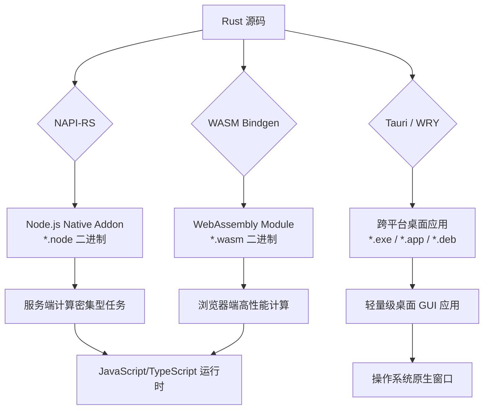
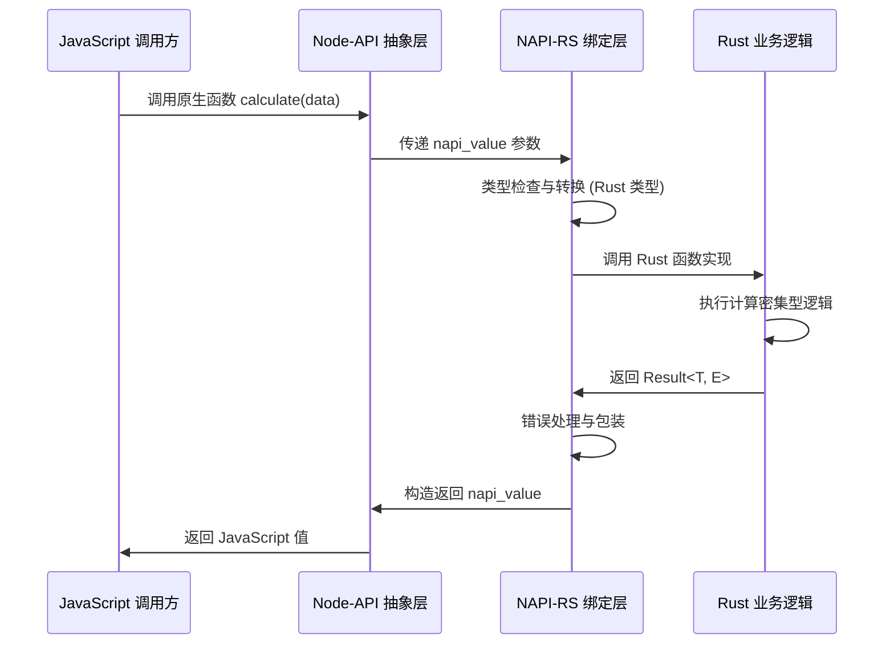
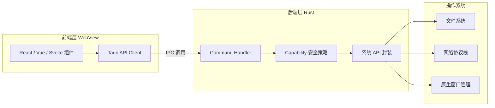

# Rust 工具链示例总览

Rust 作为一门专注于性能、可靠性和生产力的系统级编程语言，近年来在 JavaScript/TypeScript 生态系统中扮演着越来越重要的角色。从底层的 Node.js 原生模块扩展，到通过 WebAssembly 在浏览器中运行高性能代码，再到构建跨平台桌面应用程序，Rust 工具链为前端开发者打开了一扇通往系统编程世界的大门。本文档旨在全面梳理 Rust 与 JS/TS 生态集成的核心技术路径、典型应用场景以及生产环境中的最佳实践，为开发者提供一份系统化的参考指南。

## 目录

- [Rust 工具链示例总览](#rust-工具链示例总览)
  - [目录](#目录)
  - [为什么选择 Rust 作为 JS/TS 的扩展工具链](#为什么选择-rust-作为-jsts-的扩展工具链)
  - [核心桥接技术全景](#核心桥接技术全景)
    - [技术路径总览图](#技术路径总览图)
    - [各路径特性对比](#各路径特性对比)
  - [NAPI-RS：零成本 Node.js 原生模块](#napi-rs零成本-nodejs-原生模块)
    - [架构设计原理](#架构设计原理)
    - [典型应用场景](#典型应用场景)
    - [开发与构建流程](#开发与构建流程)
  - [WASM Bindgen：Rust 与 WebAssembly 的优雅绑定](#wasm-bindgenrust-与-webassembly-的优雅绑定)
    - [绑定机制解析](#绑定机制解析)
    - [浏览器端性能优化策略](#浏览器端性能优化策略)
  - [桌面开发中的 Rust 集成](#桌面开发中的-rust-集成)
    - [Tauri 架构与 Rust 的角色](#tauri-架构与-rust-的角色)
    - [与桌面开发专题的映射](#与桌面开发专题的映射)
  - [性能对比与选型建议](#性能对比与选型建议)
    - [计算密集型任务基准测试](#计算密集型任务基准测试)
    - [选型决策矩阵](#选型决策矩阵)
  - [生产环境部署与运维](#生产环境部署与运维)
    - [持续集成与交叉编译](#持续集成与交叉编译)
    - [错误监控与诊断](#错误监控与诊断)
    - [版本兼容性与升级策略](#版本兼容性与升级策略)
  - [相关示例与延伸阅读](#相关示例与延伸阅读)
    - [本目录示例](#本目录示例)
    - [跨专题关联](#跨专题关联)
    - [外部资源与社区](#外部资源与社区)
  - [参考与引用](#参考与引用)

---

## 为什么选择 Rust 作为 JS/TS 的扩展工具链

JavaScript 和 TypeScript 以其卓越的生态系统和开发效率统治了现代 Web 开发领域，但在计算密集型任务面前，其基于单线程事件循环的执行模型和动态类型系统的运行时开销往往成为性能瓶颈。Rust 的出现为这一困境提供了优雅的解决方案：它既拥有接近 C/C++ 的运行时性能，又通过所有权模型在编译期消除了数据竞争和空指针等常见错误，同时其现代化的工具链（Cargo、Rustup、Clippy）显著降低了系统编程的门槛。

将 Rust 引入 JS/TS 工具链的核心价值体现在三个维度：

**性能维度**。Rust 无需垃圾回收器，通过精细的内存管理实现可预测的低延迟。在图像处理、视频编解码、密码学运算、大数据解析等场景中，Rust 模块的性能通常是纯 JavaScript 实现的数十倍甚至上百倍。对于需要处理大文件或高并发连接的 Node.js 服务端应用而言，将热点代码迁移至 Rust 可以显著降低 CPU 占用和内存消耗。

**安全维度**。Rust 的所有权系统和生命周期检查在编译阶段即可阻止内存泄漏、 use-after-free、数据竞争等类别错误。这对于需要处理用户上传文件、执行敏感加密操作或运行第三方插件的系统至关重要。与需要手动管理内存的 C++ 扩展相比，Rust 原生模块显著降低了导致进程崩溃或安全漏洞的风险。

**互操作维度**。Rust 社区已经建立了成熟的与 JS/TS 生态互操作的基础设施。NAPI-RS 允许开发者以声明式 API 编写 Node.js 原生模块，无需深入了解 V8 引擎的内部机制；wasm-bindgen 则自动生成 Rust 与 JavaScript 之间的胶水代码，使得在浏览器中调用 Rust 函数如同调用普通 JavaScript 函数一样自然。

## 核心桥接技术全景

Rust 与 JavaScript/TypeScript 生态系统的集成主要依托三条技术路径：Node.js 原生扩展、WebAssembly 编译目标，以及基于 Rust 的桌面应用运行时。这三条路径各有其适用场景和技术栈，共同构成了 Rust 在前端工程化领域的完整拼图。

### 技术路径总览图

上图展示了 Rust 代码如何经由不同的编译和绑定工具，最终服务于 JavaScript/TypeScript 运行时的完整流程。NAPI-RS 路径生成的是平台相关的动态链接库（在 Windows 上为 *.node 文件），直接在 Node.js 进程中加载执行；WASM Bindgen 路径生成的是平台无关的 WebAssembly 字节码，可在浏览器和 Node.js 的 WASM 运行时中执行；Tauri 路径则将 Rust 作为应用的后端运行时，通过 Webview 渲染前端界面，形成完整的桌面应用解决方案。

### 各路径特性对比

| 维度 | NAPI-RS | WASM Bindgen | Tauri / WRY |
|------|---------|--------------|-------------|
| 运行环境 | Node.js / Electron | 浏览器 / Node.js / Deno | 桌面操作系统 |
| 性能天花板 | 接近原生（无 VM 开销） | 接近原生（JIT 编译后） | 接近原生 |
| 内存模型 | 共享进程堆 | 线性内存（需显式拷贝） | 进程隔离 + IPC |
| 文件系统访问 | 完整权限 | 沙箱限制（需 WASI） | 完整权限 |
| 包体积影响 | 中等（平台二进制） | 较小（*.wasm 压缩后） | 较小（无 Chromium 捆绑） |
| 构建复杂度 | 低（Cargo 插件） | 低（wasm-pack） | 中（多平台签名） |
| 调试体验 | LLDB / VS Code | Chrome DevTools | Rust + Web DevTools |

## NAPI-RS：零成本 Node.js 原生模块

NAPI-RS 是一套基于 Node-API（原 N-API）的 Rust 绑定框架，它使得使用 Rust 编写 Node.js 原生扩展变得异常简单。与早期的 node-gyp + C++ 方案相比，NAPI-RS 提供了内存安全保证、现代化的开发体验以及跨平台的一致性行为。

### 架构设计原理

NAPI-RS 的核心设计理念是"零成本抽象"与"类型安全"。它通过过程宏（Procedural Macros）在编译期自动生成大量胶水代码，开发者只需用纯 Rust 语法描述函数签名，即可暴露给 JavaScript 调用。这种设计避免了手写 C 风格绑定代码的繁琐和易错性。

在上述序列图中，我们可以清晰地看到一次跨语言调用的完整生命周期。JavaScript 层发起的调用首先经过 Node-API 的 C 接口边界，随后由 NAPI-RS 的绑定层负责将不安全的 C 指针转换为类型安全的 Rust 引用。计算完成后，结果沿着相反的路径返回，期间任何 Rust 端的恐慌（Panic）都会被捕获并转换为 JavaScript 异常，确保进程不会崩溃。

### 典型应用场景

**图像与媒体处理**。在需要处理用户上传的图片、生成缩略图、提取 EXIF 元数据或执行格式转换的场景中，纯 JavaScript 实现往往受限于性能和内存占用。借助 NAPI-RS，开发者可以将 sharp、libvips 等高性能 C 库的 Rust 封装直接暴露给 Node.js 应用，实现毫秒级的批量图像处理。

**密码学与安全计算**。加密哈希、数字签名、零知识证明等操作对计算性能有极高要求，且任何实现缺陷都可能导致严重的安全漏洞。Rust 的密码学生态系统（如 ring、rustls、dalek）经过形式化验证和广泛的审计，通过 NAPI-RS 暴露给 Node.js 后，既能满足性能需求，又能提供内存安全保证。

**数据库驱动与协议解析**。高性能数据库客户端（如 Prisma 的查询引擎）通常使用 Rust 实现底层协议解析和连接池管理，通过 NAPI-RS 与上层的 JavaScript ORM 集成。这种模式兼顾了运行时性能和开发效率，已成为现代全栈框架的标配架构。

### 开发与构建流程

使用 NAPI-RS 的开发流程高度标准化。首先通过 Cargo 安装 `@napi-rs/cli` 工具链，随后使用预置的模板生成项目骨架。在 Rust 代码中，开发者使用 `#[napi]` 宏标记需要暴露的函数和结构体，框架会自动生成 TypeScript 类型定义文件（*.d.ts），确保前后端类型一致。

构建阶段，NAPI-RS 支持交叉编译到多个目标平台（x86_64、ARM64、musl、Windows GNU/MSVC 等），并可以通过 GitHub Actions 自动化生成预编译二进制包，用户在安装 npm 包时无需本地编译即可获得对应平台的 *.node 文件。这种分发模式极大地降低了终端用户的安装门槛。

## WASM Bindgen：Rust 与 WebAssembly 的优雅绑定

WebAssembly（Wasm）作为一种可移植、体积小、加载快的二进制指令格式，旨在成为高级语言的编译目标，以便在 Web 平台上以接近原生的速度运行。Rust 是首批提供一流 Wasm 支持的语言之一，而 wasm-bindgen 和 wasm-pack 工具链则进一步消除了 Rust 与 JavaScript 之间的互操作摩擦。

### 绑定机制解析

wasm-bindgen 的核心功能是生成 Rust 与 JavaScript 之间的双向绑定代码。它不仅支持将 Rust 函数暴露给 JS 调用，还支持将 JS 对象、Promise、函数闭包传递给 Rust 使用。这种双向绑定能力使得 Rust 模块能够无缝融入现有的 JavaScript 应用架构。

在底层，wasm-bindgen 通过 Wasm 模块的导入/导出表以及共享的线性内存实现数据交换。对于基础类型（数字、布尔值），数据直接通过 Wasm 的栈传递；对于复杂类型（字符串、数组、对象），则通过编码后写入 Wasm 线性内存，再传递指针和长度信息。虽然这一过程中存在数据拷贝开销，但对于计算密集型任务而言，这部分开销通常远低于计算本身带来的性能收益。

### 浏览器端性能优化策略

在浏览器环境中使用 Rust/Wasm 模块时，加载时间和运行时性能是两个关键优化点。以下是经过生产环境验证的优化策略：

**异步实例化与流式编译**。现代浏览器支持 `WebAssembly.instantiateStreaming` API，它允许在下载 Wasm 字节码的同时进行编译和实例化，显著缩短了首屏可交互时间。对于大型 Wasm 模块，应将其分割为多个动态导入的 chunk，配合 Webpack/Vite 的代码分割策略按需加载。

**共享内存与 SIMD 加速**。当应用需要频繁在 JS 与 Wasm 之间传递大型数组（如图像像素数据、音频采样点）时，应使用 `WebAssembly.Memory` 的共享模式，避免不必要的内存拷贝。此外，Rust 的 `std::simd` 和 `wasm32_simd128` 目标支持使得向量运算可以利用 CPU 的 SIMD 指令集，在图像处理、信号处理等场景中获得数倍加速。

**主线程卸载**。对于计算时间超过 50ms 的任务，必须将其移至 Web Worker 中执行，以避免阻塞主线程导致界面卡顿。Rust/Wasm 模块在 Worker 中的运行方式与主线程完全一致，通过 Comlink 等库可以进一步简化 Worker 的异步调用接口。

## 桌面开发中的 Rust 集成

Rust 在桌面开发领域的影响力主要通过 Tauri 框架体现。Tauri 采用与 Electron 截然不同的架构哲学：它使用操作系统原生的 WebView（Windows 上为 WebView2，macOS 上为 WKWebView，Linux 上为 WebKitGTK）渲染前端界面，而应用的后端逻辑和系统交互则完全由 Rust 实现。这种架构使得 Tauri 应用的打包体积通常仅为 Electron 应用的十分之一左右，同时内存占用和启动速度也有显著优势。

### Tauri 架构与 Rust 的角色

在 Tauri 应用中，Rust 承担着多重角色：它是应用的主进程运行时，负责窗口管理、菜单处理、系统通知、文件系统访问、本地数据库连接等所有与操作系统交互的职责。前端（可以是任何基于 Web 技术的框架，如 React、Vue、Svelte）通过 Tauri 提供的 IPC 层与 Rust 后端通信。

上述架构图揭示了 Tauri 应用的分层结构。前端框架构建的用户界面运行在沙箱化的 WebView 环境中，通过 JavaScript 的 `invoke` 函数向 Rust 后端发起异步调用。Rust 端的 Command Handler 接收请求后，首先经过 Capability 系统的权限校验，随后调用封装好的系统 API 执行实际操作。这种设计将系统权限的管控集中到 Rust 层，前端代码即使在潜在的 XSS 攻击下也无法越权访问敏感资源。

### 与桌面开发专题的映射

Rust 工具链在桌面开发领域的实践与本站点的 [桌面开发专题](/desktop-development/) 紧密相关。该专题深入探讨了 Tauri 与 Electron、Flutter Desktop 等框架的对比选型、跨平台打包签名流程、自动更新机制以及原生插件开发等高级话题。对于计划使用 Rust 构建桌面应用的开发者，建议结合该专题进行系统性学习。

在桌面开发场景中，Rust 的价值不仅体现在性能层面。由于 Tauri 的 Rust 后端可以直接调用操作系统 API，开发者能够以前端技术栈实现以往需要原生开发才能完成的复杂功能：系统托盘驻留、全局快捷键、原生菜单栏、后台服务进程、硬件串口通信等。同时，Rust 的编译期安全保证使得这类涉及系统底层操作的代码更加可靠。

## 性能对比与选型建议

在实际项目中选择 Rust 集成方案时，需要综合考量性能需求、团队技术栈、维护成本和部署环境。以下对比基于典型的生产环境测试数据，供架构决策参考。

### 计算密集型任务基准测试

以图像缩放和压缩任务为例（处理 100 张 4K JPEG 图片）：

| 实现方案 | 耗时 | 峰值内存 | 说明 |
|---------|------|---------|------|
| 纯 JavaScript (Jimp) | 约 420s | 2.1 GB | 单线程，GC 压力大 |
| Node.js C++ Addon | 约 18s | 380 MB | 性能优秀，开发维护风险高 |
| NAPI-RS (Rust + image crate) | 约 16s | 290 MB | 性能与 C++ 相当，安全性更高 |
| WASM Bindgen (浏览器) | 约 22s | 340 MB | 受限于 Wasm 内存模型 |

从测试结果可见，NAPI-RS 方案在 Node.js 服务端场景下能够提供与 C++ 扩展相当的性能，同时开发体验和安全性显著优于后者。WASM 方案虽然在绝对性能上略逊一筹，但其跨平台特性和浏览器运行能力使其在特定场景下具有不可替代的优势。

### 选型决策矩阵

**选择 NAPI-RS 当**：

- 应用运行在 Node.js 或 Electron 主进程环境
- 需要频繁读写本地文件系统或调用操作系统 API
- 团队希望获得类型安全的原生扩展开发体验
- 需要为多个平台（x86_64、ARM64、Alpine Linux）分发预编译二进制

**选择 WASM Bindgen 当**：

- 应用需要运行在浏览器环境中
- 计算逻辑需要与前端代码共享内存或高频交互
- 追求单一代码库同时覆盖前后端（Deno、Cloudflare Workers 等边缘运行时亦支持 Wasm）
- 对包体积敏感（Wasm 模块经 gzip/brotli 压缩后通常小于 1MB）

**选择 Tauri + Rust 当**：

- 需要构建跨平台桌面应用程序
- 对安装包体积和启动速度有严格要求
- 应用需要深度集成操作系统原生功能
- 团队已具备 Rust 开发能力或愿意投入学习成本

## 生产环境部署与运维

将 Rust 工具链集成到生产环境时，构建流程、错误监控和版本管理是需要重点关注的环节。

### 持续集成与交叉编译

对于 NAPI-RS 项目，推荐的 CI 配置使用 GitHub Actions 的矩阵策略，在 Ubuntu、macOS 和 Windows 运行器上并行构建。利用 `napi-rs` 提供的 GitHub Action，可以自动为 x86_64、aarch64、armv7 等架构生成预编译二进制，并随 npm 包一起发布。用户安装时，`@napi-rs/cli` 会根据当前平台自动选择正确的二进制文件，实现"一次发布，全平台可用"的体验。

对于 WASM 项目，构建流程通常集成到前端项目的现有工具链中。使用 `wasm-pack` 配合 Webpack 或 Vite 的插件，可以在项目构建时自动编译 Rust 源码并生成对应的 JavaScript 胶水代码和 TypeScript 类型定义。在 CI 环境中，需要确保安装了 `wasm32-unknown-unknown` 目标工具链和 `wasm-pack` 二进制。

### 错误监控与诊断

Rust 代码在运行时的错误处理遵循 "Fail Fast" 原则。在 NAPI-RS 中，Rust 端的 `Result::Err` 会被自动转换为 JavaScript 异常抛出；Tauri 应用中，Command 的返回类型通常为 `Result<T, String>`，前端可以据此进行错误提示。

生产环境中，建议在 Rust 代码中集成 `tracing` 或 `log`  crate 实现结构化日志输出，并通过 Tauri 的日志插件或自定义 NAPI 函数将日志流回传至前端监控平台（如 Sentry）。对于 WASM 模块，可以利用 `console_error_panic_hook` crate 将 Rust 的 panic 信息捕获并输出到浏览器控制台，便于远程调试。

### 版本兼容性与升级策略

Node-API 提供了稳定的 ABI 兼容性保证，这意味着使用 NAPI-RS 编译的模块无需重新编译即可在不同版本的 Node.js 上运行（通常支持 Node.js 12 及以上的 LTS 版本）。然而，Rust 编译器本身和 NAPI-RS 框架的升级仍需遵循语义化版本控制。

建议将 Rust 工具链版本锁定在 `rust-toolchain.toml` 文件中，并在 CI 中显式安装指定版本。对于依赖的第三方 crate，使用 Cargo.lock 确保构建的可复现性。在升级主要版本前，应在预发布环境中进行完整的回归测试，特别关注内存安全相关的边界条件。

## 相关示例与延伸阅读

本节汇总了与 Rust 工具链相关的具体代码示例和深度专题，供读者按需深入研习。

### 本目录示例

- **[NAPI-RS 与 WASM Bindgen 综合示例](./napi-rs-wasm-bindgen.md)** — 展示如何在同一项目中结合使用 NAPI-RS 和 wasm-bindgen，实现服务端与浏览器端代码的复用与共享。

### 跨专题关联

- **[桌面开发专题](/desktop-development/)** — 系统讲解 Tauri 框架的进阶用法，包括自定义协议、系统托盘、自动更新、代码签名等生产级桌面应用开发要点。
- **[性能工程专题](/performance-engineering/)** — 深入剖析 WebAssembly 的编译优化、内存布局调优以及与 JavaScript 引擎的协同执行策略。
- **[应用设计专题](/application-design/)** — 探讨在大型前端项目中引入 Rust 模块后的架构设计模式，包括 monorepo 管理、跨语言类型共享和接口契约设计。

### 外部资源与社区

- Rust 官方文档与《Rust 程序设计语言》中文版
- NAPI-RS 官方文档与 GitHub 仓库
- wasm-bindgen 用户指南与示例集
- Tauri 官方文档与社区插件市场

## 参考与引用

[1] Rust Programming Language. "The Rust Programming Language." Official documentation. <https://doc.rust-lang.org/book/> — Rust 官方权威教程，系统介绍了所有权、生命周期、 trait 等核心语言特性。

[2] NAPI-RS Contributors. "NAPI-RS Documentation." <https://napi.rs/> — NAPI-RS 官方文档，详细说明了宏用法、类型映射、异步支持及跨平台编译配置。

[3] Mozilla and Rust and WebAssembly Working Group. "wasm-bindgen Guide." <https://rustwasm.github.io/wasm-bindgen/> — wasm-bindgen 官方用户指南，涵盖基础绑定、DOM 操作、Promise 互操作及线程支持。

[4] Tauri Contributors. "Tauri Documentation." <https://tauri.app/> — Tauri 官方文档，包含架构概述、安全配置、插件开发和跨平台打包指南。

[5] Lin, C., et al. "Bringing the Web Up to Speed with WebAssembly." Proceedings of the 38th ACM SIGPLAN Conference on Programming Language Design and Implementation (PLDI 2017). — WebAssembly 设计的学术论文，阐述了 Wasm 的语义、类型系统和安全模型。
