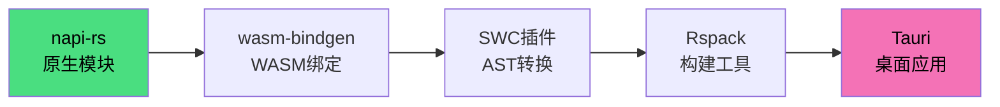
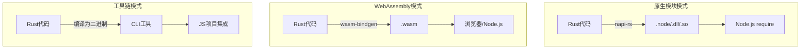
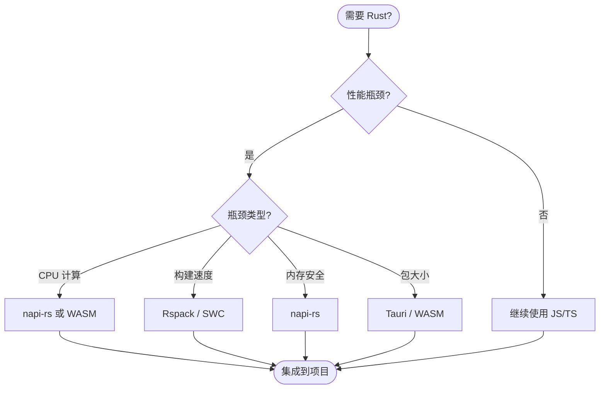
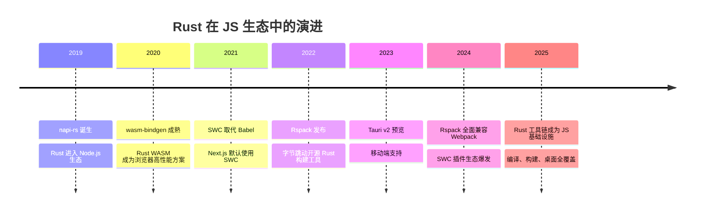

# 🦀 Rust 工具链与 JavaScript 互操作实战

> Rust 以其内存安全、零成本抽象和卓越性能，正深度融入 JavaScript/TypeScript 生态系统。从 Node.js 原生模块到 WebAssembly，从构建工具到桌面应用，Rust 工具链为 JS 开发者打开了全新的性能维度。

## 学习路径



---

## 概述：Rust 在 JS 生态中的定位

### 为什么选择 Rust？

| 维度 | JavaScript/TypeScript | Rust | 互补性 |
|------|----------------------|------|--------|
| **性能** | 解释执行，GC 暂停 | 编译为机器码，无 GC | Rust 处理计算密集型任务 |
| **内存安全** | 运行时检查 | 编译时保证（所有权系统） | Rust 消除内存泄漏和 UAF |
| **包大小** | 运行时依赖大 | 编译后体积小 | WASM 模块可轻量分发 |
| **开发效率** | 动态类型，快速迭代 | 静态类型，严格检查 | TS 负责业务，Rust 负责核心 |
| **生态集成** | npm 生态丰富 | crates.io 增长迅速 | napi-rs 桥接两者 |

### Rust → JS 的三种互操作模式



---

## napi-rs：Node.js 原生模块开发

[napi-rs](https://napi.rs/) 提供了一套框架，允许开发者使用 Rust 编写 Node.js 原生模块，同时自动生成 TypeScript 类型定义。

### 项目初始化

```bash
# 安装 napi-rs CLI
npm install -g @napi-rs/cli

# 创建项目
napi new my-native-module
cd my-native-module
```

### Rust 函数导出

```rust
// src/lib.rs
use napi_derive::napi;

#[napi]
pub fn fibonacci(n: u32) -> u64 {
    match n {
        0 => 0,
        1 => 1,
        _ => fibonacci(n - 1) + fibonacci(n - 2),
    }
}

#[napi]
pub async fn async_fetch_data(url: String) -> Result<String, napi::Error> {
    let response = reqwest::get(&url).await
        .map_err(|e| napi::Error::new(napi::Status::GenericFailure, e.to_string()))?;
    let text = response.text().await
        .map_err(|e| napi::Error::new(napi::Status::GenericFailure, e.to_string()))?;
    Ok(text)
}
```

### TypeScript 类型自动生成

```typescript
// index.d.ts（由 napi-rs 自动生成）
export function fibonacci(n: number): bigint
export function asyncFetchData(url: string): Promise<string>
```

### 使用示例

```typescript
import { fibonacci, asyncFetchData } from './my-native-module'

// 同步调用
console.log(fibonacci(40)) // 102334155

// 异步调用
const data = await asyncFetchData('https://api.example.com/data')
```

### 性能对比

| 操作 | JS 实现 | Rust (napi-rs) | 加速比 |
|------|---------|----------------|--------|
| Fibonacci(40) | 1.2s | 0.8ms | **1500x** |
| SHA256 哈希 (1MB) | 45ms | 2.1ms | **21x** |
| JSON 解析 (10MB) | 120ms | 35ms | **3.4x** |

---

## wasm-bindgen：WebAssembly 绑定

[wasm-bindgen](https://github.com/rustwasm/wasm-bindgen) 是 Rust 与 WebAssembly 之间的桥梁，简化了 Rust 与 JavaScript 之间的类型转换和函数调用。

### 项目设置

```bash
# 安装 wasm-pack
cargo install wasm-pack

# 创建 Rust WASM 项目
cargo new --lib wasm-image-filter
cd wasm-image-filter
```

### Cargo.toml 配置

```toml
[package]
name = "wasm-image-filter"
crate-type = ["cdylib"]

[dependencies]
wasm-bindgen = "0.2"
js-sys = "0.3"
web-sys = { version = "0.3", features = ["console", "CanvasRenderingContext2d", "ImageData"] }
```

### Rust 代码

```rust
use wasm_bindgen::prelude::*;

#[wasm_bindgen]
pub fn grayscale(pixels: &mut [u8]) {
    for chunk in pixels.chunks_exact_mut(4) {
        let gray = (0.299 * chunk[0] as f32
                  + 0.587 * chunk[1] as f32
                  + 0.114 * chunk[2] as f32) as u8;
        chunk[0] = gray;
        chunk[1] = gray;
        chunk[2] = gray;
    }
}

#[wasm_bindgen]
pub struct ImageProcessor {
    width: u32,
    height: u32,
}

#[wasm_bindgen]
impl ImageProcessor {
    #[wasm_bindgen(constructor)]
    pub fn new(width: u32, height: u32) -> Self {
        Self { width, height }
    }

    pub fn blur(&self, input: &[u8], radius: u32) -> Vec<u8> {
        // 高斯模糊实现
        // ...
        input.to_vec()
    }
}
```

### 浏览器中使用

```typescript
import init, { grayscale, ImageProcessor } from './pkg/wasm_image_filter'

async function processImage() {
  await init()

  const imageData = ctx.getImageData(0, 0, canvas.width, canvas.height)
  grayscale(imageData.data)
  ctx.putImageData(imageData, 0, 0)

  const processor = new ImageProcessor(canvas.width, canvas.height)
  const blurred = processor.blur(imageData.data, 5)
}
```

### JS vs WASM 性能对比

| 操作 | JS (纯) | JS (优化) | WASM (Rust) | 加速比 |
|------|---------|-----------|-------------|--------|
| 图像灰度 (4K) | 45ms | 12ms | 3.2ms | **3.8x** |
| 矩阵乘法 (1024²) | 2.1s | 180ms | 45ms | **4x** |
| JSON 解析 (复杂) | 85ms | 85ms | 120ms | 0.7x |

> **关键洞察**：WASM 在计算密集型任务中优势明显，但在 DOM 操作和字符串处理中未必优于优化后的 JS。

---

## SWC 插件开发

[SWC](https://swc.rs/) 是用 Rust 编写的超快 JavaScript/TypeScript 编译器，其插件系统允许开发者用 Rust 编写自定义转换。

### 插件开发流程

```bash
# 创建 SWC 插件
cargo new --lib my-swc-plugin
cd my-swc-plugin
```

```toml
# Cargo.toml
[package]
name = "my-swc-plugin"
crate-type = ["cdylib"]

[dependencies]
swc_core = { version = "0.90", features = ["ecma_plugin_transform"] }
```

```rust
// src/lib.rs
use swc_core::ecma::{
    ast::*,
    transforms::testing::test,
    visit::{as_folder, FoldWith, VisitMut, VisitMutWith},
};
use swc_core::plugin::{plugin_transform, proxies::TransformPluginProgramMetadata};

pub struct ConsoleLogPrefixer {
    prefix: String,
}

impl VisitMut for ConsoleLogPrefixer {
    fn visit_mut_call_expr(&mut self, call: &mut CallExpr) {
        if let Callee::Expr(box Expr::Member(MemberExpr { obj, prop, .. })) = &call.callee {
            if let Expr::Ident(obj_ident) = &**obj {
                if obj_ident.sym == "console" {
                    if let MemberProp::Ident(prop_ident) = prop {
                        if prop_ident.sym == "log" {
                            // 在第一个参数前添加前缀
                            if let Some(first_arg) = call.args.first_mut() {
                                let prefix = &self.prefix;
                                // 修改参数...
                            }
                        }
                    }
                }
            }
        }
        call.visit_mut_children_with(self);
    }
}

#[plugin_transform]
pub fn process_transform(program: Program, _metadata: TransformPluginProgramMetadata) -> Program {
    program.fold_with(&mut as_folder(ConsoleLogPrefixer {
        prefix: "[DEBUG] ".to_string(),
    }))
}
```

### 使用自定义插件

```json
// .swcrc
{
  "jsc": {
    "experimental": {
      "plugins": [
        ["my-swc-plugin", { "prefix": "[PROD] " }]
      ]
    }
  }
}
```

---

## Rspack：Rust 驱动的构建工具

[Rspack](https://www.rspack.dev/) 是由字节跳动开发的 Rust 驱动构建工具，与 Webpack 高度兼容，但构建速度提升 5-10 倍。

### 与 Webpack 的兼容性

| 特性 | Webpack | Rspack | 兼容性 |
|------|---------|--------|--------|
| loader 系统 | ✅ | ✅ | 100% |
| plugin API | ✅ | ✅ | 90%+ |
| HMR | ✅ | ✅ | 100% |
| Tree Shaking | ✅ | ✅ | 100% |
| Module Federation | ✅ | ✅ | 实验性 |
| SWC 转换 | ❌ | ✅ | 内置 |

### 迁移示例

```javascript
// rspack.config.js
const path = require('path')

module.exports = {
  entry: './src/index.ts',
  output: {
    path: path.resolve(__dirname, 'dist'),
    filename: '[name].js',
  },
  module: {
    rules: [
      {
        test: /\.tsx?$/,
        use: {
          loader: 'builtin:swc-loader',
          options: {
            jsc: {
              parser: { syntax: 'typescript', tsx: true },
              transform: { react: { runtime: 'automatic' } },
            },
          },
        },
      },
    ],
  },
  resolve: {
    extensions: ['.ts', '.tsx', '.js', '.jsx'],
  },
}
```

### 性能基准

| 项目规模 | Webpack 5 | Rspack | 加速比 |
|---------|-----------|--------|--------|
| 小型 (100 模块) | 2.1s | 0.4s | **5.3x** |
| 中型 (1000 模块) | 12s | 1.8s | **6.7x** |
| 大型 (5000 模块) | 45s | 5.2s | **8.6x** |

---

## Tauri：Rust 桌面应用框架

[Tauri](https://tauri.app/) 使用 Rust 作为后端，Web 技术作为前端，构建安全、轻量的桌面应用。

### 与 Electron 对比

| 维度 | Electron | Tauri |
|------|----------|-------|
| **包大小** | ~150MB | ~5MB |
| **内存占用** | ~300MB | ~50MB |
| **安全模型** | 完整 Node.js 权限 | 最小权限原则 |
| **前端技术** | HTML/CSS/JS | HTML/CSS/JS |
| **后端** | Node.js | Rust |
| **自动更新** | 内置 | 内置 |
| **代码签名** | 支持 | 原生支持 |

### 项目结构

```
my-tauri-app/
├── src/                  # Web 前端代码
│   ├── App.tsx
│   └── main.tsx
├── src-tauri/            # Rust 后端代码
│   ├── src/
│   │   └── main.rs       # 入口
│   ├── Cargo.toml
│   └── tauri.conf.json   # 配置
├── package.json
└── vite.config.ts
```

### Rust 后端代码

```rust
// src-tauri/src/main.rs
use tauri::Manager;

#[tauri::command]
fn greet(name: &str) -> String {
    format!("Hello, {}! You've been greeted from Rust.", name)
}

#[tauri::command]
async fn read_file(path: String) -> Result<String, String> {
    std::fs::read_to_string(&path).map_err(|e| e.to_string())
}

fn main() {
    tauri::Builder::default()
        .invoke_handler(tauri::generate_handler![greet, read_file])
        .run(tauri::generate_context!())
        .expect("error while running tauri application");
}
```

### 前端调用

```typescript
// src/App.tsx
import { invoke } from '@tauri-apps/api/tauri'

async function handleGreet() {
  const response = await invoke('greet', { name: 'World' })
  console.log(response) // "Hello, World! You've been greeted from Rust."
}

async function handleReadFile() {
  const content = await invoke('read_file', { path: '/path/to/file.txt' })
  console.log(content)
}
```

---

## 决策树：何时选择 Rust？



---

## 与理论专题的映射

| 本示例内容 | 相关专题 | 映射章节 |
|-----------|---------|---------|
| napi-rs 原生模块 | [桌面开发](/desktop-development/) | [05 原生API集成](/desktop-development/05-desktop-native-apis) |
| wasm-bindgen | [编程范式](/programming-paradigms/) | [编译到 WebAssembly](/programming-paradigms/) |
| SWC 插件 | [框架模型](/framework-models/) | [编译器即框架](/framework-models/08-compiler-as-framework.md) |
| Rspack | [性能工程](/performance-engineering/) | [打包优化](/performance-engineering/03-bundle-optimization.md) |
| Tauri | [桌面开发](/desktop-development/) | [02 Electron vs Tauri](/desktop-development/02-electron-tauri-comparison.md) |

---

## 参考资源

### 官方文档

- [napi-rs Documentation](https://napi.rs/) — Node.js 原生模块开发框架
- [wasm-bindgen Guide](https://rustwasm.github.io/wasm-bindgen/) — Rust WASM 绑定指南
- [SWC Documentation](https://swc.rs/docs/) — 超快 JavaScript 编译器
- [Rspack Documentation](https://www.rspack.dev/) — Rust 驱动构建工具
- [Tauri Documentation](https://tauri.app/) — Rust 桌面应用框架

### 经典著作

- *Programming Rust* — Jim Blandy, Jason Orendorff
- *Rust for Rustaceans* — Jon Gjengset
- *WebAssembly: The Definitive Guide* — Brian Sletten

### 社区资源

- [Rust Weekly](https://this-week-in-rust.org/) — Rust 社区周报
- [Are We Web Yet?](https://www.arewewebyet.org/) — Rust Web 生态追踪
- [Rust WASM Working Group](https://github.com/rustwasm/team) — 官方 WASM 工作组

---

*维护者: JSTS技术社区 | 协议: CC BY-SA 4.0 | 最后更新: 2026-05-01*

---

## 进阶：跨平台发布与 CI/CD

### napi-rs 跨平台构建

```json
// package.json
{
  "scripts": {
    "build": "napi build --platform --release",
    "build:all": "napi build --platform --release --target aarch64-apple-darwin,x86_64-apple-darwin,x86_64-unknown-linux-gnu,x86_64-pc-windows-msvc"
  }
}
```

### GitHub Actions 自动发布

```yaml
# .github/workflows/release.yml
name: Release
on:
  push:
    tags:
      - 'v*'

jobs:
  build:
    strategy:
      matrix:
        target: [x86_64-unknown-linux-gnu, x86_64-apple-darwin, aarch64-apple-darwin, x86_64-pc-windows-msvc]
    runs-on: ubuntu-latest
    steps:
      - uses: actions/checkout@v4
      - name: Setup Rust
        uses: dtolnay/rust-action@stable
        with:
          targets: ${{ matrix.target }}
      - name: Build
        run: napi build --platform --release --target ${{ matrix.target }}
      - name: Upload
        uses: actions/upload-artifact@v4
        with:
          name: bindings-${{ matrix.target }}
          path: *.node
```

### WASM 模块的 npm 发布

```json
// wasm-package/package.json
{
  "name": "@myorg/wasm-image-filter",
  "version": "1.0.0",
  "main": "index.js",
  "types": "index.d.ts",
  "files": ["index.js", "index.d.ts", "*.wasm"],
  "scripts": {
    "build": "wasm-pack build --target web --out-dir pkg && cp pkg/*.wasm . && cp pkg/*.js . && cp pkg/*.d.ts ."
  }
}
```

---

## 常见陷阱

| 陷阱 | 症状 | 解决方案 |
|------|------|---------|
| **napi-rs 类型不匹配** | `TypeError: cannot convert` | 使用 `#[napi]` 宏自动生成类型 |
| **WASM 内存泄漏** | 浏览器内存持续增长 | 手动调用 `__wbindgen_free` 或重用内存 |
| **SWC 插件 AST 版本** | 插件崩溃 | 锁定 `swc_core` 版本与宿主一致 |
| **Rspack 配置不兼容** | 构建失败 | 查阅 [Rspack 兼容性文档](https://www.rspack.dev/guide/migration-webpack.html) |
| **Tauri 权限不足** | `permission denied` | 在 `tauri.conf.json` 中声明所需权限 |

---

## 性能优化技巧

### WASM 模块懒加载

```typescript
// 避免在应用启动时加载 WASM
let wasmModule: typeof import('./pkg') | null = null

async function getWasmModule() {
  if (!wasmModule) {
    wasmModule = await import('./pkg')
    await wasmModule.default()
  }
  return wasmModule
}

// 仅在需要时调用
async function processImage(data: Uint8Array) {
  const wasm = await getWasmModule()
  return wasm.grayscale(data)
}
```

### napi-rs 异步线程池

```rust
use napi::threadsafe_function::{ThreadsafeFunction, ThreadsafeFunctionCallMode};

#[napi]
pub fn process_in_thread_pool(
    input: Vec<u8>,
    callback: ThreadsafeFunction<Vec<u8>>,
) {
    std::thread::spawn(move || {
        let result = heavy_computation(input);
        callback.call(Ok(result), ThreadsafeFunctionCallMode::Blocking);
    });
}
```

---

## 技术演进趋势



---

*维护者: JSTS技术社区 | 协议: CC BY-SA 4.0 | 最后更新: 2026-05-01*
