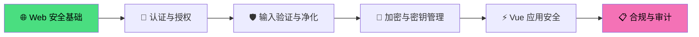
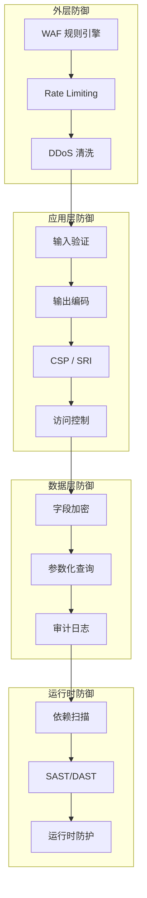
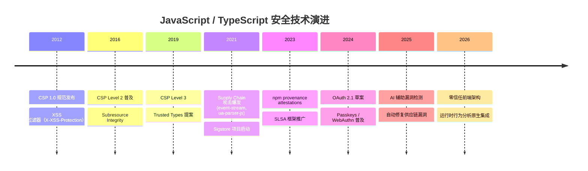

# 🔒 安全示例总览

> 安全不是功能，而是质量属性。本示例库聚焦 JavaScript / TypeScript 生态中的安全工程实践，从 Web 安全基础到 Vue 应用安全加固，提供可运行、可审计、可度量的防御方案。

现代 Web 应用面临的安全威胁日益复杂：XSS、CSRF、SQL 注入、供应链攻击、凭证泄漏、权限提升等漏洞持续造成生产事故。OWASP Top 10 的每一次更新都在提醒我们，安全必须融入软件开发生命周期的每一个环节[^1]。本示例库将安全理论转化为工程实践，帮助开发者在编码阶段就建立起纵深防御体系。

---

## 学习路径总览



## 安全领域全景

| 领域 | 核心威胁 | 防御策略 | 关键工具 |
|------|---------|---------|---------|
| **Web 安全基础** | XSS、CSRF、Clickjacking | CSP、SRI、同源策略 | helmet, DOMPurify |
| **认证授权** | 凭证泄漏、会话劫持、权限提升 | OAuth 2.1、RBAC、JWT 加固 | auth.js, CASL |
| **输入验证** | SQL 注入、NoSQL 注入、命令注入 | Schema 校验、参数化查询 | Zod, Joi, validator |
| **加密实践** | 明文传输、弱算法、密钥硬编码 | AES-256-GCM、Argon2、TLS 1.3 | crypto, node-forge |
| **Vue 安全** | 模板注入、Props 污染、XSS | v-html 白名单、Suspense 安全 | vue, @vue/compiler-sfc |
| **合规审计** | GDPR 违规、日志缺失、供应链风险 | 数据分类、审计日志、SBOM | Snyk, OWASP Dependency-Check |

---

## 核心安全原则

### 纵深防御（Defense in Depth）

安全不应依赖单点防线。纵深防御要求在每个层级都部署独立的控制措施：

- **网络层**：WAF、DDoS 防护、TLS 终止
- **应用层**：输入校验、输出编码、访问控制
- **数据层**：字段级加密、数据库审计、备份加密
- **运行时**：RASP、行为分析、异常检测



### 最小权限原则（Principle of Least Privilege）

每个组件、每个用户、每个进程都只应拥有完成其任务所需的最小权限集合。在 JavaScript / TypeScript 应用中，这意味着：

- **服务端**：数据库连接使用只读或受限账户，避免使用 `root`/`admin`
- **客户端**：敏感操作需要二次确认，关键 API 需要多因素认证
- **CI/CD**：构建流水线使用短期凭证，拒绝长期有效的 API Key
- **依赖包**：定期审计 `node_modules`，移除未使用的依赖以降低攻击面[^2]

### 默认安全（Secure by Default）

框架和库的默认配置应当是安全的。Vue 3 的默认设置已经体现了这一原则：自动转义插值表达式、禁用 `v-html` 的任意内容渲染、严格的 Props 类型检查。然而，开发者的不当使用仍然会引入漏洞——例如通过 `v-html` 渲染用户输入内容，或未对动态组件的 `is` 属性做白名单限制。

---

## Web 安全基础实战

Web 安全是所有 JavaScript 应用的安全基石。以下示例覆盖 OWASP Top 10 中的前端相关漏洞及其防御方案。

### 跨站脚本（XSS）防御

XSS 漏洞允许攻击者在受害者的浏览器中执行恶意脚本。Vue 的模板系统默认对 `{{ }}` 插值进行 HTML 实体编码，但 `v-html` 和 `v-text` 的误用仍可导致漏洞。

```vue
<!-- ❌ 危险：直接渲染用户输入 -->
<div v-html="userInput"></div>

<!-- ✅ 安全：使用 DOMPurify 净化后渲染 -->
<template>
  <div v-html="sanitizedHtml"></div>
</template>

<script setup lang="ts">
import DOMPurify from 'dompurify';
import { computed } from 'vue';

const props = defineProps<{
  userInput: string;
}>();

const sanitizedHtml = computed(() =>
  DOMPurify.sanitize(props.userInput, {
    ALLOWED_TAGS: ['b', 'i', 'em', 'strong', 'a'],
    ALLOWED_ATTR: ['href'],
  })
);
</script>
```

### 内容安全策略（CSP）

CSP 是防御 XSS 和数据注入的最强手段之一。通过 HTTP 响应头限制页面可以加载的资源来源：

```typescript
// Express.js 中配置 CSP（使用 helmet）
import helmet from 'helmet';

app.use(
  helmet.contentSecurityPolicy({
    directives: {
      defaultSrc: ["'self'"],
      scriptSrc: ["'self'", "'nonce-{random}'"],
      styleSrc: ["'self'", "'unsafe-inline'"],
      imgSrc: ["'self'", 'data:', 'https:'],
      connectSrc: ["'self'", 'https://api.example.com'],
      fontSrc: ["'self'"],
      objectSrc: ["'none'"],
      upgradeInsecureRequests: [],
    },
  })
);
```

### 跨站请求伪造（CSRF）防御

CSRF 攻击利用用户已认证的会话来执行非预期操作。防御策略包括：

- **CSRF Token**：服务端生成随机 Token，前端在每个状态变更请求中携带
- **SameSite Cookie**：设置 `SameSite=Strict` 或 `SameSite=Lax`
- **自定义请求头**：AJAX 请求添加非标准的 `X-Requested-With` 头，简单请求无法伪造

```typescript
// Axios 拦截器自动附加 CSRF Token
import axios from 'axios';

axios.interceptors.request.use((config) => {
  const token = document.querySelector('meta[name="csrf-token"]')?.getAttribute('content');
  if (token) {
    config.headers['X-CSRF-Token'] = token;
  }
  return config;
});
```

**快速链接**： [Web 安全基础完整指南](./web-security-fundamentals.md) | XSS 防御实战 | CSRF 与令牌管理

---

## 认证与授权实战

### OAuth 2.1 与 OpenID Connect

现代 Web 应用推荐使用 OAuth 2.1 + PKCE 流程进行第三方认证，避免在客户端暴露 Client Secret：

```typescript
// PKCE 流程实现（适用于 SPA 和移动端）
import { generateCodeVerifier, generateCodeChallenge } from 'oauth-pkce';

async function initiateOAuth() {
  const verifier = generateCodeVerifier(128);
  const challenge = await generateCodeChallenge(verifier);

  // 存储 verifier 到 sessionStorage（非 localStorage，防止 XSS 持久化）
  sessionStorage.setItem('oauth_verifier', verifier);

  const params = new URLSearchParams({
    client_id: CLIENT_ID,
    response_type: 'code',
    redirect_uri: REDIRECT_URI,
    code_challenge: challenge,
    code_challenge_method: 'S256',
    scope: 'openid profile email',
    state: generateRandomState(), // 防 CSRF
  });

  window.location.href = `${AUTHORIZATION_ENDPOINT}?${params}`;
}
```

### 基于角色的访问控制（RBAC）

在 Vue 应用中实现细粒度的权限控制：

```typescript
// CASL 能力定义与 Vue 集成
import { defineAbility } from '@casl/ability';
import { useAbility } from '@casl/vue';

const ability = defineAbility((can, cannot) => {
  can('read', 'Post');
  can('update', 'Post', { authorId: user.id });
  cannot('delete', 'Post');
});

// Vue 组件中使用
<template>
  <button v-if="can('update', post)">编辑</button>
  <button v-if="can('delete', post)" class="danger">删除</button>
</template>
```

---

## Vue 应用安全专题

Vue 生态因其声明式模板和响应式系统而广受欢迎，但开发者需要理解其安全边界和最佳实践。

### 模板注入防护

Vue 的单文件组件（SFC）编译器在构建时会对模板进行静态分析，动态组件的 `is` 属性若接收用户输入，可能导致组件注入攻击：

```vue
<!-- ❌ 危险：用户可控制渲染任意组件 -->
<component :is="userControlledComponent" />

<!-- ✅ 安全：白名单限制可渲染组件 -->
<script setup lang="ts">
import { computed } from 'vue';
import SafeComponentA from './SafeComponentA.vue';
import SafeComponentB from './SafeComponentB.vue';

const ALLOWED_COMPONENTS: Record<string, Component> = {
  'component-a': SafeComponentA,
  'component-b': SafeComponentB,
};

const props = defineProps<{ type: string }>();
const resolvedComponent = computed(() => ALLOWED_COMPONENTS[props.type] ?? 'div');
</script>

<template>
  <component :is="resolvedComponent" />
</template>
```

### Props 污染与类型安全

Vue 3 的 Props 校验在开发模式下提供运行时检查，但生产构建可能跳过这些检查。配合 TypeScript 实现编译时安全：

```typescript
// 严格的 Props 定义防止类型混淆攻击
interface UserProfileProps {
  userId: string;
  role: 'admin' | 'editor' | 'viewer';
  permissions: readonly string[];
}

const props = defineProps<UserProfileProps>();

// 拒绝未知属性（防止原型链污染）
const sanitizeUserData = (raw: unknown): UserProfileProps => {
  // 使用 Zod 进行深度校验
  return userProfileSchema.parse(raw);
};
```

### Vue SSR 安全注意事项

服务端渲染（SSR）引入了额外的攻击面，特别是序列化状态到 HTML 时的 XSS 风险：

```typescript
// ❌ 危险：直接序列化用户可控状态
const stateScript = `<script>window.__INITIAL_STATE__ = ${JSON.stringify(store.state)}</script>`;

// ✅ 安全：使用 @nuxt/devalue 或 serialize-javascript 进行安全序列化
import { uneval } from 'devalue';

const safeState = uneval(store.state);
const stateScript = `<script>window.__INITIAL_STATE__ = ${safeState}</script>`;
```

### Vue 生态系统安全扫描

定期审计 Vue 项目的依赖树：

```bash
# 使用 npm audit 检查已知漏洞
npm audit --audit-level=moderate

# 使用 Snyk 进行深度依赖分析
snyk test --severity-threshold=high

# 检查 lockfile 是否被篡改
npm ci --prefer-offline
```

---

## 输入验证与数据净化

所有用户输入都是不可信的。JavaScript / TypeScript 应用需要在边界处对输入进行严格的校验和净化。

### Schema 优先的验证策略

使用 Zod 定义数据契约，在 API 边界、表单提交和外部数据消费处统一校验：

```typescript
import { z } from 'zod';

// 用户注册表单 Schema
const registerSchema = z.object({
  email: z.string().email().max(254).toLowerCase(),
  password: z
    .string()
    .min(12)
    .max(128)
    .regex(/^(?=.*[a-z])(?=.*[A-Z])(?=.*\d)(?=.*[@$!%*?&])[A-Za-z\d@$!%*?&]+$/, {
      message: '密码必须包含大小写字母、数字和特殊字符',
    }),
  username: z
    .string()
    .min(3)
    .max(30)
    .regex(/^[a-zA-Z0-9_-]+$/, {
      message: '用户名只能包含字母、数字、下划线和连字符',
    }),
});

// 在 API Route 中使用
app.post('/api/register', async (req, res) => {
  const result = registerSchema.safeParse(req.body);
  if (!result.success) {
    return res.status(400).json({ errors: result.error.flatten() });
  }
  // 使用 result.data（已类型安全）
});
```

### SQL 注入防御

无论使用原生驱动还是 ORM，都必须使用参数化查询：

```typescript
// ✅ 安全：参数化查询（Prisma）
const users = await prisma.user.findMany({
  where: {
    email: { equals: userInput }, // 自动转义
    role: 'user',
  },
});

// ✅ 安全：参数化查询（pg 原生）
const result = await pool.query('SELECT * FROM users WHERE email = $1', [userInput]);

// ❌ 危险：字符串拼接
const result = await pool.query(`SELECT * FROM users WHERE email = '${userInput}'`);
```

---

## 加密与密钥管理

### 密码哈希

用户密码必须使用专门的密码哈希算法，禁止直接使用 SHA-256 等快速哈希：

```typescript
import * as argon2 from 'argon2';

// 注册时哈希密码
const hash = await argon2.hash(plainPassword, {
  type: argon2.argon2id,
  memoryCost: 65536,  // 64 MB
  timeCost: 3,        // 3 轮迭代
  parallelism: 4,     // 4 并行线程
});

// 验证时对比
const valid = await argon2.verify(hash, plainPassword);
```

### 对称加密（AES-256-GCM）

敏感数据字段级加密示例：

```typescript
import { createCipheriv, createDecipheriv, randomBytes, scryptSync } from 'crypto';

const ALGORITHM = 'aes-256-gcm';
const KEY_LENGTH = 32;
const IV_LENGTH = 16;
const AUTH_TAG_LENGTH = 16;

function encrypt(plaintext: string, masterKey: Buffer): { ciphertext: string; iv: string; tag: string } {
  const iv = randomBytes(IV_LENGTH);
  const cipher = createCipheriv(ALGORITHM, masterKey, iv);
  const encrypted = Buffer.concat([cipher.update(plaintext, 'utf8'), cipher.final()]);
  const tag = cipher.getAuthTag();

  return {
    ciphertext: encrypted.toString('base64'),
    iv: iv.toString('base64'),
    tag: tag.toString('base64'),
  };
}
```

---

## 合规与审计

### 安全审计 Checklist

| 检查项 | 等级 | 验证方式 | 工具 |
|--------|------|---------|------|
| 依赖漏洞扫描 | P0 | CI 自动执行 | Snyk, npm audit |
| 静态代码分析 | P0 | 每次 PR | ESLint security plugin, Semgrep |
| 密钥硬编码检测 | P0 | 预提交钩子 | git-secrets, detect-secrets |
| 敏感数据分类 | P1 | 季度审计 | 手动 + 正则扫描 |
| 访问日志完整性 | P1 | 实时监控 | ELK / Loki |
| GDPR 数据删除 | P1 | 自动化测试 | 数据生命周期脚本 |

### 供应链安全

npm 生态的供应链攻击日益频繁。以下措施可降低风险：

- **Lockfile 完整性**：`package-lock.json` / `pnpm-lock.yaml` 纳入版本控制，禁止自动更新
- **依赖签名验证**：启用 npm 的签名验证（`npm audit signatures`）
- **最小依赖原则**：定期清理未使用的依赖（`depcheck`）
- **私有 Registry**：企业环境使用私有 npm 镜像，缓存并审计所有包[^3]

---

## 与理论专题的映射

安全示例与网站理论专题深度关联，形成从理论到实践的完整闭环：

| 示例 | 理论支撑 |
|------|---------|
| [Web 安全基础](./web-security-fundamentals.md) | [应用设计理论](/application-design/) — 安全架构设计、威胁建模、安全需求分析 |
| Vue 应用安全 | [框架模型理论](/framework-models/) — 组件生命周期安全、模板编译安全 |
| 输入验证与 Schema | [TypeScript 类型系统](/typescript-type-system/) — 类型驱动验证、运行时-编译时一致性 |
| 加密实践 | [对象模型](/object-model/) — 内存安全、序列化安全 |
| 供应链安全 | [模块系统](/module-system/) — 依赖管理、包完整性验证 |

---

## 生产部署 Checklist

### 发布前安全审查

- [ ] 所有用户输入点均已配置校验规则（Zod / Joi / Yup）
- [ ] `v-html` 使用场景已审计，均经过 DOMPurify 净化
- [ ] CSP 响应头已配置并经过兼容性测试
- [ ] 认证 Cookie 设置了 `HttpOnly`、`Secure`、`SameSite=Strict`
- [ ] 数据库查询全部使用参数化查询或 ORM
- [ ] 密码哈希使用 Argon2id，禁止 MD5 / SHA1 / 明文存储
- [ ] 依赖漏洞扫描通过（`npm audit` 无 High/Critical）
- [ ] 密钥未硬编码在源码中，使用环境变量或密钥管理服务
- [ ] 错误响应不包含堆栈跟踪或敏感信息
- [ ] 静态资源启用 SRI（Subresource Integrity）校验

### 运行时监控

| 告警类型 | 阈值 | 响应时间 |
|---------|------|---------|
| XSS 尝试（CSP 违规上报） | > 10 次/分钟 | 立即 |
| 认证失败率突增 | > 5%（5min） | 5 分钟 |
| 敏感 API 异常访问 | 非预期 IP / 频率 | 立即 |
| 依赖漏洞新披露 | CVE 发布 | 24 小时内评估 |

---

## 技术演进趋势



### 前沿趋势

- **Passkeys 取代密码**：WebAuthn / FIDO2 成为主流认证方式，消除钓鱼攻击和凭证重用的风险
- **Trusted Types**：强制要求所有 DOM XSS 风险点使用受信任的 Type，从 API 层面消除 innerHTML 类漏洞[^4]
- **SLSA 供应链框架**：从源码到制品的完整可追溯链条，防止构建环节的攻击
- **AI 辅助安全检测**：大语言模型辅助代码审计，自动识别漏洞模式并生成修复建议

---

## 参考资源

### 规范与标准

- [OWASP Top 10 2021](https://owasp.org/Top10/) — Web 应用十大安全风险
- [OWASP Cheat Sheet Series](https://cheatsheetseries.owasp.org/) — 安全开发速查表
- [CSP 规范 (W3C)](https://www.w3.org/TR/CSP3/) — 内容安全策略标准
- [OAuth 2.1 草案](https://datatracker.ietf.org/doc/draft-ietf-oauth-v2-1/) — 授权框架更新

### 工具与框架

- [DOMPurify](https://github.com/cure53/DOMPurify) — 浏览器端 HTML 净化库
- [Helmet](https://helmetjs.github.io/) — Express 安全中间件集合
- [Zod](https://zod.dev/) — TypeScript 优先的 Schema 验证
- [Auth.js](https://authjs.dev/) — 认证库（原 NextAuth.js）
- [CASL](https://casl.js.org/) — 同构的权限管理库
- [Snyk](https://snyk.io/) — 依赖漏洞扫描平台

### Vue 生态安全资源

- [Vue.js 安全指南](https://vuejs.org/guide/best-practices/security.html) — 官方安全最佳实践
- [Vue 模板编译器安全模型](https://github.com/vuejs/core/blob/main/packages/compiler-core/src/) — 编译时 XSS 防护原理
- [Nuxt Security 模块](https://nuxt-security.vercel.app/) — Nuxt 应用的自动化安全加固

### 经典著作

- *The Tangled Web: A Guide to Securing Modern Web Applications* — Michal Zalewski. 2012. 浏览器安全模型的经典解读，深入解析同源策略、内容安全策略和浏览器架构的安全边界[^5]。
- *Real-World Cryptography* — David Wong. 2021. 现代密码学实践指南，涵盖对称加密、公钥基础设施和认证协议的实际实现。
- *Threat Modeling: Designing for Security* — Adam Shostack. 2014. 威胁建模方法论，帮助开发者在设计阶段识别和消减安全风险。

---

## 贡献指南

安全示例的贡献需要特别注意：

1. **漏洞示例必须附带防御方案**：禁止单独展示漏洞利用代码而无修复说明
2. **密钥使用占位符**：所有示例中的密钥、Token、密码必须使用明显占位符（如 `YOUR_SECRET_KEY`）
3. **版本锁定**：安全工具和库的版本必须明确标注，避免已知漏洞版本
4. **遵循 Vue/VitePress 安全规范**：Markdown 中不使用未转义的 HTML 标签，外部链接使用 `rel="noopener noreferrer"`
5. **与理论专题建立映射**：每个示例需关联到对应的理论专题页面

---

## 脚注

[^1]: OWASP Foundation. "OWASP Top 10:2021." OWASP, 2021. <https://owasp.org/Top10/>

[^2]: Zimmermann, Marcus, et al. "Small World with High Risks: A Study of Security Threats in the npm Ecosystem." *USENIX Security Symposium*, 2019.

[^3]: Ladisa, Piergiorgio, et al. "SOAR: A Synthesis of Attack Paths and Vulnerability Repositories." *IEEE Symposium on Security and Privacy (S&P)*, 2023.

[^4]: Google Chrome Team. "Trusted Types." *web.dev*, 2023. <https://web.dev/trusted-types/>

[^5]: Zalewski, Michal. *The Tangled Web: A Guide to Securing Modern Web Applications*. No Starch Press, 2012.
