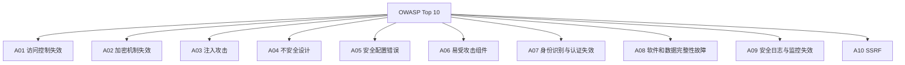
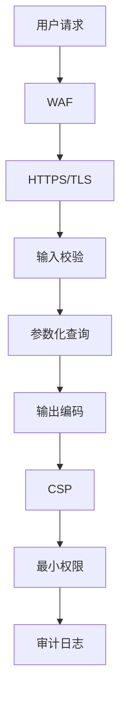

# OWASP Top 10 防御实战

> OWASP Top 10 是 Web 应用安全领域最具影响力的标准文档，代表了当前最普遍和最关键的安全风险。本文档将系统讲解每一项风险的防御策略，并提供可直接落地的 TypeScript/Node.js 代码示例。

## OWASP Top 10 2021 概览



## A01: 访问控制失效

### 垂直越权防护

```typescript
// 错误示例：仅前端隐藏按钮
function AdminPanel() &#123;
  // 危险！仅依赖前端条件
  if (user.role === 'admin') &#123;
    return <AdminDashboard />;
  &#125;
&#125;

// 正确示例：后端校验 + 最小权限
async function getAdminData(req: Request) &#123;
  const session = await verifySession(req);

  // 后端强制校验权限
  if (!session.user.permissions.includes('admin:read')) &#123;
    throw new HTTPError(403, 'Insufficient permissions');
  &#125;

  return await db.query.admin.getAll();
&#125;
```

### 水平越权防护

```typescript
// 错误示例：仅校验登录态
app.get('/api/orders/:orderId', async (req, res) => &#123;
  // 危险！任何登录用户都能访问任意订单
  const order = await db.orders.findById(req.params.orderId);
  res.json(order);
&#125;);

// 正确示例：数据级权限校验
app.get('/api/orders/:orderId', requireAuth, async (req, res) => &#123;
  const order = await db.orders.findById(req.params.orderId);

  // 校验当前用户是否有权访问此订单
  if (order.userId !== req.user.id && !req.user.isAdmin) &#123;
    throw new HTTPError(403, 'Access denied');
  &#125;

  res.json(order);
&#125;);
```

## A03: 注入攻击防御

### SQL 注入

```typescript
// 错误示例：字符串拼接
const query = `SELECT * FROM users WHERE email = '$&#123;email&#125;'`;

// 正确示例：参数化查询
const user = await db.prepare('SELECT * FROM users WHERE email = ?')
  .bind(email)
  .first();

// 使用 ORM（Prisma）
const user = await prisma.user.findUnique(&#123;
  where: &#123; email &#125;,
&#125;);
```

### NoSQL 注入

```typescript
// 错误示例：直接传入对象
app.post('/login', async (req, res) => &#123;
  const user = await db.users.findOne(req.body); // 危险！
&#125;);

// 正确示例：严格校验输入
import &#123; z &#125; from 'zod';

const LoginSchema = z.object(&#123;
  email: z.string().email(),
  password: z.string().min(8),
&#125;);

app.post('/login', async (req, res) => &#123;
  const &#123; email, password &#125; = LoginSchema.parse(req.body);
  const user = await db.users.findOne(&#123; email &#125;);
  // ...
&#125;);
```

### 命令注入

```typescript
// 错误示例
const result = execSync(`git log --author=$&#123;author&#125;`);

// 正确示例：使用数组参数
import &#123; execFileSync &#125; from 'child_process';
const result = execFileSync('git', ['log', '--author', author]);
```

## A07: 身份认证失效

### JWT 安全实践

```typescript
import &#123; SignJWT, jwtVerify &#125; from 'jose';

// 生成 Token
const token = await new SignJWT(&#123; userId: user.id, role: user.role &#125;)
  .setProtectedHeader(&#123; alg: 'HS256' &#125;)
  .setIssuedAt()
  .setExpirationTime('2h')
  .setAudience('api.example.com')
  .setIssuer('auth.example.com')
  .sign(new TextEncoder().encode(JWT_SECRET));

// 验证 Token
async function verifyToken(token: string) &#123;
  try &#123;
    const &#123; payload &#125; = await jwtVerify(token, new TextEncoder().encode(JWT_SECRET), &#123;
      audience: 'api.example.com',
      issuer: 'auth.example.com',
      clockTolerance: 60,
    &#125;);
    return payload;
  &#125; catch (e) &#123;
    throw new HTTPError(401, 'Invalid token');
  &#125;
&#125;
```

### 密码安全

```typescript
import bcrypt from 'bcrypt';

// 注册时哈希密码
const saltRounds = 12;
const hashedPassword = await bcrypt.hash(password, saltRounds);

// 验证密码
const isValid = await bcrypt.compare(password, hashedPassword);

// 密钥派生（替代方案）
import &#123; hash, verify &#125; from 'argon2';
const argonHash = await hash(password);
const isValidArgon = await verify(argonHash, password);
```

## A03: XSS 防御

### 内容安全策略 (CSP)

```typescript
// Express 中间件
app.use((req, res, next) => &#123;
  res.setHeader('Content-Security-Policy',
    "default-src 'self'; " +
    "script-src 'self' 'nonce-$&#123;res.locals.nonce&#125;'; " +
    "style-src 'self' 'nonce-$&#123;res.locals.nonce&#125;'; " +
    "img-src 'self' data: https:; " +
    "connect-src 'self' https://api.example.com; " +
    "frame-ancestors 'none'; " +
    "base-uri 'self'; " +
    "form-action 'self';"
  );
  next();
&#125;);
```

### 输出编码

```typescript
// React 自动转义（默认安全）
function Comment(&#123; text &#125;) &#123;
  return <div>&#123;text&#125;</div>; // 自动转义 <script>
&#125;

// 危险！使用 dangerouslySetInnerHTML
function UnsafeComment(&#123; html &#125;) &#123;
  return <div dangerouslySetInnerHTML=&#123;&#123; __html: html &#125;&#125; />;
&#125;

// 安全的 Markdown 渲染
import DOMPurify from 'dompurify';
import &#123; JSDOM &#125; from 'jsdom';

const window = new JSDOM('').window;
const purify = DOMPurify(window);

const clean = purify.sanitize(dirtyHtml, &#123;
  ALLOWED_TAGS: ['b', 'i', 'em', 'strong', 'a', 'p'],
  ALLOWED_ATTR: ['href'],
&#125;);
```

## A06: 易受攻击组件

### 依赖管理

```bash
# 扫描漏洞
npm audit
npm audit fix

# 使用 Snyk
npx snyk test
npx snyk monitor

# 使用 Dependabot（GitHub 内置）
# .github/dependabot.yml
version: 2
updates:
  - package-ecosystem: npm
    directory: /
    schedule:
      interval: weekly
    open-pull-requests-limit: 10
```

```typescript
// 运行时版本检查
import packageJson from '../package.json';

const vulnerablePackages = ['lodash', 'axios'];
for (const pkg of vulnerablePackages) &#123;
  const version = packageJson.dependencies[pkg];
  const isVulnerable = await checkVulnerability(pkg, version);
  if (isVulnerable) &#123;
    console.error(`Vulnerable package: $&#123;pkg&#125;@$&#123;version&#125;`);
  &#125;
&#125;
```

## 纵深防御清单



| 层次 | 措施 | 工具/技术 |
|------|------|----------|
| 网络层 | TLS 1.3、HSTS | cert-manager, Let's Encrypt |
| 应用层 | WAF、Rate Limit | Cloudflare, express-rate-limit |
| 输入层 | 校验、清洗 | Zod, validator.js |
| 数据层 | 参数化查询 | Prisma, pg-promise |
| 输出层 | 编码、CSP | DOMPurify, Helmet |
| 会话层 | JWT、HttpOnly Cookie | jose, csurf |
| 基础设施 | 漏洞扫描 | Snyk, Dependabot, Trivy |

## 参考资源

| 资源 | 链接 |
|------|------|
| OWASP Top 10 | <https://owasp.org/Top10/> |
| OWASP Cheat Sheets | <https://cheatsheetseries.owasp.org/> |
| Mozilla Security Guidelines | <https://infosec.mozilla.org/guidelines/web_security> |
| Helmet.js | <https://helmetjs.github.io/> |

---

 [← 返回安全示例首页](./)
