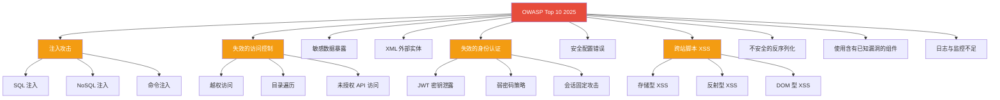
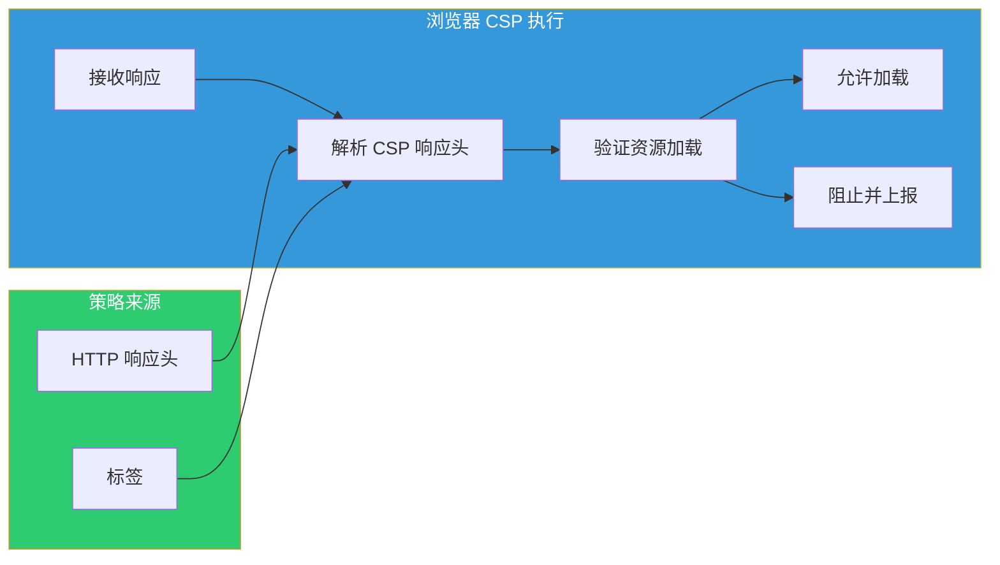
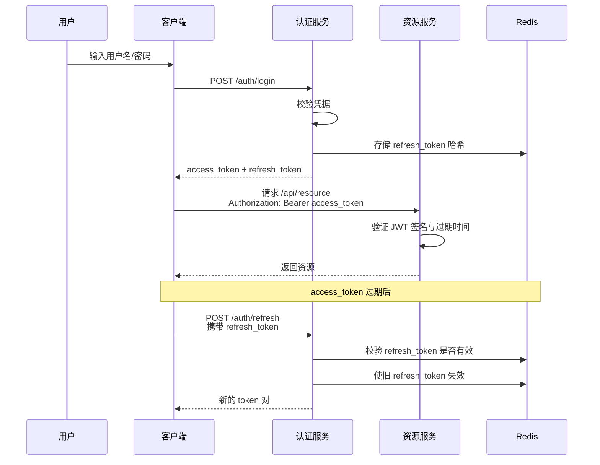

# Web 安全基础实战

> 本示例与 [应用设计](/application-design/) 专题的 [09 安全设计](/application-design/09-security-by-design) 形成映射关系，提供从理论到代码的完整安全实践参考。

Web 安全是现代应用开发的基石。随着攻击手段的不断演进，开发者必须建立系统化的安全思维，将防御措施融入软件开发生命周期的每一个环节。本文档基于 **OWASP Top 10 2025**[^1] 最新风险清单，结合行业最佳实践，提供可落地的防御代码与配置方案。

## 目录

- [OWASP Top 10 2025 详解](#owasp-top-10-2025-详解)
- [内容安全策略（CSP）配置](#内容安全策略csp配置)
- [HTTPS/TLS 最佳实践](#httpstls-最佳实践)
- [身份认证安全](#身份认证安全)
- [输入校验与净化](#输入校验与净化)
- [CSRF 与 XSS 防御](#csrf-与-xss-防御)
- [SQL 注入防御](#sql-注入防御)

---

## OWASP Top 10 2025 详解

开放 Web 应用程序安全项目（OWASP）每数年发布一次最具影响力的 Web 安全风险清单。2025 版在前序版本基础上，新增了与 API 安全、供应链攻击相关的风险项，并强调了现代云原生环境下的安全挑战。

### 安全风险全景概览



### 1. 注入攻击（Injection）

注入攻击发生在不可信数据作为命令或查询的一部分被发送到解释器时。攻击者的恶意数据可以诱使解释器执行非预期的命令或访问未授权的数据。

#### 原理分析

当应用程序将用户输入直接拼接进 SQL 查询、操作系统命令、LDAP 查询或任何其他解释性语句时，注入漏洞便产生了。攻击者通过构造特殊输入，改变原有语句的语义结构，从而执行任意操作。

#### 攻击示例

假设某登录接口的伪代码如下：

```javascript
// 危险代码：直接拼接用户输入
const query = `SELECT * FROM users WHERE username = '${username}' AND password = '${password}'`;
```

攻击者输入：

- 用户名: `admin' --`
- 密码: 任意值

生成的 SQL 变为：

```sql
SELECT * FROM users WHERE username = 'admin' --' AND password = '任意值'
```

 `--` 注释掉了密码校验，攻击者无需密码即可登录。

#### 防御代码

```javascript
// 使用参数化查询（Node.js + pg 示例）
import &#123; Pool } from 'pg';

const pool = new Pool(&#123; connectionString: process.env.DATABASE_URL });

async function authenticateUser(username, password) &#123;
  // 正确的做法：使用参数化查询
  const query = {
    text: 'SELECT id, username, password_hash FROM users WHERE username = $1',
    values: [username],
  };

  const result = await pool.query(query);

  if (result.rows.length === 0) &#123;
    return null; // 用户不存在
  }

  const user = result.rows[0];
  const valid = await bcrypt.compare(password, user.password_hash);

  return valid ? user : null;
}
```

### 2. 失效的访问控制（Broken Access Control）

访问控制策略决定了用户是否可以执行某项操作或访问特定资源。当这些策略配置错误或被绕过时，便形成了失效的访问控制漏洞。

#### 原理分析

常见的失效模式包括：

- 通过修改 URL 参数（如 `user_id=1234`）访问其他用户数据
- 未对敏感操作进行权限校验（如删除、修改）
- 允许通过修改 HTTP 方法绕过前端权限检查
- CORS 配置过于宽松，允许恶意网站发起跨域请求

#### 攻击示例

```http
GET /api/orders/1001 HTTP/1.1
Host: shop.example.com
Authorization: Bearer <user_token>
```

攻击者尝试：

```http
GET /api/orders/1002 HTTP/1.1
Host: shop.example.com
Authorization: Bearer <user_token>
```

如果服务端未校验订单 1002 是否属于当前用户，攻击者即可查看他人订单。

#### 防御代码

```javascript
// Express.js 中间件：资源所有权校验
async function authorizeOrderAccess(req, res, next) &#123;
  const orderId = req.params.id;
  const userId = req.user.id; // 从 JWT 解析

  const order = await Order.findById(orderId);

  if (!order) &#123;
    return res.status(404).json(&#123; error: 'Order not found' });
  }

  // 严格的权限校验
  if (order.user_id !== userId && req.user.role !== 'admin') &#123;
    // 记录潜在的安全事件
    auditLog.warn('Unauthorized access attempt', &#123;
      targetOrder: orderId,
      attemptedBy: userId,
      ip: req.ip,
      timestamp: new Date().toISOString(),
    });

    return res.status(403).json(&#123; error: 'Access denied' });
  }

  req.order = order;
  next();
}

// 应用路由
app.get('/api/orders/:id', authenticateJWT, authorizeOrderAccess, getOrderDetails);
```

### 3. 敏感数据暴露（Sensitive Data Exposure）

当应用程序未能充分保护敏感数据（如密码、信用卡号、健康记录、个人身份信息等）时，攻击者可能通过窃取或嗅探手段获取这些数据。

#### 防御措施

```javascript
// 环境变量配置（.env 示例）
// NODE_ENV=production
// DB_PASSWORD=your_strong_password
// JWT_SECRET=minimum_32_bytes_random_string
// ENCRYPTION_KEY=your_aes_256_key

// 数据传输加密配置
import helmet from 'helmet';
import rateLimit from 'express-rate-limit';

const app = express();

// 强制 HTTPS
app.use((req, res, next) => &#123;
  if (req.headers['x-forwarded-proto'] !== 'https' && process.env.NODE_ENV === 'production') &#123;
    return res.redirect(301, `https://$&#123;req.headers.host}$&#123;req.url}`);
  }
  next();
});

// 安全响应头
app.use(helmet(&#123;
  contentSecurityPolicy: &#123;
    directives: &#123;
      defaultSrc: ["'self'"],
      styleSrc: ["'self'", "'unsafe-inline'"],
      scriptSrc: ["'self'"],
      imgSrc: ["'self'", "data:", "https:"],
    },
  },
  hsts: &#123;
    maxAge: 31536000,
    includeSubDomains: true,
    preload: true,
  },
}));

// 限流防止暴力破解
const authLimiter = rateLimit(&#123;
  windowMs: 15 * 60 * 1000, // 15 分钟
  max: 5, // 每 IP 最多 5 次登录尝试
  message: 'Too many login attempts, please try again later',
  standardHeaders: true,
  legacyHeaders: false,
});

app.use('/api/auth/login', authLimiter);
```

### 4. 失效的身份认证（Broken Authentication）

身份认证机制实现不当，允许攻击者 compromise 密码、密钥、会话令牌，或利用其他实现缺陷冒充其他用户身份。

#### 安全会话管理

```javascript
// 安全的 Cookie 配置
app.use(session(&#123;
  name: 'sessionId',
  secret: process.env.SESSION_SECRET,
  resave: false,
  saveUninitialized: false,
  cookie: &#123;
    secure: true,      // 仅通过 HTTPS 传输
    httpOnly: true,    // 禁止 JavaScript 访问
    maxAge: 3600000,   // 1 小时过期
    sameSite: 'strict', // 防止 CSRF
    domain: 'example.com',
  },
  store: new RedisStore(&#123; client: redisClient }), // 服务端存储
}));
```

---

## 内容安全策略（CSP）配置

内容安全策略（Content Security Policy）是一种有效的深度防御机制，用于缓解 XSS 和数据注入攻击。通过指定允许加载资源的来源，CSP 可以显著降低攻击面。

### CSP 策略设计



### 渐进式 CSP 部署

```javascript
// 阶段 1：仅报告模式（Report-Only）
// 收集违规报告但不阻止加载
app.use((req, res, next) => &#123;
  res.setHeader(
    'Content-Security-Policy-Report-Only',
    "default-src 'self'; " +
    "script-src 'self' 'nonce-$&#123;res.locals.nonce}'; " +
    "style-src 'self' 'unsafe-inline'; " +
    "img-src 'self' data: https:; " +
    "font-src 'self'; " +
    "connect-src 'self' https://api.example.com; " +
    "frame-ancestors 'none'; " +
    "base-uri 'self'; " +
    "form-action 'self'; " +
    "report-uri https://report-uri.example.com/csp"
  );
  next();
});

// 阶段 2：生成内联脚本 nonce
app.use((req, res, next) => &#123;
  res.locals.nonce = crypto.randomBytes(16).toString('base64');
  next();
});
```

### HTML 模板中的 nonce 使用

```html
<!-- 在服务端渲染模板中使用 nonce -->
<script nonce="$&#123;nonce}">
  // 这个内联脚本会被浏览器允许
  window.APP_CONFIG = &#123;
    apiUrl: 'https://api.example.com',
    version: '1.2.3',
  };
</script>

<!-- 未带 nonce 的内联脚本会被 CSP 阻止 -->
<script>
  // 这会被浏览器拒绝执行
  alert('Blocked by CSP');
</script>
```

### CSP 违规上报端点

```javascript
// 收集 CSP 违规报告的 Express 路由
app.post('/csp-report', express.json(&#123; type: 'application/csp-report' }), (req, res) => &#123;
  const report = req.body;

  // 结构化日志记录
  logger.warn('CSP violation detected', &#123;
    documentUri: report['csp-report']?.['document-uri'],
    blockedUri: report['csp-report']?.['blocked-uri'],
    violatedDirective: report['csp-report']?.['violated-directive'],
    sourceFile: report['csp-report']?.['source-file'],
    lineNumber: report['csp-report']?.['line-number'],
    userAgent: req.headers['user-agent'],
    ip: req.ip,
  });

  res.status(204).send();
});
```

---

## HTTPS/TLS 最佳实践

传输层安全（TLS）是保护 Web 通信的基石。配置不当的 TLS 可能导致中间人攻击、协议降级攻击等严重后果。

### TLS 配置检查清单

| 配置项 | 推荐设置 | 风险说明 |
|--------|----------|----------|
| 最低 TLS 版本 | TLS 1.2+ | TLS 1.0/1.1 存在已知漏洞 |
| 证书类型 | ECDSA P-256 或 RSA 2048+ | 弱密钥可被暴力破解 |
| HSTS | max-age=31536000; includeSubDomains; preload | 防止 SSL 剥离攻击 |
| 证书透明度 | 要求 CT 日志 | 防止未授权证书颁发 |
| OCSP Stapling | 启用 | 提高连接性能与隐私 |

### Node.js HTTPS 服务器配置

```javascript
import https from 'https';
import fs from 'fs';

const tlsOptions = &#123;
  // 服务器证书与私钥
  key: fs.readFileSync('server.key'),
  cert: fs.readFileSync('server.crt'),

  // 强制 TLS 1.2+
  minVersion: 'TLSv1.2',
  maxVersion: 'TLSv1.3',

  // 强密码套件
  ciphers: [
    'TLS_AES_256_GCM_SHA384',
    'TLS_CHACHA20_POLY1305_SHA256',
    'TLS_AES_128_GCM_SHA256',
    'ECDHE-RSA-AES256-GCM-SHA384',
    'ECDHE-RSA-CHACHA20-POLY1305',
  ].join(':'),

  // 优先使用服务器密码套件
  honorCipherOrder: true,

  // 启用 OCSP Stapling
  ocsp staple: true,

  // 会话恢复
  sessionTimeout: 300,
  sessionIdContext: 'my-app-context',
};

https.createServer(tlsOptions, app).listen(443, () => &#123;
  console.log('HTTPS server running on port 443');
});
```

### HTTP 严格传输安全（HSTS）

HSTS 响应头指示浏览器在一段时间内只能通过 HTTPS 访问当前域名，有效防止 SSL 剥离攻击。

```nginx
# Nginx 配置示例
server &#123;
    listen 443 ssl http2;
    server_name example.com;

    # HSTS 预加载
    add_header Strict-Transport-Security "max-age=31536000; includeSubDomains; preload" always;

    # 其他安全头
    add_header X-Frame-Options "DENY" always;
    add_header X-Content-Type-Options "nosniff" always;
    add_header Referrer-Policy "strict-origin-when-cross-origin" always;
    add_header Permissions-Policy "geolocation=(), microphone=(), camera=()" always;
}
```

---

## 身份认证安全

现代 Web 应用通常采用无状态的 JWT（JSON Web Token）或基于 OAuth 2.0 / OpenID Connect 的第三方认证。每种方案都有其特定的安全考量。

### JWT 安全实现



#### JWT 生成与校验

```javascript
import jwt from 'jsonwebtoken';
import crypto from 'crypto';

// 密钥配置
const ACCESS_TOKEN_SECRET = process.env.ACCESS_TOKEN_SECRET; // 256-bit 随机字符串
const REFRESH_TOKEN_SECRET = process.env.REFRESH_TOKEN_SECRET;

// Token 配置
const TOKEN_CONFIG = &#123;
  accessToken: &#123;
    expiresIn: '15m',      // 短有效期
    algorithm: 'HS256',    // 强签名算法
  },
  refreshToken: &#123;
    expiresIn: '7d',
    algorithm: 'HS256',
  },
};

class TokenService &#123;
  /**
   * 生成访问令牌与刷新令牌对
   */
  static generateTokenPair(user) &#123;
    const payload = &#123;
      sub: user.id,
      email: user.email,
      role: user.role,
      jti: crypto.randomUUID(), // 唯一令牌标识
      iat: Date.now(),
    };

    const accessToken = jwt.sign(payload, ACCESS_TOKEN_SECRET, TOKEN_CONFIG.accessToken);
    const refreshToken = jwt.sign(
      &#123; sub: user.id, jti: crypto.randomUUID(), type: 'refresh' },
      REFRESH_TOKEN_SECRET,
      TOKEN_CONFIG.refreshToken
    );

    return &#123; accessToken, refreshToken };
  }

  /**
   * 安全地验证访问令牌
   */
  static verifyAccessToken(token) &#123;
    try &#123;
      const decoded = jwt.verify(token, ACCESS_TOKEN_SECRET, &#123;
        algorithms: ['HS256'], // 明确指定允许的算法，防止算法混淆攻击
        clockTolerance: 30,    // 30 秒时钟偏差容限
      });

      // 检查令牌是否在黑名单中（用户登出、密码修改等场景）
      const isRevoked = await redis.get(`jwt:revoke:$&#123;decoded.jti}`);
      if (isRevoked) &#123;
        throw new Error('Token has been revoked');
      }

      return decoded;
    } catch (err) &#123;
      throw new AuthenticationError(`Invalid token: $&#123;err.message}`);
    }
  }
}
```

### OAuth 2.0 + PKCE 实现

在移动应用和单页应用（SPA）中，授权码模式配合 PKCE（Proof Key for Code Exchange）是推荐的安全实践。

```javascript
// PKCE 流程实现
import crypto from 'crypto';

class PKCEFlow &#123;
  /**
   * 生成 PKCE 参数
   */
  static generatePKCE() &#123;
    // 生成 32 字节随机码
    const codeVerifier = crypto.randomBytes(32).toString('base64url');

    // 计算 code_challenge
    const codeChallenge = crypto
      .createHash('sha256')
      .update(codeVerifier)
      .digest('base64url');

    return &#123;
      codeVerifier,
      codeChallenge,
      codeChallengeMethod: 'S256',
    };
  }

  /**
   * 构建授权 URL
   */
  static buildAuthorizationUrl(config, pkce) &#123;
    const params = new URLSearchParams(&#123;
      client_id: config.clientId,
      response_type: 'code',
      redirect_uri: config.redirectUri,
      scope: config.scopes.join(' '),
      code_challenge: pkce.codeChallenge,
      code_challenge_method: pkce.codeChallengeMethod,
      state: crypto.randomBytes(16).toString('hex'), // CSRF 防护
    });

    return `$&#123;config.authorizationEndpoint}?$&#123;params.toString()}`;
  }
}

// 服务端校验授权码
app.post('/auth/callback', async (req, res) => &#123;
  const &#123; code, state, code_verifier } = req.body;

  // 校验 state 防止 CSRF
  if (state !== req.session.oauthState) &#123;
    return res.status(400).json(&#123; error: 'Invalid state parameter' });
  }

  // 交换授权码获取令牌
  const tokenResponse = await fetch('https://provider.com/oauth/token', &#123;
    method: 'POST',
    headers: &#123; 'Content-Type': 'application/x-www-form-urlencoded' },
    body: new URLSearchParams(&#123;
      grant_type: 'authorization_code',
      client_id: CLIENT_ID,
      client_secret: CLIENT_SECRET,
      code,
      redirect_uri: REDIRECT_URI,
      code_verifier, // 必须包含原始的 code_verifier
    }),
  });

  const tokens = await tokenResponse.json();
  // 安全存储令牌...
});
```

---

## 输入校验与净化

所有来自外部的数据都应当被视为不可信的。系统化的输入校验是防止注入攻击、数据污染和业务逻辑漏洞的第一道防线。

### Zod Schema 校验

Zod 是 TypeScript 优先的 Schema 声明与校验库，提供类型安全、可组合和清晰的错误信息。

```typescript
import &#123; z } from 'zod';
import &#123; fromZodError } from 'zod-validation-error';

// 基础类型定义
const EmailSchema = z.string()
  .email('无效的邮箱格式')
  .min(5, '邮箱过短')
  .max(254, '邮箱过长')
  .transform(email => email.toLowerCase().trim());

const PasswordSchema = z.string()
  .min(12, '密码至少需要 12 个字符')
  .max(128, '密码过长')
  .regex(/[A-Z]/, '必须包含大写字母')
  .regex(/[a-z]/, '必须包含小写字母')
  .regex(/[0-9]/, '必须包含数字')
  .regex(/[^A-Za-z0-9]/, '必须包含特殊字符');

// 用户注册请求校验
const RegisterRequestSchema = z.object(&#123;
  email: EmailSchema,
  password: PasswordSchema,
  username: z.string()
    .min(3, '用户名至少需要 3 个字符')
    .max(30, '用户名过长')
    .regex(/^[a-zA-Z0-9_-]+$/, '用户名只能包含字母、数字、下划线和连字符'),
  age: z.number()
    .int('年龄必须是整数')
    .min(13, '用户必须年满 13 岁')
    .max(120, '无效的年龄')
    .optional(),
  bio: z.string()
    .max(500, '个人简介过长')
    .refine(
      text => !/<script|javascript:|on\w+=/i.test(text),
      '简介包含潜在的危险内容'
    )
    .optional(),
}).strict(); // 拒绝未定义的字段

// 中间件封装
function validateBody(schema) &#123;
  return async (req, res, next) => &#123;
    const result = await schema.safeParseAsync(req.body);

    if (!result.success) &#123;
      const error = fromZodError(result.error);
      return res.status(400).json(&#123;
        error: 'Validation failed',
        details: error.details,
      });
    }

    // 将校验后的数据附加到请求对象
    req.validatedBody = result.data;
    next();
  };
}

// 路由中使用
app.post('/api/auth/register', validateBody(RegisterRequestSchema), async (req, res) => &#123;
  const &#123; email, password, username } = req.validatedBody;
  // 处理注册逻辑...
});
```

### 正则表达式安全模式

```javascript
// 安全的邮箱校验（RFC 5322 简化版）
const SAFE_EMAIL_REGEX = /^[a-zA-Z0-9.!#$%&'*+/=?^_&#123;|}~-]+@[a-zA-Z0-9](?:[a-zA-Z0-9-]&#123;0,61}[a-zA-Z0-9])?(?:\.[a-zA-Z0-9](?:[a-zA-Z0-9-]&#123;0,61}[a-zA-Z0-9])?)*$/;

// 防止 ReDoS：避免使用嵌套量词和回溯
// 危险模式：/^([a-z]+)*$/ — 线性回溯攻击
// 安全替代：
const SAFE_USERNAME_REGEX = /^[a-zA-Z0-9_-]&#123;3,30}$/;

// URL 校验
const SAFE_URL_REGEX = /^https?:\/\/(?:[\w-]+\.)+[\w-]+(?:\/[\w-./?%&=]*)?$/;

// 手机号校验（中国大陆）
const PHONE_REGEX = /^1[3-9]\d&#123;9}$/;
```

---

## CSRF 与 XSS 防御

跨站请求伪造（CSRF）和跨站脚本（XSS）是 Web 应用中最常见的两类客户端攻击。

### CSRF 防护策略

```javascript
// 双重提交 Cookie 模式
import csrf from 'csurf';

const csrfProtection = csrf(&#123;
  cookie: &#123;
    key: '_csrf',
    secure: true,
    httpOnly: true,
    sameSite: 'strict',
    maxAge: 3600,
  },
  value: (req) => req.headers['x-csrf-token'],
});

// API 路由应用 CSRF 保护
app.post('/api/transfer', csrfProtection, authenticate, async (req, res) => &#123;
  // 处理转账...
});

// 前端获取 CSRF Token
app.get('/api/csrf-token', csrfProtection, (req, res) => &#123;
  res.json(&#123; csrfToken: req.csrfToken() });
});
```

### XSS 防御：输出编码

```javascript
// DOMPurify 净化 HTML 内容
import DOMPurify from 'isomorphic-dompurify';

function sanitizeUserContent(dirtyHtml) &#123;
  return DOMPurify.sanitize(dirtyHtml, &#123;
    ALLOWED_TAGS: ['b', 'i', 'em', 'strong', 'a', 'p', 'br'],
    ALLOWED_ATTR: ['href', 'title'],
    ALLOW_DATA_ATTR: false,
    FORBID_ATTR: ['style', 'onerror', 'onload'],
  });
}

// 纯文本上下文的编码
function escapeHtml(text) &#123;
  const div = document.createElement('div');
  div.textContent = text;
  return div.innerHTML;
}

// URL 上下文的编码
function escapeUrl(url) &#123;
  const encoded = encodeURIComponent(url);
  return encoded.replace(/[!'()*]/g, c => '%' + c.charCodeAt(0).toString(16));
}
```

### 存储型 XSS 防御流程

```mermaid
flowchart LR
    U[用户输入] --> S[输入校验]
    S --> V&#123;是否合法?}
    V -->|否| R[拒绝请求]
    V -->|是| P[内容净化]
    P --> E[输出编码]
    E --> D[存入数据库]
    D --> O[响应用户]
    O --> C[CSP 最后一道防线]
    style U fill:#3498db,color:#fff
    style C fill:#e74c3c,color:#fff
    style R fill:#f39c12,color:#fff
```

---

## SQL 注入防御

SQL 注入仍然是 Web 应用中最具破坏性的漏洞之一。现代 ORM 和查询构建器提供了强大的防护，但理解底层原理仍然至关重要。

### 参数化查询对比

| 方式 | 示例 | 安全性 | 适用场景 |
|------|------|--------|----------|
| 字符串拼接 | `` `SELECT * FROM users WHERE id = '$&#123;id}'` `` | ❌ 危险 | 永不使用 |
| 参数化查询 | `` `SELECT * FROM users WHERE id = ?` `` | ✅ 安全 | 推荐 |
| ORM 查询 | `User.findByPk(id)` | ✅ 安全 | CRUD 操作 |
| 查询构建器 | `knex('users').where(&#123; id })` | ✅ 安全 | 复杂查询 |

### Prisma ORM 安全查询

```typescript
import &#123; PrismaClient } from '@prisma/client';

const prisma = new PrismaClient(&#123;
  log: ['query', 'info', 'warn', 'error'],
});

// 安全的查询方式
async function getUserWithPosts(userId: string) &#123;
  // Prisma 自动参数化处理
  const user = await prisma.user.findUnique(&#123;
    where: &#123; id: userId },
    include: &#123;
      posts: &#123;
        where: &#123; published: true },
        orderBy: &#123; createdAt: 'desc' },
        take: 10,
      },
      profile: true,
    },
  });

  return user;
}

// 安全的动态查询构建
async function searchUsers(filters: UserFilters) &#123;
  const where: Prisma.UserWhereInput = &#123;};

  if (filters.email) &#123;
    where.email = &#123; contains: filters.email, mode: 'insensitive' };
  }

  if (filters.role) &#123;
    where.role = filters.role;
  }

  if (filters.createdAfter) &#123;
    where.createdAt = &#123; gte: new Date(filters.createdAfter) };
  }

  return prisma.user.findMany(&#123;
    where,
    skip: filters.offset,
    take: Math.min(filters.limit, 100), // 限制最大返回数
  });
}
```

### Drizzle ORM 安全实践

```typescript
import &#123; drizzle } from 'drizzle-orm/node-postgres';
import &#123; eq, and, gte, like } from 'drizzle-orm';
import &#123; users, posts } from './schema';

const db = drizzle(pool);

// 类型安全的查询
async function findActiveUsers(searchTerm: string) &#123;
  return db
    .select()
    .from(users)
    .where(
      and(
        eq(users.isActive, true),
        like(users.email, `%$&#123;searchTerm}%`)
      )
    )
    .limit(50);
}

// 预编译语句（Prepared Statements）
const getUserById = db
  .select()
  .from(users)
  .where(eq(users.id, placeholder('userId')))
  .prepare('get_user_by_id');

// 使用预编译语句
const user = await getUserById.execute(&#123; userId: '123' });
```

### NoSQL 注入防御

```javascript
// MongoDB 注入风险
// 危险代码：
// db.users.find(&#123; username: req.body.username, password: req.body.password })
// 如果 username = &#123; "$ne": null }，可以绕过认证

// 安全的 Mongoose 查询
import mongoose from 'mongoose';

const userSchema = new mongoose.Schema(&#123;
  username: &#123; type: String, required: true },
  email: &#123; type: String, required: true },
  role: &#123; type: String, enum: ['user', 'admin'], default: 'user' },
});

// 强制类型校验
async function safeFindUser(username) &#123;
  // 确保 username 是字符串
  if (typeof username !== 'string') &#123;
    throw new Error('Invalid username type');
  }

  // 使用 $eq 显式指定等值比较
  return User.findOne(&#123;
    $and: [
      &#123; username: &#123; $eq: username } },
      &#123; isActive: true },
    ],
  });
}
```

---

## 安全审计与监控

建立完善的安全事件响应机制是纵深防御的最后一环。

```javascript
// 安全审计日志中间件
function securityAuditLog(action) &#123;
  return (req, res, next) => &#123;
    const startTime = Date.now();

    res.on('finish', () => &#123;
      const duration = Date.now() - startTime;

      logger.info('Security audit event', &#123;
        action,
        method: req.method,
        path: req.path,
        statusCode: res.statusCode,
        userId: req.user?.id,
        ip: req.ip,
        userAgent: req.headers['user-agent'],
        duration,
        timestamp: new Date().toISOString(),
        // 敏感操作额外记录
        ...(action === 'password_change' && &#123;
          passwordChangedAt: new Date().toISOString(),
        }),
      });
    });

    next();
  };
}

// 应用示例
app.post('/api/auth/change-password',
  authenticate,
  securityAuditLog('password_change'),
  async (req, res) => &#123;
    // 处理密码修改...
  }
);
```

---

## 参考与延伸阅读

[^1]: [OWASP Top 10:2025](https://owasp.org/Top10/) — 开放式 Web 应用程序安全项目发布的最新十大 Web 安全风险清单，是业界公认的 Web 安全权威参考。


---

> **关联阅读**: 本文档的实践建议与 [应用设计专题的 09 安全设计](/application-design/09-security-by-design) 相互补充，建议结合阅读以建立完整的安全设计思维。
