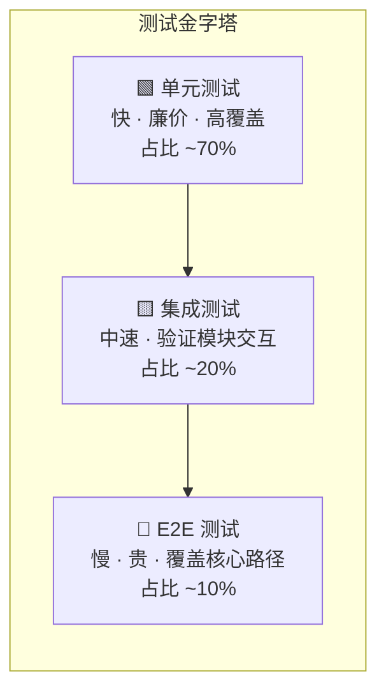
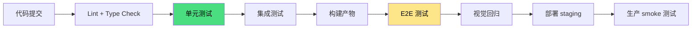
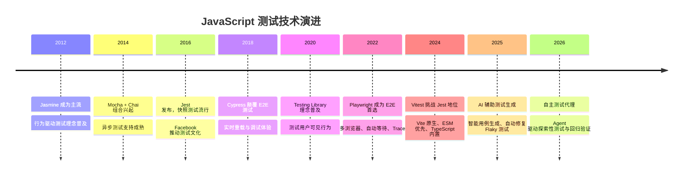

# 🧪 测试示例

> 软件质量不是测出来的，但不可测试的软件一定没有质量。本示例库聚焦 JavaScript / TypeScript 生态的测试工程实践，从单函数单元测试到完整端到端链路，提供可直接落地的代码模板、策略框架与工程规范。

测试在现代前端与全栈开发中已经从“事后检查”演变为“设计的一部分”。TypeScript 的类型系统为编译时静态验证提供了第一道防线，而运行时测试则承担了行为正确性、边界覆盖与回归防护的核心职责。本目录的示例遵循以下原则：

- **测试即文档**：每个测试用例清晰表达被测代码的契约与边界
- **金字塔分层**：单元测试占主体，集成测试验证交互，E2E 测试守护核心流程
- **类型安全**：测试代码同样使用 TypeScript 严格模式，借助 `vitest` / `@types/jest` 获得完整类型推断
- **自动化优先**：所有示例设计为可在 CI 流水线中无头运行，支持并行、分片与缓存

---

## 学习路径


### 各阶段关键产出

| 阶段 | 核心技能 | 预期产出 | 验证标准 |
|------|---------|---------|---------|
| **单元测试** | 掌握 Arrange-Act-Assert 模式，熟练使用 Mock / Spy | 核心业务模块覆盖率 > 80% | 测试通过且 mutation score > 70% |
| **集成测试** | 数据库 / API / 外部服务的测试替身策略 | 关键数据流与接口契约验证 | 稳定运行，无 flaky 测试 |
| **E2E 测试** | Playwright / Cypress 的 Page Object 模式 | 核心用户流程自动化守护 | CI 中 P95 执行时间 < 5min |
| **专项测试** | 视觉回归、可访问性、安全扫描 | 多维度质量门禁 | 零高危漏洞、无障碍达标 |
| **持续测试** | 测试数据管理、并行化、故障定位 | 完整的 CI/CD 测试流水线 | 每次提交 10min 内获得反馈 |

---

## 测试金字塔与策略矩阵

JavaScript / TypeScript 项目的测试投入应遵循经典测试金字塔，同时根据项目类型（前端组件库、BFF 服务、全栈应用）动态调整比例：



### 分层策略对比

| 层级 | 范围 | 速度目标 | 工具推荐 | 关键挑战 |
|------|------|---------|---------|---------|
| **单元测试** | 单个函数 / 组件 / 类 | < 100ms / 文件 | Vitest、Jest、Node Test Runner | Mock 过度导致假阳性 |
| **集成测试** | 模块组合、数据库交互、API 路由 | < 1s / 用例 | Vitest + MSW、Supertest、pg-test-db | 外部依赖稳定性 |
| **E2E 测试** | 完整用户流程、跨页面导航 | < 30s / 场景 | Playwright、Cypress、WebdriverIO | Flaky 测试、维护成本 |
| **视觉回归** | UI 像素级对比 | < 10s / 截图 | Chromatic、Percy、Playwright + Argos | 动态内容、字体渲染差异 |
| **变异测试** | 测试有效性验证 | 分钟级 | Stryker、Vitest Mutator | 运行时间长、误报修复 |

---

## 单元测试深度实践

### 测试框架选型决策

| 维度 | Vitest | Jest | Node Test Runner |
|------|--------|------|-----------------|
| **启动速度** | 极快（Vite 原生） | 快（jest isolatedModules） | 快（无转译开销） |
| **TypeScript 支持** | 内置，零配置 | 需 `ts-jest` / `babel-jest` | 需 `tsx` / `ts-node` |
| **ESM 支持** | 原生完美支持 | 配置较复杂 | 原生完美支持 |
| **Vite 生态集成** | 无缝 | 需额外适配 | 不相关 |
| **并行能力** | 文件级 + 测试级并行 | 文件级并行 | Worker Threads |
| **推荐场景** | Vite 项目、现代库开发 | 遗留项目、React Native | 纯 Node.js 工具链 |

### 典型单元测试结构

```typescript
import { describe, it, expect, vi } from 'vitest';
import { calculateCartTotal, applyDiscount } from './cart';

describe('calculateCartTotal', () => {
  it('应正确计算多件商品的总价', () => {
    // Arrange
    const items = [
      { price: 100, quantity: 2 },
      { price: 50, quantity: 1 },
    ];

    // Act
    const total = calculateCartTotal(items);

    // Assert
    expect(total).toBe(250);
  });

  it('空购物车应返回 0', () => {
    expect(calculateCartTotal([])).toBe(0);
  });

  it('应抛出错误当价格小于 0', () => {
    expect(() => calculateCartTotal([{ price: -10, quantity: 1 }]))
      .toThrow('价格不能为负数');
  });
});

describe('applyDiscount', () => {
  it('应正确应用百分比折扣', () => {
    expect(applyDiscount(100, 0.2)).toBe(80);
  });

  it('折扣为 0 时返回原价', () => {
    expect(applyDiscount(100, 0)).toBe(100);
  });
});
```

### Mock 策略最佳实践

```typescript
import { vi } from 'vitest';
import { fetchUserProfile } from './api';
import { getUser } from './userService';

// 模块级 Mock：替换整个模块的实现
vi.mock('./api', () => ({
  fetchUserProfile: vi.fn(),
}));

it('应缓存用户数据避免重复请求', async () => {
  vi.mocked(fetchUserProfile).mockResolvedValueOnce({ id: '1', name: 'Alice' });

  await getUser('1');
  await getUser('1'); // 第二次应从缓存读取

  expect(fetchUserProfile).toHaveBeenCalledTimes(1);
});
```

Mock 使用的关键原则：

- **优先使用真实实现**：仅在涉及 I/O、非确定性或缓慢操作时使用 Mock
- **避免 Mock 实现细节**：Mock 的是接口契约，而非内部私有函数
- **验证行为而非状态**：对于副作用操作，验证函数被调用的参数和次数

---

## 集成测试策略

集成测试验证多个模块协作时的正确性，常见于 API 路由、数据库访问层与外部服务客户端。

### API 层集成测试

```typescript
import { describe, it, expect, beforeAll, afterAll } from 'vitest';
import { createApp } from '../src/app';

describe('POST /api/orders', () => {
  let app: ReturnType<typeof createApp>;

  beforeAll(async () => {
    app = await createApp({ database: 'test' });
  });

  afterAll(async () => {
    await app.close();
  });

  it('应创建订单并返回 201', async () => {
    const response = await app.request('/api/orders', {
      method: 'POST',
      body: JSON.stringify({ productId: 'p1', quantity: 2 }),
      headers: { 'Content-Type': 'application/json' },
    });

    expect(response.status).toBe(201);
    const body = await response.json();
    expect(body).toHaveProperty('id');
    expect(body.status).toBe('pending');
  });
});
```

### 数据库测试隔离

使用事务回滚或临时数据库确保测试间无状态泄漏：

| 策略 | 实现方式 | 优点 | 缺点 |
|------|---------|------|------|
| **事务回滚** | 每个测试开启事务，结束后 ROLLBACK | 速度快、无数据残留 | 不支持已提交事务的测试 |
| **临时数据库** | 测试前创建 DB，测试后 DROP | 完全隔离 | 初始化耗时 |
| **内存数据库** | SQLite :memory: / pg-mem | 极快 | 与生产行为存在差异 |

---

## E2E 端到端测试

端到端测试模拟真实用户操作，是守护核心业务流程的最后一道防线。本示例库提供基于 Playwright 的 E2E 测试实战指南。

### Playwright 核心优势

Playwright 是当前 JavaScript 生态中最先进的 E2E 测试框架之一，具备以下特性：

- **多浏览器原生支持**：Chromium、Firefox、WebKit 统一 API
- **自动等待**：内置智能等待机制，大幅降低 flaky 测试概率
- **_trace_ 与 _snapshot_**：失败时自动生成执行轨迹与 DOM 快照
- **并行与分片**：内置测试分片能力，适配大型 CI 流水线
- **Codegen**：通过操作录制生成测试代码，降低编写门槛

### 示例文档

| 主题 | 文件 | 难度 | 预计时长 |
|------|------|------|---------|
| E2E 测试实战：Playwright 完整指南 | [查看](./e2e-testing-playwright.md) | 中级 | 60 min |

### Page Object 模式实践

```typescript
// tests/pages/LoginPage.ts
import { Page, Locator } from '@playwright/test';

export class LoginPage {
  readonly usernameInput: Locator;
  readonly passwordInput: Locator;
  readonly submitButton: Locator;
  readonly errorMessage: Locator;

  constructor(readonly page: Page) {
    this.usernameInput = page.locator('[data-testid="username"]');
    this.passwordInput = page.locator('[data-testid="password"]');
    this.submitButton = page.locator('[data-testid="login-submit"]');
    this.errorMessage = page.locator('[data-testid="login-error"]');
  }

  async goto() {
    await this.page.goto('/login');
  }

  async login(username: string, password: string) {
    await this.usernameInput.fill(username);
    await this.passwordInput.fill(password);
    await this.submitButton.click();
  }

  async expectError(message: string) {
    await expect(this.errorMessage).toHaveText(message);
  }
}
```

### 核心用户流程测试示例

```typescript
import { test, expect } from '@playwright/test';
import { LoginPage } from './pages/LoginPage';
import { CheckoutPage } from './pages/CheckoutPage';

test('完整购物流程', async ({ page }) => {
  const login = new LoginPage(page);
  await login.goto();
  await login.login('user@example.com', 'password123');

  // 添加商品到购物车
  await page.goto('/products');
  await page.locator('[data-testid="add-to-cart-1"]').click();
  await page.locator('[data-testid="cart-icon"]').click();

  // 结算流程
  const checkout = new CheckoutPage(page);
  await checkout.fillShippingInfo({ name: '张三', address: '北京市' });
  await checkout.selectPaymentMethod('alipay');
  await checkout.confirmOrder();

  await expect(page.locator('[data-testid="order-success"]'))
    .toBeVisible();
});
```

### 视觉回归测试集成

```typescript
import { test, expect } from '@playwright/test';

test('主页视觉回归', async ({ page }) => {
  await page.goto('/');
  await expect(page).toHaveScreenshot('homepage.png', {
    fullPage: true,
    threshold: 0.2,
  });
});
```

---

## 测试数据管理

可维护的测试是工程化测试的基石，而测试数据管理是其中的关键环节。

### 工厂模式（Factory Pattern）

```typescript
import { faker } from '@faker-js/faker';

interface User {
  id: string;
  email: string;
  name: string;
  role: 'admin' | 'user';
}

function createUser(override: Partial<User> = {}): User {
  return {
    id: faker.string.uuid(),
    email: faker.internet.email(),
    name: faker.person.fullName(),
    role: 'user',
    ...override,
  };
}

// 使用
const admin = createUser({ role: 'admin' });
const users = Array.from({ length: 10 }, () => createUser());
```

### 测试夹具（Fixtures）

```typescript
import { test as base } from '@playwright/test';

export const test = base.extend<{
  authenticatedPage: Page;
}>({
  authenticatedPage: async ({ page }, use) => {
    await page.goto('/login');
    await page.fill('[name="email"]', 'test@example.com');
    await page.fill('[name="password"]', 'secret');
    await page.click('button[type="submit"]');
    await page.waitForURL('/dashboard');
    await use(page);
  },
});
```

---

## CI/CD 测试流水线



### 阶段配置建议

| 阶段 | 触发条件 | 超时设置 | 失败策略 |
|------|---------|---------|---------|
| 单元测试 | 每次 Push | 5 min | 立即阻断 |
| 集成测试 | 每次 Push | 10 min | 立即阻断 |
| E2E 测试 | PR + 主干 | 20 min | 立即阻断 |
| 视觉回归 | PR + 主干 | 15 min | 人工审核 |
| Smoke 测试 | 部署后 | 5 min | 自动回滚 |

### GitHub Actions 示例片段

```yaml
name: Test Pipeline

on: [push, pull_request]

jobs:
  unit:
    runs-on: ubuntu-latest
    steps:
      - uses: actions/checkout@v4
      - uses: actions/setup-node@v4
        with:
          node-version: 20
          cache: 'npm'
      - run: npm ci
      - run: npm run test:unit -- --coverage

  e2e:
    runs-on: ubuntu-latest
    steps:
      - uses: actions/checkout@v4
      - uses: actions/setup-node@v4
        with:
          node-version: 20
          cache: 'npm'
      - run: npm ci
      - run: npx playwright install --with-deps
      - run: npm run test:e2e
      - uses: actions/upload-artifact@v4
        if: failure()
        with:
          name: playwright-report
          path: playwright-report/
```

---

## 与测试工程专题的映射

本示例库与网站的 [测试工程](/testing-engineering/) 理论专题形成**实践-理论双轨**映射关系。建议结合阅读以获得系统性理解。

| 示例主题 | 理论支撑 | 关键概念 |
|---------|---------|---------|
| [E2E 测试实战](./e2e-testing-playwright.md) | [测试工程](/testing-engineering/) — E2E 测试策略、Page Object 模式、Flaky 测试治理 | Playwright 的自动等待与重试机制对应测试稳定性理论 |
| 单元测试实践 | [测试工程](/testing-engineering/) — 单元测试深度解析、Mock 策略、测试覆盖率 | AAA 模式、边界值分析、等价类划分 |
| 集成测试策略 | [测试工程](/testing-engineering/) — 集成测试、契约测试、测试数据管理 | 测试替身、事务隔离、数据库状态管理 |
| CI/CD 自动化 | [测试工程](/testing-engineering/) — CI/CD 测试、测试驱动开发 | 流水线设计、快速反馈、质量门禁 |
| 视觉回归与可访问性 | [测试工程](/testing-engineering/) — 视觉回归测试、可访问性测试 | 像素差异阈值、WCAG 合规、自动化扫描 |

### 深入阅读建议

- **测试工程专题**：[测试工程](/testing-engineering/) — 网站理论专题，覆盖测试基础、单元测试、集成测试、E2E 测试、TDD、契约测试等 15 篇核心文章
- **Vitest 官方文档**：<https://vitest.dev/> — 现代 Vite 原生测试框架的完整 API 参考
- **Playwright 官方文档**：<https://playwright.dev/> — E2E 测试的行业标杆文档
- **Testing Library**：<https://testing-library.com/> — 以用户为中心的测试理念与工具集

---

## 常见陷阱速查

### 单元测试陷阱

| 陷阱 | 症状 | 解决方案 |
|------|------|---------|
| 测试实现而非行为 | 修改私有函数导致测试大面积失败 | 只测试公共 API 与可观察行为 |
| Mock 过度 | 测试通过但生产环境崩溃 | 遵循“除非必要，不用 Mock”原则 |
| 测试间状态泄漏 | 单独通过，批量失败 | 每个测试独立 setup / teardown |
| 异步测试缺失 await | 测试永远通过 | 启用 ESLint `require-await` 规则 |

### E2E 测试陷阱

| 陷阱 | 症状 | 解决方案 |
|------|------|---------|
| 选择器脆弱 | UI 微调导致测试失败 | 使用 `data-testid` 或语义化角色选择器 |
| 硬编码等待 | 测试不稳定，时快时慢 | 使用 Playwright 自动等待或 `expect().toPass()` |
| 测试数据依赖 | 测试顺序影响结果 | 每个场景独立准备与清理数据 |
| 忽视移动端 | 仅在桌面端通过 | 配置 `projects` 覆盖多种视口 |

---

## 可访问性测试速览

可访问性（Accessibility）测试确保应用对所有用户（包括使用辅助技术的用户）均可用。

```typescript
import { test, expect } from '@playwright/test';
import AxeBuilder from '@axe-core/playwright';

test('页面应无可访问性严重问题', async ({ page }) => {
  await page.goto('/');
  const accessibilityScanResults = await new AxeBuilder({ page })
    .withTags(['wcag2a', 'wcag2aa'])
    .analyze();

  expect(accessibilityScanResults.violations).toEqual([]);
});
```

关键检查项：

- 所有图片包含有意义的 `alt` 文本
- 表单控件具有关联的 `<label>`
- 颜色对比度符合 WCAG AA 标准（4.5:1）
- 页面可通过键盘完全操作
- 焦点顺序符合视觉逻辑

---

## 安全测试入门

JavaScript 应用的安全测试应覆盖依赖漏洞、XSS、CSRF 与注入攻击。

| 检查项 | 工具 | 集成方式 |
|--------|------|---------|
| 依赖漏洞扫描 | `npm audit`、`Snyk`、`Dependabot` | CI 门禁 |
| XSS 防护验证 | 手动 + `DOMPurify` 单元测试 | 代码审查 + 自动化 |
| CSRF Token 校验 | 集成测试验证 Header | API 测试套件 |
| 敏感信息泄露 | `git-secrets`、`truffleHog` | Pre-commit Hook |

---

## 性能基准测试

测试代码本身的执行效率，防止算法退化：

```typescript
import { bench, describe } from 'vitest';
import { fibonacci, memoizedFibonacci } from './math';

describe('fibonacci 性能对比', () => {
  bench('递归实现', () => {
    fibonacci(20);
  });

  bench('记忆化实现', () => {
    memoizedFibonacci(20);
  });
});
```

---

## 测试覆盖率策略

覆盖率是度量而非目标，但合理的覆盖率门槛能有效防止质量退化。

| 指标 | 推荐阈值 | 说明 |
|------|---------|------|
| **语句覆盖率** | > 80% | 最基础的覆盖度量 |
| **分支覆盖率** | > 75% | 更严格的条件覆盖 |
| **函数覆盖率** | > 90% | 确保公共 API 均被测试 |
| **行覆盖率** | > 80% | 与语句覆盖率相近 |

> 注意：追求 100% 覆盖率可能导致测试质量下降（为覆盖而覆盖）。建议结合变异测试（Mutation Testing）验证测试的有效性。

---

## 技术演进趋势



### 未来方向

- **AI 辅助测试生成**：基于代码变更自动生成边界用例与回归测试
- **视觉测试智能化**：AI 识别有意义的 UI 变更，过滤无关像素差异
- **自修复选择器**：E2E 框架自动适应 DOM 变化，降低维护成本
- **测试左移与右移**：从需求阶段介入测试设计，并在生产环境持续验证

---

## 生产部署 checklist

### 发布前测试检查

- [ ] 单元测试全部通过，覆盖率未下降
- [ ] 集成测试覆盖所有关键数据流
- [ ] E2E 测试覆盖核心用户流程
- [ ] 无 flaky 测试（连续 5 次运行稳定）
- [ ] 视觉回归基线已更新
- [ ] 可访问性扫描无严重问题
- [ ] 依赖漏洞扫描通过
- [ ] 性能基准测试无退化

### 关键告警

| 告警类型 | 阈值 | 响应 |
|---------|------|------|
| 测试失败率 | > 1% (主干) | 立即修复 |
| 覆盖率下降 | > 2% | 阻断合并 |
| E2E Flaky 率 | > 5% | 专项治理 |
| 变异测试分数 | < 70% | 补充测试用例 |

---

## 贡献指南

本示例遵循以下规范：

1. **测试可运行**：每个示例包含完整可执行的测试代码
2. **TypeScript 严格模式**：所有测试启用 `strict: true`
3. **AAA 结构清晰**：Arrange / Act / Assert 分明
4. **语义化命名**：测试描述使用自然语言，清晰表达意图
5. **避免测试私有 API**：只测试公共接口与可观察行为

---

## 参考资源

### 官方文档与规范

- [Vitest Documentation](https://vitest.dev/) — 现代 Vite 原生测试框架官方文档
- [Playwright Documentation](https://playwright.dev/) — 微软出品的跨浏览器 E2E 测试框架
- [Jest Documentation](https://jestjs.io/) — 历史悠久的 JavaScript 测试框架
- [Testing Library](https://testing-library.com/) — 以用户为中心的测试工具集
- [Node.js Test Runner](https://nodejs.org/api/test.html) — Node.js 内置测试运行器

### 学术论文与权威文献

- Myers, G. J., Sandler, C., & Badgett, T. (2011). _The Art of Software Testing_ (3rd ed.). Wiley. —— 软件测试领域的经典著作，系统阐述了测试设计、白盒/黑盒方法与测试管理原则。
- Meszaros, G. (2007). _xUnit Test Patterns: Refactoring Test Code_. Addison-Wesley. —— xUnit 测试模式的权威参考，涵盖测试夹具、Mock 对象、测试组织等 60 余种模式。
- Freeman, S., & Pryce, N. (2009). _Growing Object-Oriented Software, Guided by Tests_. Addison-Wesley. —— 测试驱动开发的经典实践指南，强调从外向内的设计方法。

### 社区与工具

- [MSW (Mock Service Worker)](https://mswjs.io/) — 用于浏览器和 Node.js 的 API Mock 库
- [Chromatic](https://www.chromatic.com/) — Storybook 的视觉回归测试平台
- [Stryker Mutator](https://stryker-mutator.io/) — 变异测试框架，验证测试有效性
- [Codecov](https://about.codecov.io/) — 代码覆盖率报告与 PR 集成
- [Maestro](https://maestro.mobile.dev/) — 移动端 E2E 测试框架

### 经典著作

- _Unit Testing Principles, Practices, and Patterns_ — Vladimir Khorikov, 2020
- _Effective Software Testing: A Developer's Guide_ — Maurício Aniche, 2022
- _End-to-End Test Automation with Playwright_ — Manoj Kumar, 2024
- _Test-Driven Development with JavaScript_ — Venkat Subramaniam, 2023
