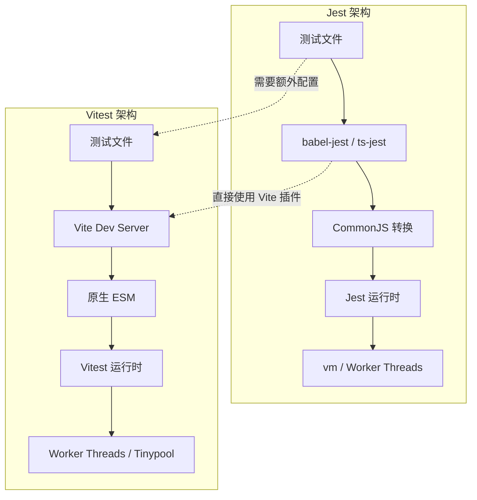
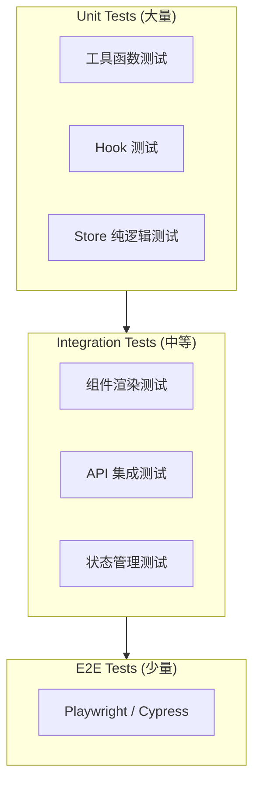

# Vitest 单元测试实战：现代前端测试框架完全指南

Vitest 是由 Vue 团队开发的下一代测试框架，专为现代前端项目设计。它原生支持 ESM、TypeScript 和 Vite 生态，在保持与 Jest API 高度兼容的同时，提供了显著的性能提升和更优的开发体验。本文将深入 Vitest 的各个方面，帮助你构建健壮的测试体系。

## 目录

- [Vitest vs Jest 深度对比](#vitest-vs-jest-深度对比)
- [配置与测试结构](#配置与测试结构)
- [Mock / Spy / Stub 实战](#mock--spy--stub-实战)
- [覆盖率与 CI 集成](#覆盖率与-ci-集成)
- [与 React Testing Library / Vue Test Utils 集成](#与-react-testing-library--vue-test-utils-集成)
- [总结与最佳实践](#总结与最佳实践)
- [参考资源](#参考资源)

---

## Vitest vs Jest 深度对比

### 架构差异

Jest 诞生于 CommonJS 时代，其内部模块系统、代码转换和测试隔离机制都是围绕 CJS 设计的。虽然 Jest 通过 `transform` 配置和 `ts-jest`/`babel-jest` 支持了 TypeScript 和 ESM，但这本质上是在 CJS 基础上的兼容层，带来了额外的性能开销和配置复杂度。

Vitest 则从零开始为 ESM 和 Vite 生态构建。它直接复用项目的 `vite.config.ts`，利用 Vite 的插件系统和转换管道，消除了重复配置的问题。



### 核心特性对比

| 特性 | Jest | Vitest |
|------|------|--------|
| 模块系统 | CommonJS（ESM 需转换） | 原生 ESM |
| TypeScript | 需 ts-jest / babel-jest | 原生支持（通过 Vite） |
| 配置方式 | jest.config.js / package.json | vite.config.ts + test 字段 |
| 转换管道 | Jest Transform | Vite Plugins |
| 开发模式 | 无原生支持 | `vitest` 监听模式 |
| UI 界面 | 无官方 | `@vitest/ui` |
| 快照测试 | 内置 | 内置（兼容 Jest 格式） |
| Mock 系统 | jest.fn() / jest.mock() | vi.fn() / vi.mock() |
| 覆盖率 | v8 / istanbul | v8 / istanbul |
| 并行执行 | Worker Threads | Tinypool（Worker Threads 优化版） |
| 启动速度 | 较慢（需初始化转换器） | 极快（复用 Vite 缓存） |

### 迁移成本评估

对于已有 Jest 测试套件的项目，迁移到 Vitest 的成本通常很低。以下是一个典型的迁移映射：

```typescript
// Jest 风格
import &#123; jest &#125; from "@jest/globals";

jest.mock("./api");
jest.spyOn(console, "log");
jest.useFakeTimers();

const mockFn = jest.fn();
mockFn.mockReturnValue(42);
mockFn.mockResolvedValue(&#123; data: [] &#125;);

// Vitest 风格（几乎一一对应）
import &#123; vi &#125; from "vitest";

vi.mock("./api");
vi.spyOn(console, "log");
vi.useFakeTimers();

const mockFn = vi.fn();
mockFn.mockReturnValue(42);
mockFn.mockResolvedValue(&#123; data: [] &#125;);
```

### 性能基准测试

```typescript
// benchmark/setup.bench.ts
import &#123; bench, describe &#125; from "vitest";
import &#123; complexCalculation &#125; from "./math";

describe("math operations", () => &#123;
  bench("complex calculation", () => &#123;
    complexCalculation(1000);
  &#125;);

  bench("array operations", () => &#123;
    const arr = Array.from(&#123; length: 10000 &#125;, (_, i) => i);
    arr.filter((x) => x % 2 === 0).map((x) => x * 2).reduce((a, b) => a + b, 0);
  &#125;);
&#125;);
```

```bash
# 运行基准测试
npx vitest bench

# 输出示例
#  ✓ benchmark/setup.bench.ts (2) 1528ms
#    ✓ math operations (2)
#      name                    hz      min      max     mean      p75      p99
#      complex calculation   4521    0.18ms   0.85ms   0.22ms   0.24ms   0.42ms
#      array operations     12500    0.06ms   0.32ms   0.08ms   0.09ms   0.15ms
```

---

## 配置与测试结构

### 项目初始化

```bash
# 在 Vite 项目中
npm install -D vitest

# 对于非 Vite 项目
npm install -D vitest @vitest/ui
```

```typescript
// vite.config.ts
import &#123; defineConfig &#125; from "vite";
import react from "@vitejs/plugin-react";
import &#123; resolve &#125; from "path";

export default defineConfig(&#123;
  plugins: [react()],
  resolve: &#123;
    alias: &#123;
      "@": resolve(__dirname, "./src"),
      "@components": resolve(__dirname, "./src/components"),
      "@utils": resolve(__dirname, "./src/utils"),
    &#125;,
  &#125;,
  test: &#123;
    globals: true,
    environment: "jsdom",
    setupFiles: ["./src/test/setup.ts"],
    include: ["src/**/*.(test|spec).(ts|tsx)"],
    exclude: ["node_modules", "dist", ".idea", ".git", ".cache"],
    coverage: &#123;
      provider: "v8",
      reporter: ["text", "json", "html"],
      exclude: [
        "node_modules/",
        "src/test/",
        "src/**/*.d.ts",
        "src/**/*.config.*",
      &#125;,
      thresholds: &#123;
        global: &#123;
          branches: 80,
          functions: 80,
          lines: 80,
          statements: 80,
        &#125;,
      &#125;,
    &#125;,
    deps: &#123;
      optimizer: &#123;
        web: &#123;
          include: ["react", "react-dom"],
        &#125;,
      &#125;,
    &#125;,
  &#125;,
&#125;);
```

### 测试文件结构

```
src/
├── components/
│   ├── Button/
│   │   ├── Button.tsx
│   │   ├── Button.module.css
│   │   └── Button.test.tsx
│   └── Card/
│       ├── Card.tsx
│       └── Card.test.tsx
├── hooks/
│   ├── useAuth.ts
│   └── useAuth.test.ts
├── utils/
│   ├── formatDate.ts
│   └── formatDate.test.ts
├── services/
│   ├── api.ts
│   └── api.test.ts
├── stores/
│   ├── cartStore.ts
│   └── cartStore.test.ts
└── test/
    ├── setup.ts
    ├── mocks/
    │   ├── handlers.ts
    │   └── server.ts
    └── fixtures/
        ├── products.ts
        └── users.ts
```

### 测试设置文件

```typescript
// src/test/setup.ts
import "@testing-library/jest-dom/vitest";
import &#123; cleanup &#125; from "@testing-library/react";
import &#123; afterEach, vi &#125; from "vitest";
import &#123; server &#125; from "./mocks/server";

// MSW 服务端启动
beforeAll(() => server.listen(&#123; onUnhandledRequest: "error" &#125;));
afterEach(() => &#123;
  server.resetHandlers();
  cleanup();
&#125;);
afterAll(() => server.close());

// 全局 Mock
globalThis.matchMedia =
  globalThis.matchMedia ||
  function () &#123;
    return &#123;
      matches: false,
      addListener: vi.fn(),
      removeListener: vi.fn(),
      addEventListener: vi.fn(),
      removeEventListener: vi.fn(),
      dispatchEvent: vi.fn(),
    &#125;;
  &#125;;

// IntersectionObserver Mock
class MockIntersectionObserver &#123;
  observe = vi.fn();
  disconnect = vi.fn();
  unobserve = vi.fn();
&#125;

Object.defineProperty(globalThis, "IntersectionObserver", &#123;
  writable: true,
  configurable: true,
  value: MockIntersectionObserver,
&#125;);

// ResizeObserver Mock
class MockResizeObserver &#123;
  observe = vi.fn();
  disconnect = vi.fn();
  unobserve = vi.fn();
&#125;

Object.defineProperty(globalThis, "ResizeObserver", &#123;
  writable: true,
  configurable: true,
  value: MockResizeObserver,
&#125;);
```

### 基本测试结构

```typescript
// src/utils/calculator.test.ts
import &#123; describe, it, expect, beforeEach, beforeAll, afterEach, afterAll &#125; from "vitest";
import &#123; Calculator &#125; from "./calculator";

describe("Calculator", () => &#123;
  let calculator: Calculator;

  // 在所有测试之前执行一次
  beforeAll(() => &#123;
    console.log("Initializing Calculator test suite");
  &#125;);

  // 每个测试之前执行
  beforeEach(() => &#123;
    calculator = new Calculator();
  &#125;);

  // 每个测试之后执行
  afterEach(() => &#123;
    calculator.dispose();
  &#125;);

  // 在所有测试之后执行一次
  afterAll(() => &#123;
    console.log("Cleaning up Calculator test suite");
  &#125;);

  describe("addition", () => &#123;
    it("should add two positive numbers correctly", () => &#123;
      expect(calculator.add(2, 3)).toBe(5);
    &#125;);

    it("should handle negative numbers", () => &#123;
      expect(calculator.add(-2, 3)).toBe(1);
      expect(calculator.add(-2, -3)).toBe(-5);
    &#125;);

    it("should handle zero", () => &#123;
      expect(calculator.add(0, 5)).toBe(5);
      expect(calculator.add(5, 0)).toBe(5);
    &#125;);
  &#125;);

  describe("division", () => &#123;
    it("should divide two numbers correctly", () => &#123;
      expect(calculator.divide(10, 2)).toBe(5);
      expect(calculator.divide(7, 2)).toBeCloseTo(3.5);
    &#125;);

    it("should throw error when dividing by zero", () => &#123;
      expect(() => calculator.divide(10, 0)).toThrow("Division by zero");
      expect(() => calculator.divide(10, 0)).toThrowError(&#123;
        message: "Division by zero",
      &#125;);
    &#125;);
  &#125;);

  describe("floating point precision", () => &#123;
    it.each([
      [0.1, 0.2, 0.3],
      [0.7, 0.1, 0.8],
      [1.005, 0.005, 1.01],
    ])("should handle $a + $b = $expected", (a, b, expected) => &#123;
      expect(calculator.add(a, b)).toBeCloseTo(expected, 10);
    &#125;);
  &#125;);
&#125;);
```

### 异步测试

```typescript
// src/utils/async-helpers.test.ts
import &#123; describe, it, expect &#125; from "vitest";
import &#123; fetchUser, fetchWithRetry, debounce &#125; from "./async-helpers";

describe("async helpers", () => &#123;
  describe("fetchUser", () => &#123;
    it("should resolve with user data", async () => &#123;
      const user = await fetchUser("123");
      expect(user).toHaveProperty("id", "123");
      expect(user).toHaveProperty("name");
      expect(user).toHaveProperty("email");
    &#125;);

    it("should reject with error for invalid id", async () => &#123;
      await expect(fetchUser("invalid")).rejects.toThrow("User not found");
    &#125;);

    it("should handle timeout", async () => &#123;
      await expect(
        fetchUser("123", &#123; timeout: 1 &#125;)
      ).rejects.toThrow("Request timeout");
    &#125;);
  &#125;);

  describe("fetchWithRetry", () => &#123;
    it("should retry on failure and eventually succeed", async () => &#123;
      const result = await fetchWithRetry("/api/data", &#123;
        retries: 3,
        delay: 100,
      &#125;);
      expect(result).toBeDefined();
    &#125;);

    it("should throw after max retries", async () => &#123;
      await expect(
        fetchWithRetry("/api/fail", &#123; retries: 2, delay: 10 &#125;)
      ).rejects.toThrow("Max retries reached");
    &#125;);
  &#125;);

  describe("debounce", () => &#123;
    it("should delay function execution", async () => &#123;
      const fn = vi.fn();
      const debounced = debounce(fn, 100);

      debounced();
      debounced();
      debounced();

      expect(fn).not.toHaveBeenCalled();

      await new Promise((resolve) => setTimeout(resolve, 150));
      expect(fn).toHaveBeenCalledTimes(1);
    &#125;);
  &#125;);
&#125;);
```

---

## Mock / Spy / Stub 实战

Mock 是单元测试的核心技术，用于隔离被测单元、控制依赖行为、验证交互模式。

### vi.fn() - 函数 Mock

```typescript
// src/utils/payment.test.ts
import &#123; describe, it, expect, vi &#125; from "vitest";
import &#123; processPayment, PaymentGateway &#125; from "./payment";

describe("processPayment", () => &#123;
  it("should call gateway with correct parameters", async () => &#123;
    const mockGateway: PaymentGateway = &#123;
      charge: vi.fn().mockResolvedValue(&#123;
        id: "pay_123",
        status: "succeeded",
        amount: 10000,
        currency: "usd",
      &#125;),
      refund: vi.fn(),
    &#125;;

    const result = await processPayment(mockGateway, &#123;
      amount: 100,
      currency: "usd",
      source: "tok_visa",
    &#125;);

    expect(mockGateway.charge).toHaveBeenCalledTimes(1);
    expect(mockGateway.charge).toHaveBeenCalledWith(&#123;
      amount: 10000, // cents
      currency: "usd",
      source: "tok_visa",
    &#125;);
    expect(result.status).toBe("succeeded");
  &#125;);

  it("should handle payment failure", async () => &#123;
    const mockGateway: PaymentGateway = &#123;
      charge: vi.fn().mockRejectedValue(
        new Error("Card declined")
      ),
      refund: vi.fn(),
    &#125;;

    await expect(
      processPayment(mockGateway, &#123;
        amount: 100,
        currency: "usd",
        source: "tok_declined",
      &#125;)
    ).rejects.toThrow("Card declined");
  &#125;);

  it("should track call history", () => &#123;
    const mockFn = vi.fn();

    mockFn("a", 1);
    mockFn("b", 2);
    mockFn("c", 3);

    expect(mockFn).toHaveBeenCalledTimes(3);
    expect(mockFn).toHaveBeenNthCalledWith(1, "a", 1);
    expect(mockFn).toHaveBeenLastCalledWith("c", 3);

    // 访问调用参数
    const calls = mockFn.mock.calls;
    expect(calls[0]).toEqual(["a", 1]);

    // 访问返回值
    const results = mockFn.mock.results;
    expect(results[0].type).toBe("return");
  &#125;);
&#125;);
```

### vi.mock() - 模块 Mock

```typescript
// src/services/user-service.test.ts
import &#123; describe, it, expect, vi, beforeEach &#125; from "vitest";
import &#123; getUserProfile &#125; from "./user-service";

// 自动 Mock 整个模块
vi.mock("./api-client", () => &#123;
  return &#123;
    apiClient: &#123;
      get: vi.fn(),
      post: vi.fn(),
      put: vi.fn(),
      delete: vi.fn(),
    &#125;,
  &#125;;
&#125;);

// 部分 Mock
vi.mock("lodash", async (importOriginal) => &#123;
  const actual = await importOriginal&lt;typeof import("lodash")&gt;();
  return &#123;
    ...actual,
    debounce: vi.fn((fn) => fn), // 替换特定导出
  &#125;;
&#125;);

import &#123; apiClient &#125; from "./api-client";

describe("getUserProfile", () => &#123;
  beforeEach(() => &#123;
    vi.clearAllMocks();
  &#125;);

  it("should return formatted user profile", async () => &#123;
    const mockUser = &#123;
      id: "123",
      first_name: "John",
      last_name: "Doe",
      email: "john@example.com",
      avatar_url: "https://cdn.example.com/avatar.jpg",
      created_at: "2024-01-15T10:30:00Z",
    &#125;;

    vi.mocked(apiClient.get).mockResolvedValue(&#123; data: mockUser &#125;);

    const profile = await getUserProfile("123");

    expect(profile).toEqual(&#123;
      id: "123",
      fullName: "John Doe",
      email: "john@example.com",
      avatar: "https://cdn.example.com/avatar.jpg",
      memberSince: "January 15, 2024",
    &#125;);
  &#125;);

  it("should cache subsequent requests", async () => &#123;
    vi.mocked(apiClient.get).mockResolvedValue(&#123;
      data: &#123; id: "123", first_name: "John", last_name: "Doe", email: "john@example.com" &#125;,
    &#125;);

    await getUserProfile("123");
    await getUserProfile("123");

    // 第二次调用应使用缓存，不发起请求
    expect(apiClient.get).toHaveBeenCalledTimes(1);
  &#125;);
&#125;);
```

### vi.spyOn() - 方法监听

```typescript
// src/stores/cart-store.test.ts
import &#123; describe, it, expect, vi, beforeEach &#125; from "vitest";
import &#123; createCartStore &#125; from "./cart-store";

describe("cart store", () => &#123;
  let store: ReturnType&lt;typeof createCartStore&gt;;
  let consoleSpy: ReturnType&lt;typeof vi.spyOn&gt;;

  beforeEach(() => &#123;
    store = createCartStore();
    consoleSpy = vi.spyOn(console, "log").mockImplementation(() => &#123;&#125;);
  &#125;);

  afterEach(() => &#123;
    consoleSpy.mockRestore();
  &#125;);

  it("should add item to cart", () => &#123;
    const item = &#123; id: "1", name: "Product A", price: 29.99, quantity: 1 &#125;;

    store.addItem(item);

    expect(store.items).toHaveLength(1);
    expect(store.items[0]).toEqual(item);
    expect(store.total).toBe(29.99);
    expect(consoleSpy).toHaveBeenCalledWith("Item added:", item);
  &#125;);

  it("should update existing item quantity", () => &#123;
    const item = &#123; id: "1", name: "Product A", price: 29.99, quantity: 1 &#125;;

    store.addItem(item);
    store.updateQuantity("1", 3);

    expect(store.items[0].quantity).toBe(3);
    expect(store.total).toBeCloseTo(89.97, 2);
  &#125;);

  it("should persist to localStorage", () => &#123;
    const storageSpy = vi.spyOn(Storage.prototype, "setItem");

    store.addItem(&#123; id: "1", name: "Product A", price: 29.99, quantity: 1 &#125;);

    expect(storageSpy).toHaveBeenCalledWith(
      "cart",
      expect.stringContaining("Product A")
    );
  &#125;);
&#125;);
```

### 计时器 Mock

```typescript
// src/hooks/use-timer.test.ts
import &#123; describe, it, expect, vi, beforeEach, afterEach &#125; from "vitest";
import &#123; useTimer &#125; from "./use-timer";

describe("useTimer", () => &#123;
  beforeEach(() => &#123;
    vi.useFakeTimers();
  &#125;);

  afterEach(() => &#123;
    vi.useRealTimers();
  &#125;);

  it("should count down correctly", () => &#123;
    const timer = useTimer(&#123; duration: 60 &#125;);
    timer.start();

    expect(timer.remaining).toBe(60);

    vi.advanceTimersByTime(10000);
    expect(timer.remaining).toBe(50);

    vi.advanceTimersByTime(50000);
    expect(timer.remaining).toBe(0);
    expect(timer.isExpired).toBe(true);
  &#125;);

  it("should trigger callback on expiration", () => &#123;
    const callback = vi.fn();
    const timer = useTimer(&#123; duration: 5, onExpire: callback &#125;);

    timer.start();
    vi.advanceTimersByTime(5000);

    expect(callback).toHaveBeenCalledTimes(1);
  &#125;);

  it("should pause and resume", () => &#123;
    const timer = useTimer(&#123; duration: 60 &#125;);
    timer.start();

    vi.advanceTimersByTime(10000);
    expect(timer.remaining).toBe(50);

    timer.pause();
    vi.advanceTimersByTime(10000);
    expect(timer.remaining).toBe(50);

    timer.resume();
    vi.advanceTimersByTime(10000);
    expect(timer.remaining).toBe(40);
  &#125;);
&#125;);
```

---

## 覆盖率与 CI 集成

### 覆盖率配置

```typescript
// vite.config.ts
export default defineConfig(&#123;
  test: &#123;
    coverage: &#123;
      provider: "v8", // 或 "istanbul"
      reporter: ["text", "json-summary", "json", "html", "lcov"],
      reportsDirectory: "./coverage",
      include: ["src/**/*"],
      exclude: [
        "node_modules/",
        "src/test/",
        "src/**/*.d.ts",
        "src/**/*.config.*",
        "src/**/*.stories.*",
        "src/**/index.ts",
        "src/**/types.ts",
      &#125;,
      thresholds: &#123;
        global: &#123;
          branches: 80,
          functions: 80,
          lines: 80,
          statements: 80,
        &#125;,
        perFile: &#123;
          branches: 70,
          functions: 70,
          lines: 70,
          statements: 70,
        &#125;,
      &#125;,
      // 忽略特定代码块
      watermarks: &#123;
        statements: [50, 80],
        functions: [50, 80],
        branches: [50, 80],
        lines: [50, 80],
      &#125;,
    &#125;,
  &#125;,
&#125;);
```

```bash
# 运行测试并生成覆盖率报告
npx vitest run --coverage

# 持续运行模式
npx vitest --coverage

# 打开 UI 界面
npx vitest --ui
```

### GitHub Actions CI 配置

```yaml
# .github/workflows/test.yml
name: Test

on:
  push:
    branches: [main, develop]
  pull_request:
    branches: [main, develop]

jobs:
  test:
    runs-on: ubuntu-latest
    strategy:
      matrix:
        node-version: [18, 20, 22]

    steps:
      - name: Checkout
        uses: actions/checkout@v4

      - name: Setup Node.js $&#123;&#123; matrix.node-version &#125;&#125;
        uses: actions/setup-node@v4
        with:
          node-version: $&#123;&#123; matrix.node-version &#125;&#125;
          cache: "npm"

      - name: Install dependencies
        run: npm ci

      - name: Lint
        run: npm run lint

      - name: Type check
        run: npm run type-check

      - name: Run tests
        run: npx vitest run --coverage

      - name: Upload coverage
        uses: codecov/codecov-action@v4
        if: matrix.node-version == 20
        with:
          files: ./coverage/lcov.info
          flags: unittests
          name: codecov-umbrella

      - name: Upload test results
        uses: actions/upload-artifact@v4
        if: always()
        with:
          name: test-results-$&#123;&#123; matrix.node-version &#125;&#125;
          path: |
            coverage/
            test-results/
```

### 测试矩阵与分片

```yaml
# .github/workflows/test-shard.yml
name: Test Sharded

on: [push]

jobs:
  test:
    runs-on: ubuntu-latest
    strategy:
      fail-fast: false
      matrix:
        shard: [1, 2, 3, 4]

    steps:
      - uses: actions/checkout@v4
      - uses: actions/setup-node@v4
        with:
          node-version: 20
          cache: "npm"
      - run: npm ci
      - run: npx vitest run --shard=$&#123;&#123; matrix.shard &#125;&#125;/4
```

---

## 与 React Testing Library / Vue Test Utils 集成

### React Testing Library + Vitest

```bash
npm install -D vitest @testing-library/react @testing-library/jest-dom jsdom
```

```typescript
// src/components/Button/Button.test.tsx
import &#123; describe, it, expect, vi &#125; from "vitest";
import &#123; render, screen, fireEvent, waitFor &#125; from "@testing-library/react";
import userEvent from "@testing-library/user-event";
import &#123; Button &#125; from "./Button";

describe("Button", () => &#123;
  it("should render with correct text", () => &#123;
    render(&lt;Button&gt;Click me&lt;/Button&gt;);
    expect(screen.getByRole("button", &#123; name: /click me/i &#125;)).toBeInTheDocument();
  &#125;);

  it("should handle click events", async () => &#123;
    const handleClick = vi.fn();
    render(&lt;Button onClick=&#123;handleClick&#125;&gt;Click me&lt;/Button&gt;);

    await userEvent.click(screen.getByRole("button"));
    expect(handleClick).toHaveBeenCalledTimes(1);
  &#125;);

  it("should be disabled when loading", () => &#123;
    render(&lt;Button isLoading&gt;Loading&lt;/Button&gt;);
    const button = screen.getByRole("button");

    expect(button).toBeDisabled();
    expect(button).toHaveAttribute("aria-busy", "true");
    expect(screen.getByText(/loading/i)).toBeInTheDocument();
  &#125;);

  it("should render different variants", () => &#123;
    const &#123; rerender &#125; = render(&lt;Button variant="primary"&gt;Primary&lt;/Button&gt;);
    expect(screen.getByRole("button")).toHaveClass("btn-primary");

    rerender(&lt;Button variant="secondary"&gt;Secondary&lt;/Button&gt;);
    expect(screen.getByRole("button")).toHaveClass("btn-secondary");

    rerender(&lt;Button variant="danger"&gt;Danger&lt;/Button&gt;);
    expect(screen.getByRole("button")).toHaveClass("btn-danger");
  &#125;);

  it("should support async click handlers", async () => &#123;
    const asyncHandler = vi.fn().mockImplementation(async () => &#123;
      await new Promise((resolve) => setTimeout(resolve, 100));
    &#125;);

    render(&lt;Button onClick=&#123;asyncHandler&#125;&gt;Async&lt;/Button&gt;);
    const button = screen.getByRole("button");

    await userEvent.click(button);
    expect(button).toHaveAttribute("aria-busy", "true");

    await waitFor(() => &#123;
      expect(button).not.toHaveAttribute("aria-busy");
    &#125;);

    expect(asyncHandler).toHaveBeenCalledTimes(1);
  &#125;);
&#125;);
```

```typescript
// src/hooks/useAuth.test.ts
import &#123; describe, it, expect, vi, beforeEach &#125; from "vitest";
import &#123; renderHook, waitFor &#125; from "@testing-library/react";
import &#123; QueryClient, QueryClientProvider &#125; from "@tanstack/react-query";
import &#123; useAuth, useLogin &#125; from "./useAuth";

const createWrapper = () => &#123;
  const queryClient = new QueryClient(&#123;
    defaultOptions: &#123;
      queries: &#123; retry: false &#125;,
      mutations: &#123; retry: false &#125;,
    &#125;,
  &#125;);
  return &#123; wrapper: (&#123; children &#125;: &#123; children: React.ReactNode &#125;) => (
    &lt;QueryClientProvider client=&#123;queryClient&#125;&gt;&#123;children&#125;&lt;/QueryClientProvider&gt;
  ) &#125;;
&#125;;

describe("useAuth", () => &#123;
  beforeEach(() => &#123;
    localStorage.clear();
  &#125;);

  it("should return unauthenticated state initially", () => &#123;
    const &#123; result &#125; = renderHook(() => useAuth(), createWrapper());

    expect(result.current.isAuthenticated).toBe(false);
    expect(result.current.user).toBeNull();
  &#125;);

  it("should handle successful login", async () => &#123;
    const &#123; result &#125; = renderHook(() => useLogin(), createWrapper());

    result.current.mutate(&#123;
      email: "test@example.com",
      password: "password123",
    &#125;);

    await waitFor(() => &#123;
      expect(result.current.isSuccess).toBe(true);
    &#125;);

    expect(localStorage.getItem("token")).toBeTruthy();
  &#125;);
&#125;);
```

### Vue Test Utils + Vitest

```bash
npm install -D vitest @vue/test-utils happy-dom
```

```typescript
// src/components/Counter/Counter.spec.ts
import &#123; describe, it, expect, vi &#125; from "vitest";
import &#123; mount, flushPromises &#125; from "@vue/test-utils";
import &#123; createPinia, setActivePinia &#125; from "pinia";
import Counter from "./Counter.vue";

describe("Counter", () => &#123;
  beforeEach(() => &#123;
    setActivePinia(createPinia());
  &#125;);

  it("should render initial count", () => &#123;
    const wrapper = mount(Counter, &#123;
      props: &#123; initialCount: 10 &#125;,
    &#125;);

    expect(wrapper.find("[data-testid='count']").text()).toBe("10");
  &#125;);

  it("should increment when button clicked", async () => &#123;
    const wrapper = mount(Counter);

    await wrapper.find("[data-testid='increment']").trigger("click");
    await flushPromises();

    expect(wrapper.find("[data-testid='count']").text()).toBe("1");
  &#125;);

  it("should emit event on count change", async () => &#123;
    const wrapper = mount(Counter);

    await wrapper.find("[data-testid='increment']").trigger("click");
    await flushPromises();

    expect(wrapper.emitted()).toHaveProperty("update");
    expect(wrapper.emitted("update")![0]).toEqual([1]);
  &#125;);

  it("should handle async action", async () => &#123;
    const wrapper = mount(Counter);
    const consoleSpy = vi.spyOn(console, "log").mockImplementation(() => &#123;&#125;);

    await wrapper.find("[data-testid='async-increment']").trigger("click");

    // 等待异步操作完成
    await vi.waitFor(() => &#123;
      expect(wrapper.find("[data-testid='count']").text()).toBe("1");
    &#125;);

    expect(consoleSpy).toHaveBeenCalledWith("Incremented");
    consoleSpy.mockRestore();
  &#125;);
&#125;);
```

```typescript
// src/stores/cart.spec.ts
import &#123; describe, it, expect, beforeEach &#125; from "vitest";
import &#123; setActivePinia, createPinia &#125; from "pinia";
import &#123; useCartStore &#125; from "./cart";

describe("Cart Store", () => &#123;
  beforeEach(() => &#123;
    setActivePinia(createPinia());
  &#125;);

  it("should add items to cart", () => &#123;
    const cart = useCartStore();

    cart.addItem(&#123; id: "1", name: "Product A", price: 29.99 &#125;);
    cart.addItem(&#123; id: "2", name: "Product B", price: 19.99 &#125;);

    expect(cart.items).toHaveLength(2);
    expect(cart.total).toBeCloseTo(49.98, 2);
  &#125;);

  it("should remove items from cart", () => &#123;
    const cart = useCartStore();

    cart.addItem(&#123; id: "1", name: "Product A", price: 29.99 &#125;);
    cart.removeItem("1");

    expect(cart.items).toHaveLength(0);
    expect(cart.total).toBe(0);
  &#125;);
&#125;);
```

---

## 总结与最佳实践

### 测试金字塔在 Vitest 中的实践



### 测试编写原则

1. **AAA 结构**：Arrange（准备）、Act（执行）、Assert（断言），每个测试清晰地分为三段。

2. **一个断言原则**：每个测试只验证一个概念，失败时提供清晰的错误信息。

3. **避免条件逻辑**：测试中不要使用 `if`/`for`，复杂的准备逻辑应提取为工厂函数。

4. **使用数据驱动测试**：对于多组输入输出的测试，使用 `it.each` 或 `describe.each`。

5. **Mock 外部依赖**：网络请求、定时器、随机数等不可控因素必须 Mock。

### 推荐配置速查

```typescript
// vitest.config.ts
import &#123; defineConfig &#125; from "vitest/config";

export default defineConfig(&#123;
  test: &#123;
    globals: true,
    environment: "jsdom",
    setupFiles: ["./src/test/setup.ts"],
    include: ["src/**/*.(test|spec).(ts|tsx)"],
    coverage: &#123;
      provider: "v8",
      reporter: ["text", "html", "lcov"],
      thresholds: &#123; global: &#123; branches: 80, functions: 80, lines: 80, statements: 80 &#125; &#125;,
    &#125;,
    testTimeout: 10000,
    hookTimeout: 10000,
  &#125;,
&#125;);
```

---

## 参考资源

- [Vitest 官方文档](https://vitest.dev/) - 完整的 API 参考和配置指南
- [Testing Library 文档](https://testing-library.com/) - React/Vue/DOM Testing Library
- [Vue Test Utils 文档](https://test-utils.vuejs.org/) - Vue 组件测试工具
- [MSW 文档](https://mswjs.io/) - Mock Service Worker，API 请求 Mock
- [Jest 迁移指南](https://vitest.dev/guide/migration.html) - 从 Jest 迁移到 Vitest
- [Vite 配置参考](https://vitejs.dev/config/) - Vitest 复用 Vite 配置
- [Testing JavaScript](https://testingjavascript.com/) - Kent C. Dodds 的测试课程
- [JavaScript Testing Best Practices](https://github.com/goldbergyoni/javascript-testing-best-practices) - 社区最佳实践

---

## 交叉引用

- 相关专题：Vite 构建工具深度解析（见 `#` 或 20-code-lab 目录下的构建工具专题）
- 相关专题：React 组件测试策略（见 `#` 或 20-code-lab 目录下的前端测试专题）
- 相关专题：Vue 3 组合式函数测试（见 `#` 或 20-code-lab 目录下的 Vue 专题）
- 相关专题：CI/CD 流水线设计（见 `#` 或 30-knowledge-base 目录下的 DevOps 专题）
- 相关专题：TypeScript 类型测试（见 `#` 或 20-code-lab 目录下的类型系统专题）
