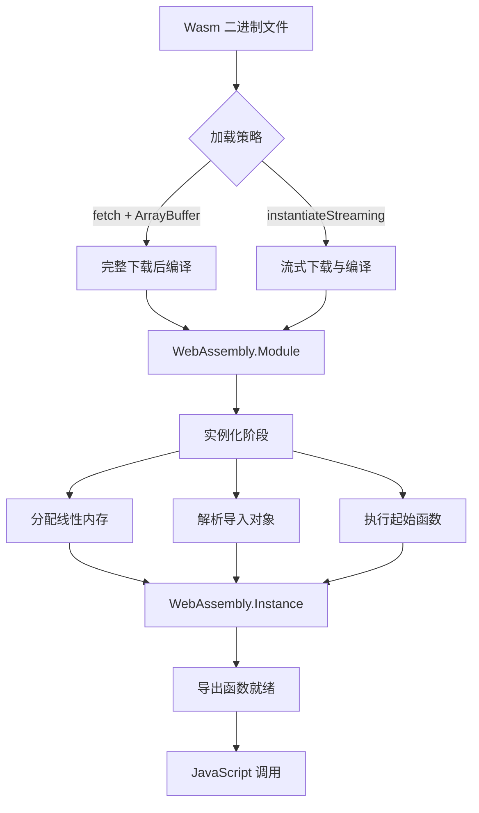
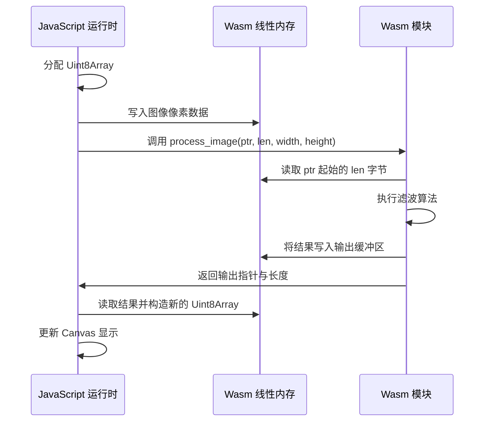

# WebAssembly 示例总览

WebAssembly（Wasm）是一种为现代 Web 浏览器设计的可移植、高性能的二进制指令格式。自 2017 年各大浏览器达成实现共识以来，Wasm 已经从一项实验性技术演变为支撑复杂 Web 应用的关键基础设施。在 JavaScript/TypeScript 生态系统中，WebAssembly 不再仅仅是一种"让 C++ 在浏览器中运行"的奇技淫巧，而是成为前端性能工程的核心支柱——从图像处理、音视频编解码、3D 渲染到机器学习推理，Wasm 正在重新定义浏览器端计算的能力边界。

本文档将从模块集成、内存模型、工具链选型、性能优化及生产实践五个维度，系统性地阐述如何在 JS/TS 项目中高效、安全地集成 WebAssembly 模块，并建立可持续的跨语言协作开发流程。

## 目录

- [WebAssembly 示例总览](#webassembly-示例总览)
  - [目录](#目录)
  - [WebAssembly 基础概念与演进](#webassembly-基础概念与演进)
    - [从 MVP 到 Post-MVP 特性](#从-mvp-到-post-mvp-特性)
    - [在 JS/TS 生态中的定位](#在-jsts-生态中的定位)
  - [Wasm 模块加载与实例化机制](#wasm-模块加载与实例化机制)
    - [加载路径对比](#加载路径对比)
    - [实例化生命周期](#实例化生命周期)
    - [动态链接与模块组合](#动态链接与模块组合)
  - [JavaScript 与 Wasm 的内存交互模型](#javascript-与-wasm-的内存交互模型)
    - [线性内存架构](#线性内存架构)
    - [内存管理与生命周期](#内存管理与生命周期)
  - [主流语言工具链对比](#主流语言工具链对比)
    - [Rust 工具链](#rust-工具链)
    - [AssemblyScript](#assemblyscript)
    - [C/C++ 工具链（Emscripten）](#cc-工具链emscripten)
  - [Wasm 模块集成实战](#wasm-模块集成实战)
    - [项目结构规划](#项目结构规划)
    - [构建工具集成](#构建工具集成)
    - [调试与性能分析](#调试与性能分析)
  - [性能工程专题映射](#性能工程专题映射)
  - [生产环境最佳实践](#生产环境最佳实践)
    - [内容安全策略（CSP）](#内容安全策略csp)
    - [降级与渐进增强](#降级与渐进增强)
    - [版本控制与缓存](#版本控制与缓存)
    - [安全审计](#安全审计)
  - [相关示例与延伸阅读](#相关示例与延伸阅读)
    - [本目录示例](#本目录示例)
    - [跨专题关联](#跨专题关联)
  - [参考与引用](#参考与引用)

---

## WebAssembly 基础概念与演进

WebAssembly 的设计目标可以概括为四个关键词：快速、安全、可移植、开放。它是一种低层次的类汇编语言，拥有紧凑的二进制格式，可以被浏览器以接近原生代码的速度解码和编译。与此同时，Wasm 运行在一个沙箱化的执行环境中，遵循同源策略和权限模型，确保恶意或存在缺陷的模块无法随意访问宿主环境资源。

### 从 MVP 到 Post-MVP 特性

2017 年发布的 WebAssembly MVP（Minimum Viable Product）版本仅支持四种数值类型（i32、i64、f32、f64）和基础的线性内存、控制流指令。然而，随着 WASI（WebAssembly System Interface）、SIMD 128 位向量指令、多值返回、引用类型、异常处理提案的逐步标准化和落地，现代 WebAssembly 已经具备了支撑复杂系统级应用的能力。

**WASI 的意义**。WASI 为 Wasm 模块定义了一套标准化的系统调用接口，使得 Wasm 不再局限于浏览器环境，而可以作为通用二进制格式运行在服务器端、边缘计算节点甚至嵌入式设备上。Cloudflare Workers、Fastly Compute@Edge、Wasmtime、WasmEdge 等运行时已经提供了成熟的 WASI 支持，这意味着用 Rust、C、Go 等语言编译的 Wasm 模块可以在这些环境中以沙箱化方式访问文件系统、网络和环境变量。

**SIMD 与性能计算**。SIMD（Single Instruction, Multiple Data）指令集允许单条指令同时对多个数据元素执行相同操作，是图像处理、音视频编解码、科学计算等场景的关键加速手段。Wasm 的 SIMD 提案引入了 128 位向量类型和丰富的向量运算指令，使得浏览器端的 Rust/C 代码可以充分利用现代 CPU 的向量执行单元。

**垃圾回收与高级语言**。传统上，将 Java、C#、Go 等带有垃圾回收机制的语言编译到 Wasm 面临巨大的挑战——需要在 Wasm 模块内部实现一套完整的 GC 运行时，导致模块体积膨胀和性能下降。Wasm GC 提案旨在将垃圾回收机制直接纳入 Wasm 标准，使得这些语言可以更自然、更高效地 targeting Wasm。随着该提案在 Chrome 和 Firefox 中的实验性实现，未来将有更多高级语言加入 Wasm 生态。

### 在 JS/TS 生态中的定位

在 JavaScript/TypeScript 主导的 Web 开发体系中，WebAssembly 并非要取代 JavaScript，而是与其形成互补。JavaScript 负责应用逻辑、DOM 操作、网络请求和事件处理——这些正是它的强项；WebAssembly 则接管计算密集型、算法复杂或对内存布局有严格要求的任务。两者的协作边界通常由性能剖面（Performance Profile）决定：当 Chrome DevTools 的火焰图显示某段 JavaScript 逻辑占据大量 CPU 时间且优化空间有限时，便是考虑将其迁移至 Wasm 的信号。

## Wasm 模块加载与实例化机制

在浏览器中使用 WebAssembly 的第一步是将二进制模块加载到 JavaScript 运行时并实例化。虽然基础的 `WebAssembly.instantiate` API 看似简单，但在生产环境中，加载策略的选择直接影响首屏性能和用户体验。

### 加载路径对比

浏览器提供了多种加载 Wasm 模块的途径，各有其适用场景：

**ArrayBuffer 加载**。最传统的方式是通过 `fetch` 获取二进制响应，读取为 `ArrayBuffer` 后再调用编译和实例化 API。这种方式兼容性最好（支持所有实现了 Wasm 的浏览器），但无法利用流式编译优化，需要等待整个文件下载完成后才能开始编译。

**Streaming 流式加载**。`WebAssembly.instantiateStreaming` 和 `WebAssembly.compileStreaming` API 允许浏览器在下载响应体的同时进行编译。这利用了 HTTP 的分块传输能力，将下载和编译过程重叠，通常可以减少 30% 到 50% 的加载时间。这是生产环境的首选方案，但要求服务器正确设置 `application/wasm` 的 MIME 类型。

**Base64 内联加载**。将小型 Wasm 模块以 Base64 编码直接嵌入 JavaScript  bundle 中，可以避免额外的网络请求。这种方案适用于体积小于 10KB 的微模块，但对于大型模块，Base64 编码会增加约 33% 的体积，且无法利用浏览器的缓存机制。

**Web Worker 加载**。对于大型 Wasm 模块或计算密集型应用，应将模块的加载和运行完全移至 Web Worker。主线程仅需通过消息传递与 Worker 通信，从而保持界面的响应性。配合 `OffscreenCanvas` 等技术，甚至可以将渲染逻辑也一并移至 Worker。

### 实例化生命周期



上图展示了从 Wasm 二进制文件到可调用实例的完整生命周期。理解这一生命周期对于诊断加载失败和性能调优至关重要。例如，当实例化阶段抛出 `LinkError` 时，通常意味着导入对象中缺少 Wasm 模块期望的函数或内存；当编译阶段耗时过长时，则可能需要考虑代码拆分或将编译任务移至 Worker。

### 动态链接与模块组合

随着应用复杂度的增长，将所有逻辑打包为单个 Wasm 模块会导致编译时间和内存占用的线性增长。WebAssembly 支持模块间的动态链接，允许将通用库（如标准库、数学库、图像处理库）编译为独立的动态库模块（Dynamic Library / Shared Module），在主模块实例化时动态链接。

Emscripten 工具链提供了成熟的动态链接支持，通过 `dlopen` 风格的 API 或直接的侧模块（Side Module）加载机制实现。在 Rust 生态中，`wasm-bindgen` 结合 `wasm-split` 等实验性工具也开始探索代码拆分方案。对于大型应用，采用模块化的 Wasm 架构可以显著缩短初始加载时间，并实现更细粒度的缓存策略。

## JavaScript 与 Wasm 的内存交互模型

WebAssembly 的线性内存（Linear Memory）是一个可扩容的连续字节数组，作为 Wasm 模块与 JavaScript 之间共享状态的主要媒介。理解这一内存模型的语义和限制，是编写高效、安全跨语言代码的基础。

### 线性内存架构

每个 Wasm 实例拥有自己独立的线性内存，表现为一个可调整大小的 `ArrayBuffer`（或 `WebAssembly.Memory` 对象）。Wasm 模块通过 `i32` 指针访问内存中的数据，所有复杂类型（字符串、数组、结构体）都必须序列化为字节序列后存入线性内存，再通过指针和长度信息传递给另一方。



此序列图展示了一次典型的图像处理跨语言调用流程。值得注意的是，JavaScript 的 TypedArray 可以与 Wasm 线性内存共享底层 ArrayBuffer，因此在理想情况下可以实现零拷贝的数据传递。然而，当数据需要经过编码转换（如 Rust 的 `String` 与 JavaScript 的 UTF-16 字符串之间的转换）时，拷贝仍然不可避免。

### 内存管理与生命周期

Wasm 线性内存的生命周期与实例绑定，当实例被垃圾回收时，其关联的内存也会被释放。然而，在实例存活期间，内存不会自动缩小（即使 Wasm 模块内部的堆分配器回收了内存），这可能导致长时间的页面会话中出现内存膨胀。

对于使用 Rust 编写的 Wasm 模块，`wee_alloc` 或默认的 `dlmalloc` 分配器负责管理 Wasm 线性内存内部的堆空间。JavaScript 端通常无需关心这些内部细节，但在以下场景中需要特别注意：

**手动内存释放**。当 Wasm 模块通过分配器在堆上创建了某个对象（如一个图像处理上下文），并将其指针返回给 JavaScript 时，JavaScript 端在用完该对象后应显式调用释放函数，避免 Wasm 堆内存泄漏。

**内存扩容边界**。Wasm 线性内存的初始大小和最大大小在编译时确定。当模块的内存需求超过当前容量时，引擎会尝试扩容。如果达到最大限制，分配将失败并触发 Rust 的内存不足处理逻辑（通常是 panic）。在生产环境中，应根据应用的峰值内存需求合理设置最大内存限制。

**共享内存与线程**。WebAssembly 的 Threads 提案引入了共享线性内存（`WebAssembly.Memory` 的 `shared: true` 选项），允许多个 Wasm 实例或 Worker 线程同时访问同一块内存。配合 `Atomic` 操作和 `Wait`/`Notify` 原语，可以实现真正的多线程并行计算。然而，共享内存也引入了数据竞争的风险，Rust 的所有权模型在此场景下依然是防止竞争条件的有力工具。

## 主流语言工具链对比

虽然 WebAssembly 是语言无关的格式，但不同语言的编译工具链在开发体验、运行时性能、包体积和生态成熟度方面存在显著差异。以下是 JS/TS 开发者最常接触的三种 Wasm 生成路径的对比分析。

### Rust 工具链

Rust 是目前 Wasm 生态中最活跃的语言。`wasm-pack` 作为官方推荐的构建工具，封装了 `cargo` 编译、`wasm-bindgen` 绑定生成和 `wasm-opt` 优化等一系列步骤，输出可以直接发布到 npm 的包。

Rust 的优势在于零成本抽象和严格的内存安全保证，编译后的 Wasm 模块通常具有极小的体积和优异的运行时性能。`wasm-bindgen` 提供了丰富的类型映射（字符串、数组、Promise、回调函数等），使得 JS 与 Rust 的互操作异常便捷。Rust 的 crate 生态中已有大量专为 Wasm 优化的库（如 `web-sys` 用于 DOM 操作、`js-sys` 用于 JavaScript 内建 API 绑定）。

### AssemblyScript

AssemblyScript 是一个将 TypeScript 语法子集编译到 WebAssembly 的语言。对于前端开发者而言，其最大的吸引力在于极低的迁移成本——基本语法、类型系统和标准库与 TypeScript 高度一致。

然而，AssemblyScript 并非完整的 TypeScript 实现，它不支持闭包、动态类型、异常处理等高级特性，且标准库相对薄弱。它最适合场景明确的算法模块（如数学计算、物理模拟、游戏逻辑），而不适合需要复杂语言特性的业务系统。由于其编译器直接生成 Wasm，不依赖重型语言运行时，输出体积通常非常小巧。

### C/C++ 工具链（Emscripten）

Emscripten 是最成熟的 Wasm 编译工具链之一，支持将大量的现有 C/C++ 代码库移植到 Web 平台。通过编译 SDL、OpenGL、POSIX API 到 Web 等价物，Emscripten 甚至可以将完整的桌面应用（如游戏引擎、模拟器）以接近零改动的代价迁移到浏览器。

Emscripten 的输出包含一个 JavaScript 运行时胶水层，负责模拟 C 的运行时环境（堆栈、文件系统、主循环等）。这使得模块体积通常大于 Rust 或 AssemblyScript 的输出，且与 JavaScript 的集成需要更多的适配工作。然而，对于需要复用大量现有 C++ 资产的项目，Emscripten 依然是最务实的选择。

## Wasm 模块集成实战

理论知识的最终价值体现在实际项目的落地能力。本节通过一个完整的 Wasm 模块集成示例，展示从环境搭建到生产部署的完整工作流。

### 项目结构规划

在现代化的前端项目中引入 Wasm 模块，推荐采用 monorepo 或 workspace 的组织形式，将 Rust/Wasm 源码与 JavaScript/TypeScript 应用代码分离但置于同一版本控制之下：

```
project/
├── wasm-lib/              # Rust/Wasm 源码目录
│   ├── Cargo.toml
│   ├── src/
│   │   └── lib.rs
│   └── pkg/               # wasm-pack 输出目录
├── web-app/               # 前端应用目录
│   ├── src/
│   ├── package.json
│   └── vite.config.ts
└── package.json           # workspace 根配置
```

这种结构的优势在于：Rust 代码的变更可以触发独立的前端构建流程；`wasm-pack` 生成的 npm 包可以被前端项目像引用普通依赖一样引用；CI/CD 流程可以并行编译 Wasm 模块和构建前端应用。

### 构建工具集成

现代前端构建工具对 WebAssembly 提供了不同程度的支持：

**Vite**。Vite 原生支持直接导入 `*.wasm` 文件。在开发模式下，Vite 会返回一个异步加载函数；在生产构建中，Wasm 文件会被处理为资源文件并进行优化。结合 `@wasm-tool/rollup-plugin-rust` 插件，可以直接在 Vite 配置中集成 Rust 源码的自动编译。

**Webpack**。Webpack 4 和 5 均支持通过配置 `experiments.asyncWebAssembly` 或 `experiments.syncWebAssembly` 启用 Wasm 导入。Webpack 5 的异步 Wasm 支持更为成熟，能够将 Wasm 模块作为异步 chunk 进行代码分割和按需加载。

**Rollup / WMR**。通过 `@rollup/plugin-wasm` 可以实现类似 Webpack 的 Wasm 支持，将二进制文件内联为 Base64 或作为外部资源引用。

### 调试与性能分析

调试 Wasm 模块的首要工具是浏览器开发者工具。Chrome DevTools 支持将 Wasm 二进制文件映射回原始源码（通过 DWARF 调试信息），允许开发者在 Rust/C++ 源码级别设置断点、单步执行和检查变量。

性能分析应关注三个层面：加载性能（网络传输时间 + 编译时间）、运行性能（Wasm 函数执行耗时）和内存性能（线性内存占用和扩容次数）。Chrome 的 Performance 面板和 WebAssembly 专属分析工具（如 `wasm-objdump`、`wasm2wat`）可以提供详细的洞察。

## 性能工程专题映射

WebAssembly 的集成与优化与本站点的 [性能工程专题](/performance-engineering/) 有着天然的紧密联系。该专题从宏观角度审视前端性能优化的完整体系，涵盖网络加载、运行时执行、渲染流水线、内存管理和能耗优化等多个维度。

Wasm 在性能工程中的角色可以被概括为"计算加速层"。当 JavaScript 引擎（V8、SpiderMonkey、JavaScriptCore）遇到无法有效优化的代码模式（如大量位运算、不规则数组访问、手动内存管理需求）时，将这些逻辑下沉至 Wasm 层可以绕过 JS 引擎的诸多限制。性能工程专题中详细讨论的代码分割、预加载、缓存策略同样适用于 Wasm 模块的分发和加载优化。

此外，性能工程专题还探讨了 Web Worker、SharedArrayBuffer 和 Service Worker 等浏览器特性与 Wasm 的结合策略。例如，在视频编辑类 Web 应用中，主线程负责 UI 渲染和交互响应，Web Worker 中的 Wasm 模块负责帧解码和特效计算，Service Worker 则负责离线缓存和后台同步——这种多层协作架构正是现代高性能 Web 应用的典型范式。

## 生产环境最佳实践

将 WebAssembly 模块部署到生产环境时，除了功能正确性，还需关注安全性、兼容性和可维护性。

### 内容安全策略（CSP）

WebAssembly 的执行受到内容安全策略的约束。默认情况下，`script-src` 指令控制 Wasm 的 `WebAssembly.instantiate` 调用权限。如果 CSP 策略较为严格（如禁止 `unsafe-eval`），需要显式添加 `wasm-unsafe-eval` 关键字以允许 Wasm 实例化，或者将 Wasm 编译移至服务器端并通过 `WebAssembly.Module` 传递已编译模块。

### 降级与渐进增强

并非所有用户环境都支持 WebAssembly。在受限环境（如旧版浏览器、企业安全策略限制、某些移动 WebView）中，应用应提供纯 JavaScript 的降级方案。通过特性检测（`typeof WebAssembly === 'object'`）在运行时选择执行路径，确保核心功能在无 Wasm 环境下依然可用。

### 版本控制与缓存

Wasm 二进制文件应通过内容哈希命名（如 `processor.a3f7b2.wasm`），并配置长期缓存头（`Cache-Control: max-age=31536000, immutable`）。配合构建工具的代码分割功能，确保 Wasm 模块的更新不会导致整个应用 bundle 的缓存失效。

### 安全审计

Wasm 模块虽然运行在沙箱中，但仍需警惕潜在的安全风险：通过内存溢出攻击篡改线性内存中的敏感数据、利用 Spectre 类侧信道攻击窃取跨源信息、或通过导入函数暴露过多的宿主能力。定期使用 `wasm-objdump` 和专用安全扫描工具审查模块的导入/导出表，遵循最小权限原则配置导入对象。

## 相关示例与延伸阅读

### 本目录示例

- **[Wasm 模块集成完整示例](./wasm-module-integration.md)** — 演示如何在 Vite + React 项目中集成 Rust/Wasm 模块，实现图像滤镜处理功能，包含完整的类型定义、错误处理和 Worker 卸载策略。

### 跨专题关联

- **[性能工程专题](/performance-engineering/)** — 深入讲解 Wasm 加载优化、运行时性能剖析、内存调优及与浏览器渲染流水线的协同优化策略。
- **[Rust 工具链示例](../rust-toolchain/)** — 系统介绍 Rust 与 JS/TS 生态的桥接技术，包括 NAPI-RS 和 wasm-bindgen 的详细用法。
- **[AI/ML 推理示例](../ai-ml-inference/)** — 探索使用 ONNX Runtime Web 和 TensorFlow.js 在浏览器中执行机器学习模型的方案，其中大量利用了 Wasm 和 SIMD 加速。

## 参考与引用

[1] World Wide Web Consortium (W3C). "WebAssembly Core Specification." W3C Recommendation, 2019. <https://www.w3.org/TR/wasm-core-1/> — WebAssembly 核心规范，定义了 Wasm 的语法、类型系统、执行语义和验证规则。

[2] Haas, A., et al. "Bringing the Web Up to Speed with WebAssembly." Proceedings of the 38th ACM SIGPLAN Conference on Programming Language Design and Implementation (PLDI 2017), pp. 185-200. — WebAssembly 设计的奠基性论文，阐述了 Wasm 的性能目标、安全模型和与 JavaScript 的协作关系。

[3] Mozilla and Rust and WebAssembly Working Group. "wasm-bindgen Guide." <https://rustwasm.github.io/wasm-bindgen/> — Rust 与 WebAssembly 互操作的官方指南，涵盖从基础绑定到高级类型映射的完整内容。

[4] WebAssembly Community Group. "WebAssembly System Interface (WASI)." <https://wasi.dev/> — WASI 官方文档，定义了 Wasm 模块访问操作系统资源的可移植标准接口。

[5] Emscripten Contributors. "Emscripten Documentation." <https://emscripten.org/docs/> — Emscripten 官方文档，详细说明了从 C/C++ 编译到 Wasm 的完整流程和 API 兼容性层。
