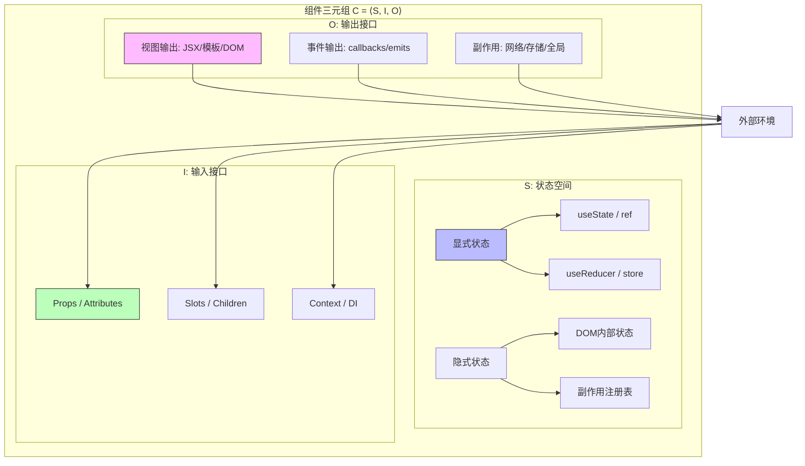
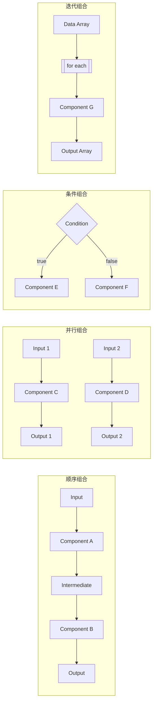
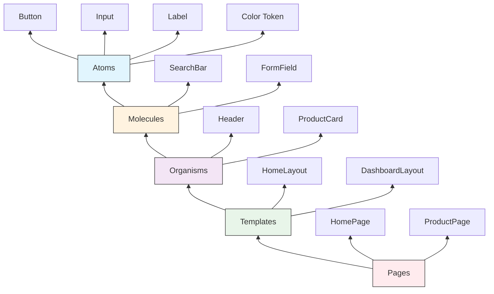

# 组件模型理论：从函数到组件

## 引言

现代前端开发的核心抽象是**组件（Component）**。无论是React的函数组件、Vue的单文件组件（SFC）、Angular的 `@Component` 装饰器类，还是Web Components的Custom Elements，它们共享一个根本性的承诺：**将用户界面分解为独立、可复用、可组合的单元**。然而，「组件」在不同框架中的具体实现差异巨大——React将组件视为「接收props返回JSX的纯函数」，Vue将组件视为「模板+反应式状态+生命周期钩子的封装单元」，Web Components则将其视为「扩展HTML元素标准的自定义标签」。

这种差异引发了一个更深层次的理论问题：**组件的本质是什么？** 它是否可以用形式化的方式定义？不同框架的组件模型之间存在怎样的映射关系？组件与传统的软件工程概念（如模块、对象、函数）有何异同？

本文从形式化定义出发，构建组件的组合代数，分析组件接口契约的组成要素，并建立组件与函数之间的理论联系。随后，我们将这一理论框架映射到五大主流组件模型的工程实践——React函数组件、Vue SFC、Web Components、Angular装饰器模型，以及设计系统中的组件层次结构（Atomic Design）——揭示它们各自的设计哲学、能力边界和适用场景。

## 理论严格表述

### 1. 组件的形式化定义

在软件工程文献中，组件被多种方式定义。Szyperski在《Component Software: Beyond Object-Oriented Programming》（2002）中给出了一个被广泛引用的定义：「*软件组件是一个组合单元，具有契约式规定的接口和显式的上下文依赖，可以独立部署，并可以由第三方组合。*」[^1]

我们可以将这一直觉形式化为一个**组件三元组**：

$$C = \langle S, I, O \rangle$$

其中：

- $S$ 是组件的内部**状态空间**（State Space）。状态可以是显式的（如React的 `useState`、Vue的 `ref`），也可以是隐式的（如DOM的内部表示、事件监听器的注册表）。
- $I$ 是**输入接口**（Input Interface），定义了组件从外部环境接收的数据和控制信号。在前端框架中，输入通常表现为 `props`、`attributes` 或 `inputs`。
- $O$ 是**输出接口**（Output Interface），定义了组件向外部环境产生的可见效应。输出包括渲染的UI结构（视图输出）、触发的事件/回调（信号输出）、以及副作用（Side Effects，如网络请求、DOM操作、日志记录）。

组件的核心特征是**封装（Encapsulation）**：外部只能通过 $I$ 和 $O$ 与组件交互，不能直接访问或修改 $S$。封装的边界在不同框架中有所不同：React通过函数闭包和props不可变性实现逻辑封装，Vue通过Proxy反应式系统实现状态封装，Web Components通过Shadow DOM实现视觉和DOM结构的封装。

#### 组件与函数的关系

组件与函数之间存在深刻的理论联系。在最抽象的意义上，**组件可以被建模为一个「带副作用的函数」**：

$$\text{Component}: I \times S_{t} \rightarrow O \times S_{t+1}$$

即：给定输入 $I$ 和当前状态 $S_t$，组件产生输出 $O$ 并可能将状态更新为 $S_{t+1}$。如果 $S_t = S_{t+1}$（状态不变）且 $O$ 中无副作用，则组件退化为纯函数：

$$\text{PureComponent}: I \rightarrow O_{view}$$

React的函数组件设计哲学正是追求这种理想化的纯函数模型：`UI = f(props)`。然而，真实的前端组件几乎不可能完全避免副作用（用户交互、网络请求、动画、DOM操作），因此React通过Hooks（`useEffect`、`useState` 等）将副作用**显式化**和**隔离化**，而非试图消除它们。

### 2. 组件的组合代数

组件的真正威力不在于单个组件的能力，而在于**组合（Composition）**。我们可以定义组件的组合代数，识别出四种基本组合模式：

#### 顺序组合（Sequential Composition）

顺序组合将组件的输出连接到另一个组件的输入，形成数据流管道：

$$C_1 \circ C_2: I \xrightarrow{C_2} M \xrightarrow{C_1} O$$

在前端框架中，顺序组合表现为**父子组件嵌套**：父组件通过props将数据传递给子组件，子组件通过返回值/渲染输出将UI结构回传给父组件的插槽（Slot）。React的组件树、Vue的模板嵌套、以及Angular的内容投影（`ng-content`）都是顺序组合的具体实现。

#### 并行组合（Parallel Composition）

并行组合将多个组件并置，各自独立处理输入，产生联合输出：

$$C_1 \parallel C_2: (I_1, I_2) \rightarrow (O_1, O_2)$$

在前端中，并行组合表现为**兄弟组件的并列渲染**：同一层级上的多个组件独立接收各自的props，渲染各自的UI片段，互不影响。React的兄弟JSX元素、Vue模板中的并列标签、以及CSS Grid/Flexbox布局中的并列单元，都体现了并行组合。

#### 条件组合（Conditional Composition）

条件组合根据运行时条件选择不同的组件分支：

$$\text{if } b \text{ then } C_1 \text{ else } C_2$$

前端框架中的条件渲染（React的 `&&`/`?:`、Vue的 `v-if`/`v-show`、Angular的 `*ngIf`）是条件组合的直接映射。条件组合引入了**动态性**，使得组件树的结构不再是静态的，而是依赖于运行时状态。

#### 迭代组合（Iterative Composition）

迭代组合将同一组件模式应用于集合中的每个元素：

$$\text{map}(C, [x_1, x_2, ..., x_n]) = [C(x_1), C(x_2), ..., C(x_n)]$$

列表渲染（React的 `Array.map`、Vue的 `v-for`、Angular的 `*ngFor`）是迭代组合的工程化表达。迭代组合引入了**规模可变性**——组件实例的数量取决于数据集合的大小。

### 3. 组件接口契约

可靠的组件系统依赖于**接口契约（Interface Contract）**的明确定义。契约规定了组件提供什么、要求什么、以及保证什么。一个完整的组件契约应包含以下维度：

#### 输入类型契约

输入契约定义了组件期望接收的数据类型、形状和约束：

```typescript
// TypeScript 接口契约示例
interface ButtonProps {
  variant: 'primary' | 'secondary' | 'danger';  // 有限值域
  size?: 'sm' | 'md' | 'lg';                    // 可选，有默认值
  disabled?: boolean;
  onClick: (event: MouseEvent) => void;          // 回调函数
  children: React.ReactNode;                      // 子内容（组合点）
}
```

输入契约的关键设计选择包括：**必需 vs 可选**（Required vs Optional）、**受控 vs 非受控**（Controlled vs Uncontrolled）、**回调命名约定**（`onXxx` 前缀）以及**子组件插槽**（`children` 或具名插槽）。

#### 输出类型契约

输出契约不仅包括渲染的视图结构，还包括组件可能触发的副作用和事件：

```typescript
interface DataTableOutput {
  // 视图输出：渲染的表格结构（由框架隐式处理）
  // 事件输出：显式声明的回调
  onRowSelect: (row: DataRow) => void;
  onSortChange: (column: string, direction: 'asc' | 'desc') => void;
  onPageChange: (page: number) => void;
  // 副作用：网络请求、日志等（通常不体现在类型中，但应在文档中说明）
}
```

#### 副作用声明契约

副作用是组件理论中最复杂的部分。理想的组件契约应显式声明其副作用类型：

- **纯渲染副作用**：仅修改DOM，不触及外部系统。
- **网络副作用**：发起HTTP请求，与外部API交互。
- **存储副作用**：读写LocalStorage、IndexedDB、Cookie等。
- **全局副作用**：修改全局状态（Redux Store、Vuex/Pinia、Context）。
- **定时副作用**：使用 `setTimeout`、`setInterval`、`requestAnimationFrame`。

React通过Hooks的规则（仅在顶层调用、仅在函数组件中调用）和依赖数组（`useEffect(..., [deps])`）部分地强制副作用的显式声明，但JS的运行时限制使得完全静态检查副作用类型仍不可能。

### 4. 组件层次结构：从原子到页面

在复杂系统中，组件不是扁平的集合，而是具有**层次结构（Hierarchy）**。Brad Frost提出的Atomic Design方法论（2013）为UI组件的层次结构提供了一个直观的隐喻[^2]：

| 层级 | 定义 | 示例 | 组合特征 |
|------|------|------|----------|
| **原子（Atoms）** | 不可再分的基本单元 | `Button`、`Input`、`Label`、色彩变量、字体样式 | 无内部组件组合 |
| **分子（Molecules）** | 原子的简单组合 | `SearchBar`（Input + Button）、`FormField`（Label + Input + Error） | 顺序组合，少量并行 |
| **有机体（Organisms）** | 相对复杂的UI区域 | `Header`、`ProductCard`、`LoginForm` | 多原子/分子的嵌套组合 |
| **模板（Templates）** | 页面级布局结构 | `HomePageLayout`、`DashboardLayout` | 有机体的插槽化排列 |
| **页面（Pages）** | 具体实例化的模板 | 填充真实数据的首页、用户资料页 | 模板 + 数据 + 路由 |

这一层次结构揭示了组件组合的一个关键原理：**越底层的组件越纯（纯函数倾向），越顶层的组件越不纯（副作用密集）**。原子组件通常是纯展示性的（`props → UI`），而页面组件则负责数据获取、状态管理和路由协调。

Heineman与Council在《Component-Based Software Engineering》（2001）中进一步从软件工程角度区分了**组件**与**对象**、**模块**的差异[^3]。他们认为，组件比对象更强调**组合上下文独立性**（Composition Context Independence）——一个设计良好的组件不应对其被组合的具体环境做出假设。

## 工程实践映射

### 1. React函数组件：纯函数模型与Hooks的副作用显式化

React的组件模型在2019年Hooks引入后发生了根本性转变。从类组件（ES6 class + 生命周期方法）到函数组件（Function + Hooks）的演进，本质上是**从OOP模型向函数式模型的范式迁移**。

#### 纯函数理想：`UI = f(props)`

React函数组件的核心设计目标是使组件尽可能接近纯函数：

```tsx
// 理想化的纯函数组件
interface GreetingProps {
  name: string;
  enthusiasm?: number;
}

function Greeting({ name, enthusiasm = 1 }: GreetingProps): JSX.Element {
  const greeting = 'Hello, ' + name + '!'.repeat(enthusiasm);
  return <h1 className="greeting">{greeting}</h1>;
}
```

这个组件满足纯函数的所有条件：

1. **相同输入 → 相同输出**：给定相同的 `name` 和 `enthusiasm`，总是渲染相同的JSX结构。
2. **无副作用**：不修改外部状态，不触发网络请求，不产生DOM操作之外的副作用。
3. **引用透明**：可以用输出值替换函数调用而不改变程序行为（在React的虚拟DOM框架内）。

#### Hooks：副作用的显式化与隔离

纯函数模型在真实应用中无法持续，因为UI组件需要状态、生命周期管理和副作用。React Hooks通过**在函数组件内部引入受控的副作用挂载点**，解决了这一问题：

```tsx
function UserProfile({ userId }: { userId: string }) {
  // 状态管理：useState 引入局部状态
  const [user, setUser] = useState<User | null>(null);
  const [loading, setLoading] = useState(true);
  const [error, setError] = useState<Error | null>(null);

  // 副作用：useEffect 封装副作用逻辑
  useEffect(() => {
    let cancelled = false;
    setLoading(true);

    fetchUser(userId)
      .then(data => {
        if (!cancelled) {
          setUser(data);
          setError(null);
        }
      })
      .catch(err => {
        if (!cancelled) {
          setError(err);
          setUser(null);
        }
      })
      .finally(() => {
        if (!cancelled) setLoading(false);
      });

    // 清理函数：组件卸载或依赖变化时执行
    return () => { cancelled = true; };
  }, [userId]);  // 依赖数组显式声明效应的输入

  // 记忆化计算：useMemo 缓存昂贵计算
  const displayName = useMemo(() => {
    return user ? `${user.firstName} ${user.lastName}`.trim() : 'Guest';
  }, [user]);

  if (loading) return <Spinner />;
  if (error) return <ErrorMessage error={error} />;
  if (!user) return <NotFound />;

  return (
    <article className="user-profile">
      <h2>{displayName}</h2>
      <p>{user.email}</p>
    </article>
  );
}
```

Hooks的设计哲学可以概括为：**将组件逻辑（状态、副作用、记忆化）从类的方法组织方式，转换为函数的声明式组合方式**。`useState`、`useEffect`、`useMemo`、`useCallback` 等Hooks本质上是React运行时提供的「代数效应」模拟——它们在函数调用的重复执行之间，维护着隐藏的关联状态。

#### React组件模型的形式化特征

| 特征 | React实现 | 理论对应 |
|------|-----------|----------|
| 输入 | `props` 对象 | 函数参数 $I$ |
| 状态 | `useState`、`useReducer` | 状态空间 $S$ |
| 输出 | JSX返回值 | 视图输出 $O_{view}$ |
| 副作用 | `useEffect`、`useLayoutEffect` | 副作用输出 $O_{side}$ |
| 组合 | 嵌套JSX、Children | 顺序/并行/条件/迭代组合 |
| 封装 | 闭包、单向数据流 | 状态隐藏、接口契约 |

### 2. Vue单文件组件（SFC）：封装模型与反应式系统

Vue的组件模型与React形成鲜明对比。Vue不追求纯函数理想，而是提供一个**「自包含的视图单元」**——将模板、逻辑和样式封装在单一文件中，通过反应式系统自动管理状态到视图的映射。

#### SFC的三段式封装

```vue
<!-- Vue 3 SFC + TypeScript -->
<template>
  <article class="user-profile">
    <Spinner v-if="loading" />
    <ErrorMessage v-else-if="error" :error="error" />
    <div v-else-if="user">
      <h2>{{ displayName }}</h2>
      <p>{{ user.email }}</p>
    </div>
    <NotFound v-else />
  </article>
</template>

<script setup lang="ts">
import { ref, computed, watch, onMounted } from 'vue';
import { fetchUser } from './api';

// 组件契约：定义 Props
const props = defineProps<{
  userId: string;
}>();

// 反应式状态：ref 创建可观察的状态单元
const user = ref<User | null>(null);
const loading = ref(true);
const error = ref<Error | null>(null);

// 计算属性：自动缓存的派生状态
const displayName = computed(() => {
  if (!user.value) return 'Guest';
  return `${user.value.firstName} ${user.value.lastName}`.trim();
});

// 副作用：watch 响应特定状态变化
watch(() => props.userId, async (newId) => {
  loading.value = true;
  error.value = null;
  try {
    user.value = await fetchUser(newId);
  } catch (err) {
    error.value = err as Error;
    user.value = null;
  } finally {
    loading.value = false;
  }
}, { immediate: true });

// 生命周期：onMounted 等钩子
onMounted(() => {
  console.log('UserProfile mounted for', props.userId);
});
</script>

<style scoped>
.user-profile { padding: 1rem; }
.user-profile h2 { color: #333; }
</style>
```

#### Vue反应式系统的范式特征

Vue的反应式系统基于**Proxy**（Vue 3）或 **Object.defineProperty**（Vue 2），实现了**自动依赖追踪**：当组件模板访问某个反应式状态时，Vue自动建立「状态 → 视图」的依赖关系，当状态变化时，精确地重新渲染依赖该状态的视图部分。

这种模型与React的显式重渲染（通过状态变更触发整个组件的重新执行）形成对比：

| 维度 | React | Vue |
|------|-------|-----|
| 更新粒度 | 组件级（默认） | 细粒度（依赖追踪） |
| 状态变更检测 | 显式（`setState`、新引用） | 隐式（Proxy拦截赋值） |
| 副作用声明 | `useEffect` + 依赖数组 | `watch`/`watchEffect` |
| 模板语法 | JSX（JS表达式） | 模板DSL（指令系统） |
| 样式封装 | CSS-in-JS / CSS Modules | `<style scoped>` |

Vue的组件模型更接近传统GUI框架（如WPF、Qt）的数据绑定模式，但通过编译时优化（模板编译为高效的渲染函数）和反应式Proxy系统，实现了与现代Web框架相媲美的性能。

### 3. Web Components：标准组件模型与平台原语

Web Components是一组浏览器原生标准（Custom Elements、Shadow DOM、HTML Templates、ES Modules），旨在**将组件化能力从框架层下沉到平台层**。其组件模型不依赖任何框架，而是扩展了HTML元素本身的定义。

#### Custom Elements + Shadow DOM 的核心模型

```typescript
// 使用 Lit（Google 的 Web Components 库）简化原生 API
import { LitElement, html, css } from 'lit';
import { customElement, property, state } from 'lit/decorators.js';

@customElement('user-profile')
export class UserProfileElement extends LitElement {
  // 公开属性：映射到 HTML attributes
  @property({ type: String })
  userId = '';

  // 内部状态：不暴露为 attribute
  @state()
  private user: User | null = null;

  @state()
  private loading = true;

  @state()
  private error: Error | null = null;

  // 样式封装在 Shadow DOM 内
  static styles = css`
    :host { display: block; padding: 1rem; }
    h2 { color: #333; }
  `;

  // 生命周期：connectedCallback = 挂载
  connectedCallback() {
    super.connectedCallback();
    this.loadUser();
  }

  // 属性变化时重新加载
  updated(changedProps: Map<string, any>) {
    if (changedProps.has('userId')) {
      this.loadUser();
    }
  }

  private async loadUser() {
    this.loading = true;
    try {
      const response = await fetch(`/api/users/${this.userId}`);
      this.user = await response.json();
      this.error = null;
    } catch (err) {
      this.error = err as Error;
      this.user = null;
    } finally {
      this.loading = false;
    }
  }

  // 渲染：返回 HTML 模板
  render() {
    if (this.loading) return html`<spinner-widget></spinner-widget>`;
    if (this.error) return html`<error-message .error=${this.error}></error-message>`;
    if (!this.user) return html`<not-found-widget></not-found-widget>`;

    return html`
      <article>
        <h2>${this.user.firstName} ${this.user.lastName}</h2>
        <p>${this.user.email}</p>
      </article>
    `;
  }
}

// 使用方式：与框架无关的标准 HTML
declare global {
  interface HTMLElementTagNameMap {
    'user-profile': UserProfileElement;
  }
}
```

#### Web Components的组件模型特征

Web Components的组件模型具有以下独特性质：

1. **真正的封装**：Shadow DOM创建了真正的DOM边界，外部CSS默认无法穿透，内部样式不会泄漏。这比React/Vue的CSS隔离方案更彻底。

2. **原生HTML兼容性**：自定义元素可以像原生元素一样使用（`<user-profile user-id="123">`），可以被任何框架（React、Vue、Angular、Svelte）消费。

3. **生命周期与HTML元素对齐**：`connectedCallback`（插入DOM）、`disconnectedCallback`（移除DOM）、`attributeChangedCallback`（属性变化）与浏览器元素生命周期原生一致。

4. **无虚拟DOM开销**：直接操作Shadow DOM，跳过虚拟DOM的diff开销，但也失去了虚拟DOM带来的跨平台抽象能力。

Web Components的局限性在于**标准演进缓慢**和**开发体验相对原始**。缺少成熟的反应式系统、没有内置的状态管理方案、模板语法简陋（原生HTML Templates）、以及SSR支持复杂，这些因素限制了其在大型应用中的独立使用。然而，作为**跨框架兼容的组件封装格式**，Web Components在构建设计系统和可复用UI库方面具有独特价值。

### 4. Angular的 `@Component` 装饰器模型：企业级OOP架构

Angular的组件模型是所有主流框架中最接近**传统企业级OOP架构**的。它围绕TypeScript的类系统、装饰器元编程和依赖注入容器构建了一套完整的组件工程体系。

#### 装饰器驱动的组件定义

```typescript
import { Component, Input, Output, EventEmitter, OnInit, OnDestroy } from '@angular/core';
import { UserService } from './user.service';

// @Component 装饰器定义组件的元数据
@Component({
  selector: 'app-user-profile',           // 组件标签名
  templateUrl: './user-profile.component.html',  // 外部模板
  styleUrls: ['./user-profile.component.css'],   // 外部样式
  providers: [UserService],               // 组件级依赖注入
  changeDetection: ChangeDetectionStrategy.OnPush  // 变更检测策略
})
export class UserProfileComponent implements OnInit, OnDestroy {
  // 输入契约：@Input 装饰器标记公开属性
  @Input() userId: string = '';

  // 输出契约：@Output 装饰器标记事件发射器
  @Output() profileLoaded = new EventEmitter<User>();
  @Output() loadError = new EventEmitter<Error>();

  // 内部状态
  user: User | null = null;
  loading = true;
  error: Error | null = null;

  // 依赖注入：构造函数声明依赖
  constructor(
    private userService: UserService,
    private cdr: ChangeDetectorRef
  ) {}

  // 生命周期钩子接口
  ngOnInit() {
    this.loadUser();
  }

  ngOnDestroy() {
    // 清理订阅、定时器等
  }

  private async loadUser() {
    this.loading = true;
    try {
      this.user = await this.userService.getUser(this.userId).toPromise();
      this.error = null;
      this.profileLoaded.emit(this.user);
    } catch (err) {
      this.error = err as Error;
      this.user = null;
      this.loadError.emit(this.error);
    } finally {
      this.loading = false;
      this.cdr.markForCheck();
    }
  }

  // 计算属性方法
  get displayName(): string {
    if (!this.user) return 'Guest';
    return `${this.user.firstName} ${this.user.lastName}`.trim();
  }
}
```

#### Angular组件模型的OOP特征

| OOP概念 | Angular实现 | 组件理论映射 |
|---------|------------|-------------|
| 类定义 | `export class XComponent` | 组件 = 类的实例 |
| 元数据 | `@Component({...})` 装饰器 | 组件契约的声明式附加 |
| 封装 | 访问修饰符 `private`/`public` | 状态空间 $S$ 的访问控制 |
| 继承 | `extends BaseComponent` | 组件层次结构的代码复用 |
| 接口实现 | `implements OnInit, OnDestroy` | 生命周期契约的形式化 |
| 依赖注入 | 构造函数参数 + DI容器 | 组件的外部依赖显式声明 |
| 变更检测 | `ChangeDetectionStrategy` | 输出更新的策略控制 |

Angular的组件模型强调**显式性**和**可测试性**。所有输入、输出、依赖和生命周期行为都通过装饰器或接口显式声明，这使得Angular组件在大型团队中更容易理解和维护，但也带来了更高的「仪式性」（Boilerplate）成本。

### 5. 类组件 vs 函数组件：组件模型的范式差异

React中类组件与函数组件的对比，浓缩了两种组件模型的根本差异：

```tsx
// 类组件：OOP模型（生命周期方法 + this状态）
class UserProfile extends React.Component<UserProfileProps, UserProfileState> {
  constructor(props: UserProfileProps) {
    super(props);
    this.state = { user: null, loading: true, error: null };
  }

  componentDidMount() { this.loadUser(); }

  componentDidUpdate(prevProps: UserProfileProps) {
    if (prevProps.userId !== this.props.userId) {
      this.loadUser();
    }
  }

  componentWillUnmount() { /* 清理 */ }

  async loadUser() {
    this.setState({ loading: true });
    try {
      const user = await fetchUser(this.props.userId);
      this.setState({ user, error: null, loading: false });
    } catch (error) {
      this.setState({ error, user: null, loading: false });
    }
  }

  render() {
    const { user, loading, error } = this.state;
    // ... JSX
  }
}

// 函数组件：函数式模型（Hooks + 闭包状态）
function UserProfile({ userId }: UserProfileProps) {
  const [user, setUser] = useState(null);
  const [loading, setLoading] = useState(true);
  const [error, setError] = useState(null);

  useEffect(() => {
    loadUser();
    async function loadUser() {
      setLoading(true);
      try {
        setUser(await fetchUser(userId));
        setError(null);
      } catch (err) {
        setError(err);
        setUser(null);
      } finally {
        setLoading(false);
      }
    }
  }, [userId]);

  // ... JSX
}
```

| 对比维度 | 类组件（OOP模型） | 函数组件（函数式模型） |
|----------|----------------|-------------------|
| 状态归属 | `this.state` 集中对象 | 多个 `useState` 分散声明 |
| 生命周期 | 预定义方法（`componentDidMount`） | `useEffect` 统一副作用钩子 |
| 逻辑复用 | 高阶组件（HOC）、渲染属性 | 自定义Hooks |
| `this` 绑定 | 需要显式绑定或箭头函数 | 闭包天然捕获 |
| 最小单元 | 类 = 状态+方法+渲染的捆绑 | 函数 = 输入→输出的映射 |
| 学习曲线 | 需理解OOP和生命周期 | 需理解闭包和Hooks规则 |

React社区向函数组件的迁移并非偶然——它反映了软件工程界对**「组合优于继承」**和**「显式副作用管理」**的普遍认同。函数组件 + Hooks 使得组件逻辑可以通过自定义Hooks进行更细粒度、更直观的复用，而不需要理解高阶组件的嵌套地狱或渲染属性的回调金字塔。

### 6. 设计系统中的组件层级：Atomic Design的工程实践

Atomic Design方法论不仅是理论框架，已被广泛应用于企业级设计系统的构建。以下是其在真实项目中的实施模式：

```
design-system/
├── atoms/
│   ├── Button/
│   │   ├── Button.tsx          # React/Vue 组件实现
│   │   ├── Button.test.tsx     # 单元测试
│   │   ├── Button.stories.tsx  # Storybook 文档
│   │   └── index.ts
│   ├── Input/
│   ├── Label/
│   └── tokens/                 # 设计令牌
│       ├── colors.ts
│       ├── typography.ts
│       └── spacing.ts
├── molecules/
│   ├── SearchBar/
│   ├── FormField/
│   └── PaginationControl/
├── organisms/
│   ├── Header/
│   ├── ProductCard/
│   └── DataTable/
├── templates/
│   ├── DashboardLayout/
│   ├── AuthLayout/
│   └── SettingsLayout/
└── pages/                      # 通常不在设计系统库中
    ├── HomePage/
    └── ProductDetailPage/
```

在组件实现层面，Atomic Design的原则体现为严格的**组合约束**：

```tsx
// Atom: 纯展示，无业务逻辑
function Button({ variant, size, children, onClick }: ButtonProps) {
  return (
    <button
      className={`btn btn--${variant} btn--${size}`}
      onClick={onClick}
    >
      {children}
    </button>
  );
}

// Molecule: 组合 Atoms，引入简单交互
function SearchBar({ onSearch, placeholder }: SearchBarProps) {
  const [query, setQuery] = useState('');
  return (
    <div className="search-bar">
      <Input
        value={query}
        onChange={setQuery}
        placeholder={placeholder}
      />
      <Button variant="primary" onClick={() => onSearch(query)}>
        Search
      </Button>
    </div>
  );
}

// Organism: 组合 Molecules 和 Atoms，包含业务逻辑
function ProductCard({ product, onAddToCart }: ProductCardProps) {
  return (
    <article className="product-card">
      <ProductImage src={product.image} alt={product.name} />
      <ProductInfo
        name={product.name}
        price={product.price}
        rating={product.rating}
      />
      <Button variant="accent" onClick={() => onAddToCart(product.id)}>
        Add to Cart
      </Button>
    </article>
  );
}
```

Atomic Design的层次结构为组件库提供了**清晰的职责边界**：原子组件由设计团队维护，有机体由前端架构师维护，模板和页面由应用开发者维护。这种分层治理是大型设计系统可持续演进的关键。

## Mermaid 图表

### 图表1：组件的形式化模型



### 图表2：组件组合代数



### 图表3：主流框架组件模型对比

```mermaid
flowchart TB
    subgraph "React"
        R1[函数组件]
        R2[Hooks]
        R3[JSX]
        R4[虚拟DOM]
        R1 --> R2 --> R3 --> R4
        style R1 fill:#61dafb,stroke:#333
    end

    subgraph "Vue"
        V1[SFC]
        V2[反应式系统]
        V3[模板编译]
        V4[虚拟DOM]
        V1 --> V2 --> V3 --> V4
        style V1 fill:#42b883,stroke:#333
    end

    subgraph "Web Components"
        W1[Custom Elements]
        W2[Shadow DOM]
        W3[HTML Templates]
        W4[原生DOM]
        W1 --> W2 --> W3 --> W4
        style W1 fill:#f7df1e,stroke:#333
    end

    subgraph "Angular"
        A1[@Component]
        A2[依赖注入]
        A3[模板+指令]
        A4[变更检测]
        A1 --> A2 --> A3 --> A4
        style A1 fill:#dd0031,stroke:#333
    end

    R4 & V4 & W4 & A4 --> DOM[Browser DOM]
```

### 图表4：Atomic Design组件层次结构



## 理论要点总结

1. **组件可以被形式化为三元组 $C = \langle S, I, O \rangle$**。状态空间 $S$、输入接口 $I$ 和输出接口 $O$ 构成了组件的完整契约。组件的本质是「带副作用的函数」，当状态不变且无副作用时，组件退化为纯函数。

2. **组件的组合代数包含四种基本模式**：顺序组合（父子嵌套/数据流管道）、并行组合（兄弟并列/独立渲染）、条件组合（分支选择/动态渲染）和迭代组合（列表映射/规模可变）。所有复杂UI结构都是这四种基本组合模式的递归应用。

3. **不同框架的组件模型反映了不同的设计哲学**。React追求纯函数理想（`UI = f(props)`），通过Hooks显式化副作用；Vue追求自包含的视图单元，通过反应式系统自动管理状态到视图的映射；Web Components追求平台原生标准化，通过Shadow DOM实现真正的封装；Angular追求企业级OOP架构，通过装饰器和依赖注入容器提供完整的工程体系。

4. **组件层次结构遵循「越底层越纯，越顶层越不纯」的规律**。原子组件通常是纯展示性的，页面组件则负责数据获取和副作用协调。Atomic Design方法论为这一层次结构提供了直观的隐喻和工程实践框架。

5. **组件接口契约应包含输入类型、输出类型和副作用声明三个维度**。TypeScript的类型系统使得输入/输出契约可以在编译期验证，但副作用的完全静态检查仍是开放问题。显式的副作用声明（如React的依赖数组、Vue的 `watch` 选项）是向完备契约逼近的工程实践。

## 参考资源

1. Szyperski, C. (2002). *Component Software: Beyond Object-Oriented Programming* (2nd ed.). Addison-Wesley. 组件软件领域的标准教材，系统阐述了组件的形式化定义、接口契约和组合理论。

2. Frost, B. (2013). "Atomic Design". 设计系统方法论，提出将UI组件按原子、分子、有机体、模板、页面五个层次组织的系统化方法。[https://atomicdesign.bradfrost.com/](https://atomicdesign.bradfrost.com/)

3. Heineman, G. T., & Council, W. T. (2001). *Component-Based Software Engineering: Putting the Pieces Together*. Addison-Wesley. 从软件工程角度对比了组件、对象和模块的差异，强调组件的组合上下文独立性。

4. [React Documentation: Thinking in React](https://react.dev/learn/thinking-in-react) - React官方文档中对组件模型设计哲学的阐述，包括「UI = f(state)」的核心公式。

5. [Vue Documentation: Composition API FAQ](https://vuejs.org/guide/extras/composition-api-faq.html) - Vue官方对Composition API设计动机的解释，以及与React Hooks的对比。

6. [Web Components Specification](https://www.webcomponents.org/introduction) - W3C Web Components标准介绍，包括Custom Elements、Shadow DOM和HTML Templates的技术规范。

7. [Angular Documentation: Component Overview](https://angular.io/guide/component-overview) - Angular官方对 `@Component` 装饰器、生命周期钩子和变更检测策略的完整文档。

8. Meyer, B. (1997). *Object-Oriented Software Construction* (2nd ed.). Prentice-Hall. 面向对象软件构造的经典教材，其中的「契约式设计」（Design by Contract）概念直接影响了组件接口契约的理论框架。

9. [MDN: Web Components](https://developer.mozilla.org/en-US/docs/Web/Web_Components) - Mozilla开发者网络对Web Components API的详细技术文档和浏览器兼容性信息。

10. Abramov, D. (2018). "React as a UI Runtime". 深入解析React运行时模型的内部机制，包括组件的调和（Reconciliation）、Hooks的状态存储和批处理更新策略。
