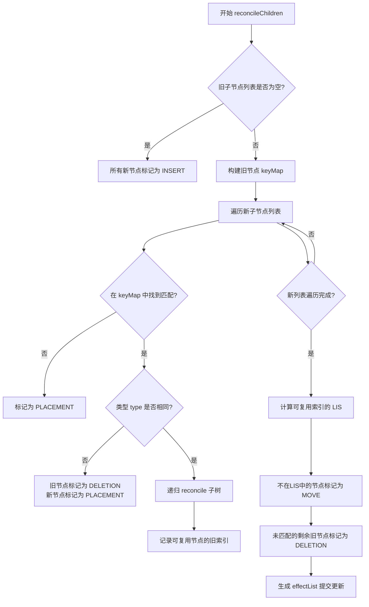
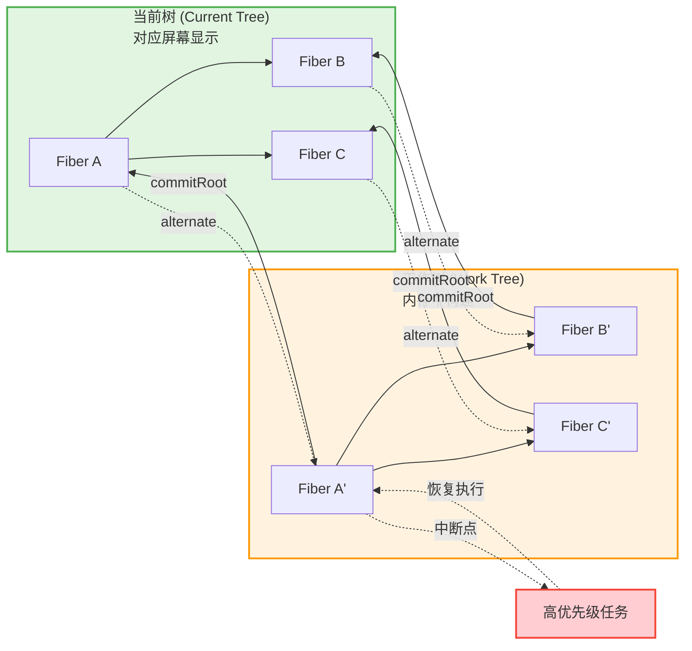
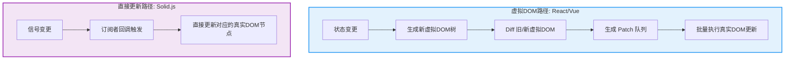

# 虚拟DOM理论：Diff算法的形式化

## 引言

在现代前端框架的演进史中，虚拟DOM（Virtual DOM）无疑是最具影响力的抽象之一。自React于2013年引入这一概念以来，它几乎成为了声明式UI编程的代名词。然而，虚拟DOM绝非简单的「用JavaScript对象模拟DOM节点」这一工程技巧——在其背后，存在着深刻的形式化理论基础：从树结构的形式化表示，到Diff算法作为最短编辑脚本（Shortest Edit Script, SES）问题的近似求解，再到React Fiber架构将 reconciliaition 重构为可中断的调度问题。

本文采用双轨并行的叙述策略：在**理论严格表述**轨道中，我们将虚拟DOM置于形式语言与算法理论的框架下，定义其数学语义，分析Diff算法的复杂度边界，并探讨树编辑距离（Tree Edit Distance）与Reconciliation之间的理论联系；在**工程实践映射**轨道中，我们将深入React的`createElement`实现、JSX编译机制、`key`属性的Diff作用机制，并与Solid.js的无虚拟DOM策略进行系统性对比，最后分析虚拟DOM在内存开销上的真实成本。

---

## 理论严格表述

### 2.1 虚拟DOM作为UI状态的形式化表示

从形式化视角看，虚拟DOM可以被定义为一个**带标签的有序树（Labeled Ordered Tree）**。设有限标签集合为`Σ`，则一个虚拟DOM节点`v`可以形式化地定义为四元组：

```
v ::= (type, props, children, key)
```

其中：

- `type ∈ Σ ∪ {Text}` 表示节点类型，可以是字符串形式的HTML标签名（如`'div'`、`'span'`），也可以是函数形式的组件引用；
- `props ∈ (K → V)` 是一个从属性名到属性值的部分映射（partial map），代表节点的属性集合；
- `children ∈ List(VirtualDOM)` 是一个有序列表，表示子节点序列；
- `key ∈ String ∪ {⊥}` 是可选的标识符，用于Diff算法中的同辈节点识别。

整个UI状态`S`因此可以表示为一棵有序树`T = (N, E, label, order)`，其中`N`为节点集合，`E`为父子边集合，`label: N → Σ`为标签函数，`order`定义了同辈节点之间的全序关系。这一形式化直接对应了DOM规范中的Node Tree抽象，但将平台相关的DOM API完全剥离，仅保留结构信息。

该形式化的重要性在于：它将UI更新问题**归约（reduce）**为了树变换问题。给定旧树`T₁`和新树`T₂`，渲染引擎的任务是找到一个操作序列`O = [o₁, o₂, ..., oₙ]`，使得应用该序列后`T₁`转变为`T₂`，即：

```
apply(T₁, O) = T₂
```

而最优的更新策略，则是使`|O|`（操作序列长度）最小化的解。

### 2.2 Diff算法与最短编辑脚本问题

Diff算法的核心是一个经典的计算机科学问题：**最短编辑脚本（Shortest Edit Script, SES）**。在字符串领域，SES问题可以通过动态规划在`O(n·m)`时间内求解（其中`n`和`m`分别为两字符串长度）。Myers于1986年提出的`O(ND)`贪心算法（`D`为编辑距离）是`diff`工具的理论基础。

然而，当问题从线性序列扩展到树结构时，复杂度急剧上升。树的编辑距离（Tree Edit Distance, TED）问题在最一般的形式下是**NP-难**的。Zhang和Shasha于1989年证明了：对于两棵无序树，计算编辑距离是MAX SNP-难的；即使对于有序树，经典动态规划算法的时间复杂度也为`O(n²·m²)`，其中`n`和`m`为树的节点数。

React及其同类框架采用的Diff算法，本质上是一种**受约束的SES近似算法**。该算法通过引入三条核心启发式规则，将复杂度从多项式级降阶到线性级`O(n)`：

**启发式一：同级比较（Level-wise Comparison）**

算法假定不同层级的节点不会相互移动。若节点`A`在`T₁`中位于第`l`层，而在`T₂`中被移动至第`l'`层且`l ≠ l'`，则算法将其视为「第`l`层的`A`被删除，第`l'`层的新节点被插入」，而非「移动」。这一假设极大地剪枝了搜索空间，但牺牲了处理跨层级移动的精确性。

**启发式二：`key`属性的稳定标识（Stable Identity via `key`）**

对于同辈节点列表，算法使用`key`属性建立节点间的恒等映射。设旧列表`L₁ = [a₁, a₂, ..., aₙ]`和新列表`L₂ = [b₁, b₂, ..., bₘ]`，若`aᵢ.key = bⱼ.key`，则视`aᵢ`与`bⱼ`为同一逻辑实体的持续存在，仅需计算二者子树的Diff。这一机制将列表Diff问题转化为**最长递增子序列（LIS）**问题，使得同辈节点的重排检测可在`O(n·log n)`时间内完成。

**启发式三：深度优先遍历（Depth-First Traversal）**

算法采用先序深度优先遍历同步遍历两棵树。在任一时刻，仅比较当前访问的两个节点，不回溯已处理子树。这使得空间复杂度可以被约束在`O(h)`（`h`为树高），且整个算法无需递归栈外的额外数据结构。

综合以上三条启发式，React的Diff算法时间复杂度为`O(n)`，其中`n`为两棵树的节点总数。这一线性复杂度是现代前端框架能够处理大规模组件树的核心保障。

### 2.3 树编辑距离与Reconciliation的形式化

Reconciliation（调和）是React中对Diff算法的官方命名。从形式化角度，我们可以将其定义为以下函数：

```
reconcile: VirtualDOM × VirtualDOM → List<Patch>
```

其中`Patch`为DOM操作的原语集合，通常包括：

- `CREATE(node, parent, index)` — 在指定位置创建新节点
- `REMOVE(node)` — 删除节点
- `REPLACE(oldNode, newNode)` — 替换节点
- `UPDATE_PROPS(node, diff)` — 更新节点属性
- `REORDER(childrenOps)` — 重排子节点序列

在理想情况下，若存在一棵「真实的最小操作树」，Reconciliation的输出应当逼近该最优解。然而，由于前述启发式的约束，Reconciliation仅保证**soundness **（所有生成的Patch应用后能得到正确的`T₂`），而不保证** completeness **（存在比输出更短的操作序列）或** optimality**（输出为最短的编辑脚本）。

形式化地看，设`OPT(T₁, T₂)`为最优编辑脚本的长度，`RECONCILE(T₁, T₂)`为React Reconciliation生成的脚本长度，则存在最坏情况使得：

```
RECONCILE(T₁, T₂) / OPT(T₁, T₂) ∈ Ω(n)
```

即近似比可以随节点数线性退化。工程实践中，这种退化仅在极端的跨层级重排场景中出现，而UI更新通常具有**时间局部性（temporal locality）**——相邻两次渲染之间的树结构差异较小，因此启发式算法的近似效果在实际工作负载中表现优异。

### 2.4 Fiber架构的调度理论

React 16引入的Fiber架构，将Reconciliation从「不可中断的递归计算」重构为「可中断、可恢复的迭代计算」。从调度理论视角，这是一个从**协作式多任务（cooperative multitasking）**到**优先级驱动的抢占式调度（priority-based preemptive scheduling）**的范式转换。

在Fiber模型中，每个组件对应一个Fiber节点，这些节点构成一个**循环链表树（circular linked list tree）**。每个Fiber节点维护了指向其子节点（`child`）、兄弟节点（`sibling`）和父节点（`return`）的指针，以及一个`alternate`指针指向其在当前屏幕上的对应Fiber（即「当前树」与「工作树」的双缓冲结构）。

形式化地，Fiber的调度可以建模为一个**时间切片（time slicing）**问题。设浏览器每帧的预算时间为`B`（通常取`16.67ms`以维持60fps），React将Reconciliation工作拆分为若干工作单元（work unit）`w₁, w₂, ..., wₖ`，每个单元具有估计执行时间`c(wᵢ)`和优先级`p(wᵢ)`。调度器的目标是：

```
最小化：用户可感知的交互延迟
约束条件：每帧累计执行时间 ≤ B
```

React使用`requestIdleCallback`（后改为基于`MessageChannel`的自定义实现）在浏览器空闲时段执行工作单元。当高优先级任务（如用户输入）到达时，当前进行中的Reconciliation可以被**中断（interrupt）**，其执行状态被保存在Fiber节点的局部变量中；待高优先级任务完成后，调度器从断点**恢复（resume）**执行。

这一机制的形式化保证依赖于两个关键不变式：

1. **一致性不变式（Consistency Invariant）**：在任意时刻，「当前树」对应于已提交的完整渲染结果，而「工作树」上的修改对用户不可见；
2. **双树不变式（Double Buffering Invariant）**：`alternate`指针始终指向另一棵树的对应节点，确保状态切换是原子的。

Fiber架构还引入了**优先级Lanes模型**（React 18中进一步完善），将更新优先级编码为位掩码，支持批量处理（batching）、并发特性（Concurrent Features）和过渡更新（Transition Updates）。Lanes模型本质上是一个基于位运算的优先级队列，允许`O(1)`的优先级合并与比较操作。

---

## 工程实践映射

### 3.1 React的`createElement`与Virtual DOM对象

在React的工程实现中，虚拟DOM节点是通过`React.createElement(type, props, ...children)`函数构建的。以如下JSX为例：

```jsx
const element = (
  <div className="container">
    <h1>Hello</h1>
    <p>World</p>
  </div>
);
```

经Babel或TypeScript编译后，上述JSX被转译为对`createElement`的嵌套调用：

```js
const element = React.createElement(
  'div',
  { className: 'container' },
  React.createElement('h1', null, 'Hello'),
  React.createElement('p', null, 'World')
);
```

`createElement`返回的对象结构如下（简化版）：

```js
{
  $$typeof: Symbol.for('react.element'),
  type: 'div',
  key: null,
  ref: null,
  props: {
    className: 'container',
    children: [
      { $$typeof: Symbol.for('react.element'), type: 'h1', props: { children: 'Hello' }, ... },
      { $$typeof: Symbol.for('react.element'), type: 'p', props: { children: 'World' }, ... }
    ]
  }
}
```

值得注意的是，`$$typeof`属性的引入是为了防止XSS攻击：由于JSON不能序列化`Symbol`，服务端返回的恶意JSON无法伪造合法的React元素。`type`字段可以是字符串（宿主组件）或函数/类（用户组件）。当`type`为函数时，React会在Reconciliation阶段调用该函数，将其返回值递归地展开为虚拟DOM树。

React 17+引入了**新的JSX转换（New JSX Transform）**，不再要求显式导入`React`。编译器会自动注入`_jsx`运行时调用：

```js
import { jsx as _jsx } from 'react/jsx-runtime';
const element = _jsx('div', { className: 'container', children: [...] });
```

`_jsx`相比`createElement`在性能上有细微优化：它避免了`arguments`对象的展开，且`children`被直接放入`props`，减少了运行时开销。

### 3.2 JSX编译为`React.createElement`的完整机制

理解JSX的编译管道，对于把握虚拟DOM的生成时机至关重要。以Babel为例，其`@babel/plugin-transform-react-jsx`插件执行以下转换步骤：

1. **语法解析**：Babel解析器（基于`@babel/parser`）将JSX语法识别为`JSXElement`、`JSXOpeningElement`、`JSXAttribute`、`JSXText`等AST节点；
2. **属性归一化**：JSX的属性表达式（如`className={active ? 'on' : 'off'}`）被编译为对象属性；
3. **子节点扁平化**：嵌套的JSX子节点被收集为数组参数；
4. **运行时调用生成**：根据配置（classic vs automatic runtime），生成`React.createElement`或`_jsx`调用。

对于条件渲染：

```jsx
<div>
  {condition && <span>Visible</span>}
</div>
```

编译结果为：

```js
React.createElement('div', null, condition && React.createElement('span', null, 'Visible'));
```

当`condition`为`false`时，`children`数组中对应位置为`false`。React的Reconciliation逻辑会跳过`boolean`、`null`和`undefined`类型的子节点，因此不会向DOM插入任何内容。这一「 falsy值过滤 」是JSX语义的一部分，也是初学者常见的困惑点。

### 3.3 `key`属性在Diff中的作用机制

`key`是React Diff算法中最关键却最易被误用的API。其作用机制可以从工程实现角度精确描述：

在Reconciliation的同辈节点比较阶段，React维护两个指针`oldIndex`和`newIndex`分别遍历旧子节点数组和新子节点数组。当两个节点的`type`和`key`均相同时，React认为它们是同一节点，执行「复用（reuse）」：保留底层DOM节点，仅更新变化的属性和递归处理子节点。

具体算法分为两个阶段：

**第一阶段：线性遍历与键映射构建**

React首先线性扫描旧子节点列表，构建一个以`key`为键、以节点为值的哈希映射`keyMap`。对于无`key`的节点，使用其在列表中的索引作为隐式键。若发现`key`重复，则在开发模式下发出警告。

**第二阶段：最长递增子序列（LIS）检测**

React遍历新子节点列表，对于每个新节点：

- 若在`keyMap`中找到匹配的旧节点，则标记为「可复用」；
- 若未找到，则标记为「需插入」；
- 遍历结束后，未被访问的旧节点标记为「需删除」。

对于标记为「可复用」的节点序列，React计算其索引序列的**最长递增子序列（LIS）**。位于LIS中的节点无需移动，仅更新即可；不在LIS中的节点则需要执行DOM移动操作。由于LIS的计算采用 patience sorting 算法，时间复杂度为`O(n·log n)`。

以下是一个典型反模式及其修复：

```jsx
// 反模式：使用数组索引作为 key
{items.map((item, index) => (
  <li key={index}>{item.text}</li>
))}

// 正确做法：使用稳定唯一标识
{items.map(item => (
  <li key={item.id}>{item.text}</li>
))}
```

当使用索引作为`key`时，若列表头部插入新元素，所有后续元素的索引均增加1，导致React认为所有旧节点均不可复用，触发`n`次DOM插入操作，时间复杂度退化为`O(n²)`。

### 3.4 React DevTools的组件树可视化

React DevTools通过注入全局hook（`__REACT_DEVTOOLS_GLOBAL_HOOK__`）来拦截React内部的Fiber树构建过程。其核心原理是：

1. **Fiber遍历**：DevTools代理了React的`createFiber`和`commitRoot`函数，在Fiber树构建和提交阶段获得完整的树结构快照；
2. **组件元数据提取**：对于每个Fiber节点，DevTools提取`type`（组件名称）、`memoizedState`（Hooks状态）、`memoizedProps`（属性）和`pendingProps`（待更新属性）；
3. **性能分析**：通过`Profiler` API记录每个组件的渲染耗时，以火焰图（Flamegraph）形式展示；
4. **时间旅行调试**：结合Redux DevTools或自定义实现，可以记录每次渲染的虚拟DOM树差异。

DevTools中的「Components」面板展示的是Fiber树的可视化表示，而非原始的虚拟DOM树。因为函数组件在渲染后其虚拟DOM对象可能被垃圾回收，而Fiber节点则持久存在于内存中（通过`alternate`双树机制）。因此，Fiber树才是React运行时的「真实」结构表示。

### 3.5 对比：Solid.js的无Virtual DOM直接DOM更新

Solid.js采用了与React截然不同的渲染策略：**编译时优化 + 运行时细粒度更新**，完全摒弃虚拟DOM。其核心理念是：既然最终目标总是操作真实DOM，为何不直接在编译阶段生成精确的DOM更新指令？

在Solid.js中，JSX被编译为一系列创建DOM节点的原生API调用，以及将动态部分包装为「反应式表达式」的指令。例如：

```jsx
<div class={active() ? 'on' : 'off'}>
  {count()}
</div>
```

编译结果类似于：

```js
const _el$ = document.createElement('div');
// 创建时一次性执行
createEffect(() => {
  _el$.className = active() ? 'on' : 'off';
});
createEffect(() => {
  _el$.textContent = count();
});
```

这里`createEffect`建立了信号（Signal）与DOM更新之间的直接订阅关系。当`active`或`count`信号变化时，仅执行对应的 effect 回调，更新具体的DOM属性或文本节点，无需任何Diff过程。

这种策略的优势在于：

- **零Diff开销**：更新路径完全绕过虚拟DOM的创建与比较；
- **内存占用低**：无需维护两棵虚拟DOM树及其差异队列；
- **确定性性能**：更新性能与组件树规模无关，仅与变化的信号数量相关。

然而，无虚拟DOM策略也有其代价：

- **组件抽象成本**：由于更新粒度细化到表达式级别，组件边界主要起代码组织作用，而非渲染隔离单元；
- **服务端渲染复杂性**：缺少虚拟DOM作为序列化中间层，SSR hydration 逻辑更为复杂；
- **生态系统惯性**：基于虚拟DOM的调试工具、测试库（如React Testing Library的`render`抽象）无法直接复用。

### 3.6 虚拟DOM的内存开销分析

虚拟DOM的内存成本常被低估。在React应用中，内存占用主要来自以下方面：

1. **虚拟DOM对象本身**：每个React元素是一个JavaScript对象，包含`type`、`props`、`key`、`ref`等字段。一个中等复杂度的页面可能包含数千到数万个虚拟DOM节点，每个对象在V8引擎中占用约数十至数百字节；
2. **Fiber节点**：React 16+为每个组件维护一个Fiber节点，其结构比虚拟DOM节点更复杂，包含`tag`、`lanes`、`child`、`sibling`、`return`、`alternate`等约30个字段；
3. **双树缓冲**：由于「当前树」与「工作树」同时存在，内存中的节点数量大致翻倍；
4. **更新队列**：每次状态变更产生的更新对象（Update）被加入队列，直到提交阶段才被清理。

以一个包含5000个节点的组件树为例：

- 虚拟DOM节点：约 5000 × 80B ≈ 400KB
- Fiber节点（双树）：约 10000 × 200B ≈ 2MB
- 属性对象及字符串：约 1-3MB
- 总计：约 4-6MB 的纯JS堆内存

虽然这一数字在现代设备上看似微不足道，但在低内存的移动设备或长期运行的单页应用（SPA）中，频繁的树替换可能导致显著的垃圾回收压力。React 18的「自动批处理（Automatic Batching）」和部分水合（Selective Hydration）在一定程度上缓解了这一问题，但虚拟DOM的结构性开销 inherent 于该架构本身。

---

## Mermaid 图表

### 图表1：React Diff算法的同级比较与Key复用机制



### 图表2：Fiber架构的双树调度与中断恢复模型



### 图表3：虚拟DOM与直接DOM更新的架构对比



---

## 理论要点总结

1. **虚拟DOM的形式化本质**：虚拟DOM是UI状态的一棵带标签有序树，将UI更新问题归约为树变换问题。其数学结构为`T = (N, E, label, order)`，与DOM规范中的Node Tree同构但平台无关。

2. **Diff算法的复杂度边界**：React的Diff算法通过三条启发式（同级比较、`key`标识、深度优先）将树编辑距离的`O(n²·m²)`动态规划复杂度降阶至`O(n)`。这一降阶以牺牲跨层级移动的最优性为代价，但在具有时间局部性的真实UI工作负载中表现优异。

3. **Reconciliation的语义保证**：Reconciliation保证 soundness（正确性），但不保证 completeness（完备性）或 optimality（最优性）。在最坏情况下，其输出脚本长度与最优解的比值可随节点数线性退化。

4. **Fiber架构的调度本质**：Fiber将Reconciliation重构为可中断、可恢复的迭代计算，其调度模型可形式化为带优先级约束的时间切片问题。双树缓冲（`alternate`指针）确保了中断-恢复机制的一致性不变式。

5. **无虚拟DOM策略的权衡**：Solid.js等框架通过编译时生成细粒度DOM更新指令，完全规避了虚拟DOM的创建与Diff开销，但牺牲了虚拟DOM作为跨平台抽象中间层所带来的灵活性和生态系统兼容性。

6. **内存开销的结构性来源**：虚拟DOM架构的内存成本不仅来自虚拟DOM对象本身，更来自Fiber双树、更新队列和属性对象的累积。在大型SPA和低内存设备中，这一开销不容忽视。

---

## 参考资源

1. **React Official Documentation — Reconciliation**. React.dev. <https://react.dev/learn/thinking-in-react>. React官方文档对Reconciliation算法的启发式规则进行了权威描述，是理解Diff机制的首要参考文献。

2. **React Fiber Architecture**. Andrew Clark (React Core Team). <https://github.com/acdlite/react-fiber-architecture>. 该文档由React核心团队成员撰写，详细阐述了Fiber节点的数据结构、遍历算法和调度优先级模型的设计 rationale。

3. **Odersky, M., Spoon, L., & Venners, B. (2016). *Programming in Scala* (3rd ed.)**. Artima Inc. 虽然本书主要讨论Scala语言，但其关于不可变数据结构、持久化集合和函数式组件设计的论述深刻影响了React核心团队对组件纯函数语义的设计决策。

4. **Myers, E. W. (1986). "An O(ND) Difference Algorithm and Its Variations". *Algorithmica*, 1(2), 251-266.** 该论文提出了经典的`O(ND)`贪心Diff算法，是字符串级最短编辑脚本问题的奠基性工作，也是现代代码Diff工具和虚拟DOM列表Diff算法的理论基础。

5. **Zhang, K., & Shasha, D. (1989). "Simple Fast Algorithms for the Editing Distance Between Trees and Related Problems". *SIAM Journal on Computing*, 18(6), 1245-1262.** 该论文给出了有序树编辑距离的动态规划算法，其`O(n²·m²)`复杂度证明了虚拟DOM框架采用启发式近似的必要性。
