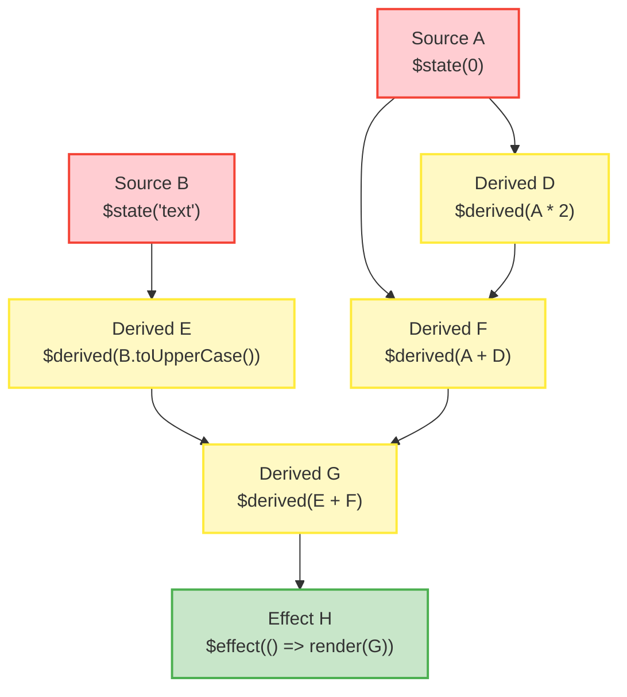
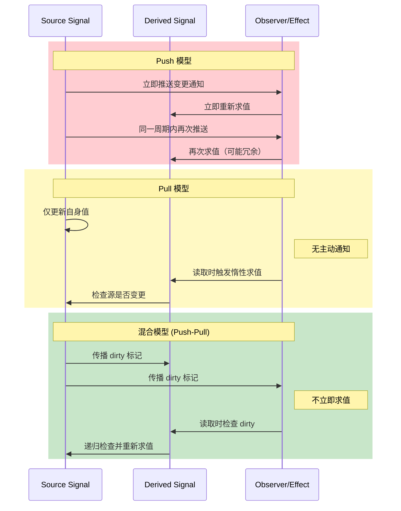
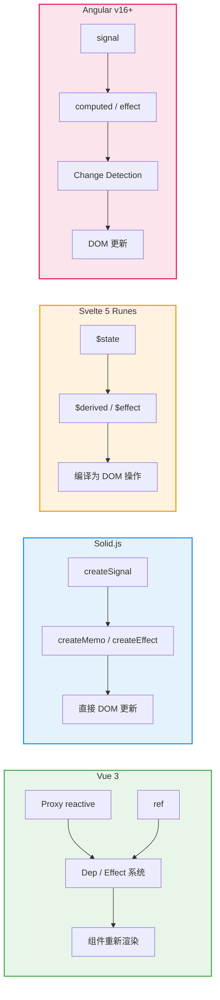

# 响应式与信号：从Push到Pull

## 引言

响应式编程（Reactive Programming）是现代前端框架的基石。从Vue 2的`Object.defineProperty`到Vue 3的`Proxy`，从React的`useState`到Solid.js的`createSignal`，从MobX的透明响应式到Angular v16+的原生Signals——前端社区在过去十年间见证了响应式模型的多次范式跃迁。然而，这些看似各异的API背后，共享着一套统一的形式化基础：**信号（Signal）**作为值与依赖关系的代数抽象。

本文的双轨并行策略如下：在**理论严格表述**轨道中，我们将给出信号的形式化定义，建立细粒度响应式的依赖图论模型，严格比较Push模型、Pull模型与混合模型的语义差异，分析自动追踪（Auto-tracking）算法的正确性条件，并探讨信号在函数式编程代数结构（Functor、Applicative、Monad）中的位置；在**工程实践映射**轨道中，我们将深入Vue 3的`reactive`/`ref`/`computed`、Svelte 5的Runes（`$state`/`$derived`/`$effect`）、Solid.js的`createSignal`/`createMemo`、Preact Signals的跨框架实现，以及Angular Signals的底层机制，最后结合`js-framework-benchmark`数据对不同策略进行性能基准对比。

---

## 理论严格表述

### 2.1 信号（Signal）的形式化定义

从最抽象的角度，一个**信号**可以被定义为一个三元组：

```
Signal = (Value, DependencyGraph, Subscribers)
```

其中：

- `Value` 是信号当前承载的数据，可以是任意类型的值；
- `DependencyGraph` 是一个有向无环图（DAG），其节点为信号，边表示「计算依赖」关系（若信号`B`的计算依赖于信号`A`，则存在边`A → B`）；
- `Subscribers` 是一个观察者集合，当`Value`发生变化时，集合中的所有成员将被通知。

形式化地，设信号全集为`S`，则依赖关系可以表示为二元关系`D ⊆ S × S`，且`D`必须满足**无环性（acyclicity）**：不存在信号序列`s₁, s₂, ..., sₙ`使得`s₁ D s₂ D ... D sₙ D s₁`。这一约束保证了依赖图是一个严格的偏序，从而排除了循环依赖导致的死锁或无限更新链。

信号的**状态转换**可以建模为一个标记转移系统（Labeled Transition System, LTS）：

```
(s, v) --write(v')--> (s, v')
(s, v) --read--> (s, v) 并触发依赖追踪
```

当对信号`s`执行`write(v')`操作时，其状态从`v`迁移至`v'`，同时向所有订阅者广播变更事件。当对信号执行`read`操作时，若在响应式上下文（如effect或computed内部）中，则建立当前计算单元与`s`之间的依赖边。

### 2.2 细粒度响应式的图论模型

细粒度响应式系统的核心数据结构是一张**依赖有向无环图（Dependency DAG）**。该图中的节点分为两类：

- **源节点（Source Nodes）**：代表具有独立状态的可变信号，如图中的叶节点，没有入边；
- **派生节点（Derived Nodes）**：代表通过纯函数从其他信号计算得出的派生值，如`computed`、`derived`或`memo`。

边的方向表示数据流向：若节点`B`的计算逻辑读取了节点`A`的值，则存在边`A → B`。当`A`的值变更时，所有可达的派生节点理论上都需要重新求值。

图论模型的关键操作包括：

**依赖收集（Dependency Collection）**：在派生节点的求值过程中，系统记录所有被读取的源节点和派生节点，构建该节点的**依赖集（Dependency Set）**。形式化地，设派生节点`d`的求值函数为`f_d`，则其依赖集为：

```
deps(d) = { s ∈ S | f_d 的执行路径中包含 read(s) }
```

**传播（Propagation）**：当源节点`s`被写入新值时，系统沿着出边遍历依赖图，确定所有受影响的派生节点。传播的顺序必须遵循图的拓扑序，以确保在计算派生节点时，其所有依赖节点均已处于最新状态。

**垃圾回收（Garbage Collection）**：当某个派生节点不再被任何活跃作用域引用时，其对应的图节点及依赖边应当被回收，以避免内存泄漏。在现代框架中，这一机制通常通过响应式作用域（Reactive Scope）或拥有者（Owner）树来实现。

### 2.3 Push模型 vs Pull模型 vs 混合模型

响应式系统根据「变更传播时机」和「值获取方式」的差异，可以分为三种基本范式：

**Push模型（推模型）**

在Push模型中，当源信号变更时，系统**主动推送**变更通知至所有依赖者。订阅者收到通知后立即执行回调或重新求值。典型代表：React的`useState`（配合重新渲染推送）、RxJS的`Observable`、Node.js的`EventEmitter`。

形式化特征：

- 变更传播是**急切的（eager）**；
- 订阅者可能接收到**冗余通知**（同一事务中的多次变更触发多次回调）；
- 存在**glitch风险**（中间状态的不一致性暴露给观察者）。

**Pull模型（拉模型）**

在Pull模型中，派生信号不会主动监听源信号的变更。只有当派生信号被**显式读取**时，它才检查其依赖项是否已变更，并惰性（lazily）重新计算。典型代表：MobX的`computed`（在`autorun`外部）、Svelte 4及之前的响应式系统、 spreadsheet 的单元格求值。

形式化特征：

- 求值是**惰性的（lazy）**；
- 未被读取的派生节点不会执行计算，节省CPU资源；
- 但读取路径上可能触发**级联求值（cascade re-evaluation）**，导致读取延迟。

**混合模型（Hybrid/Push-Pull）**

现代框架普遍采用混合策略：系统使用Push机制传播「脏标记（dirty flag）」，但派生节点的实际重新求值延迟到被读取时（Pull），或在微任务队列中批量执行。典型代表：Vue 3的`computed`、Solid.js的`createMemo`、Svelte 5的`$derived`。

形式化特征：

- **脏标记传播（Push phase）**：源信号变更时，仅将下游节点标记为`dirty`，不立即求值；
- **惰性求值（Pull phase）**：当`dirty`节点被读取时，递归检查依赖项并重新计算；
- **批量与去重**：同一事件循环内的多次变更被合并为单次传播周期。

三种模型的对比如下表所示：

| 维度 | Push模型 | Pull模型 | 混合模型 |
|------|---------|---------|---------|
| 传播时机 | 立即 | 惰性读取时 | 脏标记立即传播，求值可延迟 |
| CPU效率 | 低（冗余计算） | 高（按需计算） | 高（批量+按需） |
| 一致性保证 | 需额外处理glitch | 天然一致 | 天然一致 |
| 内存开销 | 高（维护订阅列表） | 低 | 中等 |
| 典型框架 | RxJS, React | MobX（外部） | Vue 3, Solid.js, Svelte 5 |

### 2.4 自动追踪（Auto-tracking）的算法

自动追踪是现代响应式系统的标志性特征：开发者无需显式声明依赖关系，系统在运行期自动捕获信号读取行为。其实现依赖于**执行上下文栈（Execution Context Stack）**。

算法的核心数据结构是一个全局栈`contextStack`，以及每个信号维护的订阅者集合`subscribers`。算法伪代码如下：

```
function read(signal):
    if contextStack 不为空:
        currentContext = contextStack.peek()
        if signal 不在 currentContext.deps 中:
            currentContext.deps.add(signal)
            signal.subscribers.add(currentContext)
    return signal.value

function write(signal, newValue):
    if signal.value === newValue:
        return
    signal.value = newValue
    for subscriber in signal.subscribers:
        subscriber.markDirty()

function computed(fn):
    context = new ComputationContext(fn)
    contextStack.push(context)
    context.value = fn()      // 执行期间自动收集依赖
    contextStack.pop()
    return {
        get value() {
            if context.dirty:
                contextStack.push(context)
                context.value = fn()
                contextStack.pop()
            return context.value
        }
    }
```

该算法的正确性依赖于以下关键假设：

- **求值函数的纯粹性（Purity Assumption）**：`fn`在相同依赖状态下应当返回相同结果；
- **读取可观测性（Read Observability）**：所有对信号的访问都必须经过`read`钩子；
- **上下文隔离（Context Isolation）**：嵌套的`computed`/`effect`必须正确维护栈结构。

### 2.5 Glitch-free的保证条件

**Glitch**是响应式系统中的一种经典错误模式：当多个相关信号在同一事务中变更时，观察者可能观察到中间的不一致状态。例如，设`a = 1`，`b = a + 1`，`c = a + b`，若将`a`更新为`2`，在Push模型中，`b`和`c`可能按顺序更新，导致`c`在`b`更新前短暂等于`2 + 2 = 4`（而非正确的`2 + 3 = 5`）。

实现**glitch-free**的充分条件是：

1. **原子性更新（Atomic Updates）**：同一事务中的所有源信号变更必须在同一个传播周期中处理，不允许中间状态暴露；
2. **拓扑序传播（Topological Order Propagation）**：派生节点的重新求值必须遵循依赖图的拓扑序，确保在求值`c`之前，`b`已经处于最新状态；
3. **去重通知（Deduplicated Notifications）**：同一传播周期中，即使派生节点被多个上游变更标记为`dirty`，也仅触发一次重新求值。

在混合模型中，glitch-free通常自然成立：因为派生节点在被读取时才求值，而读取发生时所有上游的脏标记传播已经完成。在Solid.js和Vue 3中，这一性质通过「**_effect阶段在依赖收集完成后执行_**」的机制得到保证。

### 2.6 信号的代数结构：Functor / Applicative / Monad

从范畴论视角审视，信号可以被视为一种**容器型计算结构（container-like computational structure）**，与函数式编程中的Functor、Applicative和Monad存在深刻类比。

**Functor**：若将`Signal<T>`视为一个容器，则`map`操作对应于`computed`：

```
map : (A → B) → Signal<A> → Signal<B>
map(f, signalA) = computed(() => f(signalA.value))
```

`map`满足Functor定律：`map(id) = id`且`map(f ∘ g) = map(f) ∘ map(g)`。在Vue 3中，`computed(() => a.value + 1)`正是`map(x => x + 1, a)`的工程表达。

**Applicative**：当需要组合多个信号时，`liftA2`（或`ap`）提供了并行的组合能力：

```
liftA2 : (A → B → C) → Signal<A> → Signal<B> → Signal<C>
liftA2(f, sa, sb) = computed(() => f(sa.value, sb.value))
```

这对应于框架中多依赖`computed`的常用模式。

**Monad**：信号的`flatMap`（或`bind`）操作对应于「信号的信号」的展平：

```
flatMap : Signal<A> → (A → Signal<B>) → Signal<B>
```

虽然大多数前端框架不直接暴露`flatMap`操作符，但动态切换依赖的行为本质上属于Monad结构。例如，Vue的`computed(() => condition.value ? a.value : b.value)`可以视为在Applicative层面上对条件选择的建模。

需要强调的是，信号的代数结构与传统Promise或Array的Monad实现存在关键差异：信号是**时变值（time-varying values）**，其`bind`操作涉及随时间变化的依赖图重构，而非静态的数据变换。

### 2.7 Signals vs Observables vs Proxies

这三种抽象常被混用，但它们在语义上存在本质区别：

| 特性 | Signal | Observable | Proxy |
|------|--------|-----------|-------|
| **核心抽象** | 时变值（单元） | 事件流（序列） | 对象访问拦截 |
| **数据模型** | 当前值 + 依赖图 | 时间线上的事件序列 | 属性访问的钩子 |
| **拉/推** | 混合（通常Push标记+Pull求值） | 纯Push | 透明拦截 |
| **组合操作** | 有限（computed/memo） | 丰富（map/filter/merge等） | 无原生组合 |
| **glitch-free** | 天然支持 | 需额外操作符（如`combineLatest`+`distinctUntilChanged`） | 非其设计目标 |
| **典型实现** | Solid.js, Vue ref, Angular Signals | RxJS, Most.js | Vue 3 reactive, MobX |

**Observable**（如RxJS）基于事件流和观察者模式，擅长处理异步数据流和复杂的事件组合，但在管理同步的UI状态时，其丰富的操作符库反而成为认知负担。**Proxy**（如Vue 3的`reactive`、MobX）通过拦截对象属性访问实现透明响应式，对开发者最友好，但Proxy对象的性能开销和调试复杂性（隐藏getter/setter调用栈）不可忽视。**Signal**则在「可预测性」与「性能」之间取得了最佳平衡：其显式的`.value`读写语义使得数据流清晰可追踪，而底层实现可以高度优化。

---

## 工程实践映射

### 3.1 Vue 3的`reactive`/`ref`/`computed`实现

Vue 3的响应式系统是其最重要的架构升级之一，核心由`@vue/reactivity`包实现。该系统同时提供了两种信号抽象：**引用（Ref）**和**响应式对象（Reactive Object）**。

**`ref<T>`**：

```ts
import { ref, computed, watchEffect } from 'vue';

const count = ref(0);           // RefImpl { _value: 0, dep: Dep }
const doubled = computed(() => count.value * 2);

watchEffect(() => {
  console.log(doubled.value);   // 自动追踪依赖
});

count.value = 1;                // 触发 effect 重新执行
```

`ref`内部通过`RefImpl`类实现，其`.value`属性的getter/setter中集成了依赖追踪和触发逻辑。`Dep`类维护了一组订阅者（effects/computeds），使用`Set`数据结构保证去重。

**`reactive<T>`**：

```ts
const state = reactive({ count: 0, nested: { x: 1 } });
state.count++;                  // Proxy 拦截 set 操作
```

`reactive`基于ES2015 `Proxy`实现。`Proxy`的`get`陷阱在读取属性时调用`track(target, key)`建立依赖关系；`set`陷阱在写入时调用`trigger(target, key)`通知订阅者。Vue 3使用`WeakMap<Target, Map<Key, Dep>>`的全局结构存储依赖关系，确保目标对象被垃圾回收时，关联的依赖结构也能被释放。

**`computed<T>`**：

Vue 3的`computed`是一个带有缓存的派生信号。其内部维护`dirty`标志位：当依赖变更时，仅将`computed`标记为`dirty`而不立即重新求值；当`computed.value`被读取时，若`dirty`为真，则执行求值函数并更新缓存。这一惰性求值策略避免了不必要的计算开销。

Vue 3的响应式系统还引入了**effect 作用域（Effect Scope）**：

```ts
const scope = effectScope();
scope.run(() => {
  const c = ref(0);
  watchEffect(() => console.log(c.value));
});
scope.stop(); // 批量停止作用域内所有 effect
```

`effectScope`解决了Vue 2中缺乏「批量销毁响应式副作用」机制的问题，在组合式函数（Composables）的清理场景中尤为重要。

### 3.2 Svelte 5的`$state`/`$derived`/`$effect`信号

Svelte 5引入了代号为「Runes」的全新响应式语法，从根本上改变了Svelte的编译策略。与Svelte 3/4基于编译时静态分析的`$:`标签不同，Runes采用显式的运行时信号API。

```svelte
<script>
  let count = $state(0);              // 创建源信号
  let doubled = $derived(count * 2);  // 创建派生信号

  $effect(() => {                     // 创建副作用
    console.log(count);
  });
</script>
```

**编译时机制**：Svelte编译器将`$state(0)`转换为对内部`state()`函数的调用，并生成一个`Source`对象；将`$derived(count * 2)`转换为`derived(() => count * 2)`，生成一个`Derived`对象。`$effect`则转换为`effect()`调用，其回调函数在依赖变更时执行。

**与Svelte 3/4的区别**：Svelte 3/4通过编译时分析确定`$:`语句的依赖关系，这种策略在简单场景中效率极高，但无法处理动态依赖（如条件分支中的依赖变化）和跨文件响应式。Svelte 5的Runes采用运行时依赖追踪，与Solid.js和Vue的策略趋同，但保留了Svelte「无虚拟DOM、编译为直接DOM操作」的核心优势。

**内存模型**：Svelte 5的信号实现非常轻量。`Source`对象仅包含当前值和一个`version`字段（用于脏检查），订阅关系通过双向链表维护而非`Set`，在大量细粒度信号场景下内存效率极高。

### 3.3 Solid.js的`createSignal`/`createMemo`

Solid.js将信号作为其唯一的响应式原语，设计极为精简：

```jsx
import { createSignal, createMemo, createEffect } from 'solid-js';

const [count, setCount] = createSignal(0);          // 返回 [getter, setter]
const doubled = createMemo(() => count() * 2);      // 缓存派生值

createEffect(() => {
  console.log(doubled());                           // 自动追踪
});

setCount(1);                                         // 触发更新
```

**`createSignal`**返回一个元组`[getter, setter]`，而非包装对象。这种设计避免了`.value`属性的性能开销（属性访问比函数调用在JS引擎中通常更慢...实际上函数调用有时可被内联，但Solid团队通过benchmark选择了函数形式）。

**`createMemo`**是Solid的缓存派生值机制，与Vue的`computed`语义等价。但Solid的实现有一个独特之处：**依赖图是「拥有者树（Owner Tree）」的一部分**。在Solid中，组件函数仅执行一次（「只运行一次」范式），其内部的`createSignal`、`createMemo`、`createEffect`在首次执行时创建，之后永远不再进入组件函数体。更新完全通过信号订阅机制驱动。

**细粒度更新的极致**：Solid的编译器将JSX模板中的动态部分标记为独立的「插入点（insertion points）」，每个插入点对应一个`createEffect`。例如：

```jsx
<div class={active() ? 'on' : 'off'}>
  {count()}
</div>
```

编译为近似：

```js
const el = document.createElement('div');
insert(el, createEffect(() => el.className = active() ? 'on' : 'off'));
insert(el, createEffect(() => el.textContent = count()));
```

这意味着`active`变化时，仅执行`className`赋值；`count`变化时，仅执行`textContent`赋值。不存在组件级别的重新渲染，也不存在虚拟DOM的比较。

### 3.4 Preact Signals的跨框架信号

Preact Signals是一个框架无关的信号实现，其核心目标是：**让信号可以在React、Preact乃至原生JavaScript中通用**。这一设计打破了「响应式模型与框架绑定」的传统格局。

```tsx
import { signal, computed, effect } from '@preact/signals-core';
import { useSignal, useComputed } from '@preact/signals-react';

// 核心信号（框架无关）
const count = signal(0);
const doubled = computed(() => count.value * 2);

// 在React中使用
defunction Counter() {
  const countSig = useSignal(0);
  return <button onClick={() => countSig.value++}>{countSig.value}</button>;
}
```

Preact Signals的技术亮点在于其与React的集成方式：在React组件中使用`useSignal`时，信号变更通过微任务触发React的`setState`，从而驱动React的重新渲染。虽然这看起来「违背了信号 bypass 虚拟DOM的初衷」，但它提供了一条渐进式迁移路径——开发者可以在React项目中逐步引入信号，替代`useState`/`useReducer`的状态管理。

从架构上看，Preact Signals分为三层：

1. **`@preact/signals-core`**：纯粹的信号实现，无DOM依赖；
2. **`@preact/signals`**：与Preact框架的深度集成，绕过虚拟DOM直接更新；
3. **`@preact/signals-react`**：与React的适配层，通过Hooks桥接。

### 3.5 Angular的Signals（v16+）

Angular在v16中引入了原生的Signals API，标志着该框架从基于Zone.js的「脏检查」模型向细粒度响应式的战略转型。

```ts
import { signal, computed, effect } from '@angular/core';

const count = signal(0);
const doubled = computed(() => count() * 2);

effect(() => {
  console.log('Count changed:', count());
});

count.set(1);       // 或 count.update(c => c + 1);
```

Angular Signals的设计深受Solid.js影响：`signal`返回getter函数，`computed`支持惰性求值，`effect`用于副作用。但与Solid不同，Angular保留了其「变更检测（Change Detection）」基础设施：在Signals与Angular模板集成时，信号变更仍然会触发组件的变更检测周期，尽管这一周期由于Signals的精确标记而大大缩小。

Angular Signals的独特贡献在于**与RxJS的互操作**：

```ts
import { toObservable, toSignal } from '@angular/core/rxjs-interop';

const count$ = toObservable(count);     // Signal → Observable
const data = toSignal(http.get('/api')); // Observable → Signal
```

这一互操作层为Angular生态系统中大量基于RxJS的现有代码提供了平滑的迁移路径。

### 3.6 对比：MobX的透明响应式 vs Vue的显式响应式 vs Signals的细粒度

| 维度 | MobX | Vue 3 | Signals (Solid/Preact) |
|------|------|-------|----------------------|
| **响应式方式** | 透明追踪（Proxy/Decorator） | 显式追踪（`ref`/`reactive`） | 显式函数调用（`signal()`/`count()`） |
| **依赖声明** | 自动 | 自动（运行时追踪） | 自动（运行时追踪） |
| **更新粒度** | 属性级 | 组件级 + 细粒度（`v-memo`） | 表达式级 |
| **学习曲线** | 低（JS对象即用） | 中（需理解`ref` vs `reactive`） | 中（函数式范式） |
| **调试难度** | 高（隐式依赖） | 中 | 低（依赖关系明确） |
| **TS类型支持** | 良好 | 优秀 | 优秀 |
| **包体积** | 中等 | 小（`@vue/reactivity`仅~10KB） | 极小（~3KB） |

**MobX**的透明响应式基于ES Proxy或装饰器，开发者使用普通JavaScript对象即可获得响应式能力。这种「魔法」带来了极低的学习成本，但副作用是依赖关系完全隐式化：一个`autorun`内部究竟依赖了哪些状态，只能通过运行时分析或DevTools查看，代码层面无从得知。

**Vue 3**在透明与显式之间取得了平衡：`reactive`提供了接近MobX的透明体验，而`ref`和`computed`则要求显式的`.value`访问，使数据流更为清晰。Vue的响应式系统与组件生命周期深度集成，`watch`和`watchEffect`提供了强大的副作用管理能力。

**Signals**（以Solid.js为标杆）追求极致的显式性和可预测性。没有自动解包，没有隐式依赖，每个信号都是明确的函数调用。这种设计对初学者稍显严苛，但对于大型应用的长期维护而言，其确定性和调试友好性具有显著优势。

### 3.7 性能基准：js-framework-benchmark

`js-framework-benchmark`是前端框架性能对比的权威基准测试，其测试场景包括：创建大量行、部分更新、交换行、移除行、追加行等。在最新的测试结果中，不同响应式策略的表现如下：

**创建行（Create 1,000 rows）**：

- Solid.js、Svelte、Vue 3（Vapor模式）位于第一梯队，耗时约50-70ms；
- React（Hooks）位于第二梯队，耗时约90-120ms；
- 虚拟DOM的创建开销在此场景中体现明显。

**部分更新（Update every 10th row）**：

- Solid.js、Svelte 5、Vue 3（使用`key`优化）表现最佳，耗时约5-10ms；
- Solid.js的细粒度更新在此场景中优势最大：仅更新变化的文本节点，无需任何Diff；
- React需要创建新虚拟DOM树、执行Diff、生成补丁，耗时约15-25ms。

**选择行（Select a row）**：

- Solid.js和Svelte通常能在1-3ms内完成；
- React因需要重新渲染整个列表组件（除非使用`React.memo`和稳定的回调引用），耗时可能达到10ms以上。

**内存占用**：

- Solid.js和Svelte的内存占用最低，因其不维护虚拟DOM树；
- React和Vue的内存占用中等，与组件树规模正相关；
- MobX的内存占用较高，因其为每个可观察属性维护独立的依赖结构。

需要强调的是，基准测试数据随版本迭代而变化，且真实应用中的性能瓶颈往往在于网络请求、大数据量处理或布局抖动，而非框架自身的渲染开销。选择响应式策略时，应综合考虑团队 familiarity、生态成熟度和长期维护成本。

---

## Mermaid 图表

### 图表1：细粒度响应式依赖DAG的结构与传播



### 图表2：Push / Pull / 混合模型的执行时序对比



### 图表3：主流框架响应式系统架构对比



---

## 理论要点总结

1. **信号的三元组定义**：信号形式化为`(Value, DependencyGraph, Subscribers)`，其依赖关系必须构成有向无环图（DAG），以确保更新传播的可终止性和拓扑序一致性。

2. **三种传播范式的本质差异**：Push模型以即时性换取潜在冗余和glitch风险；Pull模型以惰性求值换取CPU效率但增加读取延迟；混合模型（Push-Pull）通过脏标记传播结合惰性求值，在现代框架中实现了最佳平衡。

3. **自动追踪的上下文栈机制**：自动依赖收集依赖全局执行上下文栈，在派生信号求值期间拦截所有`read`操作。该机制的正确性依赖于求值函数纯粹性、读取可观测性和上下文隔离三大假设。

4. **Glitch-free的充分条件**：原子性更新、拓扑序传播和去重通知共同构成了glitch-free的充分条件。混合模型由于派生节点在读取时求值，天然具备glitch-free性质。

5. **信号的代数结构**：信号可Functor化（`computed`对应`map`）、Applicative化（多依赖`computed`对应`liftA2`），并在动态依赖切换场景中呈现Monad结构。这一视角为理解不同框架API设计提供了统一的范畴论语境。

6. **工程实现的趋同与分化**：Vue 3、Svelte 5、Solid.js和Angular Signals在底层均采用「运行时依赖追踪 + 细粒度更新」策略，但在API设计（`ref` vs `$state` vs `createSignal`）、编译策略（Solid的DOM直译 vs Vue的虚拟DOM vs Svelte的编译优化）和框架集成深度上存在显著分化。

---

## 参考资源

1. **Bainomugisha, E., et al. (2013). "A Survey on Reactive Programming". _ACM Computing Surveys_, 45(4), 1-34.** 该综述论文系统分类了响应式编程的语言特性、实现策略和应用领域，是理解Push/Pull模型和glitch-free性质的经典参考文献。

2. **Svelte 5 Runes RFC**. Rich Harris et al. <https://github.com/sveltejs/rfcs/pull/86>. Svelte 5的Runes设计RFC详细阐述了从编译时`$:`标签向运行时信号迁移的动机、语义和实现细节，是理解新一代Svelte响应式模型的核心文档。

3. **Solid.js Documentation — Reactivity**. Ryan Carniato. <https://www.solidjs.com/docs/latest/api#reactivity>. Solid.js官方文档对其响应式原语的API语义和实现原理进行了精确描述，`createSignal`、`createMemo`和`createEffect`的设计哲学在此得到完整阐释。

4. **Angular Signals RFC**. Angular Team. <https://github.com/angular/angular/discussions/49685>. Angular团队关于Signals的RFC文档，描述了Signals与Angular现有变更检测系统的集成策略，以及与RxJS的互操作设计。

5. **Carniato, R. (2022). "The Fine-Grained Reactivity of SolidJS". _JavaScript Weekly_.** Ryan Carniato（Solid.js作者）关于细粒度响应式的系列文章，深入探讨了所有者树（Owner Tree）、响应式作用域和编译时优化的工程实现。
