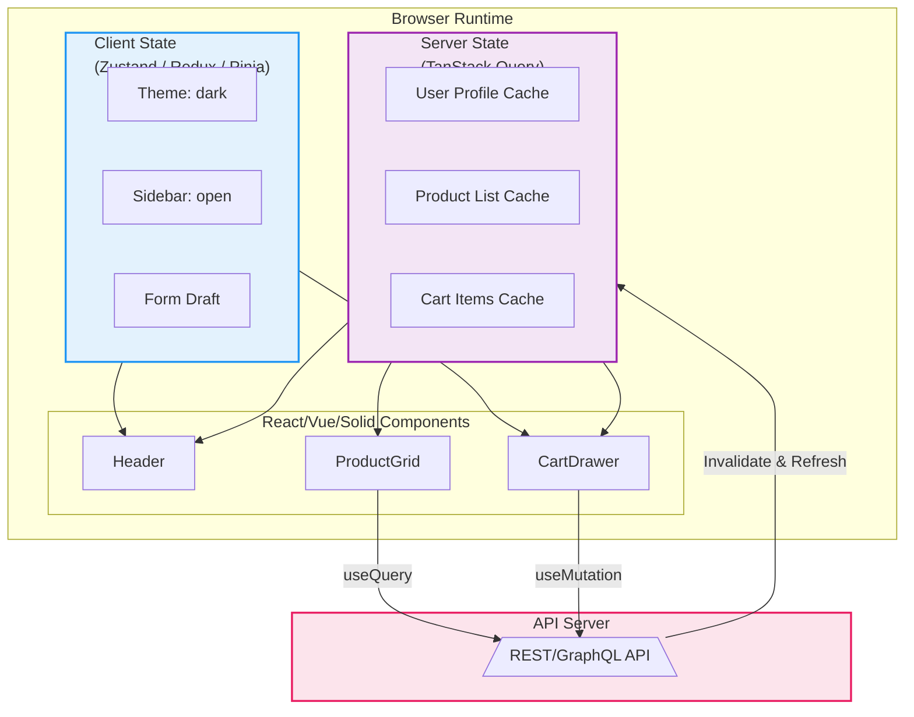

# 状态管理理论：Flux/Redux/MobX/XState

## 引言

在单页应用（SPA）的复杂度持续膨胀的背景下，「状态管理」已从简单的「变量共享」演变为前端架构中最具挑战性的领域之一。一个中等规模的现代Web应用可能同时管理数十种异构状态：用户身份会话、UI交互动画状态、服务端缓存数据、表单草稿状态、路由参数、主题偏好设置……这些状态在一致性边界、生命周期、可变性要求和持久化策略上各不相同，却必须在同一运行时环境中协同工作。

本文的理论轨道将从形式化定义出发，将状态建模为**时序数据（temporal data）**，提炼状态管理的四大核心问题——一致性（Consistency）、可预测性（Predictability）、可追踪性（Traceability）和可恢复性（Recoverability）。我们将探讨CQRS（命令查询职责分离）与事件溯源（Event Sourcing）在状态管理中的理论映射，引入有限状态自动机（FSA）和Mealy/Moore机的形式化框架，并分析状态空间爆炸这一制约复杂状态机实用化的根本瓶颈。

在工程轨道中，我们将系统剖析Redux的三原则与中间件生态、MobX的透明响应式状态管理、Zustand的极简哲学、XState的状态机实现、Pinia/Vuex在Vue生态中的演进，以及React组合式状态（`useState`/`useReducer`/`useContext`）的设计权衡。最后，我们将聚焦Server State与Client State的分离范式，深入TanStack Query（React Query）的缓存一致性策略。

---

## 理论严格表述

### 2.1 状态的形式化定义：时序数据

在形式化语义中，应用状态可以被定义为**时序数据类型（Temporal Data Type）**。设全局状态为`S`，时间为离散集合`T = {0, 1, 2, ...}`，则状态是一个从时间到状态快照的映射：

```
State : T → Snapshot
```

其中`Snapshot`是某一时刻应用全部数据的冻结视图。状态变迁（State Transition）则由事件（Event）驱动：

```
transition : Snapshot × Event → Snapshot
```

这一形式化直接对应了**事件溯源（Event Sourcing）**的核心思想：系统的真实来源（Source of Truth）不是当前状态本身，而是导致状态变迁的事件序列`[e₁, e₂, ..., eₙ]`。当前状态可以通过对一个初始状态`s₀`顺序应用所有事件来还原：

```
currentState = foldl(transition, s₀, [e₁, e₂, ..., eₙ])
```

该定义揭示了状态管理的第一个深刻洞见：**状态是派生视图，事件才是本质**。任何状态管理方案的本质，都是在「直接维护状态快照」与「维护事件日志并派生状态」之间寻找工程权衡。

进一步地，我们可以将状态空间`Σ`定义为所有合法状态快照的集合，状态变迁系统（Labeled Transition System）为三元组`(Σ, E, →)`，其中`E`为事件集合，`→ ⊆ Σ × E × Σ`为变迁关系。一个合法的应用执行轨迹（execution trace）是状态-事件交替序列：

```
s₀ --e₁--> s₁ --e₂--> s₂ --e₃--> ...
```

状态管理系统的目标，就是约束所有可能的执行轨迹，使其满足特定的安全性（Safety）和活性（Liveness）属性。

### 2.2 状态管理的核心四问题

基于对大规模前端系统的实践总结和形式化分析，状态管理面临的挑战可以归纳为四个正交维度：

**一致性（Consistency）**

一致性要求：在任意时刻，应用的所有观察者（组件、服务端、本地存储）对同一状态的视图应当协调。形式化地，设观察者集合为`Obs`，状态投影函数为`view_o : Snapshot → View_o`（每个观察者有自己的视图），则一致性条件可表述为：

```
∀o₁, o₂ ∈ Obs, ∀t ∈ T: if view_o₁(State(t)) ≠ view_o₂(State(t)), then ∃t' > t: view_o₁(State(t')) = view_o₂(State(t'))
```

即：暂时的视图不一致是允许的（由于网络延迟或异步更新），但系统必须最终收敛到一致状态。**最终一致性（Eventual Consistency）**是前端状态管理中最常采纳的模型。

**可预测性（Predictability）**

可预测性要求：给定相同的状态和输入，系统总是产生相同的输出和下一状态。这本质上是状态变迁函数`transition`的**确定性（determinism）**。可预测性使得开发者可以 mentally simulate 应用行为，也是时间旅行调试（Time-Travel Debugging）和自动化测试的理论前提。

在函数式编程语境中，可预测性等价于`transition`是一个**纯函数（pure function）**：无副作用、无外部依赖、引用透明。Redux的Reducer设计正是这一原则的严格工程化。

**可追踪性（Traceability）**

可追踪性要求：对于任意状态`sₜ`，能够 reconstruct 出导致该状态的完整事件序列`[e₁, ..., eₜ]`。可追踪性不仅服务于调试（「这个bug是如何产生的？」），更是审计、合规分析和错误恢复的基础设施。

可追踪性的形式化强度可分为三级：

- **弱可追踪**：仅记录最近`N`次状态变更（如Redux DevTools的滑动窗口）；
- **中可追踪**：记录所有事件，但事件语义不可扩展（如Redux Action日志）；
- **强可追踪**：所有状态变更均通过显式事件模型驱动，事件本身可序列化、可持久化、可重放（如事件溯源架构）。

**可恢复性（Recoverability）**

可恢复性要求：系统在遭遇故障（页面刷新、崩溃、网络中断）后，能够恢复到故障前的合法状态。可恢复性的实现通常依赖**持久化（Persistence）**和**快照（Snapshotting）**机制。形式化地，设持久化存储为`Persist`，则恢复函数为：

```
recover : Persist → Snapshot
```

在Web环境中，`localStorage`、`sessionStorage`、`IndexedDB`以及服务端的会话状态共同构成了持久化层。

### 2.3 CQRS与事件溯源在状态管理中的应用

**CQRS（Command Query Responsibility Segregation）**是一种架构模式，其核心思想是将「写模型（Command Model）」与「读模型（Query Model）」分离。在传统CRUD架构中，同一数据模型既服务于写入操作又服务于查询操作，导致模型在复杂场景下难以优化。CQRS通过分离读写路径，允许两者独立演进。

在前端状态管理中，CQRS的映射如下：

- **Command Side**：对应状态修改操作，如Redux的Action Dispatch、MobX的Action、Zustand的Setter函数。Command Side强调验证、业务规则执行和原子性；
- **Query Side**：对应状态读取和派生计算，如Redux的`mapStateToProps`、MobX的`computed`、Zustand的Selector。Query Side强调高效读取、视图投影和缓存。

**事件溯源（Event Sourcing）**则将CQRS的Command Side推向极致：不存储状态的当前值，而存储导致状态变化的所有事件。读模型通过「投影（Projection）」从事件日志中实时或近实时地构建。

前端框架中对事件溯源的轻量实现包括：

- **Redux**：Action序列即为事件日志，Store的当前状态是Reducer对Action序列的fold结果。Redux DevTools的「时间旅行」功能本质上就是事件重放；
- **XState**：状态机的每个transition生成一个事件对象，状态树的演化轨迹天然构成事件日志；
- **Zustand + 中间件**：`zustand/middleware`的`persist`和`redux`中间件可以将状态变更记录为可序列化的事件流。

CQRS与事件溯源在前端采纳的边界在于：完全的事件溯源会带来显著的性能和存储开销（事件日志无限增长），因此前端通常采用「**混合模型**」——核心领域状态采用事件日志（如购物车、多步表单），而UI瞬时状态（如模态框开关、加载指示器）直接维护快照。

### 2.4 状态机的形式化：Mealy / Moore / FSA

状态机是状态管理的形式化基石。一个**有限状态自动机（Finite State Automaton, FSA）**定义为五元组：

```
M = (Q, Σ, δ, q₀, F)
```

其中`Q`为有限状态集合，`Σ`为输入字母表（事件类型），`δ: Q × Σ → Q`为状态转移函数，`q₀ ∈ Q`为初始状态，`F ⊆ Q`为终结状态集合。

在前端状态管理中，终结状态的概念通常弱化，我们更关注**转换系统（Transition System）**：`(Q, Σ, δ, q₀)`。React组件的生命周期、路由守卫、多步向导、表单验证流程等，都可以被精确地建模为转换系统。

**Mealy机与Moore机**是两种带输出的状态机变体：

- **Moore机**：输出仅依赖于当前状态，即`output: Q → O`。在前端中，Moore机对应「当前状态决定视图」的范式，如Redux的`mapStateToProps`；
- **Mealy机**：输出依赖于当前状态和输入事件，即`output: Q × Σ → O`。在前端中，Mealy机对应「事件处理过程中产生副作用」的范式，如XState的`actions`和`invoke`配置。

现代前端状态机库（如XState）实际上是Mealy机的超集：支持嵌套状态（Hierarchical States）、正交区域（Orthogonal Regions，即并行状态机）、历史状态（History States）和守卫条件（Guards）。这些扩展大大提升了状态机的表达能力，但也引入了新的复杂性。

### 2.5 状态空间爆炸问题

状态空间爆炸（State Space Explosion）是制约状态机在大规模前端应用中全面采纳的根本障碍。设一个系统有`n`个独立的状态变量，每个变量有`k`个可能取值，则系统的全局状态空间大小为`kⁿ`。即便`n = 10`、`k = 3`，状态数也已达到`59,049`。

在XState等状态机库中，状态空间爆炸表现为：

- **嵌套状态深度增加**：每个层级引入额外的状态组合；
- **并行区域增加**：正交区域的数量以乘法方式扩大状态空间；
- **上下文（Context）扩展**：XState的`context`对象虽不被视为有限状态的一部分，但其变化会生成不同的运行时状态实例。

应对状态空间爆炸的策略包括：

1. **状态分解（State Decomposition）**：将一个庞大的状态机拆分为多个协作的较小状态机，每个负责独立的子领域；
2. **层次化抽象（Hierarchical Abstraction）**：使用嵌套状态将「无关细节」封装在超状态内部。例如，`loading`超状态可以包含`fetching`、`parsing`、`validating`三个子状态，外部观察者仅需知晓`loading`；
3. **正交分解（Orthogonal Decomposition）**：将独立演进的状态维度建模为并行区域，避免笛卡尔积式的状态膨胀；
4. **上下文与状态分离**：将「无限域」数据（如表单字段值、列表项）存入`context`，仅将「控制流状态」（如`idle`、`submitting`、`success`）建模为有限状态。

Harel于1987年提出的**Statecharts**正是通过层次化和正交化扩展经典状态机，以应对状态空间爆炸问题。XState是Statecharts理论在前端领域的直接工程实现。

---

## 工程实践映射

### 3.1 Redux的三原则与中间件生态

Redux是前端状态管理史上最具标志性的库之一，其设计严格建立在三条原则之上：

**单一数据源（Single Source of Truth）**

整个应用的State被存储在一棵对象树中，且这棵树唯一地存在于一个Store中。这一原则使得应用状态成为一个**可序列化的JSON文档**，便于持久化、服务端渲染和调试。形式化地，Redux的State空间是所有合法JSON对象的子集：

```
State = { domain1: DomainState1, domain2: DomainState2, ui: UIState, ... }
```

**状态只读（State is Read-Only）**

State的唯一修改方式是触发（dispatch）一个描述「发生了什么」的Action对象。Action是一个纯数据对象，必须包含`type`字段：

```ts
interface Action {
  type: string;
  payload?: any;
}
```

这一原则确保了所有状态变更都可被拦截、记录和重放，是可追踪性的工程基石。

**纯函数执行修改（Changes are Made with Pure Functions）**

Reducer被定义为纯函数`(state, action) => newState`。Reducer必须满足：不修改入参`state`、不产生副作用、在相同输入下返回相同输出。这一约束使得Redux的状态变迁具有数学上的可预测性。

Redux的中间件（Middleware）生态通过**面向切面编程（AOP）**扩展了纯Reducer的能力：

```ts
// Redux-Thunk: 支持异步Action Creator
const fetchUser = (id: string) => async (dispatch) => {
  dispatch({ type: 'FETCH_USER_START' });
  const user = await api.getUser(id);
  dispatch({ type: 'FETCH_USER_SUCCESS', payload: user });
};

// Redux-Saga: 基于Generator的副作用管理
function* fetchUserSaga(action) {
  try {
    const user = yield call(api.getUser, action.payload);
    yield put({ type: 'FETCH_USER_SUCCESS', payload: user });
  } catch (e) {
    yield put({ type: 'FETCH_USER_ERROR', error: e.message });
  }
}
```

Redux Toolkit（RTK）作为官方推荐的现代Redux写法，通过`createSlice`API将Reducer、Action Creator和Action Type的样板代码压缩到最小：

```ts
const counterSlice = createSlice({
  name: 'counter',
  initialState: { value: 0 },
  reducers: {
    increment: (state) => { state.value += 1; },  // Immer处理不可变性
    decrement: (state) => { state.value -= 1; }
  }
});
```

值得注意的是，RTK内部使用Immer库实现了「可变语法下的不可变更新」，通过Proxy拦截赋值操作并生成新的不可变对象。这一技术巧妙地在「API ergonomics」与「Redux纯函数约束」之间取得了平衡。

### 3.2 MobX的透明响应式状态管理

MobX采用了一种与Redux截然不同的哲学：**透明函数响应式编程（Transparently Functional Reactive Programming, TFRP）**。开发者使用普通的可变对象和类，MobX在底层自动追踪属性访问并建立依赖关系。

```ts
import { makeAutoObservable, autorun } from 'mobx';

class Store {
  count = 0;
  get doubled() {
    return this.count * 2;
  }
  constructor() {
    makeAutoObservable(this);
  }
  increment() {
    this.count++;
  }
}

const store = new Store();
autorun(() => {
  console.log(store.doubled);  // 自动追踪 count -> doubled 依赖链
});
store.increment();              // 自动触发 autorun
```

MobX的核心实现依赖于：

1. **Observable对象**：通过`makeObservable`或`makeAutoObservable`将类属性转换为可观察对象，底层使用`Object.defineProperty`或ES Proxy；
2. **Atom/Derivation/Reaction三层架构**：`Atom`是可观察的最小单元，`Derivation`（如`computed`）从Atom派生，`Reaction`（如`autorun`）在Derivation变化时执行副作用；
3. **事务（Transaction）机制**：`runInAction`将多个状态变更批量处理，避免中间状态触发不必要的派生计算。

MobX与Redux的核心对比在于**状态变迁的可追踪性粒度**：Redux在Action级别追踪所有变更，提供了全局统一的时间线；MobX在属性级别追踪依赖，提供了细粒度的自动更新，但状态变迁的历史记录需要额外的`mobx-logger`或`mobx-state-tree`来补充。

### 3.3 Zustand的极简状态管理

Zustand（德语「状态」）代表了状态管理库向极简主义回归的趋势。其API设计哲学是：「使用React已有的能力（Hooks和Context），仅在必要时补充最小的外部状态原语」。

```ts
import { create } from 'zustand';

interface BearState {
  bears: number;
  increase: () => void;
}

const useBearStore = create<BearState>((set) => ({
  bears: 0,
  increase: () => set((state) => ({ bears: state.bears + 1 }))
}));

// 在组件中使用
function BearCounter() {
  const bears = useBearStore((state) => state.bears);
  return <h1>{bears} bears</h1>;
}
```

Zustand的实现极为精简（核心代码<1KB gzip），其关键技术点包括：

- **外部存储 + Selector订阅**：状态存储在React组件树外的闭包变量中，组件通过Selector函数订阅特定切片，实现精细的重新渲染控制；
- **无需Provider**：与Redux和MobX不同，Zustand的Store不依赖React Context传播，避免了Context的「意外渲染穿透」问题；
- **中间件生态**：`persist`（持久化）、`devtools`（Redux DevTools集成）、`immer`（不可变更新）等中间件通过高阶函数增强Store。

Zustand在小型到中型项目中表现优异，但在需要严格约束状态变迁（如金融交易、复杂表单验证）的场景中，其「自由散漫」的API风格可能引入不可维护性。

### 3.4 XState的状态机实现

XState将Statecharts理论完整地带入前端工程实践，是处理复杂交互逻辑的首选工具。

```ts
import { createMachine, interpret } from 'xstate';

const fetchMachine = createMachine({
  id: 'fetch',
  initial: 'idle',
  context: { data: undefined, error: undefined },
  states: {
    idle: { on: { FETCH: 'loading' } },
    loading: {
      invoke: {
        src: 'fetchData',
        onDone: { target: 'success', actions: 'setData' },
        onError: { target: 'failure', actions: 'setError' }
      }
    },
    success: { on: { RESET: 'idle' } },
    failure: { on: { RETRY: 'loading' } }
  }
});
```

XState的核心概念映射如下：

- **状态（States）**：对应Moore机的状态集合，支持嵌套（hierarchical）和并行（parallel）状态；
- **事件（Events）**：触发状态转移的输入信号；
- **转换（Transitions）**：`on: { EVENT: 'targetState' }`定义了状态转移函数`δ`；
- **动作（Actions）**：在状态进入、退出或转换时执行的副作用，对应Mealy机的输出函数；
- **服务（Services/Invocations）**：在状态中启动的长期运行副作用（如API请求、WebSocket连接），有独立的生命周期；
- **守卫（Guards）**：条件转换，只有当守卫函数返回`true`时才允许转移；
- **上下文（Context）**：扩展的、可变的「状态外数据」，用于存储表单值、列表等无限域数据。

XState的JavaScript实现严格遵循SCXML（State Chart XML）规范，支持状态机的可视化编辑（通过Stately.ai）和模型检测（Model Checking）。其`@xstate/react`包提供了`useMachine`Hook，将状态机实例与React组件生命周期绑定：

```ts
const [state, send] = useMachine(fetchMachine, {
  services: { fetchData: () => api.fetch() }
});
```

XState的局限在于学习曲线陡峭和样板代码较多。对于仅有2-3个状态的简单逻辑，XState显得过重；但对于具有复杂异步流程、并行任务和错误恢复路径的交互系统（如支付流程、音视频编辑器、多人协作工具），XState的形式化保证是无价的质量屏障。

### 3.5 Pinia / Vuex的Vue生态状态管理

Pinia是Vue生态当前官方推荐的状态管理方案，作为Vuex 5的精神续作，它汲取了Vue 3组合式API的精髓。

```ts
import { defineStore } from 'pinia';
import { ref, computed } from 'vue';

export const useCounterStore = defineStore('counter', () => {
  const count = ref(0);
  const doubled = computed(() => count.value * 2);
  function increment() {
    count.value++;
  }
  return { count, doubled, increment };
});
```

Pinia的设计特点包括：

- **组合式API风格**：Store定义函数与Vue组件的`setup`函数几乎 identical，降低了心智负担；
- **完整的TypeScript支持**：无需额外的类型声明文件，类型推断自动工作；
- **DevTools集成**：支持时间旅行、状态检查和Action日志记录；
- **模块化与组合**：Store之间可以通过导入和调用直接组合，无需命名空间或模块注册；
- **服务端渲染友好**：自动处理hydration和状态序列化。

与Vuex 4（Options API风格）相比，Pinia消除了`mutations`的概念，状态修改直接在`actions`中通过响应式API完成。这一简化符合「减少不必要的样板代码」的现代前端趋势，但也意味着失去了Vuex中「 mutations 必须是同步的」这一强制约束（在Pinia中，异步修改是允许的，但建议将异步逻辑封装在`actions`中）。

### 3.6 React的`useState`/`useReducer`/`useContext`组合策略

在React生态中，状态管理的「官方答案」并非单一库，而是Hooks的组合。理解这一组合策略的设计权衡，对于构建可维护的React应用至关重要。

**`useState`**：

```ts
const [state, setState] = useState(initialState);
```

`useState`是React最基础的状态原语。其内部实现依赖于Fiber节点的`memoizedState`链表。每次调用`setState`，React将更新加入当前Fiber的更新队列，并在合适的时机触发重新渲染。

**`useReducer`**：

```ts
const [state, dispatch] = useReducer(reducer, initialState);
```

`useReducer`是`useState`的泛化形式，将状态变迁逻辑提取到组件外部的Reducer函数中。对于包含多个子字段的复杂状态对象，`useReducer`比多个`useState`更具可维护性，因为它将「状态如何变化」的规范集中在一处。

**`useContext`**：

```ts
const value = useContext(MyContext);
```

`useContext`提供了跨组件树的状态传递能力，无需逐层props drilling。然而，`useContext`存在一个关键的性能陷阱：**Context值变化时，所有消费该Context的组件都会重新渲染，无论它们实际依赖的数据切片是否变化**。这是因为React的Context API没有内置Selector机制。

解决这一问题的工程模式包括：

- **Context拆分**：将频繁变化和不频繁变化的状态拆分到独立的Context；
- **使用外部库**：如Zustand、Jotai、Recoil，它们提供了基于Selector的细粒度订阅；
- **`useContextSelector` shim**：通过额外的上下文拆分和记忆化模拟Selector行为。

**组合策略的边界**：当应用的状态逻辑仅涉及局部组件状态时，`useState`/`useReducer`足够；当状态需要跨多个路由或模块共享时，引入Context或外部状态库；当状态具有复杂的异步逻辑和状态机特征时，XState或Redux-Saga成为必要。

### 3.7 Server State vs Client State的分离（TanStack Query / SWR）

现代前端应用中最深刻的架构洞察之一是：**服务端状态（Server State）与客户端状态（Client State）本质上是两种不同的数据类型，应当使用不同的工具管理**。

| 特性 | Server State | Client State |
|------|-------------|--------------|
| **存储位置** | 服务端数据库/缓存 | 浏览器内存/存储 |
| **所有权** | 服务端拥有，前端缓存 | 前端拥有 |
| **更新方式** | 通过API请求异步变更 | 同步本地修改 |
| **一致性要求** | 需要与服务端同步（Stale-While-Revalidate） | 本地即时一致即可 |
| **生命周期** | 与组件挂载/路由切换相关 | 与页面会话或持久化策略相关 |
| **缓存策略** | 需要智能缓存、去重、重试 | 通常无需缓存层 |

**TanStack Query**（前身为React Query）是服务端状态管理的事实标准。其核心理念可以概括为：

```
Server State = f(Cache Policy, API Request, Background Sync)
```

TanStack Query的关键机制包括：

1. **Stale-While-Revalidate（SWR）缓存策略**：组件挂载时，先返回缓存数据（即使可能已过期），同时在后台发起新请求。一旦新数据到达，自动更新UI。这一策略在「首屏速度」与「数据新鲜度」之间取得了最佳平衡。

2. **自动去重（Deduplication）**：在同一时间窗口内，多个组件请求相同的Query Key时，TanStack Query仅发出一个网络请求，并将结果分发给所有订阅者。

3. **后台刷新（Background Refetching）**：当窗口重新获得焦点或网络恢复时，自动刷新过期的查询。

4. **乐观更新（Optimistic Updates）**：在Mutation执行时，先本地更新UI，待服务端确认后再最终化。若请求失败，则自动回滚到之前的状态。

5. **Query Key的声明式缓存**：Query Key不仅用于标识缓存条目，还决定了缓存的失效和重新获取策略：

```ts
const { data, isLoading } = useQuery({
  queryKey: ['user', userId],
  queryFn: () => fetchUser(userId),
  staleTime: 1000 * 60 * 5,      // 5分钟内视为新鲜
  gcTime: 1000 * 60 * 30         // 30分钟未使用则垃圾回收
});
```

TanStack Query的架构设计将前端从「手动管理API缓存、loading状态、错误处理和竞态条件」的繁琐工作中解放出来。在采用TanStack Query的应用中，全局状态管理库（如Redux、Zustand）的职责被大幅收缩，通常仅需管理真正的客户端状态（如主题、侧边栏展开状态、表单草稿）。

SWR（由Vercel维护）是TanStack Query的轻量替代方案，API更为简洁，但功能集相对有限。两者在「服务端状态作为一等公民」的架构哲学上完全一致。

---

## Mermaid 图表

### 图表1：Redux架构的数据流与不可变更新

```mermaid
graph LR
    subgraph UI["UI Layer"]
        C1[Component A]
        C2[Component B]
    end

    subgraph Action["Action Layer"]
        A1[Action Creator]
        A2[Action Object<br/>{type, payload}]
    end

    subgraph Reducer["Reducer Layer<br/>Pure Function"]
        R1[(Previous State)]
        R2["Reducer(state, action)"]
        R3[(New State)]
    end

    subgraph Store["Single Store"]
        S1[State Tree]
    end

    C1 -->|Dispatch| A1
    A1 --> A2
    A2 --> R2
    R1 --> R2
    R2 -->|Immutable Update| R3
    R3 -->|Replace| S1
    S1 -->|Selector| C1
    S1 -->|Selector| C2

    style Reducer fill:#c8e6c9,stroke:#4caf50,stroke-width:2px
    style Store fill:#fff9c4,stroke:#ffeb3b,stroke-width:2px
```

### 图表2：CQRS与事件溯源在前端状态管理中的映射

```mermaid
graph TB
    subgraph Command["Command Side (Write Model)"]
        Cmd1[User Action] --> Cmd2[Action Validation]
        Cmd2 --> Cmd3[Event Generation]
        Cmd3 --> EventLog[(Event Log<br/>[e₁, e₂, e₃, ...])]
    end

    subgraph Projection["Projection Engine"]
        EventLog --> Fold["fold(transition, s₀, events)"]
        Fold --> State[(Current State Snapshot)]
    end

    subgraph Query["Query Side (Read Model)"]
        State --> Q1[Selector / Derived State]
        Q1 --> Q2[Component View]
    end

    subgraph DevTools["DevTools & Recovery"]
        EventLog --> T1[Time-Travel Debugging]
        EventLog --> T2[State Replay]
        State --> T3[Snapshot Persistence]
    end

    style Command fill:#ffcdd2,stroke:#f44336,stroke-width:2px
    style Query fill:#c8e6c9,stroke:#4caf50,stroke-width:2px
    style Projection fill:#fff9c4,stroke:#ffeb3b,stroke-width:2px
```

### 图表3：Server State vs Client State的分离架构



---

## 理论要点总结

1. **状态的时序本质**：状态是随时间演化的派生视图，事件才是系统的真实来源。这一形式化定义揭示了事件溯源架构的理论根基，也为Redux的Action日志和XState的状态轨迹提供了统一的语义框架。

2. **四核心问题的正交性**：一致性、可预测性、可追踪性和可恢复性构成了状态管理的完整需求空间。不同框架在这些维度上做出了不同的工程权衡：Redux追求可预测性和可追踪性的极致，MobX优先一致性和开发效率，Zustand在简洁性与功能性之间取中，XState以可预测性为核心并通过形式化状态机保证正确性。

3. **CQRS与事件溯源的前端映射**：前端状态管理对CQRS的采纳通常是轻量和混合的——核心领域状态采用事件日志（如Redux Action序列），UI瞬时状态直接维护快照。完全的事件溯源在前端受限于存储容量和性能约束，但在离线优先（Offline-First）和协作编辑场景中具有不可替代的价值。

4. **状态机的形式化表达力**：Mealy机与Moore机为前端交互逻辑提供了严格的数学模型。XState通过层次化、正交化和历史状态扩展了经典状态机，但状态空间爆炸问题要求开发者必须掌握状态分解、层次化抽象和上下文分离等工程策略。

5. **服务端状态与客户端状态的分离**：这是现代前端架构最重要的演进之一。TanStack Query等库将服务端状态管理（缓存、去重、后台同步、乐观更新）封装为声明式API，使得全局状态管理库仅需关注真正的客户端状态，大幅简化了应用架构。

6. **工具选择的决策矩阵**：不存在「最好的」状态管理方案，只有「最适合当前问题」的方案。Redux适合需要严格审计和复杂中间件链的大型应用；MobX适合追求开发速度和OOP风格的团队；Zustand适合中小型项目和快速原型；XState适合具有复杂状态流转的交互系统；Pinia是Vue生态的自然选择；TanStack Query则是任何需要服务端数据的应用的标配。

---

## 参考资源

1. **Flux Architecture**. Facebook. <https://facebook.github.io/flux/>. Facebook官方发布的Flux架构文档，首次系统阐述了「单向数据流」在前端状态管理中的应用，是Redux和所有后续Flux变种的思想源头。

2. **Redux Official Documentation — Three Principles**. Redux Team. <https://redux.js.org/understanding/thinking-in-redux/three-principles>. Redux官方文档对其三大原则（单一数据源、状态只读、纯函数修改）的权威阐述，是理解Redux设计哲学的首要文献。

3. **Khourshid, D. (2020). *XState: The Complete Guide to State Machines in JavaScript*. Stately.ai.** David Khourshid（XState作者）关于Statecharts和XState的系统性著作，涵盖了有限状态机理论、层次化状态、并行区域、Actor模型以及XState在React中的集成实践。

4. **Harel, D. (1987). "Statecharts: A Visual Formalism for Complex Systems". *Science of Computer Programming*, 8(3), 231-274.** David Harel关于Statecharts的奠基性论文，提出了通过层次化和正交化扩展经典有限状态机以应对状态空间爆炸的形式化方案，是XState的理论源头。

5. **TanStack Query Documentation — Caching & Background Updates**. TanStack. <https://tanstack.com/query/latest>. TanStack Query官方文档对其Stale-While-Revalidate缓存策略、Query Key语义、后台刷新和乐观更新机制的详细说明，是服务端状态管理工程实践的核心参考。
