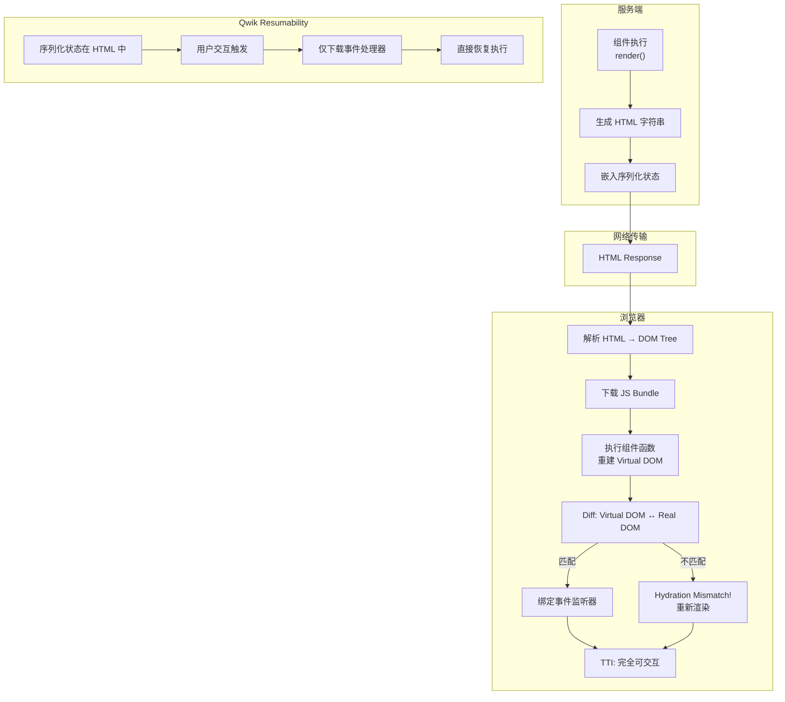
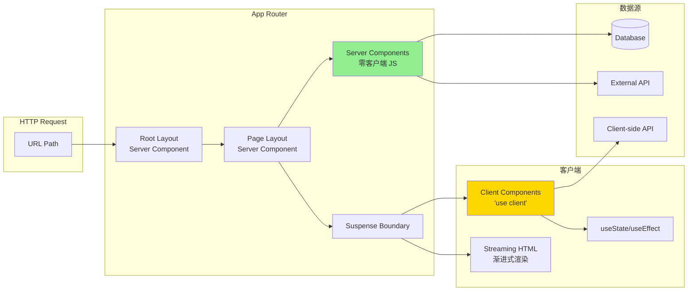
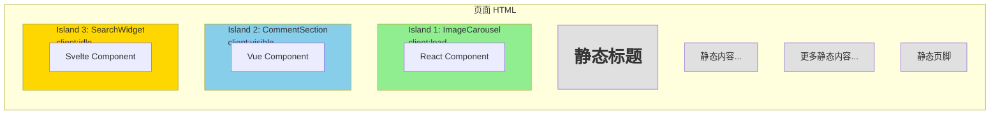

# 渲染模型：CSR/SSR/SSG/Islands

## 引言

Web 应用的渲染模型决定了用户感知到的首屏时间、交互响应速度、SEO 友好度以及运维复杂度。从早期纯服务端生成 HTML 的 CGI 时代，到 jQuery 主导的客户端增强，再到现代框架百花齐放的 CSR、SSR、SSG、Islands 等多元策略，渲染模型的演进本质上是对「计算发生在哪里」这一核心问题的持续重新协商。

渲染模型不仅关乎技术选型，更关乎**用户体验边界**、**资源成本曲线**与**架构复杂度**之间的三角权衡。本文以形式化分类为经，以主流框架实践为纬，构建一套可指导工程决策的渲染模型认知框架。我们将深入 hydration 的理论本质，剖析 Islands 架构的局部活跃性原理，并探讨流式渲染与边缘渲染如何将渲染粒度从「页面级」推进到「组件级」乃至「请求级」。

---

## 理论严格表述

### 2.1 渲染模型的形式化分类

设用户请求页面 \(P\) 的过程可抽象为一个五元组：

$$
R = (S, C, N, T_{gen}, T_{xfer})
$$

其中：

- \(S\) 为服务端（Server）的计算能力集合
- \(C\) 为客户端（Client）的计算能力集合
- \(N\) 为网络传输链路
- \(T_{gen}\) 为 HTML/内容生成时间
- \(T_{xfer}\) 为内容传输时间

根据计算主要发生的位置与时机，渲染模型可形式化地划分为以下类别：

| 模型 | 生成时机 | 生成位置 | 关键特征 | 形式化描述 |
|------|---------|---------|---------|-----------|
| **CSR** (Client-Side Rendering) | 运行时 | 客户端 | 空 shell + JS 驱动 | \(T_{gen} \approx 0\) on \(S\); \(T_{gen} > 0\) on \(C\) |
| **SSR** (Server-Side Rendering) | 请求时 | 服务端 | 完整 HTML + hydration | \(T_{gen}\) on \(S\) per-request; hydration on \(C\) |
| **SSG** (Static Site Generation) | 构建时 | 构建服务器 | 预生成静态 HTML | \(T_{gen}\) at build-time; \(T_{xfer}\) only at request-time |
| **ISR** (Incremental Static Regeneration) | 构建时 + 后台刷新 | 构建服务器/边缘节点 | 静态为主，按需再生 | SSG + \( \Delta t \) 后台刷新策略 |
| **Islands** | 构建时 + 运行时局部 | 构建服务器 + 客户端局部 | 静态外壳 + 局部活跃区域 | \(P = P_{static} \cup \bigcup_{i} I_i\)，其中 \(I_i\) 为第 i 个 island |

### 2.2 客户端渲染（CSR）的时序模型

CSR 的核心时序可形式化为一个状态转换序列：

$$
\emptyset \xrightarrow{1} HTML_{shell} \xrightarrow{2} JS_{bundle} \xrightarrow{3} DOM_{virtual} \xrightarrow{4} DOM_{actual} \xrightarrow{5} Hydrated
$$

各阶段详解：

1. **空壳交付**：服务端返回最小化 HTML（通常仅含 `<div id="root"></div>`），\(T_{gen} \approx 0\)。
2. **脚本加载**：浏览器下载并解析 JavaScript bundle。设 bundle 大小为 \(B\)，网络带宽为 \(W\)，则下载时间 \(T_{dl} = B / W\)。
3. **虚拟 DOM 构建**：框架在内存中构建虚拟 DOM 树。此阶段用户仍只能看到白屏或 loading 状态。
4. **实际 DOM 挂载**：`render()` 或 `createRoot().render()` 将虚拟 DOM 转换为真实 DOM 操作。
5. **可交互状态**：事件监听器绑定完成，应用进入 fully interactive 状态。

CSR 的**关键路径**（Critical Rendering Path）完全依赖于 JavaScript 的执行。其首屏时间（FCP, First Contentful Paint）与可交互时间（TTI, Time to Interactive）之间的gap，正是 CSR 最大的体验痛点。

形式化地，设框架初始化开销为 \(O_{init}(n)\)（与组件数量 \(n\) 相关），则 CSR 的 TTI 下界为：

$$
TTI_{CSR} \geq T_{dl} + T_{parse} + T_{init} + T_{render}
$$

其中 \(T_{parse}\) 为 JS 解析时间，现代 V8 引擎中 \(T_{parse} \propto B\)。

### 2.3 服务端渲染（SSR）的 Hydration 理论

SSR 在服务端生成完整 HTML，解决了 CSR 的 FCP 问题，但引入了**Hydration（水合）**这一关键机制。

#### Hydration 的形式化定义

Hydration 是一个从「静态 HTML」到「动态应用」的**状态重建过程**。形式化地，设服务端生成的 HTML 树为 \(H_{server}\)，客户端框架构建的虚拟 DOM 树为 \(V_{client}\)，Hydration 过程即验证并修复：

$$
match(H_{server}, V_{client}) \rightarrow \{ok, fix\}
$$

其中：

- 若 \(H_{server}\) 与 \(V_{client}\) 结构一致，则仅绑定事件监听器（`ok` 路径）
- 若不一致，则触发完整的客户端重新渲染（`fix` 路径，即 hydration mismatch）

#### Hydration 的时序开销

Hydration 必须执行以下子过程：

1. **重建组件树**：客户端重新执行组件逻辑，重建虚拟 DOM。注意：尽管 HTML 已存在，但组件构造函数/函数体仍须执行以恢复内部状态。
2. **对比与复用（Diff & Patch）**：将虚拟 DOM 与现有真实 DOM 对比，确认一致性。
3. **事件委托注册**：建立事件监听系统（React 的事件委托、Vue 的事件绑定等）。

设页面组件节点数为 \(N\)，则 hydration 的计算复杂度为：

$$
O_{hydration}(N) = O_{render}(N) + O_{diff}(N) + O_{event}
$$

这意味着 **SSR 的 TTI 通常差于 CSR**，因为 SSR 在 CSR 的所有开销之上增加了 hydration 成本。SSR 的核心价值在于**缩短 FCP 与 LCP**（Largest Contentful Paint），而非 TTI。

### 2.4 静态站点生成（SSG）的构建时渲染

SSG 将渲染计算从请求时前移到构建时。形式化地，对于页面集合 \(P = \{p_1, p_2, ..., p_n\}\)，构建时生成：

$$
\forall p_i \in P: \quad HTML_i = Render(p_i, D_i)
$$

其中 \(D_i\) 为构建时可获取的数据。生成的 \(HTML_i\) 为静态文件，可在 CDN 边缘节点缓存。

SSG 的复杂度从运行时转移到了构建时。当 \(n\) 很大（如百万级页面）或 \(D_i\) 变化频繁时，构建时间可能成为瓶颈。此问题催生了 ISR 与 DPR（Distributed Persistent Rendering）等变体。

### 2.5 Islands 架构的局部 Hydration 理论

Islands Architecture（岛屿架构）由 Katie Sylor-Miller 于 2019 年提出，并由 Astro 框架推广。其核心思想形式化为：

$$
Page = Static_{shell} + \sum_{i=1}^{k} Island_i
$$

其中：

- \(Static_{shell}\) 为纯粹的静态 HTML，无需 JavaScript
- \(Island_i\) 为页面中需要交互性的局部区域，每个 island 独立进行 hydration

#### 关键特性

1. **自动分割**：编译器自动识别需要客户端交互的组件（通过指令标记，如 Astro 的 `client:*` 指令）。
2. **独立水合**：每个 island 拥有独立的 hydration 边界，互不阻塞。
3. **零 JS 默认**：页面默认定制静态 HTML，只有显式标记的组件才附带 JS。

Islands 架构的本质是**将 hydration 的粒度从「页面级」降至「组件级」**。设页面总节点数为 \(N\)，其中交互节点数为 \(n \ll N\)，则：

$$
O_{islands} = \sum_{i=1}^{k} O_{hydrate}(n_i) \quad \text{where} \quad \sum n_i = n \ll N
$$

相比于传统 SSR 的 \(O_{hydration}(N)\)，Islands 可显著降低 TTI。

### 2.6 流式渲染（Streaming SSR）与 Suspense

流式渲染将 SSR 的输出从「一次性完整 HTML」转变为「分块渐进式传输」。形式化地，页面内容 \(Content\) 被分解为有序块：

$$
Content = \langle Chunk_1, Chunk_2, ..., Chunk_m \rangle
$$

浏览器可逐块解析并渲染，无需等待完整响应。

#### React Streaming SSR 模型

React 18 引入的 Streaming SSR 配合 `<Suspense>` 边界，实现了「选择性 hydration」：

1. **优先流式传输**：关键内容（如 `<title>`、首屏文本）优先传输并渲染。
2. **Suspense 占位**：被 `<Suspense>` 包裹的异步内容先以 `fallback`（如 spinner）占位。
3. **异步回填**：服务端数据就绪后，通过 inline `<script>` 或 streaming HTML 片段回填真实内容。
4. **选择性 Hydration**：客户端优先对可见且高优先级的组件进行 hydration，而非整棵树。

形式化地，设组件优先级为 \(priority(c)\)，可见性为 \(visible(c)\)，则 hydration 调度策略为：

$$
c_{next} = \arg\max_{c \in Ready} \{ priority(c) \times visible(c) \}
$$

这种基于优先级的 hydration 调度，使得 TTI 与 FCP 的 gap 被显著压缩。

### 2.7 边缘渲染（Edge SSR）的分布式模型

边缘渲染将 SSR 的计算从中心服务器下推到 CDN 边缘节点。形式化地，传统 SSR 的计算发生在单一源站 \(S_{origin}\)：

$$
Render_{traditional}(req) \rightarrow S_{origin}
$$

而边缘渲染将计算分布到边缘节点集合 \(E = \{e_1, e_2, ..., e_k\}\)：

$$
Render_{edge}(req) \rightarrow e_i \in E \quad \text{where} \quad latency(user, e_i) = \min
$$

#### 边缘渲染的关键约束

边缘节点通常运行在受限的 V8 isolate 环境（如 Cloudflare Workers、Vercel Edge Functions）中，具有以下约束：

- **冷启动极短**：通常 < 1ms，因为无传统容器启动开销
- **计算资源受限**：CPU 时间片与内存严格受限（如 128MB-512MB）
- **无文件系统**：基于内存状态与外部存储
- **地理就近**：请求自动路由至最近边缘节点

边缘渲染适用于「轻计算、高并发、低延迟」场景。对于重计算页面，仍需回退到中心服务器。

---

## 工程实践映射

### 3.1 Next.js 的渲染策略矩阵

Next.js 作为 React 生态的全栈框架，提供了最完整的渲染策略矩阵。自 App Router（Next.js 13+）引入后，其渲染模型更加精细化：

#### Pages Router 时代的策略

```javascript
// SSR: getServerSideProps
export async function getServerSideProps(context) {
  const data = await fetchData(context.params.id);
  return { props: { data } };
}

// SSG: getStaticProps
export async function getStaticProps() {
  const data = await fetchData();
  return { props: { data }, revalidate: 60 }; // ISR
}

// CSR: 纯客户端获取
export default function Page() {
  const { data } = useSWR('/api/data', fetcher);
  return <div>{data}</div>;
}
```

#### App Router 的革新

Next.js 13+ App Router 引入了 Server Components 与更细粒度的渲染控制：

| 组件类型 | 运行环境 | 能否访问浏览器 API | 能否使用 useState/useEffect | 输出 |
|---------|---------|------------------|---------------------------|------|
| Server Component | 服务端/构建时 | ❌ | ❌ | HTML + RSC Payload |
| Client Component | 客户端 + 服务端（hydration） | ✅ | ✅ | HTML + JS bundle |

```javascript
// app/page.js —— 默认为 Server Component
import { ClientWidget } from './ClientWidget';

export default async function Page() {
  const data = await db.query('SELECT * FROM posts'); // 直接在服务端查询数据库
  return (
    <main>
      <h1>服务端渲染的标题</h1>
      <ClientWidget initialData={data} /> {/* 仅此处需要 hydration */}
    </main>
  );
}
```

Next.js 的 Streaming SSR 实现中，`<Suspense>` 边界内的异步组件不会阻塞外部内容的流式传输：

```javascript
import { Suspense } from 'react';

export default function Page() {
  return (
    <>
      <Header /> {/* 立即渲染 */}
      <Suspense fallback={<Spinner />}>
        <AsyncContent /> {/* 流式延迟渲染 */}
      </Suspense>
    </>
  );
}
```

### 3.2 Nuxt 的混合渲染

Nuxt 3 提供了灵活的混合渲染（Hybrid Rendering）能力，允许在路由级别声明渲染策略：

```typescript
// nuxt.config.ts
export default defineNuxtConfig({
  routeRules: {
    // 静态生成
    '/': { prerender: true },
    // SSR + 客户端缓存
    '/products/**': { isr: 60 },
    // 纯 CSR
    '/admin/**': { ssr: false },
    // 边缘渲染
    '/api/edge/**': { experimentalNoScripts: true },
  }
});
```

Nuxt 的渲染引擎 Nitro 支持多种部署目标（Node.js、Deno、Cloudflare Workers、Vercel Edge），实现了「一次编写，到处运行」的渲染抽象。

Nuxt 3 还引入了 **Islands Components** 概念（实验性），允许组件级别控制 hydration：

```vue
<template>
  <div>
    <StaticContent />
    <InteractiveWidget client:load />
    <LazyWidget client:visible />
  </div>
</template>
```

其中 `client:load`、`client:visible`、`client:idle`、`client:media` 等指令精确控制 hydration 触发时机，与 Astro 的 Islands 理念异曲同工。

### 3.3 Astro 的 Islands 架构实现

Astro 是 Islands Architecture 的最纯粹实现。其核心设计原则：**默认零 JavaScript**。

```astro
---
// 服务端/构建时执行的 frontmatter
import Counter from '../components/Counter.jsx';
const data = await fetch('https://api.example.com/data').then(r => r.json());
---

<!-- 纯静态 HTML，零 JS -->
<h1>{data.title}</h1>
<p>{data.description}</p>

<!-- Islands：仅此处发送 JS -->
<Counter client:load initial={0} />

<!-- 仅在视口可见时 hydration -->
<Comments client:visible />
```

Astro 的编译器执行以下转换：

1. **静态分析**：扫描所有组件，识别 `client:*` 指令
2. **代码分割**：将 island 组件与框架运行时（React、Vue、Svelte、Preact、Solid、Alpine、Lit 等）打包为独立 chunk
3. **islands 映射**：生成 islands 清单，记录每个 island 的 props、位置与加载策略
4. **运行时调度**：`astro-island` 自定义元素负责按策略加载并挂载各 island

Astro 支持 **多框架共存**——同一页面可同时包含 React、Vue、Svelte 组件，各 island 独立运行，互不影响。

### 3.4 SvelteKit 的 Adapter 模式

SvelteKit 通过 **adapter** 机制将应用编译为不同平台的运行时目标：

```javascript
// svelte.config.js
import adapter from '@sveltejs/adapter-node'; // 或 adapter-vercel, adapter-static, adapter-cloudflare-workers

export default {
  kit: {
    adapter: adapter({
      // 平台特定配置
    }),
    // 路由级别的渲染策略
    prerender: {
      entries: ['*'],
      crawl: true
    }
  }
};
```

SvelteKit 的渲染策略在路由级别配置：

```javascript
// +page.server.js —— SSR（服务端渲染）
export async function load({ params }) {
  return { post: await getPost(params.slug) };
}

// +page.js —— CSR（客户端渲染，配合 SvelteKit 的客户端路由）
export async function load({ fetch }) {
  return { data: await fetch('/api/data').then(r => r.json()) };
}

// +page.js + export const prerender = true —— SSG
export const prerender = true;
```

SvelteKit 的 hydration 由 Svelte 编译器生成的代码自动处理。Svelte 的编译时优化使得组件的 hydration 开销显著低于运行时虚拟 DOM 方案。

### 3.5 Remix 的 SSR 优先策略

Remix 采取「SSR 优先、渐进增强」的哲学，将 Web 平台原生能力置于框架抽象之上：

```tsx
// app/routes/_index.tsx
import { json } from '@remix-run/node';
import { useLoaderData } from '@remix-run/react';

export async function loader() {
  // 服务端获取数据
  return json({ posts: await getPosts() });
}

export default function Index() {
  const { posts } = useLoaderData<typeof loader>();
  return (
    <ul>
      {posts.map(post => (
        <li key={post.id}>
          <Link to={`/posts/${post.slug}`}>{post.title}</Link>
        </li>
      ))}
    </ul>
  );
}
```

Remix 的独特设计：

1. **表单即 API**：HTML `<form>` 元素天然支持 SSR，Remix 通过 `action` 函数处理表单提交，无需单独的 API 路由
2. **嵌套数据加载**：路由嵌套对应数据嵌套加载，配合 `<Outlet>` 实现并行数据获取
3. **错误边界**：服务端渲染错误可被 `<ErrorBoundary>` 捕获，降级为客户端渲染
4. **乐观 UI**：通过 `useTransition` 与 `useFetcher` 实现无需等待服务器响应的即时反馈

Remix 的哲学是「使用 Web 平台」，而非「替代 Web 平台」。其 SSR 实现不依赖 React Server Components，而是基于传统的 `renderToString` + `hydrateRoot`。

### 3.6 Hydration 的性能开销分析

Hydration 是 SSR 的「必要之恶」。以下是各框架 hydration 开销的定性对比：

| 框架 | Hydration 策略 | 开销特征 | 优化方向 |
|------|---------------|---------|---------|
| React | 整棵树遍历 + 事件委托 | 必须重新执行组件函数 | Server Components 减少 hydrate 范围 |
| Vue 3 | 整棵树遍历 + 响应式系统重建 | 响应式绑定重建 | 编译时优化（Compiler-informed hydration） |
| Svelte | 指令式 DOM 操作重建 | 无虚拟 DOM，开销较低 | 编译时生成 hydration 代码 |
| Solid | 细粒度响应式 + 局部更新 | 极低开销 | 细粒度绑定天然优势 |
| Qwik | Resumability（无需 hydration） | 零 hydration 开销 | 序列化状态，直接从事件恢复 |

React 的 hydration 过程必须重新执行所有组件函数，即使这些函数在服务端已经执行过一次。这意味着：

```javascript
// 此函数在 SSR 时执行一次，hydration 时再次执行
function ExpensiveComponent({ data }) {
  const processed = heavyComputation(data); // 重复计算！
  return <div>{processed}</div>;
}
```

React Server Components（RSC）通过将部分组件永久留在服务端，避免了这些组件的 hydration 开销。但 RSC 并非银弹——它引入了「服务端-客户端」边界的新复杂性。

### 3.7 部分 Hydration：React Server Components 与 Qwik 的 Resumability

#### React Server Components（RSC）

RSC 允许组件仅在服务端运行，永不参与客户端 hydration：

```javascript
// ServerComponent.server.js —— 仅在服务端执行
import { db } from './db';

export default async function ServerComponent() {
  const data = await db.query('SELECT * FROM posts'); // 直接访问数据库
  return (
    <div>
      {data.map(post => (
        <ClientCard key={post.id} post={post} /> // 传递数据给 Client Component
      ))}
    </div>
  );
}
```

RSC 的核心价值：

- **零 bundle 大小**：Server Component 的代码不进入客户端 bundle
- **直接后端访问**：可直接访问数据库、文件系统等服务端资源
- **自动代码分割**：Client Component 的导入自动成为独立的 chunk 边界

但 RSC 也带来了挑战：

- **心智模型复杂**：需要清晰区分 Server 与 Client Component 的边界
- **序列化限制**：传递给 Client Component 的 props 必须可序列化
- **工具链要求**：需要 bundler 的 RSC 插件支持（Next.js、Vite 插件）

#### Qwik 的 Resumability

Qwik 提出了比 hydration 更激进的方案——**Resumability（可恢复性）**。其核心洞察：hydration 的本质问题是「在客户端重做服务端已经做过的工作」。

Qwik 的解决方案：**序列化所有必要状态到 HTML，使应用可直接从交互事件恢复，无需重新初始化**。

```tsx
// Qwik 组件
export const Counter = component$(() => {
  const count = useSignal(0); // 状态自动序列化到 HTML

  return (
    <button onClick$={() => count.value++}>
      Count: {count.value}
    </button>
  );
});
```

生成的 HTML 包含序列化的状态：

```html
<button on:click="app_Counter_onClick_0">
  Count: <!--qv-->0<!--/qv-->
</button>
<script type="qwik/json">{"count": 0}</script>
```

当用户点击按钮时，Qwik 的加载器仅需：

1. 解析序列化状态
2. 下载并执行事件处理器
3. 更新对应 DOM

无需重建组件树、无需恢复响应式系统、无需执行组件初始化逻辑。这使得 Qwik 应用的 TTI 理论上接近纯静态 HTML。

### 3.8 渲染策略的选择决策树

面对多样化的渲染选项，工程团队需要系统化的决策框架：

```
┌─────────────────────────────────────────────────────────┐
│              渲染策略选择决策树                           │
├─────────────────────────────────────────────────────────┤
│  1. 页面内容是否高度动态（用户特定/实时数据）？           │
│     ├─ 是 → 2. 延迟要求是否苛刻（<100ms）？              │
│     │        ├─ 是 → Edge SSR / Streaming SSR           │
│     │        └─ 否 → 传统 SSR + 缓存                     │
│     └─ 否 → 3. 内容更新频率如何？                        │
│              ├─ 极少更新 → SSG（纯静态生成）              │
│              ├─ 定期更新 → ISR（增量静态再生）            │
│              └─ 按需更新 → On-demand SSG / DPR           │
│                                                           │
│  4. 页面交互复杂度如何？                                  │
│     ├─ 低交互（以内容为主）→ Islands / Astro              │
│     ├─ 中交互（表单、筛选）→ SSR + 局部 hydration         │
│     └─ 高交互（仪表板、编辑器）→ CSR / 混合架构            │
│                                                           │
│  5. SEO 是否为硬需求？                                    │
│     ├─ 是 → 避免纯 CSR，选择 SSR/SSG/Islands              │
│     └─ 否 → 可考虑 CSR（管理后台、SaaS 应用）              │
│                                                           │
│  6. 部署环境支持程度？                                    │
│     ├─ 边缘节点支持 → Edge SSR / Edge SSG                 │
│     └─ 仅传统服务器 → Node.js SSR / 静态托管               │
└─────────────────────────────────────────────────────────┘
```

---

## Mermaid 图表

### 图1：渲染模型时序对比

```mermaid
gantt
    title 渲染模型时序对比（请求到可交互）
    dateFormat X
    axisFormat %s

    section CSR
    下载HTML       : 0, 1
    下载JS Bundle   : 1, 3
    解析JS         : 3, 5
    执行组件        : 5, 8
    渲染DOM        : 8, 10
    绑定事件(TTI)   : 10, 11

    section SSR
    服务端渲染      : 0, 2
    传输HTML        : 2, 4
    下载JS          : 4, 6
    Hydration      : 6, 11
    可交互(TTI)     : 11, 12

    section SSG
    构建时预渲染    : crit, 0, 0
    CDN传输HTML     : 0, 2
    下载JS          : 2, 4
    Hydration      : 4, 9
    可交互(TTI)     : 9, 10

    section Islands
    CDN传输HTML     : 0, 2
    关键Island JS   : 2, 4
    局部Hydration   : 4, 6
    可交互(TTI)     : 6, 7
```



### 图2：Hydration 理论模型



### 图3：Next.js App Router 渲染架构



### 图4：Islands Architecture 页面结构



---

## 理论要点总结

1. **渲染模型的本质是对计算位置与时机的设计选择**。CSR 将计算推至客户端，追求交互灵活性；SSR 将首屏计算留在服务端，追求首屏速度；SSG 将计算前移至构建时，追求极致性能与可靠性；Islands 在静态基础上叠加局部活跃性，追求「静动分离」的最优解。

2. **Hydration 是 SSR 的核心瓶颈，而非首屏渲染本身**。SSR 改善了 FCP/LCP，但 hydration 的重新执行组件逻辑使得 TTI 通常劣于 CSR。React Server Components、Islands Architecture、Qwik Resumability 代表了三种降低 hydration 成本的思路：避免 hydration、缩小 hydration 范围、消除 hydration 需求。

3. **流式渲染将渲染粒度从「页面级」推进到「chunk 级」**。通过 `<Suspense>` 边界与选择性 hydration，浏览器可在完整响应到达前开始渲染与交互，显著压缩 FCP 到 TTI 的时间 gap。

4. **边缘渲染将计算拓扑从「中心化」重构为「分布式」**。边缘节点的地理就近性与冷启动优势，使得轻量级 SSR 可在全球范围内实现毫秒级响应。但其计算资源约束要求页面逻辑足够轻量。

5. **不存在「最佳」渲染模型，只有「最适合当前约束」的模型**。工程决策应基于内容动态性、交互复杂度、SEO 需求、延迟预算与部署环境的多维权衡。

---

## 参考资源

1. **React Server Components (RSC) RFC** —— Meta React 团队提出的服务端组件架构提案，定义了 Server Component 与 Client Component 的边界、数据流模型与序列化协议。详见 [react.dev](https://react.dev/blog/2023/03/22/react-server-components) 与原始 RFC 文档。

2. **Astro Islands Architecture** —— Katie Sylor-Miller 与 Fred K. Schott 关于 Islands Architecture 的系列文章，阐述了「默认零 JavaScript」的架构哲学与局部 hydration 的实现机制。详见 [docs.astro.build](https://docs.astro.build/en/concepts/islands/)。

3. **Qwik Resumability** —— Builder.io 团队提出的 Resumability 架构，通过序列化应用状态到 HTML 实现零 hydration 开销的即时交互。详见 [qwik.builder.io](https://qwik.builder.io/docs/concepts/resumable/)。

4. **Next.js Documentation: Rendering** —— Vercel 官方文档对 SSR、SSG、ISR、Streaming、Server Components 的系统性阐述，包含 App Router 与 Pages Router 的详细对比。详见 [nextjs.org/docs](https://nextjs.org/docs/app/building-your-application/rendering)。

5. **"The Future of Web Software Is HTML-over-WebSockets"** —— Matt E. Patterson 于 2021 年发表在 A List Apart 的文章，探讨了通过 WebSocket 推送 HTML 片段替代传统 hydration 的另类渲染范式，对理解渲染模型的演进边界具有启发意义。
