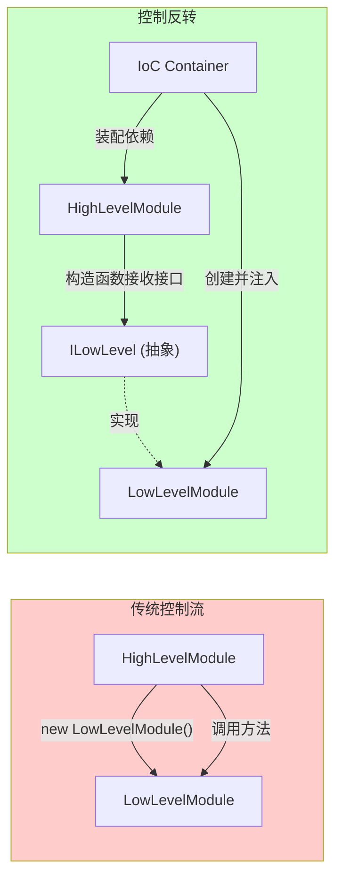
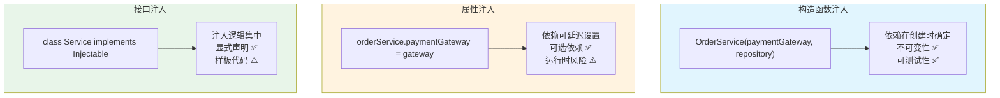
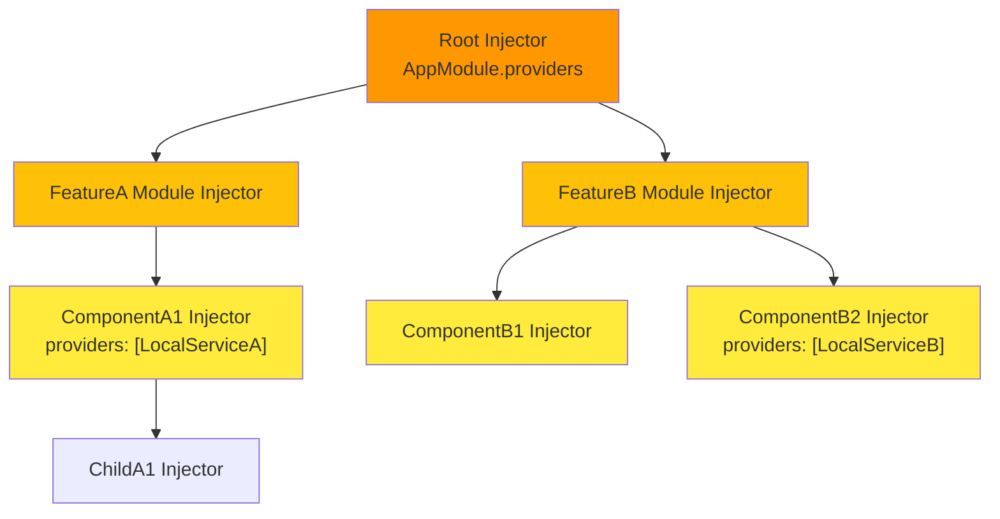
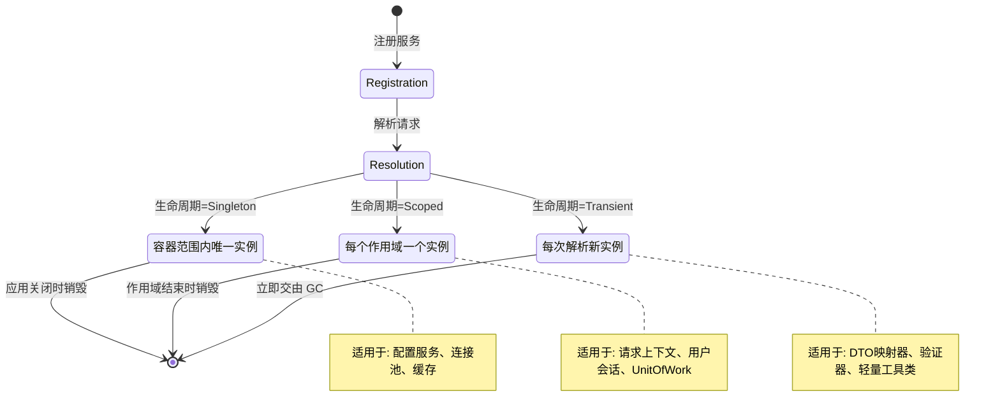

# 控制反转与依赖注入：框架的生命线

## 引言

控制反转（Inversion of Control, IoC）是现代软件框架设计的基石原则。从 Spring Framework 的企业级 Java 世界，到 Angular 的前端平台，再到 NestJS 的服务端 Node.js 架构，IoC 与依赖注入（Dependency Injection, DI）构成了这些框架的「生命线」——它们决定了组件如何被发现、如何组装、如何协作，以及如何在复杂的依赖图中保持可测试性与可维护性。

在 JavaScript/TypeScript 生态中，IoC 的实践呈现出有趣的二元性：一方面，Angular 与 NestJS 提供了与 Java Spring 相媲美的重量级 DI 系统；另一方面，React 的 Context API 与 Vite 的插件钩子则展示了轻量级、约定驱动的控制反转模式。理解 IoC 的形式化本质，有助于工程师在「过度设计」与「设计不足」之间找到恰当的平衡点。

本文从形式化定义出发，系统阐述 IoC 与 DI 的理论体系，并深度映射到 TS/JS 生态中的关键实现。

---

## 理论严格表述

### 2.1 控制反转（IoC）的形式化定义

设系统由组件集合 \(C = \{c_1, c_2, ..., c_n\}\) 构成，组件间的依赖关系为偏序集 \((C, \prec)\)，其中 \(c_i \prec c_j\) 表示 \(c_i\) 依赖于 \(c_j\)。

**传统控制流**中，高层组件 \(c_{high}\) 直接创建并调用低层组件 \(c_{low}\)：

$$
c_{high} \xrightarrow{create} c_{low} \xrightarrow{invoke} method(c_{low})
$$

这导致高层组件与低层组件的具体实现紧耦合。

**控制反转**将组件的创建与装配控制权从组件自身转移至外部容器或框架：

$$
Container: (C, \prec) \rightarrow Assembly(C)
$$

其中 \(Assembly(C)\) 表示满足所有依赖关系的组件装配结果。组件不再主动创建依赖，而是被动接收依赖。

形式化地，IoC 可定义为**控制流从应用代码向框架代码的转移**：

$$
\forall c \in C: \quad Control_{before}(c) \in Application \quad \Rightarrow \quad Control_{after}(c) \in Framework
$$

Martin Fowler 将 IoC 归纳为「Hollywood Principle」——**"Don't call us, we'll call you"**：应用代码注册到框架，框架在适当时机回调应用代码。

### 2.2 依赖注入（DI）的三种形式

依赖注入是实现 IoC 的最常用模式。根据依赖注入的方式，DI 可分为三种形式：

#### 构造函数注入（Constructor Injection）

依赖通过组件的构造函数参数传入：

```typescript
class OrderService {
  constructor(
    private paymentGateway: PaymentGateway,
    private orderRepository: OrderRepository,
    private eventBus: EventBus
  ) {}
}
```

形式化地，设组件 \(c\) 的依赖集合为 \(D(c) = \{d_1, d_2, ..., d_m\}\)，构造函数注入定义为：

$$
constructor: D(c) \rightarrow Instance(c)
$$

**优势**：依赖在对象创建时即完整声明，不可变性得以保证；便于单元测试时的 mock 替换。

**劣势**：依赖过多时构造函数参数列表冗长。

#### 属性注入（Property/Setter Injection）

依赖通过属性 setter 或公共属性在对象创建后注入：

```typescript
class OrderService {
  paymentGateway!: PaymentGateway;

  setPaymentGateway(gateway: PaymentGateway) {
    this.paymentGateway = gateway;
  }
}
```

形式化地：

$$
setter_i: d_i \rightarrow Instance(c) \quad \forall d_i \in D(c)
$$

**优势**：可选依赖可延迟注入；支持循环依赖（需谨慎）。

**劣势**：对象可能在部分依赖未注入时被使用，导致运行时错误；不可变性被破坏。

#### 接口注入（Interface Injection）

组件实现特定接口，容器通过该接口注入依赖：

```typescript
interface Injectable {
  inject(dependencies: DependencyMap): void;
}

class OrderService implements Injectable {
  inject(deps: DependencyMap) {
    this.paymentGateway = deps.get('PaymentGateway');
  }
}
```

形式化地：

$$
inject: Container \times Interface_{injectable} \rightarrow Instance(c)
$$

**优势**：注入逻辑集中，显式声明注入点。

**劣势**：需额外定义注入接口，在 TS/JS 中较少使用。

### 2.3 服务定位器模式 vs 纯 DI

服务定位器（Service Locator）是另一种实现 IoC 的模式，与纯 DI 存在本质区别：

**服务定位器**：

```typescript
class OrderService {
  private paymentGateway = ServiceLocator.resolve('PaymentGateway');
}
```

形式化地，服务定位器是一个全局可访问的依赖注册表：

$$
ServiceLocator: Key \rightarrow Instance
$$

**对比分析**：

| 维度 | 依赖注入 | 服务定位器 |
|------|---------|-----------|
| 依赖显式性 | 构造函数显式声明 | 隐藏在实现内部 |
| 可测试性 | 直接传入 mock | 需配置全局注册表 |
| 耦合程度 | 仅依赖接口 | 额外依赖 ServiceLocator |
| 编译时检查 | TS 类型系统可检查 | 运行时字符串 key 查找 |
| 适用场景 | 大型应用、框架内部 | 小型应用、遗留系统迁移 |

Martin Fowler 明确指出：「服务定位器的问题在于它把依赖隐藏在了实现中，而依赖注入的依赖则显式地暴露在组件的 public interface 中。」在 TS 这样具备强大类型系统的语言中，**纯 DI 几乎总是优于服务定位器**。

### 2.4 IoC 容器的生命周期管理

IoC 容器不仅负责依赖的装配，还管理组件的生命周期。三种核心生命周期模式：

#### Singleton（单例）

容器范围内仅存在一个实例：

$$
\forall req: \quad Container.resolve(T) = instance_T \quad \text{where} \quad |\{instance_T\}| = 1
$$

适用于无状态服务、配置对象、数据库连接池等。

#### Scoped（作用域内单例）

在特定作用域（如 HTTP 请求、组件树分支）内单例：

$$
\forall req \in Scope_s: \quad Container_s.resolve(T) = instance_{T,s}
$$

不同作用域拥有独立的实例。适用于需要请求级隔离的服务，如用户会话、请求上下文等。

#### Transient（瞬态）

每次解析都创建新实例：

$$
\forall req_i, req_j: \quad Container.resolve(T, req_i) \neq Container.resolve(T, req_j)
$$

适用于轻量级、无共享状态的对象，如 DTO 映射器、验证器等。

**生命周期依赖约束**：

容器必须保证生命周期依赖的合法性：

$$
Lifetime(dependency) \geq Lifetime(dependent)
$$

即：依赖的生命周期不得短于依赖者的生命周期。否则会出现「已释放依赖」问题（如 Singleton 依赖 Transient，导致 Transient 被意外共享）。

### 2.5 装饰器模式与元数据反射

TypeScript 的实验性装饰器（Decorators）为 IoC 提供了声明式的元数据标注能力：

```typescript
@Injectable()
class OrderService {
  constructor(
    @Inject('PaymentGateway') private paymentGateway: IPaymentGateway,
    @Inject('OrderRepository') private orderRepository: IOrderRepository
  ) {}
}
```

#### 装饰器的形式化语义

装饰器是一个高阶函数，接收目标对象并返回增强后的对象：

$$
Decorator: Target \rightarrow Target'
$$

在 DI 上下文中，装饰器主要完成两类工作：

1. **类型标记**：`@Injectable()` 标记类可被容器实例化
2. **参数标记**：`@Inject(token)` 覆盖基于类型的自动注入，显式指定注入令牌

#### Reflect Metadata API

TS 编译器在启用 `emitDecoratorMetadata` 时，会自动生成设计时类型信息：

```typescript
// 编译后生成的元数据
Reflect.metadata('design:paramtypes', [PaymentGateway, OrderRepository])
```

IoC 容器在运行时读取这些元数据，实现**基于类型的自动注入**：

$$
AutoInject: Reflect.getMetadata('design:paramtypes', Target) \rightarrow D(c)
$$

这使得容器能够自动推断构造函数参数的类型，无需显式 `@Inject` 标注（只要类型到实现的映射在容器中已注册）。

### 2.6 控制反转与好莱坞原则

Hollywood Principle——"Don't call us, we'll call you"——是 IoC 最直观的表述。在框架设计中，这一原则体现在多个层面：

1. **生命周期钩子**：框架管理组件的生命周期，在特定阶段回调应用代码（如 `onInit`、`onDestroy`、`useEffect`）
2. **事件驱动**：应用代码注册事件处理器，框架在事件发生时调用（如 DOM 事件、HTTP 路由、消息队列）
3. **插件系统**：应用代码注册插件，框架在构建/运行时调用插件的钩子函数
4. **中间件管道**：应用代码注册中间件，框架按序调用处理请求/响应

形式化地，Hollywood Principle 实现了控制流的**回调化**：

$$
Application \xrightarrow{register} Framework \xrightarrow{callback_{event}} Application
$$

---

## 工程实践映射

### 3.1 Angular 的依赖注入系统

Angular 拥有前端框架中最完整的 DI 系统，其设计直接借鉴了 Java Spring 与 .NET Core DI。

#### 层级注入器（Hierarchical Injectors）

Angular 的注入器不是单层的全局容器，而是与组件树同构的**层级结构**：

```
PlatformInjector
    └── RootInjector (AppModule)
            └── FeatureModuleInjector
                    └── ComponentInjector
                            └── ChildComponentInjector
```

当组件请求依赖时，Angular 自底向上遍历注入器层级：

```typescript
@Component({
  selector: 'app-parent',
  providers: [LocalService], // 在组件级别提供
  template: `<app-child></app-child>`
})
export class ParentComponent {}

@Component({
  selector: 'app-child',
  template: '...'
})
export class ChildComponent {
  constructor(private localService: LocalService) {}
  // 解析路径: ChildInjector → ParentInjector → ... → RootInjector
}
```

**作用域控制**：通过在不同层级声明 `providers`，可实现精确的作用域隔离。例如，将用户会话服务放在路由级别提供，使得不同路由拥有独立的会话实例。

#### 树摇优化与 `@Injectable({ providedIn: 'root' })`

Angular 6+ 引入了 `providedIn` 语法，将服务的注册信息内聚到服务类本身：

```typescript
@Injectable({
  providedIn: 'root' // 自动在 RootInjector 注册
})
export class UserService { }
```

这一设计使得 Angular 编译器（AOT）能够：

1. **静态分析依赖图**：确定哪些服务被实际使用
2. **自动树摇**：未使用的服务不会进入最终 bundle
3. **懒加载优化**：`providedIn: SomeModule` 使服务仅在模块加载时注册

#### 多实例注入与注入令牌

Angular 通过 `InjectionToken` 支持非类依赖的注入：

```typescript
export const API_CONFIG = new InjectionToken<ApiConfig>('api.config');

// 模块注册
@NgModule({
  providers: [
    { provide: API_CONFIG, useValue: { baseUrl: 'https://api.example.com', timeout: 5000 } }
  ]
})
export class AppModule {}

// 组件消费
@Component({...})
export class ApiComponent {
  constructor(@Inject(API_CONFIG) private config: ApiConfig) {}
}
```

#### 多提供者（Multi Providers）

Angular 支持同一令牌绑定多个实现：

```typescript
@NgModule({
  providers: [
    { provide: HTTP_INTERCEPTORS, useClass: AuthInterceptor, multi: true },
    { provide: HTTP_INTERCEPTORS, useClass: LoggingInterceptor, multi: true },
    { provide: HTTP_INTERCEPTORS, useClass: ErrorInterceptor, multi: true }
  ]
})
export class AppModule {}
```

这实现了**拦截器模式**的声明式配置，是控制反转在 HTTP 客户端层面的典型应用。

### 3.2 TS 实验性装饰器与 reflect-metadata

TypeScript 的实验性装饰器系统为 DI 提供了编译时元数据支持：

```typescript
import 'reflect-metadata';

const INJECTABLE_KEY = Symbol('injectable');

function Injectable() {
  return function(target: any) {
    Reflect.defineMetadata(INJECTABLE_KEY, true, target);
    return target;
  };
}

function Inject(token: any) {
  return function(target: any, propertyKey: string | undefined, parameterIndex: number) {
    const existingTokens = Reflect.getMetadata('inject:tokens', target) || [];
    existingTokens[parameterIndex] = token;
    Reflect.defineMetadata('inject:tokens', existingTokens, target);
  };
}

@Injectable()
class DatabaseService {
  connect() { return 'connected'; }
}

@Injectable()
class UserRepository {
  constructor(@Inject(DatabaseService) private db: DatabaseService) {}
}
```

**装饰器提案演进**：

- TS 的 legacy decorators 基于 2014 年的装饰器提案（Stage 2 后停滞）
- ECMAScript Decorators 提案（2022-2023）已进入 Stage 3，语义有重大变化
- TS 5.0+ 支持 `experimentalDecorators: false` 下的标准装饰器
- 元数据方案从 `reflect-metadata` 向 `Decorator Metadata`（ES2023）迁移

框架库需要关注这一演进。Angular 已计划在未来版本迁移到标准装饰器。

### 3.3 InversifyJS 的 IoC 容器

InversifyJS 是 TypeScript 生态中最成熟的独立 IoC 容器，深受 .NET Core DI 启发：

```typescript
import { Container, injectable, inject } from 'inversify';
import 'reflect-metadata';

// 定义标识符
const TYPES = {
  Warrior: Symbol.for('Warrior'),
  Weapon: Symbol.for('Weapon'),
  ThrowableWeapon: Symbol.for('ThrowableWeapon')
};

// 接口
interface Warrior {
  fight(): string;
  sneak(): string;
}

interface Weapon {
  hit(): string;
}

interface ThrowableWeapon {
  throw(): string;
}

// 实现
@injectable()
class Katana implements Weapon {
  hit() { return 'cut!'; }
}

@injectable()
class Shuriken implements ThrowableWeapon {
  throw() { return 'hit!'; }
}

@injectable()
class Ninja implements Warrior {
  constructor(
    @inject(TYPES.Weapon) private katana: Weapon,
    @inject(TYPES.ThrowableWeapon) private shuriken: ThrowableWeapon
  ) {}

  fight() { return this.katana.hit(); }
  sneak() { return this.shuriken.throw(); }
}

// 容器配置
const container = new Container();
container.bind<Warrior>(TYPES.Warrior).to(Ninja);
container.bind<Weapon>(TYPES.Weapon).to(Katana);
container.bind<ThrowableWeapon>(TYPES.ThrowableWeapon).to(Shuriken);

// 解析
const ninja = container.get<Warrior>(TYPES.Warrior);
console.log(ninja.fight()); // cut!
```

**InversifyJS 的核心特性**：

1. **基于 Symbol 的绑定**：避免字符串 key 的命名冲突
2. **生命周期管理**：`.inSingletonScope()`、`.inTransientScope()`、`.inRequestScope()`
3. **自动工厂**：`.toAutoFactory()` 生成工厂函数
4. **多注入**：`.toConstantValue()`、`.toDynamicValue()`
5. **中间件**：支持 AOP 风格的拦截器

```typescript
// 生命周期配置
container.bind<Weapon>(TYPES.Weapon).to(Katana).inSingletonScope();
container.bind<ThrowableWeapon>(TYPES.ThrowableWeapon).to(Shuriken).inTransientScope();

// 条件绑定
container.bind<Weapon>(TYPES.Weapon).to(Katana).whenTargetNamed('strong');
container.bind<Weapon>(TYPES.Weapon).to(Bokken).whenTargetNamed('weak');
```

### 3.4 TSyringe 的 DI 实现

TSyringe 是微软开发的轻量级 DI 容器，设计更为简洁：

```typescript
import 'reflect-metadata';
import { container, injectable, inject, singleton } from 'tsyringe';

@singleton() // 等效于 @injectable() + 单例生命周期
class Database {
  connect() { return 'db connection'; }
}

@injectable()
class UserService {
  constructor(@inject('Database') private db: Database) {}
  getUsers() { return this.db.connect(); }
}

// 注册别名
container.register('Database', { useClass: Database });

// 解析
const userService = container.resolve(UserService);
```

**TSyringe 与 InversifyJS 的对比**：

| 特性 | InversifyJS | TSyringe |
|------|------------|----------|
| 绑定 API | 显式 `.bind().to()` | 隐式 `@singleton()` + `container.register()` |
| 配置复杂度 | 较高 | 较低 |
| 元数据依赖 | `reflect-metadata` | `reflect-metadata` |
| 维护活跃度 | 中等 | 微软维护，较活跃 |
| 包大小 | ~50KB | ~15KB |

对于中小型项目，TSyringe 的简洁性更具吸引力；对于需要精细控制的大型项目，InversifyJS 的功能更丰富。

### 3.5 NestJS 的模块化 DI 架构

NestJS 将 Angular 的 DI 哲学引入 Node.js 服务端开发，其模块化设计是 IoC 原则的极致体现：

```typescript
// cats.service.ts
@Injectable()
export class CatsService {
  private readonly cats: Cat[] = [];

  create(cat: Cat) { this.cats.push(cat); }
  findAll(): Cat[] { return this.cats; }
}

// cats.controller.ts
@Controller('cats')
export class CatsController {
  constructor(private catsService: CatsService) {}

  @Post()
  create(@Body() createCatDto: CreateCatDto) {
    this.catsService.create(createCatDto);
  }

  @Get()
  findAll(): Cat[] {
    return this.catsService.findAll();
  }
}

// cats.module.ts
@Module({
  controllers: [CatsController],
  providers: [CatsService],
  exports: [CatsService]
})
export class CatsModule {}

// app.module.ts
@Module({
  imports: [CatsModule],
})
export class AppModule {}
```

**NestJS 的 IoC 设计亮点**：

1. **模块即边界**：`@Module()` 定义了封装边界，内部 providers 默认不对外暴露
2. **全局模块**：`@Global()` 使模块的 exports 在所有其他模块中可用（谨慎使用）
3. **动态模块**：`forRoot()`、`forFeature()` 支持运行时配置注入
4. **自定义提供者**：`useValue`、`useClass`、`useFactory`、`useExisting` 提供灵活的绑定方式

```typescript
// 动态模块：配置驱动的提供者
@Module({})
export class ConfigModule {
  static forRoot(config: ConfigOptions): DynamicModule {
    return {
      module: ConfigModule,
      providers: [
        { provide: 'CONFIG_OPTIONS', useValue: config },
        ConfigService,
      ],
      exports: [ConfigService],
    };
  }
}

// 使用
@Module({
  imports: [ConfigModule.forRoot({ folder: './config' })],
})
export class AppModule {}
```

NestJS 的 DI 系统深度集成了 Express/Fastify，使得 HTTP 请求处理管道中的每个环节（Guard、Interceptor、Pipe、Filter）都可声明依赖，实现了横切关注点的干净分离。

### 3.6 React 的 Context API 作为轻量级 DI

React 没有传统 IoC 容器，但 Context API 实现了轻量级的依赖提供/消费模式：

```tsx
// 创建上下文（等效于 InjectionToken）
const ThemeContext = createContext<Theme>('light');

// Provider：等效于 IoC 容器的注册
function App() {
  return (
    <ThemeContext.Provider value="dark">
      <Toolbar />
    </ThemeContext.Provider>
  );
}

// Consumer：等效于 IoC 容器的解析
function ThemedButton() {
  const theme = useContext(ThemeContext); // 依赖注入点
  return <button className={theme}>Click me</button>;
}
```

**Context API 作为 DI 的映射**：

| IoC 概念 | React Context 映射 |
|---------|-------------------|
| InjectionToken | `createContext<T>(defaultValue)` |
| Provider 注册 | `<MyContext.Provider value={...}>` |
| 容器解析 | `useContext(MyContext)` |
| 作用域 | 组件子树（Provider 的 children） |
| 生命周期 | 与组件树生命周期绑定 |

**Context API 的局限性**：

1. **无生命周期管理**：Context 值变化即触发重渲染，无 Singleton/Scoped/Transient 区分
2. **无接口抽象**：依赖具体实现，而非接口（需借助 TS 类型定义模拟）
3. **无自动装配**：需手动在组件中 `useContext`，无法构造函数自动注入
4. **重渲染问题**：默认所有消费者在 Context 值变化时重渲染，需配合 `useMemo`/`React.memo` 优化

```tsx
// 模拟接口注入：通过类型定义 + 工厂函数
interface IPaymentService {
  process(amount: number): Promise<void>;
}

const PaymentServiceContext = createContext<IPaymentService | null>(null);

function usePaymentService(): IPaymentService {
  const service = useContext(PaymentServiceContext);
  if (!service) throw new Error('PaymentService not provided');
  return service;
}
```

### 3.7 Vite 的插件系统作为控制反转

Vite 的插件系统完美诠释了 Hollywood Principle——框架定义钩子，插件注册回调：

```typescript
// vite.config.ts
import { defineConfig } from 'vite';

export default defineConfig({
  plugins: [
    {
      name: 'my-plugin',
      // 构建开始时调用
      buildStart() {
        console.log('Build starting...');
      },
      // 解析 id 时调用
      resolveId(source) {
        if (source === 'virtual:my-module') {
          return source; // 声明对此 id 负责
        }
      },
      // 加载模块时调用
      load(id) {
        if (id === 'virtual:my-module') {
          return 'export default "Hello from virtual module"';'
        }
      },
      // 转换代码时调用
      transform(code, id) {
        if (id.endsWith('.ts')) {
          return code.replace(/console\.log/g, '// console.log');
        }
      },
      // 构建结束时调用
      buildEnd() {
        console.log('Build complete.');
      }
    }
  ]
});
```

**Vite 插件钩子的 IoC 本质**：

| 钩子 | 控制反转点 | 框架调用时机 |
|------|-----------|-------------|
| `config` | 修改 Vite 配置 | 配置解析阶段 |
| `configureServer` | 扩展开发服务器 | 服务器启动时 |
| `resolveId` | 自定义模块解析 | 遇到未知 import 时 |
| `load` | 自定义模块加载 | 模块需要加载时 |
| `transform` | 代码转换 | 模块编译时 |
| `buildStart`/`buildEnd` | 构建生命周期 | 构建开始/结束时 |

Vite 的插件系统基于 Rollup 插件 API，但扩展了特定于开发服务器的钩子。这种钩子机制使得 Vite 的核心保持精简，而功能通过插件生态无限扩展——这正是控制反转的威力所在。

### 3.8 对比：Angular 的重量级 DI vs React 的轻量级 Provider

| 维度 | Angular DI | React Context |
|------|-----------|---------------|
| **容器类型** | 层级注入器树 | 组件子树 |
| **注册方式** | `@NgModule.providers` / `@Component.providers` | `<Context.Provider>` |
| **解析方式** | 构造函数自动注入 | `useContext()` 手动消费 |
| **生命周期** | Singleton / Scoped / Transient | 与组件生命周期绑定 |
| **接口支持** | 基于抽象类/InjectionToken | 基于 TypeScript 类型（编译时） |
| **循环依赖** | 支持（通过 `forwardRef`） | 天然支持（运行时树结构） |
| **树摇优化** | AOT 编译器支持 | 依赖 bundler（esbuild/rollup） |
| **测试友好度** | `TestBed` 提供完整测试替身 | 需手动 mock Provider |
| **学习曲线** | 陡峭 | 平缓 |
| **适用规模** | 大型、长期维护的企业应用 | 中小型应用、组件库 |

Angular 的 DI 系统是一个**完备的企业级解决方案**，其层级注入器、生命周期管理、多提供者等特性使其能够支撑超大规模应用的依赖管理。而 React 的 Context API 是一个**最小可行的依赖传递机制**，它有意保持简单，将复杂的状态管理委托给外部库（Redux、Zustand、Jotai 等）。

这两种哲学并无绝对优劣，关键在于**与问题复杂度相匹配**。对于需要严格架构治理的大型团队，Angular 的重量级 DI 提供了必要的约束与一致性；对于追求灵活与快速迭代的小团队，React 的轻量级方案配合约定式架构同样有效。

---

## Mermaid 图表

### 图1：IoC 控制流反转示意图



### 图2：依赖注入三种形式对比



### 图3：Angular 层级注入器树



### 图4：IoC 容器生命周期模型



---

## 理论要点总结

1. **控制反转是框架设计的元原则**。它将组件的创建、装配与生命周期管理从应用代码转移至框架，实现了「Don't call us, we'll call you」的 Hollywood Principle。IoC 不仅适用于 DI，还体现在事件驱动、生命周期钩子、插件系统、中间件管道等多个维度。

2. **依赖注入是 IoC 最主流的实现模式**。构造函数注入因显式声明、不可变性与测试友好性而成为首选；属性注入适用于可选依赖与循环依赖场景；接口注入在 TS/JS 生态中较少使用，因为语言本身无接口运行时表示。

3. **IoC 容器的核心价值在于生命周期管理**。Singleton、Scoped、Transient 三种生命周期模式配合层级注入器，使得依赖的作用域可精确控制。生命周期依赖约束（依赖者生命周期 ≤ 依赖生命周期）是避免「已释放依赖」bug 的关键。

4. **装饰器与反射元数据使声明式 DI 成为可能**。TypeScript 的 `emitDecoratorMetadata` 配合 `reflect-metadata`，使容器能够基于类型自动推断依赖关系。但随着标准装饰器提案的推进，元数据方案正在向 ES Decorator Metadata 迁移。

5. **DI 的重量级与轻量级之争反映了架构哲学的分歧**。Angular/NestJS 的完备 DI 系统提供了企业级的治理能力与一致性，但带来学习曲线与运行时开销；React Context 的轻量级方案简单直接，但缺乏生命周期管理与自动装配能力。选择应匹配团队规模、应用复杂度与维护周期。

---

## 参考资源

1. **Martin Fowler, "Inversion of Control Containers and the Dependency Injection pattern" (2004)** —— IoC 与 DI 领域的奠基性文章，系统阐述了 Service Locator 与 Dependency Injection 的区别，提出了 Constructor Injection、Setter Injection、Interface Injection 三种形式，并给出了清晰的选择建议。详见 [martinfowler.com](https://martinfowler.com/articles/injection.html)。

2. **Robert C. Martin, "Agile Software Development: Principles, Patterns, and Practices" (2002)** —— 第 11 章「Dependency-Inversion Principle (DIP)」提出了依赖倒置原则——「高层模块不应依赖低层模块，二者都应依赖抽象」。这一原则为 IoC 与 DI 提供了设计原则层面的理论基础。

3. **Erich Gamma et al., "Design Patterns: Elements of Reusable Object-Oriented Software" (1994)** —— GoF 经典设计模式中的「依赖倒置」思想（虽未直接命名 DI）、工厂模式、抽象工厂模式、策略模式等，构成了 IoC 容器实现的底层模式语言。

4. **Angular Dependency Injection Documentation** —— Angular 官方文档对层级注入器、生命周期钩子、`providedIn` 树摇优化、多提供者等特性的系统性阐述，是前端领域最完备的 DI 实现参考。详见 [angular.io/guide/dependency-injection](https://angular.io/guide/dependency-injection)。

5. **NestJS Documentation: Providers** —— NestJS 官方文档对模块化 DI 架构、自定义提供者、动态模块、循环依赖处理等高级特性的详细说明，展示了服务端 TypeScript 应用中 IoC 的最佳实践。详见 [docs.nestjs.com/providers](https://docs.nestjs.com/providers)。
