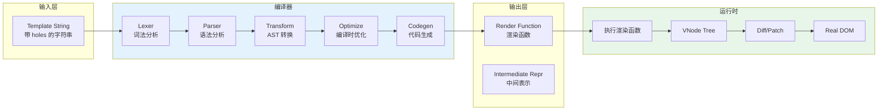
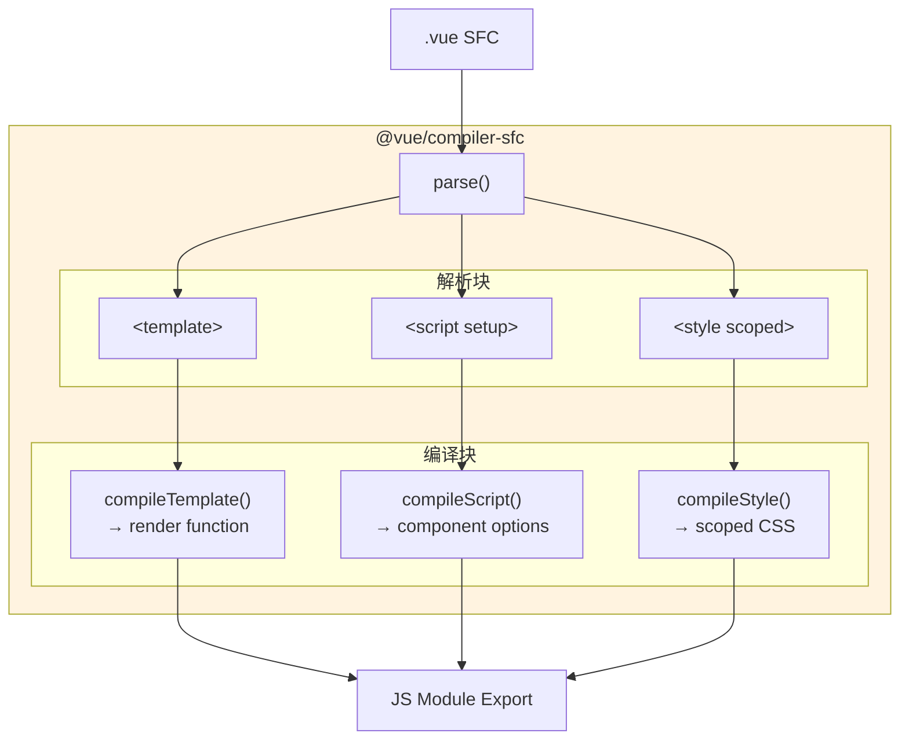
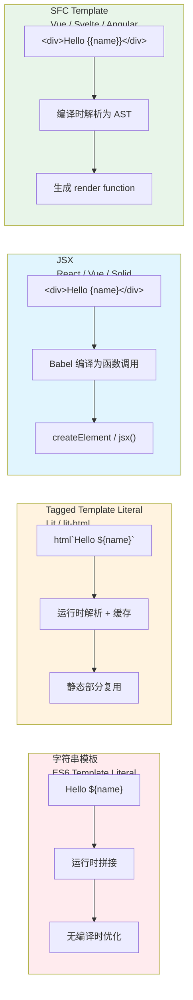

# 模板引擎理论：从字符串到 AST

## 引言

模板引擎是连接「声明式 UI 描述」与「命令式 DOM 操作」的核心桥梁。无论是 Vue 的单文件组件（SFC）中的 `<template>` 块，React 的 JSX 语法糖，还是 Svelte 的类 HTML 模板，其底层都遵循着一条共同的主线：**将类 HTML 字符串解析为抽象语法树（AST），再编译为可执行的渲染代码**。

理解模板引擎的理论基础，不仅有助于我们洞察各框架的性能特征与优化空间，更能在框架选型时做出基于编译原理的理性判断。本文从模板的形式化定义出发，沿着「字符串 → 词法/语法分析 → AST → 中间表示 → 目标代码」的编译管线，系统阐述模板引擎的理论体系，并深度映射到 Vue、Angular、Svelte、Lit 与 JSX 的工程实现。

---

## 理论严格表述

### 2.1 模板的形式化定义

模板（Template）可形式化定义为**带 holes（孔洞）的字符串**。设字母表为 \(\Sigma\)（包含 HTML 标签、属性、文本字符等），holes 集合为 \(H\)，则模板 \(T\) 是 \((\Sigma \cup H)^*\) 上的字符串：

$$
T \in (\Sigma \cup H)^*
$$

其中每个 hole \(h \in H\) 是一个占位符，在渲染时由运行时数据填充。例如：

```html
<div class="{{className}}">
  <h1>{{title}}</h1>
  <p>{{content}}</p>
</div>
```

在此模板中，`{{className}}`、`{{title}}`、`{{content}}` 即为 holes，分别对应数据模型中的字段。

更严格地，设数据模型为 \(D\)，渲染函数为 \(Render\)，则模板渲染定义为：

$$
Render: T \times D \rightarrow HTML
$$

即渲染函数以模板和数据为输入，输出最终的 HTML 字符串或 DOM 结构。

### 2.2 模板引擎的分类：逻辑-less vs 逻辑-full

根据模板中允许表达的控制逻辑丰富度，模板引擎可分为两大类：

#### 逻辑-less 模板（Logic-less Templates）

逻辑-less 模板严格限制模板中的控制流表达，仅保留最基本的变量插值与简单的条件/循环块。其哲学是**将逻辑保留在控制器/视图模型中**，模板仅负责「展示什么」，不负责「如何决定展示什么」。

形式化地，逻辑-less 模板的操作集 \(Ops_{less}\) 为：

$$
Ops_{less} = \{ \text{interpolation}, \text{section}, \text{inverted-section}, \text{comment} \}
$$

代表：Mustache、Handlebars、Django 模板、Jinja2 等。

**优势**：

- 强制分离关注点，避免模板成为「意大利面条代码」
- 非程序员（如设计师）可安全编辑
- 易于在服务端预渲染（无任意代码执行风险）

**劣势**：

- 复杂 UI 需要大量辅助数据准备
- 灵活性受限，某些场景需要变通方案

#### 逻辑-full 模板（Logic-full Templates）

逻辑-full 模板允许在模板中嵌入完整的编程语言表达式，包括任意条件、循环、函数调用甚至副作用操作。

形式化地，逻辑-full 模板的操作集 \(Ops_{full}\) 为：

$$
Ops_{full} = Ops_{less} \cup \{ \text{if/else}, \text{for/while}, \text{function-call}, \text{assignment}, \text{event-binding} \}
$$

代表：Vue SFC 模板、Angular 模板、JSX、EJS、Pug 等。

**优势**：

- 表达力强，复杂 UI 可在模板内部完成
- 与组件模型天然契合（事件绑定、双向数据流）

**劣势**：

- 模板复杂度可能失控
- 需要编译器支持完整的表达式解析
- 安全性风险（XSS、任意代码执行）

### 2.3 AST（抽象语法树）解析与转换

模板编译的第一阶段是将字符串模板解析为 AST。AST 是源代码的树状抽象表示，剥离了无关的语法细节（如空白符、括号风格），保留了语义结构。

#### 词法分析（Lexical Analysis）

词法分析将模板字符串 \(T\) 转换为 token 序列：

$$
Lexer: T \rightarrow [token_1, token_2, ..., token_n]
$$

对于 HTML-like 模板，token 类型通常包括：

| Token 类型 | 示例 |
|-----------|------|
| `TagOpen` | `<div` |
| `TagClose` | `>` |
| `TagEnd` | `</div>` |
| `Attribute` | `class="foo"` |
| `Text` | `Hello` |
| `Interpolation` | `{{ expr }}` |
| `Directive` | `v-if`、`v-for` |

#### 语法分析（Syntax Analysis）

语法分析将 token 序列转换为 AST：

$$
Parser: [token_1, ..., token_n] \rightarrow AST
$$

一个简化的模板 AST 节点类型定义（TypeScript）：

```typescript
type TemplateNode =
  | ElementNode
  | TextNode
  | InterpolationNode
  | DirectiveNode;

interface ElementNode {
  type: 'Element';
  tag: string;
  props: Array<AttributeNode | DirectiveNode>;
  children: TemplateNode[];
  isSelfClosing: boolean;
}

interface TextNode {
  type: 'Text';
  content: string;
}

interface InterpolationNode {
  type: 'Interpolation';
  expression: ExpressionNode;
}

interface DirectiveNode {
  type: 'Directive';
  name: string; // 'if', 'for', 'bind', 'on'
  argument?: string;
  expression: ExpressionNode;
}
```

以模板 `<div v-if="show">{{ message }}</div>` 为例，其 AST 为：

```
ElementNode {
  tag: "div",
  props: [
    DirectiveNode {
      name: "if",
      expression: Identifier("show")
    }
  ],
  children: [
    InterpolationNode {
      expression: Identifier("message")
    }
  ]
}
```

### 2.4 模板到渲染函数的编译过程

AST 本身不可执行，需要进一步编译为目标代码。现代前端框架的编译管线通常如下：

$$
\text{Template String} \xrightarrow{Parse} AST \xrightarrow{Transform} IR \xrightarrow{Generate} \text{Render Function}
$$

其中 IR（Intermediate Representation，中间表示）是对 AST 的语义增强与优化后的形式。

#### Vue 3 的编译管线

Vue 3 的模板编译器执行以下步骤：

1. **Parse**：将模板字符串解析为 AST
2. **Transform**：遍历 AST，应用转换插件（如 `v-if` → 条件表达式、`v-for` → `renderList` 调用）
3. **Codegen**：将转换后的 AST 生成 `render` 函数代码

例如，模板：

```html
<div class="msg">{{ message }}</div>
```

编译生成的 render 函数（简化）：

```javascript
function render(_ctx, _cache) {
  return _openBlock(), _createElementBlock('div', {
    class: 'msg'
  }, _toDisplayString(_ctx.message), 1 /* TEXT */);
}
```

其中 `1 /* TEXT */` 是 patch flag，提示运行时仅需要 diff 文本内容。

#### 编译时优化（Compiler-informed Optimizations）

现代框架利用编译时信息对运行时进行优化：

1. **静态提升（Static Hoisting）**：纯静态的节点在编译时提取到渲染函数外部，避免每次渲染重新创建
2. **Patch Flags**：标记动态节点的类型（文本、class、style、props 等），运行时仅 diff 标记部分
3. **Block Tree**：将包含 `v-if`、`v-for` 的节点标记为 block，其动态子节点被收集到数组中，diff 时跳过静态子树

形式化地，设模板节点集合为 \(N\)，动态节点子集为 \(N_{dyn} \subseteq N\)，则优化后的 diff 复杂度从 \(O(|N|)\) 降至 \(O(|N_{dyn}|)\)：

$$
O_{diff}^{optimized} = O(|N_{dyn}|) \quad \text{where} \quad |N_{dyn}| \ll |N|
$$

### 2.5 虚拟 DOM 与模板的关系

虚拟 DOM（Virtual DOM）是真实 DOM 的轻量级内存表示，通常以 JavaScript 对象树的形式存在：

```typescript
interface VNode {
  type: string | Component | Symbol;
  props: Record<string, any>;
  children: VNode[] | string;
  key?: string | number;
  el?: HTMLElement; // 对应的真实 DOM 引用
}
```

模板与虚拟 DOM 的关系：**模板是虚拟 DOM 的声明式源语言**。

编译时：

$$
Template \xrightarrow{Compiler} RenderFunction \xrightarrow{execute} VNodeTree
$$

运行时：

$$
VNodeTree_{new} \xrightarrow{Diff} VNodeTree_{old} \xrightarrow{Patch} DOM
$$

虚拟 DOM 的核心价值不在于「比直接操作 DOM 更快」（事实上它增加了额外的抽象层开销），而在于：

1. **声明式编程模型**：开发者描述「UI 应该是什么样子」，而非「如何修改 DOM」
2. **跨平台能力**：同一套 VNode 可渲染到 DOM、Native（Weex/React Native）、Canvas、Terminal 等
3. **批量更新**：将多次状态变更合并为一次 DOM 更新

### 2.6 增量 DOM（Incremental DOM）理论

增量 DOM 是 Google 提出的替代虚拟 DOM 的方案，其核心思想是**将 DOM 操作内联到组件渲染函数中，直接操作真实 DOM，但通过树遍历保证更新顺序的正确性**。

形式化地，增量 DOM 的渲染函数签名如下：

```typescript
function renderComponent(data: Data): void {
  elementOpen('div');        // 打开 div，若已存在则复用
  text(data.message);         // 更新文本节点
  elementClose('div');        // 关闭 div
}
```

与虚拟 DOM 的对比：

| 维度 | Virtual DOM | Incremental DOM |
|------|------------|-----------------|
| 中间表示 | VNode 树 | 无，直接操作 DOM |
| Diff 阶段 | 对比两棵 VNode 树 | 在渲染过程中即时比较 |
| 内存占用 | 需维护 VNode 树 | 较低，无额外树结构 |
| 更新粒度 | 整棵树或子树 | 节点级 |
| 首次渲染 | 创建完整 VNode 再 mount | 边遍历边创建 |
| 适用场景 | 复杂 UI、频繁更新 | 内存受限环境、简单 UI |

增量 DOM 被 Google 的 Closure Compiler 和 Angular 的某些优化路径采用，但因其编程模型较为底层，在前端框架中不如虚拟 DOM 普及。

### 2.7 字符串模板 vs Tagged Template Literals vs JSX

JavaScript 生态中存在三种主流的模板表达方式：

#### 字符串模板（String Templates）

```javascript
const template = `
  <div class="${className}">
    <h1>${title}</h1>
  </div>
`;
```

**特征**：原生 ES6 模板字符串，运行时拼接。无编译时优化，XSS 风险高（需手动转义）。

#### Tagged Template Literals

```javascript
import { html, render } from 'lit-html';

const template = (name) => html`
  <div class="greeting">
    <h1>Hello, ${name}!</h1>
  </div>
`;

render(template('World'), document.body);
```

**特征**：`html` 标签函数在运行时解析模板字符串，生成模板对象（TemplateResult）。通过 `TemplateStringsArray` 的缓存机制，相同模板的静态部分可被复用。

形式化地，tagged template literal 的求值过程为：

$$
html(strings, ...values) = TemplateResult(strings, values)
$$

其中 `strings` 为静态部分数组，`values` 为动态表达式值。

#### JSX

```jsx
const element = (
  <div className="greeting">
    <h1>Hello, {name}!</h1>
  </div>
);
```

**特征**：JSX 是 JavaScript 的语法扩展，通过 Babel/TypeScript 编译为函数调用：

```javascript
const element = React.createElement(
  'div',
  { className: 'greeting' },
  React.createElement('h1', null, 'Hello, ', name, '!')
);
```

或（使用新的 JSX Transform）：

```javascript
import { jsx as _jsx } from 'react/jsx-runtime';
const element = _jsx('div', {
  className: 'greeting',
  children: _jsx('h1', { children: ['Hello, ', name, '!'] })
});
```

**JSX 的本质**：JSX 不是模板引擎，而是**JavaScript 表达式的语法糖**。它不预设运行时（React、Vue、Preact、Solid 均可使用），编译目标由 `pragma` 配置决定。

---

## 工程实践映射

### 3.1 Vue 的 SFC 模板编译

Vue 的单文件组件（SFC）将模板、脚本、样式封装在一个 `.vue` 文件中：

```vue
<template>
  <div class="counter">
    <button @click="decrement">-</button>
    <span>{{ count }}</span>
    <button @click="increment">+</button>
  </div>
</template>

<script setup>
import { ref } from 'vue';
const count = ref(0);
const increment = () => count.value++;
const decrement = () => count.value--;
</script>

<style scoped>
.counter { display: flex; gap: 8px; }
</style>
```

#### Vue 3 编译器的完整管线

Vue 3 的 `@vue/compiler-sfc` 将 SFC 编译为 JavaScript 模块：

```
SFC Source
    ├── <template>
    │       └── compiler-dom
    │               ├── parse() → Template AST
    │               ├── transform()
    │               │       ├── v-if → conditionalExpression
    │               │       ├── v-for → renderList()
    │               │       ├── v-model → modelValue + onUpdate:modelValue
    │               │       └── ...
    │               └── generate() → render function code
    ├── <script> / <script setup>
    │       └── @babel/parser → Script AST
    │               ├── compileScript()
    │               │       ├── <script setup> 语法糖展开
    │               │       ├── defineProps() / defineEmits() 宏替换
    │               │       └── 导出组件选项对象
    │               └── generate()
    └── <style> / <style scoped>
            └── postcss
                    ├── scoped: 添加属性选择器 [data-v-xxxx]
                    ├── css-modules: 生成 $style 映射对象
                    └── ...
```

#### Vue 的 AST 转换详解

以 `v-if` 指令为例，Vue 编译器执行以下 AST 转换：

```typescript
// 转换前 AST
ElementNode {
  tag: 'div',
  props: [DirectiveNode { name: 'if', expression: 'show' }],
  children: [TextNode { content: 'Content' }]
}

// 转换后 AST（IR）
ConditionalExpression {
  condition: Identifier('show'),
  consequent: CreateElementCall('div', {}, [TextNode('Content')]),
  alternate: CreateCommentCall('v-if')
}
```

最终生成的 render 函数：

```javascript
function render(_ctx, _cache, $props, $setup, $data, $options) {
  return _ctx.show
    ? (_openBlock(), _createElementBlock('div', { key: 0 }, 'Content'))
    : _createCommentVNode('v-if', true);
}
```

#### 编译时优化实战

Vue 3 的编译器能够识别并优化多种模式：

```vue
<template>
  <div>
    <!-- 静态节点：编译时提升到渲染函数外部 -->
    <header>
      <h1>Static Title</h1>
      <nav><a href="/">Home</a></nav>
    </header>

    <!-- 动态节点：标记 patch flag -->
    <main :class="dynamicClass">
      <!-- TEXT_CHILDREN: 仅子文本可能变化 -->
      <p>{{ message }}</p>

      <!-- FULL_PROPS: 多个动态属性 -->
      <button :id="btnId" :disabled="isDisabled" @click="handleClick">
        Click me
      </button>
    </main>
  </div>
</template>
```

编译结果中，静态的 `<header>` 部分被提取为常量，仅创建一次：

```javascript
const _hoisted_1 = /*#__PURE__*/_createElementVNode('header', null, [
  _createElementVNode('h1', null, 'Static Title'),
  _createElementVNode('nav', null, [
    _createElementVNode('a', { href: '/' }, 'Home')
  ])
], -1 /* HOISTED */);

function render(_ctx, _cache) {
  return (_openBlock(), _createElementBlock('div', null, [
    _hoisted_1, // 直接复用，无需 diff
    _createElementVNode('main', {
      class: _normalizeClass(_ctx.dynamicClass)
    }, [
      _createElementVNode('p', null, _toDisplayString(_ctx.message), 1 /* TEXT */),
      _createElementVNode('button', {
        id: _ctx.btnId,
        disabled: _ctx.isDisabled,
        onClick: _ctx.handleClick
      }, 'Click me', 8 /* PROPS */, ['id', 'disabled', 'onClick'])
    ], 2 /* CLASS */)
  ]));
}
```

### 3.2 Angular 的 JIT vs AOT 编译

Angular 提供了两种编译模式：

#### JIT（Just-In-Time，即时编译）

```typescript
// main.ts —— JIT 模式
import { platformBrowserDynamic } from '@angular/platform-browser-dynamic';
import { AppModule } from './app/app.module';

platformBrowserDynamic().bootstrapModule(AppModule);
```

JIT 模式下，模板在**浏览器端**编译：

- 需要携带 `@angular/compiler` 到客户端（~500KB+）
- 运行时解析模板字符串，生成渲染函数
- 开发体验好（快速编译），生产性能差

#### AOT（Ahead-Of-Time，预先编译）

```typescript
// main.ts —— AOT 模式（默认）
import { bootstrapApplication } from '@angular/platform-browser';
import { AppComponent } from './app/app.component';

bootstrapApplication(AppComponent);
```

AOT 模式下，模板在**构建时**编译：

- 编译器将模板直接转换为 TypeScript/JavaScript 代码
- 无需携带 compiler 到客户端，bundle 显著减小
- 编译时捕获模板错误（类型安全、无效绑定检测）
- 生产性能最优

#### Angular 编译器的内部流程

Angular 的 `@angular/compiler-cli` 执行以下步骤：

1. **NgModule 收集**：扫描所有装饰器元数据，构建模块依赖图
2. **模板解析**：将 `@Component({ template: ... })` 解析为 AST
3. **类型检查**：将模板表达式与组件类属性进行类型匹配
4. **代码生成**：生成 `ɵɵdefineComponent()` 调用，内含渲染函数
5. **树摇优化**：标记未使用的组件与管道，供 bundler 移除

Angular 的渲染函数使用 Ivy 编译器生成，采用增量 DOM 风格：

```javascript
// Angular Ivy 生成的渲染函数（简化）
function AppComponent_Template(rf, ctx) {
  if (rf & 1) { // RenderFlags.Create
    ɵɵelementStart(0, 'h1');
    ɵɵtext(1, 'Hello ');
    ɵɵelementEnd();
  }
  if (rf & 2) { // RenderFlags.Update
    ɵɵadvance(1);
    ɵɵtextInterpolate1('Hello ', ctx.name, '');
  }
}
```

Ivy 的 `ɵɵelementStart`、`ɵɵtext` 等指令直接操作渲染器，无需虚拟 DOM 中间层。

### 3.3 Svelte 的模板编译

Svelte 采取「编译时最大化」策略——在编译时将模板直接转换为命令式 DOM 操作，**不依赖虚拟 DOM**。

```svelte
<script>
  let count = 0;
  function increment() { count += 1; }
</script>

<button on:click={increment}>
  Count: {count}
</button>
```

Svelte 编译器生成如下 JavaScript 代码（简化）：

```javascript
// 创建阶段
function create_fragment(ctx) {
  let button;
  let t0;
  let t1;
  let mounted;
  let dispose;

  return {
    c() {
      button = element('button');
      t0 = text('Count: ');
      t1 = text(/*count*/ ctx[0]);
    },
    m(target, anchor) {
      insert(target, button, anchor);
      append(button, t0);
      append(button, t1);

      if (!mounted) {
        dispose = listen(button, 'click', /*increment*/ ctx[1]);
        mounted = true;
      }
    },
    p(ctx, [dirty]) {
      if (dirty & /*count*/ 1) set_data(t1, /*count*/ ctx[0]);
    },
    d(detaching) {
      if (detaching) detach(button);
      mounted = false;
      dispose();
    }
  };
}
```

**Svelte 编译策略的核心特征**：

1. **无虚拟 DOM**：直接生成 `create`、`mount`、`update`、`destroy` 阶段的命令式代码
2. **细粒度响应式**：通过编译时分析，为每个响应式变量生成独立的更新函数
3. **最小运行时**：运行时仅 ~2KB，大部分逻辑在编译时展开

形式化地，设组件状态变量为 \(S = \{s_1, s_2, ..., s_k\}\)，Svelte 编译器为每个变量 \(s_i\) 生成独立的 effect：

$$
\forall s_i \in S: \quad effect_i = f(s_i) \rightarrow DOM_{affected}
$$

当 \(s_i\) 变化时，仅执行 \(effect_i\)，而非重新渲染整棵树。这使得 Svelte 的更新开销理论上与变更变量数成正比，而非与组件树大小成正比。

### 3.4 Handlebars/Mustache 的逻辑-less 模板

Handlebars 是 Mustache 的超集，代表了逻辑-less 模板的设计哲学：

```handlebars
<!-- 模板 -->
<div class="entry">
  {{#if author}}
    <h1>{{firstName}} {{lastName}}</h1>
  {{else}}
    <h1>Unknown Author</h1>
  {{/if}}

  <div class="body">
    {{body}}
  </div>

  {{#each comments}}
    <div class="comment">
      <h2>{{subject}}</h2>
      <p>{{body}}</p>
    </div>
  {{/each}}
</div>
```

```javascript
// JavaScript 端
const template = Handlebars.compile(source);
const html = template({
  author: true,
  firstName: 'Yehuda',
  lastName: 'Katz',
  body: 'My first post!',
  comments: [
    { subject: 'Great!', body: 'Nice work!' }
  ]
});
```

**Handlebars 的编译管线**：

1. **词法分析**：将模板字符串解析为 tokens
2. **AST 构建**：生成包含 `program`、`block`、`mustache` 等节点的 AST
3. **Opcode 生成**：将 AST 转换为可执行的 opcode 序列
4. **VM 执行**：Handlebars VM 解释执行 opcode，输出字符串

Handlebars 的「helper」机制允许扩展模板的功能边界，同时保持核心模板的逻辑-less 特性：

```handlebars
{{#each items as |item|}}
  {{formatDate item.createdAt 'YYYY-MM-DD'}}
{{/each}}
```

### 3.5 Lit 的 HTML Tagged Templates

Lit（原 lit-html + LitElement）使用 JavaScript 的 tagged template literals 作为模板基础：

```typescript
import { LitElement, html, css } from 'lit';
import { customElement, property } from 'lit/decorators.js';

@customElement('simple-greeting')
export class SimpleGreeting extends LitElement {
  @property() name = 'Somebody';

  render() {
    return html`<p>Hello, ${this.name}!</p>`;
  }
}
```

**Lit 模板的工作原理**：

1. **模板缓存**：`html` 标签函数接收 `TemplateStringsArray`，利用其不可变性缓存解析结果
2. **动态值跟踪**：模板中的每个 `${expression}` 位置被标记为动态 part
3. **高效更新**：当 `render()` 被调用时，Lit 对比新旧 `TemplateResult`，仅更新变化的 part

```javascript
// Lit 内部：模板解析与更新
function render(template, container) {
  const instance = getOrCreateTemplateInstance(template);
  instance.update(template.values);
}

class TemplateInstance {
  update(values) {
    for (let i = 0; i < this.parts.length; i++) {
      const part = this.parts[i];
      const value = values[i];
      if (!part.isEqual(value)) {
        part.setValue(value);
        part.commit();
      }
    }
  }
}
```

Lit 不使用虚拟 DOM，而是基于 **DOM Part API** 的直接更新。其性能特征与 Svelte 相似——更新开销与变更部分数成正比。

### 3.6 JSX 的编译（Babel Transform）

JSX 作为 React 的标志性语法，其编译过程是理解模板引擎演变的绝佳案例。

#### 经典 JSX Transform

```jsx
// 源码
const element = <div className="foo">Hello</div>;

// Babel 编译后（经典转换）
const element = React.createElement('div', { className: 'foo' }, 'Hello');
```

每个 JSX 元素被转换为 `React.createElement(type, props, ...children)` 调用。这要求 React 必须在作用域内。

#### 新的 JSX Transform（React 17+）

```jsx
// 源码
const element = <div className="foo">Hello</div>;

// Babel 编译后（新转换）
import { jsx as _jsx } from 'react/jsx-runtime';
const element = _jsx('div', { className: 'foo', children: 'Hello' });
```

新转换的优势：

- 无需显式 `import React`
- 更小的 bundle（`jsx` 函数比 `createElement` 更轻量）
- 更好的 tree-shaking

#### JSX 与 Vue 的融合

Vue 3 也支持 JSX，通过 `@vitejs/plugin-vue-jsx` 或 `@vue/babel-plugin-jsx`：

```jsx
import { ref } from 'vue';

export default {
  setup() {
    const count = ref(0);
    return () => (
      <div class="counter">
        <button onClick={() => count.value++}>{count.value}</button>
      </div>
    );
  }
};
```

Vue 的 JSX 编译与 React 不同：

- 使用 `resolveComponent` 解析组件引用
- 支持 Vue 特定的指令（`v-show`、`v-model` 需通过辅助函数模拟）
- 可配合 Vue 的编译时优化（patch flags）

### 3.7 模板引擎性能对比

各主流模板/渲染方案的性能特征对比：

| 框架 | 编译策略 | 运行时模型 | 更新粒度 | 运行时大小 | 首次渲染 | 更新性能 |
|------|---------|-----------|---------|-----------|---------|---------|
| Vue 3 | AOT | VDOM + Patch Flags | 组件/块级 | ~22KB | 快 | 快 |
| React | AOT (Babel) | VDOM + Fiber | 组件级 | ~40KB | 快 | 快 |
| Svelte | AOT | 命令式 DOM | 变量级 | ~2KB | 极快 | 极快 |
| Solid | AOT | 细粒度响应式 | 绑定级 | ~7KB | 极快 | 极快 |
| Angular | AOT | Incremental DOM | 组件级 | ~60KB | 快 | 快 |
| Lit | 运行时缓存 | Tagged Templates + Parts | Part 级 | ~5KB | 快 | 极快 |
| Qwik | AOT | Resumable DOM | 事件级 | ~15KB | 极快 | 按需 |

**关键洞察**：

1. **编译时优化是性能的第一杠杆**：Vue 3 的 Patch Flags、Svelte 的命令式代码生成、Solid 的细粒度绑定，都是在编译时做尽可能多的工作，以换取运行时的最小开销。

2. **虚拟 DOM 不是性能最优解，但是工程最优解**：VDOM 增加了内存占用与计算开销，但它提供了声明式编程模型、跨平台能力与可预测的性能特征。在大多数应用场景下，VDOM 的「足够快」加上开发效率的提升，构成了合理的权衡。

3. **无 VDOM 方案在特定场景下具有显著优势**：Svelte、Solid、Lit 在内存受限环境（嵌入式、低端移动设备）或超高频更新场景（数据可视化、动画）下，其更低的开销与更小的 bundle 体积是决定性优势。

4. **hydration 成本正在重塑模板引擎设计**：从 Qwik 的 Resumability 到 Vue 的 `v-memo`、React 的 `useMemo`，模板引擎的设计正从「如何更快渲染」扩展到「如何更快恢复交互状态」。

---

## Mermaid 图表

### 图1：模板编译管线通用模型



### 图2：Vue SFC 编译流程



### 图3：虚拟 DOM vs 增量 DOM vs 无 VDOM

```mermaid
flowchart TB
    subgraph VDOM["Virtual DOM 方案<br/>Vue / React"]
        V1["状态变更"] --> V2["生成新 VNode 树"]
        V2 --> V3["Diff 算法<br/>对比新旧 VNode"]
        V3 --> V4["Patch DOM<br/>应用最小变更集"]
    end

    subgraph IDOM["Incremental DOM 方案<br/>Angular Ivy"]
        I1["状态变更"] --> I2["渲染函数执行<br/>elementOpen/text/elementClose"]
        I2 --> I3["即时比较节点<br/>创建或复用"]
        I3 --> I4["直接更新 DOM"]
    end

    subgraph NOVDOM["无 VDOM 方案<br/>Svelte / Solid / Lit"]
        N1["状态变更"] --> N2["触发细粒度 effect"]
        N2 --> N3["编译时生成的<br/>命令式更新函数"]
        N3 --> N4["直接更新 DOM 节点"]
    end

    style VDOM fill:#E3F2FD
    style IDOM fill:#FFF3E0
    style NOVDOM fill:#E8F5E9
```



### 图4：模板表达方式对比



---

## 理论要点总结

1. **模板是带 holes 的字符串，模板引擎是编译器**。模板引擎的核心任务是将声明式的类 HTML 字符串转换为可执行的渲染代码。这一过程遵循经典的编译管线：词法分析 → 语法分析 → AST 构建 → 转换/优化 → 代码生成。

2. **AST 是模板编译的核心中间表示**。AST 剥离了语法噪声，保留了语义结构，使得转换与优化成为可能。现代框架的模板 AST 通常包含 Element、Text、Interpolation、Directive 等节点类型。

3. **编译时优化是现代前端框架性能的第一杠杆**。静态提升、Patch Flags、Block Tree 等优化手段，将运行时的 diff 复杂度从 \(O(|N|)\) 降至 \(O(|N_{dyn}|)\)。Vue 3、Svelte、Solid 等框架的竞争本质上是编译器智能程度的竞争。

4. **虚拟 DOM 不是唯一答案，增量 DOM 与细粒度响应式提供了替代范式**。VDOM 的价值在于声明式模型与跨平台能力，但在极致性能场景下，Svelte 的命令式代码生成、Solid 的细粒度绑定、Lit 的 Part 级更新展现了更低的开销。

5. **模板表达方式的选择（字符串 / Tagged Literal / JSX / SFC）反映了编程哲学与工具链的权衡**。JSX 拥抱 JavaScript 的表达能力，SFC 追求结构化的关注点分离，Tagged Literals 在原生语法与编译优化之间寻找平衡。没有绝对的优劣，只有与团队习惯与项目约束的匹配度。

---

## 参考资源

1. **Angular Compiler Documentation** —— Angular 官方文档对 AOT/JIT 编译器、Ivy 渲染引擎、模板类型检查的详细阐述。包含编译时优化策略、 NgModule 依赖图构建、树摇实现等深度内容。详见 [angular.io/guide/aot-compiler](https://angular.io/guide/aot-compiler)。

2. **Vue 3 Compiler Documentation** —— Vue.js 官方文档对模板编译原理、AST 节点类型、编译时优化（静态提升、Patch Flags、Block Tree）的系统性说明。配合 `@vue/compiler-core` 源码阅读效果最佳。详见 [vuejs.org/guide/extras/rendering-mechanism.html](https://vuejs.org/guide/extras/rendering-mechanism.html)。

3. **Svelte Compiler Documentation** —— Svelte 官方文档对其「编译时最大化」哲学的阐述，包括如何将模板转换为命令式 DOM 操作、响应式声明的编译转换、`$:` 语句的依赖追踪代码生成等。详见 [svelte.dev/docs](https://svelte.dev/docs)。

4. **Lit Documentation** —— Google Lit 团队对 tagged template literals 渲染模型、DOM Part API、高效更新策略的文档。特别值得关注其模板缓存机制与动态值追踪实现。详见 [lit.dev/docs](https://lit.dev/docs)。

5. **React JSX Documentation** —— React 官方文档对 JSX 语法、新的 JSX Transform、Babel 插件配置的说明。JSX 虽不是模板引擎，但其作为 JavaScript 表达式的扩展，深刻影响了现代前端模板的设计方向。详见 [react.dev/learn/writing-markup-with-jsx](https://react.dev/learn/writing-markup-with-jsx)。
