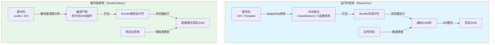
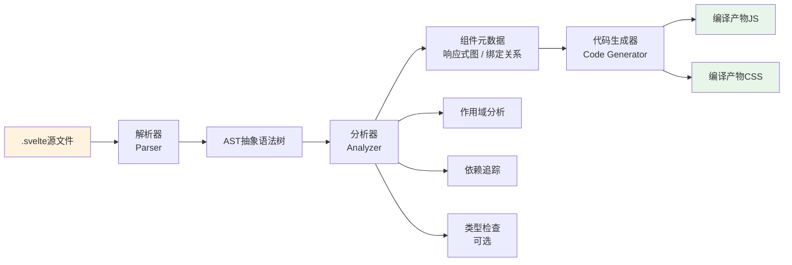
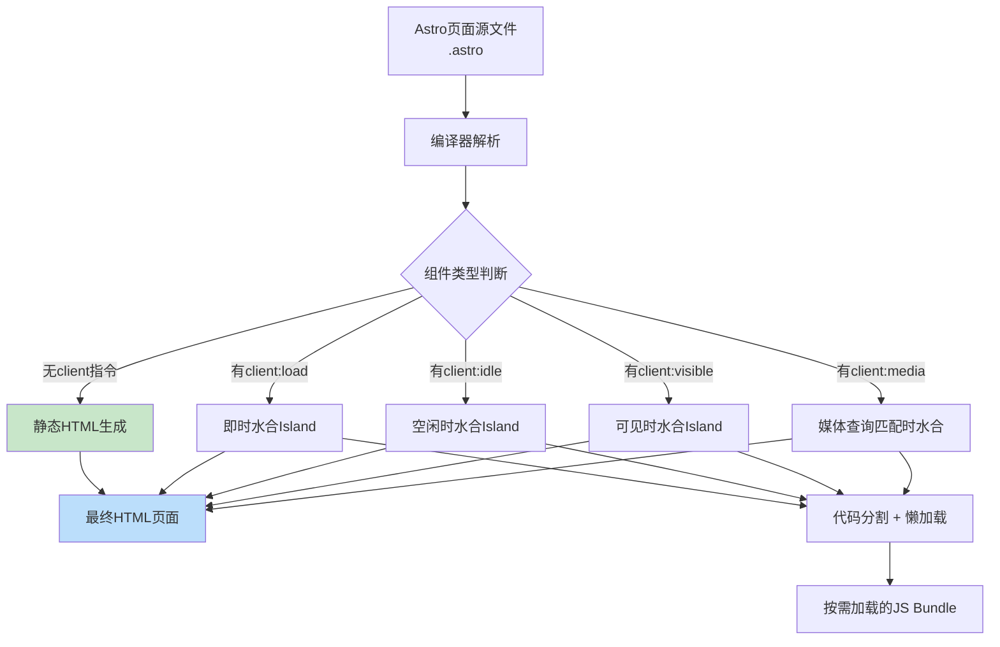

# 编译器即框架：Svelte/Astro模式

## 引言

前端工程领域长期以来存在一个隐含的假设：用户界面框架必须在运行时维持一个完整的抽象层，通过虚拟DOM（Virtual DOM）或其他运行时机制来管理状态变更与视图更新。React、Vue、Angular等主流框架均遵循这一范式，将组件描述转换为可在运行时解释执行的中间表示，再借由diff算法或响应式追踪系统完成DOM的增量更新。然而，这一范式并非唯一路径。

2016年，Rich Harris发布的Svelte框架首次系统性地提出了"编译器即框架"（Compiler as Framework）的理念，将框架的核心逻辑从运行时迁移至编译时。随后，Astro、Solid.js、Stencil等框架沿此路径深化发展，形成了与运行时框架截然不同的技术谱系。这些框架的共同特征是：在构建阶段（build time）将声明式组件代码编译为高度优化的命令式DOM操作，从而在运行时消除框架本身的运行时开销，实现接近手写原生JavaScript的性能表现。

本文从理论严格表述与工程实践映射两个维度，系统剖析编译器即框架范式的核心机制、优化边界、类型安全保证及其工程适用性。

## 理论严格表述

### 编译时框架 vs 运行时框架的理论区分

从计算理论视角审视，用户界面框架可形式化为一个二元组 $\mathcal{F} = (\mathcal{C}, \mathcal{R})$，其中 $\mathcal{C}$ 表示组件描述语言（Component Description Language），$\mathcal{R}$ 表示运行时执行引擎（Runtime Execution Engine）。在此形式化框架下，运行时框架与编译时框架的根本差异体现在 $\mathcal{R}$ 的复杂度与存在性上。

**运行时框架**（如React、Vue）的特征是：$\mathcal{R}$ 是一个在浏览器环境中完整部署的、具有非平凡复杂度的解释器或虚拟机。组件代码在编译阶段仅完成词法/语法层面的转换（如JSX转译、模板编译），生成对运行时API的调用代码。运行时引擎负责维护组件树状态、执行diff算法、调度更新任务等核心职责。其执行模型可形式化为：

$$\text{Output} = \mathcal{R}(\mathcal{C}, \text{State}, t)$$

其中 $t$ 表示时间维度，State 为应用状态。运行时框架的优势在于灵活性——任何在编译时无法确定的动态行为均可在运行时由 $\mathcal{R}$ 处理。但其代价是运行时包体积与执行开销。

**编译时框架**（如Svelte、Astro、Solid.js）的特征是：$\mathcal{R}$ 被极大简化甚至趋近于空集 $\varnothing$。编译器在构建阶段对组件代码执行深度静态分析，将声明式描述直接转换为针对特定状态变更路径优化的命令式代码。编译后的输出不再依赖框架运行时，而是直接操作浏览器原生API（如 `document.createElement`、`element.textContent` 等）。其执行模型可形式化为：

$$\text{Output} = \text{Compile}(\mathcal{C}) \oplus \text{State}$$

其中 $\text{Compile}$ 表示编译函数，$\oplus$ 表示编译产物与状态的简单组合（通常通过细粒度的订阅-发布机制实现）。

这两种范式的根本分野在于**计算发生的时间维度**：运行时框架将计算推迟至用户设备上执行，而编译时框架将尽可能多的计算前移至构建服务器上完成。从计算复杂性理论角度，二者在表达能力上是等价的（均可描述相同的UI状态空间），但在时空权衡（Time-Space Tradeoff）上呈现显著差异。

### 「零运行时」的语义保证

"零运行时"（Zero Runtime）是编译器框架倡导者常用的表述，但从严格理论角度，这一术语需要精确界定。绝对意义上的"零运行时"意味着编译产物仅包含纯JavaScript语法，不引入任何框架特定的运行时库。然而，即使是最激进的编译器框架（如Svelte），其编译产物仍可能包含轻量级的响应式运行时（如Svelte 5的Runes系统），用于管理细粒度的依赖追踪与更新调度。

因此，更严谨的定义应当是：**框架的运行时复杂度与其编译时分析深度成反比**。设编译时分析深度为 $D_{compile}$，运行时复杂度为 $C_{runtime}$，则存在近似反比关系：

$$C_{runtime} \approx \frac{k}{D_{compile}}$$

其中 $k$ 为与框架设计相关的常数。当 $D_{compile}$ 趋近于对组件代码的完全静态分析时，$C_{runtime}$ 趋近于仅包含状态管理 primitives 的最小集合。

"零运行时"的语义保证具体体现在以下维度：

1. **无虚拟DOM开销**：编译器框架完全摒弃虚拟DOM层，无需维护组件树的内存表示，也无需执行diff算法。DOM更新通过编译生成的直接操作指令完成。

2. **无框架运行时包**：在理想情况下（如Astro的静态页面、Svelte的纯编译组件），生产环境 bundle 不包含框架核心库代码，仅有编译生成的业务逻辑与轻量级辅助函数。

3. **确定性优化**：编译时已知的信息（如组件结构、属性绑定、事件处理器）被完全静态化，转化为内联代码而非运行时查找。

### 编译器优化的边界

编译器框架的核心优势来源于静态分析，但静态分析本身存在理论边界。Rice定理指出，任何非平凡的程序语义属性都是不可判定的（undecidable）。这意味着编译器无法在所有情况下精确确定程序的行为，进而存在优化无法覆盖的"盲区"。

具体而言，以下信息在编译时无法被完全确定：

| 类别 | 示例 | 编译器策略 |
|------|------|-----------|
| 动态类型值 | `const tag = Math.random() > 0.5 ? 'div' : 'span'` | 生成保守代码或运行时分支 |
| 外部数据依赖 | API响应结构在编译时未知 | 保留运行时解析逻辑 |
| 动态代码执行 | `eval()`、`new Function()` | 无法分析，通常被禁用或警告 |
| 用户交互时序 | 点击事件的触发时机 | 生成事件监听器，运行时触发 |
| 运行时条件渲染 | `<svelte:component this={dynamicComponent} />` | 保留组件解析与实例化逻辑 |

编译器优化的边界可通过**静态-动态谱系**（Static-Dynamic Spectrum）进行形式化理解。设程序中某属性的可静态确定性为 $S \in [0, 1]$，则：

- 当 $S = 1$ 时，属性在编译时完全确定，可应用最激进的优化（如常量折叠、死代码消除、内联展开）。
- 当 $0 < S < 1$ 时，属性部分确定，编译器生成条件代码，在运行时根据实际值选择路径。
- 当 $S = 0$ 时，属性完全动态，编译器保留运行时处理逻辑。

编译器框架的工程价值在于：通过组件声明式语法的设计，引导开发者尽可能将代码写在 $S$ 趋近于1的区域，从而最大化编译时优化的收益。

### AOT编译的优势：Tree-Shaking、死代码消除与常量传播

AOT（Ahead-of-Time）编译是编译器框架的技术基础。与JIT（Just-in-Time）编译不同，AOT编译在部署前完成全部代码转换与优化。对于前端场景，AOT编译带来以下核心优势：

**Tree-Shaking（摇树优化）**

Tree-Shaking是一种基于ES模块静态结构的死代码消除技术。其理论基础是：ES模块的 `import`/`export` 语法具有静态可分析性，编译器可构建精确的模块依赖图（Module Dependency Graph），识别并剔除未被引用的导出项。编译器框架由于将框架本身的功能以模块化方式组织（如Svelte的 `svelte/reactivity` 中仅导入需要的响应式原语），使得Tree-Shaking的效果最大化。

形式化地，设模块集合为 $M = \{m_1, m_2, ..., m_n\}$，入口模块为 $m_{entry}$，则可达模块集合 $M_{reachable}$ 可通过图遍历算法确定：

$$M_{reachable} = \text{Reachable}(m_{entry}, \text{import\_graph})$$

最终打包产物仅包含 $M_{reachable}$ 中的代码，$M \setminus M_{reachable}$ 被完全剔除。

**死代码消除（Dead Code Elimination, DCE）**

DCE在函数/语句级别移除不可达代码。编译器框架通过控制流分析（Control Flow Analysis）识别无用分支。例如，对于编译时即可确定条件的 `if` 语句：

```javascript
const DEBUG = false;
if (DEBUG) {
  console.log('debug info');
}
```

在AOT编译后，整个 `if` 分支被消除，不会产生任何运行时开销。

**常量传播（Constant Propagation）**

常量传播将编译时已知的常量值代入表达式，进一步简化代码。在组件编译场景中，这一优化尤为重要。例如，对于静态模板：

```svelte
<h1 class="title">Hello, World!</h1>
```

编译器可直接生成：

```javascript
var h1 = document.createElement('h1');
h1.className = 'title';
h1.textContent = 'Hello, World!';
```

无需在运行时解析模板字符串或执行属性绑定逻辑。

### 编译器框架的类型安全保证

编译时框架在类型安全方面具有结构性优势。由于框架在编译阶段深度介入代码转换，类型检查可在编译产物生成之前完成，从而实现"编译时错误检测"（Compile-time Error Detection）。

Svelte 5引入的Runes系统与TypeScript的深度集成是典型例证。在Svelte组件中：

```svelte
<script lang="ts">
  let count = $state(0);
  // count 被推断为 number 类型

  function increment() {
    count += 1;
    // count = 'string'; // 编译时类型错误
  }
</script>
```

编译器在生成JavaScript代码之前，先通过TypeScript类型检查器验证组件逻辑的类型一致性。这种方式相比运行时框架的prop-types或开发时警告，提供了更强有力的保证：**类型错误在构建阶段即被捕获，不会泄露到生产环境**。

此外，编译器框架可通过"编译时类型驱动代码生成"（Type-driven Code Generation）实现更精细的优化。例如，当编译器确定某变量为编译时常量时，可生成针对该常量特化的代码路径，而无需保留通用处理逻辑。

## 工程实践映射

### Svelte编译器：从组件到高效原生DOM操作

Svelte编译器是"编译器即框架"范式的开创者与集大成者。其编译流程可概括为以下阶段：

1. **解析（Parsing）**：将 `.svelte` 文件解析为AST（抽象语法树），分离 `<script>`、`<style>` 和模板部分。
2. **分析（Analysis）**：遍历AST，识别响应式声明（`$state`、`$derived`、`$effect` 等）、绑定关系、事件处理器。
3. **代码生成（Code Generation）**：根据分析结果，生成优化的JavaScript代码，将模板转换为直接的DOM操作命令。

以经典的计数器组件为例：

```svelte
<script>
  let count = $state(0);

  function increment() {
    count += 1;
  }
</script>

<button onclick={increment}>
  Count: {count}
</button>
```

Svelte 5编译器生成的代码（简化后）大致如下：

```javascript
import * as $ from 'svelte/internal/client';

export default function App(root) {
  var button = $.open(root, true);
  var text = $.child(button);

  var count = $.state(0);

  $.template_effect(() => {
    $.set_text(text, `Count: ${$.get(count)}`);
  });

  $.event(button, 'click', () => {
    $.set(count, $.get(count) + 1);
  });
}
```

生成的代码具有以下工程特征：

- **无虚拟DOM**：直接调用 `document.createElement` 创建DOM节点，通过 `$.set_text` 更新文本内容。
- **细粒度更新**：`$.template_effect` 创建的副作用仅在其依赖的响应式变量（此处为 `count`）变化时执行，而非重新渲染整个组件。
- **事件直接绑定**：事件处理器直接附加到DOM节点，不经过合成事件系统。

Svelte编译器的架构设计使其运行时包体积极小。Svelte 5的核心运行时仅约10KB（gzip压缩后），远低于React（约40KB+）或Vue（约30KB+）。

### Astro的编译时Islands架构

Astro框架采用了与Svelte不同的编译器策略：它并非将组件编译为命令式DOM操作，而是通过编译时分析实现"Islands Architecture"（孤岛架构），从页面中剥离出所有不必要的JavaScript。

Astro的核心编译流程如下：

1. **组件标记分析**：遍历页面AST，识别哪些组件需要客户端交互（通过 `client:*` 指令标记，如 `client:load`、`client:idle`、`client:visible`）。
2. **静态HTML生成**：未标记交互的组件在编译时完全渲染为静态HTML，不附带任何JavaScript。
3. **Islands提取**：标记为交互的组件被提取为独立的"孤岛"（Island），每个Island包含其组件代码与必要的框架运行时。
4. **自动优化**：对提取的Island应用代码分割（Code Splitting）与懒加载（Lazy Loading），确保仅当需要交互时才加载对应的JavaScript。

Astro的编译时优化可通过以下对比直观理解：

| 场景 | 传统SSR框架 | Astro Islands |
|------|------------|--------------|
| 静态博客文章页面 | 加载整个应用JS Bundle | 仅加载导航等交互组件的JS |
| 内容优先型网站 | React/Vue运行时参与全部渲染 | HTML静态输出，交互组件按需水合 |
| 首屏性能 | 受限于JS下载与执行 | 接近纯静态HTML的加载速度 |

Astro的编译器在构建时执行"零JavaScript页面"（Zero-JavaScript Page）的生成，这一能力使其在内容密集型网站（文档、博客、营销页面）场景中具有无可比拟的性能优势。Astro的编译器还支持多种UI框架（React、Vue、Svelte、Solid.js等）作为Island组件，实现了"框架无关的编译时优化"。

### Solid.js的编译时优化：细粒度响应式的极致

Solid.js将编译时优化推向了极致。与Svelte类似，Solid.js在编译时将JSX转换为细粒度的响应式更新代码，但其响应式系统的设计更加底层和显式。

Solid.js的编译策略核心在于"将JSX编译为细粒度更新函数"。对于以下JSX代码：

```jsx
function Counter() {
  const [count, setCount] = createSignal(0);
  return (
    <button onClick={() => setCount(c => c + 1)}>
      Count: {count()}
    </button>
  );
}
```

Solid.js编译器生成（概念层面）：

```javascript
function Counter() {
  const [count, setCount] = createSignal(0);
  const el = document.createElement('button');
  el.addEventListener('click', () => setCount(c => c + 1));
  const textNode = document.createTextNode('Count: ');
  el.appendChild(textNode);
  const countText = document.createTextNode('');
  el.appendChild(countText);
  createEffect(() => {
    countText.data = count();
  });
  return el;
}
```

生成的代码中，`createEffect` 创建的副作用仅负责更新 `countText` 这一个文本节点。当 `count` 变化时，不会有任何其他DOM操作发生——这是"细粒度响应式"（Fine-grained Reactivity）的工程实现。

Solid.js的编译器优化还体现在其对DOM操作的极致精简上。由于完全避免虚拟DOM，Solid.js在大多数基准测试（如JS Framework Benchmark）中表现优于或持平于手写原生JavaScript，达到了框架性能的"天花板"。

### Stencil的编译器生成Web Components

Stencil是由Ionic团队开发的编译器框架，其设计目标是生成标准的Web Components（Custom Elements），而非绑定到特定的框架运行时。

Stencil编译器的独特之处在于其"编译目标抽象"：它将组件代码编译为符合Web Components规范的Custom Element类，同时提供对多种框架运行时的适配层。编译流程如下：

1. **Decorators解析**：解析 `@Component`、`@Prop`、`@State`、`@Event` 等装饰器，提取组件元数据。
2. **渲染函数编译**：将JSX渲染函数编译为虚拟DOM操作（Stencil内部使用轻量级vDOM），或直接编译为原生DOM操作。
3. **Custom Element生成**：生成继承自 `HTMLElement` 的类，实现 `connectedCallback`、`disconnectedCallback`、`attributeChangedCallback` 等生命周期。
4. **输出目标适配**：根据配置生成不同格式的输出——独立的Web Components、React/Vue/Angular框架包装器、或单文件ES模块。

Stencil的工程价值在于**框架互操作性**：通过编译生成标准Web Components，Stencil组件可在任何HTML环境中使用，无需依赖特定框架的运行时。这一策略在企业级设计系统（Design System）构建中具有重要价值——设计系统组件可被不同技术栈的团队复用。

### 编译器框架的DX优势

编译器框架在开发者体验（Developer Experience, DX）方面呈现独特优势，这些优势根源于"编译时语义分析"的能力：

**更少的API暴露**

由于框架逻辑在编译时被内化，开发者需要学习和使用的API数量显著减少。以Svelte 5为例，响应式系统的核心仅包含少数几个Runes（`$state`、`$derived`、`$effect`、`$props` 等），相比React的Hooks规则（useEffect依赖数组、useCallback/useMemo记忆化策略、闭包 stale 问题等），学习曲线更为平缓。

编译器承担了"隐式优化"的职责——开发者无需手动添加记忆化或依赖声明，编译器通过静态分析自动推导依赖关系。例如，Svelte中的 `$derived`：

```svelte
let doubled = $derived(count * 2);
```

编译器自动追踪 `doubled` 对 `count` 的依赖，无需开发者显式声明依赖数组。这与React的 `useMemo(() => count * 2, [count])` 形成鲜明对比。

**更直观的语义**

编译器框架通常采用更接近原生JavaScript的语法。Solid.js的信号（Signal）读写就是普通函数调用：

```javascript
const [count, setCount] = createSignal(0);
console.log(count()); // 读取
setCount(1);          // 写入
```

这种显式性避免了React Hooks中常见的"闭包陷阱"（Stale Closure Problem），因为状态访问始终是当前值的实时读取，而非对某个闭包捕获值的引用。

**编译时错误反馈**

编译器能够在构建阶段捕获大量潜在错误。例如，Svelte编译器可以检测到模板中引用了未声明的变量、事件处理器类型不匹配、响应式循环依赖等问题，并在控制台输出精确的错误位置和修复建议。这种"Fail Fast"机制显著缩短了调试周期。

### 编译器框架的限制

尽管编译器框架具有显著优势，但其工程适用性存在明确边界。理解这些限制对于技术选型至关重要：

**动态内容的运行时成本**

编译器框架的优化效果与代码的"静态确定性"成正比。当应用包含大量动态生成的内容（如基于用户输入实时渲染的富文本编辑器、高度动态的仪表板布局）时，编译器无法在构建时生成优化的更新路径，必须退化为运行时处理模式。在这种情况下，编译器框架的性能优势会减弱，甚至可能因为运行时与编译时模型的不匹配而产生额外开销。

**编译时间**

AOT编译将计算从用户的浏览器转移到构建服务器上，这直接表现为更长的构建时间。对于大型项目，Svelte或Solid.js的编译时间可能显著长于Babel转译React JSX的时间。在开发环境（Development Mode）中，编译延迟会影响HMR（Hot Module Replacement）的响应速度。虽然各框架团队持续优化编译性能（如Svelte 5引入的增量编译），但"编译时间"始终是编译器框架需要持续权衡的因素。

**生态系统兼容性**

编译器框架通常需要专用的工具链支持（如Vite插件、Webpack Loader）。虽然主流构建工具已广泛支持Svelte、Solid.js等框架，但在某些特定的企业环境（如遗留的Grunt/Gulp构建系统）或特殊的部署目标（如小程序、React Native）中，编译器框架的集成可能面临障碍。

**调试复杂度**

由于编译器框架生成高度优化的命令式代码，生产环境的代码与源代码之间的映射关系可能变得复杂。Source Map的准确性对于调试体验至关重要，而某些激进的编译优化（如内联展开、死代码消除）可能使Source Map的生成和维护面临挑战。开发者在调试编译后的代码时，需要理解编译器的代码生成策略，这比调试虚拟DOM框架的渲染输出具有更高的认知门槛。

## Mermaid 图表

### 图表1：编译器框架 vs 运行时框架架构对比



### 图表2：Svelte编译器内部流程



### 图表3：Astro Islands架构编译流程



### 图表4：静态-动态谱系与编译器优化强度

```mermaid
graph LR
    A[完全静态<br/>S=1] --> B[编译时常量<br/>样式类名 / 静态文本]
    B --> C[条件静态<br/>v-if / {#if}]
    C --> D[列表静态结构<br/>{#each} 固定项]
    D --> E[动态属性绑定<br/>class={dynamicClass}]
    E --> F[动态子组件<br/>&lt;svelte:component /&gt;]
    F --> G[外部数据驱动<br/>API响应 / 用户输入]
    G --> H[完全动态<br/>S=0<br/>eval / new Function]

    style A fill:#4caf50
    style B fill:#66bb6a
    style C fill:#81c784
    style D fill:#a5d6a7
    style E fill:#fff176
    style F fill:#ffd54f
    style G fill:#ffb74d
    style H fill:#e57373
```

## 理论要点总结

编译器即框架范式代表了前端工程领域对"运行时开销"问题的根本性质疑与系统性重构。本文的核心论点可归纳为以下五个理论要点：

1. **时间维度的计算迁移**：编译器框架通过将计算从运行时迁移至编译时，实现了框架运行时复杂度的数量级降低。这一迁移遵循"计算前置"原则——在用户设备上执行的工作越少，应用的响应速度与资源消耗越优。

2. **静态分析的收益递增**：编译器框架的性能收益与代码的静态确定性（$S$ 值）正相关。框架通过声明式语法设计引导开发者编写高 $S$ 值代码，从而最大化AOT编译优化的效果。

3. **细粒度响应式的工程实现**：Svelte、Solid.js等框架通过编译时依赖分析，将组件级更新细化为DOM节点级更新，消除了虚拟DOM diff 的开销，达到了接近原生JavaScript的性能表现。

4. **零运行时的相对性**："零运行时"应被理解为"框架运行时趋近于最小必要集合"，而非绝对意义上的无运行时。状态管理、事件协调等基础功能仍需轻量级运行时的支持。

5. **优化边界的不可逾越性**：Rice定理决定了编译器无法对所有动态行为进行静态优化。编译器框架在高度动态的应用场景（如富文本编辑、实时协作）中可能面临性能收益递减，此时运行时框架的灵活性优势更为显著。

编译器即框架并非要取代运行时框架，而是为前端工程提供了另一条技术路径。在内容密集型网站、性能敏感型应用、嵌入式设备等场景中，编译器框架已成为不可忽视的选型方案。

## 参考资源

1. **Svelte Compiler Documentation**. Official Svelte documentation on compiler internals and compilation strategies. [https://svelte.dev/docs/svelte/compiler-interfaces](https://svelte.dev/docs/svelte/compiler-interfaces)

2. **Astro Compiler Documentation**. Astro's official documentation covering the build-time Islands architecture and hydration strategies. [https://docs.astro.build/en/core-concepts/astro-components/](https://docs.astro.build/en/core-concepts/astro-components/)

3. **Rich Harris, "Rethinking Reactivity"**. A seminal talk presented at YGLF 2019, articulating the foundational philosophy behind Svelte's compile-time reactivity model and the case against virtual DOM as a default architecture. [https://www.youtube.com/watch?v=AdNJ3fydeao](https://www.youtube.com/watch?v=AdNJ3fydeao)

4. **Stencil Documentation**. Ionic's official documentation for the Stencil compiler, detailing Web Components generation and cross-framework output targets. [https://stenciljs.com/docs/introduction](https://stenciljs.com/docs/introduction)

5. **Solid.js Documentation**. Official Solid.js documentation covering the fine-grained reactivity system and JSX compilation strategy. [https://docs.solidjs.com/](https://docs.solidjs.com/)

6. **Ryan Carniato, "The Future of Reactivity"**. Series of articles and talks exploring the design space of fine-grained reactivity and compiler optimizations in modern UI frameworks. [https://dev.to/ryansolid](https://dev.to/ryansolid)
