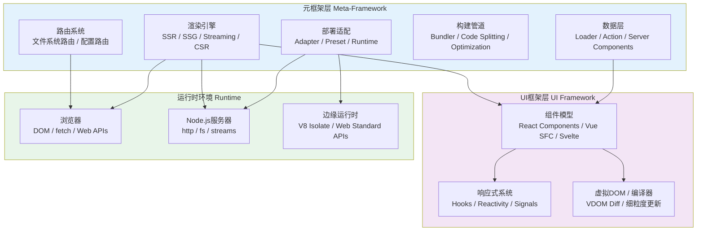
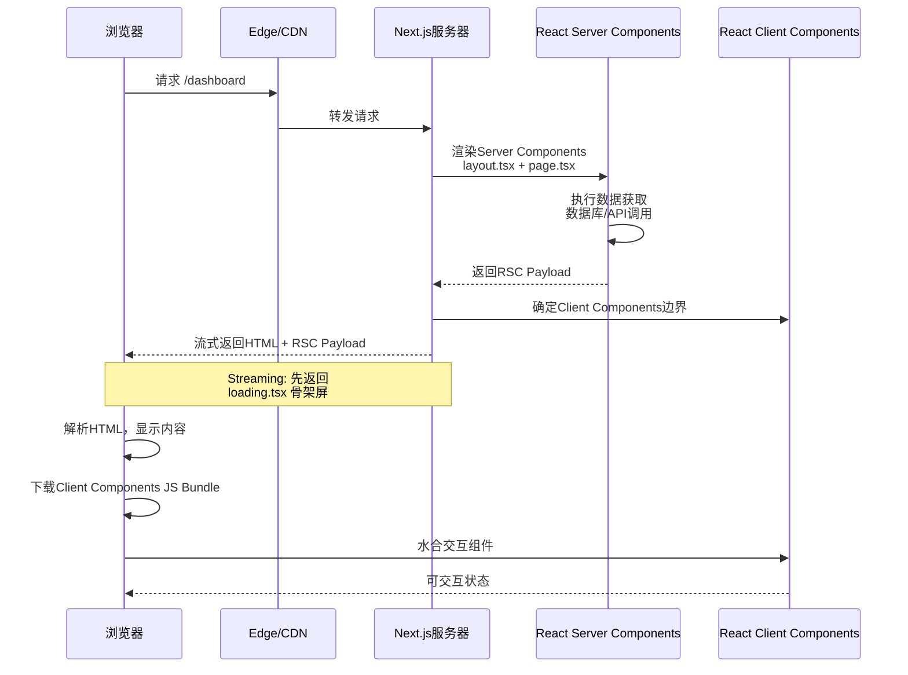
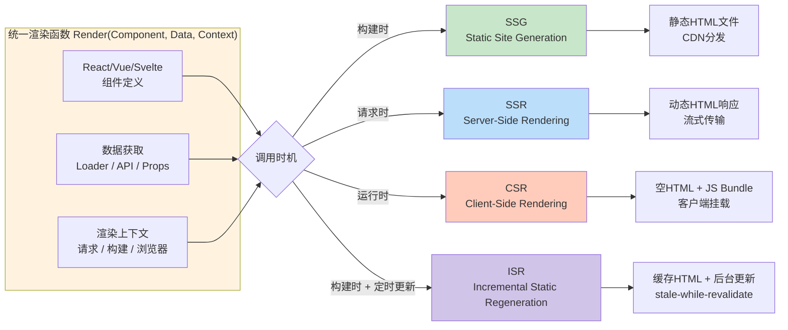
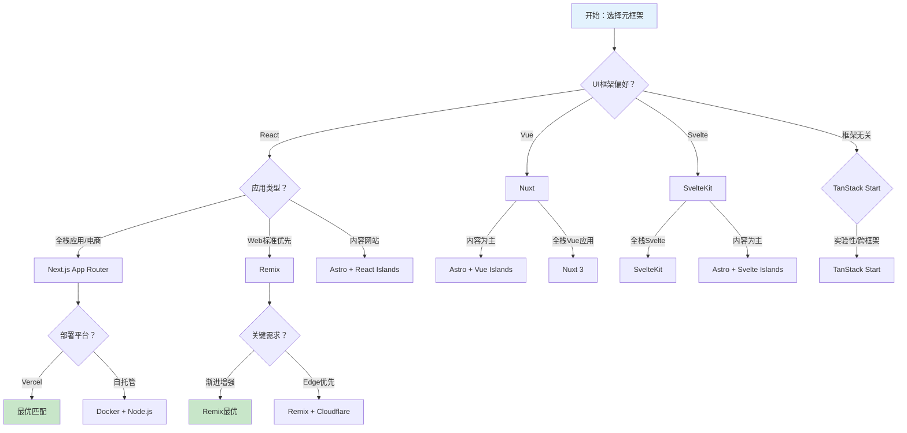

# 元框架理论：Next/Nuxt/SvelteKit

## 引言

现代Web应用的需求已远超传统前端框架的能力边界。用户期望秒级首屏加载、完美的SEO表现、流畅的交互体验，同时开发者需要处理路由、数据获取、状态管理、构建优化、部署适配等跨层问题。单一的用户界面框架（如React、Vue、Svelte）专注于视图层，无法独立满足这些全栈需求。元框架（Meta-framework）应运而生——它们在UI框架之上构建，提供从开发到部署的完整解决方案。

Next.js（基于React）、Nuxt（基于Vue）、SvelteKit（基于Svelte）、Remix（基于React）等框架构成了当前元框架生态的核心。这些框架的共同特征是：它们不发明新的组件模型，而是围绕现有UI框架构建全栈能力层，通过约定优于配置（Convention over Configuration）的设计哲学，将文件系统结构自动映射为应用架构。

本文从理论严格表述与工程实践映射两个维度，系统剖析元框架的定义、路由形式化模型、渲染策略统一抽象、边缘计算适配，以及主流元框架的架构差异与选型考量。

## 理论严格表述

### 元框架的形式化定义

从系统架构角度，元框架可形式化为一个三元组 $\mathcal{M} = (\mathcal{U}, \mathcal{E}, \mathcal{I})$，其中：

- $\mathcal{U}$ 为底层UI框架（Underlying UI Framework），负责组件渲染与状态管理；
- $\mathcal{E}$ 为扩展能力集合（Extension Capabilities），包括路由、数据获取、中间件、API端点等；
- $\mathcal{I}$ 为集成层（Integration Layer），负责将 $\mathcal{E}$ 中的能力与 $\mathcal{U}$ 无缝集成。

传统前端框架仅提供 $\mathcal{U}$，而元框架通过定义 $\mathcal{E}$ 和构建 $\mathcal{I}$，将开发范式从"客户端组件开发"提升为"全栈应用开发"。

元框架与UI框架的关系可类比于操作系统内核与发行版的关系：UI框架提供核心的调度与渲染能力，而元框架在此基础上封装了文件系统抽象、网络协议处理、构建管道等系统级服务。这种分层架构的价值在于**关注点分离**（Separation of Concerns）——UI框架团队专注于渲染性能与开发者体验，元框架团队专注于应用架构与部署适配。

### 约定优于配置的理论基础

"约定优于配置"（Convention over Configuration, CoC）是元框架设计的核心原则。其理论基础可追溯至认知负荷理论（Cognitive Load Theory）与软件架构的形式化方法。

认知负荷理论指出，人类工作记忆的容量是有限的（Miller定律：7±2个信息单元）。当开发者需要记忆和配置大量显式选项时，外在认知负荷（Extraneous Cognitive Load）增加，可用于解决实际问题的内在认知负荷（Intrinsic Cognitive Load）相应减少。CoC通过提供合理的默认约定，将配置决策从开发者转移到框架设计者，从而降低外在认知负荷。

从形式化角度，CoC可建模为一个从文件系统结构到应用配置的映射函数：

$$\text{Config} = f(\text{FilesystemStructure})$$

在元框架中，这一映射通常是单射（Injective）的——每个文件路径对应唯一的应用配置，反之亦然。例如，在Next.js App Router中：

```
app/
  page.tsx          → 根路由 /
  layout.tsx        → 根布局
  blog/
    page.tsx        → 路由 /blog
    [slug]/
      page.tsx      → 动态路由 /blog/:slug
```

文件系统的树形结构天然对应URL路径的层级结构，这一对应关系利用了人类对层级组织的直觉认知，减少了显式路由配置的需要。

CoC并非排斥配置，而是将配置降至"例外处理"（Exception Handling）的角色。当默认约定无法满足需求时，开发者可通过显式配置覆盖默认值。这种"约定为主、配置为辅"的策略在开发效率与灵活性之间取得了平衡。

### 文件系统路由的形式化

文件系统路由是元框架最显著的特征之一。从形式语言理论角度，文件系统路由可定义为从文件路径集合到URL路径集合的映射：

$$R: \mathcal{F} \rightarrow \mathcal{U}$$

其中 $\mathcal{F}$ 为项目中的文件路径集合，$\mathcal{U}$ 为应用的URL路径集合。

Next.js App Router的路由映射规则可形式化为以下转换函数：

| 文件模式 | URL模式 | 形式化描述 |
|---------|--------|-----------|
| `app/page.tsx` | `/` | $R(\text{app/page.tsx}) = /$ |
| `app/blog/page.tsx` | `/blog` | $R(\text{app/blog/page.tsx}) = /\text{blog}$ |
| `app/blog/[slug]/page.tsx` | `/blog/:slug` | $R(\text{app/blog/}[x]\text{/page.tsx}) = /\text{blog}/:x$ |
| `app/(group)/page.tsx` | `/` | $R(\text{app/}(g)\text{/page.tsx}) = /$ （路由分组，不影响URL） |
| `app/[[...catchall]]/page.tsx` | `/*` | $R(\text{app/}[...x]\text{/page.tsx}) = /:x*$ |

这一映射函数 $R$ 具有以下数学性质：

1. **确定性**：对于给定的文件路径，URL映射是唯一的（无歧义）。
2. **单调性**：文件系统的层级嵌套对应URL路径的层级嵌套，即若 $p_1$ 是 $p_2$ 的父目录，则 $R(p_1)$ 是 $R(p_2)$ 的前缀。
3. **可逆性（部分）**：从URL可反推对应的文件路径（动态段需通过参数值还原）。

文件系统路由的优势在于**共现性**（Colocation）——与某路由相关的所有代码（页面组件、数据获取逻辑、布局、加载状态、错误处理）物理上集中在同一目录下。这种组织方式降低了代码导航的认知成本，并天然支持代码分割（按路由自动分割Bundle）。

### SSR/SSG/CSR的统一抽象模型

元框架需要支持多种渲染策略（Rendering Strategies），包括服务端渲染（SSR）、静态站点生成（SSG）、客户端渲染（CSR），以及它们的混合变体（ISR、DPR等）。从抽象模型角度，这些策略可统一表示为一个渲染函数：

$$\text{HTML} = \text{Render}(\text{Component}, \text{Data}, \text{Context})$$

差异仅在于 **Render** 函数的调用时机与调用环境：

| 策略 | 调用时机 | 调用环境 | 输出持久性 |
|------|---------|---------|-----------|
| SSG | 构建时 | 构建服务器 | 静态文件，长期持久 |
| SSR | 请求时 | 应用服务器 | 每次请求重新生成 |
| CSR | 运行时 | 用户浏览器 | 不生成初始HTML，客户端渲染 |
| ISR | 构建时 + 增量更新 | 边缘节点/服务器 | 缓存后按需重新验证 |

元框架通过统一的API抽象，使开发者能够以一致的方式编写组件，而由框架根据配置决定具体的渲染策略。Next.js的App Router通过以下导出约定实现这一抽象：

```typescript
// 同一组件可适配多种渲染策略
export default function Page() {
  // 组件逻辑与渲染策略解耦
}

// 运行时配置决定渲染方式
export const dynamic = 'force-static';  // SSG
export const dynamic = 'force-dynamic'; // SSR
export const revalidate = 60;           // ISR
```

这种统一抽象的理论价值在于**策略与实现的解耦**：页面组件仅关注"渲染什么"（What to render），而"何时何地渲染"（When and Where to render）由框架元数据控制。这一解耦使渲染策略的调整无需修改组件实现，仅需变更配置项。

从类型系统角度，统一抽象要求渲染函数的签名在不同策略下保持一致：

```typescript
type Render<Props, Data> = (
  component: Component<Props>,
  data: Data,
  context: RenderContext
) => Promise<RenderResult>;
```

无论底层是SSG的同步构建、SSR的异步流式渲染，还是CSR的浏览器端挂载，上层组件的类型契约保持不变。

### 边缘计算的元框架适配

边缘计算（Edge Computing）的兴起对元框架提出了新的适配要求。传统SSR在中心化的Node.js服务器上执行，而边缘渲染（Edge Rendering）将计算分布到全球各地的边缘节点（Edge Nodes），以最小化网络延迟。

边缘运行时（Edge Runtime）与传统Node.js运行时的关键差异在于：

| 特性 | Node.js运行时 | 边缘运行时（V8 Isolate） |
|------|--------------|------------------------|
| 启动时间 | 数百毫秒级 | 亚毫秒级 |
| 执行时长限制 | 无严格限制 | 通常数十毫秒至数秒 |
| 可用API | 完整Node.js API | 受限的Web标准API子集 |
| 状态持久化 | 可维护内存状态 | 无状态，请求级隔离 |
| 冷启动 | 存在 | 极低 |

元框架的边缘适配需要在以下层面进行抽象：

1. **运行时API兼容层**：提供跨运行时的统一API（如 `fetch`、`Request`、`Response` 等Web标准API），屏蔽Node.js特有API（如 `fs`、`http` 模块）。

2. **部署目标抽象**：通过Adapter模式将应用打包为特定边缘平台的部署产物（如Vercel Edge Functions、Cloudflare Workers、Deno Deploy）。

3. **流式传输优化**：边缘节点通常支持HTTP流式响应（Streaming Response），元框架需要将组件渲染结果以增量方式传输给客户端，而非等待完整HTML生成。

边缘计算对元框架的理论启示在于：**渲染不再是服务器端的批处理操作，而是分布式系统中的流式计算任务**。这一认知转变推动了元框架对Streaming SSR、Server Components、Partial Prerendering等技术的采纳。

## 工程实践映射

### Next.js的App Router与Pages Router架构对比

Next.js是React生态最具影响力的元框架，其发展历程体现了元框架范式的演进。Next.js 13引入的App Router与原有的Pages Router代表了两种截然不同的架构哲学。

**Pages Router**（Next.js 12及之前）遵循传统的文件系统路由模型：

```
pages/
  index.tsx        → 路由 /
  blog.tsx         → 路由 /blog
  blog/[slug].tsx  → 动态路由 /blog/:slug
```

每个页面文件导出一个React组件，数据获取通过专有的 `getServerSideProps`、`getStaticProps`、`getStaticPaths` 等API完成。这一模型的特点是"页面为中心"——每个路由对应一个独立的页面组件，数据获取与组件定义耦合。

**App Router**（Next.js 13+）引入了全新的架构概念：

```
app/
  page.tsx         → 页面UI
  layout.tsx       → 共享布局（跨路由持久）
  loading.tsx      → 加载状态UI
  error.tsx        → 错误边界UI
  template.tsx     → 重新挂载的布局
  not-found.tsx    → 404页面
```

App Router的核心创新包括：

1. **React Server Components（RSC）**：默认在服务器端渲染的组件，可直接访问后端资源（数据库、文件系统），不将组件代码发送至客户端。这从根本上改变了"组件"的定义——组件不再仅限于浏览器执行环境。

2. **嵌套布局（Nested Layouts）**：布局组件可嵌套，父级布局在子路由导航时保持状态（不重新挂载），实现了"局部导航"体验。

3. **并行路由（Parallel Routes）**：通过 `@folder` 命名约定，在同一布局中并行渲染多个页面，实现复杂的仪表板布局（如同时显示团队列表和成员详情）。

4. **拦截路由（Intercepting Routes）**：通过 `(.)`、`(..)` 等约定，在保持当前布局上下文的同时渲染目标路由的内容（如点击链接时在模态框中预览页面）。

App Router与Pages Router的工程差异可通过以下对比表理解：

| 维度 | Pages Router | App Router |
|------|-------------|------------|
| 数据获取 | `getServerSideProps` / `getStaticProps` | Server Components直接获取 |
| 布局持久性 | `_app.tsx` 全局布局 | 嵌套布局，路由级持久 |
| 加载状态 | 手动管理 | `loading.tsx` 自动处理 |
| 错误处理 | `_error.tsx` | `error.tsx` 错误边界 |
| 客户端包体积 | 全部组件代码发送至客户端 | Server Components零客户端代码 |
| 流式传输 | 不支持原生流式 | React Streaming SSR原生支持 |

Next.js的架构演进表明，元框架正在从"路由配置框架"向"全栈组件运行时"转型。App Router引入的Server Components使组件模型跨越了服务端与客户端的边界，这是元框架理论的重要里程碑。

### Nuxt的模块系统与插件生态

Nuxt是Vue生态的旗舰元框架，其设计哲学强调模块化与可扩展性。Nuxt的核心架构建立在"模块系统"（Module System）之上，允许开发者通过声明式配置集成第三方能力。

Nuxt模块的本质是**构建时插件**（Build-time Plugins）。模块在 `nuxt.config.ts` 中注册后，可在Nuxt应用的构建阶段修改配置、注册组件、添加路由、注入插件等：

```typescript
// nuxt.config.ts
export default defineNuxtConfig({
  modules: [
    '@nuxtjs/tailwindcss',    // CSS框架集成
    '@nuxt/content',           // 内容管理
    '@nuxt/image',             // 图像优化
    '@pinia/nuxt',             // 状态管理
  ]
});
```

模块系统的工程价值在于**能力组装**：开发者无需手动配置Tailwind、内容系统、图像优化等工具链，模块将这些集成逻辑封装为可复用的构建时组件。这一设计与Vue生态的"渐进式框架"哲学一脉相承——开发者按需引入功能，不使用的模块不产生运行时开销。

Nuxt 3引入了"Nuxt Nitro"作为其服务端引擎。Nitro是一个与部署目标无关的服务端框架，可将Nuxt应用编译为多种输出格式：

- Node.js服务器（传统SSR）
- 静态文件（SSG）
- Cloudflare Workers
- Deno / Bun 运行时
- Vercel Edge Functions
- Netlify Functions

Nitro的部署目标抽象通过"Preset"机制实现：

```bash
# 构建为Cloudflare Workers
npx nuxt build --preset=cloudflare-pages

# 构建为Node.js服务器
npx nuxt build --preset=node-server
```

这种"一次编写，多处部署"的能力是元框架工程价值的重要体现。Nitro在编译时根据目标平台生成优化的服务端代码，自动处理平台特定的API差异（如请求对象格式、响应头限制等）。

### SvelteKit的Adapter模式

SvelteKit是Svelte生态的官方元框架，其架构设计的核心理念是"部署目标无关性"（Deployment Target Agnosticism）。这一理念通过**Adapter模式**实现。

SvelteKit应用在构建时通过Adapter转换为特定平台的部署产物。官方提供的Adapter包括：

| Adapter | 目标平台 | 特性 |
|---------|---------|------|
| `@sveltejs/adapter-node` | Node.js服务器 | 传统SSR/SSG，Express/Koa兼容 |
| `@sveltejs/adapter-vercel` | Vercel | Edge Functions + Serverless Functions |
| `@sveltejs/adapter-netlify` | Netlify | Edge Functions + On-demand Builders |
| `@sveltejs/adapter-static` | 静态托管 | 纯SSG，适用于CDN部署 |
| `@sveltejs/adapter-cloudflare` | Cloudflare Pages | Workers运行时 |

Adapter的接口定义清晰分离了"应用逻辑"与"部署适配"：

```typescript
interface Adapter {
  name: string;
  adapt(builder: Builder): Promise<void>;
}

interface Builder {
  writeClient(dest: string): Promise<void>;
  writeServer(dest: string): Promise<void>;
  writePrerendered(dest: string): Promise<void>;
  generateManifest(opts: { relativePath: string }): string;
  // ...
}
```

SvelteKit在构建时生成中立的中间产物（Client Bundle、Server Bundle、Prerendered Pages），Adapter负责将这些产物打包为目标平台要求的格式。例如，`adapter-static` 将Server Bundle完全排除，仅输出Client Bundle与预渲染的HTML文件；而 `adapter-node` 则生成包含服务器启动脚本的完整Node.js应用。

SvelteKit的Adapter模式是**策略模式**（Strategy Pattern）在元框架架构中的典型应用。其理论价值在于证明了：元框架的平台适配层可以通过清晰的接口抽象实现完全解耦，应用开发者无需关心部署细节。

### Remix的Web标准优先哲学

Remix是由React Router团队开发的元框架，其设计哲学与Next.js形成鲜明对比：**极致的Web标准优先**（Web Standards First）。

Remix的核心理念是：Web平台已经提供了构建应用所需的全部基础能力——HTML表单、HTTP请求/响应、Cookie、Session、缓存控制等。框架不应重新发明这些概念，而应帮助开发者更好地使用Web标准。

Remix的工程实践体现为以下设计选择：

1. **表单作为数据变更的原语**：Remix将HTML `<form>` 元素作为数据变更（Mutation）的主要机制，而非JavaScript事件处理器。开发者编写标准HTML表单，Remix在服务端处理表单提交：

```tsx
// 路由模块导出 action 处理 POST 请求
export async function action({ request }: ActionFunctionArgs) {
  const formData = await request.formData();
  const title = formData.get('title');
  await createPost({ title });
  return redirect('/posts');
}

// 组件中使用标准表单
export default function NewPost() {
  return (
    <Form method="post">
      <input name="title" required />
      <button type="submit">Create</button>
    </Form>
  );
}
```

1. **嵌套路由与数据并行获取**：Remix的路由系统是深度嵌套的，父路由与子路由的数据获取并行执行。每个路由模块导出 `loader`（数据获取）和 `action`（数据变更）函数， Remix在服务端协调这些调用。

2. **渐进增强（Progressive Enhancement）**：Remix应用在无JavaScript环境下仍可正常工作。表单提交、链接导航等基础功能依赖原生HTML行为，JavaScript仅用于增强体验（如客户端过渡动画、乐观更新等）。

3. **部署平台无关**：Remix不绑定特定的部署平台。通过适配器（Adapter），Remix应用可部署到Node.js、Cloudflare Workers、Deno、Vercel、Netlify等任何支持Web标准请求/响应API的环境。

Remix的哲学对元框架设计具有启示意义：**元框架的价值不在于提供新的抽象，而在于组织已有抽象的最佳实践**。Remix通过坚持Web标准，实现了框架知识的高度可迁移性——开发者学习的不是"Remix特有的API"，而是通用的Web平台能力。

### TanStack Start的框架无关元框架

TanStack Start是元框架领域的新进入者，其独特定位是"框架无关的元框架"（Framework-agnostic Meta-framework）。与Next.js绑定React、Nuxt绑定Vue不同，TanStack Start设计为可与任何UI框架配合使用。

TanStack Start的架构建立在TanStack生态的核心库之上：

- **TanStack Router**：类型安全的文件系统路由，支持框架无关的路由配置
- **TanStack Query**：数据获取与缓存管理
- **TanStack Form**：表单状态管理
- **Vinxi**：统一的开发服务器与构建工具

TanStack Start的工程创新在于将元框架能力分解为独立的、可组合的库，而非紧耦合的框架。开发者可选择React、Vue、Solid.js或Svelte作为UI层，而路由、数据获取、服务端能力由TanStack Start统一提供。

```typescript
// TanStack Start 路由定义（框架无关）
import { createFileRoute } from '@tanstack/react-router';
// 或 import { createFileRoute } from '@tanstack/vue-router';

export const Route = createFileRoute('/posts/$postId')({
  component: PostComponent,
  loader: async ({ params }) => {
    return fetchPost(params.postId);
  },
});
```

TanStack Start代表了元框架演进的另一方向：**从"绑定特定UI框架"到"提供可组合的全栈基元"**。这一方向的理论假设是：路由、数据获取、服务端渲染等能力与具体的组件模型无关，可以通过通用的接口抽象实现跨框架复用。

### Astro作为内容优先的元框架

Astro在元框架谱系中占据独特位置：它是"内容优先"（Content-First）的元框架，专为内容密集型网站优化。

Astro的元框架特征体现在：

1. **多框架组件支持**：Astro页面可嵌入React、Vue、Svelte、Solid.js、Preact、Alpine.js等框架的组件作为Islands。

2. **内容集合（Content Collections）**：Astro提供类型安全的内容管理API，将Markdown/MDX文件映射为类型化的数据集合：

```typescript
// src/content/config.ts
import { defineCollection, z } from 'astro:content';

const blog = defineCollection({
  type: 'content',
  schema: z.object({
    title: z.string(),
    pubDate: z.date(),
    tags: z.array(z.string()),
  }),
});

export const collections = { blog };
```

1. **视图过渡（View Transitions）**：Astro内置了基于View Transitions API的页面过渡动画，无需额外配置即可实现SPA般的导航体验。

2. **SSG优先**：Astro默认将所有页面编译为静态HTML，仅对交互组件进行客户端水合。

Astro的工程定位非常明确：它不追求成为通用的全栈框架，而是专注于文档、博客、营销网站等"内容为主、交互为辅"的场景。在这一细分市场中，Astro通过编译时优化实现了无与伦比的性能表现。

### 元框架的选型矩阵

面对众多元框架，技术选型需要系统性的评估框架。以下选型矩阵从功能、生态、性能、学习曲线四个维度对比主流元框架：

| 维度 | Next.js | Nuxt | SvelteKit | Remix | TanStack Start | Astro |
|------|---------|------|-----------|-------|---------------|-------|
| **底层UI框架** | React | Vue | Svelte | React | 多框架 | 多框架 (Islands) |
| **路由模型** | 文件系统 + App Router | 文件系统 + 约定 | 文件系统 + 参数化 | 文件系统 + 嵌套 | 文件系统 + 类型安全 | 文件系统 + 内容集合 |
| **渲染策略** | SSR/SSG/ISR/Streaming | SSR/SSG/ISR/Nitro | SSR/SSG/CSR | SSR/SSG | SSR/SSG | SSG优先 + Islands |
| **Server Components** | 原生支持 (React RSC) | 实验性 (Nuxt 4) | 通过Svelte 5 Runes | 无（遵循Web标准） | 计划支持 | N/A |
| **边缘部署** | Vercel Edge原生 | Nitro多平台 | Adapter模式 | 适配器模式 | Vinxi多平台 | Adapter模式 |
| **生态成熟度** | ★★★★★ | ★★★★☆ | ★★★☆☆ | ★★★☆☆ | ★★☆☆☆ | ★★★☆☆ |
| **学习曲线** | 中等（App Router复杂） | 平缓 | 平缓 | 平缓 | 中等 | 平缓 |
| **适用场景** | 全栈应用、电商 | Vue全栈应用 | Svelte全栈应用 | Web标准优先应用 | 框架无关全栈 | 内容网站、文档 |

选型决策应遵循"场景匹配优先"原则：

- **企业级全栈应用（React技术栈）**：Next.js App Router，生态最成熟，Vercel生态深度整合。
- **Vue生态全栈应用**：Nuxt 3，模块化系统完善，Nitro引擎部署灵活。
- **Svelte生态或性能敏感应用**：SvelteKit，编译器优势 + 极简运行时。
- **Web标准优先、渐进增强**：Remix，知识可迁移性最强，无供应商锁定。
- **框架无关或实验性项目**：TanStack Start，跨框架复用能力。
- **内容密集型网站**：Astro，编译时优化极致，首屏性能最佳。

## Mermaid 图表

### 图表1：元框架架构分层模型



### 图表2：Next.js App Router渲染流程



### 图表3：SSR/SSG/CSR统一抽象模型



### 图表4：元框架选型决策树



## 理论要点总结

元框架代表了前端工程从"库的组合"向"系统架构"演进的重要阶段。本文的核心论点可归纳为以下五个理论要点：

1. **元框架是UI框架的全栈扩展**：元框架不替代UI框架，而是通过路由、数据获取、渲染策略、部署适配等扩展能力，将组件模型从浏览器扩展至全栈环境。形式化地，元框架 $\mathcal{M} = (\mathcal{U}, \mathcal{E}, \mathcal{I})$ 的价值在于集成层 $\mathcal{I}$ 的构建。

2. **约定优于配置是认知效率的最优化策略**：文件系统路由通过映射函数 $R: \mathcal{F} \rightarrow \mathcal{U}$ 将物理目录结构自动转换为应用架构，减少了开发者的外在认知负荷，并通过共现性组织降低了代码导航成本。

3. **渲染策略的统一抽象实现了策略与实现的解耦**：SSG/SSR/CSR/ISR可通过统一的渲染函数 $\text{Render}(\text{Component}, \text{Data}, \text{Context})$ 表示，差异仅在于调用时机与环境。元框架通过配置元数据控制渲染策略，使组件实现与渲染方式解耦。

4. **边缘计算推动元框架向分布式流式计算演进**：边缘运行时的无状态、低延迟特性要求元框架将渲染视为分布式流式计算任务，支持HTTP流式响应、Partial Prerendering等新型渲染模式。

5. **元框架生态呈现多极化与专业化趋势**：Next.js占据React生态主导地位，Nuxt服务Vue开发者，SvelteKit深耕性能敏感场景，Remix坚持Web标准，Astro专注内容网站，TanStack Start探索框架无关路径。不存在"最优"元框架，只有"最匹配场景"的选择。

元框架的竞争本质上是"全栈开发体验"定义权的竞争。随着React Server Components、Edge Runtime、AI辅助开发等技术的成熟，元框架将继续向"更智能的编译时分析"、"更细粒度的边缘部署"、"更无缝的服务端-客户端协同"方向演进。

## 参考资源

1. **Next.js Documentation**. Official documentation for Next.js App Router, Server Components, and rendering strategies. [https://nextjs.org/docs](https://nextjs.org/docs)

2. **Nuxt Documentation**. Official Nuxt 3 documentation covering Nitro engine, module system, and deployment presets. [https://nuxt.com/docs](https://nuxt.com/docs)

3. **SvelteKit Documentation**. Official SvelteKit documentation detailing the Adapter pattern, routing, and server-side capabilities. [https://kit.svelte.dev/docs](https://kit.svelte.dev/docs)

4. **Remix Documentation**. Official Remix documentation articulating the Web Standards First philosophy, nested routing, and progressive enhancement patterns. [https://remix.run/docs](https://remix.run/docs)

5. **TanStack Start Documentation**. Documentation for the framework-agnostic meta-framework built on TanStack Router and Vinxi. [https://tanstack.com/start/latest](https://tanstack.com/start/latest)

6. **Astro Documentation**. Official Astro documentation on Islands architecture, content collections, and multi-framework component support. [https://docs.astro.build](https://docs.astro.build)
