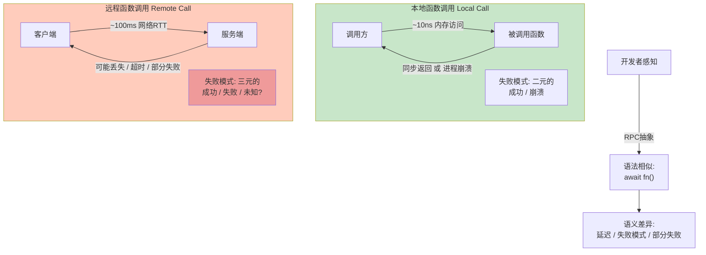
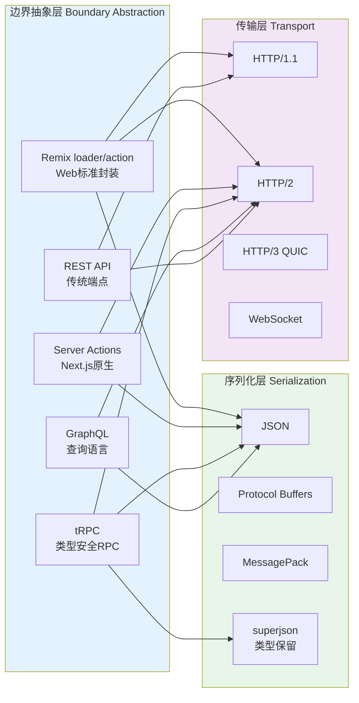
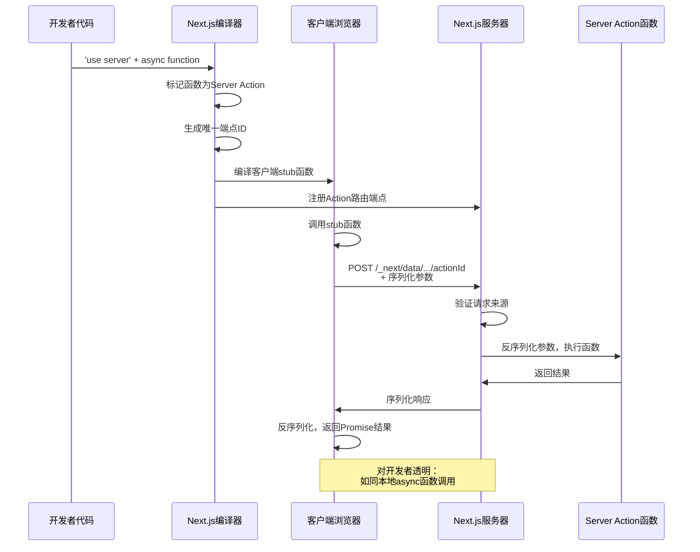
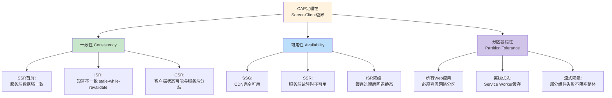

# 服务端客户端边界：RPC/Server Actions

## 引言

现代全栈应用的核心挑战之一，是如何在服务端与客户端之间构建高效、类型安全、语义清晰的通信边界。随着Next.js Server Components、Server Actions、tRPC等技术的兴起，"服务端-客户端边界"（Server-Client Boundary）已从传统的"API设计问题"升级为"架构范式问题"。开发者不再仅仅思考"如何设计REST端点"，而是需要理解"边界"本身的理论本质——当函数调用跨越网络时，什么性质被保持，什么性质被改变。

本地函数调用与远程函数调用之间存在根本性的语义鸿沟。本地调用的延迟以纳秒计，失败模式简单（进程崩溃），执行具有原子性；而远程调用的延迟以毫秒计，可能经历部分失败、网络分区、超时等复杂故障模式。RPC（Remote Procedure Call）技术试图通过抽象隐藏这些差异，但这种"透明性"本质上是一种幻觉——网络边界的物理约束无法被软件抽象完全消除。

本文从分布式系统理论出发，形式化分析服务端-客户端边界的本质特征，然后映射到Next.js Server Actions、tRPC、GraphQL、Remix loader/action等工程实践，揭示现代Web框架如何处理这一古老而核心的分布式计算问题。

## 理论严格表述

### 分布式系统的边界理论

在分布式系统中，"边界"（Boundary）是一个核心概念。从系统拓扑角度，边界是不同计算节点之间的接口面，跨越该接口面的通信必须遵循特定的协议与约束。服务端-客户端边界是分布式系统中最常见的边界类型之一，其形式化定义如下：

设系统由两个计算节点组成：服务端节点 $S$ 和客户端节点 $C$。边界 $\mathcal{B}$ 定义为二元组：

$$\mathcal{B} = (\mathcal{I}, \mathcal{P})$$

其中 $\mathcal{I}$ 为接口契约集合（Interface Contracts），定义了跨越边界可调用的操作及其签名；$\mathcal{P}$ 为协议规范（Protocol Specification），定义了操作调用的序列化格式、传输机制、错误处理语义等。

边界的理论重要性在于：**它强制引入了局部性约束**。在单一节点内，内存访问具有均匀性（Uniform Memory Access）——访问任何内存地址的成本在数量级上是相同的。而在分布式边界两侧，数据访问成本呈现数量级差异：

| 操作类型 | 本地调用 | 远程调用 | 成本倍数 |
|---------|---------|---------|---------|
| 函数调用 | ~1-10 ns | ~1-100 ms | $10^6$-$10^8$ |
| 数据读取 | ~100 ns (RAM) | ~1-100 ms (网络) | $10^4$-$10^6$ |
| 失败检测 | 即时（进程信号） | 超时（TCP重传） | 不可比 |

这种数量级差异不是实现细节问题，而是分布式系统的**本质属性**。任何试图完全隐藏这一差异的抽象都是脆弱的。

### RPC的语义透明性幻觉

RPC（Remote Procedure Call）的核心思想是将远程服务操作封装为本地函数调用的语法形式。从开发者视角，调用远程服务如同调用本地函数：

```typescript
// 开发者视角：如同本地函数
const result = await createUser({ name: 'Alice', email: 'alice@example.com' });
```

然而，这种语法层面的相似性掩盖了语义层面的深刻差异。Andrew S. Tanenbaum在《Distributed Systems》中指出，RPC的"透明性"（Transparency）是一种设计目标而非已实现的事实。透明性可分为多个维度：

| 透明性类型 | 描述 | 可实现程度 |
|-----------|------|-----------|
| 访问透明性 | 本地与远程访问使用相同操作 | 语法层面可实现，语义层面不可 |
| 位置透明性 | 无需知道资源物理位置 | 通过DNS/服务发现可实现 |
| 并发透明性 | 多个进程并发访问资源不受干扰 | 需事务/锁机制，难以完全隐藏 |
| 故障透明性 | 隐藏故障的发生与恢复 | 理论上不可实现 |
| 性能透明性 | 性能不随负载/位置变化 | 物理约束下不可实现 |

**故障透明性**的不可实现性具有根本性。本地函数调用只有两种结果：成功返回或进程崩溃（导致调用者也崩溃）。而远程调用存在第三种状态：**部分失败**（Partial Failure）——请求已发出但未收到响应，此时调用者无法确定服务端是否已处理请求。这一问题没有通用的解决方案，任何RPC抽象都必须在API层面暴露这种不确定性。

形式化地，本地函数的语义可表示为：

$$f: A \rightarrow B \cup \{\bot\}$$

其中 $\bot$ 表示发散（非终止），在本地环境中 $\bot$ 意味着进程崩溃。而远程函数的语义为：

$$f_{remote}: A \rightarrow B \cup \{\bot\} \cup \{?, \text{timeout}\}$$

其中 $?$ 表示未知状态（请求可能已处理、可能未处理、可能正在处理），timeout 表示超时。这种语义扩展是网络边界的直接后果，无法通过客户端抽象消除。

### 本地调用 vs 远程调用的根本差异

本地调用与远程调用的差异可从三个维度进行严格对比：

**延迟维度（Latency）**

本地函数调用的延迟主要由CPU寄存器操作和内存访问决定，通常在纳秒至微秒量级。远程调用的延迟由网络往返时间（Round-Trip Time, RTT）主导，即使在理想条件下（同数据中心），RTT也在亚毫秒至毫秒量级；跨地域调用可能达到数十至数百毫秒。

这种延迟差异对程序语义具有深远影响。在本地环境中，以下代码是安全的：

```typescript
// 本地环境：安全
for (const id of ids) {
  const item = getItem(id);  // 同步调用，~100ns
  process(item);
}
```

而在远程环境中，相同的模式可能导致灾难：

```typescript
// 远程环境：N+1查询灾难
for (const id of ids) {
  const item = await fetchItem(id);  // RTT ~100ms
  process(item);
}
// 总延迟 = ids.length * RTT
```

**失败模式维度（Failure Modes）**

本地环境的失败模式遵循"全有或全无"（All-or-Nothing）原则：进程崩溃导致所有状态丢失。远程环境的失败模式更为复杂：

| 失败类型 | 描述 | 处理策略 |
|---------|------|---------|
| 请求丢失 | 网络丢包导致请求未到达服务端 | TCP重传 / 应用层重试 |
| 响应丢失 | 服务端已处理但响应未到达客户端 | 幂等性设计 / 去重机制 |
| 服务端崩溃 | 请求处理中服务端故障 | 熔断 / 降级 / 重试 |
| 网络分区 | 客户端与服务端暂时不可达 | 超时 / 优雅降级 |
| 延迟峰值 | 网络或服务端暂时过载 | 超时控制 / 背压 |

**部分失败维度（Partial Failure）**

部分失败是分布式系统区别于单机系统的核心特征。当远程调用超时或无响应时，客户端面临**不确定性**（Uncertainty）：

- 请求是否已到达服务端？
- 服务端是否已处理请求？
- 响应是否已在返回途中丢失？

这种不确定性无法通过技术手段完全消除，必须在应用架构层面进行处理。常见的处理策略包括：

1. **幂等性**（Idempotency）：确保同一请求的多次执行具有相同效果。
2. **去重机制**（Deduplication）：服务端维护请求标识，拒绝重复处理。
3. **两阶段提交**（Two-Phase Commit）：分布式事务协议，保证原子性。
4. **Saga模式**：通过补偿事务处理长事务中的部分失败。

### 网络边界的形式化：CAP定理在Server-Client边界中的体现

CAP定理（Brewer, 2000）指出，分布式数据存储系统无法同时满足一致性（Consistency）、可用性（Availability）和分区容错性（Partition Tolerance）。在服务端-客户端边界场景中，CAP定理具有特殊的诠释：

- **一致性**：客户端观察到的数据状态与服务端一致。Server Components通过服务端渲染保证首屏一致性，但客户端水合后可能因状态不同步而产生不一致。
- **可用性**：客户端在无法连接服务端时能否继续工作。纯SSR应用在网络中断时完全不可用；CSR应用可在离线状态下运行部分功能。
- **分区容错性**：网络分区发生时系统的行为。Web应用天然需要分区容错，因为客户端与服务端的网络连接本质上是不可靠的。

现代元框架通过混合渲染策略在CAP之间进行权衡：

| 策略 | C权衡 | A权衡 | P保证 |
|------|-------|-------|-------|
| SSR首屏 + CSR交互 | 首屏强一致，后续可能不一致 | 水合前不可用 |  graceful degradation |
| SSG静态预渲染 | 构建时一致，可能过时 | 完全可用（CDN） | 离线可用 |
| ISR增量再生 | 短暂不一致（stale-while-revalidate） | 可用 | 降级为静态 |
| Server Components | 服务端数据源强一致 | 依赖服务端可用 | 流式降级 |

### 序列化与反序列化的类型安全

跨越服务端-客户端边界的数据必须经历序列化（Serialization）与反序列化（Deserialization）。这一过程引入了**类型边界**（Type Boundary）问题：服务端与客户端可能使用不同的类型系统，或同一类型系统在不同运行时的表现存在差异。

TypeScript作为全栈类型系统的普及，使"端到端类型安全"成为可能。理想情况下，服务端函数的返回类型与客户端消费的类型应当由同一类型定义驱动：

```typescript
// 共享类型定义（server + client）
interface User {
  id: string;
  name: string;
  email: string;
  createdAt: Date;  // 注意：Date不可直接序列化！
}
```

然而，TypeScript的类型系统在编译时被擦除（Type Erasure），运行时无类型信息。序列化边界将数据转换为JSON（或Protocol Buffers、MessagePack等），而JSON的类型系统远弱于TypeScript：

| TypeScript类型 | JSON表示 | 序列化问题 |
|---------------|---------|-----------|
| `Date` | ISO字符串 | 客户端需手动还原 |
| `Map<K, V>` | 不支持 | 需转换为对象或数组 |
| `Set<T>` | 不支持 | 需转换为数组 |
| `bigint` | 数字或字符串 | 可能精度丢失 |
| `undefined` | 缺失键或`null` | 语义差异 |
| 类实例 | 扁平对象 | 方法丢失 |

端到端类型安全要求类型系统"意识到"序列化边界的存在。现代框架通过以下策略应对：

1. **序列化感知类型**：使用 `superjson` 等库扩展JSON序列化能力，保留类型信息。
2. **模式优先**（Schema First）：通过Zod、Valibot等运行时类型库定义共享模式，同时驱动类型推断与运行时验证。
3. **编译时类型映射**：框架在编译阶段生成客户端SDK，将服务端类型映射为客户端可调用的类型安全函数。

### 边界处的阻抗失配（Impedance Mismatch）

"阻抗失配"（Impedance Mismatch）原是电气工程术语，指信号在不同介质边界处的反射与损耗。软件工程借用这一概念描述不同抽象层之间的语义摩擦。服务端-客户端边界存在多重阻抗失配：

**数据模型失配**

服务端通常以关系型或文档型数据库的范式组织数据（规范化、外键关联），而客户端需要嵌套、去规范化的视图模型。GraphQL通过字段选择与嵌套查询缓解这一失配，但引入了N+1查询等性能问题。

**执行模型失配**

服务端代码在请求-响应周期中执行，具有无状态或会话状态的特性；客户端代码在长期运行的页面会话中执行，维护复杂的本地状态。Server Actions试图弥合这一差异——服务端函数可直接从客户端调用，但执行模型的根本差异（短周期 vs 长周期）仍需开发者理解。

**错误处理失配**

服务端错误（数据库连接失败、外键约束违反）需要转换为客户端可理解的错误表示（表单验证错误、用户友好提示）。HTTP状态码提供了粗粒度的错误分类，但细粒度的业务错误传递需要额外的协议设计。

**认证授权失配**

服务端的认证状态（Session、JWT）需要在每次请求中传递给服务端。传统方式通过Cookie或Authorization头实现，但Server Components和Server Actions引入了新的传递机制——框架自动将认证上下文注入服务端函数，开发者无需手动处理。

## 工程实践映射

### Next.js的Server Actions

Next.js 13+引入的Server Actions是"服务端-客户端边界"工程化的里程碑。它允许开发者定义在服务端执行但可从客户端直接调用的函数，消除了传统API端点的显式定义。

Server Actions的基本用法：

```typescript
// app/actions.ts
'use server';

import { revalidatePath } from 'next/cache';
import { db } from '@/lib/db';

export async function createTodo(formData: FormData) {
  const title = formData.get('title') as string;

  await db.todo.create({
    data: { title, completed: false }
  });

  revalidatePath('/todos');
}
```

```tsx
// app/page.tsx
import { createTodo } from './actions';

export default function TodoPage() {
  return (
    <form action={createTodo}>
      <input name="title" required />
      <button type="submit">Add Todo</button>
    </form>
  );
}
```

Server Actions的工程机制如下：

1. **编译时转换**：Next.js编译器识别 `'use server'` 指令，将导出的异步函数标记为Server Action。

2. **自动路由生成**：编译器为每个Server Action生成唯一的URL端点（如 `/_next/data/.../createTodo`），客户端调用被转换为对该端点的POST请求。

3. **类型安全桥接**：TypeScript类型系统确保客户端传入的参数与服务端函数的参数签名匹配。编译时生成客户端stub函数，保持调用语法的类型安全。

4. **渐进增强**：Server Actions与HTML `<form>` 元素原生集成。即使JavaScript禁用，表单仍可正常提交（通过标准的form action指向生成的端点）。

5. **自动重新验证**：通过 `revalidatePath` 或 `revalidateTag`，Server Action可触发Next.js缓存的增量更新，使数据变更立即反映到UI。

Server Actions的理论意义在于：**它将RPC的调用端点从显式的URL抽象压缩为函数导入**。开发者无需定义路由、处理序列化、管理请求库——框架自动处理边界跨越的全部细节。然而，这种压缩并不意味着网络边界的消失：Server Actions仍受延迟、超时、部分失败等约束，只是这些约束被框架隐藏在了类型安全的函数调用背后。

### tRPC的类型安全RPC

tRPC（TypeScript RPC）是社区驱动的端到端类型安全RPC解决方案。与Server Actions的框架集成策略不同，tRPC采用"库"的定位，可独立于特定元框架使用。

tRPC的核心架构包含三个层次：

```typescript
// 1. 路由器定义（服务端）
import { initTRPC } from '@trpc/server';
import { z } from 'zod';

const t = initTRPC.create();

const appRouter = t.router({
  user: t.router({
    getById: t.procedure
      .input(z.object({ id: z.string() }))
      .query(({ input }) => {
        return db.user.findById(input.id);
      }),
    create: t.procedure
      .input(z.object({ name: z.string(), email: z.string().email() }))
      .mutation(({ input }) => {
        return db.user.create(input);
      }),
  }),
});

export type AppRouter = typeof appRouter;
```

```typescript
// 2. 客户端创建（浏览器端）
import { createTRPCReact } from '@trpc/react-query';
import type { AppRouter } from './server';

const trpc = createTRPCReact<AppRouter>();
```

```tsx
// 3. 组件中使用（完全类型安全）
function UserProfile({ userId }: { userId: string }) {
  const user = trpc.user.getById.useQuery({ id: userId });
  // user.data 的类型自动推断为 db.user.findById 的返回类型

  const createUser = trpc.user.create.useMutation();
  // createUser.mutate 的参数类型自动推断为 { name: string, email: string }
}
```

tRPC的类型安全机制建立在TypeScript的类型系统之上：

1. **类型推断传播**：服务端路由器的类型定义通过 `AppRouter` 类型导出，客户端使用该类型参数化tRPC客户端。

2. **运行时验证**：通过Zod等模式库，tRPC在服务端对输入数据进行运行时验证，将类型安全从编译时延伸至运行时。

3. **查询客户端集成**：tRPC与TanStack Query（原React Query）深度集成，将RPC调用转化为具有缓存、重试、去重等能力的查询。

tRPC的工程价值在于**类型契约的不可违背性**：如果服务端路由器的输入模式或返回类型发生变更，客户端代码会在编译时报告类型错误。这种"契约即代码"的机制显著降低了服务端-客户端版本不一致导致的问题。

### GraphQL作为边界查询语言

GraphQL是Facebook提出的查询语言与运行时，为服务端-客户端边界提供了与传统REST截然不同的抽象模型。

GraphQL的核心创新在于**将数据获取的控制权从服务端转移至客户端**。客户端通过查询语句精确声明所需的数据字段，服务端返回匹配的JSON结构：

```graphql
# 客户端查询
query GetUserWithPosts($userId: ID!) {
  user(id: $userId) {
    id
    name
    email
    posts(first: 5) {
      edges {
        node {
          title
          publishedAt
        }
      }
    }
  }
}
```

```json
// 服务端响应
{
  "data": {
    "user": {
      "id": "123",
      "name": "Alice",
      "email": "alice@example.com",
      "posts": {
        "edges": [
          { "node": { "title": "First Post", "publishedAt": "2024-01-01" } },
          { "node": { "title": "Second Post", "publishedAt": "2024-02-01" } }
        ]
      }
    }
  }
}
```

GraphQL在边界设计中的优势与劣势：

| 优势 | 劣势 |
|------|------|
| 客户端精确获取所需数据，避免过度获取 | 服务端需实现复杂的查询解析与执行引擎 |
| 强类型模式（Schema）提供API契约 | N+1查询问题需DataLoader等工具缓解 |
| 单一端点简化API管理 | 缓存策略复杂（HTTP缓存粒度失效） |
| 内省（Introspection）支持自动生成客户端 | 学习曲线陡峭 |
| 版本演进平缓（字段增删而非端点变更） | 文件上传等场景支持不佳 |

GraphQL的类型系统通过Schema Definition Language（SDL）定义，可与TypeScript类型生成工具（如GraphQL Code Generator）结合，实现类似tRPC的端到端类型安全。

### Remix的loader/action模式

Remix通过 `loader` 和 `action` 函数明确定义服务端-客户端边界的数据流：

```tsx
// app/routes/users.$userId.tsx
import { json, type LoaderFunctionArgs, type ActionFunctionArgs } from '@remix-run/node';
import { useLoaderData, Form } from '@remix-run/react';

// GET 请求处理器：服务端数据获取
export async function loader({ params }: LoaderFunctionArgs) {
  const user = await db.user.findById(params.userId);
  if (!user) throw new Response('Not Found', { status: 404 });
  return json({ user });
}

// POST/PUT/PATCH/DELETE 请求处理器：服务端数据变更
export async function action({ request, params }: ActionFunctionArgs) {
  const formData = await request.formData();
  const name = formData.get('name') as string;

  await db.user.update(params.userId, { name });
  return json({ success: true });
}

// 客户端组件
export default function UserProfile() {
  const { user } = useLoaderData<typeof loader>();
  // user 类型自动推断为 loader 返回的 json 数据类型

  return (
    <Form method="post">
      <input name="name" defaultValue={user.name} />
      <button type="submit">Update</button>
    </Form>
  );
}
```

Remix的边界模型具有以下工程特征：

1. **Web标准原生**：`loader` 和 `action` 接收标准的 `Request` 对象，返回标准的 `Response` 对象。这一设计使Remix应用不绑定特定运行时——同一套代码可在Node.js、Cloudflare Workers、Deno等环境中运行。

2. **类型推导桥接**：`useLoaderData<typeof loader>` 利用TypeScript的 `typeof` 操作符，将服务端 `loader` 的返回类型推导至客户端组件。这是"类型穿越边界"的巧妙实现。

3. **渐进增强原生支持**：`Form` 组件生成标准HTML表单，无需JavaScript即可工作。JavaScript加载后，Remix通过客户端路由拦截表单提交，实现无刷新提交与乐观更新。

4. **错误边界集成**：`loader` 或 `action` 中抛出的错误可通过路由级 `ErrorBoundary` 组件捕获，实现细粒度的错误处理。

Remix的边界设计哲学是**显式优于隐式**：服务端与客户端的职责通过 `loader`/`action` 导出约定清晰分离，不存在"魔法"——每个数据流都可通过标准Web请求/响应模型理解。

### React Server Components的边界模型

React Server Components（RSC）是React团队提出的新型组件模型，从根本上重新定义了服务端-客户端边界。

RSC的核心创新是：**组件可在服务端渲染，且其代码不发送至客户端**。这打破了传统React应用中"所有组件代码必须下载到浏览器"的约束。

```tsx
// Server Component（服务端执行，代码不发送至客户端）
import { db } from '@/lib/db';
import { UserProfileClient } from './UserProfileClient';

export default async function UserProfile({ userId }: { userId: string }) {
  // 直接在服务端访问数据库
  const user = await db.user.findById(userId);

  return (
    <div>
      <h1>{user.name}</h1>
      <p>{user.email}</p>
      {/* Client Component 作为子组件 */}
      <UserProfileClient userId={userId} />
    </div>
  );
}
```

```tsx
// Client Component（代码发送至客户端，可交互）
'use client';

import { useState } from 'react';

export function UserProfileClient({ userId }: { userId: string }) {
  const [editing, setEditing] = useState(false);
  // 可访问浏览器API、使用Hooks

  return (
    <button onClick={() => setEditing(true)}>
      Edit Profile
    </button>
  );
}
```

RSC的边界模型特征：

1. **服务端-客户端组件树混排**：Server Components可导入并渲染Client Components，但Client Components不能导入Server Components（因为服务端代码不可在浏览器执行）。

2. **Props序列化**：从Server Component传递给Client Component的props必须经过JSON序列化。函数、类实例等不可序列化的值无法直接传递。

3. **RSC Payload**：Server Components的渲染结果不是HTML，而是一种称为"RSC Payload"的流式格式。该格式描述组件树的结构、需要客户端加载的Client Components边界、以及传递的props。

4. **零客户端Bundle**：纯Server Components（不渲染任何Client Component）不增加客户端JavaScript包体积。

RSC的理论意义在于**将组件模型扩展为跨运行时的分布式计算单元**。组件不再是浏览器端的专属概念，而是可在服务端、边缘节点、浏览器等多种环境中执行的原子单位。

### WASM在边界处的应用

WebAssembly（WASM）为服务端-客户端边界引入了新的可能性：跨运行时的二进制代码共享。

传统的边界数据交换依赖于序列化——数据在服务端被序列化为JSON/XML/Binary，传输到客户端后反序列化。WASM允许另一种模式：**计算共享**。服务端与客户端可共享同一WASM模块，在两端执行相同的逻辑（如验证规则、数据转换、加密算法），而无需重复实现。

```typescript
// 共享的WASM模块（Rust编译）
import init, { validateSchema } from './pkg/validator.js';

// 服务端：请求处理时验证
export async function action({ request }: ActionFunctionArgs) {
  await init();
  const body = await request.json();
  const result = validateSchema(JSON.stringify(body));
  // ...
}

// 客户端：提交前验证
async function handleSubmit(data: unknown) {
  await init();
  const result = validateSchema(JSON.stringify(data));
  if (!result.valid) {
    // 显示验证错误
  }
}
```

WASM在边界的应用仍处于早期，但以下场景具有潜力：

- **共享验证逻辑**：用Rust编写验证规则，编译为WASM后在两端运行，确保验证语义完全一致。
- **图像/视频处理**：在服务端和客户端使用相同的编解码逻辑。
- **加密/哈希**：共享密码学原语实现，避免JavaScript实现的性能与安全问题。

### REST vs RPC vs GraphQL：边界设计的Trade-offs

三种主流的边界设计范式各有其适用场景与设计权衡：

| 维度 | REST | RPC | GraphQL |
|------|------|-----|---------|
| **抽象模型** | 资源（Resource）导向 | 操作（Operation）导向 | 查询（Query）/ 图（Graph）导向 |
| **端点设计** | 多URL（/users, /posts） | 单URL或函数调用 | 单URL（/graphql） |
| **数据粒度** | 服务端固定 | 服务端固定 | 客户端声明 |
| **类型系统** | 弱（OpenAPI可补充） | 强（函数签名） | 强（Schema） |
| **缓存策略** | HTTP缓存友好 | 需应用层缓存 | 需专用缓存策略 |
| **版本管理** | URL版本（/v1/users） | 函数版本或新函数 | 字段级演进 |
| **网络效率** | 可能过度获取/获取不足 | 取决于函数设计 | 精确获取 |
| **调试工具** | 通用（curl, Postman） | 框架特定 | GraphQL Playground |
| **学习曲线** | 平缓 | 平缓（本地函数调用） | 陡峭 |

**选型指导**：

- **REST**：适用于公共资源API、第三方集成、缓存敏感型场景。REST的HTTP语义与缓存基础设施深度整合，是开放API的首选。

- **RPC**（含Server Actions、tRPC）：适用于内部全栈应用、同构TypeScript代码库、类型安全优先的场景。RPC将服务端操作封装为类型安全函数，最适合"服务端-客户端由同一团队开发"的应用。

- **GraphQL**：适用于复杂数据关系、多客户端场景（Web + Mobile + 第三方）、数据聚合层。GraphQL的客户端驱动查询能力在移动端尤为重要（减少数据传输量）。

现代元框架的趋势是**混合使用**：Next.js同时支持REST API Routes、Server Actions（RPC风格）和GraphQL（通过Apollo/Helix集成）；Remix的 `loader`/`action` 本质上是RESTful端点的约定式封装，同时可调用RPC服务。

## Mermaid 图表

### 图表1：服务端-客户端边界的本质差异



### 图表2：现代元框架的边界技术谱系



### 图表3：Server Actions的编译时与运行时机制



### 图表4：CAP定理在渲染策略中的权衡



## 理论要点总结

服务端-客户端边界是分布式计算在Web工程中的核心具象化。本文的核心论点可归纳为以下五个理论要点：

1. **网络边界具有不可消除的物理约束**：本地调用与远程调用在延迟（$10^6$-$10^8$ 倍差异）、失败模式（二元 vs 三元）、部分失败等方面存在根本性差异。RPC的"透明性"是语法层面的便利，而非语义层面的等价。

2. **部分失败是分布式系统的本质特征**：当远程调用超时时，客户端无法确定请求状态（已处理/未处理/处理中）。这种不确定性必须在应用架构层面处理（幂等性、去重、Saga等），无法通过框架抽象消除。

3. **类型安全需要"序列化感知"**：TypeScript的类型在编译时被擦除，而边界处的JSON序列化丢弃了丰富的类型信息。端到端类型安全要求类型系统或运行时验证机制"意识到"边界的存在（tRPC的Zod验证、GraphQL的Schema、RSC的Props序列化约束）。

4. **边界抽象呈现谱系化演进**：从显式的REST端点，到类型安全的tRPC，到框架原生的Server Actions，再到跨运行时的RSC，边界抽象正从"开发者显式管理"向"框架自动处理"演进。但抽象层次的提升不意味着边界约束的消失——约束只是被转移到了框架内部。

5. **渲染策略是CAP定理在Web边界的具体权衡**：SSG最大化可用性，SSR最大化一致性，ISR在二者间动态平衡，CSR将一致性责任转移给客户端状态管理。不存在 universally optimal 的策略，只有场景适配的选择。

服务端-客户端边界的处理将继续是元框架竞争的核心战场。随着Server Components、Edge Runtime、WASM等技术的成熟，边界正在变得愈发"透明"——但分布式系统的物理约束提醒我们，透明性之下，网络延迟与部分失败的阴影始终存在。优秀的工程师不是被透明性幻觉蒙蔽的人，而是深刻理解底层约束并据此设计系统的人。

## 参考资源

1. **Andrew S. Tanenbaum and Maarten Van Steen, "Distributed Systems: Principles and Paradigms"**. Prentice Hall, 3rd Edition. 本书系统阐述了RPC语义、分布式故障模型、以及透明性的理论边界，是理解服务端-客户端边界的经典教材。

2. **Andrew D. Birrell and Bruce Jay Nelson, "Implementing Remote Procedure Calls"**. ACM Transactions on Computer Systems, Vol. 2, No. 1, February 1984. 这篇开创性论文首次形式化描述了RPC的实现机制，并揭示了本地调用与远程调用之间的语义差异。

3. **Next.js Server Actions Documentation**. Official Next.js documentation on Server Actions, covering compilation mechanism, progressive enhancement, and caching integration. [https://nextjs.org/docs/app/building-your-application/data-fetching/server-actions-and-mutations](https://nextjs.org/docs/app/building-your-application/data-fetching/server-actions-and-mutations)

4. **tRPC Documentation**. Official tRPC documentation detailing end-to-end type safety, router definition, and client-server integration patterns. [https://trpc.io/docs](https://trpc.io/docs)

5. **Eric Brewer, "Towards Robust Distributed Systems"**. Keynote at PODC 2000. 本文首次提出CAP定理，为理解分布式系统边界的权衡提供了理论基础。

6. **React Server Components RFC**. React team's RFC detailing the Server Components architecture, RSC Payload format, and the server-client component boundary model. [https://github.com/reactjs/rfcs/blob/main/text/0188-server-components.md](https://github.com/reactjs/rfcs/blob/main/text/0188-server-components.md)
