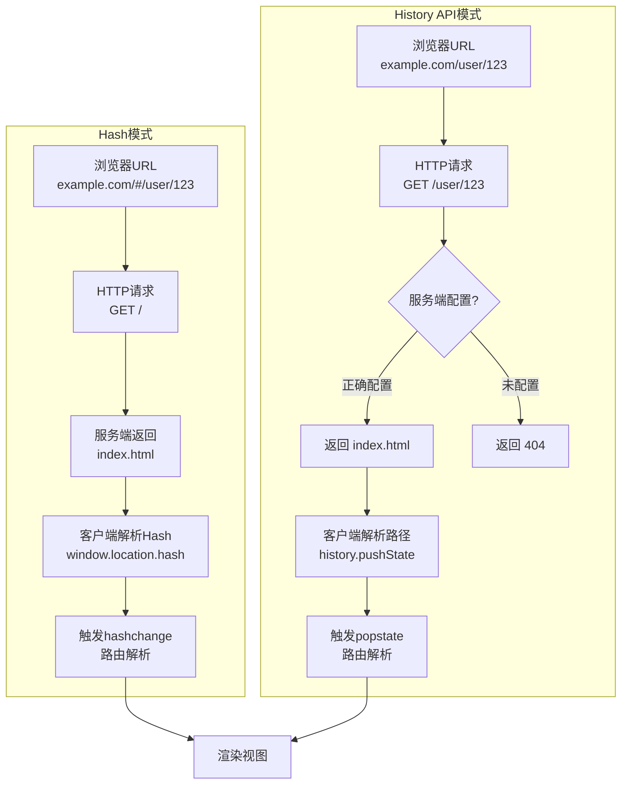

# 路由与导航：SPA路由的形式化

## 引言

在单页应用（Single Page Application, SPA）的架构中，路由系统承担着连接用户操作与界面状态的核心职责。
从用户点击一个链接，到浏览器地址栏URL的变化，再到对应视图的渲染，这一过程看似直观，实则蕴含了深刻的理论结构。如果我们把路由抽象为一个数学对象，它究竟是什么？是一个函数、一个关系，还是一个状态机？不同前端框架对路由的实现有何共性与差异？
为何React Router v6引入了`loader`与`action`的概念？Vue Router的导航守卫又如何在形式化视角下被理解为前置条件检查？

本文采用"双轨并行"的论述策略：在理论轨道上，我们将路由形式化为从URL到应用状态的映射函数，探讨其代数性质（组合、参数化、嵌套），分析History API与Hash模式的语义差异，
并将路由守卫解释为前置条件逻辑；在工程轨道上，我们将逐一剖析React Router v6、Vue Router 4、Next.js App Router以及TanStack Router的设计决策，讨论懒加载、预取策略与移动端特殊场景。
通过这种理论与实践的交叉验证，我们试图建立一套理解前端路由的连贯认知框架。

---

## 理论严格表述

### 1. 路由的形式化定义

从形式化视角，我们可以将路由系统定义为一个三元组 `(U, S, V)`，其中：

- `U` 为URL空间（URL Space），即所有可能的URL字符串集合；
- `S` 为应用状态空间（State Space），包含当前激活的路由参数、查询字符串、历史栈等；
- `V` 为视图空间（View Space），即可被渲染的组件或页面集合。

路由函数 `R` 可形式化为一个部分函数（Partial Function）：

```
R: U × H → S × V
```

其中 `H` 表示历史上下文（History Context），包括当前在历史栈中的位置、浏览器会话状态等。该函数是"部分"的，因为并非所有URL都能映射到有效的视图——当 `u ∈ U` 无法匹配任何已注册的模式时，系统应回退到错误视图（404）或默认视图。

更精细地，我们可以将 `R` 分解为两个连续映射：

```
Match: U × P → M    (匹配阶段：URL × 模式集合 → 匹配结果)
Resolve: M × S → V  (解析阶段：匹配结果 × 当前状态 → 目标视图)
```

其中 `P` 为路由模式集合（Path Patterns），`M` 为包含提取参数后的匹配对象。这种分解揭示了路由系统的两层职责：**识别**（Recognition）与**决议**（Resolution）。在React Router v6中，`matchPath`对应 `Match` 阶段，而元素树渲染对应 `Resolve` 阶段。

值得注意的是，路由函数 `R` 通常不是纯函数（Pure Function），因为它具有副作用：修改浏览器历史栈（`history.pushState`）、触发滚动行为、调用数据获取逻辑等。从函数式编程的视角，一个更纯粹的定义应为：

```
R_pure: U × H → (S × V × Effect*)
```

其中 `Effect*` 表示副作用序列，包括导航副作用（历史栈操作）、数据副作用（API调用）、UI副作用（滚动恢复）等。

### 2. 路由的代数性质

将路由视为代数结构，我们可以识别出若干重要性质：

**组合性（Composition）**：给定路由 `R₁: U₁ → V₁` 和 `R₂: U₂ → V₂`，若 `U₁ ∩ U₂ = ∅`，则可定义并组合 `R₁ ⊕ R₂: U₁ ∪ U₂ → V₁ ∪ V₂`。这一性质是子路由（Child Routes）和嵌套路由（Nested Routes）的理论基础。在Vue Router中，`children`数组正是组合操作的具体实现；在React Router v6中，嵌套的`<Route>`元素通过JSX层次结构表达组合关系。

**参数化（Parametrization）**：路由模式常包含动态段，如 `/user/:id`。形式化地，参数化路由是从参数空间 `Θ` 到具体URL的函数族：

```
P: Θ → U
```

对于模式 `/user/:id`，参数空间 `Θ = {id: string}`，函数 `P(θ) = "/user/" + θ.id`。参数化赋予了路由以"函数"特性——给定不同输入产生不同输出视图。

**嵌套性（Nesting）与上下文继承**：嵌套路由不仅是简单的组合，还涉及上下文的逐层传递。若父路由 `R_parent` 提取了参数 `θ_parent`，子路由 `R_child` 在解析时可访问 `θ_parent` 作为隐式上下文。形式化地：

```
R_nested(u, θ_parent) = R_child(u, θ_parent ∪ θ_child)
```

这一性质解释了为何在嵌套路由中，子组件能自然访问父路由参数——这是上下文传递（Context Propagation）的直接结果。

**幂等性争议**：理想情况下，对同一URL的重复导航应产生相同的状态与视图。然而在实际中，路由解析可能依赖外部状态（如全局Store、权限缓存），因此严格幂等性往往不成立。路由守卫的存在本身就是为了处理非幂等的访问控制逻辑。

### 3. 前端路由的历史模式：Hash vs History API

浏览器提供了两种实现客户端路由的核心机制，二者在信息论与语义层面存在本质差异。

**Hash模式**利用URL片段标识符（Fragment Identifier），形式化为：

```
URL_hash = Base + "#" + Fragment
```

其中 `Fragment` 不参与HTTP请求，仅由浏览器本地解析。Hash路由的核心优势在于无需服务端配合——任何URL变化仅触发`hashchange`事件，不会导致页面重载。从语义学角度，Hash最初设计用于文档内锚点定位，将其重用于路由是一种"语义借用"（Semantic Borrowing）。其局限包括：Hash部分不会随HTTP请求发送，因此服务端无法基于Hash进行初始渲染；URL中出现`#`被认为不够"干净"；某些Web分析工具对Hash变化的追踪支持不佳。

**History API模式**（常称"Browser模式"）利用HTML5 `history.pushState` 与 `popstate` 事件，允许无刷新地修改完整URL路径。形式化地：

```
Op = { PUSH, REPLACE, POP }
Transition: S × Op × URL → S'
```

History模式提供了更完整的URL语义，支持深层链接（Deep Linking）和服务端渲染（SSR），但要求服务端配置回退规则（Fallback Rules），对所有未知路径返回应用的入口HTML。这是因为直接访问 `/user/123` 时，浏览器会发起HTTP GET请求，若服务端未配置，将返回404。

两种模式的本质差异可归纳为下表：

| 维度 | Hash模式 | History API模式 |
|------|----------|-----------------|
| URL形态 | `/#/user/123` | `/user/123` |
| 服务端依赖 | 无 | 需配置回退 |
| SSR支持 | 不支持 | 支持 |
| SEO友好度 | 较差 | 良好 |
| 语义纯粹性 | 借用锚点语义 | 符合REST路径语义 |
| 状态持久化 | 仅Hash变化 | 完整URL+State对象 |

### 4. 路由守卫的形式化：前置条件检查

路由守卫（Route Guards）是控制访问流的机制，可在导航发生前、中、后介入。形式化地，守卫是一组谓词函数（Predicates）与转换函数：

```
Guard_before: S × U_target → { ALLOW, DENY, REDIRECT }
Guard_after: S' × V → Effect*
Guard_update: S × U → boolean   (决定是否允许离开当前路由)
```

前置守卫 `Guard_before` 实现了**霍尔逻辑**（Hoare Logic）中的前置条件检查：只有当当前状态 `S` 与目标URL `U_target` 满足特定条件时，导航才被允许。例如：

- 身份守卫：`isAuthenticated(S.user) → ALLOW`
- 权限守卫：`hasPermission(S.user, U_target.resource) → ALLOW`
- 数据完备性守卫：`isProfileComplete(S.user) → ALLOW ∨ REDIRECT("/complete-profile")`

Vue Router的导航守卫体系最为完备：`beforeEach`（全局前置）、`beforeEnter`（路由独享）、`beforeRouteEnter`（组件内）、`beforeRouteUpdate`、`beforeRouteLeave`。React Router v6则通过`loader`函数在渲染前执行数据获取与权限检查，虽然语义上略有差异（更偏向数据加载而非纯粹守卫），但实现了相似的访问控制目标。

从类型系统角度，理想的路由守卫应具有如下类型签名：

```typescript
type Guard<S, P, R> = (context: NavigationContext<S>, params: P) => Promise<R>
// 其中 R ∈ { Continue, Redirect(url), Cancel(reason) }
```

这揭示了守卫的异步本质——权限检查、令牌刷新等操作往往是异步的，因此守卫系统必须支持Promise或类似异步原语。

### 5. 路由与状态同步的理论

路由与全局应用状态的关系存在两种基本范式：

**双向绑定范式**（Two-Way Binding）：路由变化自动更新状态，状态变化也自动更新路由。Vue Router配合Pinia/Vuex时，可通过`watch`路由参数实现这种同步。形式化地：

```
U ↔ S  (双向同步)
```

这种范式的优势是直观，缺点是可能导致循环依赖与不可预测的状态流——当路由变化和状态变化同时触发时，调试变得困难。

**单向数据流范式**（One-Way Data Flow）：URL是状态的单一数据源（Single Source of Truth），所有状态变更必须通过路由导航完成。React Router v6与Redux配合时，推荐这种范式。形式化地：

```
U → S → V  (单向推导)
```

React Router v6的`loader`/`action`设计强化了这种单向性：`loader`在导航时读取数据，`action`在表单提交时更新数据，然后重新验证（Revalidation）触发视图更新。URL始终处于数据流的上游。

**同步的时序问题**：当快速连续触发导航（如用户连续点击两个链接），路由系统必须处理竞态条件（Race Conditions）。标准策略是"后到达者优先"（Last-Arrival Wins）：当新的导航开始时，取消（或忽略）前一个未完成的导航请求。React Router的`useNavigation`和Vue Router的导航Promise都内建了这种竞态处理。

### 6. 深层链接（Deep Linking）的语义

深层链接指的是通过完整URL直接访问应用内部特定状态的能力。形式化地，深层链接要求路由函数 `R` 是**可逆的**（Invertible）——至少存在部分逆函数：

```
Given V_target, ∃ u ∈ U such that R(u) = (_, V_target)
```

深层链接的语义价值在于：**URL成为应用状态的可序列化标识符**。这意味着：

1. **可分享性**：用户可将当前视图状态通过URL分享给他人；
2. **可书签化**：浏览器书签可以捕获特定应用状态；
3. **可恢复性**：应用重启后可通过URL恢复到之前的状态。

实现深层链接的挑战在于，某些UI状态（如弹窗打开、滚动位置、临时表单输入）可能过于细粒度，不适合编码到URL中。此时需要区分**地址化状态**（Addressable State，应放入URL）与**瞬时状态**（Ephemeral State，保存在内存或Storage中）。

在移动端，深层链接还涉及**Universal Links**（iOS）与**App Links**（Android），其语义是将Web URL映射到原生应用的具体页面。这与Web端的客户端路由形成镜像关系：

```
Web: URL → Web App Router → Web View
Mobile: URL → OS Router → Native Screen
```

## Mermaid 图表

### 图表1：SPA路由的形式化映射

以下图表展示了路由作为"URL × 历史 → 状态 × 视图 × 副作用"的形式化映射流程：

```mermaid
flowchart TD
    U[URL u ∈ U] --> M[Match阶段<br/>matchPath / 正则匹配]
    H[历史上下文 H] --> M
    P[路由模式集合 P] --> M
    M --> |提取参数| MP[匹配结果 M<br/>{ params, query, hash }]
    MP --> R[Resolve阶段<br/>组件解析]
    S[当前状态 S] --> R
    R --> V[目标视图 V]
    R --> E[副作用序列 Effect*<br/>history.pushState / 滚动 / 数据获取]
    V --> DOM[DOM渲染]
    E --> DOM
    style M fill:#e1f5fe
    style R fill:#fff3e0
    style E fill:#fce4ec
```

此图直观呈现了路由函数 `R: U × H → S × V × Effect*` 的分解结构。`Match` 与 `Resolve` 的分阶段设计是主流路由库（React Router、Vue Router）的共同模式。

### 图表2：路由守卫的霍尔逻辑结构

路由守卫可视为导航事务的前置条件、不变式与后置条件集合：

```mermaid
flowchart LR
    Start([导航请求]) --> Before[前置守卫<br/>beforeEach / loader]
    Before -- 条件不满足 --> Redirect[重定向或取消]
    Before -- 条件满足 --> Async[异步解析<br/>数据加载 / 代码分割]
    Async --> Enter[进入路由<br/>组件实例化]
    Enter --> After[后置守卫<br/>afterEach / 滚动恢复]
    After --> End([渲染完成])
    Redirect --> End2([导航终止])

    subgraph "Hoare逻辑对应"
    direction TB
    Pre[前置条件<br/>{P}]
    Inv[不变式<br/>{I}]
    Post[后置条件<br/>{Q}]
    end

    Before -.->|检查| Pre
    Enter -.->|保持| Inv
    After -.->|确保| Post
```

### 图表3：Hash模式 vs History模式的语义差异



---

## 工程实践映射（续）

### 7. React Router v6的声明式路由与loader/action模式

React Router v6是对之前版本的一次重大重构，其核心设计哲学从"配置式路由"转向"数据驱动路由"。在v6中，路由定义与数据加载逻辑被紧密耦合：

```jsx
// React Router v6 的 loader/action 模式示例
import { createBrowserRouter, RouterProvider } from "react-router-dom";

const router = createBrowserRouter([
  {
    path: "/",
    element: `<Layout />`,
    children: [
      {
        path: "projects/:projectId",
        element: `<ProjectPage />`,
        loader: async ({ params }) => {
          // 在渲染前加载数据
          const res = await fetch(`/api/projects/${params.projectId}`);
          if (!res.ok) throw new Response("Not Found", { status: 404 });
          return res.json();
        },
        action: async ({ request, params }) => {
          // 处理表单提交
          const formData = await request.formData();
          await fetch(`/api/projects/${params.projectId}`, {
            method: "POST",
            body: formData,
          });
          return null;
        },
      },
    ],
  },
]);
```

`loader` 函数在导航到该路由时执行，其返回值通过 `useLoaderData()` 在组件中访问。这一设计将数据获取从组件生命周期（如 `useEffect`）中解耦，使数据依赖成为路由的显式属性。形式化地，React Router v6将路由函数扩展为：

```
R_rr6: U → (V × Data × Action)
```

其中 `Data` 是 `loader` 返回的数据，`Action` 是表单提交的处理函数。这种设计强化了"URL作为状态单一数据源"的理念。

React Router v6还引入了**嵌套数据流**：父路由的 `loader` 先执行，子路由的 `loader` 后执行，且子路由可访问父路由的加载数据。这与形式化模型中的"上下文继承"完全吻合。

### 8. Vue Router的导航守卫

Vue Router 4提供了最为完备的守卫体系，其执行顺序严格遵循"由内而外"与"由外而内"的组合规则：

```typescript
// Vue Router 4 导航守卫示例
import { createRouter, createWebHistory } from "vue-router";

const router = createRouter({
  history: createWebHistory(),
  routes: [
    {
      path: "/admin",
      component: AdminPanel,
      beforeEnter: (to, from) => {
        // 路由独享守卫
        if (!isAdmin()) return { name: "Forbidden" };
      },
      children: [
        { path: "settings", component: AdminSettings },
      ],
    },
  ],
});

// 全局前置守卫
router.beforeEach(async (to, from, next) => {
  const requiresAuth = to.matched.some((record) => record.meta.requiresAuth);
  if (requiresAuth && !await checkAuth()) {
    return { name: "Login", query: { redirect: to.fullPath } };
  }
});

// 全局后置钩子
router.afterEach((to, from) => {
  document.title = to.meta.title || "Default Title";
});
```

Vue Router守卫的完整执行顺序为：

1. `beforeEach`（全局前置）
2. `beforeEnter`（路由独享）
3. `beforeRouteEnter`（组件内，不支持`this`访问）
4. 全局解析守卫 `beforeResolve`
5. 导航确认，DOM更新
6. `afterEach`（全局后置）
7. 组件内 `beforeRouteEnter` 的 `next` 回调

这种分层守卫模型为访问控制提供了极高的灵活性。例如，可在全局守卫中检查身份认证，在路由独享守卫中检查角色权限，在组件内守卫中检查数据完备性。

Vue Router的导航还具有**明确的Promise语义**：

```typescript
router.push("/user/123")
  .then(() => {
    // 导航成功且完成
  })
  .catch((failure) => {
    if (isNavigationFailure(failure, NavigationFailureType.aborted)) {
      // 导航被守卫中止
    }
  });
```

这种设计使异步导航的竞态条件处理变得明确和可控。

### 9. Next.js的文件系统路由

Next.js App Router（13+）引入了基于文件系统的路由约定，其核心理念是：**文件路径即路由路径，目录结构即嵌套结构**。例如：

```
app/
├── page.tsx              → /
├── layout.tsx            → 根布局
├── loading.tsx           → 根级加载UI
├── error.tsx             → 根级错误边界
├── blog/
│   ├── page.tsx          → /blog
│   └── [slug]/
│       ├── page.tsx      → /blog/:slug
│       └── loading.tsx   → 该路由的加载UI
└── (marketing)/          → 路由组（不参与URL）
    ├── about/
    │   └── page.tsx      → /about
    └── contact/
        └── page.tsx      → /contact
```

这种约定优于配置（Convention over Configuration）的设计大幅降低了路由定义的认知负担。形式化地，Next.js定义了一个从文件系统树 `T_file` 到路由树 `T_route` 的满射函数：

```
NextRoute: T_file → T_route
```

Next.js App Router还引入了**React Server Components（RSC）**，使组件级别可区分服务端渲染与客户端渲染。`page.tsx` 默认为Server Component，若需客户端交互，需显式添加 `"use client"` 指令。这相当于在路由层面引入了"位置"维度：

```
Render(Component, Location) where Location ∈ { Server, Client }
```

这种设计对路由理论的影响是深远的：传统的路由函数 `R: U → V` 现在必须考虑视图组件的渲染位置，因为同一URL在不同位置渲染具有不同的性能与语义特性。

### 10. TanStack Router的类型安全路由

TanStack Router（原React Location）将类型安全作为核心设计目标。其路由定义充分利用TypeScript的类型推断，使链接、参数、查询字符串均获得编译时检查：

```typescript
import { createRouter, Route } from "@tanstack/react-router";

// 类型安全的路由定义
const routeTree = rootRoute.addChildren([
  Route.lazy("/posts/$postId", {
    params: {
      postId: z.string().uuid(),  // 运行时校验与类型推断结合
    },
    search: {
      page: z.number().optional(),
      filter: z.string().optional(),
    },
  }),
]);

// 类型安全的链接
`<Link to="/posts/$postId" params={{ postId: "abc" }} search={{ page: 2 }}>`
// 编译错误！postId必须是UUID格式，page必须是number
```

TanStack Router的类型安全不仅限于路径参数，还扩展到查询字符串（Search Params）和路由状态。形式化地，它定义了一个类型化路由函数：

```
R_typed: U_typed → V_typed
```

其中 `U_typed` 是满足特定模式约束的URL子集，`V_typed` 是对应的强类型视图组件。这种设计将大量运行时错误前移到编译期，显著提升了大型项目的可维护性。

TanStack Router还内置了**搜索参数状态管理**：查询字符串可被视为全局状态的序列化形式，TanStack Router通过 `useSearch` 和 `navigate` 提供了对这种状态的标准化操作。

### 11. 路由懒加载与代码分割

路由级代码分割是减少初始bundle体积的标准策略。形式化地，它将路由映射从即时解析改为惰性求值：

```
R_lazy(u) = { R(u),       if Chunk(u) already loaded
            { Loading,    while Chunk(u) fetching
            { Error,      if Chunk(u) fetch failed
```

各框架的实现方式：

**React Router v6**：

```jsx
const Dashboard = React.lazy(() => import("./Dashboard"));
`<Route path="/dashboard" element={`<Suspense fallback={`<Spinner />`}><Dashboard /></Suspense>`} />`
```

**Vue Router**：

```typescript
const routes = [
  {
    path: "/dashboard",
    component: () => import("./Dashboard.vue"), // 自动懒加载
  },
];
```

**SvelteKit / SolidStart**：
基于文件系统的约定自动为每个路由生成独立的chunk，开发者通常无需手动配置。

懒加载的挑战在于**加载状态的UI设计**与**错误处理**。框架通过 `Suspense`（React）、`defineAsyncComponent` 的loading/error插槽（Vue）或自动的`loading.tsx`（Next.js）来标准化这些状态。

### 12. 路由预取（Prefetching）策略

预取是在用户实际导航前提前加载目标路由的代码与数据。形式化地，预取是将未来的导航成本前移到当前空闲时间：

```
Prefetch(u, t_now): 在t_now时刻预加载Chunk(u)与Data(u)
Navigate(u, t_future): 在t_future时刻，成本降为0或极低
```

预取策略包括：

- **悬停预取**（Hover Prefetch）：当用户鼠标悬停在链接上时触发。Next.js的`<Link>`默认在悬停时预取路由代码；
- **可视预取**（Viewport Prefetch）：当链接进入可视区域时触发。Vue Router的`router.prefetch`和SvelteKit的`data-sveltekit-preload="viewport"`支持此策略；
- **智能预取**（Predictive Prefetch）：基于用户行为模式预测下一步导航。例如，在电商结账流程中，当用户进入购物车页时预取结算页。

预取的权衡在于**带宽与缓存**的消耗。过度预取可能浪费用户流量（尤其在移动端），因此需要策略性地限制并发预取数量与优先级。

### 13. 移动端路由的特殊考量

移动端Web应用（以及混合应用如Cordova/Capacitor）在路由层面面临桌面端不存在的挑战：

**返回按钮处理**：
移动设备的物理/虚拟返回按钮触发浏览器的`popstate`事件（History模式）或`hashchange`事件（Hash模式）。在SPA中，返回按钮的行为需要与应用的导航栈语义对齐。例如：

- 模态框/底部弹窗打开时，按返回应关闭弹窗而非退出页面；
- 多级表单填写中，返回应回到上一步而非直接离开流程。

这需要框架支持"虚拟历史条目"（Virtual History Entries）：在打开弹窗时调用 `history.pushState({ modal: true }, "", "#modal")`，在返回时检测该状态并执行关闭逻辑而非路由切换。

**转场动画**：
移动端用户对转场动画有更高期待。Vue Router提供`<Transition>`与`<KeepAlive>`的内建集成；React社区依赖`react-transition-group`或`framer-motion`实现。形式化地，转场动画引入了路由状态的"中间态"：

```
S → S_transition → S'
```

在 `S_transition` 期间，旧视图与新视图可能同时存在于DOM中，这对路由的清理逻辑（如取消旧视图的API请求）提出了更高要求。

**手势导航**：
iOS的侧滑返回与Android的返回手势需要路由系统与触摸事件协调。某些框架（如Ionic）提供了专门的手势路由库，将滑动手势直接与历史栈操作绑定。

---

## 理论要点总结

1. **路由的本质是部分函数**：`R: U × H → S × V × Effect*`，它并非纯函数，而是包含历史栈操作、数据获取、滚动恢复等副作用的计算过程。

2. **路由具有代数结构**：组合性（子路由与嵌套）、参数化（动态段作为函数参数）、以及上下文继承（父路由参数向子路由传递）构成了路由的代数基础。

3. **Hash与History模式是语义不同的设计**：Hash模式借用了锚点语义，无需服务端配合但牺牲SEO与SSR能力；History模式符合REST路径语义，但需要服务端回退配置。

4. **路由守卫是前置条件检查的形式化体现**：全局守卫、路由独享守卫与组件内守卫构成了分层访问控制结构，对应霍尔逻辑中的 `{P} C {Q}` 三元组。

5. **单向数据流优于双向绑定**：URL应作为状态的单一数据源（Single Source of Truth），React Router v6的`loader`/`action`模式与Vue Router的导航Promise都服务于这一范式。

6. **深层链接要求路由函数可逆**：URL必须能编码足够的状态信息以支持分享、书签与状态恢复，但需区分地址化状态与瞬时状态。

7. **移动端路由引入虚拟历史与转场语义**：物理返回键、手势导航与转场动画要求路由系统支持中间态与虚拟历史条目管理。

---

## 参考资源

1. React Router Documentation. *Route Module API*. React Training / Remix Software. <https://reactrouter.com/en/main/route/route> — React Router v6官方文档，涵盖`loader`/`action`/`errorElement`的数据驱动路由设计。

2. Vue Router Documentation. *Navigation Guards*. Vue.js Core Team. <https://router.vuejs.org/guide/advanced/navigation-guards.html> — Vue Router 4导航守卫的完整执行顺序与API参考。

3. Next.js Documentation. *Routing Fundamentals*. Vercel. <https://nextjs.org/docs/app/building-your-application/routing> — Next.js App Router基于文件系统的路由约定与React Server Components集成。

4. Tanner Linsley. *TanStack Router Documentation*. TanStack. <https://tanstack.com/router/latest/docs/framework/react/overview> — 类型安全路由的设计哲学与实现细节。

5. Michael Jackson & Ryan Florence. *React Router v6: Data APIs*. React Training, 2023. — React Router v6从声明式路由到数据驱动路由的范式转变技术论述。

6. Eduardo San Martin Morote. *Vue Router 4 Design*. Vue.js Blog, 2020. — Vue Router 4的重新设计动机，包括导航的Promise语义与组合式API集成。
