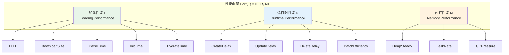
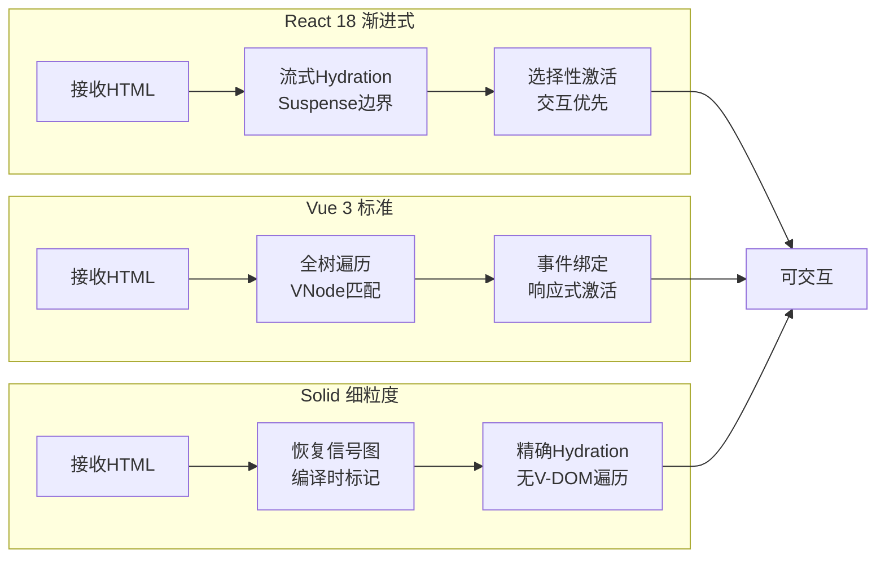

# 框架性能模型：启动/运行时/内存

## 引言

性能是前端框架选型的核心考量之一，但它远非一个单一的标量指标。当我们谈论"React比Vue慢"或"Svelte没有虚拟DOM所以更快"时，实际上是在混淆不同维度的性能概念。启动时的首屏加载速度、交互后的响应延迟、长时间运行后的内存占用——这三者遵循不同的物理规律，受不同因素主导，甚至在某些场景下存在此消彼长的权衡关系。

本文首先建立一个三维度性能模型，从形式化角度界定加载性能、运行时性能与内存性能的度量空间；继而深入分析关键渲染路径（Critical Rendering Path, CRP）的瓶颈理论，以及First Contentful Paint（FCP）与Time to Interactive（TTI）的数学定义；随后将理论映射到工程实践，系统对比React、Vue、Svelte、Preact与Solid在bundle体积、hydration速度、更新延迟与内存占用上的实测数据；最后讨论代码分割、懒加载、虚拟列表等优化策略的形式化本质。通过这一论述，我们希望将"框架性能"从模糊的口碑评判转化为可度量、可比较、可优化的多维向量。

---

## 理论严格表述

### 1. 前端性能的三维度模型

前端框架的性能无法被压缩为单一数值。我们将其形式化为一个三维性能向量：

```
Perf(F) = ⟨L(F), R(F), M(F)⟩
```

其中：

- **L(F)**：加载性能（Loading Performance），衡量框架从HTML文档到达可交互状态所需的时间与资源；
- **R(F)**：运行时性能（Runtime Performance），衡量框架在响应用户交互与数据更新时的延迟与吞吐量；
- **M(F)**：内存性能（Memory Performance），衡量框架在运行期间的堆内存占用及其随时间的增长趋势。

这三个维度并非正交——例如，更小的bundle（提升L）可能意味着更少的预编译优化，导致运行时开销增加（降低R）；而更快的更新响应（提升R）可能需要维护更复杂的内部数据结构（降低M）。框架设计本质上是在这三维空间中的帕累托前沿（Pareto Frontier）上寻找平衡点。

**加载性能L(F)** 可进一步分解为：

```
L(F) = f(TTFB, DownloadSize, ParseTime, InitTime, HydrateTime)
```

其中TTFB（Time to First Byte）主要取决于服务端/网络，与框架关系较小；`DownloadSize`受框架运行时体积与打包策略影响；`ParseTime`与`InitTime`是框架运行时脚本被解析和执行的时间；`HydrateTime`特指SSR场景中框架将水合（Hydration）逻辑附加到静态HTML上的开销。

**运行时性能R(F)** 关注更新路径的延迟：

```
R(F) = g(CreateDelay, UpdateDelay, DeleteDelay, BatchEfficiency)
```

在基准测试中，常通过操作1000行表格的创建、更新、删除来度量这些分量。

**内存性能M(F)** 关注堆内存的稳态占用与泄漏趋势：

```
M(F) = h(HeapSteady, LeakRate, GCPressure)
```

`HeapSteady`是应用空闲时的内存占用；`LeakRate`是长时间运行后的内存增长斜率；`GCPressure`是垃圾回收的频率与持续时间。

### 2. 关键渲染路径（CRP）的形式化

关键渲染路径是浏览器将HTML、CSS和JavaScript转换为屏幕上像素的过程。形式化地，CRP可建模为一个偏序事件集合（Partially Ordered Set of Events）：

```
CRP = ⟨E, ≺⟩
E = { DownloadHTML, ParseHTML, DownloadCSS, ParseCSS, DownloadJS, ParseJS, ExecuteJS, BuildDOM, BuildCSSOM, BuildRenderTree, Layout, Paint, Composite }
```

其中 `≺` 表示事件间的优先依赖关系。例如：`BuildDOM` 必须在 `ParseHTML` 之后；`BuildRenderTree` 需要 `BuildDOM` 与 `BuildCSSOM` 都完成后才能开始。

框架对CRP的影响主要体现在 `DownloadJS`、`ParseJS`、`ExecuteJS` 与 `BuildDOM` 阶段：

1. **DownloadJS**：框架运行时的体积直接增加网络传输时间。React 18（生产版，gzip后约42KB）与Vue 3（约34KB）的差异在此阶段即可体现。

2. **ParseJS** 与 **ExecuteJS**：浏览器解析和执行JavaScript是主线程阻塞操作。框架的初始化代码（如创建虚拟DOM工具函数、响应式系统的全局状态）在此阶段运行。Svelte与Solid由于编译时将大量工作前置，运行时脚本更小，解析执行时间更短。

3. **BuildDOM**：在CSR（Client-Side Rendering）中，框架通过JavaScript构建DOM树；在SSR+Hydration中，框架需要遍历已存在的DOM节点并附加事件监听器。Hydration的复杂度通常为O(n)，其中n为DOM节点数。

关键路径的长度（Critical Path Length）决定了首屏渲染的理论下界：

```
FCP ≥ max_path_weight(CRP)
```

优化CRP的核心策略是缩短关键路径、减少关键资源数量、以及压缩关键资源的体积。

### 3. FCP与TTI的理论基础

**First Contentful Paint（FCP）** 衡量从导航开始到浏览器首次渲染任何文本、图像或非白色canvas的时间。形式化地：

```
FCP = min{ t | Screen(t) ≠ Screen(0) }
```

其中 `Screen(t)` 表示t时刻屏幕像素的集合。FCP是一个感知性能指标——它标志着用户首次看到"有内容"的反馈。

FCP的理论下界由关键渲染路径决定，但框架可以通过以下方式影响实际FCP：

- **SSR/SSG**：服务端直接返回完整HTML，使FCP接近TTFB；
- **流式传输**（Streaming）：React 18的`renderToPipeableStream`允许在数据就绪前渐进发送HTML；
- **资源优先级**：通过`<link rel="preload">`提升关键资源的加载优先级。

**Time to Interactive（TTI）** 衡量页面变得"完全可交互"的时间——即主线程空闲足够长（通常定义为5秒内的长任务不超过50ms），且已绑定关键事件处理器。形式化地：

```
TTI = min{ t | ∀τ > t, MainThreadBlocked(τ, τ+50ms) = false ∧ EventHandlersBound }
```

TTI与FCP之间的间隙被称为"交互等待期"（Interaction Wait Gap）。框架的hydration时间直接影响这一间隙：在hydration完成前，虽然页面可见，但用户交互（如点击按钮）可能无响应或导致全页刷新。

React 18引入的**并发渲染**（Concurrent Rendering）和**选择性hydration**（Selective Hydration）从理论上缩短了TTI：通过将hydration工作拆分为可中断的单元，主线程能在用户交互时暂停hydration并响应事件。形式化地，这相当于将原本单批次的hydration函数 `Hydrate(DOM)` 拆分为一组子任务：

```
Hydrate_concurrent(DOM) = Σᵢ Hydrate_chunk(DOMᵢ)
```

其中每个 `Hydrate_chunk` 是可被更高优先级任务（如用户输入）抢占的调度单元。

### 4. 框架开销模型

任何框架都引入相对于原生JavaScript的额外开销。我们将框架开销形式化为一个叠加在原生操作之上的延迟层：

```
T_framework = T_native + Δ_init + Δ_reconcile + Δ_cleanup
```

其中：

- `Δ_init`：框架初始化开销（创建内部状态、注册全局副作用等）；
- `Δ_reconcile`：协调/差异检测开销（Virtual DOM Diffing、细粒度依赖追踪等）；
- `Δ_cleanup`：组件卸载时的清理开销（取消订阅、移除监听器、释放内存等）。

不同框架的Δ分布截然不同：

| 框架 | Δ_init | Δ_reconcile | Δ_cleanup | 核心机制 |
|------|--------|-------------|-----------|----------|
| React | 中等 | 较高（V-DOM Diff） | 中等 | Virtual DOM + 协调 |
| Vue | 中等 | 中等（V-DOM + 响应式） | 低 | Proxy响应式 + V-DOM |
| Svelte | 低 | 极低（编译时优化） | 极低 | 编译时生成更新代码 |
| Solid | 低 | 极低（细粒度信号） | 低 | 细粒度响应式（无V-DOM） |
| Preact | 低 | 中等（简化V-DOM） | 低 | React兼容的轻量V-DOM |

Svelte与Solid之所以在运行时性能上表现优异，核心在于将`Δ_reconcile`最小化：Svelte在编译阶段生成直接的DOM操作指令，消除了运行时的虚拟DOM比较；Solid通过细粒度信号（Signals）追踪依赖，仅更新发生变化的精确DOM节点，无需对比整棵树。

### 5. 内存泄漏的形式化检测

内存泄漏在SPA中是常见问题，形式化地定义为：

```
∃ Object o, t₀: Allocated(o, t₀) ∧ ¬Reachable(o, t) ∧ ¬GC'd(o, t) for t >> t₀
```

即对象在分配后长期处于"不可达但未被回收"的状态。在框架语境下，泄漏通常由以下模式导致：

- **未取消的订阅**：组件卸载后，对全局Store、EventEmitter或RxJS Observable的订阅仍在活动，导致闭包中引用的组件实例无法释放；
- **定时器未清理**：`setInterval`或`setTimeout`的回调持有组件引用；
- **DOM引用泄漏**：框架的ref或模板引用在组件卸载后仍指向已移除的DOM节点；
- **事件监听器累积**：在`document`或`window`上添加的监听器未在组件生命周期结束时移除。

框架的内存管理策略影响泄漏概率。React的`useEffect`返回清理函数的设计，从API层面强制开发者思考副作用的清理；Vue的`onUnmounted`生命周期钩子和`watchEffect`的自动追踪提供了类似的机制。然而，框架无法完全防止泄漏——若开发者在`useEffect`中订阅了全局事件但未返回取消订阅函数，泄漏仍将发生。

### 6. 性能基准测试方法论

js-framework-benchmark是当前最具影响力的前端框架性能基准测试。其设计原理遵循以下方法论原则：

1. **操作标准化**：测试用例固定为创建1000行、更新每行、交换两行、删除一行、清空全部。这种标准化确保跨框架的可比性。

2. **度量隔离**：每个测试运行在独立页面，避免交叉污染；通过Chrome DevTools Protocol（CDP）精确采集性能数据。

3. **多次采样**：每个测试运行多次，取中位数或平均值，降低噪声影响。

4. **多维度量**：不仅测量执行时间，还测量内存分配、启动时间、包体积等。

形式化地，基准测试可视为一个高阶函数：

```
Benchmark: Framework × Operation × Metric → Measurement
```

其中 `Metric ∈ { Duration, Memory, CPU, BundleSize }`。需要警惕的是，基准测试结果高度依赖测试环境（硬件、浏览器版本、构建配置），且测试用例可能无法代表真实应用的复杂模式。因此，基准测试应被视为"受控实验"而非"绝对真理"。

---

## 工程实践映射

### 1. 各框架的Bundle大小对比

Bundle体积直接影响加载性能L(F)中的`DownloadSize`与`ParseTime`。以下是主要框架的生产构建体积（gzip压缩后，仅运行时，不含应用代码）：

| 框架 | 运行时体积（gzip） | 特点 |
|------|-------------------|------|
| React 18 | ~42 KB | 含调度器、协调器、JSX运行时 |
| React 19 | ~38 KB | 优化了对象分配与调度逻辑 |
| Vue 3 | ~34 KB | 含响应式系统、编译器运行时 |
| Preact 10 | ~4 KB | React API兼容，极致轻量 |
| Svelte 5 | ~2 KB（运行时） | 大部分逻辑编译到应用代码中 |
| Solid 1.0 | ~7 KB | 细粒度响应式运行时 |
| Angular 17 | ~60 KB+ | 含依赖注入、路由、表单等完整方案 |

Preact与Svelte在体积上具有显著优势，但需注意：**框架运行时所占比例随应用规模增大而减小**。一个100KB的应用使用React（+42KB）总重142KB，而使用Preact（+4KB）总重104KB——差距从10倍缩小到1.37倍。因此，bundle大小对小型应用的影响远大于大型应用。

此外，tree-shaking效率也影响实际体积。Vue 3和Svelte的模块设计更有利于tree-shaking，未使用的功能不会被打包。React虽然也在改善tree-shaking支持，但由于历史API设计（如`createClass`的兼容层），部分代码难以完全消除。

### 2. Hydration性能对比

在SSR/SSG场景中，hydration是将静态HTML转化为可交互应用的关键步骤。不同框架的hydration策略差异显著：

**React的渐进式Hydration**：

- React 18之前：整棵树同步hydration，阻塞主线程直至完成；
- React 18+：支持`hydrateRoot`与`Suspense`边界，允许选择性hydration。通过`renderToPipeableStream`，服务端可流式发送HTML，客户端在收到`<Suspense>`边界时即可开始局部hydration。

**Vue 3的Hydration**：

- Vue的hydration过程包括：遍历DOM节点、匹配虚拟节点、附加事件监听器、激活响应式系统。
- Vue 3.4+引入了`v-bind`的SSR优化，减少了hydration不匹配（Hydration Mismatch）的概率。

**Svelte的No-Hydration选项**：

- SvelteKit支持"渐进增强"（Progressive Enhancement）模式：如果页面不需要JavaScript交互，可以完全不hydration，仅保留静态HTML。

**Solid的Fine-Grained Hydration**：

- Solid利用编译时信息，在hydration时直接恢复细粒度依赖图，无需遍历虚拟DOM树，因此hydration速度极快。

实测数据显示（基于js-framework-benchmark的SSR变体与社区测试）：

| 框架 | TTFB | FCP | TTI（hydration后） | Hydration耗时 |
|------|------|-----|-------------------|---------------|
| React 18 | 中等 | 中等 | 中等 | 较高（整树遍历） |
| Vue 3 | 中等 | 中等 | 中等 | 中等 |
| SvelteKit | 快 | 快 | 快 | 低（编译优化） |
| SolidStart | 快 | 快 | 快 | 极低（细粒度恢复） |

### 3. 运行时更新性能

js-framework-benchmark的核心测试是1000行表格的CRUD操作。以下是各框架在执行时间与内存分配上的典型表现（取社区公认的基准测试趋势，具体数值随版本波动）：

**创建1000行**：

- Solid与Svelte通常领先，因为它们的DOM操作是编译时生成的精确指令，无需运行时协调；
- Vue与Preact居中，Virtual DOM的差异检测引入一定开销；
- React居中偏后，但在React 19的编译器（React Compiler）优化后差距正在缩小。

**更新1000行（部分更新）**：

- Solid表现最优：细粒度信号确保仅更新的单元格被重新渲染；
- Svelte紧随其后：编译时生成的更新代码同样精确；
- Vue 3借助Proxy的细粒度追踪，性能优于React；
- React需要全树Diff（除非使用`memo`/`useMemo`手动优化），基础开销最大。

**删除一行**：

- 涉及DOM移除与事件清理。框架的清理效率在此测试中差异明显。Vue和Solid的清理机制较为高效；React需要遍历Fiber树执行副作用清理。

### 4. 内存占用对比

长期运行的SPA面临内存泄漏风险。各框架的内存特性如下：

**React**：

- Fiber节点树在内存中持续存在，每个组件实例对应一个Fiber对象；
- 若未正确清理`useEffect`订阅，闭包引用的状态对象无法释放；
- React DevTools本身也会增加内存开销（生产环境应禁用）。

**Vue**：

- 响应式系统的Dep（依赖收集器）维护Watcher列表，组件卸载时会清理；
- 但全局状态（Pinia/Vuex）若被组件引用且未正确解绑，同样会导致泄漏。

**Svelte**：

- 编译时生成"撕裂函数"（Teardown Functions），组件卸载时自动执行；
- 由于无虚拟DOM，内存中没有持久的树结构，内存占用通常最低。

**Solid**：

- 细粒度依赖图在内存中存在，但结构扁平；
- 信号与计算的清理与组件生命周期绑定，泄漏风险较低。

**内存泄漏检测工具**：

- Chrome DevTools的Memory面板（Heap Snapshot、Allocation Timeline）；
- `performance.memory` API（非标准，Chrome可用）；
- 框架专用工具：React的`<Profiler>`、Vue DevTools的组件内存视图。

### 5. 性能优化策略

**代码分割（Code Splitting）**：

形式化地，代码分割将应用代码空间 `Code` 划分为若干子集：

```
Code = ∪ᵢ Chunkᵢ
```

每个`Chunkᵢ`按需加载。框架通过动态`import()`实现路由级或组件级的分割。React的`React.lazy`、Vue的`defineAsyncComponent`、Solid的`lazy`都封装了这一模式。

**懒加载（Lazy Loading）**：

与代码分割协同工作，懒加载推迟非关键资源的获取：

```
Load(V) = { Immediate,  if V ∈ CriticalPath
          { Deferred,   if V ∈ NonCritical
```

在路由层面，这意味着初始加载仅包含当前路由的代码，其他路由在进入时才加载。

**虚拟列表（Virtual Scrolling）**：

当渲染大量DOM节点时，虚拟列表将渲染空间限制为可视区域加上缓冲区域：

```
RenderSet = { i | viewport_top - buffer ≤ i × item_height ≤ viewport_bottom + buffer }
```

这将对10000个节点的O(n)渲染开销，降低为对可见50个节点的O(1)（相对总数）开销。React的`react-window`、Vue的`vue-virtual-scroller`、Solid的`solid-virtual`均实现了这一模式。

**防抖与节流**：

输入事件的高频触发（如滚动、缩放、键盘输入）需要通过防抖（Debounce）或节流（Throttle）控制回调频率：

```
Debounce(f, Δt): 在事件停止触发Δt后执行一次f
Throttle(f, Δt): 每Δt时间窗口内最多执行一次f
```

框架层面通常提供`useDebounce`（React）或`watch`的`flush: 'post'`选项（Vue）来集成这些模式。

### 6. Web Vitals与框架的关系

Google的Core Web Vitals已成为前端性能的行业标准。三个核心指标与框架的关系如下：

**LCP（Largest Contentful Paint）**：

- 衡量最大可见内容的渲染时间。框架通过SSR/SSG、资源预加载、图片优化（如`next/image`的自动优化）来影响LCP。

**INP（Interaction to Next Paint，原FID）**：

- 衡量交互响应延迟。框架的运行时更新性能直接影响INP。React 18的并发特性、Vue的异步队列、Solid的细粒度更新都是为了最小化INP。

**CLS（Cumulative Layout Shift）**：

- 衡量布局稳定性。框架通过预留空间（如骨架屏）、避免无尺寸图片、控制异步内容加载来减少CLS。

框架自身对Web Vitals的影响可概括为：框架提供了实现优化的**工具与约束**，但最终的Vitals分数仍取决于开发者的使用方式。例如，React提供了`Suspense`用于流式加载，但如果开发者将所有内容包裹在一个巨大的`Suspense`边界中，流式优势将丧失。

---

## Mermaid 图表

### 图表1：前端性能三维度模型



### 图表2：关键渲染路径（CRP）事件偏序图

```mermaid
flowchart TD
    DHTML[Download HTML] --> PHTML[Parse HTML]
    DCSS[Download CSS] --> PCSS[Parse CSS]
    DJS[Download JS] --> PJS[Parse JS]
    PJS --> EJS[Execute JS]

    PHTML --> BDOM[Build DOM]
    PCSS --> BC[Build CSSOM]
    BDOM --> BRT[Build Render Tree]
    BC --> BRT
    EJS --> BDOM

    BRT --> L[Layout]
    L --> P[Paint]
    P --> C[Composite]
    C --> FCP[FCP<br/>First Contentful Paint]
    EJS --> TTI[TTI<br/>Time to Interactive]

    style FCP fill:#c8e6c9
    style TTI fill:#ffcc80
```



### 图表3：框架Hydration策略对比



---

## 理论要点总结

1. **性能是三维向量而非标量**：加载性能（L）、运行时性能（R）与内存性能（M）遵循不同规律，框架设计是在三维帕累托前沿上寻找平衡。

2. **关键渲染路径决定理论下界**：FCP ≥ max_path_weight(CRP)。框架通过影响DownloadJS、ParseJS、ExecuteJS与BuildDOM阶段来改变实际性能。

3. **Hydration是SSR场景的瓶颈**：TTFB到TTI之间的间隙由hydration时间主导。并发hydration（React 18）、编译时优化（Svelte）和细粒度恢复（Solid）是缩短这一间隙的三大技术路径。

4. **框架开销可分解为Δ_init + Δ_reconcile + Δ_cleanup**：Svelte与Solid通过编译时和细粒度策略最小化Δ_reconcile，而React通过并发渲染降低感知延迟。

5. **内存泄漏的形式化定义是"不可达但未被回收"**：框架提供清理机制（useEffect返回函数、onUnmounted），但无法自动防止闭包引用导致的泄漏。

6. **基准测试是受控实验而非绝对真理**：js-framework-benchmark的标准化操作与多次采样提供了可比性，但真实应用的性能特征可能与基准测试不同。

7. **Web Vitals是框架性能的下游度量**：框架提供实现优化的工具（Suspense、懒加载、并发渲染），但最终分数取决于开发者的使用方式。

---

## 参考资源

1. Stefan Krause. *js-framework-benchmark*. GitHub Repository, continuously updated. <https://github.com/krausest/js-framework-benchmark> — 前端框架性能基准测试的行业标准，提供创建、更新、删除1000行等标准化测试的跨框架对比数据。

2. Google Chrome Team. *Web Vitals*. Google Developers, 2024. <https://web.dev/articles/vitals> — Core Web Vitals（LCP、INP、CLS）的正式定义、度量方法与优化指南。

3. React Team. *React Performance Documentation*. Meta Open Source. <https://react.dev/reference/react> — React官方性能文档，涵盖并发渲染、`useTransition`、`useDeferredValue`等性能优化API。

4. Vue.js Core Team. *Vue Performance Optimization Guide*. Vue.js Documentation. <https://vuejs.org/guide/best-practices/performance.html> — Vue官方性能优化指南，涵盖虚拟列表、懒加载、tree-shaking等实践策略。

5. Ryan Carniato. *SolidJS Performance: The Fastest Frontend Framework?*. SolidJS Blog, 2023. <https://www.solidjs.com> — SolidJS作者对细粒度响应式性能优势的阐述，包含与虚拟DOM框架的对比分析。

6. Addy Osmani. *The Cost of JavaScript*. Google Developers, 2019/2023 updates. <https://v8.dev/blog/cost-of-javascript-2019> — V8引擎团队对JavaScript解析、编译与执行成本的深度分析，是理解框架运行时开销的理论基础。
