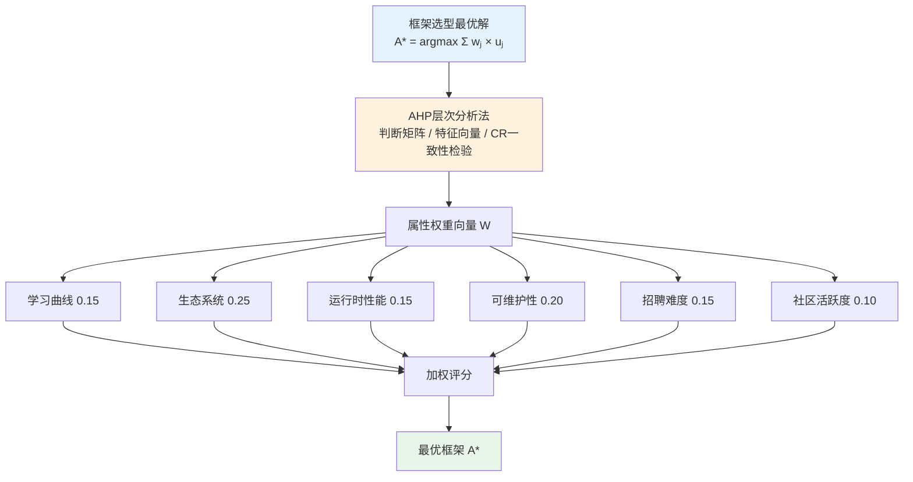
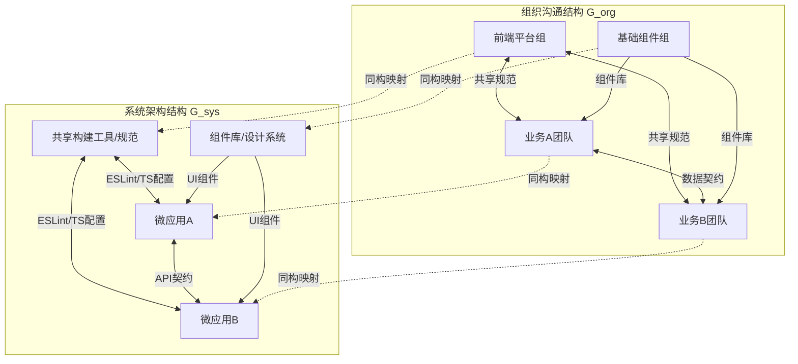
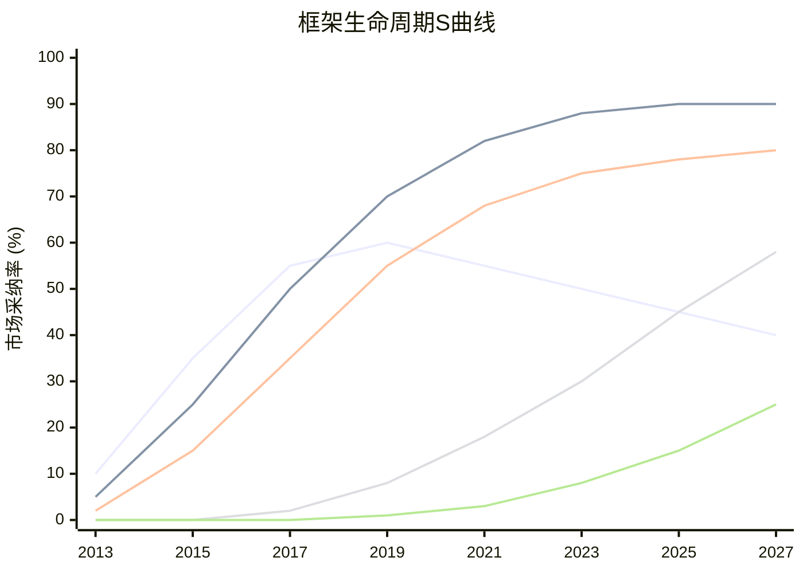
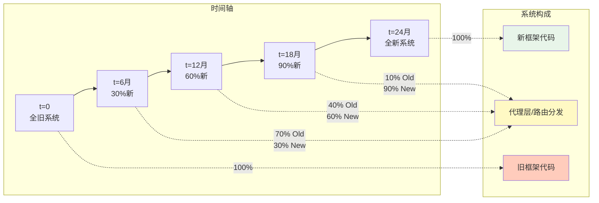

# 框架选型理论：决策模型与权衡

## 引言

"我们该用React还是Vue？"这是前端领域被问得最多的问题之一，也是最容易陷入主观偏好的决策之一。不同开发者基于个人经验可能给出截然不同的答案，但企业级技术选型需要的是结构化、可复现、可追溯的决策过程。框架选型不仅关乎技术本身，更与组织架构、团队能力、产品阶段、生态成熟度乃至招聘市场深度耦合。

本文首先建立框架选型的多属性决策模型，将模糊的主观偏好转化为可量化的加权评估；随后引入康威定律（Conway's Law）解释为何组织架构会约束技术架构选择，并建立技术债务与框架迁移的成本模型；在工程实践层面，我们提供前端框架选型决策树、企业级案例分析、渐进式迁移策略与微前端中的多框架共存方案；最后，我们将目光投向未来，讨论编译时框架的崛起趋势与AI辅助选型的可能性。通过这些理论与实践的交织，我们希望将框架选型从"宗教战争"提升为工程决策科学。

---

## 理论严格表述

### 1. 技术选型的多属性决策模型

框架选型是一个典型的**多属性决策问题**（Multi-Attribute Decision Making, MADM）。形式化地，给定备选框架集合 `A = {A₁, A₂, ..., Aₙ}` 与评估属性集合 `C = {C₁, C₂, ..., Cₘ}`，决策目标是寻找一个最优框架 `A* ∈ A`，使得综合效用最大化：

```
A* = argmaxₐ Σⱼ wⱼ × uⱼ(a)
```

其中 `wⱼ` 是属性 `Cⱼ` 的权重（满足 `Σⱼ wⱼ = 1`），`uⱼ(a)` 是框架 `a` 在属性 `Cⱼ` 上的标准化效用值。

常用的评估属性（维度）包括：

| 维度 | 符号 | 度量方式 | 典型权重范围 |
|------|------|----------|-------------|
| 学习曲线 | C_learn | 新手达到生产力所需时间 | 0.10 - 0.20 |
| 生态系统 | C_eco | NPM包数量、工具链成熟度 | 0.15 - 0.25 |
| 运行时性能 | C_perf | 基准测试分数、Bundle大小 | 0.10 - 0.20 |
| 可维护性 | C_maint | 类型安全、测试工具、代码规范 | 0.10 - 0.20 |
| 招聘难度 | C_hire | 人才市场供给、薪资水平 | 0.10 - 0.15 |
| 社区活跃度 | C_comm | GitHub Stars、贡献者数、版本迭代频率 | 0.05 - 0.10 |
| 企业支持 | C_ent | 商业支持、长期维护承诺 | 0.05 - 0.10 |

**层次分析法（AHP）** 是确定权重 `wⱼ` 的经典方法。通过构造判断矩阵（Pairwise Comparison Matrix），决策者对每对属性的相对重要性进行评分。例如：

```
        学习曲线  生态  性能  可维护性
学习曲线    1      1/3   1/2    1/4
生态        3       1     2     1/2
性能        2      1/2    1     1/3
可维护性    4       2     3      1
```

通过计算该矩阵的最大特征值对应的特征向量，可得各属性权重。AHP的一致性比率（Consistency Ratio, CR）确保决策者的判断逻辑自洽（通常要求CR < 0.1）。

**加权评分模型（Weighted Scoring Model）** 则是更轻量的实现方式。对每个框架在每个维度上打分（如1-5分），然后加权求和：

```
Score(a) = Σⱼ wⱼ × scoreⱼ(a)
```

例如，对React与Vue的简化评分：

| 维度 | 权重 | React | Vue |
|------|------|-------|-----|
| 学习曲线 | 0.15 | 3 | 4 |
| 生态系统 | 0.25 | 5 | 4 |
| 性能 | 0.15 | 3 | 4 |
| 可维护性 | 0.20 | 4 | 4 |
| 招聘难度 | 0.15 | 4 | 3 |
| 社区活跃度 | 0.10 | 5 | 4 |
| **加权总分** | 1.00 | **3.95** | **3.80** |

（注：分数仅为示意，实际应根据具体项目评估。）

### 2. 康威定律与框架选择

康威定律（Conway's Law）由Melvin Conway于1968年提出，其核心命题是：

> "设计系统的组织，其产生的设计等价于这些组织间的沟通结构。"

形式化地，若组织的沟通图（Communication Graph）为 `G_org = ⟨V_org, E_org⟩`，则系统架构图 `G_sys` 满足：

```
G_sys ≅ G_org
```

即二者在图论意义上同构（或至少高度相似）。

康威定律对框架选型的启示在于：**框架的模块化与团队的组织方式必须匹配**。例如：

- **高度分散的团队**（多独立小组、跨地域）：需要强约定、强规范的框架（如Angular），通过CLI、严格的编码规范和模块化结构减少沟通成本；
- **高度集中的团队**（小型精英团队、同一办公空间）：可选择灵活、轻量的框架（如React + 自建生态），允许团队快速实验与定制；
- **平台型组织**（多业务线、共享基础组件）：需要组件库与框架深度集成，Vue或React配合设计系统（Design System）更为适合。

违反康威定律的框架选择将导致**组织摩擦**（Organizational Friction）——团队被迫采用与其沟通模式不匹配的架构，从而增加协调成本。例如，一个大型传统企业选择极简的React而不建立配套规范，最终会产生数百种不同的项目结构、状态管理方案和组件写法，形成"野生态"而非"生态系统"。

### 3. 技术债务与框架迁移的成本模型

技术债务（Technical Debt）是Ward Cunningham提出的隐喻，指为了短期交付速度而采取的次优技术决策所积累的长期成本。框架层面的技术债务形式化地可定义为：

```
Debt(t) = Debt(0) + ∫₀ᵗ InterestRate(τ) dτ
```

其中 `Debt(0)` 是初始选型带来的债务基数，`InterestRate(t)` 是债务增长率，取决于框架的演化速度、社区的弃用节奏以及团队的技术迭代能力。

框架迁移的成本模型更为复杂。从框架 `F_old` 迁移到 `F_new` 的总成本包括：

```
Cost_migration = Cost_rewrite + Cost_retrain + Cost_risk + Opportunity_cost
```

其中：

- `Cost_rewrite`：重写代码的直接成本（人·天），通常与代码量和框架间差异正相关；
- `Cost_retrain`：团队学习新框架的成本，与学习曲线和团队规模正相关；
- `Cost_risk`：迁移期间的稳定性风险，包括功能回退、安全漏洞、性能下降等；
- `Opportunity_cost`：迁移期间未能开发新功能的机会成本。

**迁移的临界点**出现在债务累积成本超过迁移成本时：

```
∫ Debt_interest dt > Cost_migration
```

企业应在达到临界点前规划迁移，否则将陷入"债务陷阱"——维护旧框架的成本吞噬了迁移所需的投资能力。

### 4. 框架生命周期的S曲线理论

技术采纳遵循S曲线（Sigmoid Curve）模型：

```
Adoption(t) = L / (1 + e^(-k(t - t₀)))
```

其中 `L` 是市场饱和上限，`k` 是增长率，`t₀` 是拐点时间。框架的生命周期可分为四个阶段：

1. **引入期**（Introduction）：早期采用者试用，生态初建，API不稳定；
2. **成长期**（Growth）：主流采纳加速，生态爆发，最佳实践形成；
3. **成熟期**（Maturity）：市场饱和，增量放缓，框架进入维护模式；
4. **衰退期**（Decline）：新范式取代，社区萎缩，人才流失。

当前的框架生命周期定位（示意性）：

| 框架 | 生命周期阶段 | 特征 |
|------|-------------|------|
| React | 成熟期 | 社区庞大，API稳定，增量创新（Server Components） |
| Vue | 成熟期 | 亚洲市场强势，v3已稳定，v4规划启动 |
| Angular | 成熟期/衰退期边缘 | 企业存量大，但新增项目减少 |
| Svelte | 成长期 | 采纳率上升，生态快速扩展 |
| Solid | 引入期/成长期 | 技术领先，社区较小，企业采用谨慎 |
| Qwik | 引入期 | 革新性恢复能力模型，待验证 |

选型的风险与回报在不同阶段呈反比：引入期框架可能带来技术领先优势，但也伴随生态不成熟和项目夭折风险；成熟期框架提供稳定性和丰富资源，但可能错过新范式红利。

---

## 工程实践映射

### 1. 前端框架选型决策树

基于上述理论模型，我们可以构建一个实用的选型决策树：

**第一层：项目类型**

- **内容型/营销站点**（博客、文档、落地页）：优先考虑SSG框架（Astro、Next.js SSG、Nuxt Content），而非纯客户端框架；
- **管理后台/CRM**（重表单、重表格、权限复杂）：Angular或React + Ant Design / React Admin；
- **高交互SPA**（SaaS产品、社交应用、编辑器）：React或Vue，视团队熟悉度；
- **性能极度敏感**（实时数据、高频动画、嵌入式）：Solid或Svelte；
- **全栈应用**（需API路由、数据库、认证）：Next.js、Nuxt、SvelteKit、SolidStart。

**第二层：团队规模与结构**

- **1-3人初创团队**：选择学习曲线平缓、开发效率高的框架（Vue、Svelte）；
- **10-50人中型团队**：需要生态丰富、招聘友好的框架（React、Vue）；
- **100+人大型团队/多团队**：需要强规范、强工具链的框架（Angular、React + 严格ESLint/TypeScript规则）；
- **跨地域分布式团队**：选择约定优于配置的框架，减少沟通成本。

**第三层：性能需求**

- **一般消费级应用**：React、Vue均可，优化主要靠工程实践；
- **低端设备/弱网环境**：Preact、Svelte、Solid；
- **实时/高频更新**：Solid（细粒度响应式）或React + canvas/WebGL自定义渲染。

**第四层：生态偏好与历史约束**

- **已有React生态投资**：迁移成本通常高于继续深耕，除非有明确痛点；
- **需要原生移动端（iOS/Android）**：React Native或NativeScript；
- **需要桌面端（Electron/Tauri）**：React与Vue均有良好支持；
- **TypeScript优先**：Angular（TS内置）、Vue 3（TS重写）、React（TS支持成熟）。

### 2. 企业级框架选型案例

**案例一：某大型电商平台选择React**

背景：团队500+前端，多业务线并行，已有成熟组件库与构建工具链。

选型理由：

1. **生态锁定**：已投入大量资源建设React组件库、工具链和CI/CD流程，迁移成本极高；
2. **招聘市场**：React开发者供给最充足，尤其资深工程师；
3. **跨端统一**：React Native支持移动端，可共享部分业务逻辑；
4. **Meta背书**：React的长期维护有商业保障（虽然Meta可能调整策略，但社区已足够大）。

代价：Bundle体积较大，低端设备性能需额外优化；并发渲染的学习曲线较陡。

**案例二：某中型SaaS公司从AngularJS迁移至Vue 3**

背景：2015年基于AngularJS构建，至2022年技术债务累积严重，性能与维护性成为瓶颈。

迁移策略：

1. **渐进式迁移**：新功能模块使用Vue 3开发，通过微前端架构与旧AngularJS共存；
2. **组件替换**：优先替换用户高频访问的核心组件（如表格、表单）；
3. **数据层抽象**：将API层抽象为框架无关的服务，减少迁移阻力。

结果：历时18个月完成主体迁移，期间业务未中断，团队生产力在迁移中期即开始回升。

**案例三：某金融科技初创选择Svelte**

背景：团队8人，构建高频交易数据可视化平台，对初始加载速度和更新延迟极度敏感。

选型理由：

1. **性能优先**：Svelte的编译时优化消除了虚拟DOM开销，表格更新延迟降低60%；
2. **Bundle极小**：初始加载速度优于React方案3倍（在弱网环境下差距更大）；
3. **开发效率**：Svelte的模板语法简洁，小型团队可快速上手。

代价：招聘Svelte开发者困难，部分第三方库无Svelte封装需自研；长期生态不确定性。

### 3. 框架迁移策略

**渐进式迁移（Strangler Fig Pattern）**：

源自Martin Fowler的"绞杀者无花果"模式，形式化地：

```
System(t) = α(t) × F_new + (1 - α(t)) × F_old
α(0) = 0, α(T) = 1
```

其中 `α(t)` 是新框架代码占比随时间的递增函数。实现方式包括：

- **微前端架构**：每个子应用使用独立框架，通过运行时集成（如Module Federation、qiankun、single-spa）组合；
- **路由级迁移**：按页面/路由逐步迁移，用户无感知；
- **组件级迁移**：在旧框架中嵌入新框架组件，或反之（如React的`react-vue`适配器、Vue的`vuera`）。

**大爆炸重写（Big Bang Rewrite）**：

形式化地，这是 `α(t)` 的阶跃函数：

```
α(t) = 0, t < T
α(t) = 1, t ≥ T
```

大爆炸重写的风险极高——开发期间旧系统仍需维护，新系统可能永远无法达到旧系统的功能完整性（"第二系统效应"）。仅在以下条件下考虑：

- 旧系统规模极小（<1万行）；
- 旧系统技术债务已到无法维护的地步；
- 业务可承受数月的冻结期。

**混合迁移策略**：

实践中更常见的是混合策略：核心路径渐进式迁移，边缘模块大爆炸替换。这种策略平衡了风险与速度。

### 4. 框架组合策略：微前端中的多框架共存

微前端（Micro-Frontends）允许在同一页面中运行多个独立的前端应用，可能使用不同框架。形式化地，微前端运行时是一个容器调度器：

```
Container: { App₁, App₂, ..., Appₙ } × Route × EventBus → DOM
```

多框架共存的工程挑战包括：

**共享依赖**：

- 若每个微应用都打包React，总bundle将膨胀。解决方案：通过Module Federation或Import Maps共享运行时。

**样式隔离**：

- 不同框架的CSS可能冲突。Shadow DOM、CSS-in-JS（如Styled Components、Emotion）、BEM命名约定是常见隔离策略。

**状态共享**：

- 跨框架状态共享需要框架无关的通信层。Redux、Zustand、RxJS或原生`CustomEvent`均可作为共享状态总线。

**路由协调**：

- 各微应用的路由器需与顶层路由协调。例如，基座应用使用History API，子应用需在基座路由变化时响应，同时避免重复操作历史栈。

主流微前端方案对比：

| 方案 | 框架无关性 | 运行时隔离 | 共享依赖 | 复杂度 |
|------|-----------|-----------|----------|--------|
| single-spa | 高 | JS沙箱 | 需配置 | 中等 |
| qiankun | 高 | JS+CSS沙箱 | 需配置 | 中等 |
| Module Federation | 中 | 无内置隔离 | 原生支持 | 较高 |
| Web Components | 高 | Shadow DOM | 需配置 | 低（组件级） |
| iframe | 完全 | 最强 | 无法共享 | 低（但体验差） |

### 5. 未来框架趋势预判

**编译时框架的崛起**：

React Compiler（原React Forget）、Vue的Vapor Mode、Svelte的Runes模式，共同指向一个方向：**将运行时的协调工作前移到编译阶段**。形式化地，这是将 `Δ_reconcile`（运行时开销）转化为 `Δ_compile`（构建时开销）：

```
T_total = T_build + T_runtime
T_build↑, T_runtime↓, T_total↓  (当构建并行化且运行时节省显著时)
```

这一趋势的极限是"零运行时框架"——如VanJS（虽然极简单）或某些WASM编译方案，但完全零运行时牺牲了灵活性，更可能的是"极小运行时"成为主流。

**AI辅助框架选择**：

随着LLM的能力提升，框架选型可能部分自动化。AI可基于以下输入生成推荐：

- 项目需求描述（自然语言）；
- 团队技能图谱（GitHub/GitLab数据）；
- 性能约束（目标设备、网络条件）；
- 生态约束（需集成的第三方服务）。

形式化地，AI辅助选型是一个条件概率模型：

```
P(F | Requirements, Team, Constraints) = P(Requirements | F) × P(Team | F) × P(Constraints | F) × P(F)
```

然而，AI目前无法替代人类决策中的组织政治、战略愿景和文化因素。AI更适合作为"选项生成器"和"数据分析师"，而非最终决策者。

**Server Components与 islands架构**：

React Server Components（RSC）和Astro的Islands Architecture代表了"服务端/客户端边界重新划分"的趋势。形式化地，这是在渲染函数 `Render` 中引入位置参数：

```
Render(Component, Location) where Location ∈ { Server, Client, Edge }
```

这种趋势模糊了"前端框架"与"全栈框架"的边界，未来的选型将不再只是React vs Vue，而是Next.js vs Nuxt vs SvelteKit vs Remix的全栈生态竞争。

---

## Mermaid 图表

### 图表1：框架选型多属性决策模型



### 图表2：康威定律——组织沟通图与系统架构图的同构



### 图表3：框架生命周期S曲线与技术采纳阶段



### 图表4：渐进式迁移的绞杀者模式



---

## 理论要点总结

1. **框架选型是多属性决策问题（MADM）**：通过AHP层次分析法确定属性权重，再对各框架进行加权评分，可将主观偏好转化为可复现的量化决策。

2. **康威定律约束框架选择**：组织的沟通结构 `G_org` 与系统架构 `G_sys` 高度同构。分散团队需强规范框架（如Angular），集中团队可选灵活框架（如React），违反此定律将产生组织摩擦。

3. **技术债务遵循积分模型**：`Debt(t) = Debt(0) + ∫ InterestRate(τ) dτ`。迁移的临界点出现在债务累积成本超过迁移成本时，企业应在达到临界点前规划迁移。

4. **框架生命周期呈S曲线**：引入期、成长期、成熟期、衰退期四个阶段的风险与回报呈反比。React与Vue处于成熟期，Svelte处于成长期，Solid处于引入期/成长期过渡。

5. **渐进式迁移优于大爆炸重写**：绞杀者模式通过函数 `α(t)` 平滑过渡，风险可控；大爆炸重写是阶跃函数，仅在系统极小时可行。

6. **微前端实现多框架共存，但引入协调成本**：共享依赖、样式隔离、状态共享与路由协调是四大工程挑战，Module Federation与Import Maps是共享运行时的新兴方案。

7. **编译时框架与Server Components是两大趋势**：前者将 `Δ_reconcile` 前移为 `Δ_compile`，后者重新划分服务端/客户端渲染边界，两者共同模糊了传统前端框架的边界。

---

## 参考资源

1. Melvin Conway. *How Do Committees Invent?*. Datamation, 1968. <https://www.melconway.com/Home/Committees_Paper> — 康威定律的原始论文，阐述了组织沟通结构与系统设计之间的同构关系。

2. Robert C. Martin. *Clean Architecture: A Craftsman's Guide to Software Structure and Design*. Prentice Hall, 2017. — 本书第2部分讨论了技术债务、架构边界与渐进式迁移的理论基础。

3. Tom Krazit. *Framework Selection in Enterprise Software*. InfoWorld / Various Enterprise Architecture Guides, 2019-2023. — 企业级框架选型的多维评估方法论，涵盖AHP与加权评分模型的实际应用案例。

4. State of JS Survey. *Frontend Frameworks Section*. Devographics, annually. <https://stateofjs.com> — 全球最大的JavaScript开发者调查，提供框架采纳率、满意度、认知度的年度统计数据，是评估社区活跃度与生命周期阶段的重要依据。

5. Martin Fowler. *Strangler Fig Application*. martinfowler.com, 2004. <https://martinfowler.com/bliki/StranglerFigApplication.html> — 渐进式迁移模式的经典论述，阐述了通过代理层逐步替换旧系统的工程策略。

6. Ward Cunningham. *The WyCash Portfolio Management System*. OOPSLA 1992 Experience Report. — 技术债务（Technical Debt）隐喻的原始提出，为理解框架迁移中的累积成本提供了概念基础。
