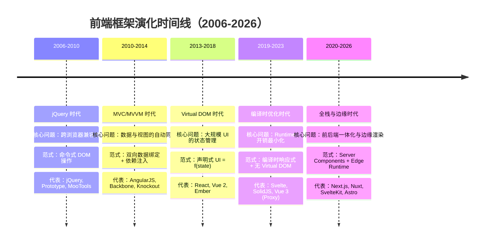
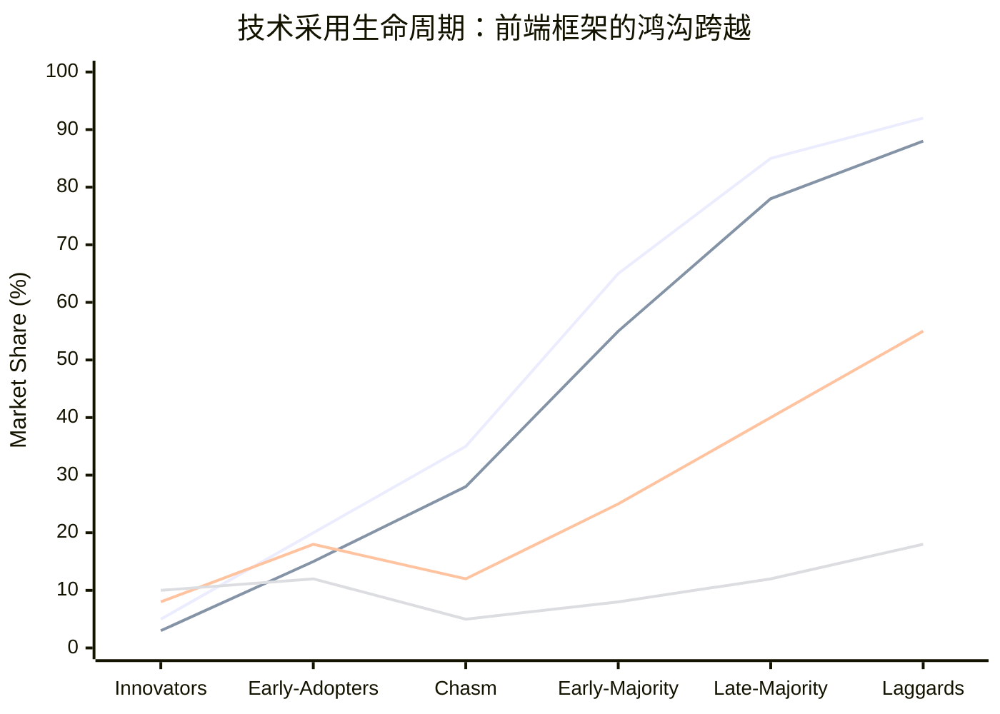
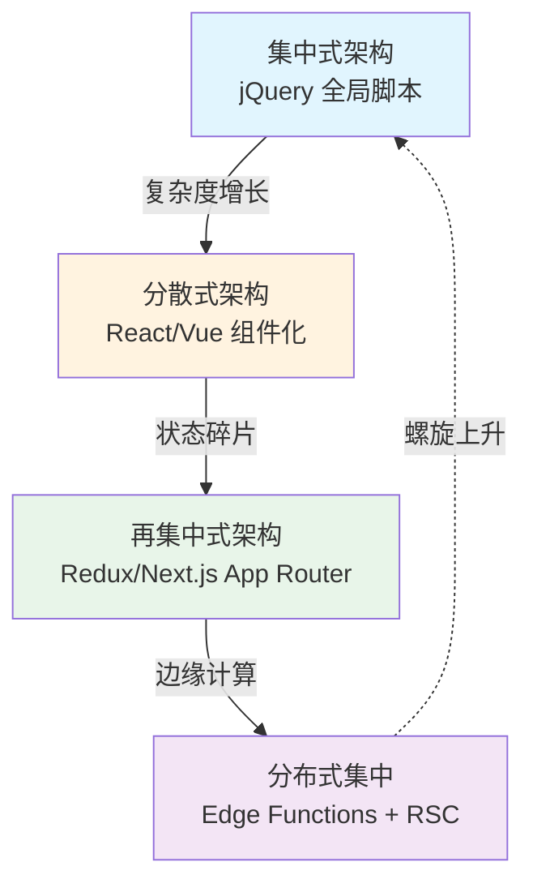
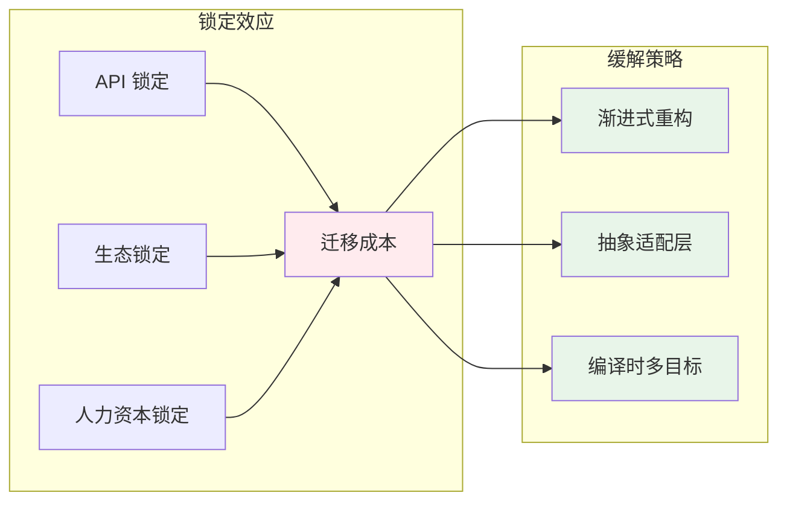

# 框架演化模式：从 jQuery 到现代

## 引言

前端开发领域在过去二十年间经历了数轮剧烈的范式转移（Paradigm Shift）。
从 2006 年 jQuery 以链式 DOM 操作一统江湖，到 2013 年 React 引入 Virtual DOM 与声明式编程，再到 2019 年 Svelte 将响应式系统推向编译时——每一次重大技术更迭不仅重塑了开发者的工具链，更深刻地改变了我们组织代码、管理状态与构建用户界面的思维方式。

然而，框架的演化并非随机发生的偶然事件。
在其背后，存在着可被理论化描述的规律：Lehman 的软件开发定律揭示了软件系统随时间必然增长的复杂性；
Rogers 的创新扩散理论解释了为何某些框架能迅速占领市场而另一些则悄然消亡；
Moore 的「跨越鸿沟」模型则说明了从早期采用者到早期多数用户之间的致命断层。
理解这些理论，不仅有助于我们解释历史，更能为预测未来提供分析框架。

本文采用「理论严格表述」与「工程实践映射」双轨并行的结构，首先建立软件演化与技术采用的核心理论模型，随后将其映射到前端框架的具体演化史中，最终提炼出框架选型、技术迁移与架构演化的实践启示。

---

## 理论严格表述

### 1. Lehman 的软件开发定律：持续演化的必然性

Meir Lehman 及其合作者在 1970 年代至 1980 年代通过对大型软件系统（尤其是 IBM OS/360 系列）的长期观察，提出了一系列关于软件演化的经验定律。
这些定律虽然诞生于大型机时代，但其核心洞见对理解现代前端框架的演化仍具有深刻的解释力。

**定律 I：持续变更定律（Law of Continuing Change）**

> 一个正在使用的程序，如果不持续地进行适应性修改，其有用性将随时间逐渐降低。

这一定律揭示了软件系统与外部环境之间持续的张力。对于前端框架而言，浏览器的演化（ES6+ 新特性、Web Components、Performance API）、硬件能力的提升（多核 CPU、GPU 加速）、网络条件的变化（5G、HTTP/3）以及用户期望的升级（即时交互、离线可用）共同构成了框架必须持续适应的「外部环境」。jQuery 的衰落并非因为其设计存在根本缺陷，而是因为它未能及时适应模块加载、组件化与声明式数据绑定的时代需求。

**定律 II：递增复杂度定律（Law of Increasing Complexity）**

> 随着程序的不断演化，其内部复杂度将持续增加，除非主动进行重构或简化。

Lehman 区分了「E-type 系统」（嵌入真实世界并与之交互的系统）与「S-type 系统」（基于形式化规范、可在理论上验证正确性的系统）。前端框架无疑是典型的 E-type 系统——它们嵌入在复杂的浏览器生态、网络环境与用户行为模式中。每一次新增特性（如 React Hooks、Vue Composition API、Svelte Runes）在解决特定问题的同时，也在增加框架的认知表面积。这种复杂度的累积最终会成为新范式诞生的催化剂。

**定律 VI：持续增长定律（Law of Continuing Growth）**

> 为了满足用户不断增长的期望，E-type 系统的功能必须持续增长。

从 jQuery 提供的基础 DOM 操作，到 AngularJS 引入的依赖注入与双向绑定，再到现代框架内置的服务端渲染（SSR）、静态站点生成（SSG）、边缘渲染与开发服务器——框架的功能边界在持续扩张。这种增长既是竞争优势的来源，也是架构债务的温床。

**定律 VIII：反馈系统定律（Law of Feedback System）**

> E-type 软件系统必须被当作反馈系统来理解和维护，每一次变更都会改变系统状态并影响后续演化。

前端框架的演化具有明显的路径依赖性（Path Dependence）。React 选择 JSX 与 Virtual DOM 后，整个生态系统（Babel、Webpack、Next.js、React DevTools）都围绕这一核心假设进行优化，形成了强大的正反馈循环。这种反馈机制使得框架的核心架构决策一旦做出，便极难逆转。

### 2. 框架演化的三重驱动力

基于 Lehman 定律的扩展，我们可以将框架演化的驱动力归纳为三个相互交织的维度：

**技术突破（Technology Push）**

底层技术的突破为框架演化提供了新的可能性空间。V8 引擎的性能革命使 JavaScript 从脚本语言跃升为通用编程语言；ES6 Module 的标准化使基于模块的构建工具链（Webpack、Rollup、Vite）成为可能；Proxy 对象的引入使 Vue 3 的响应式系统摆脱了 Object.defineProperty 的限制；WebAssembly 的出现则为高性能计算框架开辟了新的赛道。

**用户需求（Demand Pull）**

开发者体验（DX）与用户体验（UX）的双重需求拉动框架向更高抽象层次演进。jQuery 解决了「写更少、做更多」的 DX 需求；React 解决了大规模 UI 状态管理的可维护性需求；Next.js 解决了全栈 React 应用的部署与性能需求；Astro 解决了「 Islands Architecture」下的部分水合（Partial Hydration）需求。每一次重大需求的出现，都为新框架或新范式提供了市场切入点。

**竞争压力（Competitive Pressure）**

框架之间的竞争加速了演化节奏。React 的流行迫使 Vue 在保留模板语法优势的同时引入 Composition API 以回应 Hooks 范式；Svelte 的编译时优化对 React 的 Runtime 开销构成了直接挑战；SolidJS 的细粒度响应式系统则在性能维度上重新定义了响应式的实现方式。这种竞争不仅体现在技术性能上，更体现在心智模型（Mental Model）的简洁性与学习曲线的友好度上。

### 3. 架构风格的周期性回归：从集中到分散再到集中

软件架构的演化呈现出明显的周期性特征，这种周期性可以借用政治经济学中的「钟摆效应」来理解。

**第一阶段：集中式架构（Monolithic Centralization）**

早期前端开发中，jQuery 时代的代码组织通常是集中式的：全局的 `$` 对象、链式调用的命令式脚本、直接操作 DOM 的紧耦合逻辑。这种集中式的优势在于简单直接，但随着应用规模增长，其维护成本呈指数级上升。

**第二阶段：分散式架构（Decentralized Components）**

React 与 Vue 引领的组件化革命将 UI 拆分为独立的、自包含的单元。每个组件管理自己的状态与生命周期，通过 Props 与事件进行通信。这种分散式架构降低了单个模块的认知负荷，但也带来了状态同步、组件通信与全局数据管理的复杂性。

**第三阶段：再集中式架构（Recentralized Patterns）**

为了管理分散式组件带来的状态碎片，社区重新向集中式模式回归：Redux 的单向数据流将应用状态集中管理；Next.js 的 App Router 将路由与数据获取逻辑重新集中到文件系统约定中；Server Components 将部分渲染逻辑重新集中到服务端。这种「再集中」并非对第一阶段的简单复归，而是在更高抽象层次上的螺旋上升——它保留了组件化的模块边界，同时通过集中式的状态管理与数据流降低了系统的整体熵增。

这一周期性规律印证了建筑理论家 Christopher Alexander 的观点：好的设计不是创造全新的形式，而是在「集中与分散」的张力中找到适合特定情境的平衡点。

### 4. 技术采用生命周期：从创新者到落后者

Everett Rogers 在 1962 年出版的《Diffusion of Innovations》中提出的创新扩散理论，为理解框架的市场接受度提供了经典模型。Geoffrey Moore 在 1991 年的《Crossing the Chasm》中进一步指出，在技术采用的生命周期中存在一道「鸿沟」——从早期采用者（Early Adopters）到早期多数（Early Majority）的过渡并非自然发生，需要特定的市场策略与技术成熟度。

**创新者（Innovators）——约 2.5%**

这一群体由技术狂热者组成，他们愿意尝试尚未成熟的实验性框架。SolidJS、Qwik、Fresh 等框架的早期用户属于此类。他们对框架的性能指标与设计理念高度敏感，能够容忍 API 的不稳定性与生态的贫瘠。

**早期采用者（Early Adopters）——约 13.5%**

早期采用者是意见领袖与技术布道者。他们不仅使用新技术，还会积极向社区传播其价值主张。React 在 2013-2015 年间的早期推广者、Vue 在 2014-2016 年间的中国社区布道者都属于这一群体。他们的认可对新框架跨越鸿沟至关重要。

**早期多数（Early Majority）——约 34%**

这是框架获得主流认可的关键群体。他们 pragmatic（务实），等待技术成熟、生态完善、成功案例充分后才愿意投入。React 在 2016-2018 年间、Vue 在 2017-2019 年间跨越了这道鸿沟。Next.js 在 2020 年后的爆发式增长也得益于 React 生态已经培育出的早期多数用户基础。

**晚期多数（Late Majority）——约 34%**

这一群体对变更持怀疑态度，通常在企业环境或保守行业中出现。他们采用框架的主要动机是「同行都在用」而非技术本身的先进性。当前，许多传统企业的遗留系统正在从 jQuery 或 AngularJS 向 Vue 或 React 迁移，代表了晚期多数的采用行为。

**落后者（Laggards）——约 16%**

落后者对新技术持抵触态度，只有在被迫或旧技术完全停止维护时才会迁移。仍在维护基于 ExtJS 或 Dojo 的遗留系统的团队属于此类。

Moore 的核心洞见在于：从早期采用者到早期多数的跨越，需要框架在「技术愿景」与「实用可靠性」之间找到平衡点。过于激进的设计（如 AngularJS 的 `1.x` 到 `2.x` 的破坏性迁移）会导致早期采用者的信任流失，从而使框架坠入鸿沟。

---

## 工程实践映射

### 1. 前端框架演化史：范式转移的完整图谱

前端框架的演化并非线性进步，而是在多个维度上的并行探索。我们可以将其划分为五个主要阶段，每个阶段都对应着特定的技术约束与解决方案。

**第一阶段：DOM 操作时代（2006-2010）**

jQuery（2006）的核心价值主张是「Write Less, Do More」。它封装了浏览器兼容性差异，提供了链式 API 与强大的选择器引擎（Sizzle）。在 IE6-8 占据显著市场份额的时代，jQuery 解决了开发者最痛苦的跨浏览器问题。然而，jQuery 本质上是对 DOM API 的薄封装，并未引入新的架构范式。应用的状态与 DOM 状态紧密耦合，大型应用的代码很快演变为「意大利面条式」的回调地狱。

代表性代码模式：

```javascript
$('#btn').click(function() {
  var $list = $('#list');
  $.ajax({
    url: '/api/items',
    success: function(data) {
      data.forEach(function(item) {
        $list.append('<li>' + item.name + '</li>');
      });
    }
  });
});
```

**第二阶段：MVC/MVVM 框架时代（2010-2014）**

Backbone.js（2010）首次将 MVC 模式引入前端，提供了 `Model`、`View`、`Collection` 与 `Router` 的分层抽象。AngularJS（2010）则更进一步，引入了双向数据绑定、依赖注入与指令系统，使开发者可以用声明式语法描述 UI 与数据的同步关系。

AngularJS 的 `ng-repeat` 与 `ng-model` 在当时是革命性的：

```html
<!-- AngularJS 1.x 示例 -->
<div ng-controller="ItemController">
  <input ng-model="searchText" />
  <ul>
    <li ng-repeat="item in items | filter:searchText">
      {{ item.name }}
    </li>
  </ul>
</div>
```

然而，双向绑定的「魔法」在大型应用中成为了调试的噩梦。`$digest` 循环的性能瓶颈、作用域继承的复杂性，以及 AngularJS `1.x` 到 `2.x` 的完全重写，共同导致了社区信任的崩塌。

**第三阶段：Virtual DOM 与组件化时代（2013-2018）**

React（2013）的引入标志着前端架构的根本性转折。其核心理念包括：

1. **Virtual DOM**：通过在内存中维护轻量级的 DOM 表示，React 可以计算出最小化的 DOM 更新操作，将命令式 DOM 操作抽象为声明式的 `render()` 函数。
2. **单向数据流**：数据只能从父组件流向子组件（通过 Props），状态变更通过回调函数向上传递。这种设计大幅降低了数据流的认知复杂度。
3. **JSX**：将标记语言嵌入 JavaScript，使组件的结构、逻辑与样式可以共存于同一模块。

React 的成功不仅在于技术设计，更在于其生态系统策略：开源协议（BSD 后改为 MIT）、Facebook 的背书、以及围绕 React 构建的庞大工具链（Babel、Webpack、Redux、React Router）。

Vue（2014）则采取了不同的路径：保留模板语法的熟悉感，同时提供响应式数据绑定与组件化系统。Vue 的渐进式架构（可以仅作为视图层使用，也可以通过 Vue CLI 构建完整应用）降低了采用门槛，使其在中文开发者社区中获得了巨大的成功。

**第四阶段：编译时优化与细粒度响应式（2019-2023）**

Svelte（2016 发布，2019 成熟）代表了前端框架的第三条道路：将框架的工作从运行时（Runtime）转移到编译时（Compile Time）。Svelte 的编译器将组件代码转换为高效的命令式 DOM 操作，消除了 Virtual DOM 的 diff 开销。Rich Harris 的著名演讲「Rethinking reactivity」指出：「框架不应该存在于你的代码中，而应该存在于你的编译器中。」

SolidJS（2021）则进一步将细粒度响应式（Fine-Grained Reactivity）推向极致。与 React 的「组件级重新渲染」不同，SolidJS 追踪单个信号（Signal）的依赖关系，只更新发生变化的 DOM 节点，实现了接近原生 JavaScript 的性能。

```jsx
// SolidJS 的细粒度响应式
import { createSignal } from "solid-js";

function Counter() {
  const [count, setCount] = createSignal(0);
  return (
    <button onClick={() => setCount(count() + 1)}>
      Count: {count()}
    </button>
  );
}
```

**第五阶段：全栈框架与边缘计算（2020-至今）**

随着前端应用复杂度的增长，「前端框架」的边界已经扩展到了服务端。Next.js、Nuxt、SvelteKit、Astro 等元框架（Meta-framework）将路由、数据获取、服务端渲染、静态生成与边缘部署整合为统一的开发体验。

Next.js 的 App Router 引入了 React Server Components（RSC），允许组件直接在服务端渲染，只将必要的交互性代码（Client Components）发送到浏览器。这种「服务端优先」的架构正在重新定义前后端的边界。

### 2. 范式转移的技术与社会原因

每一次范式转移都不是单一因素驱动的结果。以 React 取代 jQuery 为例，其背后既有技术必然性，也有社会动力学。

**技术原因**：

- 浏览器标准化程度提高，jQuery 的跨浏览器兼容价值贬值；
- 移动设备崛起，对性能与交互响应性提出更高要求；
- 单页应用（SPA）成为主流，DOM 操作频率激增，jQuery 的命令式模式无法有效管理复杂状态。

**社会原因**：

- Facebook 作为科技巨头的背书提供了信任基础；
- React 团队通过 React Conf 与技术博客建立了开放的沟通渠道；
- 早期采用者在 Hacker News、GitHub 与 Twitter 上形成了口碑传播效应；
- 企业对 React 开发者的旺盛需求创造了就业市场的正反馈循环。

Svelte 与 SolidJS 对 React 的挑战则说明了另一个规律：即使在成熟市场中，如果新技术能够在关键维度（如性能、包体积、学习曲线）上实现数量级的改进，仍然可以切割出利基市场，并逐步侵蚀主流份额。

### 3. 从 DOM 操作到编译时优化的演化逻辑

前端框架的演化可以抽象为一条主线：不断提升抽象层次，同时将计算从运行时迁移到编译时或构建时。

| 阶段 | 代表框架 | 核心抽象 | 计算时机 | 心智模型 |
|------|---------|---------|---------|---------|
| DOM 操作 | jQuery | DOM 节点 | 运行时 | 命令式：直接操作 DOM |
| 双向绑定 | AngularJS | 作用域/模板 | 运行时 | 声明式：数据驱动视图 |
| Virtual DOM | React/Vue | 组件树 | 运行时 Diff | 声明式：UI = f(state) |
| 编译时优化 | Svelte | 编译器生成的命令式代码 | 编译时 | 声明式语法，命令式输出 |
| 细粒度响应式 | SolidJS | 信号/反应图 | 运行时追踪依赖 | 响应式：数据变化→DOM 更新 |

这一演化趋势与编程语言的发展历程高度相似：从汇编语言的手动内存管理，到 C 的编译时抽象，再到高级语言的垃圾回收与 JIT 编译——每一次抽象层次的提升，都是将「可以由机器高效完成的工作」从开发者的职责中剥离出去。

对于前端框架而言，这种剥离表现为：

- **jQuery**：开发者手动管理 DOM 选择、事件绑定与数据同步；
- **React**：开发者描述「UI 应该是什么样子」，框架负责计算 DOM 差异；
- **Svelte**：开发者使用声明式语法，编译器在构建时生成最优的 DOM 操作代码；
- **未来方向**：AI 辅助的 UI 生成可能进一步将「如何编写组件」的决策部分自动化。

### 4. 框架生态的锁定效应与迁移成本

框架选择不仅是技术决策，更是长期的经济决策。一旦选定某个框架，团队将不可避免地面临「锁定效应」（Lock-in Effect）与「迁移成本」（Migration Cost）。

**锁定效应的三重维度**：

1. **API 锁定**：应用代码深度依赖框架特定的 API 与生命周期。React 的 Hooks 规则、Vue 的 Options API/Composition API、Angular 的依赖注入系统——这些都不是可以轻易替换的实现细节。

2. **生态锁定**：构建工具（Vite 与 Vue 生态、Next.js 与 React 生态）、UI 组件库（Ant Design for React、Vuetify for Vue）、状态管理库（Redux/Zustand for React、Pinia for Vue）形成了紧密耦合的网络效应。迁移框架意味着整个工具链的重建。

3. **人力资本锁定**：团队的知识体系、招聘策略与培训流程都围绕特定框架构建。AngularJS 到 Angular 的迁移困难，很大程度上源于 TypeScript、RxJS 与全新组件模型的学习成本。

**迁移成本的类型学**：

- **渐进式迁移**：Vue 2 到 Vue 3 提供了组合式 API 的兼容层，允许团队逐步重构；React 的 Class 组件到 Function 组件的迁移也可以通过高阶组件与 Hooks 的混用来平滑过渡。
- **断崖式迁移**：AngularJS 到 Angular（完全重写）、Python 2 到 Python 3（语言层面）代表了破坏性的迁移路径。这类迁移通常需要「大爆炸式」的重写，成本极高。
- **抽象层迁移**：通过引入适配器层或编译层，可以在不修改业务代码的情况下切换底层框架。例如，Mitosis 框架允许开发者编写一次组件代码，编译为 React、Vue、Angular 与 SolidJS 的目标代码。然而，这种抽象层本身也带来了额外的复杂度与性能损耗。

### 5. 未来演化方向：AI、边缘计算与 WASM

站在 2026 年的时间节点，前端框架的演化呈现出三个值得关注的方向。

**方向一：AI 生成 UI**

大型语言模型（LLM）正在从「代码补全工具」向「UI 生成引擎」演进。GitHub Copilot、v0.dev、Bolt.new 等工具已经能够根据自然语言描述生成可运行的 React/Vue 组件。这种趋势对前端框架的影响是双重的：一方面，框架需要提供更加声明式、语义化的 API，以便 AI 模型能够生成高质量的代码；另一方面，框架本身可能内嵌 AI 辅助功能（如智能组件拆分、自动性能优化提示）。

然而，AI 生成 UI 也面临深刻的挑战：生成的代码往往缺乏对边缘情况的处理、可访问性（a11y）的考量以及长期维护所需的架构一致性。框架的设计需要在「易于生成」与「易于维护」之间找到新的平衡点。

**方向二：边缘计算框架**

随着 Cloudflare Workers、Vercel Edge Functions 与 Deno Deploy 等边缘计算平台的成熟，前端框架正在从「客户端渲染」或「服务端渲染」向「边缘渲染」（Edge Rendering）演进。Next.js 的 Edge Runtime、Nuxt Nitro 的预设、Fresh 的 Islands Architecture 都是这一趋势的体现。

边缘计算框架的核心特征是将渲染逻辑尽可能地靠近用户，利用全球分布的边缘节点降低网络延迟。这要求框架的体积足够小（以符合边缘函数的冷启动限制）、启动速度足够快，并且能够与分布式数据存储（如 Cloudflare KV、Turso）无缝协作。

**方向三：WebAssembly 框架**

WebAssembly（WASM）为前端框架提供了突破 JavaScript 性能瓶颈的可能性。Blazor（C#）、Yew（Rust）、Leptos（Rust）等框架已经将 WASM 作为运行时目标，实现了接近原生的性能。

对于 JavaScript/TypeScript 生态而言，WASM 的影响可能更为间接：通过将框架的核心算法（如 Virtual DOM diff、信号追踪、编译器前端）用 Rust 等语言重写并编译为 WASM，可以在保持 JavaScript API 的同时获得显著的性能提升。Vue 的响应式系统已有 Rust 实现的实验版本，SWC 与 Turbopack 则用 Rust 重写了 JavaScript 工具链的核心部分。

---

## Mermaid 图表

### 图表一：前端框架演化时间线与范式转移



### 图表二：技术采用生命周期与前端框架



### 图表三：架构风格的周期性回归



### 图表四：框架锁定效应的三重维度



---

## 理论要点总结

1. **Lehman 定律的永恒性**：前端框架作为 E-type 系统，必然面临持续变更、复杂度递增与功能增长的命运。任何框架的当前状态都只是演化过程中的一个切片，不存在「终极框架」。

2. **范式转移的非线性**：从 jQuery 到 React 再到 Svelte，框架的演化不是简单的性能优化或 API 改进，而是根本性的心智模型转换。每一次范式转移都会重新定义「最佳实践」的边界。

3. **技术采用的生命周期决定框架命运**：框架能否跨越从早期采用者到早期多数的鸿沟，取决于其能否在技术愿景与实用可靠性之间找到平衡。AngularJS 的断崖式迁移与 React 的渐进式演进形成了鲜明对比。

4. **架构风格的周期性回归**：前端架构在「集中-分散-再集中」的螺旋中演化。当前的 Server Components 与 Edge Runtime 并非对服务端渲染的简单复归，而是在组件化基础上实现的更高层次集成。

5. **锁定效应是框架选择的隐性成本**：框架选型时必须评估 API 锁定、生态锁定与人力资本锁定的长期影响。在快速演化的前端领域，保持架构的适度抽象与框架无关（Framework-agnostic）的核心业务逻辑，是降低迁移成本的关键策略。

6. **未来演化方向的三个支点**：AI 生成 UI 将改变开发者与框架的交互方式；边缘计算框架将重新定义渲染的物理边界；WASM 框架将为性能关键型应用提供新的运行时选择。这三股力量将在未来十年内塑造前端开发的全新图景。

---

## 参考资源

1. Lehman, M. M., & Belady, L. (1985). *Programs, Life Cycles, and Laws of Software Evolution*. Proceedings of the IEEE, 68(9), 1060-1076. 该论文系统提出了软件演化的八大定律，是理解软件系统长期行为的开创性工作。

2. Rogers, E. M. (2003). *Diffusion of Innovations* (5th ed.). Free Press. 创新扩散领域的奠基之作，其技术采用生命周期模型适用于分析任何技术产品的市场渗透过程。

3. Moore, G. A. (2014). *Crossing the Chasm: Marketing and Selling Disruptive Products to Mainstream Customers* (3rd ed.). Harper Business. Moore 对早期市场与主流市场之间鸿沟的分析，解释了为何许多技术框架在获得早期关注后仍未能实现大规模采用。

4. Resig, J. (2006). jQuery: Write Less, Do More. [https://jquery.org/history/](https://jquery.org/history/). jQuery 官方历史文档，记录了该库从解决跨浏览器兼容问题到成为全球最流行 JavaScript 库的演化历程。

5. Osmani, A. (2012). *Backbone.js Fundamentals*. Addy Osmani 的开源书籍，详细记录了 MVC 模式在前端领域的早期实践与局限。

6. Harris, R. (2019). Rethinking Reactivity. YouTube: YtDHPkPPyoU. Rich Harris 在 YouTube 上的演讲，阐述了 Svelte 将响应式系统从运行时移至编译时的设计理念。

7. Vercel. (2024). React Server Components. [https://react.dev/blog/2023/03/22/react-server-components](https://react.dev/blog/2023/03/22/react-server-components). React 官方对 Server Components 的技术说明，代表了全栈框架演化的最新方向。
