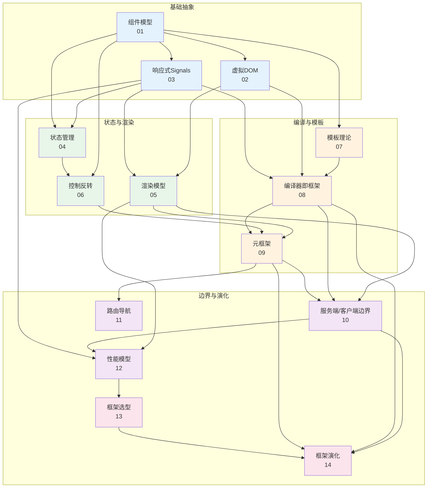
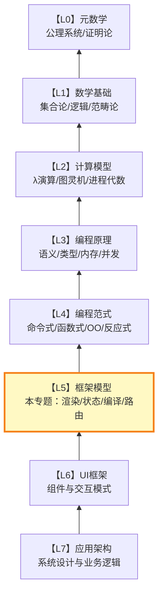

# 框架模型

## 专题概述

**框架模型**专题位于 Awesome JS/TS 理论体系的 **L4 层次**——在数学基础（L0）、计算模型（L1）、语言语义（L2）和编程范式（L3）之上，框架模型构成了现代前端开发的**工程抽象层**。如果说L3回答的是「程序员应当如何思考计算」，那么L4回答的是「前端框架如何封装和自动化这些思考」。

本专题的14篇文章系统剖析了当代前端框架的核心机制与理论模型。我们从组件的组合代数出发，深入虚拟DOM的diff算法复杂性、细粒度响应式的图论模型、状态管理的CRDT与事务语义、多种渲染模型的形式化对比，最终抵达编译时框架、元框架与服务端/客户端边界模糊化等前沿领域。每一篇文章都将框架API视为**形式化模型的工程投影**——React的Hooks不是「魔法」，而是代数效应的受限实现；Vue的Proxy响应式不是「黑盒」，而是依赖追踪图的形式化构造；Svelte的编译时优化不是「取巧」，而是将框架抽象下沉到构建阶段的必然演化。

理解L4层次的框架模型，对于前端工程师而言具有双重价值：在日常开发中，它帮助你建立对框架行为的精确心智模型，减少「试错式编程」；在架构决策中，它为你提供了评估框架优劣的理论标尺，使技术选型从「信仰之争」升级为「模型比较」。

---

## 专题内文件导航

### 组件与渲染基础（01-03）

| 编号 | 标题 | 简介 |
|------|------|------|
| [01](./01-component-model-theory.md) | 组件模型理论：从函数到组件 | 建立组件三元组的形式化定义（状态空间+输入接口+输出接口），推导组件的组合代数（顺序/并行/条件/迭代），映射到React函数组件、Vue SFC、Web Components和Angular装饰器模型的对比分析。 |
| [02](./02-virtual-dom-theory.md) | 虚拟DOM理论： reconciler 的算法本质 | 从树编辑距离与列表最长递增子序列算法出发，形式化分析React reconciler的时间复杂度与启发式策略，映射到真实DOM操作批处理、Key属性语义与并发渲染的底层机制。 |
| [03](./03-reactivity-signals-theory.md) | 响应式Signals理论：细粒度的图模型 | 建立响应式系统的依赖有向无环图（DAG）模型，分析推送/拉取/混合三种更新语义，映射到Vue 3 Proxy、Solid Signals、Svelte 5 Runes与Angular Signals的实现差异与性能特征。 |

### 状态与渲染架构（04-06）

| 编号 | 标题 | 简介 |
|------|------|------|
| [04](./04-state-management-theory.md) | 状态管理理论：从局部到全局的形式化 | 对比Flux架构、Elm Architecture与CRDT三种状态管理模型，分析状态一致性、时间旅行调试与乐观更新的形式化语义，映射到Redux、Zustand、Pinia、Jotai与TanStack Query的设计权衡。 |
| [05](./05-rendering-models.md) | 渲染模型：CSR、SSR、SSG与流式传输 | 形式化定义四种渲染模型的计算图与数据传输特性，分析首屏时间、交互时间与缓存策略的权衡空间，映射到Next.js、Nuxt、SvelteKit和Astro的渲染模式选择与混合渲染架构。 |
| [06](./06-control-inversion-theory.md) | 控制反转理论：好莱坞原则的数学表达 | 从依赖注入、事件驱动与回调反转三种IoC形式出发，建立控制流转移的形式化模型，映射到React的声明式渲染、Vue的选项式/组合式API对比与前端测试中的Mock/Stub机制。 |

### 模板与编译（07-09）

| 编号 | 标题 | 简介 |
|------|------|------|
| [07](./07-templating-theory.md) | 模板理论：从字符串到指令的形式化 | 分析模板语言的语法设计空间（mustache语法 vs JSX vs 编译时模板），建立模板到渲染函数的编译模型，映射到Vue模板编译器、Svelte编译时转换与JSX的Babel转换管线。 |
| [08](./08-compiler-as-framework.md) | 编译器即框架：消失的运行时 | 论证「框架能力从运行时向编译时迁移」的演化规律，分析编译时优化（常量提升、死代码消除、细粒度更新代码生成）的形式化收益，映射到Svelte、Solid、Vue Vapor Mode与Rust工具链（Oxc/SWC）的趋势。 |
| [09](./09-meta-framework-theory.md) | 元框架理论：框架之上的框架 | 建立元框架作为「约定优于配置」的系统化封装模型，分析路由、数据获取、构建优化与部署集成的抽象层级，映射到Next.js、Nuxt、SvelteKit、Remix和Astro的元框架设计哲学对比。 |

### 边界与演化（10-14）

| 编号 | 标题 | 简介 |
|------|------|------|
| [10](./10-server-client-boundary.md) | 服务端/客户端边界理论：界限的模糊与重构 | 形式化定义Server Components、Islands架构与Partial Hydration的计算边界模型，分析序列化约束、水合（Hydration）语义与交互延迟的权衡，映射到React RSC、Astro Islands、Qwik Resumability与Fresh架构。 |
| [11](./11-routing-navigation-theory.md) | 路由与导航理论：页面图的状态机 | 将前端路由建模为有限状态机与页面转换图，分析声明式路由、嵌套路由与动态路由的形式化语义，映射到React Router、Vue Router、TanStack Router与文件系统路由（Next.js/Nuxt）的实现机制。 |
| [12](./12-framework-performance-models.md) | 框架性能模型：度量的形式化框架 | 建立前端性能的形式化指标体系（FCP、LCP、TTI、INP、CLS），分析框架选择对各指标的理论影响边界，映射到真实场景的性能优化策略与框架级性能基准测试方法论。 |
| [13](./13-framework-selection-theory.md) | 框架选型理论：决策的形式化方法 | 将技术选型建模为多属性决策问题，建立框架评估的准则体系（性能、生态、学习曲线、团队匹配、长期维护），映射到AHP/TOPSIS决策方法在前端框架选型中的具体应用与常见认知偏差的识别。 |
| [14](./14-framework-evolution-patterns.md) | 框架演化模式：从运行时到编译时的长河 | 分析前端框架演化的长周期规律（抽象层次提升、封装边界移动、工具链下沉），预测2025-2030年的框架演化方向（AI生成、边缘渲染、WASM UI、跨平台统一），映射到当前主流框架的路线图分析。 |

---

## 知识关联图谱

14篇文章围绕「框架核心机制」形成如下知识网络：

---

## 学习路径建议

### 路径一：框架机制全景（推荐首次学习）

按编号顺序阅读01-14，建立从前端框架内部机制到选型决策的完整认知。适合希望「深入框架原理而非仅会使用API」的中高级前端开发者。

| 阶段 | 章节 | 核心目标 | 建议时长 |
|------|------|----------|----------|
| **组件与响应式** | 01-03 | 建立组件、虚拟DOM和响应式的形式化直觉 | 3周 |
| **状态与渲染** | 04-06 | 理解状态管理的架构模式与渲染模型的权衡空间 | 3周 |
| **编译与模板** | 07-09 | 掌握模板编译原理和编译时框架的设计哲学 | 2周 |
| **边界与选型** | 10-14 | 建立服务端/客户端边界的精确认知与框架选型方法论 | 3周 |

**总计**：约11周，每周投入6-8小时。

### 路径二：React生态深度（React开发者）

聚焦与React生态最相关的篇章，建立对React设计哲学的理论理解：

| 阅读组合 | 主题 | 对应React概念 |
|----------|------|---------------|
| 01 + 02 + 06 | 组件模型与虚拟DOM | 函数组件、reconciler、声明式渲染 |
| 03 + 04 + 05 | 响应式与状态管理 | useState、Context、Redux/Zustand、SSR/SSG |
| 07 + 08 + 10 | 模板、编译与服务端组件 | JSX编译、RSC、Islands |
| 12 + 13 + 14 | 性能、选型与演化 | Concurrent Features、框架对比、未来方向 |

### 路径三：Vue生态深度（Vue开发者）

聚焦Vue特有机制的理论根基：

| 阅读组合 | 主题 | 对应Vue概念 |
|----------|------|-------------|
| 01 + 03 + 07 | 组件、响应式与模板 | SFC、Proxy响应式、模板编译器 |
| 04 + 05 + 06 | 状态、渲染与控制流 | Pinia、Nuxt渲染模式、Options/Composition API |
| 08 + 09 + 11 | 编译优化与元框架 | Vapor Mode、Nuxt、Vue Router |
| 13 + 14 | 选型与演化 | Vue vs 竞品、路线图分析 |

### 路径四：架构师快速通道

跳过实现细节，聚焦框架设计的高级议题：

1. **读01**（组件模型）+ **读03**（响应式）+ **读04**（状态管理）：建立框架核心抽象的理解
2. **读05**（渲染模型）+ **读10**（服务端/客户端边界）：掌握现代全栈前端架构的权衡空间
3. **读08**（编译器即框架）+ **读09**（元框架）：理解行业演化方向
4. **读13**（框架选型）+ **读14**（框架演化）：建立技术决策与趋势判断能力

### 路径五：性能工程师专项

聚焦框架性能的理论基础与优化方法：

- 02（虚拟DOM算法复杂性）→ 03（Signals细粒度更新）→ 05（渲染模型对比）
- 08（编译时优化原理）→ 10（水合与Resumability）→ 12（性能指标体系）

---

## 前置知识要求

本专题假设读者已具备：

1. **至少一种主流前端框架的熟练使用**（React/Vue/Svelte/Angular，至少1年实际项目经验）
2. **编程范式（L3层次）的基础理解**，尤其是：
   - 函数式范式中的纯函数与高阶函数（`programming-paradigms/04-functional-paradigm.md`）
   - 反应式范式的数据流模型（`programming-paradigms/07-reactive-paradigm.md`）
   - 面向对象范式的封装与组合（`programming-paradigms/05-oop-paradigm.md`）
3. **JavaScript/TypeScript 运行时语义的基础知识**（事件循环、闭包、原型链）

:::tip 框架使用者和框架理解者的区别
能熟练使用React Hooks不等于理解其代数效应语义，能写Vue模板不等于理解其编译模型。本专题的目标是帮助你跨越从「使用者」到「理解者」的鸿沟。
:::

---

## 与相关专题的交叉引用

### 向下衔接：编程范式（L3层次）

框架模型（L4）是编程范式（L3）的工程投影：

- 函数式范式（`programming-paradigms/04-functional-paradigm.md`）的纯函数与不可变数据流是Redux/Zustand（04）和React组件模型（01）的设计基石
- 反应式范式（`programming-paradigms/07-reactive-paradigm.md`）的数据流图模型直接解释了Vue Signals（03）和RxJS风格的响应式状态管理
- 元编程范式（`programming-paradigms/10-metaprogramming-paradigm.md`）的代码生成思想是编译时框架（08）和模板编译器（07）的理论源头
- 并发范式（`programming-paradigms/08-concurrent-paradigm.md`）的CSP与Actor模型为理解React Concurrent Features和服务端/客户端边界（10）提供了并发思维框架

→ [前往编程范式专题](../programming-paradigms/)

### 向上衔接：应用设计（L5层次）

框架模型（L4）为应用架构（L5）提供了实现基础：

- 组件模型理论（01）直接指导设计系统中的组件拆分策略与API设计
- 状态管理理论（04）为大型应用的状态分层（本地/全局/服务端/URL）提供了形式化分析工具
- 渲染模型（05）和性能模型（12）是应用性能预算与优化决策的理论依据
- 元框架理论（09）解释了现代全栈应用的架构约定与文件系统组织模式

→ [前往应用设计专题](../application-design/)

### 横向关联：Svelte Signals 技术栈

框架模型中的编译时框架（08）和响应式Signals（03）与Svelte Signals技术栈专题深度交织：

- Svelte 5的Runes模型是编译时响应式（03 + 08）的工程极致体现
- SvelteKit作为元框架（09）展示了如何将编译时优化与全栈路由/数据获取集成
- Svelte的模板编译器（07）是「编译器即框架」理念（08）的最佳案例之一

→ [前往Svelte Signals技术栈专题](../svelte-signals-stack/)

---

## 核心概念速查表

| 概念 | 所在章节 | 一句话定义 |
|------|----------|-----------|
| 组件三元组 | 01 | 组件 = ⟨状态空间, 输入接口, 输出接口⟩ |
| Reconciliation | 02 | 通过最小化DOM操作集合将虚拟树同步到真实树的算法过程 |
| 最长递增子序列（LIS） | 02 | React列表diff中用于最小化节点移动次数的优化算法 |
| 依赖DAG | 03 | 响应式系统中信号与派生值之间的有向无环依赖图 |
| 推送 vs 拉取 | 03 | 推送（push）：数据变化主动通知订阅者；拉取（pull）：消费者按需读取最新值 |
| Flux架构 | 04 | 单向数据流模式：Action → Dispatcher → Store → View |
| CRDT | 04 | 无冲突复制数据类型，保证分布式状态最终一致性的数学结构 |
| CSR/SSR/SSG | 05 | 客户端渲染/服务端渲染/静态站点生成三种页面生成策略 |
| 水合（Hydration） | 05 | 将服务端渲染的静态HTML恢复为可交互客户端应用的过程 |
| 控制反转（IoC） | 06 | 将控制权从调用方转移到框架或容器的架构原则 |
| VDOM编译 | 07 | 将模板/JSX静态结构编译为直接DOM操作指令的优化技术 |
| 编译时框架 | 08 | 将框架逻辑从运行时库转移到构建步骤的框架设计哲学 |
| 元框架 | 09 | 集成路由、状态、构建、部署等子系统的「框架的框架」 |
| Resumability | 10 | Qwik提出的无需水合、从服务端状态直接恢复交互性的架构 |
| INP | 12 | Interaction to Next Paint，衡量交互响应性的核心Web指标 |

---

## 理论层次定位

本专题位于 **L4-L5 过渡带**——在编程范式的高层思维模式之上，框架模型提供了将这些模式自动化和系统化的工程机制。掌握这一层次，意味着你不仅能理解框架「如何工作」，更能预判框架「将向何处演化」——这是从「高级开发者」迈向「技术领导者」的关键跃迁。

---

## 要点总结

1. **框架模型专题覆盖L4-L5层次**：在编程范式的高层思维模式之上，提供将这些模式自动化和系统化的工程机制分析。

2. **14篇文章覆盖框架全生命周期**：从组件模型、虚拟DOM和响应式信号的基础机制，到状态管理、渲染模型和控制反转的架构设计，再到模板编译、编译时框架和元框架的演化趋势。

3. **形式化与工程并重**：每篇文章将框架API视为形式化模型的工程投影——Hooks是代数效应的受限实现，Proxy响应式是依赖DAG的构造，编译时框架是抽象层次下沉的必然演化。

4. **演化视角贯穿始终**：从运行时框架（React/Vue 2）到编译时框架（Svelte/Solid），从客户端渲染到服务端/客户端边界模糊化，框架模型专题揭示了前端技术演化的深层规律。

5. **与生态专题深度交织**：不仅向下衔接编程范式（L3）和向上衔接应用设计（L5），还与Svelte Signals技术栈专题存在丰富的横向交叉引用。

---

## 如何贡献

本专题持续迭代。如果你发现：

- 某种框架机制的理论模型可以进一步形式化或修正
- 新发布的框架特性（如React 19、Vue Vapor Mode、Svelte 6）需要新增理论分析
- 框架对比分析存在偏见或遗漏
- 性能基准数据需要更新

请在项目仓库提交Issue或PR，并标注`[framework-models]`前缀。

---

:::info 开始探索
准备好深入框架的算法本质了吗？→ [01 组件模型理论：从函数到组件](./01-component-model-theory.md)
:::
