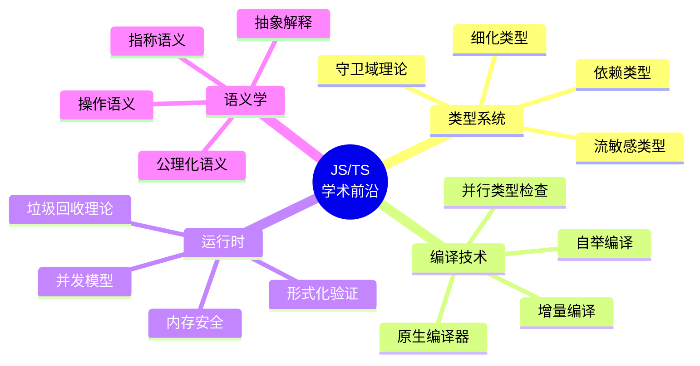
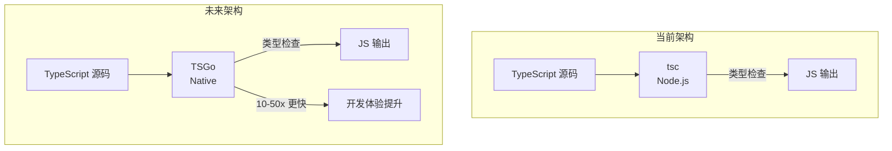
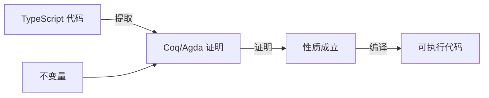

# 学术前沿导读 (10.7)

> 追踪 JavaScript/TypeScript 语言研究的前沿方向，从理论创新到工程实践的技术转移。

## 前沿方向概览



## 守卫域理论 (Guarded Domain Theory)

守卫域理论为**递归类型和自引用数据结构**提供了严格的数学基础，解决了传统域理论中自引用类型的存在性问题：

```mermaid
flowchart LR
    subgraph 传统域理论
        A[μX. F(X)] -->|无法保证| B[存在不动点]
    end
    subgraph 守卫域理论
        C[μX. F(X)] -->|守卫条件| D[保证不动点存在]
        D --> E[递归类型安全]
    end
```

**核心洞察**：通过在类型构造器 `F` 上施加"守卫"条件（guardedness），确保递归结构在有限步骤内展开为良基类型。

### 工程影响

| 理论贡献 | 工程应用 | 状态 |
|----------|----------|------|
| 递归类型安全性 | TypeScript 递归类型检查 | ✅ 已应用 |
| 守卫不动点 | 惰性数据结构类型 | 🔬 研究中 |
| 步骤索引逻辑 | 类型级自然数运算 | 🔬 研究中 |

## TypeScript 原生编译器 (TSGo)

TypeScript 团队正在开发**Go 语言重写的原生编译器**，目标是数量级的性能提升：



### 性能对比预期

| 操作 | tsc (Node.js) | TSGo (Native) | 加速比 |
|------|---------------|---------------|--------|
| 全量类型检查 | ~30s | ~1-3s | 10-30x |
| 增量类型检查 | ~3s | ~0.1s | 30x |
| 自举编译 | ~5min | ~10s | 30x |
| 内存占用 | ~2GB | ~200MB | 10x |

**技术要点**：

- Go 语言的 GC 与 TS 类型系统的内存模型天然匹配
- 并行类型检查利用多核 CPU
- 增量编译利用 Go 的并发原语
- 保持语言语义 100% 兼容

## 形式化验证

将 TypeScript 类型系统与**证明助手**（如 Coq、Agda）连接，实现代码的形式化验证：



### 研究方向

| 方向 | 描述 | 代表性工作 |
|------|------|------------|
| 类型提取 | 从 TS 类型生成形式化规约 | ts2hc、TSToCoq |
| 运行时验证 | 将类型约束转化为运行时断言 | ts-runtime-checks |
| 效果系统 | 追踪副作用的形式化描述 | EffTS |
| 精炼类型 | 将谓词逻辑嵌入类型 | LiquidTS |

## 核心文档

| 文档 | 主题 | 文件 |
|------|------|------|
| 守卫域理论 | 递归类型的数学基础 | [查看](../../10-fundamentals/10.7-academic-frontiers/guarded-domain-theory.md) |
| TSGo 原生编译器 | TypeScript 编译器重写 | [查看](../../10-fundamentals/10.7-academic-frontiers/tsgo-native-compiler.md) |

## 交叉引用

- **[理论前沿 / 范畴论](/theoretical-foundations/cat-01-category-theory-primer)** — 类型理论的数学基础
- **[理论前沿 / 认知交互模型](/theoretical-foundations/cog-01-cognitive-science-primer)** — 编程认知科学
- **[编程原则 / 抽象解释](/programming-principles/07-abstract-interpretation)** — 程序分析的静态技术
- **[编程原则 / 类型论基础](/programming-principles/03-type-theory-fundamentals)** — 类型系统的形式化理论

---

 [← 返回首页](/)
