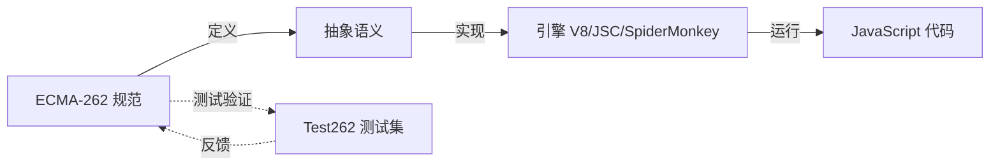
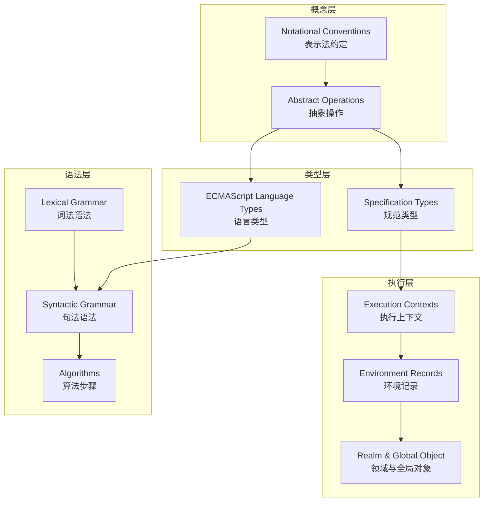
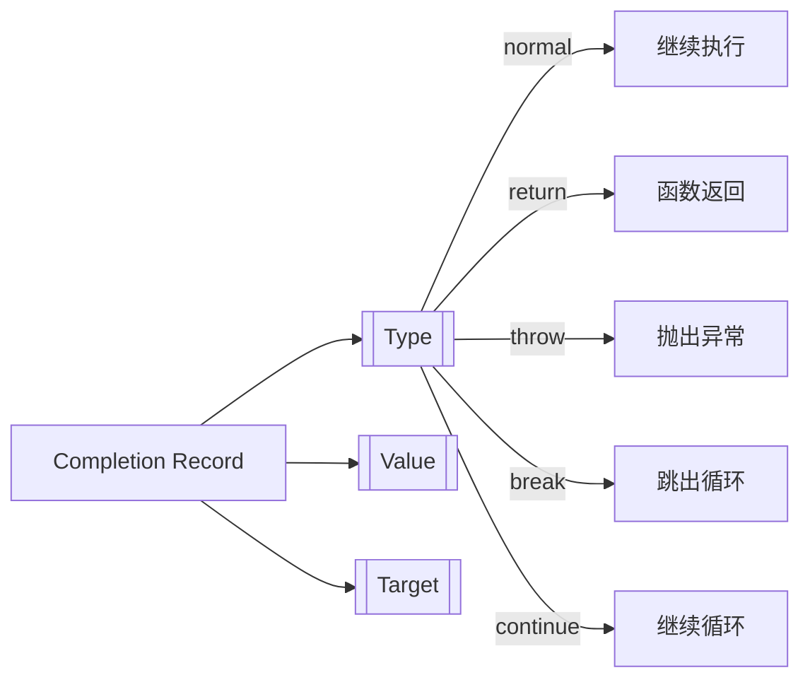
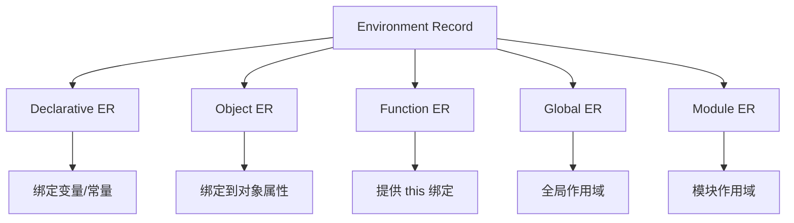

# ECMAScript 规范导读 (10.6)

> 掌握阅读 ECMA-262 规范的方法论，理解抽象操作、规范类型和算法表示法，建立从规范到实现的完整认知链路。

## 规范是什么？为什么读它？

ECMA-262 是 JavaScript 语言的**唯一权威定义**。与教程、博客不同，规范描述的是语言应该如何工作，而非实际实现：

| 来源 | 描述的是 | 可靠性 | 适用场景 |
|------|----------|--------|----------|
| ECMA-262 规范 | 语言**应当**如何工作 | ⭐⭐⭐⭐⭐ | 边界行为、歧义消除 |
| MDN | 语言**通常**如何工作 | ⭐⭐⭐⭐ | 日常使用、快速查询 |
| V8 源码 | 语言**实际**如何工作 | ⭐⭐⭐⭐ | 性能分析、实现细节 |



## 规范的结构层次

ECMA-262 采用**分层组织**，从抽象概念到具体算法：



## 核心概念速查

### 抽象操作 (Abstract Operations)

规范使用**伪代码风格的抽象操作**描述语义，例如 `ToPrimitive`、`OrdinaryGetPrototypeOf`：

```
ToPrimitive ( input [ , preferredType ] )

1. Assert: input is an ECMAScript language value.
2. If Type(input) is Object, then
   a. Let exoticToPrim be ? GetMethod(input, @@toPrimitive).
   b. If exoticToPrim is not undefined, then
      i. Let result be ? Call(exoticToPrim, input, « hint »).
      ii. If Type(result) is not Object, return result.
      iii. Throw a TypeError exception.
   c. If preferredType is not present, let hint be "default".
   d. Else if preferredType is string, let hint be "string".
   e. Else, let hint be "number".
   f. Return ? OrdinaryToPrimitive(input, hint).
3. Return input.
```

**符号速查**：

| 符号 | 含义 | 示例 |
|------|------|------|
| `?` | 若操作抛出异常，立即传播 | `? Call(func, arg)` |
| `!` | 断言操作不会抛出异常 | `! DefinePropertyOrThrow(...)` |
| `« »` | 列表字面量 | `« "a", "b" »` |
| `ReturnIfAbrupt` | 若参数为 abrupt completion，立即返回 | `ReturnIfAbrupt(x)` |

### Completion Records（完成记录）

规范中所有语句的执行结果都是一个**Completion Record**：



| Type | 语义 | JS 对应 |
|------|------|---------|
| `normal` | 正常完成 | 语句顺序执行 |
| `return` | 返回 | `return` 语句 |
| `throw` | 抛出异常 | `throw` 语句 |
| `break` | 中断 | `break` 语句 |
| `continue` | 继续 | `continue` 语句 |

### Environment Records（环境记录）



## 阅读规范的方法论

### 步骤 1：定位目标


### 步骤 2：理解算法

以 `Array.prototype.map` 为例：

1. 在规范中搜索 `Array.prototype.map`
2. 找到算法定义，理解参数处理
3. 追踪 `ToObject`、`LengthOfArrayLike` 等抽象操作
4. 理解回调函数的调用方式（`Call(callbackfn, T, « kValue, k, O »)`）
5. 注意边界情况（稀疏数组、thisArg、返回新数组）

### 步骤 3：验证理解

```javascript
// 验证：map 跳过缺失元素
const arr = [1, , 3]; // 稀疏数组，索引 1 缺失
const result = arr.map(x => x * 2);
console.log(result); // [2, &lt;1 empty item&gt;, 6]
// 注意：结果也是稀疏的！
```

## 核心文档

| 文档 | 主题 | 文件 |
|------|------|------|
| 抽象操作 | 规范中的核心算法 | [查看](../../10-fundamentals/10.6-ecmascript-spec/abstract-operations.md) |
| 规范算法 | 算法表示法详解 | [查看](../../10-fundamentals/10.6-ecmascript-spec/spec-algorithms.md) |
| Completion Records | 完成记录机制 | [查看](../../10-fundamentals/10.6-ecmascript-spec/completion-records.md) |
| Temporal API Stage 4 | 时间 API 规范 | [查看](../../10-fundamentals/10.6-ecmascript-spec/temporal-api-stage4.md) |

## 代码示例

| 示例 | 主题 | 文件 |
|------|------|------|
| 01 | 抽象操作 | [查看](../../10-fundamentals/10.6-ecmascript-spec/code-examples/01-abstract-operations.md) |
| 02 | 规范类型 | [查看](../../10-fundamentals/10.6-ecmascript-spec/code-examples/02-specification-types.md) |
| 03 | 内部方法与槽 | [查看](../../10-fundamentals/10.6-ecmascript-spec/code-examples/03-internal-methods-slots.md) |
| 04 | Completion Records | [查看](../../10-fundamentals/10.6-ecmascript-spec/code-examples/04-completion-records.md) |
| 05 | 环境记录 | [查看](../../10-fundamentals/10.6-ecmascript-spec/code-examples/05-environment-records.md) |
| 06 | Realm 与全局对象 | [查看](../../10-fundamentals/10.6-ecmascript-spec/code-examples/06-realm-and-global-object.md) |

## 交叉引用

- **[语言语义深入解析](./language-semantics)** — 规范的语言学基础
- **[执行模型深入解析](./execution-model)** — 规范的实现映射
- **[编程原则 / 操作语义](/programming-principles/04-operational-semantics)** — 形式语义学的理论基础
- **[编程原则 / 指称语义](/programming-principles/05-denotational-semantics)** — 规范的形式化方法

---

 [← 返回首页](/)
